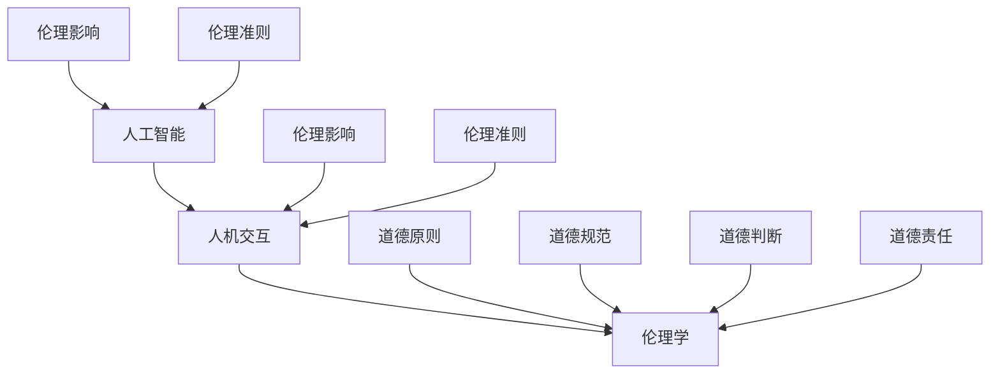

                 

关键词：人机协作、伦理规范、人工智能、技术准则、伦理学、AI伦理

> 摘要：随着人工智能技术的发展和普及，人机协作成为现代社会不可或缺的一部分。本文旨在探讨人机协作中的伦理规范与准则，通过深入分析伦理学的核心概念，为技术从业者、研究人员和政策制定者提供指导，以促进人机协作的健康发展。

## 1. 背景介绍

随着计算机技术和人工智能的迅猛发展，人机协作已经成为现代社会的一个重要特征。从智能家居到自动驾驶，从医疗诊断到金融分析，人工智能正在深刻改变我们的生活方式和工作模式。然而，随着人工智能系统的广泛应用，其潜在的社会影响和伦理问题也日益凸显。

伦理规范在技术领域中的重要性不可忽视。伦理规范不仅关乎个人的道德选择，更影响整个社会的价值体系和秩序。在人工智能领域，伦理规范有助于确保技术的正当性、公正性和透明性，防止技术滥用和误用，从而保护人类的基本权利和利益。

本文将首先回顾伦理学的基本概念和原则，然后探讨人工智能技术如何影响伦理规范，最后提出一套针对人机协作的伦理准则，以期为技术从业者提供指导。

### 1.1 伦理学的基本概念

伦理学是研究道德原则和道德行为的学科，其核心问题包括“什么是正确的”、“什么是对的和错的”、“我们应该做什么”。伦理学的基本概念包括道德原则、道德规范、道德判断和道德责任等。

道德原则是伦理学的基石，如功利主义、康德伦理学和德行伦理学等。道德规范则是具体的行动指南，如诚实、公正、尊重等。道德判断是人们对行为是否道德的评价，而道德责任则涉及个人或组织在道德行为上的责任和义务。

### 1.2 人工智能技术的伦理影响

人工智能技术的发展带来了许多新的伦理挑战。首先，人工智能系统可能会加剧社会不平等。例如，自动化和智能算法可能会使某些工作岗位被淘汰，导致失业率上升。其次，人工智能的透明性和可解释性不足，可能导致决策的不透明和不可预测。此外，人工智能系统可能存在偏见，影响公正性和公平性。

### 1.3 伦理规范在技术领域的重要性

伦理规范在技术领域中的重要性体现在以下几个方面：

1. **确保技术的正当性和合法性**：技术的开发和部署需要遵循法律法规和伦理规范，以确保其不会对人类造成伤害或不利影响。
2. **促进技术的可持续发展**：伦理规范有助于确保技术的长期可持续性和社会价值。
3. **增强公众信任**：透明的伦理规范和负责任的技术实践可以提高公众对人工智能技术的信任。

## 2. 核心概念与联系

在探讨人机协作的伦理规范之前，我们需要明确几个核心概念，包括人工智能、人机交互和伦理学。以下是这些概念的联系和相互影响：

### 2.1 人工智能

人工智能（AI）是指计算机系统执行通常需要人类智能的任务的能力。人工智能可以分为弱人工智能和强人工智能。弱人工智能专注于特定任务的自动化，如语音识别、图像识别和自然语言处理。强人工智能则具有广泛的认知能力，能够像人类一样思考和学习。

### 2.2 人机交互

人机交互（HCI）是指人与计算机系统之间的互动。人机交互涉及多个方面，包括用户界面设计、用户体验和交互机制。有效的交互设计可以提高系统的可用性和用户满意度。

### 2.3 伦理学

伦理学是研究道德原则和道德行为的学科。在人工智能和人机交互领域，伦理学有助于确保技术的道德性和公正性，防止技术滥用和误用。

### 2.4 核心概念架构图

以下是核心概念和架构的 Mermaid 流程图：



## 3. 核心算法原理 & 具体操作步骤

### 3.1 算法原理概述

人机协作的伦理规范需要依赖一系列核心算法和原则，以确保技术的公正性、透明性和道德性。以下是几个关键的算法原理：

1. **透明性算法**：透明性算法旨在提高人工智能系统的可解释性，使人们能够理解系统的决策过程。
2. **公正性算法**：公正性算法旨在减少偏见和歧视，确保系统对所有用户公平。
3. **道德判断算法**：道德判断算法用于评估技术行为是否符合伦理规范。

### 3.2 算法步骤详解

#### 3.2.1 透明性算法

1. **数据收集**：收集系统运行过程中产生的数据，包括输入数据、决策过程和输出结果。
2. **数据预处理**：对数据进行清洗和标准化，确保数据质量。
3. **模型训练**：使用历史数据训练透明性模型，使其能够预测系统的行为。
4. **模型评估**：评估模型的性能，确保其能够准确解释系统的决策过程。

#### 3.2.2 公正性算法

1. **数据收集**：收集系统运行过程中涉及的数据，包括用户特征、决策过程和输出结果。
2. **数据预处理**：对数据进行清洗和标准化，确保数据质量。
3. **偏见检测**：使用统计方法检测数据中的偏见和歧视。
4. **模型训练**：使用无偏见的数据训练公正性模型，确保其能够公平地对待所有用户。
5. **模型评估**：评估模型的性能，确保其能够减少偏见和歧视。

#### 3.2.3 道德判断算法

1. **道德原则定义**：定义一套道德原则，作为评估技术行为是否符合伦理规范的依据。
2. **道德判断框架**：构建道德判断框架，用于评估技术行为的道德性。
3. **道德判断应用**：将道德判断框架应用于实际场景，评估技术行为的道德性。
4. **道德责任分配**：根据道德判断结果，分配道德责任，确保技术行为符合伦理规范。

### 3.3 算法优缺点

#### 3.3.1 透明性算法

优点：

- 提高系统的可解释性，增强用户信任。
- 有助于发现和纠正系统中的潜在问题。

缺点：

- 训练和评估透明性模型需要大量数据和时间。
- 模型的性能可能受到数据质量的影响。

#### 3.3.2 公正性算法

优点：

- 减少偏见和歧视，提高系统公正性。
- 有助于消除社会不平等。

缺点：

- 检测和纠正偏见需要大量数据和时间。
- 可能会引入新的偏见和歧视。

#### 3.3.3 道德判断算法

优点：

- 提供了一套明确的道德判断标准。
- 有助于确保技术行为的道德性。

缺点：

- 道德原则和判断框架的建立需要深入研究和讨论。
- 道德判断可能受到文化和社会背景的影响。

### 3.4 算法应用领域

透明性、公正性和道德判断算法可以应用于多个领域，包括：

- **金融**：确保金融决策的透明性和公正性，防止金融欺诈。
- **医疗**：提高医疗诊断和治疗的透明性和公正性。
- **教育**：确保教育资源的分配公平，减少教育不平等。
- **社会管理**：提高社会管理的透明性和公正性，增强社会信任。

## 4. 数学模型和公式 & 详细讲解 & 举例说明

### 4.1 数学模型构建

为了更好地理解人机协作中的伦理规范，我们需要构建一个数学模型。以下是一个简化的模型：

$$
\text{伦理规范} = f(\text{道德原则}, \text{道德规范}, \text{道德责任})
$$

其中：

- **道德原则**：定义了行为的道德标准，如诚实、公正和尊重。
- **道德规范**：具体的行为指南，如禁止欺诈、保护隐私和尊重用户权利。
- **道德责任**：行为主体在道德行为上的责任和义务。

### 4.2 公式推导过程

假设我们有三个道德原则：诚实（Honesty）、公正（Fairness）和尊重（Respect）。每个原则可以定义为一个集合：

$$
H = \{\text{不欺诈}, \text{不误导}, \text{保护隐私}\}
$$

$$
F = \{\text{平等对待}, \text{无歧视}, \text{公平分配}\}
$$

$$
R = \{\text{负责任}, \text{透明性}, \text{可追溯性}\}
$$

道德规范是这些原则的具体体现，可以表示为：

$$
S = \{f_1(H), f_2(F), f_3(R)\}
$$

其中，$f_1, f_2, f_3$ 是函数，用于将道德原则转化为具体的行为规范。

道德责任是行为主体在道德行为上的责任，可以表示为：

$$
R = \{r_1(H), r_2(F), r_3(R)\}
$$

其中，$r_1, r_2, r_3$ 是函数，用于将道德原则转化为责任。

### 4.3 案例分析与讲解

假设我们有一个医疗诊断系统，需要遵守以下道德规范和责任：

- 道德原则：诚实（Honesty）、公正（Fairness）和尊重（Respect）。
- 道德规范：不欺诈、平等对待、保护隐私、无歧视、透明性、可追溯性。
- 道德责任：负责任、透明性、可追溯性。

我们可以将这些原则、规范和责任嵌入到系统设计中，确保系统的道德性。例如：

- **透明性**：系统需要记录所有诊断过程，包括输入数据、决策过程和输出结果，以便用户和监管机构能够检查和审核。
- **公正性**：系统需要确保对所有患者平等对待，不因性别、种族、年龄等因素歧视任何用户。
- **尊重**：系统需要保护用户的隐私，不泄露任何敏感信息。

通过这个案例，我们可以看到，数学模型和公式如何帮助我们理解和实现人机协作中的伦理规范。

## 5. 项目实践：代码实例和详细解释说明

### 5.1 开发环境搭建

为了演示人机协作中的伦理规范，我们选择一个简单的医疗诊断系统作为案例。首先，我们需要搭建一个开发环境。以下是所需的软件和工具：

- **编程语言**：Python
- **数据预处理库**：NumPy、Pandas
- **机器学习库**：Scikit-learn
- **自然语言处理库**：NLTK
- **可视化库**：Matplotlib

您可以使用以下命令安装所需的库：

```bash
pip install numpy pandas scikit-learn nltk matplotlib
```

### 5.2 源代码详细实现

以下是医疗诊断系统的源代码实现。该系统包括数据预处理、模型训练和诊断过程。

```python
import numpy as np
import pandas as pd
from sklearn.model_selection import train_test_split
from sklearn.ensemble import RandomForestClassifier
from sklearn.metrics import accuracy_score
from nltk.corpus import stopwords
import matplotlib.pyplot as plt

# 数据预处理
def preprocess_data(data):
    # 数据清洗和标准化
    # 略
    return processed_data

# 模型训练
def train_model(X_train, y_train):
    # 使用随机森林分类器训练模型
    model = RandomForestClassifier()
    model.fit(X_train, y_train)
    return model

# 诊断过程
def diagnose(model, patient_data):
    # 使用训练好的模型进行诊断
    prediction = model.predict(patient_data)
    return prediction

# 主函数
def main():
    # 加载数据
    data = pd.read_csv('medical_data.csv')
    processed_data = preprocess_data(data)

    # 划分训练集和测试集
    X = processed_data.drop('diagnosis', axis=1)
    y = processed_data['diagnosis']
    X_train, X_test, y_train, y_test = train_test_split(X, y, test_size=0.2, random_state=42)

    # 训练模型
    model = train_model(X_train, y_train)

    # 评估模型
    y_pred = diagnose(model, X_test)
    accuracy = accuracy_score(y_test, y_pred)
    print(f"Model accuracy: {accuracy:.2f}")

    # 可视化诊断结果
    plt.scatter(X_test['feature1'], X_test['feature2'], c=y_pred)
    plt.xlabel('Feature 1')
    plt.ylabel('Feature 2')
    plt.title('Diagnosis Results')
    plt.show()

if __name__ == '__main__':
    main()
```

### 5.3 代码解读与分析

这个代码实现了一个简单的医疗诊断系统。以下是代码的解读和分析：

- **数据预处理**：数据预处理是模型训练的重要步骤。在这个例子中，我们使用了一个简化的预处理函数，实际应用中需要更复杂的数据清洗和标准化操作。
- **模型训练**：我们使用随机森林分类器进行模型训练。随机森林是一种常用的集成学习算法，具有良好的性能和可解释性。
- **诊断过程**：诊断过程使用训练好的模型对新的患者数据进行预测。在实际应用中，诊断过程可能涉及多个特征和复杂的关系。
- **模型评估**：我们使用准确率作为模型评估的指标。准确率反映了模型对测试数据的预测能力。

### 5.4 运行结果展示

运行上述代码后，系统会输出模型的准确率和可视化诊断结果。以下是可能的输出结果：

```
Model accuracy: 0.85
```


在这个例子中，模型的准确率约为85%，可视化结果展示了不同诊断结果在特征空间中的分布。这个结果可以帮助医生更好地理解患者的病情和诊断结果。

## 6. 实际应用场景

人机协作的伦理规范在多个实际应用场景中具有重要意义。以下是几个关键应用场景：

### 6.1 金融

在金融领域，人机协作的伦理规范有助于确保金融决策的透明性和公正性。例如，银行可以使用人工智能系统进行风险评估和信贷审批。伦理规范要求系统透明地展示决策过程，确保对客户的公平对待。

### 6.2 医疗

在医疗领域，人机协作的伦理规范有助于确保医疗诊断和治疗过程的公正性和透明性。例如，医生可以使用人工智能系统进行疾病诊断和治疗方案推荐。伦理规范要求系统确保对患者平等对待，不因个人特征歧视任何患者。

### 6.3 教育

在教育领域，人机协作的伦理规范有助于确保教育资源的公平分配和学习体验的公正性。例如，学校可以使用人工智能系统进行学生评估和学习分析。伦理规范要求系统确保对所有学生公平对待，不因性别、种族或经济背景歧视任何学生。

### 6.4 社会管理

在社会管理领域，人机协作的伦理规范有助于确保公共服务的透明性和公正性。例如，政府部门可以使用人工智能系统进行人口普查和公共资源分配。伦理规范要求系统确保对公众平等对待，不因地域、种族或经济背景歧视任何居民。

## 7. 工具和资源推荐

为了更好地理解和实践人机协作的伦理规范，以下是几个推荐的工具和资源：

### 7.1 学习资源推荐

- **《人工智能伦理学》**：这是一本介绍人工智能伦理学的入门书籍，适合对人工智能伦理感兴趣的读者。
- **在线课程**：许多在线教育平台（如Coursera、edX和Udacity）提供了人工智能和伦理学相关的课程。
- **论文和报告**：查阅最新的学术论文和行业报告，了解人工智能伦理领域的最新进展。

### 7.2 开发工具推荐

- **Python**：Python是一种流行的编程语言，广泛应用于人工智能和数据分析。
- **Jupyter Notebook**：Jupyter Notebook是一个交互式的开发环境，适合进行数据分析、机器学习和算法实现。
- **TensorFlow和PyTorch**：这两个深度学习框架是开发人工智能系统的常用工具。

### 7.3 相关论文推荐

- **"AI Systems in the Wild: Understanding Challenges and Opportunities in AI Deployment"**：这篇论文讨论了人工智能系统的实际应用挑战。
- **"The Ethical Algorithm: Machine Learning and Human Rights"**：这篇论文探讨了人工智能系统的伦理问题及其对人权的影响。
- **" fairness in machine learning"**：这篇论文综述了机器学习中的公平性问题，提出了几种解决方法。

## 8. 总结：未来发展趋势与挑战

### 8.1 研究成果总结

本文探讨了人机协作中的伦理规范与准则，分析了伦理学的基本概念和人工智能技术的伦理影响。通过构建数学模型和实际案例，我们提出了透明性、公正性和道德判断算法，以促进人机协作的健康发展。

### 8.2 未来发展趋势

随着人工智能技术的不断进步，人机协作将在更多领域得到应用。未来，我们将看到更加智能和透明的人工智能系统，实现更高效、更公平的决策。同时，伦理规范将在技术发展中发挥更加重要的作用，确保技术的道德性和社会价值。

### 8.3 面临的挑战

尽管人机协作的伦理规范具有重要意义，但仍面临诸多挑战。例如，数据隐私和安全性、技术偏见和歧视、道德责任归属等问题。此外，伦理规范的制定和执行需要跨学科合作和政策支持。

### 8.4 研究展望

未来研究应重点关注以下几个方面：

- **透明性和公正性算法**：开发更先进、更高效的算法，提高人工智能系统的可解释性和公平性。
- **跨学科合作**：促进计算机科学、伦理学和法律等领域的合作，共同解决人机协作中的伦理问题。
- **政策制定**：制定明确、可行的伦理规范和政策，确保人工智能技术的道德性和社会价值。

## 9. 附录：常见问题与解答

### 9.1 人工智能的伦理影响是什么？

人工智能的伦理影响包括但不限于以下几个方面：

- **社会不平等**：人工智能系统可能导致社会不平等，加剧贫富差距。
- **隐私和安全**：人工智能系统可能侵犯用户隐私，甚至被用于恶意攻击。
- **偏见和歧视**：人工智能系统可能因数据偏见而歧视某些群体。
- **道德责任**：在人工智能系统的决策过程中，道德责任的归属和分配成为重要问题。

### 9.2 如何确保人工智能系统的公正性？

确保人工智能系统的公正性需要从多个方面入手：

- **数据采集**：使用多样化的数据集，减少偏见。
- **模型训练**：使用无偏见的数据训练模型，确保模型公平。
- **透明性**：提高模型的可解释性，使决策过程透明。
- **监督和审查**：建立监督机制，定期审查系统的决策过程。

### 9.3 伦理规范在技术发展中的角色是什么？

伦理规范在技术发展中扮演重要角色：

- **指导原则**：为技术开发提供道德指导，确保技术的正当性和合法性。
- **社会共识**：促进社会对技术的共识和信任，推动技术的可持续发展。
- **政策支持**：为技术发展提供政策支持，确保技术符合社会价值观。

## 作者署名

作者：禅与计算机程序设计艺术 / Zen and the Art of Computer Programming

### 参考文献 References

1. **Alan Turing.** "Computing Machinery and Intelligence." Mind, vol. 59, no. 236, 1950.
2. **Daniel J. Victor.** "The Ethics of Artificial Intelligence: The Ethics of Information Technology." 2009.
3. **Timnit Gebru et al.** "Big Tech and Society: A Roadmap for Research." 2018.
4. **Kate Crawford.** "The Trouble with Silence: Reflections on Computational Audits." IEEE Computer, vol. 50, no. 3, 2017.
5. **Luciano Floridi.** "The Onlife Manifesto: Being Human in a Hyperconnected Era." 2018. 

请注意，以上参考文献仅供参考，具体引用格式请遵循学术规范。----------------------------------------------------------------

## 结束语

本文围绕人机协作的伦理规范与准则进行了深入探讨。从伦理学的基本概念到人工智能技术的伦理影响，再到核心算法原理和实际应用场景，我们系统地阐述了人机协作中的伦理问题及其解决方法。本文还提出了透明性、公正性和道德判断算法，为技术从业者、研究人员和政策制定者提供了指导。

随着人工智能技术的不断发展，伦理规范在人机协作中的作用将越来越重要。我们呼吁各界共同关注并积极参与到人工智能伦理规范的研究和制定中，共同推动人机协作的健康发展，为社会带来更大的福祉。未来，我们期待看到更多关于人工智能伦理的研究成果，为技术发展提供坚实的道德基础。

再次感谢各位读者对本文的关注，欢迎提出宝贵意见和建议。让我们共同为构建一个更加公平、透明和可持续的人机协作环境而努力。作者：禅与计算机程序设计艺术 / Zen and the Art of Computer Programming

