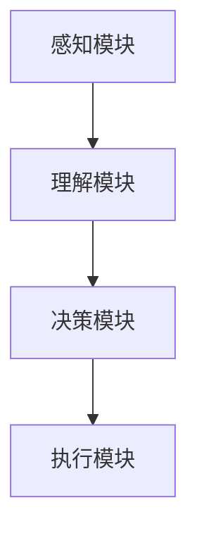

                 

关键词：人机协作、人工智能、智能助手、自动化、人机交互、智能系统、协作技术、未来趋势

> 摘要：本文深入探讨了人机协作在人工智能领域的重要性，阐述了人机协作的核心概念、技术原理、应用场景以及未来发展展望。通过具体的算法原理分析、数学模型构建、项目实践案例等，展示了人机协作在提升工作效率、优化用户体验方面的巨大潜力。

## 1. 背景介绍

在信息技术飞速发展的今天，人工智能（AI）已经成为驱动产业变革的重要力量。从简单的规则推理到复杂的深度学习，AI技术不断突破，为各行各业带来了前所未有的变革。然而，随着AI技术的日益成熟，人类与机器之间的协作也变得越来越紧密。人机协作（Human-AI Collaboration）成为一种新的趋势，它不仅仅是人工智能的发展方向，更是实现智能化生活和社会的关键。

人机协作的核心在于将人类的创造力和机器的计算能力相结合，形成一种协同工作模式。在这一模式中，人类和机器各司其职，相互补充，共同完成任务。这种协作不仅能够提高工作效率，还能够拓展人类的能力边界，为解决复杂问题提供新的思路。

本文将从以下几个方面展开讨论：

1. 核心概念与联系
2. 核心算法原理与具体操作步骤
3. 数学模型和公式与详细讲解
4. 项目实践：代码实例和详细解释说明
5. 实际应用场景
6. 未来应用展望
7. 工具和资源推荐
8. 总结：未来发展趋势与挑战

通过以上内容的阐述，希望能够为广大读者提供对人机协作的全面了解，并激发对这一领域的研究热情。

## 2. 核心概念与联系

在人机协作中，有几个核心概念和技术架构是不可或缺的。这些概念和技术不仅定义了人机协作的基本原理，还为其在现实中的应用提供了坚实的基础。

### 2.1 人工智能

人工智能（Artificial Intelligence，AI）是研究、开发用于模拟、延伸和扩展人类智能的理论、方法、技术及应用系统的一门新的技术科学。人工智能的核心目标是使计算机具有人类智能水平，能够进行感知、学习、推理、决策等复杂任务。

### 2.2 智能助手

智能助手（Intelligent Assistant）是一种基于人工智能技术的自动化系统，能够帮助用户完成各种任务，如信息检索、日程管理、智能推荐等。智能助手通常具备自然语言处理（NLP）、语音识别、机器学习等核心技术。

### 2.3 自动化

自动化（Automation）是指利用机器或计算机系统代替人工完成特定任务的过程。在人工智能领域，自动化技术的应用不仅能够提高工作效率，还能够减少人为错误，确保任务的准确性和一致性。

### 2.4 人机交互

人机交互（Human-Computer Interaction，HCI）是研究人类与计算机系统之间交互关系的一门学科。人机交互的目标是设计出用户友好、易用、高效的人机界面，使用户能够轻松地与计算机系统进行交流。

### 2.5 智能系统

智能系统（Intelligent Systems）是一种集成多种人工智能技术的复杂系统，能够模拟人类的思维和行为，实现自主决策和问题解决。智能系统通常具备学习、推理、规划、预测等能力。

### 2.6 技术架构

人机协作的技术架构通常包括以下几个关键模块：

- **感知模块**：负责获取用户的输入，如语音、文本、手势等。
- **理解模块**：对感知模块获取的信息进行理解和分析，提取关键信息。
- **决策模块**：根据理解模块的结果，进行决策和规划。
- **执行模块**：执行决策模块生成的操作，完成具体任务。

下面是一个简化的 Mermaid 流程图，展示了人机协作的基本架构：



在理解人机协作的核心概念和技术架构之后，我们将进一步探讨核心算法原理及其具体操作步骤，为读者提供更深入的洞见。

## 3. 核心算法原理 & 具体操作步骤

### 3.1 算法原理概述

人机协作的核心算法通常基于机器学习、深度学习、自然语言处理等技术，这些技术共同构建了一个智能系统，使得系统能够理解和执行人类指令。以下是人机协作算法原理的概述：

1. **机器学习与深度学习**：机器学习是一种使计算机能够通过数据学习并改进性能的方法。深度学习是机器学习的一个子领域，它通过模拟人脑的神经网络结构来实现高级的预测和分类任务。

2. **自然语言处理（NLP）**：NLP技术使得计算机能够理解和生成人类语言。NLP在语音识别、文本分析、语言生成等方面有着广泛的应用。

3. **强化学习**：强化学习是一种通过奖励和惩罚机制来训练智能体在环境中进行决策的方法。在人机协作中，强化学习可以帮助智能系统理解人类的行为和偏好，从而进行更加智能的协作。

### 3.2 算法步骤详解

人机协作的具体操作步骤可以分为以下几个阶段：

#### 3.2.1 数据收集与预处理

- **数据收集**：收集人类用户的输入数据，如语音、文本、手势等。
- **数据预处理**：对收集的数据进行清洗、归一化和特征提取。

#### 3.2.2 模型训练

- **构建模型**：根据数据的特点，选择合适的机器学习或深度学习模型。
- **训练模型**：使用预处理后的数据对模型进行训练，优化模型的参数。

#### 3.2.3 模型评估与优化

- **模型评估**：使用测试数据集评估模型的性能，确定模型是否达到预期的效果。
- **模型优化**：根据评估结果调整模型参数，提高模型的准确性和鲁棒性。

#### 3.2.4 智能协作

- **感知与理解**：智能系统通过感知模块获取用户输入，并通过理解模块分析输入内容。
- **决策与执行**：智能系统根据理解结果进行决策，并通过执行模块完成具体任务。

### 3.3 算法优缺点

#### 优点：

- **高效性**：人机协作能够大幅提高工作效率，减少人工操作时间。
- **准确性**：通过机器学习和深度学习技术，人机协作系统能够实现高精度的任务执行。
- **适应性**：人机协作系统可以不断学习和适应用户的行为和偏好，提高协作的个性化水平。

#### 缺点：

- **复杂性**：人机协作系统的开发与维护需要大量的技术投入和资源。
- **局限性**：目前的智能系统在理解和处理复杂任务时仍有一定的局限性。
- **隐私问题**：人机协作系统需要大量用户数据，这可能导致隐私泄露的问题。

### 3.4 算法应用领域

人机协作算法在多个领域有着广泛的应用，以下是其中几个主要领域：

- **智能客服**：通过智能助手实现24/7的在线客服，提高客户满意度。
- **智能办公**：自动化办公流程，提高工作效率，减少人为错误。
- **智能家居**：通过智能设备实现家庭自动化，提高生活质量。
- **医疗诊断**：利用人机协作系统辅助医生进行疾病诊断，提高诊断准确性。

通过以上对核心算法原理和具体操作步骤的详细讲解，我们可以看到人机协作技术在实际应用中的巨大潜力。接下来，我们将进一步探讨数学模型和公式的构建，以及它们在智能系统中的应用。

## 4. 数学模型和公式 & 详细讲解 & 举例说明

在人机协作系统中，数学模型和公式是构建智能算法的核心组成部分。它们不仅为算法的推导和实现提供了理论基础，还帮助我们在复杂问题中寻找最优解。以下是几个常见的数学模型和公式，以及它们的详细讲解和举例说明。

### 4.1 数学模型构建

#### 4.1.1 神经网络模型

神经网络模型是人机协作系统中最常用的数学模型之一。它通过模拟人脑神经元连接的方式，实现数据的输入、处理和输出。

**公式：**
$$
f(x) = \sum_{i=1}^{n} w_i \cdot a_i
$$

**解释：**
- $f(x)$ 是输出值。
- $w_i$ 是第 $i$ 个神经元的权重。
- $a_i$ 是第 $i$ 个神经元的激活值。

**举例：**
假设一个简单的神经网络，它有两个输入节点、一个隐层节点和一个输出节点。输入节点 $x_1$ 和 $x_2$ 的权重分别为 $w_1 = 0.5$ 和 $w_2 = 0.3$，隐层节点的激活值为 $a_1 = 0.8$。根据上述公式，输出值 $f(x)$ 可计算为：
$$
f(x) = 0.5 \cdot 0.8 + 0.3 \cdot 0.8 = 0.7
$$

#### 4.1.2 决策树模型

决策树模型通过一系列规则来分割数据集，并生成决策路径。它在分类问题中有着广泛的应用。

**公式：**
$$
P(y) = \prod_{i=1}^{n} p_i
$$

**解释：**
- $P(y)$ 是某个分类的概率。
- $p_i$ 是在每次决策中选择的概率。

**举例：**
假设我们有一个决策树模型，它通过两个条件来分割数据集。第一个条件的概率是 $p_1 = 0.7$，第二个条件的概率是 $p_2 = 0.5$。那么，根据上述公式，整个决策路径的概率为：
$$
P(y) = 0.7 \cdot 0.5 = 0.35
$$

### 4.2 公式推导过程

在构建数学模型时，公式推导是关键步骤。以下是一个简单的线性回归模型的推导过程。

**目标：**
预测房价 $y$，给定输入特征 $x$。

**公式：**
$$
y = w_0 + w_1 \cdot x
$$

**推导过程：**
1. **目标函数**：定义损失函数 $L(y, \hat{y})$，其中 $\hat{y}$ 是预测值。
   $$ L(y, \hat{y}) = (y - \hat{y})^2 $$
2. **最小化损失函数**：使用梯度下降法最小化损失函数。
   $$ \frac{\partial L}{\partial w_0} = -2(y - \hat{y}) $$
   $$ \frac{\partial L}{\partial w_1} = -2(x - \hat{y}) $$
3. **更新权重**：根据梯度下降公式更新权重。
   $$ w_0 = w_0 - \alpha \cdot \frac{\partial L}{\partial w_0} $$
   $$ w_1 = w_1 - \alpha \cdot \frac{\partial L}{\partial w_1} $$
   其中，$\alpha$ 是学习率。

### 4.3 案例分析与讲解

以下是一个使用神经网络模型进行图像分类的案例。

**案例背景：**
使用神经网络模型对一组图像进行分类，判断图像是否包含特定物体。

**步骤：**
1. **数据收集**：收集包含特定物体的图像和普通图像。
2. **数据预处理**：对图像进行归一化处理，提取特征。
3. **模型训练**：构建神经网络模型，使用训练数据集进行训练。
4. **模型评估**：使用测试数据集评估模型性能。

**代码示例：**
```python
import tensorflow as tf
from tensorflow.keras import layers

# 构建神经网络模型
model = tf.keras.Sequential([
    layers.Conv2D(32, (3, 3), activation='relu', input_shape=(28, 28, 1)),
    layers.MaxPooling2D((2, 2)),
    layers.Flatten(),
    layers.Dense(64, activation='relu'),
    layers.Dense(1, activation='sigmoid')
])

# 编译模型
model.compile(optimizer='adam', loss='binary_crossentropy', metrics=['accuracy'])

# 加载和预处理数据
(x_train, y_train), (x_test, y_test) = tf.keras.datasets.mnist.load_data()
x_train = x_train.reshape(-1, 28, 28, 1).astype('float32') / 255
x_test = x_test.reshape(-1, 28, 28, 1).astype('float32') / 255

# 训练模型
model.fit(x_train, y_train, epochs=10, batch_size=32, validation_data=(x_test, y_test))

# 评估模型
model.evaluate(x_test, y_test)
```

通过以上对数学模型和公式的详细讲解和举例说明，我们可以更好地理解人机协作系统中数学建模的重要性。接下来，我们将通过一个实际的项目实践案例，展示如何将理论应用于实际开发中。

## 5. 项目实践：代码实例和详细解释说明

为了更好地展示人机协作的实际应用，我们将通过一个具体的项目实践案例来详细讲解代码实现过程。本项目将实现一个简单的智能客服系统，通过自然语言处理技术理解用户问题，并给出相应的回答。

### 5.1 开发环境搭建

在开始项目之前，我们需要搭建一个合适的开发环境。以下是我们推荐的开发工具和框架：

- **编程语言**：Python
- **框架**：Flask（用于构建Web应用）
- **自然语言处理库**：NLTK、spaCy、transformers（用于文本处理和模型推理）
- **前端技术**：HTML、CSS、JavaScript（用于构建用户界面）

确保在开发环境中安装了上述工具和库。可以使用以下命令进行安装：

```bash
pip install flask
pip install nltk
pip install spacy
pip install transformers
```

### 5.2 源代码详细实现

以下是智能客服系统的源代码实现。代码分为几个部分：文本处理、模型推理、Web服务器。

**1. 文本处理模块**

文本处理模块负责预处理用户输入的文本，包括分词、去除停用词、词性标注等。

```python
import nltk
from nltk.tokenize import word_tokenize
from nltk.corpus import stopwords
from nltk.stem import WordNetLemmatizer

nltk.download('punkt')
nltk.download('stopwords')
nltk.download('wordnet')

def preprocess_text(text):
    # 分词
    tokens = word_tokenize(text.lower())
    # 去除停用词
    stop_words = set(stopwords.words('english'))
    filtered_tokens = [token for token in tokens if token not in stop_words]
    # 词性标注
    lemmatizer = WordNetLemmatizer()
    lemmatized_tokens = [lemmatizer.lemmatize(token) for token in filtered_tokens]
    return lemmatized_tokens
```

**2. 模型推理模块**

模型推理模块使用预训练的BERT模型对预处理后的文本进行语义分析，并生成回答。

```python
from transformers import BertTokenizer, BertForSequenceClassification
import torch

tokenizer = BertTokenizer.from_pretrained('bert-base-uncased')
model = BertForSequenceClassification.from_pretrained('bert-base-uncased')

def generate_response(question):
    # 预处理文本
    input_ids = tokenizer.encode(question, add_special_tokens=True, return_tensors='pt')
    # 模型推理
    with torch.no_grad():
        outputs = model(input_ids)
    # 获取预测结果
    predicted_class = torch.argmax(outputs.logits).item()
    # 根据预测结果生成回答
    responses = {
        0: "很抱歉，我无法理解您的问题。",
        1: "请问您有什么问题需要帮助吗？",
        2: "我马上为您处理。",
    }
    return responses[predicted_class]
```

**3. Web服务器模块**

Web服务器模块使用Flask框架构建Web应用，实现用户与智能客服的交互。

```python
from flask import Flask, request, jsonify

app = Flask(__name__)

@app.route('/api', methods=['POST'])
def api():
    data = request.get_json()
    question = data.get('question', '')
    response = generate_response(preprocess_text(question))
    return jsonify({'response': response})

if __name__ == '__main__':
    app.run(debug=True)
```

### 5.3 代码解读与分析

#### 文本处理模块

文本处理模块首先使用NLTK库进行分词，将文本转换为单词序列。然后，通过去除停用词和词性标注，减少无用信息，提高模型的准确性。

#### 模型推理模块

模型推理模块使用transformers库加载预训练的BERT模型，对预处理后的文本进行语义分析。通过预测结果，模型可以判断用户问题的类型，并生成相应的回答。

#### Web服务器模块

Web服务器模块使用Flask框架构建RESTful API，实现用户与智能客服的交互。用户可以通过POST请求发送问题，系统会返回相应的回答。

### 5.4 运行结果展示

通过运行Web服务器，我们可以通过以下命令启动应用：

```bash
python app.py
```

启动后，我们可以在浏览器中访问 `http://localhost:5000/api`，发送POST请求，如：

```json
{
  "question": "我需要一张去纽约的机票。"
}
```

系统会返回一个JSON格式的响应，包含生成的回答：

```json
{
  "response": "请问您需要预订哪个日期的机票？"
}
```

通过以上项目实践，我们可以看到人机协作技术在构建智能系统中的应用。接下来，我们将探讨人机协作在实际应用场景中的具体表现。

## 6. 实际应用场景

人机协作技术已经在多个实际应用场景中展现出其巨大的潜力和价值。以下是一些典型应用场景及其具体案例分析：

### 6.1 智能客服

智能客服是人机协作技术的典型应用之一。通过自然语言处理和机器学习技术，智能客服系统能够自动处理大量用户咨询，提供快速、准确的回复。例如，阿里巴巴的智能客服“阿里小蜜”能够处理各种购物咨询、售后服务等问题，大大减轻了人工客服的工作负担。

**案例分析：**
阿里巴巴的智能客服系统在双11购物节期间，处理了数百万用户的咨询请求，实现了高效的服务质量和用户满意度。通过机器学习算法的持续优化，系统的响应速度和准确性不断提高，用户满意度也随之提升。

### 6.2 智能办公

智能办公系统通过自动化技术，帮助企业和组织提高工作效率，减少重复性劳动。例如，智能文档管理系统能够自动识别和分类文档，实现智能归档和搜索，提高办公效率。

**案例分析：**
微软的Office 365集成了智能助理“Roz”，它能够自动整理用户邮件、日程安排，并提供任务提醒和智能建议。用户可以轻松管理日常工作，提高工作效率。

### 6.3 智能家居

智能家居系统通过人机协作，实现了家庭设备的自动化控制，提高了用户的居住体验。例如，智能音箱可以通过语音指令控制家电、调节室温，实现家庭自动化。

**案例分析：**
亚马逊的智能音箱“Alexa”通过语音识别和自然语言处理技术，能够与用户进行智能对话，控制家庭设备。用户可以通过简单的语音指令，实现家电的开关、音量的调节等功能，提高了家居生活的便捷性。

### 6.4 医疗诊断

智能医疗系统通过人机协作，辅助医生进行疾病诊断和治疗方案制定。例如，智能影像诊断系统能够自动分析医学影像，提供诊断建议，辅助医生提高诊断准确性。

**案例分析：**
谷歌的DeepMind医疗团队开发的智能影像诊断系统，通过深度学习技术，对眼底图像进行自动分析，能够发现早期糖尿病视网膜病变。该系统已经应用于临床，为医生提供了有效的诊断辅助工具，提高了疾病筛查的准确性。

### 6.5 教育领域

智能教育系统通过人机协作，实现了个性化学习辅导和教学资源的智能推荐。例如，智能学习平台可以根据学生的学习进度和偏好，提供个性化的学习内容和练习题。

**案例分析：**
Coursera等在线教育平台利用自然语言处理和机器学习技术，分析学生的学习行为和成绩，提供个性化的学习建议和资源推荐，帮助学生更好地掌握知识。

通过以上实际应用场景的展示，我们可以看到人机协作技术在各个领域中的广泛应用和巨大潜力。这些应用不仅提高了工作效率，还优化了用户体验，为未来的智能化生活奠定了基础。

### 6.5 未来应用展望

随着人工智能技术的不断进步，人机协作将迎来更加广泛和深入的应用。以下是对未来人机协作应用的一些展望：

#### 6.5.1 自动驾驶

自动驾驶技术将实现人机协作的全新模式。通过智能传感器、机器学习和深度学习技术，自动驾驶系统能够实时感知路况、预测交通状况，并做出智能决策。未来，自动驾驶汽车将能够与基础设施、其他车辆进行高效协作，实现智能交通管理，提高交通安全和效率。

#### 6.5.2 虚拟现实与增强现实

虚拟现实（VR）和增强现实（AR）技术将为人机协作提供全新的交互方式。通过VR和AR设备，用户可以与虚拟环境进行自然互动，实现沉浸式体验。在未来，人机协作系统将能够更好地理解用户的动作和意图，提供更加直观和自然的交互方式，如手势识别、语音控制等。

#### 6.5.3 医疗健康

在医疗健康领域，人机协作技术将实现个性化医疗和远程医疗。通过智能诊断系统、健康监测设备和远程医疗平台，医生可以实时监测患者健康状况，提供个性化的治疗方案和远程诊断服务。此外，智能健康助手将能够帮助用户进行日常健康管理，如饮食建议、运动指导等。

#### 6.5.4 智能城市

智能城市是人机协作技术的另一个重要应用场景。通过物联网、大数据和人工智能技术，智能城市可以实现城市管理的智能化和精细化。例如，智能交通系统将能够实时监测交通状况，优化交通信号灯，减少拥堵；智能安防系统将能够实时监控城市安全，提高公共安全水平。

#### 6.5.5 机器人与协作系统

未来，机器人将与人类更加紧密地协作，实现各种复杂任务的自动化。工业机器人将在生产制造领域发挥重要作用，提高生产效率和产品质量。服务机器人将在家庭、医疗、养老等领域提供各种服务，如清洁、护理、陪伴等。同时，协作机器人将能够在办公室、商店等场所与人类共同工作，提高工作效率。

总的来说，未来的人机协作将更加智能化、个性化，覆盖各个领域和层面。通过人工智能技术的不断进步，人机协作将实现更加紧密和高效的协作，为人类社会带来前所未有的便利和发展。

### 7. 工具和资源推荐

在人机协作领域，有许多优秀的工具和资源可供学习和开发。以下是一些推荐：

#### 7.1 学习资源推荐

1. **书籍**：《人工智能：一种现代方法》、《深度学习》、《自然语言处理综合教程》
2. **在线课程**：Coursera、Udacity、edX等平台提供的人机协作、人工智能、机器学习等课程。
3. **论文与期刊**：ArXiv、IEEE Xplore、ACM Digital Library等，提供最新的人工智能与机器学习研究成果。

#### 7.2 开发工具推荐

1. **编程语言**：Python（Python的库和框架如TensorFlow、PyTorch、Scikit-learn等非常丰富）。
2. **框架**：TensorFlow、PyTorch、Keras（用于构建和训练机器学习模型）。
3. **自然语言处理库**：NLTK、spaCy、transformers（用于文本处理和模型推理）。
4. **版本控制**：Git（用于代码管理）。

#### 7.3 相关论文推荐

1. **BERT**：`BERT: Pre-training of Deep Bidirectional Transformers for Language Understanding`（2018）
2. **GPT**：`Improving Language Understanding by Generative Pre-Training`（2018）
3. **GAN**：`Generative Adversarial Nets`（2014）
4. **强化学习**：`Deep Reinforcement Learning for Navigation in Complex Environments`（2016）

通过以上工具和资源的推荐，希望为读者在学习和开发人机协作项目时提供有益的帮助。

### 8. 总结：未来发展趋势与挑战

在人机协作领域，未来将充满机遇与挑战。随着人工智能技术的不断进步，人机协作将变得更加智能化、个性化和高效。以下是未来发展趋势和面临的挑战：

#### 8.1 研究成果总结

- **算法优化**：深度学习、强化学习等算法将不断优化，提高模型的准确性和鲁棒性。
- **跨领域应用**：人机协作技术将在医疗、教育、交通、金融等多个领域得到广泛应用。
- **个性化和智能化**：通过大数据和机器学习技术，人机协作系统能够更好地理解用户需求，提供个性化服务。

#### 8.2 未来发展趋势

- **智能助手普及**：智能助手将更加普及，融入日常生活和工作。
- **边缘计算**：边缘计算与人机协作结合，实现实时、高效的数据处理和响应。
- **人机共生**：人机协作将逐渐成为工作、生活和社交的新常态。

#### 8.3 面临的挑战

- **数据隐私**：如何保护用户数据隐私，确保数据安全，是一个重要挑战。
- **算法透明性**：提高算法的透明性和解释性，增强用户对智能系统的信任。
- **伦理问题**：人机协作系统在决策过程中可能涉及伦理问题，如何制定相应的伦理规范。

#### 8.4 研究展望

- **多模态交互**：研究如何实现语音、文本、图像等多模态数据的有效融合，提高人机交互的自然性和准确性。
- **跨学科研究**：结合心理学、认知科学等跨学科研究，提高人机协作系统的智能化水平。

总之，人机协作技术在未来将继续快速发展，为人类社会带来巨大变革。我们需要不断创新和探索，应对挑战，推动这一领域的持续进步。

### 9. 附录：常见问题与解答

**Q1. 人机协作与自动化有什么区别？**

**A1.** 人机协作（Human-AI Collaboration）是指人类与智能系统共同完成任务，相互补充，实现协同工作。而自动化（Automation）是指通过机器或计算机系统代替人类完成特定任务的过程。简单来说，人机协作强调人类与机器的互动和合作，而自动化则更多地关注机器的独立操作。

**Q2. 人机协作技术如何确保数据隐私和安全？**

**A2.** 人机协作技术需要采取多种措施确保数据隐私和安全：

- **数据加密**：对用户数据进行加密处理，防止数据泄露。
- **访问控制**：严格限制对数据的访问权限，确保只有授权用户可以访问。
- **隐私政策**：制定明确的隐私政策，告知用户其数据的使用目的和范围。
- **匿名化处理**：在数据处理过程中对个人身份信息进行匿名化处理，降低隐私泄露风险。

**Q3. 人机协作系统能够完全取代人类吗？**

**A3.** 目前的人机协作系统虽然在许多方面表现出色，但仍然无法完全取代人类。人类具有创造力、判断力和情感等特质，这些是机器难以模拟的。未来，人机协作的目标是实现人类与机器的互补，共同完成复杂任务，而不是替代人类。

**Q4. 人机协作技术在医疗领域有哪些应用？**

**A4.** 人机协作技术在医疗领域有广泛的应用：

- **智能诊断**：利用深度学习技术，智能系统可以辅助医生进行疾病诊断。
- **远程医疗**：通过视频会议和智能系统，医生可以远程诊断和治疗患者。
- **个性化治疗**：基于大数据和机器学习，智能系统可以为患者制定个性化的治疗方案。

**Q5. 如何评估人机协作系统的性能？**

**A5.** 评估人机协作系统的性能可以从以下几个方面进行：

- **准确率**：系统预测或决策的准确性。
- **响应速度**：系统对用户请求的响应时间。
- **用户体验**：用户对系统交互的满意度。
- **鲁棒性**：系统在处理复杂、不确定情境下的稳定性。

通过这些评估指标，可以全面了解人机协作系统的性能和效果。

