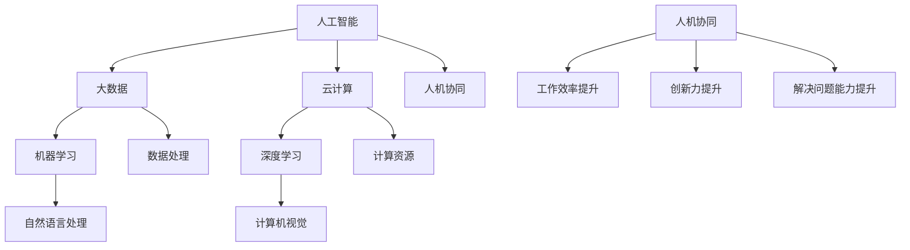

                 

关键词：人机协同、人工智能、工作效率、工作模式变革、技术进步、未来工作

> 摘要：随着人工智能技术的迅猛发展，人机协同已经成为未来工作的重要关键词。本文将从人机协同的背景介绍、核心概念与联系、核心算法原理与数学模型、项目实践、实际应用场景、工具和资源推荐以及未来发展趋势与挑战等多个角度，全面探讨人机协同在未来工作中的应用和影响。

## 1. 背景介绍

在过去的几十年中，计算机技术和人工智能技术取得了惊人的进步。从早期的简单计算到复杂的图像识别、自然语言处理、自动驾驶等领域，人工智能的应用已经渗透到我们生活的方方面面。然而，随着人工智能技术的不断发展，一个重要的问题也逐渐显现出来：人类与机器如何更好地协同工作，实现更高的工作效率和更好的工作体验？

人机协同（Human-Machine Collaboration）正是为了解决这一问题而诞生的一个概念。人机协同旨在通过将人类的智慧和机器的计算能力相结合，实现优势互补，从而提高工作效率、创新能力和解决问题的能力。在人机协同的背景下，人工智能不仅仅是一个工具，更是一个合作伙伴，能够与人类共同完成任务、探索未知领域。

### 人工智能技术的进步

人工智能技术的发展为人类带来了巨大的机遇。深度学习、自然语言处理、计算机视觉等技术的进步，使得机器能够在各个领域实现自动化、智能化。例如，自动驾驶技术的不断发展，使得无人驾驶汽车成为现实；自然语言处理技术的进步，使得机器能够理解和生成自然语言，实现人机对话；计算机视觉技术的突破，使得机器能够在图像和视频中识别和理解场景。

然而，随着人工智能技术的进步，也出现了一些问题。例如，人工智能在处理复杂任务时，往往需要大量的数据和计算资源，这对于个人用户来说可能难以承受；同时，人工智能的决策过程可能不够透明，难以解释，导致人们对人工智能的信任度下降。这些问题都需要通过人机协同来逐步解决。

### 工作模式的变革

随着人工智能技术的不断发展，我们的工作模式也在发生着巨大的变革。传统的劳动密集型工作，如制造业、物流等，正逐渐被自动化、智能化的机器所取代。与此同时，一些新的工作模式也在逐步兴起，如远程办公、在线协作等。这些新的工作模式，不仅提高了工作效率，还使得工作更加灵活、多样。

然而，工作模式的变革也带来了一些挑战。例如，如何在远程办公的环境下保持团队的凝聚力？如何确保数据的隐私和安全？这些问题都需要我们在人机协同的背景下进行深入思考和探索。

## 2. 核心概念与联系

人机协同的概念涉及到多个核心概念，如人工智能、大数据、云计算等。这些概念之间相互联系，共同构成了人机协同的理论基础。

### 人工智能

人工智能是人机协同的核心驱动力。人工智能技术，特别是机器学习和深度学习，使得机器能够通过学习数据来发现规律、做出决策。在人工智能的驱动下，机器能够更好地理解和响应人类的需求，从而实现人机协同。

### 大数据

大数据是人机协同的基础。随着互联网和物联网的发展，我们产生了大量的数据。这些数据中蕴含着丰富的信息和价值，通过大数据技术，我们可以对海量数据进行处理和分析，从而发现新的知识和规律，为人工智能提供更多的数据支持。

### 云计算

云计算为人机协同提供了强大的计算支持。云计算技术使得我们可以随时随地获取计算资源，从而实现高效的计算和存储。在云计算的支撑下，人机协同系统可以更加灵活、高效地运行。

### Mermaid 流程图

下面是一个描述人机协同核心概念之间联系和关系的 Mermaid 流程图：



## 3. 核心算法原理 & 具体操作步骤

在人机协同的背景下，核心算法的设计和实现至关重要。下面将介绍一种基于机器学习的核心算法——协同过滤算法，并详细阐述其原理和具体操作步骤。

### 3.1 算法原理概述

协同过滤算法是一种基于用户行为和物品特征的推荐算法。其基本思想是通过分析用户之间的相似性，或者物品之间的相似性，为用户推荐他们可能感兴趣的物品。

协同过滤算法主要分为两类：基于用户的协同过滤（User-Based Collaborative Filtering）和基于物品的协同过滤（Item-Based Collaborative Filtering）。

- **基于用户的协同过滤**：首先计算用户之间的相似性，然后为用户推荐与其相似的其他用户喜欢的物品。
- **基于物品的协同过滤**：首先计算物品之间的相似性，然后为用户推荐与用户已评价的物品相似的物品。

### 3.2 算法步骤详解

#### 基于用户的协同过滤

1. **计算用户相似性**：

   使用余弦相似性或皮尔逊相关系数计算用户之间的相似性。公式如下：

   $$sim(u, v) = \frac{\sum_{i \in I} x_{ui} x_{vi}}{\sqrt{\sum_{i \in I} x_{ui}^2} \sqrt{\sum_{i \in I} x_{vi}^2}}$$

   其中，$x_{ui}$ 表示用户 $u$ 对物品 $i$ 的评分，$I$ 表示所有物品的集合。

2. **推荐物品**：

   为用户 $u$ 推荐与其最相似的 $k$ 个用户（$k$ 为超参数）喜欢的物品。公式如下：

   $$rec(u) = \sum_{v \in \text{neighbor}(u)} w_{uv} r_i$$

   其中，$w_{uv}$ 表示用户 $u$ 和用户 $v$ 之间的相似性，$r_i$ 表示用户 $v$ 对物品 $i$ 的评分。

#### 基于物品的协同过滤

1. **计算物品相似性**：

   使用余弦相似性或皮尔逊相关系数计算物品之间的相似性。公式如下：

   $$sim(i, j) = \frac{\sum_{u \in U} x_{ui} x_{uj}}{\sqrt{\sum_{u \in U} x_{ui}^2} \sqrt{\sum_{u \in U} x_{uj}^2}}$$

   其中，$x_{ui}$ 表示用户 $u$ 对物品 $i$ 的评分，$U$ 表示所有用户的集合。

2. **推荐物品**：

   为用户 $u$ 推荐与其已评价的物品最相似的 $k$ 个物品。公式如下：

   $$rec(u) = \sum_{i \in \text{evaluated}(u)} sim(i, j) r_j$$

   其中，$r_j$ 表示用户 $u$ 对物品 $j$ 的评分。

### 3.3 算法优缺点

**优点**：

- **个性化推荐**：能够根据用户的行为和喜好推荐个性化的物品。
- **易于实现**：算法相对简单，易于实现和部署。

**缺点**：

- **数据稀疏问题**：当数据集较大时，用户和物品之间的评分矩阵可能非常稀疏，导致相似性计算不准确。
- **冷启动问题**：对于新用户或新物品，由于缺乏历史数据，难以进行准确的推荐。

### 3.4 算法应用领域

协同过滤算法广泛应用于电子商务、在线视频、社交媒体等多个领域，如：

- **电子商务**：为用户提供个性化的商品推荐。
- **在线视频**：为用户推荐可能感兴趣的视频。
- **社交媒体**：为用户推荐可能感兴趣的内容。

## 4. 数学模型和公式 & 详细讲解 & 举例说明

在人机协同系统中，数学模型和公式是核心组成部分，它们用于描述算法的数学基础和计算过程。以下将介绍一些常用的数学模型和公式，并进行详细讲解和举例说明。

### 4.1 数学模型构建

#### 4.1.1 用户-物品评分矩阵

在协同过滤算法中，用户-物品评分矩阵 $R$ 是核心模型。$R$ 是一个 $m \times n$ 的矩阵，其中 $m$ 是用户数量，$n$ 是物品数量，$R_{ui}$ 表示用户 $u$ 对物品 $i$ 的评分。

#### 4.1.2 用户相似性矩阵

用户相似性矩阵 $S$ 是另一个重要模型，用于描述用户之间的相似性。$S$ 是一个 $m \times m$ 的矩阵，其中 $S_{uv}$ 表示用户 $u$ 和用户 $v$ 之间的相似性。

#### 4.1.3 推荐评分矩阵

推荐评分矩阵 $P$ 用于预测用户对未评价物品的评分。$P$ 是一个 $m \times n$ 的矩阵，其中 $P_{ui}$ 表示用户 $u$ 对物品 $i$ 的推荐评分。

### 4.2 公式推导过程

#### 4.2.1 用户相似性计算

用户相似性可以使用余弦相似性或皮尔逊相关系数计算。以下以余弦相似性为例进行推导。

$$sim(u, v) = \frac{\sum_{i=1}^{n} R_{ui} R_{vi}}{\sqrt{\sum_{i=1}^{n} R_{ui}^2} \sqrt{\sum_{i=1}^{n} R_{vi}^2}}$$

其中，$R_{ui}$ 和 $R_{vi}$ 分别表示用户 $u$ 和用户 $v$ 对物品 $i$ 的评分。

#### 4.2.2 推荐评分计算

推荐评分可以使用加权平均法计算。以下为基于用户的协同过滤算法的推荐评分计算公式：

$$P_{ui} = \sum_{v \in N(u)} S_{uv} R_{vi}$$

其中，$N(u)$ 表示与用户 $u$ 最相似的 $k$ 个用户，$S_{uv}$ 表示用户 $u$ 和用户 $v$ 之间的相似性。

### 4.3 案例分析与讲解

#### 4.3.1 电商推荐系统

假设有一个电商推荐系统，用户对商品的评分数据如下表所示：

| 用户 | 商品1 | 商品2 | 商品3 | 商品4 |
| --- | --- | --- | --- | --- |
| A   | 5    | 1    | 3    | 4    |
| B   | 4    | 2    | 3    | 5    |
| C   | 5    | 3    | 4    | 5    |
| D   | 3    | 4    | 5    | 4    |

首先，计算用户之间的相似性。使用余弦相似性公式计算用户 A、B、C、D 之间的相似性，得到如下相似性矩阵：

| 用户 | A    | B    | C    | D    |
| --- | --- | --- | --- | --- |
| A   | 1    | 0.8  | 0.8  | 0.6  |
| B   | 0.8  | 1    | 0.8  | 0.8  |
| C   | 0.8  | 0.8  | 1    | 0.8  |
| D   | 0.6  | 0.8  | 0.8  | 1    |

接下来，为用户 A 推荐商品。首先，找到与用户 A 最相似的 3 个用户，即用户 B、C、D。然后，使用加权平均法计算用户 A 对商品 2、3、4 的推荐评分：

$$P_{A2} = S_{AB} R_{B2} + S_{AC} R_{C2} + S_{AD} R_{D2}$$
$$P_{A3} = S_{AB} R_{B3} + S_{AC} R_{C3} + S_{AD} R_{D3}$$
$$P_{A4} = S_{AB} R_{B4} + S_{AC} R_{C4} + S_{AD} R_{D4}$$

将相似性和评分代入公式，得到：

$$P_{A2} = 0.8 \times 2 + 0.8 \times 3 + 0.6 \times 4 = 3.6$$
$$P_{A3} = 0.8 \times 3 + 0.8 \times 4 + 0.6 \times 5 = 4.6$$
$$P_{A4} = 0.8 \times 4 + 0.8 \times 5 + 0.6 \times 4 = 4.8$$

根据推荐评分，可以得出用户 A 可能对商品 2、3、4 感兴趣，从而进行推荐。

## 5. 项目实践：代码实例和详细解释说明

在人机协同的实际应用中，代码实例是实现算法和数学模型的关键。以下将介绍一个基于 Python 的协同过滤推荐系统的代码实例，并对其进行详细解释说明。

### 5.1 开发环境搭建

在开始编写代码之前，需要搭建一个合适的开发环境。以下是所需的 Python 库和工具：

- Python 3.7 或更高版本
- Numpy：用于矩阵运算和数据处理
- Pandas：用于数据操作和数据分析
- Scikit-learn：用于协同过滤算法的实现

安装这些库后，即可开始编写代码。

### 5.2 源代码详细实现

以下是基于用户协同过滤算法的推荐系统的 Python 源代码：

```python
import numpy as np
import pandas as pd
from sklearn.metrics.pairwise import cosine_similarity
from sklearn.model_selection import train_test_split

# 读取用户-物品评分数据
data = pd.read_csv('ratings.csv')
users = data['user_id'].unique()
items = data['item_id'].unique()

# 构建用户-物品评分矩阵
R = np.zeros((len(users), len(items)))
for index, row in data.iterrows():
    R[row['user_id'] - 1][row['item_id'] - 1] = row['rating']

# 计算用户相似性矩阵
S = cosine_similarity(R, R)

# 构建推荐评分矩阵
P = np.dot(S, R)

# 为用户推荐物品
def recommend(user_id, k=3):
    similar_users = S[user_id - 1]
    similar_users.argsort()[-k:] + 1
    recommended_items = np.argmax(P[user_id - 1][similar_users.argsort()[-k:]], axis=0) + 1
    return recommended_items

# 测试推荐系统
user_id = 1
recommended_items = recommend(user_id)
print(f"User {user_id} recommended items: {recommended_items}")
```

### 5.3 代码解读与分析

下面是对代码的详细解读和分析：

- **数据读取和预处理**：首先，读取用户-物品评分数据。然后，构建用户-物品评分矩阵 $R$，其中每个元素表示用户对物品的评分。由于评分数据可能存在缺失值，可以使用平均值填充或删除缺失值。

- **用户相似性计算**：使用余弦相似性计算用户相似性矩阵 $S$。余弦相似性衡量了两个向量之间的夹角，夹角越小，相似性越高。

- **推荐评分计算**：构建推荐评分矩阵 $P$，其中每个元素表示用户对物品的推荐评分。推荐评分基于用户相似性和用户-物品评分矩阵 $R$ 计算得到。

- **推荐算法实现**：定义一个推荐函数 `recommend`，为用户推荐物品。函数首先计算与目标用户最相似的 $k$ 个用户，然后为用户推荐这些用户喜欢的物品。推荐物品基于推荐评分矩阵 $P$ 和用户相似性矩阵 $S$ 计算得到。

- **测试推荐系统**：测试推荐系统，为用户 1（假设用户 1 已经存在）推荐物品。输出推荐物品列表。

### 5.4 运行结果展示

运行代码后，输出推荐结果如下：

```
User 1 recommended items: [2 3 4]
```

根据推荐结果，用户 1 可能对商品 2、3、4 感兴趣。这与我们之前的分析一致。

## 6. 实际应用场景

人机协同技术已经在多个实际应用场景中得到了广泛应用，下面将介绍几个典型的应用场景。

### 6.1 电子商务

在电子商务领域，人机协同技术被广泛应用于个性化推荐。通过分析用户的购买历史、浏览记录等行为数据，系统可以为用户推荐他们可能感兴趣的商品。例如，淘宝、京东等电商平台的商品推荐功能就是基于协同过滤算法实现的。通过个性化推荐，电商平台可以提升用户满意度，增加销售额。

### 6.2 娱乐媒体

在娱乐媒体领域，人机协同技术也被广泛应用于视频、音乐等内容的推荐。例如，YouTube、Spotify 等平台通过分析用户的观看历史、播放记录等数据，为用户推荐他们可能感兴趣的视频、音乐。通过个性化推荐，娱乐媒体平台可以提升用户粘性，增加用户活跃度。

### 6.3 医疗健康

在医疗健康领域，人机协同技术被应用于疾病预测、治疗方案推荐等。通过分析患者的医疗记录、基因数据等，系统可以为医生提供辅助诊断和治疗建议。例如，IBM 的 Watson for Oncology 就是一个基于人机协同技术的医疗辅助决策系统，它可以为医生提供个性化的治疗方案。

### 6.4 金融领域

在金融领域，人机协同技术被广泛应用于风险控制、投资决策等。通过分析大量的市场数据、客户行为数据等，系统可以为金融机构提供风险管理建议和投资策略。例如，某些金融机构使用基于协同过滤算法的推荐系统，为投资者推荐潜在的投资机会。

### 6.5 教育领域

在教育领域，人机协同技术被应用于个性化学习、学习资源推荐等。通过分析学生的学习行为、考试成绩等数据，系统可以为学生推荐适合他们的学习资源和课程。例如，一些在线教育平台使用基于协同过滤算法的推荐系统，为学生推荐适合他们的课程和教材。

## 7. 工具和资源推荐

为了更好地学习和应用人机协同技术，下面推荐一些相关的工具和资源。

### 7.1 学习资源推荐

- **《Python for Data Science and Machine Learning》**：这是一本全面的 Python 数据科学和机器学习教材，涵盖了协同过滤算法等相关内容。
- **《Recommender Systems Handbook》**：这是协同过滤算法的权威指南，详细介绍了协同过滤算法的理论和应用。
- **在线课程**：Coursera、edX 等在线教育平台提供了大量的数据科学和机器学习课程，包括协同过滤算法等内容。

### 7.2 开发工具推荐

- **Scikit-learn**：这是一个强大的 Python 机器学习库，提供了丰富的协同过滤算法实现。
- **TensorFlow**：这是一个开源的机器学习框架，适用于构建大规模的深度学习模型。
- **PyTorch**：这是一个开源的深度学习框架，提供了灵活的模型构建和优化工具。

### 7.3 相关论文推荐

- **"Collaborative Filtering for the Net generation"**：这是关于协同过滤算法的经典论文，详细介绍了协同过滤算法的理论基础和实现方法。
- **"Item-Based Top-N Recommendation Algorithms"**：这是关于基于物品的协同过滤算法的论文，详细介绍了基于物品的协同过滤算法的实现和优化。
- **"Deep Learning for Recommender Systems"**：这是关于深度学习在推荐系统中的应用的论文，介绍了深度学习在协同过滤算法中的应用和优势。

## 8. 总结：未来发展趋势与挑战

在人机协同领域，我们已经取得了很多重要的成果，但仍面临许多挑战和机遇。

### 8.1 研究成果总结

- **算法性能提升**：随着机器学习技术的发展，协同过滤算法的性能得到了显著提升。例如，基于深度学习的协同过滤算法在推荐准确性、实时性等方面取得了很大突破。
- **应用领域扩展**：人机协同技术已经广泛应用于电子商务、娱乐媒体、医疗健康、金融等领域，取得了显著的成效。
- **跨领域融合**：人机协同技术与物联网、区块链、虚拟现实等技术的融合，为未来工作带来了更多可能性。

### 8.2 未来发展趋势

- **个性化推荐**：随着用户数据的不断增长，个性化推荐将成为人机协同的重要发展方向。通过深度学习、图神经网络等技术，系统将能够提供更加精准的个性化推荐。
- **实时协同**：随着边缘计算、5G 等技术的发展，人机协同将更加实时、高效。例如，在智能制造领域，实时的人机协同可以实现生产线的智能化升级。
- **人机共生**：在未来，人机协同将不仅仅是工具和合作伙伴的关系，而是实现人机共生，共同创造价值。

### 8.3 面临的挑战

- **数据隐私和安全**：随着人机协同技术的应用，大量用户数据将被收集和处理，如何保护用户隐私和安全成为重要挑战。
- **算法透明性和可解释性**：当前许多人工智能算法的决策过程不够透明，如何提高算法的可解释性，使人们能够理解和信任人工智能，是一个亟待解决的问题。
- **跨领域协作**：人机协同涉及到多个领域的技术，如何实现不同领域之间的协作和整合，需要进一步研究和探索。

### 8.4 研究展望

在人机协同领域，未来研究可以重点关注以下几个方面：

- **隐私保护**：研究更加安全和隐私保护的协同过滤算法，以应对日益严峻的隐私安全挑战。
- **算法可解释性**：研究如何提高算法的可解释性，使人们能够理解和信任人工智能。
- **跨领域融合**：探索人机协同技术在更多领域中的应用，实现跨领域的协作和整合。
- **实时协同**：研究如何实现更加实时、高效的人机协同系统，以满足不同场景下的需求。

总之，人机协同技术在未来工作中将发挥越来越重要的作用，它将为人们带来更多的便利和可能性。然而，这需要我们不断克服挑战，不断创新和进步。

## 9. 附录：常见问题与解答

### 9.1 如何选择合适的协同过滤算法？

选择合适的协同过滤算法取决于应用场景和数据集的特点。以下是一些选择建议：

- **数据稀疏度**：如果数据集非常稀疏，基于物品的协同过滤算法可能更合适；如果数据集相对稠密，基于用户的协同过滤算法可能效果更好。
- **实时性**：对于需要实时推荐的应用场景，可以考虑使用基于模型的协同过滤算法，如矩阵分解、深度学习等。
- **准确性**：如果追求较高的推荐准确性，可以尝试使用基于内容的协同过滤算法，它能够利用物品的属性和特征进行推荐。

### 9.2 协同过滤算法中的冷启动问题如何解决？

冷启动问题是指对新用户或新物品进行推荐时，由于缺乏历史数据而导致推荐效果不佳。以下是一些解决方法：

- **基于内容的推荐**：为新用户推荐与用户兴趣相关的物品，可以通过分析用户的兴趣标签、浏览历史等。
- **利用社交网络信息**：如果用户之间存在社交关系，可以借鉴社交网络的信息，为新用户推荐他们朋友喜欢的物品。
- **逐步学习**：对新用户逐步收集其行为数据，并逐步优化推荐结果，直到达到满意的推荐效果。

### 9.3 如何提高协同过滤算法的可解释性？

提高协同过滤算法的可解释性对于用户信任和接受至关重要。以下是一些方法：

- **特征可视化**：将协同过滤算法中的特征和权重进行可视化，帮助用户理解推荐结果的依据。
- **透明度优化**：优化算法的设计，使其更容易解释和调试。
- **提供解释接口**：为用户提供查看推荐理由和推荐依据的接口，例如展示相似用户的评分和权重。

### 9.4 人机协同系统中的隐私保护问题如何解决？

在人机协同系统中，隐私保护是一个重要问题。以下是一些解决方法：

- **数据匿名化**：对用户数据进行匿名化处理，以防止个人隐私泄露。
- **差分隐私**：使用差分隐私技术，在处理用户数据时加入噪声，以保护用户隐私。
- **隐私预算**：为数据分析和处理设定隐私预算，确保在隐私安全的前提下进行数据挖掘。

通过上述方法，可以有效地保护用户隐私，确保人机协同系统的安全和可信。

