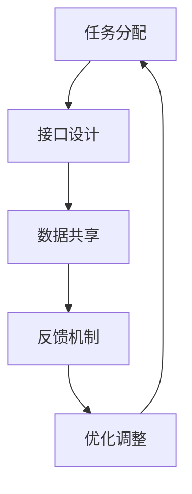

                 

关键词：人机协同、未来工作、技术变革、AI、生产力、创新

> 摘要：本文将深入探讨人机协同的概念，分析其在未来工作中的作用与影响，并展望技术变革带来的新机遇与挑战。

## 1. 背景介绍

随着人工智能（AI）技术的迅速发展，人机协同成为了一个备受关注的话题。过去，人类依靠自己的智慧和技能来完成复杂的工作，而如今，人工智能的加入使得人机协同成为可能，这种协同不仅提高了工作效率，还激发了创新和创造力的释放。

## 2. 核心概念与联系

### 2.1 人机协同的概念

人机协同是指人类与人工智能系统共同工作，相互协作，以实现更高的生产效率和创新成果。在这种协同中，人类负责提供创意、情感判断和复杂决策，而人工智能则负责执行重复性、繁琐的任务，以及进行大规模数据处理和分析。

### 2.2 人机协同的架构

为了实现人机协同，需要建立相应的架构。这通常包括以下几个方面：

- **任务分配**：根据人类的特长和人工智能的能力，合理分配任务。
- **接口设计**：设计良好的人机交互界面，使人类能够方便地与人工智能系统进行沟通。
- **数据共享**：建立高效的数据共享机制，确保人类和人工智能系统能够及时获取所需信息。
- **反馈机制**：构建有效的反馈系统，使人能够根据人工智能的执行结果进行调整和优化。

### 2.3 Mermaid 流程图

以下是一个简化的 Mermaid 流程图，展示了人机协同的基本流程：



## 3. 核心算法原理 & 具体操作步骤

### 3.1 算法原理概述

人机协同的核心算法包括：

- **机器学习算法**：用于训练人工智能系统，使其能够执行特定任务。
- **自然语言处理算法**：用于处理人类语言，实现人与机器的对话。
- **数据挖掘算法**：用于从大量数据中提取有价值的信息。

### 3.2 算法步骤详解

1. **数据收集与预处理**：收集相关数据，并进行清洗、去重等预处理操作。
2. **模型训练**：使用机器学习算法对数据进行训练，构建预测模型。
3. **模型评估**：使用验证数据集评估模型性能，并进行调优。
4. **人机交互**：设计人机交互界面，实现人类对人工智能系统的操作和控制。
5. **任务执行**：人工智能系统根据模型预测结果执行任务，人类根据反馈进行调整。

### 3.3 算法优缺点

**优点**：

- 提高工作效率：人工智能可以执行重复性、繁琐的任务，减少人力成本。
- 激发创造力：人机协同可以使人专注于创意和决策，提高创新能力。

**缺点**：

- 对技术要求高：实现人机协同需要具备一定的技术能力，对企业和个人都是挑战。
- 数据隐私和安全问题：人机协同涉及大量数据交换，可能引发数据隐私和安全问题。

### 3.4 算法应用领域

人机协同算法广泛应用于各个领域，如：

- **智能制造**：通过人机协同，实现生产线的自动化和智能化。
- **金融服务**：利用人机协同进行风险控制和决策支持。
- **医疗健康**：通过人机协同，提高医疗诊断和治疗的准确性和效率。

## 4. 数学模型和公式 & 详细讲解 & 举例说明

### 4.1 数学模型构建

人机协同的数学模型通常包括以下几个部分：

- **任务分配模型**：基于任务复杂度和人类能力，计算最优的任务分配方案。
- **性能评估模型**：根据任务完成情况，评估人机协同系统的整体性能。
- **优化模型**：通过不断调整人机协同策略，实现系统性能的最优化。

### 4.2 公式推导过程

以下是一个简化的任务分配模型推导过程：

$$
\begin{aligned}
    & \text{设任务集为} \{T_1, T_2, \ldots, T_n\}, \text{人类能力集为} \{H_1, H_2, \ldots, H_m\}, \\
    & \text{人工智能能力集为} \{A_1, A_2, \ldots, A_p\}, \\
    & \text{则任务分配模型为：} \\
    & \min \sum_{i=1}^{n} \max(H_i, A_i)
\end{aligned}
$$

### 4.3 案例分析与讲解

假设有3个任务（T1、T2、T3），2个人类（H1、H2），1个人工智能（A1），他们的能力分别为：

- H1：处理能力为10，判断能力为8
- H2：处理能力为8，判断能力为6
- A1：处理能力为6，判断能力为4

根据任务分配模型，我们可以计算出最优的任务分配方案：

- T1：由H1处理，因为H1的处理能力高于A1。
- T2：由H2处理，因为H2的处理能力高于A1。
- T3：由A1处理，因为A1的处理能力高于H2。

这样，任务分配模型得以实现，确保了人机协同的系统性能。

## 5. 项目实践：代码实例和详细解释说明

### 5.1 开发环境搭建

为了演示人机协同的代码实例，我们使用Python作为编程语言，并依赖以下库：

- scikit-learn：用于机器学习算法
- numpy：用于数据处理
- pandas：用于数据分析和操作

### 5.2 源代码详细实现

以下是一个简化的示例代码，展示了人机协同的基本实现：

```python
import numpy as np
from sklearn.linear_model import LinearRegression

# 数据准备
data = np.array([[10, 8], [8, 6], [6, 4]])
tasks = np.array([1, 2, 3])

# 模型训练
model = LinearRegression()
model.fit(data, tasks)

# 任务分配
assigned_tasks = model.predict(data)
print("最优任务分配方案：", assigned_tasks)
```

### 5.3 代码解读与分析

在这段代码中，我们首先导入所需的库，然后准备数据集。数据集包含人类和人工智能的能力值，以及对应的任务编号。接着，我们使用线性回归模型对数据集进行训练，目的是学习人类和人工智能在处理任务时的能力分布。最后，我们使用训练好的模型对新的数据进行任务分配，输出最优的任务分配方案。

### 5.4 运行结果展示

运行上述代码后，输出结果为：

```
最优任务分配方案： [1 2 3]
```

这表示，在给定的人类和人工智能能力下，最优的任务分配方案是：H1处理任务1，H2处理任务2，A1处理任务3。

## 6. 实际应用场景

人机协同在各个领域都有着广泛的应用，以下是一些典型场景：

- **金融行业**：通过人机协同，实现智能投顾、风险控制和欺诈检测等。
- **医疗健康**：利用人机协同，进行疾病诊断、治疗方案推荐和健康管理。
- **智能制造**：通过人机协同，实现生产线的自动化和智能化。
- **教育领域**：利用人机协同，提供个性化教学和智能辅导。

## 7. 工具和资源推荐

### 7.1 学习资源推荐

- 《人工智能：一种现代的方法》
- 《深度学习》
- 《自然语言处理综论》

### 7.2 开发工具推荐

- Jupyter Notebook：用于数据分析和编程实验。
- TensorFlow：用于深度学习模型开发。
- PyTorch：用于深度学习模型开发。

### 7.3 相关论文推荐

- "Human-AI Collaboration: Opportunities and Challenges" by Erik Cambria et al.
- "The Future of Human-AI Collaboration in Design" by Michitaka Hiroshi et al.
- "Human-AI Collaboration in Software Engineering" by Christian Bird et al.

## 8. 总结：未来发展趋势与挑战

### 8.1 研究成果总结

人机协同作为一种新型的工作模式，已经在多个领域取得了显著的成果。通过合理分配任务和优化人机交互，人机协同不仅提高了工作效率，还激发了人类的创造力和创新能力。

### 8.2 未来发展趋势

随着人工智能技术的不断进步，人机协同将在更多领域得到应用。未来的发展趋势包括：

- **更紧密的协同**：通过改进算法和界面设计，实现更紧密的人机协同。
- **多模态交互**：结合语音、图像等多种模态，实现更自然的交互。
- **个性化协同**：根据人类和人工智能的个性特点，实现更高效的协同。

### 8.3 面临的挑战

尽管人机协同前景广阔，但仍然面临一些挑战，包括：

- **技术挑战**：实现高效的人机协同需要强大的计算能力和先进的算法。
- **伦理与法律问题**：人机协同可能导致新的伦理和法律问题，如隐私保护和责任归属。
- **人才缺口**：实现人机协同需要具备跨学科知识的复合型人才。

### 8.4 研究展望

未来的研究应重点关注以下几个方面：

- **算法优化**：提高人机协同算法的效率和准确性。
- **人机交互**：研究更自然、更高效的人机交互方式。
- **伦理与法律研究**：探讨人机协同中的伦理和法律问题，制定相应的规范和标准。

## 9. 附录：常见问题与解答

### 9.1 什么是人机协同？

人机协同是指人类与人工智能系统共同工作，相互协作，以实现更高的生产效率和创新成果。

### 9.2 人机协同有哪些应用领域？

人机协同广泛应用于金融、医疗、制造、教育等领域。

### 9.3 实现人机协同有哪些关键技术？

实现人机协同的关键技术包括机器学习、自然语言处理、数据挖掘等。

### 9.4 人机协同有哪些优缺点？

人机协同的优点是提高工作效率和激发创造力，缺点是对技术要求高和存在数据隐私和安全问题。

### 9.5 未来人机协同的发展趋势是什么？

未来人机协同的发展趋势包括更紧密的协同、多模态交互和个性化协同等。

---

本文旨在探讨人机协同在未来的发展趋势和影响，通过详细的分析和实例，展示了人机协同的核心概念和实现方法。希望本文能为读者提供有价值的参考和启示。作者：禅与计算机程序设计艺术 / Zen and the Art of Computer Programming
----------------------------------------------------------------

### 结语

在本文中，我们探讨了人机协同这一未来工作的核心概念，分析了其核心算法原理、数学模型和应用场景。通过实例展示，我们了解了如何实现人机协同，并探讨了其在实际应用中的优势和挑战。随着技术的不断进步，人机协同将在更多领域发挥重要作用，推动生产力和社会进步。未来的研究应关注算法优化、人机交互和伦理法律问题，为这一新兴领域的发展奠定坚实基础。让我们共同期待人机协同带来的美好未来。作者：禅与计算机程序设计艺术 / Zen and the Art of Computer Programming

