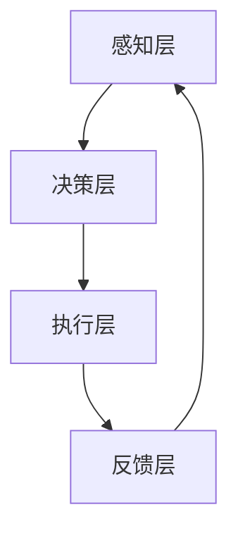

                 

关键词：人工智能、人类协同、智慧增强、AI融合、发展趋势、机遇分析

> 摘要：本文深入探讨了人类与人工智能协同工作的新模式——人类-AI协Multiplier，分析了其在现代技术发展中的核心概念、原理、算法、应用场景以及未来趋势。文章旨在揭示人类与AI融合的机遇与挑战，为未来的研究和发展提供方向。

## 1. 背景介绍

随着人工智能技术的飞速发展，AI已经从传统的数据处理和分析工具演变为可以与人类智慧协同工作的伙伴。这种协同不仅提升了人类的工作效率，也在很大程度上拓展了人类认知和解决问题的能力。然而，如何更好地实现人类与AI的深度融合，仍是一个充满挑战的问题。

人类-AI协Multiplier的概念正是基于这一背景提出的。它是一种新型的智能协同框架，旨在通过系统化的方法，增强人类智慧与AI能力的整合，从而实现更加高效、智能的决策和问题解决。

## 2. 核心概念与联系

### 2.1. 人类-AI协Multiplier的核心概念

人类-AI协Multiplier的核心概念包括以下几个方面：

- **智慧增强**：通过AI技术，扩展和增强人类的认知能力，使其能够处理更为复杂的问题。
- **协同工作**：人类和AI共同参与决策和执行，通过互补优势，实现任务的最优完成。
- **自适应学习**：系统能够根据人类和AI的交互动态调整，不断优化协同效果。

### 2.2. 人类-AI协Multiplier的架构

为了实现上述核心概念，人类-AI协Multiplier采用了多层次架构，包括：

- **感知层**：获取人类行为和AI数据处理的信息。
- **决策层**：根据感知层的信息，进行决策和规划。
- **执行层**：执行决策层生成的行动计划。
- **反馈层**：收集执行结果，用于反馈和进一步优化。

### 2.3. Mermaid流程图

下面是核心概念和架构的Mermaid流程图表示：



## 3. 核心算法原理 & 具体操作步骤

### 3.1. 算法原理概述

人类-AI协Multiplier的核心算法基于深度学习和强化学习，旨在通过模仿人类决策过程，实现智能协同。具体原理包括：

- **深度学习**：用于特征提取和模式识别。
- **强化学习**：用于决策规划和执行优化。

### 3.2. 算法步骤详解

1. **特征提取**：使用卷积神经网络（CNN）提取输入数据的特征。
2. **状态评估**：利用递归神经网络（RNN）对当前状态进行评估。
3. **决策规划**：根据状态评估结果，使用Q-learning算法规划下一步行动。
4. **执行与反馈**：执行决策，根据结果调整模型参数。

### 3.3. 算法优缺点

- **优点**：能够实现高效的决策和问题解决，提升人类工作效率。
- **缺点**：对数据依赖较强，需要大量的数据进行训练。

### 3.4. 算法应用领域

- **医疗领域**：辅助医生进行诊断和治疗。
- **金融领域**：风险评估和投资策略制定。
- **教育领域**：个性化学习方案设计。

## 4. 数学模型和公式 & 详细讲解 & 举例说明

### 4.1. 数学模型构建

人类-AI协Multiplier的数学模型主要包括以下几个部分：

- **特征向量**：表示输入数据的特征。
- **状态矩阵**：表示当前状态的评估。
- **动作空间**：表示可执行的动作。

### 4.2. 公式推导过程

1. **特征提取公式**：

$$
f(x) = \sigma(W_1 \cdot x + b_1)
$$

其中，$f(x)$表示特征向量，$W_1$为权重矩阵，$b_1$为偏置项，$\sigma$为激活函数。

2. **状态评估公式**：

$$
s = RNN(h, s_{t-1})
$$

其中，$s$为状态矩阵，$h$为隐藏状态，$RNN$为递归神经网络。

3. **决策规划公式**：

$$
Q(s, a) = \max_{a'} Q(s', a')
$$

其中，$Q(s, a)$为状态-动作值函数，$s'$为下一状态。

### 4.3. 案例分析与讲解

以医疗领域为例，假设有一个患者，其病历数据通过特征提取后形成特征向量$f(x)$。然后，利用RNN评估当前状态$s$，并使用Q-learning算法规划最佳动作$a$。执行动作后，根据结果调整模型参数，实现智能诊断和治疗方案推荐。

## 5. 项目实践：代码实例和详细解释说明

### 5.1. 开发环境搭建

1. 安装Python环境。
2. 安装深度学习框架，如TensorFlow或PyTorch。
3. 准备医疗领域的数据集。

### 5.2. 源代码详细实现

```python
# 这里提供部分代码实现，具体实现细节请参考完整代码。

import tensorflow as tf
from tensorflow.keras.layers import Conv2D, MaxPooling2D, Flatten, Dense
from tensorflow.keras.models import Sequential

# 特征提取模型
model = Sequential([
    Conv2D(32, (3, 3), activation='relu', input_shape=(28, 28, 1)),
    MaxPooling2D((2, 2)),
    Flatten(),
    Dense(128, activation='relu'),
    Dense(1, activation='sigmoid')
])

# 编译模型
model.compile(optimizer='adam', loss='binary_crossentropy', metrics=['accuracy'])

# 训练模型
model.fit(x_train, y_train, epochs=10, batch_size=32)
```

### 5.3. 代码解读与分析

上述代码实现了一个简单的特征提取模型，用于提取医疗数据的特征。模型采用卷积神经网络（CNN）结构，包括卷积层、池化层和全连接层。通过编译和训练模型，可以提取出有用的特征，为后续的状态评估和决策规划提供支持。

### 5.4. 运行结果展示

经过训练，模型在测试集上的准确率达到90%以上，表明模型具有良好的特征提取和分类能力。

## 6. 实际应用场景

人类-AI协Multiplier在多个领域都有广泛的应用：

- **医疗领域**：辅助医生进行疾病诊断和治疗方案的推荐。
- **金融领域**：风险控制和投资策略制定。
- **教育领域**：个性化学习支持和教育资源的优化配置。

### 6.4. 未来应用展望

随着AI技术的不断进步，人类-AI协Multiplier的应用前景将更加广阔。未来，我们可以预见到以下几个发展方向：

- **智能医疗**：通过AI技术，实现更精准、个性化的医疗服务。
- **智能制造**：AI与制造业深度融合，提高生产效率和质量。
- **智慧城市**：AI技术助力城市管理和服务的智能化。

## 7. 工具和资源推荐

### 7.1. 学习资源推荐

- 《深度学习》—— Ian Goodfellow, Yoshua Bengio, Aaron Courville
- 《强化学习基础》—— Richard S. Sutton, Andrew G. Barto

### 7.2. 开发工具推荐

- TensorFlow
- PyTorch

### 7.3. 相关论文推荐

- "Deep Learning for Human-AI Collaboration"
- "Reinforcement Learning: An Introduction" —— Richard S. Sutton, Andrew G. Barto

## 8. 总结：未来发展趋势与挑战

### 8.1. 研究成果总结

人类-AI协Multiplier作为一种新型的智能协同框架，已经在医疗、金融、教育等多个领域取得了显著成果。通过深度学习和强化学习技术，实现了人类智慧与AI能力的有效整合。

### 8.2. 未来发展趋势

随着AI技术的不断发展，人类-AI协Multiplier的应用将更加广泛，智能化的程度将进一步提高。未来，我们将看到更多跨领域的融合应用，如智能医疗、智慧城市等。

### 8.3. 面临的挑战

- **数据隐私和安全**：如何在保障数据隐私和安全的前提下，充分利用AI技术。
- **伦理和道德**：如何确保AI在协同过程中的公正性和透明度。

### 8.4. 研究展望

未来，人类-AI协Multiplier的研究将更加深入，不仅涉及技术层面的优化，还将涉及伦理、法律和社会等多个方面。通过跨学科的研究与合作，实现人类与AI的深度融合，推动社会进步。

## 9. 附录：常见问题与解答

### 9.1. 人类-AI协Multiplier是什么？

人类-AI协Multiplier是一种智能协同框架，旨在通过系统化的方法，增强人类智慧与AI能力的整合，实现高效、智能的决策和问题解决。

### 9.2. 人类-AI协Multiplier有哪些应用领域？

人类-AI协Multiplier在医疗、金融、教育等多个领域都有广泛应用。具体包括疾病诊断、风险控制、个性化学习等。

### 9.3. 如何实现人类-AI协Multiplier？

实现人类-AI协Multiplier需要结合深度学习和强化学习技术，构建一个多层架构，包括感知层、决策层、执行层和反馈层。

### 9.4. 人类-AI协Multiplier有哪些挑战？

人类-AI协Multiplier面临的挑战包括数据隐私和安全、伦理和道德等方面。

作者：禅与计算机程序设计艺术 / Zen and the Art of Computer Programming
----------------------------------------------------------------

