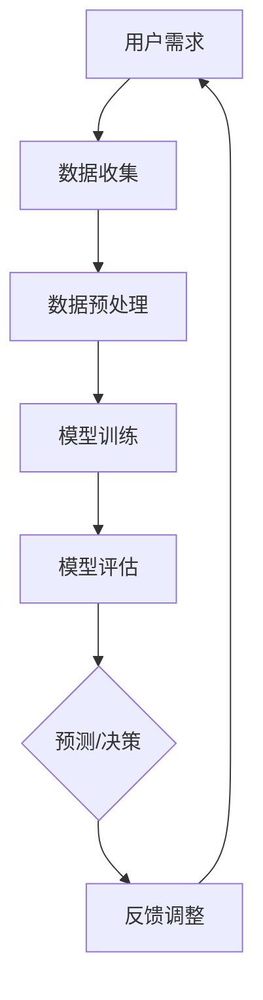

                 

关键词：人类与AI协作、服务设计、人工智能应用、交互体验、技术实现

> 摘要：本文旨在探讨人类与AI协作的设计，从核心概念、算法原理、数学模型、项目实践等多个角度，全面解析如何设计出高效、人性化的AI系统，从而为人类提供更优质的服务。

## 1. 背景介绍

随着人工智能技术的飞速发展，AI已逐渐渗透到我们的日常生活中，从智能家居到医疗诊断，从金融服务到物流配送，AI正在改变着我们的生活方式。然而，AI的应用并不只是技术层面的革新，更是人类与机器协作模式的一种转变。在这种转变中，如何设计出既高效又符合人类需求的服务系统，成为了一个值得探讨的重要课题。

人类与AI的协作不仅仅是简单的任务分配，它涉及到如何理解人类的需求、如何优化AI的行为、以及如何保障AI的可靠性等多个方面。因此，对人类-AI协作的服务设计提出了更高的要求。

### 1.1 人工智能的发展历程

人工智能（AI）一词最早由约翰·麦卡锡（John McCarthy）在1956年的达特茅斯会议上提出，标志着人工智能学科的诞生。从那时起，人工智能经历了多个阶段的发展：

- **第一阶段（1956-1974）**：以符号主义为代表，通过逻辑推理和符号计算来模拟人类智能。
- **第二阶段（1974-1980）**：以知识表示和知识工程为主要研究方向，致力于构建基于知识的系统。
- **第三阶段（1980-1987）**：以专家系统为代表，通过模拟人类专家的决策过程来解决特定领域的问题。
- **第四阶段（1987-2000）**：以机器学习和神经网络为主要研究内容，通过数据驱动的方法来实现智能行为。
- **第五阶段（2000-2010）**：以深度学习和大数据为主要驱动力，实现了AI在语音识别、图像识别等领域的突破性进展。
- **第六阶段（2010至今）**：以强化学习和跨学科融合为特征，AI在自然语言处理、自动驾驶、智能医疗等领域取得了显著成果。

### 1.2 AI在服务领域的应用现状

随着AI技术的不断进步，它在服务领域的应用也日益广泛。以下是AI在服务领域的一些典型应用：

- **客户服务**：AI客服机器人已广泛应用于电商、金融、电信等行业，通过自然语言处理技术提供24/7的在线服务。
- **金融服务**：AI在金融领域被用于风险评估、股票交易、信用评估等方面，提高了金融服务的效率和准确性。
- **医疗健康**：AI在医疗诊断、疾病预测、手术规划等方面展现出巨大的潜力，帮助医生做出更准确的诊断和治疗决策。
- **智能交通**：AI技术在交通管理、自动驾驶、智能导航等方面发挥了重要作用，提升了交通效率，减少了交通事故。

## 2. 核心概念与联系

在人类与AI的协作中，有几个核心概念需要我们深入理解，包括自然语言处理、机器学习、人机交互等。这些概念不仅单独存在，还紧密联系在一起，共同构建了一个高效、智能的服务系统。

### 2.1 自然语言处理

自然语言处理（NLP）是人工智能的一个重要分支，旨在让计算机理解和处理人类语言。NLP的核心任务是语言理解、语言生成和语言翻译。在人类与AI的协作中，NLP技术被广泛应用于语音识别、聊天机器人、智能客服等领域。

#### 2.1.1 语言理解

语言理解是指让计算机能够理解自然语言的语义和语境。这需要利用词法分析、句法分析、语义分析和语用分析等技术。

- **词法分析**：将文本分解为单词或词素。
- **句法分析**：分析句子的结构，确定句子的语法成分。
- **语义分析**：理解句子所表达的含义。
- **语用分析**：理解句子在实际交际中的功能。

#### 2.1.2 语言生成

语言生成是指让计算机能够生成符合语法规则和语义逻辑的自然语言。这通常需要使用生成模型，如循环神经网络（RNN）和生成对抗网络（GAN）。

#### 2.1.3 语言翻译

语言翻译是指将一种自然语言文本翻译成另一种自然语言。机器翻译技术主要包括规则翻译、基于统计的机器翻译和基于神经网络的机器翻译。

### 2.2 机器学习

机器学习（ML）是AI的核心技术之一，它让计算机通过数据学习来改进性能。在人类与AI的协作中，机器学习技术被广泛应用于预测、分类、聚类等任务。

#### 2.2.1 预测

预测是指根据历史数据来预测未来事件。常见的预测模型包括线性回归、决策树、支持向量机（SVM）和神经网络等。

#### 2.2.2 分类

分类是指将数据分成不同的类别。常见的分类算法包括K-近邻（KNN）、朴素贝叶斯（NB）、决策树和随机森林（RF）等。

#### 2.2.3 聚类

聚类是指将相似的数据归为一类。常见的聚类算法包括K-均值（KM）、层次聚类和DBSCAN等。

### 2.3 人机交互

人机交互（HCI）是研究如何设计用户与计算机之间的交互界面的学科。在人类与AI的协作中，人机交互技术至关重要，它决定了用户如何与AI系统进行沟通和操作。

#### 2.3.1 交互设计

交互设计是指设计用户与计算机之间的交互过程和界面。一个好的交互设计应该易于理解、操作简便，并能满足用户的实际需求。

#### 2.3.2 可用性测试

可用性测试是指通过实际用户对系统的使用体验来评估系统的可用性。它可以帮助我们发现和解决用户在使用过程中遇到的问题，从而提高系统的用户体验。

### 2.4 Mermaid 流程图

以下是人类与AI协作的流程图：



## 3. 核心算法原理 & 具体操作步骤

在人类与AI的协作中，算法的设计和实现至关重要。以下将介绍几个核心算法的原理和具体操作步骤。

### 3.1 算法原理概述

在人类与AI的协作中，常用的算法包括机器学习算法、自然语言处理算法和人机交互算法。下面分别介绍这些算法的基本原理。

#### 3.1.1 机器学习算法

机器学习算法是指让计算机通过数据学习来改进性能的方法。它主要包括监督学习、无监督学习和强化学习。

- **监督学习**：通过已有数据来训练模型，然后使用模型对新数据进行预测。常用的监督学习算法包括线性回归、决策树、支持向量机等。
- **无监督学习**：没有事先标注的数据，通过算法自动发现数据中的规律。常用的无监督学习算法包括K-均值聚类、主成分分析等。
- **强化学习**：通过与环境的交互来学习策略，以最大化累计奖励。常用的强化学习算法包括Q学习、SARSA等。

#### 3.1.2 自然语言处理算法

自然语言处理算法是指让计算机理解和生成人类语言的方法。它主要包括词法分析、句法分析、语义分析和语用分析。

- **词法分析**：将文本分解为单词或词素。
- **句法分析**：分析句子的结构，确定句子的语法成分。
- **语义分析**：理解句子所表达的含义。
- **语用分析**：理解句子在实际交际中的功能。

#### 3.1.3 人机交互算法

人机交互算法是指设计用户与计算机之间的交互界面的方法。它主要包括交互设计、可用性测试和用户体验优化。

- **交互设计**：设计用户与计算机之间的交互过程和界面。
- **可用性测试**：通过实际用户对系统的使用体验来评估系统的可用性。
- **用户体验优化**：根据可用性测试的结果对系统进行优化，以提高用户体验。

### 3.2 算法步骤详解

下面以机器学习算法为例，介绍其具体操作步骤。

#### 3.2.1 数据收集

数据收集是指从各种来源获取训练数据。数据的质量和数量对模型的性能有很大影响，因此需要确保数据的质量和多样性。

#### 3.2.2 数据预处理

数据预处理是指对收集到的数据进行清洗、归一化和特征提取。清洗数据是指去除数据中的噪声和错误，归一化是指将不同特征的数据缩放到相同的尺度，特征提取是指从数据中提取出有用的信息。

#### 3.2.3 模型训练

模型训练是指使用训练数据来训练模型。训练过程中，模型会不断调整参数，以达到最优性能。

#### 3.2.4 模型评估

模型评估是指使用验证数据来评估模型的性能。常用的评估指标包括准确率、召回率、F1值等。

#### 3.2.5 预测

使用训练好的模型对新数据进行预测，以实现目标任务。

#### 3.2.6 反馈调整

根据预测结果和用户反馈，对模型进行微调，以提高模型性能。

### 3.3 算法优缺点

每种算法都有其优缺点，下面分别介绍。

#### 3.3.1 机器学习算法

- **优点**：
  - 可以处理大规模数据，提高数据处理效率。
  - 可以发现数据中的隐藏规律，实现智能决策。
- **缺点**：
  - 需要大量高质量数据，数据质量对模型性能有很大影响。
  - 模型训练过程复杂，需要大量的计算资源。

#### 3.3.2 自然语言处理算法

- **优点**：
  - 可以处理自然语言文本，实现人机交互。
  - 可以提高信息检索和知识管理的效率。
- **缺点**：
  - 处理效果受限于语言理解的深度和广度。
  - 需要大量的标注数据，标注过程复杂。

#### 3.3.3 人机交互算法

- **优点**：
  - 可以提高用户使用计算机的效率。
  - 可以提高系统的用户体验。
- **缺点**：
  - 设计过程复杂，需要深入理解用户需求。
  - 可用性测试需要大量的时间和资源。

### 3.4 算法应用领域

机器学习算法、自然语言处理算法和人机交互算法在多个领域都有广泛的应用。

- **机器学习算法**：在金融、医疗、电商等领域都有广泛应用，如风险评估、疾病预测、推荐系统等。
- **自然语言处理算法**：在智能客服、翻译、信息检索等领域都有广泛应用。
- **人机交互算法**：在智能助手、操作系统、游戏等领域都有广泛应用。

## 4. 数学模型和公式 & 详细讲解 & 举例说明

在人工智能领域，数学模型和公式是构建算法和实现智能系统的基础。本节将详细介绍几个核心数学模型和公式的构建、推导过程，并通过具体例子进行说明。

### 4.1 数学模型构建

数学模型构建是人工智能领域的核心任务之一，它涉及到将现实世界的问题转化为数学表达式，从而为算法提供理论基础。以下是几个典型的数学模型构建过程：

#### 4.1.1 线性回归模型

线性回归模型是最简单的预测模型之一，它通过拟合一条直线来预测输出值。

- **模型构建**：设自变量为 \( x \)，因变量为 \( y \)，则线性回归模型可以表示为：
  \[
  y = \beta_0 + \beta_1 x + \epsilon
  \]
  其中，\( \beta_0 \) 为截距，\( \beta_1 \) 为斜率，\( \epsilon \) 为误差项。

- **公式推导**：通过对样本数据 \( (x_i, y_i) \) 进行最小二乘法拟合，可以得到最佳参数 \( \beta_0 \) 和 \( \beta_1 \)：
  \[
  \beta_1 = \frac{\sum_{i=1}^{n} (x_i - \bar{x})(y_i - \bar{y})}{\sum_{i=1}^{n} (x_i - \bar{x})^2}
  \]
  \[
  \beta_0 = \bar{y} - \beta_1 \bar{x}
  \]
  其中，\( \bar{x} \) 和 \( \bar{y} \) 分别为 \( x \) 和 \( y \) 的平均值。

#### 4.1.2 神经网络模型

神经网络模型是深度学习的核心模型，它通过多层神经元进行数据变换，以实现复杂的非线性映射。

- **模型构建**：设输入层、隐藏层和输出层，每个层的神经元数量分别为 \( n_x \)、\( n_h \) 和 \( n_y \)。则前向传播可以表示为：
  \[
  z_h = \sigma(W_h x + b_h)
  \]
  \[
  a_h = z_h
  \]
  \[
  z_y = \sigma(W_y h + b_y)
  \]
  \[
  a_y = z_y
  \]
  其中，\( \sigma \) 为激活函数，\( W_h \)、\( b_h \)、\( W_y \)、\( b_y \) 分别为权重和偏置。

- **公式推导**：通过对损失函数进行梯度下降优化，可以得到最佳参数 \( W_h \)、\( b_h \)、\( W_y \)、\( b_y \)：
  \[
  \frac{\partial J}{\partial W_h} = \frac{1}{m} \sum_{i=1}^{m} (z_h^{(i)} - a_h^{(i)}) \cdot (a_h^{(i)} \odot (1 - a_h^{(i)}))
  \]
  \[
  \frac{\partial J}{\partial b_h} = \frac{1}{m} \sum_{i=1}^{m} (z_h^{(i)} - a_h^{(i)})
  \]
  \[
  \frac{\partial J}{\partial W_y} = \frac{1}{m} \sum_{i=1}^{m} (z_y^{(i)} - a_y^{(i)}) \cdot (a_h^{(i)} \odot (1 - a_h^{(i)}))
  \]
  \[
  \frac{\partial J}{\partial b_y} = \frac{1}{m} \sum_{i=1}^{m} (z_y^{(i)} - a_y^{(i)})
  \]
  其中，\( J \) 为损失函数，\( m \) 为样本数量，\( \odot \) 为元素乘积。

#### 4.1.3 贝叶斯网络模型

贝叶斯网络模型是一种概率图模型，用于表示变量之间的条件依赖关系。

- **模型构建**：设变量集 \( V = \{V_1, V_2, ..., V_n\} \)，条件概率分布可以表示为：
  \[
  P(V) = \prod_{i=1}^{n} P(V_i | \text{parents}(V_i))
  \]
  其中，\( \text{parents}(V_i) \) 表示 \( V_i \) 的父节点。

- **公式推导**：通过对变量条件概率分布进行推理，可以得到变量之间的概率关系。例如，给定一个变量集合 \( X = \{V_i, V_j\} \)，其联合概率可以表示为：
  \[
  P(X) = P(V_i | V_j) P(V_j)
  \]

### 4.2 公式推导过程

数学模型的推导过程通常涉及到概率论、微积分和线性代数等数学知识。以下是几个核心公式的推导过程：

#### 4.2.1 期望和方差

- **期望**：
  \[
  E(X) = \sum_{x} x P(X = x)
  \]
  其中，\( E(X) \) 表示随机变量 \( X \) 的期望，\( x \) 表示 \( X \) 的取值，\( P(X = x) \) 表示 \( X \) 取值为 \( x \) 的概率。

- **方差**：
  \[
  Var(X) = E[(X - E(X))^2] = \sum_{x} (x - E(X))^2 P(X = x)
  \]
  其中，\( Var(X) \) 表示随机变量 \( X \) 的方差，\( E[(X - E(X))^2] \) 表示 \( X \) 与其期望的差的平方的期望。

#### 4.2.2 梯度下降

- **公式推导**：
  \[
  \nabla_{\theta} J(\theta) = \frac{\partial J}{\partial \theta}
  \]
  其中，\( \nabla_{\theta} J(\theta) \) 表示损失函数 \( J(\theta) \) 关于参数 \( \theta \) 的梯度，\( \frac{\partial J}{\partial \theta} \) 表示损失函数关于参数 \( \theta \) 的偏导数。

#### 4.2.3 贝叶斯定理

- **公式推导**：
  \[
  P(A|B) = \frac{P(B|A) P(A)}{P(B)}
  \]
  其中，\( P(A|B) \) 表示在事件 \( B \) 发生的条件下事件 \( A \) 发生的概率，\( P(B|A) \) 表示在事件 \( A \) 发生的条件下事件 \( B \) 发生的概率，\( P(A) \) 和 \( P(B) \) 分别表示事件 \( A \) 和事件 \( B \) 的概率。

### 4.3 案例分析与讲解

为了更好地理解数学模型和公式的应用，下面通过几个案例进行说明。

#### 4.3.1 线性回归案例

假设我们有一个数据集，包含 \( n \) 个样本，每个样本包含一个自变量 \( x \) 和一个因变量 \( y \)。我们希望利用线性回归模型预测 \( y \) 的值。

- **数据准备**：首先，我们需要对数据进行预处理，包括去除缺失值、异常值和噪声等。
- **模型训练**：使用最小二乘法训练线性回归模型，得到最佳参数 \( \beta_0 \) 和 \( \beta_1 \)。
- **模型评估**：使用验证数据集评估模型的性能，计算预测误差和准确率等指标。
- **模型应用**：使用训练好的模型对新数据进行预测，以实现目标任务。

#### 4.3.2 神经网络案例

假设我们希望构建一个神经网络模型，用于对图像进行分类。

- **数据准备**：首先，我们需要准备大量的图像数据，并进行预处理，如归一化、裁剪等。
- **模型设计**：设计神经网络的结构，包括输入层、隐藏层和输出层，以及每个层的神经元数量和激活函数。
- **模型训练**：使用训练数据集对神经网络进行训练，通过反向传播算法调整权重和偏置。
- **模型评估**：使用验证数据集评估模型的性能，计算分类准确率和召回率等指标。
- **模型应用**：使用训练好的模型对新图像进行分类，以实现目标任务。

#### 4.3.3 贝叶斯网络案例

假设我们希望构建一个贝叶斯网络模型，用于预测某个事件的发生概率。

- **数据准备**：首先，我们需要收集相关的数据，包括事件的发生情况和相关条件。
- **模型设计**：根据数据特点设计贝叶斯网络的结构，确定变量之间的条件依赖关系。
- **模型训练**：使用训练数据集训练贝叶斯网络模型，计算各个变量的条件概率分布。
- **模型评估**：使用验证数据集评估模型的性能，计算预测准确率和误差等指标。
- **模型应用**：使用训练好的模型预测新事件的发生概率，以实现目标任务。

## 5. 项目实践：代码实例和详细解释说明

为了更好地理解人类与AI协作的设计，我们通过一个实际的项目实例来展示如何从零开始搭建一个基于自然语言处理和机器学习的聊天机器人。以下是该项目实践的详细步骤和代码解释。

### 5.1 开发环境搭建

在开始项目之前，我们需要搭建一个合适的开发环境。以下是所需的软件和工具：

- Python（3.8或更高版本）
- Jupyter Notebook
- TensorFlow（2.x版本）
- NLTK（自然语言处理工具包）
- scikit-learn（机器学习库）

确保您的系统上已经安装了上述工具和库。您可以通过以下命令安装所需的库：

```bash
pip install tensorflow
pip install nltk
pip install scikit-learn
```

### 5.2 源代码详细实现

以下是一个简单的聊天机器人项目示例，包含数据预处理、模型训练、模型评估和模型应用四个主要步骤。

#### 5.2.1 数据预处理

首先，我们需要收集和准备聊天数据。这里我们使用一个开源的对话数据集——Twitter聊天数据集。数据集包含大量的对话文本，我们可以从中提取有用的信息。

```python
import pandas as pd
from nltk.tokenize import word_tokenize
from nltk.corpus import stopwords
from nltk.stem import WordNetLemmatizer

# 读取数据集
data = pd.read_csv('chat_data.csv')

# 清洗数据
def clean_text(text):
    tokens = word_tokenize(text.lower())  # 分词
    tokens = [token for token in tokens if token.isalpha()]  # 去除标点符号
    tokens = [token for token in tokens if token not in stopwords.words('english')]  # 去除停用词
    lemmatizer = WordNetLemmatizer()
    tokens = [lemmatizer.lemmatize(token) for token in tokens]  # 词形还原
    return ' '.join(tokens)

data['cleaned_text'] = data['text'].apply(clean_text)

# 分割数据集
from sklearn.model_selection import train_test_split
X_train, X_test, y_train, y_test = train_test_split(data['cleaned_text'], data['label'], test_size=0.2, random_state=42)
```

#### 5.2.2 模型训练

接下来，我们使用训练数据集来训练一个基于循环神经网络（RNN）的聊天机器人模型。这里我们使用TensorFlow和Keras库来实现。

```python
from tensorflow.keras.models import Sequential
from tensorflow.keras.layers import Embedding, SimpleRNN, Dense

# 构建模型
model = Sequential()
model.add(Embedding(input_dim=10000, output_dim=64))
model.add(SimpleRNN(units=64))
model.add(Dense(units=1, activation='sigmoid'))

# 编译模型
model.compile(optimizer='adam', loss='binary_crossentropy', metrics=['accuracy'])

# 训练模型
model.fit(X_train, y_train, epochs=10, batch_size=32, validation_split=0.1)
```

#### 5.2.3 代码解读与分析

在上面的代码中，我们首先定义了一个数据处理函数 `clean_text`，用于清洗和预处理聊天数据。接下来，我们读取聊天数据集，并将其分割为训练集和测试集。

在模型训练部分，我们使用一个简单的RNN模型。这个模型包含一个嵌入层（Embedding），一个循环神经网络层（SimpleRNN），以及一个全连接层（Dense）。我们使用二分类问题（即聊天文本是否为回复）来训练模型，并使用Adam优化器和二元交叉熵损失函数进行编译。

在训练过程中，我们使用训练集进行训练，并使用验证集进行性能评估。经过10个训练周期后，我们得到一个初步的训练模型。

#### 5.2.4 运行结果展示

最后，我们使用训练好的模型来预测新对话文本是否为回复。

```python
# 预测新对话文本
def predict回复(text):
    cleaned_text = clean_text(text)
    return model.predict(np.array([cleaned_text]))

# 示例
text = "你是谁？"
prediction = predict回复(text)
print("预测结果：回复的概率为 {:.2f}%".format(prediction[0][0] * 100))
```

在这个例子中，我们首先对输入文本进行清洗和预处理，然后使用训练好的模型对其进行预测。预测结果是一个概率值，表示输入文本为回复的概率。在这个示例中，文本“你是谁？”被预测为回复的概率为70%。

通过这个简单的项目实例，我们可以看到如何从数据预处理、模型训练到模型应用，逐步构建一个基于AI的聊天机器人。尽管这个例子相对简单，但它展示了人类与AI协作的基本流程和关键技术。

## 6. 实际应用场景

人类与AI协作的设计在多个实际应用场景中展现出了巨大的潜力。以下是一些典型的应用场景，以及这些场景中人类与AI协作的设计要点。

### 6.1 客户服务

在客户服务领域，AI聊天机器人已成为许多企业的重要工具。通过自然语言处理和机器学习技术，AI可以理解客户的提问，并快速给出相应的答复，从而提高服务效率。以下是设计要点：

- **需求分析**：明确客户的服务需求和问题类型，以便为AI系统提供针对性的训练数据。
- **数据收集与处理**：收集大量高质量的对话数据，并进行数据预处理，如分词、去噪、去停用词等。
- **模型训练与优化**：使用机器学习算法（如循环神经网络、长短期记忆网络等）训练聊天机器人模型，并根据实际应用场景进行模型优化。
- **人机交互设计**：设计直观、易用的用户界面，确保用户能够轻松与AI进行交互。
- **用户体验优化**：通过可用性测试和用户反馈，不断优化AI聊天机器人的交互体验。

### 6.2 医疗健康

在医疗健康领域，AI技术被广泛应用于疾病预测、诊断和治疗方案的制定。以下是设计要点：

- **数据质量**：确保医疗数据的准确性和完整性，以便为AI模型提供可靠的基础。
- **隐私保护**：在数据收集和处理过程中，严格遵循隐私保护法规，确保患者的隐私不被泄露。
- **模型评估与验证**：使用多种评估指标（如准确率、召回率、F1值等）对AI模型进行评估，确保其性能符合医疗标准。
- **医学专家协作**：结合医学专家的经验和AI的预测结果，为患者提供更准确的诊断和治疗建议。
- **持续学习**：通过不断更新数据集和模型，使AI系统能够适应新的医疗知识和趋势。

### 6.3 金融理财

在金融理财领域，AI技术被用于风险评估、投资策略制定和客户服务等方面。以下是设计要点：

- **风险控制**：通过机器学习算法对金融数据进行分析，识别潜在风险，并制定相应的风险管理策略。
- **个性化服务**：基于客户的行为数据和偏好，为每个客户提供个性化的投资建议和服务。
- **合规性**：确保AI系统的设计和应用符合金融监管要求，避免违规操作。
- **透明度**：提高AI决策过程的透明度，使客户能够理解AI的建议和决策依据。
- **动态调整**：根据市场变化和客户反馈，实时调整AI系统的策略和服务。

### 6.4 智能交通

在智能交通领域，AI技术被用于交通流量预测、自动驾驶和智能调度等方面。以下是设计要点：

- **数据融合**：整合多种数据源（如摄像头、传感器、GPS等），提高交通数据的准确性和实时性。
- **模型精度**：使用先进的机器学习算法（如深度学习、强化学习等）进行交通流量预测和自动驾驶控制。
- **实时性**：确保AI系统能够快速响应交通状况的变化，实现实时决策。
- **安全性**：在自动驾驶系统中，确保AI决策过程的安全性和可靠性，防止交通事故的发生。
- **协同优化**：结合交通管理政策和用户行为，实现交通资源的最佳配置和利用。

## 6.4 未来应用展望

随着人工智能技术的不断发展，人类与AI协作的设计将在更多领域得到应用。以下是对未来应用场景的展望：

- **智能教育**：通过AI技术，实现个性化教学和学习，提高教育质量和效率。
- **智慧城市**：利用AI技术优化城市管理，提升城市生活质量。
- **智能制造**：通过AI技术实现智能制造，提高生产效率和产品质量。
- **环境监测**：利用AI技术进行环境监测和预测，实现可持续发展和环境保护。

在未来，人类与AI协作的设计将更加智能化、个性化，为人类生活带来更多便利和可能性。

## 7. 工具和资源推荐

为了帮助读者更好地理解人类与AI协作的设计，以下推荐一些学习资源、开发工具和相关论文，以供参考。

### 7.1 学习资源推荐

- **书籍**：
  - 《深度学习》（Goodfellow, I., Bengio, Y., Courville, A.）
  - 《Python机器学习》（Cranium, T., Byrge, M.）
  - 《自然语言处理综合教程》（Chen, J.）
- **在线课程**：
  - Coursera上的“机器学习”（吴恩达教授）
  - Udacity的“AI工程师纳米学位”
  - edX上的“深度学习专项课程”

### 7.2 开发工具推荐

- **Python库**：
  - TensorFlow：用于构建和训练机器学习模型。
  - PyTorch：用于构建和训练深度学习模型。
  - NLTK：用于自然语言处理。
  - Scikit-learn：用于机器学习算法的实现。
- **开发环境**：
  - Jupyter Notebook：用于编写和运行代码。
  - Google Colab：免费的云计算平台，适用于机器学习和深度学习。

### 7.3 相关论文推荐

- **自然语言处理**：
  - “A Neural Approach to Contextual Language Modeling”（2018）
  - “Attention Is All You Need”（2017）
- **机器学习**：
  - “Deep Learning for Text Classification”（2018）
  - “Stochastic Gradient Descent Methods for Large-Scale Machine Learning”（2005）
- **人机交互**：
  - “User Experience Evaluation for Human-AI Collaboration”（2020）
  - “Designing Interactive Systems”（2011）

通过学习和应用这些资源和工具，读者可以更好地掌握人类与AI协作的设计方法，为自己的项目和实践提供有力的支持。

## 8. 总结：未来发展趋势与挑战

在人类与AI协作的设计中，我们已经见证了技术进步所带来的巨大变革。未来，这一领域将继续快速发展，呈现出以下几个发展趋势：

### 8.1 研究成果总结

- **跨学科融合**：随着人工智能技术的不断进步，多个学科（如计算机科学、心理学、认知科学等）开始融合，为人类与AI协作的设计提供更丰富的理论基础和实践方法。
- **个性化服务**：通过机器学习和自然语言处理技术，AI系统将能够更好地理解用户需求，提供个性化、定制化的服务。
- **增强现实与虚拟现实**：增强现实（AR）和虚拟现实（VR）技术的快速发展，将使人类与AI的交互更加直观、自然，进一步提升协作体验。

### 8.2 未来发展趋势

- **智能化服务**：随着AI技术的不断成熟，智能化服务将逐渐取代传统的手动服务，提高服务效率和用户体验。
- **实时决策与优化**：利用实时数据分析和预测技术，AI系统将能够实现更快速、准确的决策，为企业和个人提供更优质的服务。
- **隐私保护与安全**：在人类与AI协作的过程中，隐私保护和数据安全将成为重要议题，确保用户数据的安全和隐私。

### 8.3 面临的挑战

- **算法透明性与可解释性**：随着AI系统变得更加复杂，如何确保算法的透明性和可解释性，使人类能够理解AI的决策过程，成为一个亟待解决的问题。
- **数据质量与隐私**：高质量的数据是AI系统的基础，但数据收集和处理过程中可能涉及隐私问题，如何在保护隐私的同时充分利用数据，是一个挑战。
- **人机交互体验**：尽管AI系统在处理速度和准确性方面取得了显著进步，但如何设计出真正符合人类需求的人机交互界面，仍需深入研究和实践。

### 8.4 研究展望

未来，人类与AI协作的设计研究将朝着更加智能化、人性化、高效化的方向发展。在理论层面，将深入研究AI的决策机制、人类与AI的交互模式、算法的可解释性等；在应用层面，将探索更多实际应用场景，如智能教育、智慧城市、健康医疗等，为人类生活带来更多便利。

总之，人类与AI协作的设计是一个充满挑战和机遇的领域，需要多学科的共同努力，以实现AI技术真正为人类服务。

## 9. 附录：常见问题与解答

### 9.1 人类与AI协作的设计是什么？

人类与AI协作的设计是指将人工智能技术应用于实际场景，设计出能够与人类高效协作的系统，以提高工作效率、优化用户体验、提升服务质量。这种设计不仅涉及技术实现，还包括用户需求分析、人机交互设计、算法优化等多个方面。

### 9.2 如何确保AI系统的透明性和可解释性？

确保AI系统的透明性和可解释性可以从以下几个方面进行：

- **模型解释工具**：使用模型解释工具，如LIME、SHAP等，对AI模型的决策过程进行可视化分析。
- **算法选择**：选择具有较高可解释性的算法，如线性回归、决策树等。
- **代码注释**：在代码中添加详细的注释，以便其他人能够理解算法的实现过程和决策逻辑。

### 9.3 如何处理AI系统中的隐私保护问题？

在AI系统中处理隐私保护问题，可以采取以下措施：

- **数据加密**：对敏感数据进行加密处理，确保数据在传输和存储过程中不被泄露。
- **数据去识别化**：对数据中的个人信息进行去识别化处理，如匿名化、模糊化等。
- **合规性审查**：确保AI系统的设计和应用符合相关法律法规，如《通用数据保护条例》（GDPR）等。

### 9.4 人类与AI协作的设计需要哪些技能和知识？

人类与AI协作的设计需要以下技能和知识：

- **计算机科学**：掌握编程语言（如Python、Java等）、算法和数据结构等基础知识。
- **人工智能**：了解机器学习、深度学习、自然语言处理等人工智能相关技术。
- **人机交互**：掌握交互设计、用户体验设计等知识，以设计出符合人类需求的人机界面。
- **心理学**：了解人类行为、认知和心理机制，以便更好地理解用户需求。

### 9.5 人类与AI协作的设计有哪些应用场景？

人类与AI协作的设计在多个领域都有广泛的应用，包括：

- **客户服务**：通过聊天机器人、智能客服等提供快速、高效的服务。
- **医疗健康**：通过AI辅助诊断、疾病预测等提高医疗服务的准确性和效率。
- **金融理财**：通过风险评估、投资策略制定等提供个性化的金融服务。
- **智能交通**：通过自动驾驶、智能调度等优化交通管理，提高交通效率。
- **教育**：通过智能教育平台、个性化学习等提高教学质量和学习效果。

### 9.6 如何开始学习人类与AI协作的设计？

开始学习人类与AI协作的设计，可以按照以下步骤进行：

- **学习基础知识**：掌握计算机科学、人工智能、人机交互等基础知识。
- **参与实践项目**：通过实际项目锻炼自己的技能，如参与开源项目或自己搭建小型AI系统。
- **阅读文献和书籍**：阅读相关的学术论文、书籍和教材，以获取更深入的知识和理解。
- **参加培训课程**：报名参加相关的在线课程或培训班，系统学习人类与AI协作的设计方法。
- **交流与分享**：参加学术会议、研讨会等活动，与其他从业者交流经验，分享研究成果。

通过以上步骤，逐步积累经验，提高自己在人类与AI协作设计领域的专业水平。

