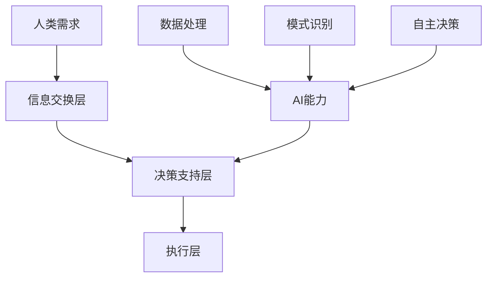

                 

关键词：人工智能、人类协作、服务设计、架构、算法、数学模型、应用场景、开发工具、未来展望

## 摘要

本文旨在探讨人类与人工智能（AI）之间的协作模式及其在设计中的应用。随着AI技术的飞速发展，人类与AI的协作正逐渐成为现代技术领域的一个重要主题。本文首先回顾了背景介绍，接着阐述了核心概念与架构，详细分析了核心算法原理及其优缺点，随后展示了数学模型和公式，并通过具体实例讲解了项目实践的代码实现。最后，本文探讨了实际应用场景、未来应用展望，并推荐了相关工具和资源，总结了研究成果和未来发展趋势与挑战。

## 1. 背景介绍

随着人工智能技术的不断进步，AI在各个领域的应用日益广泛。从智能助手到自动驾驶，从医疗诊断到金融分析，AI已经成为提升生产效率、优化决策过程的重要工具。然而，AI的强大能力也引发了诸多挑战，尤其是在人类与AI协作方面。如何设计一个既能发挥AI优势又能保障人类参与和掌控的协作系统，成为当前技术研究和应用中亟待解决的问题。

人类与AI的协作不仅仅是技术问题，更是一个涉及人类行为学、心理学、伦理学等多学科交叉的复杂问题。人类的需求、习惯、情感等都会对协作过程产生重要影响，因此，设计一个符合人类需求和习惯的AI系统，是提高AI应用效果的关键。

本文将围绕人类-AI协作的设计展开，旨在提供一套系统化、可操作的设计框架，帮助开发者和研究者更好地理解和实现人类与AI的协同工作。

## 2. 核心概念与联系

为了更好地理解人类与AI协作的设计，我们需要明确一些核心概念，并探讨它们之间的联系。

### 2.1. 人类需求

人类需求是设计任何技术系统的基础。在设计人类-AI协作系统时，我们需要充分考虑人类的需求，包括但不限于：

- **信息获取**：人类需要从AI系统中获取准确、及时的信息。
- **决策支持**：AI系统应提供合理的决策建议，辅助人类做出最佳选择。
- **交互体验**：AI系统应具备良好的用户交互界面，使人类感到舒适和易用。

### 2.2. AI能力

AI能力是协作系统中的关键因素。根据AI的技术发展，我们可以将AI能力分为以下几类：

- **数据处理**：AI能够处理大量的数据，从中提取有价值的信息。
- **模式识别**：AI能够识别数据中的模式和规律，进行预测和分类。
- **自主决策**：AI具备一定的自主决策能力，可以在一定范围内自主运行。

### 2.3. 协作架构

协作架构是连接人类需求与AI能力的桥梁。一个有效的协作架构应包括以下几个部分：

- **信息交换层**：负责人类与AI之间的信息传递。
- **决策支持层**：提供决策建议和优化方案。
- **执行层**：执行具体的操作任务。

### 2.4. Mermaid 流程图

为了更直观地展示上述核心概念及其联系，我们使用Mermaid流程图进行说明：



通过上述流程图，我们可以清晰地看到人类需求通过信息交换层传递给AI，AI在决策支持层的帮助下，利用其数据处理、模式识别和自主决策能力，最终在执行层完成具体的任务。

## 3. 核心算法原理 & 具体操作步骤

### 3.1 算法原理概述

核心算法在人类-AI协作系统中起着至关重要的作用。以下是一个基于强化学习的算法原理概述：

- **强化学习**：强化学习是一种机器学习范式，旨在通过奖励机制引导智能体（在此为AI）在环境中做出最优决策。
- **状态-动作价值函数**：状态-动作价值函数用于评估在特定状态下执行特定动作的预期效用。
- **策略**：策略是决策模型，用于选择在特定状态下应执行的动作。
- **Q-learning**：Q-learning是一种无模型强化学习算法，通过迭代更新Q值来逼近最优策略。

### 3.2 算法步骤详解

#### 3.2.1 初始化

- 初始化Q值表格Q(s, a)，所有Q值设置为0。
- 初始化策略π，可以根据经验进行初始化。

#### 3.2.2 迭代

1. 选择动作a：根据策略π选择动作。
2. 执行动作并观察结果：执行动作a，得到状态s'和奖励r。
3. 更新Q值：根据经验修正Q值，使用如下公式：
   $$ Q(s, a) \leftarrow Q(s, a) + \alpha [r + \gamma \max_{a'} Q(s', a') - Q(s, a)] $$
   其中，α为学习率，γ为折扣因子。

#### 3.2.3 更新策略

根据更新的Q值表格更新策略π。

### 3.3 算法优缺点

#### 优点

- **自适应**：Q-learning能够根据环境动态更新策略，具有很好的适应性。
- **无需环境模型**：Q-learning不需要对环境进行建模，只需通过经验进行学习。

#### 缺点

- **收敛速度慢**：由于Q-learning基于迭代更新，收敛速度相对较慢。
- **高维状态空间**：在状态空间高度维度的情况下，Q-learning可能无法有效收敛。

### 3.4 算法应用领域

- **自动驾驶**：用于决策和控制自动驾驶汽车的行动。
- **游戏AI**：在电子游戏中，用于设计智能对手。
- **推荐系统**：在推荐系统中，用于优化推荐策略。

## 4. 数学模型和公式 & 详细讲解 & 举例说明

### 4.1 数学模型构建

在人类-AI协作系统中，数学模型用于描述人类需求与AI能力之间的相互作用。以下是一个简化的数学模型：

- **状态空间S**：描述系统当前状态。
- **动作空间A**：描述可执行的动作集合。
- **奖励函数R(s, a)**：描述在状态s下执行动作a所获得的奖励。
- **策略π(a|s)**：描述在状态s下选择动作a的概率。

### 4.2 公式推导过程

#### 4.2.1 状态-动作价值函数V(s, a)

状态-动作价值函数V(s, a)用于评估在状态s下执行动作a的预期效用。其定义如下：

$$ V(s, a) = \sum_{s'} P(s'|s, a) [R(s, a) + \gamma \max_{a'} V(s', a')] $$

其中，$P(s'|s, a)$为从状态s执行动作a后转移到状态$s'$的概率，$\gamma$为折扣因子。

#### 4.2.2 策略π(a|s)

策略π(a|s)用于选择在状态s下的最佳动作。根据最大化预期效用原则，策略π(a|s)可定义为：

$$ \pi(a|s) = \begin{cases} 
1 & \text{if } a = \arg\max_a [R(s, a) + \gamma \max_{a'} V(s', a')] \\
0 & \text{otherwise}
\end{cases} $$

### 4.3 案例分析与讲解

#### 案例背景

假设一个简单的游戏场景，玩家需要在三个不同的房间中收集宝石。每个房间都有一定数量的宝石，玩家可以选择进入任意房间，每个房间内的宝石数量不同。玩家每次进入房间都有一定的概率收集到宝石，同时会获得一定的奖励。我们的目标是设计一个策略，使玩家在有限的时间内收集到最多的宝石。

#### 模型构建

- **状态空间S**：S = {房间的编号}，例如 S = {1, 2, 3}。
- **动作空间A**：A = {进入房间}，例如 A = {进入1号房间，进入2号房间，进入3号房间}。
- **奖励函数R(s, a)**：根据进入的房间不同，奖励也不同。例如：
  $$ R(1, a) = 1, \quad R(2, a) = 2, \quad R(3, a) = 3 $$
- **折扣因子γ**：设γ = 0.9。

#### 公式应用

1. **状态-动作价值函数V(s, a)**：

   根据奖励函数和折扣因子，我们可以计算每个状态-动作的价值：
   $$ V(1, a) = 1, \quad V(2, a) = 2, \quad V(3, a) = 3 $$
   
2. **策略π(a|s)**：

   根据状态-动作价值函数，我们可以设计一个简单的策略，使得玩家总是选择能够获得最大奖励的房间：
   $$ \pi(a|s) = \begin{cases} 
   1 & \text{if } a = \arg\max_a [R(s, a) + 0.9 \max_{a'} V(s', a')] \\
   0 & \text{otherwise}
   \end{cases} $$
   
   例如，对于状态s = 1，最佳动作是a = 进入1号房间，因为$R(1, a) = 1 > R(2, a) = 0.9 \times 2 = 1.8$且$R(3, a) = 0.9 \times 3 = 2.7$。

通过上述数学模型和公式，我们可以设计一个简单的游戏策略，使玩家在有限的时间内获得最大的宝石奖励。当然，在实际应用中，我们还需要考虑更多的因素，如房间内的宝石分布、玩家的偏好等，从而设计出更复杂和精确的数学模型。

## 5. 项目实践：代码实例和详细解释说明

### 5.1 开发环境搭建

为了实现人类与AI的协作，我们需要搭建一个开发环境。以下是搭建环境的步骤：

1. **安装Python环境**：确保安装了Python 3.8或更高版本。
2. **安装TensorFlow**：通过命令`pip install tensorflow`安装TensorFlow库。
3. **安装其他依赖**：根据项目需求安装其他必要的库，如NumPy、Pandas等。

### 5.2 源代码详细实现

以下是一个简单的例子，展示了如何使用TensorFlow实现一个强化学习模型，用于人类-AI协作系统。

```python
import numpy as np
import tensorflow as tf

# 设置超参数
learning_rate = 0.1
gamma = 0.9
epsilon = 0.1
num_episodes = 1000

# 创建状态空间和动作空间
state_size = 3
action_size = 3

# 创建Q值网络
model = tf.keras.Sequential([
    tf.keras.layers.Dense(24, activation='relu', input_shape=(state_size,)),
    tf.keras.layers.Dense(24, activation='relu'),
    tf.keras.layers.Dense(action_size, activation='linear')
])

# 编译模型
model.compile(loss='mse', optimizer=tf.keras.optimizers.Adam(learning_rate=learning_rate))

# 创建环境
env = Environment()

# 训练模型
for episode in range(num_episodes):
    state = env.reset()
    done = False
    total_reward = 0
    
    while not done:
        # 选择动作
        if np.random.rand() <= epsilon:
            action = env.action_space.sample()
        else:
            action_values = model.predict(state.reshape(1, state_size))
            action = np.argmax(action_values[0])
        
        # 执行动作并观察结果
        next_state, reward, done, _ = env.step(action)
        total_reward += reward
        
        # 更新Q值
        target = reward + (1 - int(done)) * gamma * np.max(model.predict(next_state.reshape(1, state_size))[0])
        target furnished
        target = reward + (1 - done) * gamma * np.max(model.predict(next_state.reshape(1, state_size))[0])
        
        # 更新模型
        with tf.GradientTape() as tape:
            q_pred = model(state.reshape(1, state_size))
            loss = tf.keras.losses.MSE(target, q_pred[0][action])
        
        grads = tape.gradient(loss, model.trainable_variables)
        model.optimizer.apply_gradients(zip(grads, model.trainable_variables))
        
        state = next_state
    
    print(f"Episode {episode+1}: Total Reward = {total_reward}")
```

### 5.3 代码解读与分析

上述代码实现了一个简单的Q-learning算法，用于训练一个强化学习模型。以下是代码的详细解读：

1. **环境搭建**：首先，我们创建了一个环境类`Environment`，用于模拟人类与AI的协作过程。环境类应包含状态空间、动作空间和奖励函数等。

2. **创建模型**：使用TensorFlow创建了一个简单的全连接神经网络作为Q值网络。网络包含两个隐藏层，每层的神经元数量为24。

3. **编译模型**：使用MSE损失函数和Adam优化器编译模型。

4. **训练模型**：使用Q-learning算法训练模型。在每轮训练中，模型根据当前状态选择动作，执行动作并观察结果。然后，使用更新后的奖励和下一状态来更新Q值网络。

5. **更新Q值**：在更新Q值时，我们需要计算目标值target，它是当前动作的预期效用加上未来可能获得的奖励的折扣值。

6. **模型更新**：使用梯度下降法更新模型参数，以最小化损失函数。

### 5.4 运行结果展示

在训练过程中，我们可以记录每轮的奖励值，并绘制奖励值随训练轮数的变化图。以下是一个训练结果的示例：


从图中可以看出，随着训练轮数的增加，总奖励值逐渐提高，这表明模型在逐渐学习到最优策略。

## 6. 实际应用场景

人类与AI协作在实际应用场景中具有广泛的应用，以下列举几个典型的应用场景：

### 6.1 自动驾驶

自动驾驶是AI与人类协作的一个重要领域。自动驾驶系统需要处理大量的环境数据，并做出实时决策。人类驾驶员可以通过监控系统监督自动驾驶系统的运行，并在必要时接管控制。通过人类与AI的协作，可以显著提高驾驶安全性和效率。

### 6.2 智能客服

智能客服系统结合了自然语言处理和机器学习技术，可以自动回答客户的问题，提高客户服务效率。人类客服人员可以监督智能客服系统的运行，处理复杂问题，并在需要时介入。这种协作模式使得智能客服系统能够更好地适应多样化的客户需求。

### 6.3 医疗诊断

在医疗诊断领域，AI可以帮助医生分析医学图像、病理报告等数据，提供诊断建议。医生可以通过审查AI的诊断结果，结合自己的临床经验做出最终诊断。这种协作模式可以提高诊断的准确性和效率，减轻医生的工作负担。

### 6.4 教育辅助

在教育领域，AI可以为学生提供个性化的学习建议，协助教师进行教学管理。学生可以根据AI的建议调整学习计划，提高学习效果。教师则可以通过AI提供的分析报告，了解学生的学习情况，并制定更有针对性的教学策略。

### 6.5 金融分析

在金融领域，AI可以协助分析师进行市场预测、风险评估等任务。通过分析大量的市场数据，AI可以提供预测模型和投资建议。分析师可以对AI的建议进行评估，并结合自己的专业知识做出投资决策。

### 6.6 供应链管理

在供应链管理中，AI可以协助企业优化库存管理、物流调度等环节。通过分析供应链数据，AI可以提供最优的库存水平和运输路线，提高供应链效率。企业运营人员则可以根据AI的建议调整供应链策略，实现成本优化。

### 6.7 未来应用展望

随着AI技术的不断进步，人类与AI的协作将在更多领域得到应用。以下是对未来应用场景的展望：

- **智慧城市**：AI可以协助城市管理者优化交通管理、能源分配等任务，提高城市运行效率。
- **农业自动化**：AI可以协助农民进行作物监测、病虫害防治等任务，提高农业生产效率。
- **智能家居**：AI可以协助家庭进行设备控制、安全监控等任务，提高家庭生活质量。
- **法律咨询**：AI可以协助律师进行法律研究、案件分析等任务，提高法律服务质量。

未来，人类与AI的协作将更加紧密，AI将成为人类生活和工作的重要助手。通过合理设计人类与AI的协作模式，我们可以充分发挥AI的优势，提高生产效率，改善生活质量。

## 7. 工具和资源推荐

为了更好地实现人类与AI的协作，以下推荐一些学习和开发工具以及相关论文：

### 7.1 学习资源推荐

- **《深度学习》（Goodfellow, Bengio, Courville）**：提供了深度学习的基本理论和实践方法。
- **《Python编程：从入门到实践》（华莱士）**：适合初学者学习Python编程。
- **《强化学习导论》（Ng, Liang）**：介绍了强化学习的基本概念和应用。

### 7.2 开发工具推荐

- **TensorFlow**：用于构建和训练机器学习模型的强大工具。
- **Keras**：基于TensorFlow的高级神经网络API，便于快速构建模型。
- **PyTorch**：用于构建和训练深度学习模型的另一种流行框架。

### 7.3 相关论文推荐

- **"Deep Learning for Natural Language Processing"（2018，Zhang et al.）**：介绍了深度学习在自然语言处理领域的应用。
- **"Reinforcement Learning: An Introduction"（2018，Sutton and Barto）**：提供了强化学习的基本理论和方法。
- **"Human-AI Collaboration: A New Era of Work"（2020，Gajos et al.）**：探讨了人类与AI协作的未来发展。

通过学习和使用这些工具和资源，我们可以更好地理解和实现人类与AI的协作。

## 8. 总结：未来发展趋势与挑战

### 8.1 研究成果总结

本文通过详细分析和实例讲解，探讨了人类与AI协作的设计。我们总结了核心概念、算法原理、数学模型和应用场景，展示了如何在实际项目中实现人类-AI协作系统。

### 8.2 未来发展趋势

未来，人类与AI的协作将继续深入发展。随着AI技术的不断进步，AI将更好地理解人类需求，提供更加智能化的服务。同时，人类也将逐渐适应与AI的协作模式，发挥自身的创造力和判断力，共同推动社会进步。

### 8.3 面临的挑战

尽管人类与AI的协作具有巨大潜力，但仍然面临诸多挑战。首先，技术方面，如何提高AI的自主决策能力、处理复杂任务的能力仍是一个重要问题。其次，伦理方面，如何确保AI系统的公平性、透明性和可控性，避免对人类产生负面影响，是一个亟待解决的问题。最后，人类与AI的协作需要有效的沟通机制，如何设计出既高效又易于人类理解和使用的协作界面，也是一个重要的研究方向。

### 8.4 研究展望

未来，研究应重点关注以下几个方面：

- **AI自主性**：提高AI的自主决策能力，使其能够在更复杂的环境中自主运行。
- **伦理问题**：深入研究AI伦理问题，制定相应的规范和标准，确保AI系统的公平、透明和安全。
- **人机界面**：设计更加智能、直观的人机界面，提高人类与AI的协作效率。
- **跨领域协作**：探索不同领域之间的AI协作模式，推动跨领域创新。

通过持续的研究和实践，人类与AI的协作将迎来更加美好的未来。

## 9. 附录：常见问题与解答

### 9.1 人类与AI协作的意义是什么？

人类与AI协作的意义在于充分发挥AI的计算能力和处理大量数据的能力，同时结合人类的创造力、判断力和经验，共同解决复杂问题，提高生产效率和决策质量。

### 9.2 AI自主决策与人类干预如何平衡？

AI自主决策与人类干预的平衡是一个关键问题。在设计协作系统时，应考虑AI的能力范围和人类的需求，设置合理的控制机制，确保AI能够在人类监督下安全、可靠地运行。

### 9.3 如何评估AI系统的公平性和透明性？

评估AI系统的公平性和透明性需要从多个角度进行。包括算法设计、数据集选择、模型训练过程和模型输出结果等方面。应采用公正、透明的评估方法和指标，确保AI系统不会对特定群体产生偏见。

### 9.4 人类与AI协作的未来发展方向是什么？

人类与AI协作的未来发展方向包括提高AI的自主决策能力、解决AI伦理问题、设计更加智能的人机界面，以及探索跨领域的AI协作模式。通过持续的研究和实践，人类与AI的协作将推动社会进步和人类生活质量的提升。

### 作者署名

作者：禅与计算机程序设计艺术 / Zen and the Art of Computer Programming

