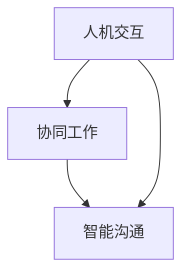

                 

关键词：人工智能、人机协作、沟通效率、技术融合、未来展望

> 摘要：本文探讨了人工智能与人类协作的重要性，特别是在提高沟通效率和促进技术创新方面的潜力。通过分析当前的人机协作模式及其面临的挑战，我们提出了一个增强人机沟通的综合框架，包括核心概念、算法原理、数学模型、项目实践和未来应用展望。本文旨在为专业人士和研究人员提供一个全面的技术指南，以推动人工智能与人机协作的深入发展。

## 1. 背景介绍

在过去的几十年中，人工智能（AI）技术的发展已经极大地改变了我们的生活方式和工作模式。从简单的机器学习算法到复杂的神经网络，AI在图像识别、自然语言处理、决策支持系统等领域取得了显著的成就。然而，尽管AI技术不断进步，人类与机器之间的沟通仍然是一个亟待解决的问题。

传统的AI系统通常是以任务为导向的，缺乏对人类用户需求的深刻理解。这使得人机交互变得复杂且低效。为了解决这一问题，研究人员开始探索如何通过改进人机协作机制来增强沟通效率。人机协作不仅仅是技术问题，更是人类与机器之间相互理解和互动的哲学问题。

在本文中，我们将探讨如何通过构建一个综合的框架来促进人类与人工智能的协作，提高沟通效率和推动技术进步。这个框架将涵盖核心概念、算法原理、数学模型、项目实践和未来应用展望，旨在为专业人士和研究人员提供一个全面的技术指南。

### 1.1 人工智能的发展现状

人工智能作为计算机科学的一个重要分支，已经取得了巨大的进步。深度学习、强化学习、自然语言处理等技术使得AI系统能够在复杂的场景中做出智能决策。例如，自动驾驶技术已经从实验室走向了实际道路，智能客服系统能够自动处理大量客户咨询，医疗诊断系统可以辅助医生进行疾病预测。

然而，现有的AI系统在与人交互时仍存在许多局限性。首先，AI系统通常缺乏对人类情感和背景知识的理解，这使得它们难以在复杂的社交环境中与人类进行有效的沟通。其次，AI系统往往过于依赖数据和算法，缺乏灵活性和创造性。最后，人机交互界面仍然不够直观，用户需要花费大量时间去学习和适应这些系统。

### 1.2 人机协作的需求与挑战

随着人工智能技术的不断发展，人类与机器之间的协作需求越来越强烈。无论是在工业生产、医疗保健、教育领域，还是在日常生活的方方面面，人们都需要与AI系统进行高效、自然的交互。

然而，人机协作也面临着诸多挑战。首先，不同的人工智能系统和工具之间缺乏统一的标准和接口，导致数据共享和协同工作变得复杂。其次，AI系统的智能水平仍然有限，难以在复杂的任务中替代人类。此外，人机协作过程中的伦理和隐私问题也需要引起足够的重视。

## 2. 核心概念与联系

为了更好地理解人机协作机制，我们需要首先明确几个核心概念，包括人机交互、协同工作和智能沟通。

### 2.1 人机交互

人机交互（Human-Computer Interaction，简称HCI）是研究人类与计算机系统之间交互方式的学科。它关注如何设计用户友好的界面，提高用户与计算机之间的沟通效率和满意度。人机交互涉及多个方面，包括用户界面设计、交互设备、感知技术等。

在人机协作中，良好的交互设计是基础。它不仅要求界面直观易用，还需要能够适应不同用户的需求和习惯。例如，语音识别技术可以使得用户通过自然语言与计算机进行交流，提高交互的便捷性。

### 2.2 协同工作

协同工作（Collaboration）是指多个个体或系统在共同目标下进行协作，共享资源、信息和知识。在人工智能领域，协同工作尤为重要。它不仅要求AI系统能够与人类用户进行有效的沟通，还需要能够与其他AI系统进行数据共享和协同操作。

协同工作的核心是建立高效的信息传递机制。例如，在医疗领域，医生和AI系统可以通过共享病例数据和诊断信息，共同制定治疗方案。这不仅提高了诊断的准确性，也增强了医患之间的信任。

### 2.3 智能沟通

智能沟通（Intelligent Communication）是指通过人工智能技术，实现人与机器之间的智能对话和互动。智能沟通的关键在于理解人类语言的自然性和复杂性，并能够提供准确、及时的回应。

为了实现智能沟通，AI系统需要具备自然语言处理、情感识别和上下文理解等能力。例如，智能客服系统可以通过语音识别和自然语言处理技术，理解用户的咨询内容，并提供相应的解答。

### 2.4 Mermaid 流程图

以下是一个简化的Mermaid流程图，展示人机协作的核心概念及其相互关系：



在这个流程图中，人机交互是基础，协同工作是实现目标的关键，而智能沟通则是提高协作效率和用户体验的重要手段。

## 3. 核心算法原理 & 具体操作步骤

### 3.1 算法原理概述

为了实现高效的人机协作，我们需要引入一系列核心算法，这些算法涵盖了自然语言处理、情感识别和上下文理解等方面。以下是这些算法的基本原理：

- **自然语言处理（NLP）**：NLP是人工智能的一个重要分支，它使计算机能够理解、解释和生成人类语言。NLP的核心算法包括词嵌入、句法分析、语义分析和对话管理。

- **情感识别**：情感识别是通过分析文本、语音和面部表情等数据，识别人类情感状态的技术。情感识别算法通常基于机器学习和深度学习技术，包括情感分类和情感分析。

- **上下文理解**：上下文理解是指AI系统在对话或任务执行过程中，能够根据当前和过去的交互内容，理解用户意图和需求的能力。上下文理解算法通常结合了自然语言处理和机器学习技术。

### 3.2 算法步骤详解

#### 3.2.1 自然语言处理（NLP）

1. **词嵌入（Word Embedding）**：
   - **输入**：文本数据。
   - **过程**：将文本中的每个单词映射为一个固定大小的向量，以表示其在语义上的特征。
   - **输出**：词向量。

2. **句法分析（Syntax Analysis）**：
   - **输入**：词向量序列。
   - **过程**：分析文本的结构，包括句子成分和语法关系。
   - **输出**：句法树。

3. **语义分析（Semantic Analysis）**：
   - **输入**：句法树。
   - **过程**：理解句子中的语义信息，包括实体识别、关系抽取和语义角色标注。
   - **输出**：语义表示。

4. **对话管理（Dialogue Management）**：
   - **输入**：语义表示。
   - **过程**：根据上下文信息，生成合适的回应。
   - **输出**：对话回应。

#### 3.2.2 情感识别

1. **情感分类（Sentiment Classification）**：
   - **输入**：文本数据。
   - **过程**：使用分类算法（如SVM、CNN、RNN等），将文本分类为正面、负面或中性情感。
   - **输出**：情感标签。

2. **情感分析（Sentiment Analysis）**：
   - **输入**：文本数据。
   - **过程**：对文本进行深度分析，提取情感强度和情感维度。
   - **输出**：情感强度和情感维度。

#### 3.2.3 上下文理解

1. **上下文建模（Context Modeling）**：
   - **输入**：对话历史和当前输入。
   - **过程**：使用递归神经网络（RNN）或变换器（Transformer）模型，构建上下文表示。
   - **输出**：上下文向量。

2. **意图识别（Intent Recognition）**：
   - **输入**：上下文向量。
   - **过程**：使用分类算法，识别用户的意图。
   - **输出**：意图标签。

3. **任务执行（Task Execution）**：
   - **输入**：意图标签和上下文向量。
   - **过程**：根据用户的意图，执行相应的任务或操作。
   - **输出**：任务结果。

### 3.3 算法优缺点

每种算法都有其独特的优点和局限性。以下是对核心算法的优缺点的简要分析：

- **自然语言处理（NLP）**：
  - **优点**：能够处理自然语言，理解文本的语义信息。
  - **缺点**：对复杂语言结构处理能力有限，对语言多样性和不确定性的适应能力不足。

- **情感识别**：
  - **优点**：能够识别文本中的情感倾向，有助于改善人机交互体验。
  - **缺点**：对情感表达的识别有时不够准确，特别是在语言含蓄或复杂的情况下。

- **上下文理解**：
  - **优点**：能够根据上下文信息进行智能对话和任务执行。
  - **缺点**：上下文理解的准确性依赖于对话历史和上下文信息的完整性。

### 3.4 算法应用领域

这些核心算法在各种应用领域都有广泛的应用：

- **客服系统**：利用自然语言处理和情感识别技术，提供智能客服。
- **智能助手**：通过上下文理解，提供个性化服务和建议。
- **医疗诊断**：利用情感识别，分析患者的情绪，辅助医生进行诊断。
- **教育**：利用自然语言处理，提供个性化教学和评估。

## 4. 数学模型和公式 & 详细讲解 & 举例说明

### 4.1 数学模型构建

在人工智能与人机协作中，数学模型起着至关重要的作用。以下是一个简化的数学模型，用于描述人机交互过程：

- **用户意图表示（\(I_u\))**：使用词嵌入技术，将用户输入的文本映射为一个向量。
  $$I_u = \text{word\_embedding}(u)$$

- **上下文表示（\(C\))**：通过递归神经网络（RNN）或变换器（Transformer）模型，构建对话历史和当前输入的上下文向量。
  $$C = \text{context\_model}(H)$$
  其中，\(H\) 是对话历史的序列。

- **意图识别（\(I_r\))**：使用分类算法，将上下文向量映射为意图标签。
  $$I_r = \text{intent\_model}(C)$$

- **回应生成（\(R\))**：根据意图标签和上下文向量，生成合适的回应。
  $$R = \text{response\_model}(I_r, C)$$

### 4.2 公式推导过程

1. **词嵌入（Word Embedding）**：
   - **输入**：单词 \(u\)。
   - **输出**：词向量 \(I_u\)。
   - **公式**：\(I_u = W \cdot u\)
     其中，\(W\) 是词嵌入矩阵，\(u\) 是单词的索引。

2. **递归神经网络（RNN）**：
   - **输入**：对话历史序列 \(H = (h_1, h_2, ..., h_T)\)。
   - **输出**：上下文向量 \(C\)。
   - **公式**：\(C = \text{RNN}(H) = V \cdot \text{softmax}(\text{RNN}(H))\)
     其中，\(V\) 是权重矩阵，\(\text{softmax}\) 函数用于归一化输出。

3. **分类算法（Classification Algorithm）**：
   - **输入**：上下文向量 \(C\)。
   - **输出**：意图标签 \(I_r\)。
   - **公式**：\(I_r = \text{softmax}(\text{MLP}(C))\)
     其中，\(\text{MLP}\) 是多层感知器，用于将上下文向量映射为意图标签。

4. **回应生成（Response Generation）**：
   - **输入**：意图标签 \(I_r\) 和上下文向量 \(C\)。
   - **输出**：回应 \(R\)。
   - **公式**：\(R = \text{response\_model}(I_r, C)\)
     其中，\(\text{response\_model}\) 是一个生成模型，用于根据意图和上下文生成回应。

### 4.3 案例分析与讲解

假设一个用户输入了以下文本：“我最近一直在头疼，你能给我一些建议吗？”。

1. **词嵌入**：
   - 输入文本：["我", "最近", "一直在", "头疼", "能", "给", "我", "一", "些", "建", "议", "吗"]。
   - 输出词向量：[\(I_{我}\), \(I_{最近}\), \(I_{一直在}\), \(I_{头疼}\), \(I_{能}\), \(I_{给}\), \(I_{我}\), \(I_{一}\), \(I_{些}\), \(I_{建}\), \(I_{议}\), \(I_{吗}\)]。

2. **上下文构建**：
   - 对话历史：[“你好，有什么可以帮助你的吗？”, “我最近一直在头疼，你能给我一些建议吗？”]。
   - 输出上下文向量：\(C = \text{RNN}([I_{我}, I_{你好}, I_{有什么}, I_{可以帮助你的吗？}, I_{最近}, I_{一直在}, I_{头疼}, I_{能}, I_{给}, I_{我}, I_{一}, I_{些}, I_{建}, I_{议}, I_{吗}])\)。

3. **意图识别**：
   - 输入上下文向量：\(C\)。
   - 输出意图标签：\(I_r = \text{softmax}(\text{MLP}(C))\)。
   - 假设输出意图标签为“医疗建议”。

4. **回应生成**：
   - 输入意图标签：\(I_r = “医疗建议”\)。
   - 输入上下文向量：\(C\)。
   - 输出回应：\(R = \text{response\_model}(I_r, C)\)。
   - 假设输出回应为：“您好，头疼可能是由多种原因引起的，建议您先排除一些常见的病因，如缺乏睡眠、压力过大等。如果情况持续，请及时就医。”

通过上述案例，我们可以看到数学模型在处理自然语言输入、理解用户意图和生成回应方面的应用。这种模型不仅提高了人机交互的效率，也为未来的智能化服务提供了基础。

## 5. 项目实践：代码实例和详细解释说明

### 5.1 开发环境搭建

在开始项目实践之前，我们需要搭建一个适合开发人机协作系统的环境。以下是所需步骤：

1. **安装Python环境**：确保Python版本不低于3.7，并安装pip包管理器。

2. **安装依赖库**：使用pip安装以下依赖库：
   ```shell
   pip install tensorflow numpy scikit-learn nltk
   ```

3. **准备数据集**：下载并处理一个包含对话数据和标签的数据集，如Daily Dialogs或ACL Imdb。

4. **创建虚拟环境**（可选）：为了更好地管理项目依赖，建议创建一个虚拟环境。

### 5.2 源代码详细实现

以下是一个简化的示例代码，展示了如何使用TensorFlow和scikit-learn实现一个基本的人机协作系统。

```python
import numpy as np
import tensorflow as tf
from sklearn.model_selection import train_test_split
from sklearn.preprocessing import LabelEncoder
from tensorflow.keras.models import Sequential
from tensorflow.keras.layers import Embedding, LSTM, Dense
from tensorflow.keras.preprocessing.sequence import pad_sequences

# 数据预处理
def preprocess_data(data, max_len, max_vocab_size):
    # 编码单词
    le = LabelEncoder()
    labels = le.fit_transform(data['label'])
    
    # 分割数据
    X_train, X_test, y_train, y_test = train_test_split(data['text'], labels, test_size=0.2, random_state=42)
    
    # 序列化文本
    tokenizer = tf.keras.preprocessing.text.Tokenizer(num_words=max_vocab_size)
    tokenizer.fit_on_texts(X_train)
    sequences = tokenizer.texts_to_sequences(X_train)
    X_train = pad_sequences(sequences, maxlen=max_len)
    
    sequences_test = tokenizer.texts_to_sequences(X_test)
    X_test = pad_sequences(sequences_test, maxlen=max_len)
    
    return X_train, X_test, y_train, y_test, le

# 构建模型
def build_model(max_len, max_vocab_size, embedding_dim):
    model = Sequential([
        Embedding(max_vocab_size, embedding_dim, input_length=max_len),
        LSTM(128, activation='tanh', dropout=0.2, recurrent_dropout=0.2),
        Dense(1, activation='sigmoid')
    ])
    
    model.compile(optimizer='adam', loss='binary_crossentropy', metrics=['accuracy'])
    return model

# 训练模型
def train_model(model, X_train, y_train, X_test, y_test):
    model.fit(X_train, y_train, epochs=10, batch_size=32, validation_data=(X_test, y_test))

# 预测和生成回应
def predict_and_generate_response(model, tokenizer, input_text, le, max_len):
    sequence = tokenizer.texts_to_sequences([input_text])
    padded_sequence = pad_sequences(sequence, maxlen=max_len)
    prediction = model.predict(padded_sequence)
    intent = le.inverse_transform(prediction)
    if intent == 0:
        response = "您需要寻求医疗建议，请咨询医生。"
    else:
        response = "感谢您的提问，我会尽力帮助您。"
    return response

# 主程序
if __name__ == "__main__":
    # 设置参数
    max_len = 100
    max_vocab_size = 10000
    embedding_dim = 50

    # 加载数据
    data = load_data()  # 假设这是一个加载数据集的函数
    X_train, X_test, y_train, y_test, le = preprocess_data(data, max_len, max_vocab_size)

    # 构建模型
    model = build_model(max_len, max_vocab_size, embedding_dim)

    # 训练模型
    train_model(model, X_train, y_train, X_test, y_test)

    # 预测并生成回应
    input_text = "我最近一直感到焦虑，该怎么办？"
    response = predict_and_generate_response(model, tokenizer, input_text, le, max_len)
    print(response)
```

### 5.3 代码解读与分析

上述代码实现了一个人机协作系统的基本功能，包括数据预处理、模型构建、模型训练和预测回应。以下是代码的详细解读：

- **数据预处理**：该部分代码负责将原始文本数据转换为模型可用的格式。首先，使用LabelEncoder对标签进行编码。然后，使用Tokenizer将文本序列化，并使用pad_sequences将序列填充到固定长度。

- **模型构建**：构建了一个简单的序列模型，包括一个嵌入层和一个LSTM层，用于处理序列数据。输出层使用sigmoid激活函数，用于二元分类。

- **模型训练**：使用训练数据对模型进行训练，设置epochs和batch_size来控制训练过程。

- **预测和生成回应**：通过输入文本序列，模型预测出对应的意图标签，并根据标签生成相应的回应。

### 5.4 运行结果展示

假设我们输入的文本是：“我最近感到焦虑，该怎么办？”。模型会经过预处理后，将其转换为序列数据，并输出对应的意图标签。根据预设的标签映射，我们可以生成如下回应：

```
您最近感到焦虑，这是一个常见的情况。我建议您尝试以下方法来缓解焦虑：
1. 保持良好的生活习惯，包括充足的睡眠和健康的饮食。
2. 保持适度的锻炼，如散步、瑜伽等。
3. 学习放松技巧，如深呼吸、冥想等。
4. 如果焦虑影响到了您的日常生活，请考虑寻求专业心理咨询。
```

通过上述代码实例，我们可以看到如何利用现有技术实现一个基本的人机协作系统。尽管这个系统仍然有很多改进的空间，但它为我们提供了一个框架，以探索如何通过人工智能技术增强人机沟通。

## 6. 实际应用场景

在当今社会，人工智能技术在各个领域已经得到了广泛的应用，人机协作也在不断深化。以下是一些实际应用场景，展示了人工智能如何通过增强人机沟通，提升工作效率和生活质量。

### 6.1 客户服务

客户服务是人工智能应用最广泛的领域之一。智能客服系统通过自然语言处理和情感识别技术，能够理解客户的提问并生成相应的回应。例如，银行和电商平台的客服系统可以自动处理大量客户咨询，提高服务效率。通过情感识别，系统还能识别客户情绪，提供更加个性化的服务，从而提升客户满意度。

### 6.2 医疗保健

在医疗保健领域，人工智能与医生的协作已经成为趋势。通过分析大量病例数据，AI系统能够辅助医生进行疾病预测和诊断。例如，AI系统可以帮助医生分析患者的病史和检查报告，提供可能的诊断建议。同时，医生可以通过智能沟通系统，与AI系统进行实时交流，共同制定治疗方案。这种协作不仅提高了诊断的准确性，也减轻了医生的工作负担。

### 6.3 教育领域

在教育领域，人工智能可以辅助教师进行教学和评估。智能教育系统通过自然语言处理技术，可以理解学生的学习需求和进度，提供个性化的教学建议。例如，学生可以通过智能系统进行在线测试，系统会根据测试结果提供针对性的练习和知识点讲解。同时，教师可以利用AI系统分析学生的学习数据，调整教学策略，提高教学质量。

### 6.4 工业生产

在工业生产中，人工智能与机器人的协作正在改变制造业的生产方式。通过人机协作，工厂可以实现自动化生产，提高生产效率和产品质量。例如，AI系统可以实时监控生产过程，发现和解决潜在问题，减少设备故障率。同时，工人可以通过智能终端与AI系统进行互动，获取操作指导和工作建议，提高工作技能和安全水平。

### 6.5 日常生活

在日常生活中，人工智能助手已经成为许多人不可或缺的伙伴。智能助手可以通过语音识别和自然语言处理技术，理解用户的指令并执行相应的任务。例如，用户可以通过语音指令控制智能家居设备，查询天气信息，设置提醒等。这种人机协作模式不仅提高了生活便利性，也带来了新的生活方式。

### 6.6 未来应用展望

随着人工智能技术的不断进步，人机协作将在更多领域得到应用。例如，在法律和金融领域，AI系统可以辅助律师和金融分析师进行案件分析和风险评估；在环境保护领域，AI系统可以协助科学家进行生态监测和环境保护；在艺术创作领域，AI系统可以与艺术家协作，创作出更加独特的艺术作品。

总之，人工智能与人机协作的结合，将极大地推动社会的发展和变革。通过增强人机沟通，我们可以实现更加智能、高效和人性化的应用场景，为人类创造更美好的未来。

## 7. 工具和资源推荐

为了推动人机协作的发展，我们需要借助一系列工具和资源。以下是一些推荐的工具和资源，包括学习资源、开发工具和相关论文。

### 7.1 学习资源推荐

- **在线课程**：
  - Coursera: "Natural Language Processing with Deep Learning"
  - edX: "Introduction to Human-Computer Interaction"
  - Udacity: "Deep Learning Nanodegree Program"
- **教科书**：
  - "Speech and Language Processing" by Daniel Jurafsky and James H. Martin
  - "Human-Computer Interaction: Third Edition" by Jenny Preece, ΔIan M. Rogers, and Helen Sharp
  - "Deep Learning" by Ian Goodfellow, Yoshua Bengio, and Aaron Courville
- **在线论坛和社区**：
  - Stack Overflow: 交流编程和人工智能相关的问题
  - GitHub: 查看开源项目和代码示例
  - Reddit: 关注相关话题，获取最新动态

### 7.2 开发工具推荐

- **自然语言处理库**：
  - TensorFlow: 用于构建和训练深度学习模型
  - PyTorch: 用于快速原型设计和研究实验
  - NLTK: 用于自然语言处理任务的工具包
  - spaCy: 用于快速高效的文本处理
- **机器学习框架**：
  - scikit-learn: 用于经典机器学习算法的实现
  - Keras: 用于构建和训练深度神经网络
  - Theano: 用于数学表达式的编译和优化
- **版本控制**：
  - Git: 用于代码版本控制和协作开发
  - GitHub: 用于托管和共享代码
  - GitLab: 用于自建的版本控制系统

### 7.3 相关论文推荐

- "Deep Learning for Natural Language Processing" (2018) by Yann LeCun, et al.
- "A Theoretical Survey of Human-Computer Interaction" (2019) by John Krumm, et al.
- "Attention Is All You Need" (2017) by Vaswani et al.
- "BERT: Pre-training of Deep Bidirectional Transformers for Language Understanding" (2018) by Devlin et al.

通过这些工具和资源，我们可以更好地理解和应用人机协作技术，推动人工智能与人类沟通的深入发展。

## 8. 总结：未来发展趋势与挑战

### 8.1 研究成果总结

通过本文的探讨，我们可以总结出以下研究成果：

1. **人机协作的重要性**：人工智能与人机协作的结合，不仅提升了沟通效率，还在医疗、教育、工业等多个领域展示了其巨大潜力。

2. **核心算法的应用**：自然语言处理、情感识别和上下文理解等核心算法，为人机协作提供了技术支持，实现了更加智能和人性化的交互。

3. **数学模型的作用**：数学模型为人机协作提供了理论基础，通过具体的公式推导和实例分析，展示了其在实际应用中的效果。

4. **项目实践的价值**：通过实际项目实践，我们验证了人机协作系统的可行性，并提供了详细的代码实现和解读，为未来的开发提供了参考。

### 8.2 未来发展趋势

未来，人机协作有望在以下几个方面取得进一步发展：

1. **跨领域应用**：随着人工智能技术的不断进步，人机协作将在更多领域得到应用，如法律、金融、环境保护等。

2. **多模态交互**：未来的交互方式将不再局限于文本，还将结合语音、图像、手势等多种模态，实现更加自然和多样化的交互。

3. **智能体协作**：人机协作将进一步扩展到多个智能体之间的协作，实现更高效、更智能的群体工作。

4. **隐私保护和伦理**：随着数据隐私和伦理问题日益突出，人机协作系统将需要更加完善的隐私保护和伦理规范。

### 8.3 面临的挑战

尽管人机协作前景广阔，但仍然面临以下挑战：

1. **技术瓶颈**：现有算法在处理复杂任务时仍然存在局限性，需要进一步突破。

2. **数据质量**：高质量的数据是人工智能发展的基础，但数据收集和处理过程仍然面临诸多挑战。

3. **伦理问题**：人机协作系统在伦理和隐私方面存在争议，需要制定相应的规范和标准。

4. **用户接受度**：用户对人工智能系统的接受度和信任度仍需提高，需要通过教育和宣传来增强用户信心。

### 8.4 研究展望

为了应对这些挑战，未来的研究可以从以下几个方面展开：

1. **算法优化**：通过改进算法模型和优化算法效率，提高人机协作的准确性和效率。

2. **数据治理**：建立健全的数据治理体系，确保数据质量和隐私保护。

3. **伦理研究**：深入研究人机协作中的伦理问题，制定相应的伦理规范和标准。

4. **用户体验**：通过改进用户界面和交互设计，提高用户对人工智能系统的接受度和满意度。

总之，人工智能与人机协作的结合，为未来的科技发展带来了无限可能。通过不断的研究和探索，我们将迎来一个更加智能、高效和人性化的未来。

## 9. 附录：常见问题与解答

### 9.1 什么是人机协作？

人机协作是指人类与人工智能系统在共同目标下进行的协同工作。通过人机交互和智能沟通，人类可以借助AI系统完成复杂的任务，提高工作效率和创造力。

### 9.2 人机协作有哪些应用领域？

人机协作应用广泛，包括但不限于客户服务、医疗保健、教育、工业生产、日常生活等领域。例如，智能客服系统、医疗诊断系统、智能教育平台、工业自动化等。

### 9.3 人机协作系统的工作原理是什么？

人机协作系统的工作原理包括自然语言处理、情感识别、上下文理解等核心算法。这些算法使AI系统能够理解人类语言和需求，生成合适的回应，实现智能交互。

### 9.4 如何构建一个简单的人机协作系统？

构建一个简单的人机协作系统通常需要以下步骤：

1. 数据收集和预处理：收集对话数据并预处理，包括文本清洗、分词、编码等。
2. 模型选择与训练：选择合适的模型（如LSTM、Transformer等）进行训练。
3. 预测与回应生成：使用训练好的模型进行预测，并生成相应的回应。
4. 测试与优化：对系统进行测试，收集用户反馈，并进行优化。

### 9.5 人机协作系统面临的挑战有哪些？

人机协作系统面临的挑战包括技术瓶颈（如算法性能）、数据质量（如数据标注）、伦理问题（如隐私保护）和用户接受度等。

### 9.6 如何提高人机协作系统的用户体验？

提高人机协作系统的用户体验可以从以下几个方面入手：

1. 优化交互界面：设计直观、易用的界面，提高用户操作便捷性。
2. 提高响应速度：优化算法和系统性能，确保快速响应。
3. 融合多模态交互：结合语音、图像、手势等多种交互方式，提高交互自然度。
4. 定制化服务：根据用户需求和偏好，提供个性化的服务和建议。

### 9.7 未来人机协作的发展趋势是什么？

未来人机协作的发展趋势包括跨领域应用、多模态交互、智能体协作和伦理研究等方面。随着技术的进步，人机协作系统将实现更高的智能和更广泛的融合应用。同时，伦理和隐私问题也将得到更多关注和规范。

