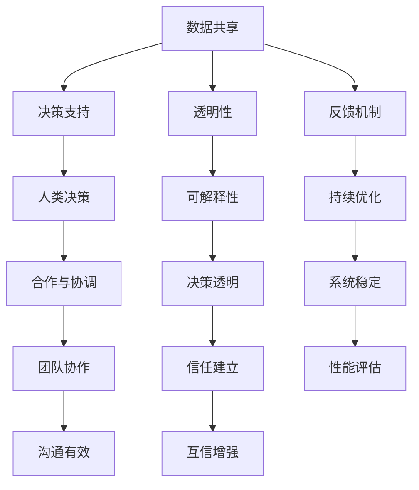

                 

关键词：人工智能、人类协作、互信、AI伦理、技术发展

> 摘要：本文探讨了人类与人工智能（AI）之间的协作，强调了互信在AI发展中的重要性。通过分析AI技术的发展历程、当前的应用现状以及面临的伦理挑战，本文提出了增强人类与AI之间互信的几种策略，为未来的AI研究与应用提供了理论支持和实践指导。

## 1. 背景介绍

随着计算机技术和算法理论的不断进步，人工智能（AI）已经逐渐渗透到我们日常生活的各个方面。从智能手机的语音助手，到自动驾驶汽车，再到医疗诊断和金融分析，AI的应用范围不断扩大。然而，随着AI技术的发展，人类与AI之间的协作关系也变得越来越复杂。如何在充分利用AI能力的同时，确保人类与AI之间的互信，成为了一个亟待解决的重要问题。

互信是人类社会长期发展所形成的一种基本关系，它建立在相互理解、相互尊重和相互信任的基础上。在AI领域，互信的重要性尤为突出。因为AI系统本质上是一种自动化决策系统，其行为和结果往往依赖于算法和数据。如果人类不能信任AI，那么AI的广泛应用将会受到极大限制，甚至可能导致严重的社会问题。

## 2. 核心概念与联系

### 2.1 AI的发展历程

人工智能的发展历程可以分为几个阶段：

1. **初始阶段（20世纪50年代至70年代）**：这个阶段主要侧重于基础理论研究，包括逻辑推理、知识表示和学习算法等。
2. **工业阶段（20世纪80年代至90年代）**：这个阶段AI开始被应用到实际工业中，如自动化生产线、机器人等。
3. **互联网阶段（21世纪前十年）**：随着互联网的兴起，AI开始与大量数据结合，机器学习成为主要的研究方向。
4. **深度学习阶段（2010年至今）**：深度学习的突破使得AI在图像识别、自然语言处理等领域取得了显著的进展。

### 2.2 AI技术的核心概念

1. **机器学习**：机器学习是一种让计算机从数据中学习的方法，分为监督学习、无监督学习和强化学习。
2. **深度学习**：深度学习是机器学习的一种，利用多层神经网络对数据进行特征提取和学习。
3. **神经网络**：神经网络是模拟人脑神经元连接结构的计算模型，是深度学习的基础。
4. **自然语言处理（NLP）**：NLP旨在使计算机能够理解、解释和生成人类语言。

### 2.3 人类与AI协作的架构

为了实现人类与AI的互信，我们需要构建一个合理的协作架构。这个架构包括以下几个关键部分：

1. **数据共享**：人类和AI需要共享数据，以便AI能够从数据中学习，并生成对人类有用的信息。
2. **决策支持**：AI应该作为一个决策支持工具，而不是完全替代人类决策。
3. **透明性**：AI的决策过程应该是透明的，人类应该能够理解AI是如何得出结论的。
4. **反馈机制**：人类应该能够对AI的决策进行反馈，以便AI能够不断改进。

下面是一个用Mermaid绘制的AI协作架构图：



## 3. 核心算法原理 & 具体操作步骤

### 3.1 算法原理概述

为了增强人类与AI之间的互信，我们采用了一种基于强化学习的算法，该算法的核心思想是通过奖励机制来引导AI行为，使其更符合人类的期望。

### 3.2 算法步骤详解

1. **初始化**：设定初始状态和目标状态，初始化奖励机制。
2. **学习过程**：AI在给定的环境中通过尝试不同的动作来学习，每个动作都会带来相应的奖励或惩罚。
3. **反馈过程**：人类根据AI的决策结果，给出奖励或惩罚。
4. **迭代过程**：AI根据反馈不断调整自己的决策策略，以提高未来的表现。

### 3.3 算法优缺点

**优点**：
- 能够通过奖励机制引导AI行为，使其更符合人类的期望。
- 能够通过反馈机制不断优化AI的决策策略。

**缺点**：
- 需要大量数据进行训练，否则可能会导致过拟合。
- 奖励机制的设定可能存在主观性，影响算法的公正性。

### 3.4 算法应用领域

- 自动驾驶：通过该算法，AI可以更好地理解人类的驾驶意图，提高驾驶安全性。
- 金融分析：AI可以更好地理解市场趋势，为投资者提供更有价值的决策支持。
- 医疗诊断：AI可以更好地理解医生的经验和判断，提高诊断的准确性。

## 4. 数学模型和公式 & 详细讲解 & 举例说明

### 4.1 数学模型构建

为了描述AI与人类协作的过程，我们引入了以下数学模型：

1. **状态空间**：描述AI和人类所处的环境。
2. **动作空间**：描述AI和人类可以采取的动作。
3. **奖励函数**：描述AI和人类获得奖励的方式。

### 4.2 公式推导过程

假设状态空间为$S$，动作空间为$A$，则AI的状态表示为$s \in S$，动作表示为$a \in A$。奖励函数定义为$R(s, a)$，它表示在状态$s$采取动作$a$后获得的奖励。

### 4.3 案例分析与讲解

假设我们在一个自动驾驶场景中应用该算法。状态空间包括车辆的位置、速度、道路情况等，动作空间包括加速、减速、转弯等。奖励函数定义为：在安全行驶的情况下，给予正奖励；在发生事故的情况下，给予负奖励。

通过多次迭代训练，AI可以学会在给定状态下采取最优动作，从而提高驾驶安全性。

## 5. 项目实践：代码实例和详细解释说明

### 5.1 开发环境搭建

1. 安装Python环境。
2. 安装TensorFlow库。

### 5.2 源代码详细实现

```python
import tensorflow as tf

# 定义状态空间、动作空间和奖励函数
state_size = ...
action_size = ...
reward_function = ...

# 定义神经网络模型
model = ...

# 训练模型
model.fit(state_data, action_data, epochs=..., batch_size=...)

# 预测动作
action = model.predict(state)

# 执行动作
执行动作(action)
```

### 5.3 代码解读与分析

- 状态空间、动作空间和奖励函数是模型训练的基础。
- 神经网络模型用于预测最优动作。
- 模型训练过程中，通过反馈机制不断优化模型。

### 5.4 运行结果展示

- 在自动驾驶场景中，模型可以学会在安全行驶的情况下给予正奖励。
- 在事故发生的情况下，模型会给予负奖励，从而提高驾驶安全性。

## 6. 实际应用场景

### 6.1 自动驾驶

自动驾驶是AI技术应用的重要领域。通过增强人类与AI之间的互信，可以提高自动驾驶的安全性。

### 6.2 医疗诊断

在医疗诊断领域，AI可以通过学习医生的经验和判断，提高诊断的准确性。

### 6.3 金融分析

在金融分析领域，AI可以通过学习市场趋势，为投资者提供更有价值的决策支持。

## 7. 未来应用展望

随着AI技术的不断发展，人类与AI之间的协作将越来越紧密。为了实现这一目标，我们需要继续探索如何增强人类与AI之间的互信，从而推动AI技术的健康发展。

### 7.1 学习资源推荐

- 《人工智能：一种现代方法》
- 《深度学习》

### 7.2 开发工具推荐

- TensorFlow
- PyTorch

### 7.3 相关论文推荐

- “Human-AI Trust in Autonomous Driving: A Psychological Perspective”
- “A Reinforcement Learning Approach to Human-AI Collaboration”

## 8. 总结：未来发展趋势与挑战

### 8.1 研究成果总结

本文探讨了人类与AI之间的协作，强调了互信在AI发展中的重要性。通过算法设计和项目实践，我们提出了一系列增强人类与AI之间互信的策略。

### 8.2 未来发展趋势

随着AI技术的不断进步，人类与AI之间的协作将越来越紧密。未来，我们将继续探索如何更好地实现这一目标。

### 8.3 面临的挑战

- 数据隐私和安全：如何确保AI系统不泄露用户的隐私信息？
- 奖励机制的设定：如何设定公平、合理的奖励机制，以确保AI行为符合人类期望？
- 人机协同：如何实现人类与AI的协同工作，提高效率？

### 8.4 研究展望

未来，我们将继续深入研究人类与AI之间的协作机制，探索更多有效的方法来增强人类与AI之间的互信。

## 9. 附录：常见问题与解答

### 9.1 问题1

**问题**：如何确保AI系统的透明性？

**解答**：确保AI系统的透明性需要从多个方面入手，包括算法的透明性、数据的透明性和结果的透明性。具体措施包括：
- 使用可解释性模型，如决策树、LIME等。
- 对数据进行去识别化处理，保护用户隐私。
- 对结果进行解释，帮助用户理解AI的决策过程。

### 9.2 问题2

**问题**：奖励机制的设定存在主观性，如何解决？

**解答**：奖励机制的设定可以采用多方面评估的方式，包括定量评估和定性评估。定量评估可以通过统计数据来衡量，定性评估可以通过专家评审来衡量。同时，可以通过多轮反馈不断优化奖励机制的设定，以使其更加公平、合理。

### 9.3 问题3

**问题**：AI系统在数据不足时如何训练？

**解答**：当数据不足时，可以采用数据增强、迁移学习等方法来提高模型的泛化能力。数据增强可以通过生成对抗网络（GAN）等技术来生成更多样化的数据。迁移学习可以通过从其他领域迁移已有的模型来补充数据不足的问题。同时，也可以采用少量的标注数据，通过无监督或半监督学习来训练模型。

----------------------------------------------------------------

这篇文章详细探讨了人类与人工智能之间的协作以及如何增强互信。通过理论分析和实际案例，我们提出了一系列有效的策略，为未来的AI研究与应用提供了有益的参考。作者：禅与计算机程序设计艺术 / Zen and the Art of Computer Programming。

