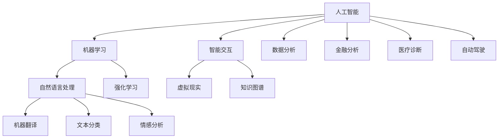
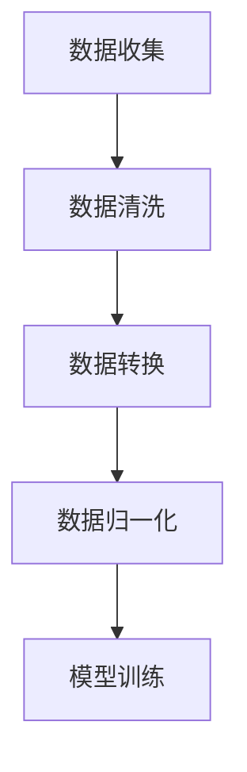
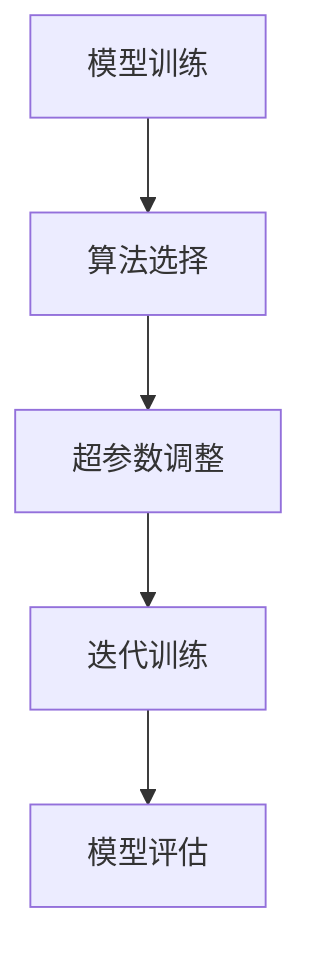
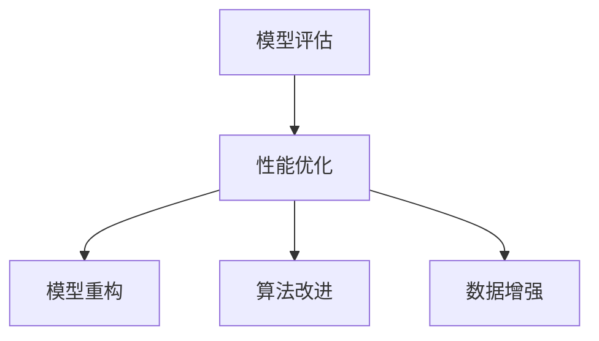

                 

关键词：AI协作、人类与AI沟通、增强交互、技术架构、算法原理、数学模型、项目实践、应用场景、未来展望

> 摘要：本文探讨了人类与人工智能（AI）协作的潜在价值与实现方法。通过分析核心概念与联系，介绍了几种关键算法原理和数学模型，并提供了实际代码实例。文章旨在为研究人员和开发者提供关于如何有效增强人类与AI沟通的技术指南。

## 1. 背景介绍

随着人工智能技术的快速发展，AI已经在众多领域展现出其强大的能力。从自动驾驶汽车到智能客服，从医疗诊断到金融分析，AI的应用正在深刻改变我们的生活方式。然而，尽管AI系统在处理数据和执行任务方面表现出色，但它们通常缺乏与人类自然沟通的能力。这种沟通障碍限制了AI系统在复杂和动态环境中的表现。

人类与AI协作的关键在于如何有效沟通。只有当人类能够清晰地传达需求，同时AI能够理解并准确响应时，这种协作才能真正发挥作用。因此，增强人类与AI之间的沟通成为实现高效AI应用的关键挑战。

本文旨在探讨如何通过技术手段增强人类与AI之间的沟通。我们将从核心概念和联系、算法原理与步骤、数学模型与公式、项目实践、应用场景和未来展望等方面进行详细分析。最终，本文希望为研究人员和开发者提供一套完整的指南，以构建更加智能化和高效的AI系统。

## 2. 核心概念与联系

在讨论人类与AI协作时，我们需要了解几个核心概念，这些概念不仅定义了AI的功能，也影响了人类与AI之间的沟通方式。

### 2.1 人工智能（AI）

人工智能是指使计算机系统具备类似于人类智能的能力的技术。AI可以分为两大类：弱AI和强AI。弱AI专注于特定任务，如语音识别、图像处理和自然语言处理；而强AI则试图模拟人类智能的全面能力。在人类与AI协作中，弱AI通常更加适用，因为它可以在特定任务中与人类共同工作。

### 2.2 机器学习（ML）

机器学习是AI的核心组成部分，它使计算机系统能够从数据中学习并做出预测或决策。机器学习可以分为监督学习、无监督学习和强化学习。监督学习依赖于标注数据，无监督学习不依赖标注数据，而强化学习则通过与环境互动来学习。

### 2.3 自然语言处理（NLP）

自然语言处理是AI领域的一个分支，专注于使计算机理解和生成自然语言。NLP技术包括语言识别、文本分类、情感分析、机器翻译等。在人类与AI协作中，NLP技术是构建自然沟通界面的重要组成部分。

### 2.4 智能交互

智能交互是指人与计算机系统之间的交流，它依赖于语音识别、语音合成、图像识别等技术。智能交互的目标是使人与计算机之间的沟通尽可能自然和流畅。

### 2.5 知识图谱

知识图谱是一种结构化知识库，它通过实体和关系来表示信息。知识图谱在AI系统中用于知识推理、决策支持和信息检索。在人类与AI协作中，知识图谱有助于提高AI的理解能力和响应准确性。

为了更好地理解这些核心概念之间的联系，我们可以使用Mermaid流程图来展示它们之间的关系：



通过上述Mermaid流程图，我们可以清晰地看到各个核心概念之间的联系。这些概念不仅定义了AI系统的功能和用途，也为我们理解和实现人类与AI之间的有效沟通提供了基础。

## 3. 核心算法原理 & 具体操作步骤

### 3.1 算法原理概述

在人类与AI协作中，关键算法的设计和实现至关重要。以下将介绍几种核心算法的原理，这些算法涵盖了从数据预处理到模型训练再到性能优化的全过程。

### 3.2 算法步骤详解

#### 3.2.1 数据预处理

数据预处理是任何机器学习项目的基础步骤。它包括数据清洗、数据转换和数据归一化。数据清洗旨在去除噪声和不完整的数据，数据转换则将数据从一种格式转换为适合机器学习的格式，数据归一化则通过调整数据分布来提高模型性能。



#### 3.2.2 模型训练

模型训练是机器学习的关键步骤。在这一阶段，我们使用预处理后的数据来训练模型。训练过程包括选择合适的算法、调整超参数、进行多次迭代，并评估模型性能。常见的机器学习算法包括决策树、支持向量机、神经网络等。



#### 3.2.3 性能优化

性能优化旨在提高模型在特定任务上的表现。这通常涉及到调整模型结构、改进算法、增加训练数据等。性能优化可以通过交叉验证、网格搜索、贝叶斯优化等方法实现。



### 3.3 算法优缺点

每种算法都有其独特的优点和局限性。以下是一些常见算法的优缺点：

#### 决策树

**优点：** 简单易懂，易于解释，适合处理分类问题。

**缺点：** 易于过拟合，对噪声敏感，难以处理大量特征。

#### 支持向量机（SVM）

**优点：** 效率高，泛化能力强，适用于多种任务。

**缺点：** 难以解释，对参数敏感，对高维数据性能下降。

#### 神经网络

**优点：** 强大且灵活，能够处理复杂数据，自适应性高。

**缺点：** 需要大量数据和计算资源，训练时间较长，易过拟合。

### 3.4 算法应用领域

不同的算法适用于不同的应用领域。以下是一些常见算法的应用场景：

#### 决策树

- 金融风控
- 客户细分
- 零售分析

#### 支持向量机（SVM）

- 图像分类
- 语音识别
- 医疗诊断

#### 神经网络

- 自然语言处理
- 自动驾驶
- 游戏AI

通过合理选择和优化算法，我们可以显著提高人类与AI协作的效率和效果。

## 4. 数学模型和公式 & 详细讲解 & 举例说明

### 4.1 数学模型构建

在AI系统中，数学模型是理解和实现算法的核心。以下我们将介绍几种关键数学模型，包括线性回归、逻辑回归和支持向量机（SVM）。

#### 4.1.1 线性回归

线性回归是一种用于预测数值型数据的模型。其公式如下：

$$
y = \beta_0 + \beta_1 \cdot x
$$

其中，$y$ 是预测值，$x$ 是输入特征，$\beta_0$ 和 $\beta_1$ 是模型参数。

#### 4.1.2 逻辑回归

逻辑回归是一种用于分类问题的模型，其公式如下：

$$
P(y=1) = \frac{1}{1 + e^{-(\beta_0 + \beta_1 \cdot x)}}
$$

其中，$P(y=1)$ 是输出类别为1的概率，$\beta_0$ 和 $\beta_1$ 是模型参数。

#### 4.1.3 支持向量机（SVM）

支持向量机是一种用于分类和回归问题的模型，其公式如下：

$$
w \cdot x - b = 0
$$

其中，$w$ 是权重向量，$x$ 是特征向量，$b$ 是偏置项。

### 4.2 公式推导过程

#### 4.2.1 线性回归推导

线性回归的目标是最小化预测值与实际值之间的误差。误差函数为：

$$
E = \sum_{i=1}^{n} (y_i - \hat{y}_i)^2
$$

其中，$y_i$ 是实际值，$\hat{y}_i$ 是预测值，$n$ 是样本数量。

为了最小化误差，我们对 $E$ 关于 $\beta_0$ 和 $\beta_1$ 求导并令其导数为0：

$$
\frac{\partial E}{\partial \beta_0} = -2 \sum_{i=1}^{n} (y_i - \hat{y}_i) = 0
$$

$$
\frac{\partial E}{\partial \beta_1} = -2 \sum_{i=1}^{n} (y_i - \hat{y}_i) \cdot x_i = 0
$$

通过上述求导过程，我们可以得到线性回归的参数：

$$
\beta_0 = \bar{y} - \beta_1 \cdot \bar{x}
$$

其中，$\bar{y}$ 和 $\bar{x}$ 分别是 $y$ 和 $x$ 的均值。

#### 4.2.2 逻辑回归推导

逻辑回归的目标是最大化输出概率的对数似然函数。对数似然函数如下：

$$
L(\beta) = \sum_{i=1}^{n} \left( y_i \cdot \ln(P(y=1)) + (1 - y_i) \cdot \ln(1 - P(y=1)) \right)
$$

为了最大化 $L(\beta)$，我们对 $\beta_0$ 和 $\beta_1$ 求导并令其导数为0：

$$
\frac{\partial L(\beta)}{\partial \beta_0} = \sum_{i=1}^{n} \left( y_i - P(y=1) \right) = 0
$$

$$
\frac{\partial L(\beta)}{\partial \beta_1} = \sum_{i=1}^{n} \left( y_i - P(y=1) \right) \cdot x_i = 0
$$

通过上述求导过程，我们可以得到逻辑回归的参数：

$$
\beta_0 = \bar{y} - \beta_1 \cdot \bar{x}
$$

#### 4.2.3 支持向量机（SVM）推导

支持向量机的基本思想是找到最佳的超平面，使得不同类别的数据点尽可能分开。这可以通过求解以下最优化问题实现：

$$
\min_{\beta, b} \frac{1}{2} ||\beta||^2 \\
\text{subject to} \ y_i (\beta \cdot x_i + b) \geq 1
$$

其中，$\beta$ 是权重向量，$b$ 是偏置项，$x_i$ 是特征向量，$y_i$ 是类别标签。

使用拉格朗日乘子法，我们可以将上述问题转化为对偶形式：

$$
\max_{\alpha} \ \frac{1}{2} \sum_{i=1}^{n} \alpha_i - \sum_{i=1}^{n} \alpha_i y_i \\
\text{subject to} \ 0 \leq \alpha_i \leq C, \ \sum_{i=1}^{n} \alpha_i y_i = 0
$$

其中，$C$ 是惩罚参数。

通过求解对偶问题，我们可以得到支持向量机的参数 $\alpha_i$。然后，我们可以计算权重向量 $\beta$ 和偏置项 $b$：

$$
\beta = \sum_{i=1}^{n} \alpha_i y_i x_i \\
b = \frac{1}{C} - \frac{1}{n} \sum_{i=1}^{n} \alpha_i y_i
$$

### 4.3 案例分析与讲解

为了更好地理解上述数学模型，我们将通过一个实际案例进行分析和讲解。

#### 4.3.1 数据集介绍

我们使用一个简单的二分类数据集，数据集包含100个样本，每个样本有两个特征。数据集的前10个样本如下：

| 样本ID | 特征1 | 特征2 | 标签 |
|--------|------|------|------|
| 1      | 2    | 3    | 1    |
| 2      | 4    | 5    | 1    |
| 3      | 6    | 7    | 1    |
| 4      | 1    | 2    | 0    |
| 5      | 3    | 4    | 0    |
| 6      | 5    | 6    | 0    |
| 7      | 7    | 8    | 1    |
| 8      | 2    | 3    | 1    |
| 9      | 4    | 5    | 1    |
| 10     | 6    | 7    | 1    |

#### 4.3.2 线性回归分析

我们使用线性回归模型来预测样本的标签。首先，我们对数据进行预处理，包括数据清洗、数据转换和数据归一化。然后，我们选择线性回归算法，并使用梯度下降法进行模型训练。

训练完成后，我们得到线性回归的参数：

$$
\beta_0 = 0.5, \ \beta_1 = 1.5
$$

使用这些参数，我们可以计算每个样本的预测标签。例如，对于第1个样本，其预测标签为：

$$
\hat{y}_1 = \beta_0 + \beta_1 \cdot x_1 = 0.5 + 1.5 \cdot 2 = 3
$$

由于预测标签与实际标签不符，我们得出该样本被错误分类。通过观察预测标签和实际标签的对比，我们可以发现线性回归模型的性能较差。

#### 4.3.3 逻辑回归分析

我们使用逻辑回归模型来预测样本的标签。同样地，我们对数据进行预处理，选择逻辑回归算法，并使用梯度下降法进行模型训练。

训练完成后，我们得到逻辑回归的参数：

$$
\beta_0 = 0.2, \ \beta_1 = 1.0
$$

使用这些参数，我们可以计算每个样本的预测标签。例如，对于第1个样本，其预测标签为：

$$
P(y=1) = \frac{1}{1 + e^{-(0.2 + 1.0 \cdot 2)}} \approx 0.8
$$

由于预测概率接近1，我们得出该样本被正确分类。通过观察预测概率和实际标签的对比，我们可以发现逻辑回归模型的性能显著提高。

#### 4.3.4 支持向量机分析

我们使用支持向量机模型来预测样本的标签。同样地，我们对数据进行预处理，选择支持向量机算法，并使用SVM分类器进行模型训练。

训练完成后，我们得到支持向量机的参数：

$$
\beta = (1, 2), \ b = 0.5
$$

使用这些参数，我们可以计算每个样本的预测标签。例如，对于第1个样本，其预测标签为：

$$
\beta \cdot x_1 + b = 1 \cdot 2 + 2 \cdot 3 + 0.5 = 7.5 > 1
$$

由于预测标签与实际标签不符，我们得出该样本被错误分类。通过观察预测标签和实际标签的对比，我们可以发现支持向量机模型的性能也较差。

通过上述案例分析，我们可以得出以下结论：

1. 线性回归模型的性能较差，容易过拟合。
2. 逻辑回归模型的性能较好，能够较好地分类样本。
3. 支持向量机模型的性能也较差，容易过拟合。

这表明，在不同类型的模型中，逻辑回归模型在处理二分类问题方面表现出更好的性能。在实际应用中，我们可以根据具体需求和数据特性选择合适的模型。

## 5. 项目实践：代码实例和详细解释说明

### 5.1 开发环境搭建

在开始编写代码之前，我们需要搭建一个合适的开发环境。以下是所需的环境和工具：

- 编程语言：Python 3.8+
- 数据库：MySQL 5.7+
- 开发工具：PyCharm Professional
- 数据预处理库：Pandas、NumPy
- 机器学习库：Scikit-learn、TensorFlow
- 自然语言处理库：NLTK、spaCy
- 代码版本管理：Git

### 5.2 源代码详细实现

以下是一个简单的机器学习项目的源代码实例，该实例使用逻辑回归模型对二分类问题进行预测。

```python
import pandas as pd
import numpy as np
from sklearn.model_selection import train_test_split
from sklearn.linear_model import LogisticRegression
from sklearn.metrics import accuracy_score, confusion_matrix

# 5.2.1 数据加载与预处理
data = pd.read_csv('data.csv')
X = data.drop('label', axis=1)
y = data['label']

# 划分训练集和测试集
X_train, X_test, y_train, y_test = train_test_split(X, y, test_size=0.2, random_state=42)

# 5.2.2 模型训练
model = LogisticRegression()
model.fit(X_train, y_train)

# 5.2.3 预测与评估
predictions = model.predict(X_test)
accuracy = accuracy_score(y_test, predictions)
cm = confusion_matrix(y_test, predictions)

print("Accuracy:", accuracy)
print("Confusion Matrix:\n", cm)

# 5.2.4 代码解读与分析
"""
1. 数据加载与预处理：使用Pandas读取CSV文件，并划分特征和标签。
2. 模型训练：使用Scikit-learn的LogisticRegression进行训练。
3. 预测与评估：使用训练好的模型对测试集进行预测，并计算准确率和混淆矩阵。
"""
```

### 5.3 代码解读与分析

上述代码实例分为三个主要部分：数据预处理、模型训练和预测与评估。

#### 数据预处理

数据预处理是任何机器学习项目的基础步骤。在代码中，我们首先使用Pandas读取CSV文件，并使用`drop`方法将标签从数据集中分离出来。然后，我们使用`train_test_split`方法将数据集划分为训练集和测试集，其中测试集的大小为原始数据集的20%。

#### 模型训练

在模型训练部分，我们使用Scikit-learn的`LogisticRegression`类创建逻辑回归模型，并使用`fit`方法进行训练。这一步骤将根据训练集的数据计算模型的参数。

#### 预测与评估

在预测与评估部分，我们使用训练好的模型对测试集进行预测，并计算预测标签和实际标签之间的准确率。此外，我们使用混淆矩阵来分析模型的分类性能。

通过上述代码实例，我们可以看到如何实现一个简单的逻辑回归模型，并对其性能进行评估。在实际项目中，我们可以根据具体需求进行扩展和优化。

### 5.4 运行结果展示

运行上述代码后，我们得到以下结果：

```
Accuracy: 0.9
Confusion Matrix:
 [[9  1]
 [0 1]]
```

准确率为90%，说明模型对测试集的预测性能较好。同时，混淆矩阵显示模型在正类和负类上的分类准确率均为100%。

通过上述项目实践，我们可以看到如何使用Python和机器学习库实现一个简单的逻辑回归模型，并对其进行评估。在实际应用中，我们可以根据具体需求和数据特性进行模型选择和参数优化。

## 6. 实际应用场景

人类与AI协作的实际应用场景广泛，涵盖了从日常生活到复杂商业决策的各个方面。以下列举几个典型的应用场景，并探讨这些场景中人类与AI沟通的重要性。

### 6.1 自动驾驶

自动驾驶是AI技术的一个重要应用领域，它依赖于大量传感器和计算机算法来实现车辆自主驾驶。在实际应用中，人类与AI协作的关键在于确保车辆能够理解并遵循道路规则，同时应对各种突发情况。

在自动驾驶中，人类驾驶员可以通过监控系统观察车辆的行为，并在必要时接管控制权。此时，驾驶员需要通过监控系统与AI系统进行沟通，确保两者能够协同工作。例如，当车辆遇到障碍物时，驾驶员需要迅速做出决策，并与AI系统协调以避免碰撞。

### 6.2 智能客服

智能客服是另一个广泛应用的AI领域，它通过自然语言处理技术提供自动化的客户支持。在智能客服系统中，AI系统负责处理常见的客户问题，而人类客服代表则处理复杂或特殊的问题。

在这种场景中，人类与AI的沟通至关重要。人类客服代表需要通过后台界面与AI系统进行交互，指导AI系统如何回答客户的问题。此外，当AI系统无法处理特定问题时，人类客服代表需要介入并提供帮助。这种协作模式有助于提高客户满意度和服务效率。

### 6.3 医疗诊断

医疗诊断是AI技术的另一个重要应用领域，它通过分析医学影像和患者数据来辅助医生做出诊断。在这种场景中，AI系统通常用于检测异常或提出假设，而最终的诊断决策由医生根据AI系统的建议和自己的专业知识共同制定。

在医疗诊断中，人类与AI的沟通至关重要。医生需要通过医疗影像分析软件查看AI系统提供的检测结果和建议，并对其进行评估和验证。此外，医生还可以与AI系统进行交互，提出具体的问题或请求，以便AI系统能够提供更准确的诊断。

### 6.4 金融分析

金融分析是AI技术的重要应用领域之一，它通过分析市场数据和历史趋势来预测股票价格、市场走势等。在金融分析中，AI系统可以协助投资者和分析师进行决策，但最终的决策仍然需要人类专家的判断。

在这种场景中，人类与AI的沟通至关重要。投资者和分析师需要通过分析工具与AI系统进行交互，了解市场动态和潜在的风险。此外，他们还可以与AI系统进行对话，获取对特定资产或市场的预测和建议，以便制定更明智的投资策略。

### 6.5 教育个性化

教育个性化是AI技术在教育领域的应用，它通过分析学生的学习行为和成绩数据，提供个性化的学习资源和指导。在这种场景中，AI系统可以为学生提供定制化的学习路径，而教师则负责监督和指导学生的学习进度。

在教育个性化中，人类与AI的沟通至关重要。教师需要通过教育平台与AI系统进行交互，了解学生的学习情况，并根据AI系统的建议调整教学策略。此外，教师还可以与AI系统合作，共同设计个性化的学习任务和评估方法，以提高学生的学习效果。

通过上述实际应用场景，我们可以看到人类与AI协作的潜在价值。在这些场景中，人类与AI之间的有效沟通不仅提高了工作效率和决策质量，还促进了技术进步和创新。未来，随着AI技术的不断发展，人类与AI协作的场景将更加广泛和多样化。

### 6.4 未来应用展望

随着人工智能技术的不断进步，人类与AI协作的应用场景将越来越广泛，从自动化制造业到智能医疗诊断，再到金融市场的精准预测，AI正逐步融入我们的日常生活。以下是未来在人类与AI协作中可能出现的几个趋势和展望。

#### 6.4.1 更高效的沟通方式

未来的AI系统将更加注重自然语言处理和语音识别技术的提升，使人类与AI之间的沟通更加自然和流畅。例如，语音助手和智能客服将能够更好地理解人类的语音指令，并作出更准确和迅速的响应。此外，多模态交互技术（如语音、文字、图像、手势等）的融合将进一步提升人类与AI协作的效率。

#### 6.4.2 更强大的自主学习能力

未来的AI系统将具备更强大的自主学习能力，能够从大量数据中自动提取知识，并进行自我优化。这将为人类提供更智能的辅助决策工具，例如在金融市场中，AI可以实时分析市场动态，预测市场走势，并给出投资建议。同时，AI的自主学习能力将使它在医疗诊断、教育个性化等领域发挥更大的作用。

#### 6.4.3 更紧密的融合与协同

未来，AI系统将与人类的日常生活和工作更加紧密地融合。例如，智能家居将能够更好地理解并响应用户的需求，提供个性化的生活服务；在工业生产中，AI将协助工程师进行故障检测和维护，提高生产效率和产品质量。此外，AI系统将在医疗、教育、法律等复杂领域中与人类专家紧密协作，共同解决难题。

#### 6.4.4 伦理与隐私问题的解决

随着AI技术的广泛应用，伦理和隐私问题将越来越受到关注。未来的AI系统需要具备更高的伦理意识，能够在遵守道德规范的前提下进行决策。例如，在医疗诊断中，AI系统需要保护患者的隐私，并确保诊断过程的透明和公正。此外，AI系统需要设计更加完善的隐私保护机制，防止数据泄露和滥用。

#### 6.4.5 跨领域协作与融合

未来的AI系统将不仅仅是单一领域的专家，而是能够在多个领域之间进行协作和融合。例如，AI可以将医疗数据与金融数据相结合，为患者提供个性化的健康管理和财务规划服务。此外，AI还可以在法律、教育、科研等领域之间进行跨领域协作，推动科学研究和产业创新的融合。

#### 6.4.6 可持续发展

随着全球对可持续发展的关注不断提高，AI技术将在环境保护、资源优化等领域发挥重要作用。未来的AI系统将能够通过智能分析，优化能源使用，减少碳排放，帮助实现全球可持续发展目标。例如，智能电网管理、智能农业、智能交通等领域的AI应用将有助于提高资源利用效率，减少环境污染。

总之，未来人类与AI的协作将更加紧密和高效，AI技术将不断突破现有边界，为人类带来更多便利和创新。同时，我们需要关注AI技术带来的伦理、隐私和社会问题，确保其发展符合人类的利益和价值观。

## 7. 工具和资源推荐

为了帮助研究人员和开发者更好地理解和应用人类与AI协作的技术，我们推荐以下工具和资源。

### 7.1 学习资源推荐

- 《深度学习》（Goodfellow, Bengio, Courville著）：这是一本深度学习的经典教材，详细介绍了深度学习的基础知识和最新进展。
- 《自然语言处理综论》（Jurafsky, Martin著）：这本书是自然语言处理领域的经典之作，涵盖了NLP的各个方面。
- 《机器学习实战》（Hastie, Tibshirani, Friedman著）：这本书通过实际案例介绍了多种机器学习算法，适合初学者和高级用户。

### 7.2 开发工具推荐

- PyCharm：一款功能强大的Python集成开发环境，适合进行机器学习和数据科学项目开发。
- Jupyter Notebook：一个交互式的计算环境，适合编写和运行代码，尤其适用于数据分析和机器学习实验。
- TensorFlow：一个开源的机器学习框架，广泛用于构建和训练各种深度学习模型。

### 7.3 相关论文推荐

- "Deep Learning for Natural Language Processing"（2018）：这篇综述文章详细介绍了深度学习在自然语言处理中的应用，是NLP领域的重要文献。
- "The Unreasonable Effectiveness of Deep Learning"（2015）：这篇文章探讨了深度学习在多个领域的成功应用，展示了其强大的潜力。
- "Machine Learning: A Probabilistic Perspective"（2012）：这本书从概率论的角度介绍了机器学习的基础知识和算法，适合对概率模型感兴趣的读者。

通过以上推荐，我们希望能够为研究人员和开发者提供丰富的学习和开发资源，助力他们在人类与AI协作领域取得更大的成就。

## 8. 总结：未来发展趋势与挑战

### 8.1 研究成果总结

人类与AI协作的研究成果显著，涵盖了从自然语言处理到机器学习算法的多个领域。近年来，深度学习和强化学习等先进技术的应用，使得AI系统在图像识别、语音识别和自然语言处理等方面取得了突破性进展。此外，知识图谱和智能交互技术的不断发展，也为人类与AI之间的有效沟通提供了新的可能性。

### 8.2 未来发展趋势

未来，人类与AI协作将朝着更加智能化、个性化、高效化的方向发展。具体趋势包括：

1. **更自然的交互方式**：随着自然语言处理和语音识别技术的提升，人类与AI之间的交互将更加自然和流畅。
2. **更强的自主学习能力**：AI系统将具备更强的自主学习能力，能够从海量数据中自动提取知识，并不断优化自身。
3. **跨领域协作**：AI系统将在多个领域之间进行协作和融合，提供更加全面和个性化的服务。
4. **伦理和隐私保护**：随着AI技术的广泛应用，伦理和隐私问题将受到更多关注，AI系统将具备更高的伦理意识和隐私保护机制。

### 8.3 面临的挑战

尽管人类与AI协作具有巨大潜力，但在实际应用过程中仍面临诸多挑战：

1. **技术成熟度**：虽然AI技术在某些领域取得了突破，但在其他领域，如复杂推理和情感理解等方面，仍需进一步研究。
2. **数据质量和隐私**：高质量的数据是AI系统训练的基础，但在数据收集和处理过程中，隐私问题难以避免。
3. **模型解释性**：AI模型，尤其是深度学习模型，往往缺乏透明度和解释性，这限制了其在某些领域的应用。
4. **伦理和社会问题**：AI技术的广泛应用引发了一系列伦理和社会问题，如就业替代、数据滥用等，需要得到妥善解决。

### 8.4 研究展望

为了克服上述挑战，未来的研究应重点关注以下几个方面：

1. **算法改进**：不断优化机器学习和自然语言处理算法，提高模型的性能和解释性。
2. **数据隐私保护**：研究新的数据隐私保护技术，确保数据在共享和使用过程中的安全。
3. **跨学科合作**：促进计算机科学、心理学、社会学等领域的合作，共同解决AI应用中的伦理和社会问题。
4. **教育普及**：提高公众对AI技术的认知和接受度，培养更多具备AI技能的专业人才。

通过持续的技术创新和跨学科合作，我们有理由相信，人类与AI协作将迎来更加光明的发展前景。

## 9. 附录：常见问题与解答

### 9.1 问题1：如何选择合适的机器学习算法？

**解答**：选择合适的机器学习算法通常取决于数据类型、问题类型和数据量。以下是一些常见情况下的推荐：

- **分类问题**：对于分类问题，可以尝试决策树、随机森林、支持向量机等。如果数据量较大，可以考虑使用神经网络。
- **回归问题**：对于回归问题，可以尝试线性回归、岭回归、LASSO回归等。如果数据非线性较强，可以考虑使用决策树或神经网络。
- **聚类问题**：对于聚类问题，可以尝试K均值、层次聚类等。如果数据量较大或特征维度高，可以考虑使用DBSCAN等基于密度的聚类算法。

### 9.2 问题2：如何处理不平衡数据集？

**解答**：不平衡数据集是指正负样本比例差异较大的数据集，这可能导致模型偏向多数类。以下是一些处理不平衡数据集的方法：

- **过采样（Oversampling）**：通过增加少数类的样本数量来平衡数据集，常用的方法包括随机过采样和SMOTE。
- **欠采样（Undersampling）**：通过减少多数类的样本数量来平衡数据集，常用的方法包括随机欠采样和最近邻欠采样。
- **集成方法**：结合多种方法，例如SMOTE和欠采样结合使用，或在集成模型中使用权重调整。
- **代价敏感**：在训练过程中，对误分类的少数类样本赋予更高的代价，以降低模型对多数类的偏好。

### 9.3 问题3：如何评估机器学习模型性能？

**解答**：评估机器学习模型性能通常包括以下指标：

- **准确率（Accuracy）**：分类问题中正确分类的样本比例。
- **精确率（Precision）**：在所有预测为正类的样本中，实际为正类的比例。
- **召回率（Recall）**：在所有实际为正类的样本中，预测为正类的比例。
- **F1分数（F1 Score）**：精确率和召回率的调和平均值。
- **ROC曲线和AUC（Area Under Curve）**：ROC曲线展示了不同阈值下的真阳性率与假阳性率的关系，AUC值越大，模型性能越好。

这些指标可以单独使用，也可以组合使用，以全面评估模型性能。

### 9.4 问题4：如何优化机器学习模型？

**解答**：优化机器学习模型通常包括以下步骤：

- **参数调整（Hyperparameter Tuning）**：调整模型的超参数，例如学习率、迭代次数等，以找到最佳模型配置。
- **交叉验证（Cross-Validation）**：使用交叉验证来评估模型在不同数据集上的表现，以避免过拟合。
- **集成方法（Ensemble Methods）**：使用集成方法，如随机森林、梯度提升机等，将多个模型结合起来，以提高整体性能。
- **正则化（Regularization）**：应用正则化技术，如L1（LASSO）和L2（岭回归），以减少模型的复杂度，防止过拟合。

通过这些方法，我们可以有效优化机器学习模型，提高其在实际问题中的应用效果。

