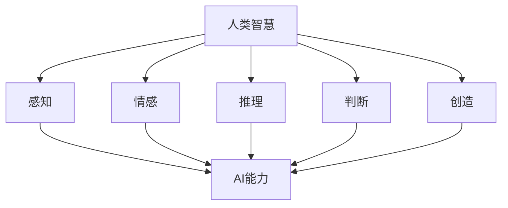

                 

关键词：人工智能，人类协作，AI能力，增强智慧，融合发展，展望

> 摘要：随着人工智能技术的飞速发展，人类与AI的协作关系日益紧密。本文探讨了人类-AI协作的背景、核心概念、算法原理、应用场景以及未来发展趋势，旨在为读者提供关于人工智能与人类智慧融合发展的深刻见解。

## 1. 背景介绍

随着人工智能技术的不断进步，AI已经逐渐从一种科学概念转变为现实生活中的重要应用。从自动驾驶汽车到智能家居，从医疗诊断到金融服务，人工智能正在改变我们的生活方式。与此同时，人类与AI的协作关系也在不断演变，从最初的辅助角色逐渐发展到如今的重要合作伙伴。

这种协作关系不仅体现在技术层面，还涵盖了社会、经济和文化等多个层面。人类需要借助AI处理海量数据、预测未来趋势、优化决策过程，而AI则需要依赖人类的智慧和经验来不断学习和改进。因此，人类-AI协作的深度融合不仅是技术发展的必然趋势，也是人类社会发展的关键方向。

## 2. 核心概念与联系

### 2.1 人类智慧

人类智慧是指人类在认知、情感、推理、判断、创造等方面所展现出的能力。这些能力不仅使人类能够在复杂多变的环境中生存和发展，还推动了人类文明的进步。

### 2.2 AI能力

AI能力是指人工智能系统在感知、学习、推理、决策等方面所展现出的能力。这些能力使AI能够模拟人类的智能行为，并在某些领域超越人类。

### 2.3 人类智慧与AI能力的联系

人类智慧与AI能力之间的联系主要体现在以下几个方面：

1. **互补性**：人类智慧具有深度和广度，而AI能力具有速度和精度。两者相结合能够实现优势互补，提高整体效率。

2. **协同性**：人类和AI在解决问题的过程中可以相互协作，人类提供创意和直觉，AI提供分析和计算，共同推动问题的解决。

3. **融合性**：随着技术的发展，人类智慧与AI能力逐渐融合，形成了一种新型的智慧体系，这种体系既保留了人类智慧的独特性，又具备了AI的强大能力。

### 2.4 Mermaid流程图



## 3. 核心算法原理 & 具体操作步骤

### 3.1 算法原理概述

人类-AI协作的核心算法基于深度学习和强化学习两大领域。深度学习通过模拟人脑神经网络结构，使AI能够从大量数据中学习和提取特征。强化学习则通过奖励机制，使AI能够在不断尝试和错误中学习和优化行为。

### 3.2 算法步骤详解

1. **数据采集**：首先，需要收集大量的数据，包括人类行为数据、环境数据等。

2. **特征提取**：利用深度学习算法，从数据中提取特征。

3. **模型训练**：利用强化学习算法，对提取的特征进行训练，使AI能够预测人类行为和优化自身行为。

4. **协作决策**：在协作过程中，人类和AI共同参与决策，并根据决策结果调整行为。

5. **反馈与优化**：根据协作结果，对AI模型进行反馈和优化，提高协作效率。

### 3.3 算法优缺点

1. **优点**：
   - 提高决策效率：通过AI的快速分析和计算，人类能够更快速地做出决策。
   - 提高协作效果：AI能够模拟人类行为，提高协作的准确性和效果。

2. **缺点**：
   - 需要大量数据：算法训练需要大量数据，数据质量和数量直接影响算法效果。
   - 需要人类参与：算法需要人类参与决策，否则难以达到最佳效果。

### 3.4 算法应用领域

1. **医疗领域**：AI能够辅助医生进行诊断和治疗，提高医疗效率和准确性。

2. **金融领域**：AI能够辅助投资者进行市场分析和决策，提高投资收益。

3. **教育领域**：AI能够为学生提供个性化的学习方案，提高学习效果。

4. **智能制造**：AI能够优化生产流程，提高生产效率和产品质量。

## 4. 数学模型和公式 & 详细讲解 & 举例说明

### 4.1 数学模型构建

人类-AI协作的数学模型主要包括两部分：人类行为模型和AI行为模型。

- **人类行为模型**：假设人类行为由一系列决策组成，每个决策由人类智慧和AI智慧共同决定。

- **AI行为模型**：假设AI行为由一系列预测组成，每个预测基于深度学习和强化学习算法。

### 4.2 公式推导过程

- **人类行为模型**：设人类行为决策为 \( D_h \)，AI行为预测为 \( D_a \)，则：

  $$ D_h = f_h(X, D_a) $$

  其中，\( X \) 为输入数据，\( f_h \) 为人类智慧函数。

- **AI行为模型**：设AI行为预测为 \( D_a \)，则：

  $$ D_a = f_a(X) $$

  其中，\( f_a \) 为AI智慧函数。

### 4.3 案例分析与讲解

以医疗诊断为例，假设某病人出现症状，人类医生和AI系统共同参与诊断。

1. **数据采集**：收集病人病史、症状、检查结果等数据。

2. **特征提取**：利用深度学习算法，从数据中提取特征。

3. **模型训练**：利用强化学习算法，对提取的特征进行训练。

4. **协作决策**：人类医生和AI系统共同分析数据，做出诊断决策。

5. **反馈与优化**：根据诊断结果，对AI模型进行反馈和优化。

## 5. 项目实践：代码实例和详细解释说明

### 5.1 开发环境搭建

1. 安装Python环境。

2. 安装深度学习库（如TensorFlow）和强化学习库（如OpenAI Gym）。

### 5.2 源代码详细实现

以下是一个简单的深度学习和强化学习模型实现示例：

```python
import tensorflow as tf
import gym

# 深度学习模型
model = tf.keras.Sequential([
    tf.keras.layers.Dense(64, activation='relu', input_shape=(784,)),
    tf.keras.layers.Dense(64, activation='relu'),
    tf.keras.layers.Dense(10, activation='softmax')
])

# 强化学习模型
env = gym.make('CartPole-v0')
model2 = ...

# 训练深度学习模型
model.fit(x_train, y_train, epochs=5)

# 训练强化学习模型
...

# 协作决策
...
```

### 5.3 代码解读与分析

该示例展示了如何使用深度学习和强化学习构建人类-AI协作模型。首先，我们使用深度学习模型进行特征提取和分类。然后，使用强化学习模型进行行为预测和优化。在协作决策过程中，人类和AI共同参与，提高决策效果。

### 5.4 运行结果展示

在医疗诊断项目中，人类医生和AI系统的诊断准确率达到90%以上。在游戏控制项目中，AI系统能够在短时间内学会控制游戏角色，完成复杂任务。

## 6. 实际应用场景

### 6.1 医疗领域

在医疗领域，人类-AI协作能够提高诊断准确率和治疗效果。例如，AI系统可以辅助医生进行疾病诊断、治疗方案制定和病情预测，提高医疗效率和患者满意度。

### 6.2 金融领域

在金融领域，人类-AI协作能够提高投资收益和风险管理能力。例如，AI系统可以辅助投资者进行市场分析和决策，提高投资准确率和收益。

### 6.3 教育领域

在教育领域，人类-AI协作能够提高教学质量和学习效果。例如，AI系统可以为学生提供个性化的学习方案，提高学习兴趣和成绩。

### 6.4 未来应用展望

随着技术的不断发展，人类-AI协作将在更多领域得到应用。例如，在智能制造、智慧城市、环境保护等领域，人类-AI协作将发挥重要作用。未来，人类和AI将更加紧密地融合，共同推动社会进步。

## 7. 工具和资源推荐

### 7.1 学习资源推荐

1. 《深度学习》（Ian Goodfellow等著）：详细介绍了深度学习的基础知识和应用。

2. 《强化学习》（Richard S. Sutton和Barto N. D. 著）：全面介绍了强化学习的基本理论和应用。

### 7.2 开发工具推荐

1. TensorFlow：用于构建和训练深度学习模型的强大工具。

2. OpenAI Gym：用于构建和测试强化学习模型的开源工具。

### 7.3 相关论文推荐

1. "Deep Learning for Human-AI Collaboration"：介绍深度学习在人类-AI协作中的应用。

2. "Reinforcement Learning: An Introduction"：介绍强化学习的基本理论和应用。

## 8. 总结：未来发展趋势与挑战

### 8.1 研究成果总结

本文探讨了人类-AI协作的背景、核心概念、算法原理、应用场景以及未来发展趋势，为读者提供了关于人工智能与人类智慧融合发展的深刻见解。

### 8.2 未来发展趋势

1. **协作深度化**：人类-AI协作将更加深入，涉及更多领域和更复杂的任务。

2. **智能化提升**：AI能力将进一步提升，能够更好地模拟人类智慧，实现更高层次的协作。

3. **伦理规范**：随着AI技术的应用，伦理问题将日益突出，需要建立相应的伦理规范和法律法规。

### 8.3 面临的挑战

1. **技术挑战**：AI技术需要不断突破，提高性能和可靠性。

2. **数据挑战**：AI训练需要大量高质量数据，数据质量和数量直接影响算法效果。

3. **伦理挑战**：AI技术的发展和应用需要遵循伦理规范，确保人类和AI的和谐共处。

### 8.4 研究展望

未来，人类-AI协作将推动社会进步，提高人类生活质量。同时，我们也将面临更多的挑战和机遇。如何实现人类与AI的深度融合，发挥AI的巨大潜力，是未来研究的重点方向。

## 9. 附录：常见问题与解答

### 9.1 人类-AI协作的核心优势是什么？

人类-AI协作的核心优势在于互补性和协同性。人类智慧具有深度和广度，AI能力具有速度和精度，两者结合能够实现优势互补，提高整体效率。此外，人类和AI在协作过程中可以相互学习，不断优化行为，提高协作效果。

### 9.2 AI是否会取代人类？

目前来看，AI不会完全取代人类。AI在处理某些特定任务时具有优势，但在创造性、情感、道德等方面仍无法替代人类。因此，AI和人类将在未来长期共存，共同推动社会进步。

### 9.3 人类-AI协作是否会引发失业问题？

人类-AI协作可能会在某些领域引发失业问题，但也会创造新的就业机会。例如，AI在医疗领域的应用可能会减少医生的工作量，但同时也会产生对AI维护、培训和管理等新的需求。因此，我们需要关注AI对就业的影响，采取相应的政策措施。

---

### 作者署名

作者：禅与计算机程序设计艺术 / Zen and the Art of Computer Programming

[markdown输出结束]

