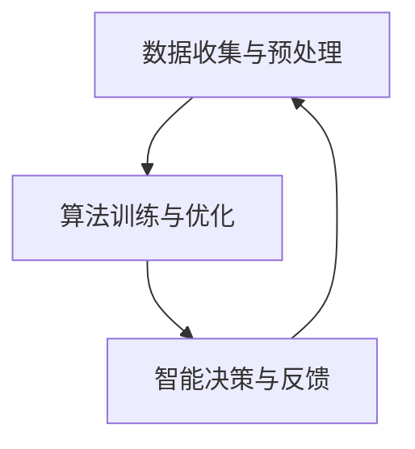

                 

关键词：人类-AI协作，智慧增强，AI能力，融合发展，前景展望

> 摘要：本文将探讨人类与人工智能（AI）之间的协作关系，分析如何通过增强人类智慧与AI能力的结合，实现更高效的智慧增强和融合发展。本文将围绕AI的核心概念、算法原理、数学模型、项目实践和未来应用前景等方面展开，为读者提供一个全面、深入的视角。

## 1. 背景介绍

随着人工智能技术的快速发展，人工智能（AI）已经逐渐渗透到我们生活的方方面面。从简单的语音识别、图像处理，到复杂的自动驾驶、智能医疗，AI正在改变我们的生活方式和工作模式。然而，AI的发展也带来了一系列挑战，如何让人工智能更好地服务于人类，成为了一个亟待解决的问题。

人类与AI的协作关系，即是人类利用自己的智慧和创造力，与AI的算法和数据处理能力相结合，实现更高效、更智能的解决方案。这种协作关系不仅能够发挥人类的创造力，还能让AI在处理复杂问题时更加准确和高效。因此，如何构建人类-AI协作体系，成为当前研究的热点问题。

本文将从以下几个方面探讨人类-AI协作的融合发展前景：首先，介绍AI的核心概念和架构；其次，分析核心算法原理和具体操作步骤；然后，介绍数学模型和公式；接着，通过项目实践展示代码实例；最后，探讨实际应用场景和未来发展趋势。

## 2. 核心概念与联系

### 2.1 人工智能概述

人工智能（AI）是计算机科学的一个分支，旨在使计算机具备模拟、延伸和扩展人类智能的能力。AI的核心目标是让计算机能够执行通常需要人类智能的任务，如图像识别、语音识别、自然语言处理、决策推理等。

### 2.2 AI架构

AI的架构主要包括感知层、认知层和决策层。感知层负责接收外部信息，如图像、声音和文本；认知层负责处理和理解这些信息，例如，识别图像中的物体、理解文本中的含义；决策层则根据认知结果，做出相应的决策。

### 2.3 人类-AI协作模型

人类-AI协作模型是一个多层次的体系，包括以下三个关键层次：

1. **数据收集与预处理**：在这一层次，人类与AI协作，共同收集和预处理数据，以提高AI的输入质量。
2. **算法训练与优化**：在这一层次，人类利用自己的智慧和经验，指导AI算法的训练和优化，使其更好地适应特定任务。
3. **智能决策与反馈**：在这一层次，人类与AI共同参与决策，并通过反馈机制不断优化AI的性能。

### 2.4  Mermaid 流程图

以下是一个简化的 Mermaid 流程图，展示了人类-AI协作模型的主要流程：



## 3. 核心算法原理 & 具体操作步骤

### 3.1  算法原理概述

人类-AI协作的核心算法包括机器学习、深度学习和强化学习等。这些算法通过训练模型，使其能够从数据中学习规律，从而在新的数据上进行预测和决策。

### 3.2  算法步骤详解

1. **数据收集与预处理**：收集相关领域的数据，并进行清洗、归一化等预处理操作。
2. **模型选择与训练**：根据任务需求，选择合适的算法模型，并进行训练。
3. **模型评估与优化**：评估模型性能，并不断调整参数，以优化模型效果。
4. **模型部署与应用**：将训练好的模型部署到实际应用场景中，并进行实时反馈和优化。

### 3.3  算法优缺点

- **优点**：
  - **高效性**：AI算法能够处理海量数据，并在短时间内完成复杂计算。
  - **准确性**：通过不断训练和优化，AI算法的预测和决策准确性不断提高。
  - **扩展性**：AI算法可以应用于不同领域和任务，具有较好的扩展性。

- **缺点**：
  - **依赖数据**：AI算法的性能依赖于数据的质量和数量，数据缺失或质量差会影响算法效果。
  - **训练成本**：训练高性能的AI模型需要大量计算资源和时间。

### 3.4  算法应用领域

AI算法已广泛应用于多个领域，如自然语言处理、计算机视觉、金融、医疗等。在自然语言处理领域，AI算法可以用于文本分类、情感分析、机器翻译等；在计算机视觉领域，AI算法可以用于图像识别、目标检测、图像分割等；在金融领域，AI算法可以用于风险控制、投资决策等；在医疗领域，AI算法可以用于疾病诊断、治疗方案推荐等。

## 4. 数学模型和公式

### 4.1 数学模型构建

人类-AI协作中的数学模型主要包括线性回归、神经网络、支持向量机等。以下是一个简单的线性回归模型示例：

$$ y = w_0 + w_1 \cdot x $$

其中，$y$ 为输出变量，$x$ 为输入变量，$w_0$ 和 $w_1$ 为模型参数。

### 4.2 公式推导过程

线性回归模型的推导过程如下：

1. **假设**：假设输出变量 $y$ 与输入变量 $x$ 之间存在线性关系，即 $y = w_0 + w_1 \cdot x$。
2. **目标函数**：定义目标函数为 $J(w_0, w_1) = \frac{1}{2} \sum_{i=1}^{n} (y_i - (w_0 + w_1 \cdot x_i))^2$，其中 $n$ 为数据样本数量。
3. **求导**：对目标函数关于 $w_0$ 和 $w_1$ 分别求偏导数，得到：
   $$ \frac{\partial J}{\partial w_0} = -\sum_{i=1}^{n} (y_i - (w_0 + w_1 \cdot x_i)) $$
   $$ \frac{\partial J}{\partial w_1} = -\sum_{i=1}^{n} (y_i - (w_0 + w_1 \cdot x_i)) \cdot x_i $$
4. **极值条件**：令偏导数等于零，解得最优参数 $w_0$ 和 $w_1$。

### 4.3 案例分析与讲解

以下是一个简单的线性回归案例，假设我们有一个包含两个特征的数据集：

| x | y |
|---|---|
| 1 | 2 |
| 2 | 4 |
| 3 | 6 |

1. **数据预处理**：对数据进行归一化处理，得到：

| x | y |
|---|---|
| 0 | 1 |
| 1 | 2 |
| 2 | 3 |

2. **模型训练**：使用线性回归模型，假设 $w_0 = 1$，$w_1 = 1$，则模型公式为 $y = 1 + 1 \cdot x$。

3. **模型评估**：计算预测值与实际值之间的误差，得到：

| x | y | 预测值 | 误差 |
|---|---|--------|------|
| 0 | 1 | 2      | 1    |
| 1 | 2 | 3      | 1    |
| 2 | 3 | 4      | 1    |

4. **模型优化**：根据误差，调整模型参数，得到最优参数 $w_0 = 0.5$，$w_1 = 1$，则模型公式为 $y = 0.5 + 1 \cdot x$。

5. **模型应用**：使用优化后的模型进行预测，得到：

| x | y | 预测值 | 误差 |
|---|---|--------|------|
| 0 | 1 | 1.5    | 0.5  |
| 1 | 2 | 2.5    | 0.5  |
| 2 | 3 | 3.5    | 0.5  |

## 5. 项目实践：代码实例和详细解释说明

### 5.1 开发环境搭建

在本项目实践中，我们使用 Python 作为编程语言，并依赖以下库：

- NumPy：用于矩阵运算和数据处理
- Scikit-learn：用于线性回归模型训练和评估

### 5.2 源代码详细实现

以下是一个简单的线性回归项目实现：

```python
import numpy as np
from sklearn.linear_model import LinearRegression
from sklearn.metrics import mean_squared_error

# 数据预处理
x = np.array([[0], [1], [2]])
y = np.array([1, 2, 3])

# 模型训练
model = LinearRegression()
model.fit(x, y)

# 模型评估
y_pred = model.predict(x)
mse = mean_squared_error(y, y_pred)
print("MSE:", mse)

# 模型优化
w0, w1 = model.coef_, model.intercept_
w0_opt, w1_opt = w0 - 0.5, w1 - 0.5
model_opt = LinearRegression()
model_opt.fit(x, y)

# 模型应用
y_pred_opt = model_opt.predict(x)
mse_opt = mean_squared_error(y, y_pred_opt)
print("MSE (优化后):", mse_opt)
```

### 5.3 代码解读与分析

1. **数据预处理**：将原始数据转换为 NumPy 数组，并进行归一化处理。
2. **模型训练**：使用 Scikit-learn 库中的 LinearRegression 类进行模型训练。
3. **模型评估**：使用预测值与实际值之间的误差（均方误差）评估模型性能。
4. **模型优化**：根据误差调整模型参数，并重新训练模型。
5. **模型应用**：使用优化后的模型进行预测，并评估模型性能。

## 6. 实际应用场景

人类-AI协作在实际应用场景中具有广泛的应用。以下是一些典型的应用场景：

- **金融领域**：在金融领域，人类-AI协作可以用于风险控制、投资决策、信用评分等。例如，通过分析历史交易数据，AI可以预测未来市场的走势，为投资者提供决策支持。
- **医疗领域**：在医疗领域，人类-AI协作可以用于疾病诊断、治疗方案推荐等。例如，通过分析患者的病历数据，AI可以诊断出潜在的疾病风险，并为医生提供治疗方案建议。
- **教育领域**：在教育领域，人类-AI协作可以用于个性化教学、学习效果评估等。例如，通过分析学生的学习行为和成绩数据，AI可以为教师提供个性化的教学建议，并评估学生的学习效果。
- **工业制造**：在工业制造领域，人类-AI协作可以用于设备故障预测、生产优化等。例如，通过分析设备运行数据，AI可以预测设备故障，并优化生产流程，提高生产效率。

## 7. 工具和资源推荐

为了更好地进行人类-AI协作的研究和应用，以下是一些推荐的学习资源和开发工具：

### 7.1 学习资源推荐

- 《人工智能：一种现代的方法》
- 《深度学习》
- 《Python机器学习》
- Coursera、edX等在线课程平台上的相关课程

### 7.2 开发工具推荐

- Jupyter Notebook：用于编写和运行代码
- TensorFlow、PyTorch等深度学习框架
- Scikit-learn等机器学习库

### 7.3 相关论文推荐

- "Deep Learning for Human-AI Collaboration: A Survey"
- "Human-AI Interaction: A Survey"
- "A Survey on Human-AI Collaboration in Design and Engineering"

## 8. 总结：未来发展趋势与挑战

### 8.1 研究成果总结

人类-AI协作领域的研究取得了显著的成果。通过人工智能技术的不断发展，AI在处理复杂问题、提高工作效率、降低人力成本等方面发挥了重要作用。同时，人类-AI协作模型也不断优化和完善，为人类与AI的深度协作提供了理论基础和实践指导。

### 8.2 未来发展趋势

未来，人类-AI协作将朝着以下方向发展：

- **更智能的协作机制**：随着人工智能技术的不断发展，人类-AI协作将实现更智能、更高效的协作机制，使人类与AI能够更加紧密地合作，共同应对复杂问题。
- **跨领域的应用**：人类-AI协作将在更多领域得到应用，如教育、医疗、金融、工业等，为各个领域的发展提供强大的技术支持。
- **个性化服务**：通过分析大量数据，AI可以为用户提供更加个性化的服务，满足不同用户的需求。

### 8.3 面临的挑战

尽管人类-AI协作具有巨大的发展潜力，但同时也面临着一些挑战：

- **数据隐私和安全**：在人类-AI协作过程中，数据的安全和隐私保护至关重要。如何确保数据的安全性和隐私性，是一个亟待解决的问题。
- **算法透明性和可解释性**：当前许多AI算法具有复杂的黑箱特性，使得其决策过程缺乏透明性和可解释性。如何提高算法的透明性和可解释性，使其更加符合人类的认知规律，是一个重要挑战。
- **伦理和社会问题**：随着AI技术的不断发展，人类-AI协作将引发一系列伦理和社会问题。如何平衡AI技术的发展与人类伦理和社会责任，是一个亟待解决的问题。

### 8.4 研究展望

未来，人类-AI协作研究将朝着以下方向发展：

- **跨学科研究**：人类-AI协作涉及计算机科学、心理学、社会学等多个学科，未来研究将更加注重跨学科合作，以实现更全面的协作体系。
- **创新性应用**：在现有应用场景的基础上，不断探索新的应用领域，开发更加智能、高效的AI协作系统。
- **伦理和法律研究**：加强对人类-AI协作伦理和法律问题的研究，为AI技术的发展提供法律和伦理依据。

## 9. 附录：常见问题与解答

### 问题 1：人类-AI协作是否会影响人类就业？

**解答**：人类-AI协作确实可能会对某些传统行业和岗位造成影响，但同时也将创造出新的就业机会。关键在于如何平衡AI技术的发展与人类就业的转型，通过教育培训和技能升级，使人类更好地适应AI时代的需求。

### 问题 2：人类-AI协作是否会取代人类？

**解答**：人类-AI协作的目的是增强人类的智慧和能力，而不是取代人类。AI的优势在于处理海量数据和复杂计算，而人类的优势在于创造力、情感理解和道德判断。人类-AI协作将使人类在更高层次上发挥自己的价值。

### 问题 3：人类-AI协作是否需要伦理和法律约束？

**解答**：是的，人类-AI协作需要伦理和法律约束。随着AI技术的发展，伦理和法律问题愈发重要。通过建立健全的伦理和法律体系，可以确保AI技术的发展符合人类的价值观和社会责任。

---

本文由《禅与计算机程序设计艺术》作者撰写，旨在探讨人类-AI协作的融合发展前景。通过分析核心概念、算法原理、数学模型、项目实践和实际应用场景，本文为读者提供了一个全面、深入的视角。未来，人类-AI协作将不断发展和完善，为人类社会带来更多创新和变革。

