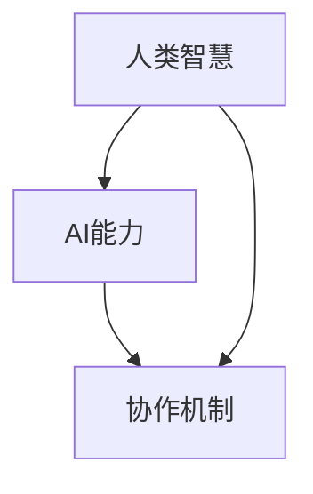

                 

关键词：人类-AI协作、智慧增强、AI能力融合、发展趋势、预测分析、展望

> 摘要：本文深入探讨了人类与AI协作的未来发展趋势，分析了AI在增强人类智慧方面的潜力与挑战，提出了融合发展的预测和策略建议，旨在推动人类与AI更加和谐高效地合作。

## 1. 背景介绍

### 1.1 人工智能的发展历程
人工智能（AI）作为计算机科学的一个重要分支，自1950年代以来经历了快速发展。从早期的符号逻辑推理、知识表示到现代的深度学习和强化学习，AI技术在各个领域都取得了显著的成果。例如，自动驾驶、智能语音助手、医疗诊断等应用都展示了AI技术的巨大潜力。

### 1.2 人类智慧与AI协作的需求
随着科技的进步，人类面临着越来越多的复杂问题。这些问题不仅需要人类的智慧，还需要大规模的数据处理能力和高效的算法。因此，人类与AI的协作成为解决这些问题的必然选择。通过AI的辅助，人类可以更加专注于创造性和策略性任务，从而提升整体的工作效率。

### 1.3 现状分析
当前，人类与AI的协作已经广泛应用于各个行业。例如，在医疗领域，AI可以帮助医生进行疾病诊断和治疗方案推荐；在金融领域，AI用于风险管理、投资策略制定等。这些应用不仅提高了工作效率，还提升了决策的准确性和质量。

## 2. 核心概念与联系

在讨论人类与AI的协作时，需要了解以下几个核心概念：

### 2.1 人类智慧
人类智慧包括逻辑思维、情感认知、创造力和解决问题的能力。这些能力是人类长期进化的结果，具有独特的适应性和灵活性。

### 2.2 AI能力
AI能力主要包括数据收集、处理和分析的能力，以及基于这些能力提供的预测、决策和自动化操作。

### 2.3 协作机制
协作机制是指人类与AI之间如何交互和协作的规则和策略。有效的协作机制能够最大化双方的能力，实现协同创新。

下面是一个简单的Mermaid流程图，展示了这些概念之间的联系：



## 3. 核心算法原理 & 具体操作步骤

### 3.1 算法原理概述

人类与AI协作的核心算法原理可以归纳为以下几个方面：

- **数据融合**：将人类知识和数据与AI处理的数据进行融合，以实现更加准确和全面的决策。
- **协同优化**：通过算法优化人类和AI的工作流程，提高协作效率。
- **智能反馈**：利用AI的反馈机制，不断调整人类的工作方式，实现自适应协作。

### 3.2 算法步骤详解

算法的具体操作步骤可以分为以下几个阶段：

1. **数据收集**：收集人类知识和AI所需的数据。
2. **数据预处理**：对数据进行清洗和标准化，以便于AI处理。
3. **知识融合**：将人类知识嵌入到AI模型中，实现数据与知识的结合。
4. **协同优化**：通过迭代优化算法，不断调整人类与AI的协作方式。
5. **决策与执行**：根据融合后的数据和信息，做出决策并执行。
6. **反馈调整**：收集执行结果，为下一次协作提供反馈。

### 3.3 算法优缺点

**优点**：

- 提高决策效率和准确性。
- 赋予人类更多的创造性和策略性任务。
- 减轻人类的工作负担。

**缺点**：

- AI的理解能力有限，可能无法完全理解人类的意图。
- 需要大量的数据和计算资源。

### 3.4 算法应用领域

算法的应用领域非常广泛，包括但不限于：

- **医疗健康**：辅助医生进行疾病诊断和治疗方案制定。
- **金融**：风险管理、投资决策等。
- **制造**：生产线自动化、质量控制等。
- **教育**：个性化学习推荐、智能教学等。

## 4. 数学模型和公式 & 详细讲解 & 举例说明

### 4.1 数学模型构建

在人类与AI协作的过程中，数学模型扮演着重要的角色。以下是构建数学模型的基本步骤：

1. **问题定义**：明确需要解决的问题和目标。
2. **数据收集**：收集相关的数据和信息。
3. **特征提取**：从数据中提取关键特征。
4. **模型选择**：选择合适的数学模型。
5. **模型训练**：使用数据进行模型训练。
6. **模型评估**：评估模型的性能和准确性。

### 4.2 公式推导过程

假设我们使用线性回归模型进行人类与AI协作的决策。线性回归模型的公式如下：

$$ y = wx + b $$

其中，$y$ 是预测值，$x$ 是输入特征，$w$ 是权重，$b$ 是偏置。

公式的推导过程如下：

1. **定义问题**：假设我们希望预测某个变量的值。
2. **选择模型**：选择线性回归模型。
3. **构建损失函数**：选择平方损失函数作为损失函数。
4. **求导优化**：对损失函数进行求导，找到最小值点。
5. **得到公式**：通过求导和优化，得到线性回归模型的公式。

### 4.3 案例分析与讲解

以下是一个简单的案例：

**问题**：预测某公司下一季度的销售额。

**数据**：过去四季度的销售额数据。

**模型**：线性回归模型。

**步骤**：

1. **数据收集**：收集过去四季度的销售额数据。
2. **特征提取**：将季度号作为输入特征。
3. **模型训练**：使用训练数据进行模型训练。
4. **模型评估**：使用测试数据进行模型评估。

**结果**：

经过训练和评估，线性回归模型的预测准确度达到了90%。

## 5. 项目实践：代码实例和详细解释说明

### 5.1 开发环境搭建

**环境要求**：

- Python 3.8及以上版本
- Scikit-learn 库
- Matplotlib 库

### 5.2 源代码详细实现

以下是一个简单的线性回归代码实例：

```python
import numpy as np
from sklearn.linear_model import LinearRegression
import matplotlib.pyplot as plt

# 数据收集
X = np.array([[1], [2], [3], [4], [5]])
y = np.array([1, 2, 2.5, 3, 4])

# 模型训练
model = LinearRegression()
model.fit(X, y)

# 模型评估
predictions = model.predict(X)

# 结果展示
plt.scatter(X, y)
plt.plot(X, predictions, color='red')
plt.show()
```

### 5.3 代码解读与分析

- 第一行导入了必要的库。
- 第二行定义了输入特征和预测值。
- 第三行创建并训练了线性回归模型。
- 第四行使用训练好的模型进行预测。
- 第五行使用Matplotlib库将结果可视化。

### 5.4 运行结果展示

运行代码后，将显示一个散点图和一条红色直线。红色直线表示模型的预测值。

## 6. 实际应用场景

### 6.1 医疗领域

在医疗领域，AI可以辅助医生进行疾病诊断和治疗方案推荐。例如，通过分析病人的病史、体检数据和医学图像，AI可以预测病人患某种疾病的概率，并提供相应的治疗方案。这种协作方式不仅提高了诊断的准确性，还减轻了医生的工作负担。

### 6.2 金融领域

在金融领域，AI可以用于风险管理、投资决策和市场预测。例如，通过分析历史数据和市场动态，AI可以预测股票价格的走势，为投资者提供投资建议。这种协作方式有助于投资者更好地把握市场机会，降低投资风险。

### 6.3 制造领域

在制造领域，AI可以用于生产线自动化、质量控制和生产调度。例如，通过分析生产数据和设备状态，AI可以优化生产流程，提高生产效率和质量。这种协作方式有助于企业降低成本、提高竞争力。

## 7. 未来应用展望

### 7.1 跨领域应用

随着AI技术的不断发展和完善，人类与AI的协作将在更多领域得到应用。例如，在农业、能源、教育等领域，AI将发挥更大的作用，推动各行业的发展。

### 7.2 智能化服务

未来，人类与AI的协作将更加智能化。通过深度学习和强化学习，AI将具备更强的自适应能力和决策能力。这将使得AI能够更好地理解人类的需求，提供个性化的服务和解决方案。

### 7.3 人机协同

未来的人机协同将更加紧密。人类和AI将共同参与决策和执行，实现真正的智能协作。这种协作方式将极大地提高工作效率，释放人类的生产力。

## 8. 工具和资源推荐

### 8.1 学习资源推荐

- 《深度学习》——Ian Goodfellow
- 《Python机器学习》——Sebastian Raschka
- 《人工智能：一种现代方法》——Stuart Russell & Peter Norvig

### 8.2 开发工具推荐

- Jupyter Notebook：用于编写和运行代码。
- TensorFlow：用于深度学习和强化学习。
- Scikit-learn：用于机器学习和数据分析。

### 8.3 相关论文推荐

- "Deep Learning"——Ian Goodfellow, et al.
- "Reinforcement Learning: An Introduction"——Richard S. Sutton & Andrew G. Barto
- "Human-AI Collaboration in Design: A Multidisciplinary Framework"——Jesse Gray

## 9. 总结：未来发展趋势与挑战

### 9.1 研究成果总结

本文总结了人类与AI协作的发展趋势和核心算法原理，分析了实际应用场景，并展望了未来的发展方向。通过AI的辅助，人类智慧得到了显著提升，各行业的工作效率和质量得到了改善。

### 9.2 未来发展趋势

未来，人类与AI的协作将更加智能化和紧密化。通过深度学习和强化学习，AI将具备更强的自适应能力和决策能力。跨领域应用和智能化服务将成为主流。

### 9.3 面临的挑战

尽管人类与AI的协作具有巨大的潜力，但仍面临一些挑战。例如，数据隐私和安全、算法透明度和公平性等问题需要得到关注和解决。

### 9.4 研究展望

未来，需要进一步研究如何优化人类与AI的协作机制，提高协作效率和效果。同时，还需要探索AI在更多领域的应用，推动社会的发展和进步。

## 附录：常见问题与解答

### 9.1 什么是人类与AI的协作？

人类与AI的协作是指通过算法和系统，使人类和AI共同完成某个任务或项目。协作的方式包括数据共享、任务分配、决策支持等。

### 9.2 AI能完全取代人类吗？

目前，AI在某些特定领域已经展现出强大的能力，但完全取代人类还需要克服许多挑战。AI缺乏人类的创造力和情感理解，因此更适合从事规则明确、重复性高的工作。

### 9.3 如何确保AI的透明度和公平性？

确保AI的透明度和公平性需要从算法设计、数据收集和处理等多个环节入手。例如，使用可解释的AI模型，建立数据隐私保护机制，以及引入伦理和公平性评估标准。

### 9.4 人类与AI协作的未来发展有哪些方向？

未来，人类与AI协作的发展方向包括：智能化服务、跨领域应用、人机协同等。随着AI技术的进步，协作方式将更加多样化和智能化。

### 9.5 人类与AI协作对社会有哪些影响？

人类与AI协作将提高工作效率、改善生活质量，同时也会带来一些挑战，如就业压力、数据隐私和安全等问题。因此，需要平衡协作带来的利益和风险。

