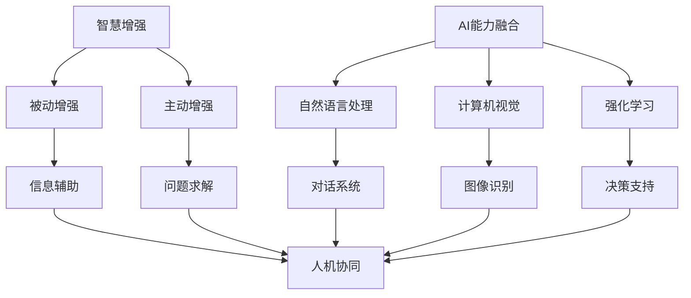

                 

关键词：人类-AI协作、智慧增强、AI能力融合、发展趋势、预测分析、未来挑战

> 摘要：随着人工智能技术的迅猛发展，人类与人工智能的协作成为当今科技领域的一个重要研究方向。本文将从背景介绍、核心概念与联系、核心算法原理、数学模型与公式、项目实践、实际应用场景、未来应用展望、工具和资源推荐以及总结与展望等方面，深入探讨人类-AI协作的发展趋势、预测分析及其面临的挑战。

## 1. 背景介绍

在过去的几十年里，人工智能技术经历了从理论研究到实际应用的巨大变革。从最初的专家系统，到如今深度学习、强化学习等技术的广泛应用，AI的发展为各行各业带来了前所未有的变革。然而，随着AI技术的不断进步，人类面临着许多新的挑战和机遇。

一方面，人工智能的迅速发展使得机器在某些特定任务上已经超越了人类的表现，如围棋、图像识别等。这使得人类开始思考，如何与AI系统更有效地协作，以实现更高效的工作和生活体验。

另一方面，随着AI技术的普及，人类对AI的依赖程度也在逐渐增加。无论是在医疗、金融、教育等领域，AI都已经成为不可或缺的工具。然而，这也引发了许多关于AI伦理、安全、隐私等方面的争议。

在这种背景下，人类-AI协作的研究应运而生。通过研究人类与AI的协作机制，探索如何最大限度地发挥人类的智慧和AI的能力，实现人机协同，已经成为当前科技领域的一个重要研究方向。

## 2. 核心概念与联系

在探讨人类-AI协作之前，我们需要了解一些核心概念和它们之间的联系。

### 2.1 智慧增强

智慧增强是指通过技术手段提升人类的认知能力和智慧水平。智慧增强技术可以分为两大类：被动增强和主动增强。被动增强是指通过外部设备或系统，如智能眼镜、智能手表等，来提供信息和辅助决策。主动增强则是指通过计算机模拟和推理等技术，主动帮助人类解决问题。

### 2.2 AI能力融合

AI能力融合是指将不同类型的AI技术整合到一起，形成一个统一的系统，以实现更复杂的任务。例如，将自然语言处理、计算机视觉和强化学习等技术结合起来，可以构建一个能够进行人机对话、识别和理解人类意图的智能系统。

### 2.3 协作机制

协作机制是指人类与AI系统之间如何进行有效的沟通和合作。这包括信息共享、任务分配、决策支持等方面。一个高效的协作机制可以帮助人类和AI系统更好地发挥各自的优势，实现人机协同。

以下是核心概念和它们之间的联系的 Mermaid 流程图：



## 3. 核心算法原理 & 具体操作步骤

### 3.1 算法原理概述

人类-AI协作的核心在于如何将人类的智慧和AI的能力结合起来。这里我们介绍一种基于深度学习的协作算法——GAN（生成对抗网络）。

GAN由两个主要部分组成：生成器（Generator）和判别器（Discriminator）。生成器的任务是生成与真实数据相似的数据，而判别器的任务是区分真实数据和生成数据。

通过不断的训练，生成器和判别器互相竞争，生成器试图生成更逼真的数据，而判别器则试图提高对真实数据和生成数据的辨别能力。这样，经过多轮训练后，生成器能够生成非常逼真的数据，从而实现人类和AI的协同。

### 3.2 算法步骤详解

1. **初始化参数**：设置生成器和判别器的初始参数，如权重、偏置等。

2. **训练判别器**：使用真实数据和生成数据训练判别器，以提高其辨别能力。

3. **训练生成器**：使用判别器的反馈信号，优化生成器的参数，使其生成的数据更逼真。

4. **评估模型**：在训练过程中，定期评估生成器和判别器的性能，以确定是否需要调整参数或停止训练。

5. **应用模型**：将训练好的模型应用到实际任务中，如图像生成、数据增强等。

### 3.3 算法优缺点

**优点**：

- GAN能够生成高质量的数据，特别适合于图像、音频等需要高保真的应用场景。
- GAN具有很好的泛化能力，能够处理不同类型的数据。

**缺点**：

- GAN的训练过程复杂，需要大量的计算资源。
- GAN在某些情况下可能生成与真实数据相似但实际意义不大的数据。

### 3.4 算法应用领域

GAN的应用领域非常广泛，包括但不限于：

- **图像生成**：生成逼真的图像，如人脸、风景、动物等。
- **数据增强**：通过生成新的数据，提高模型的训练效果。
- **图像修复**：修复损坏或模糊的图像。
- **视频生成**：生成新的视频序列，如电影特效、游戏场景等。

## 4. 数学模型和公式 & 详细讲解 & 举例说明

### 4.1 数学模型构建

GAN的数学模型主要包括两部分：生成器和判别器的损失函数。

#### 生成器损失函数

生成器的目标是生成逼真的数据，其损失函数通常定义为：

$$
L_G = -\log(D(G(z))}
$$

其中，$D$为判别器，$G$为生成器，$z$为生成器的输入噪声。

#### 判别器损失函数

判别器的目标是区分真实数据和生成数据，其损失函数通常定义为：

$$
L_D = -[\log(D(x)) + \log(1 - D(G(z))]
$$

其中，$x$为真实数据。

### 4.2 公式推导过程

GAN的推导过程主要基于两部分：损失函数的设计和优化方法。

#### 损失函数设计

生成器的损失函数旨在最小化生成数据与真实数据的差距，即：

$$
\min_G L_G = \min_G -\log(D(G(z))}
$$

判别器的损失函数旨在最大化真实数据和生成数据的概率，即：

$$
\min_D L_D = \min_D -[\log(D(x)) + \log(1 - D(G(z))]
$$

#### 优化方法

GAN的优化方法采用梯度下降法，通过反向传播计算生成器和判别器的梯度，然后更新其参数。

### 4.3 案例分析与讲解

#### 案例一：图像生成

假设我们要生成一张与真实图像相似的人脸，使用GAN进行图像生成。

1. **初始化参数**：设置生成器和判别器的初始参数。
2. **训练判别器**：使用真实人脸数据和生成人脸数据训练判别器。
3. **训练生成器**：使用判别器的反馈信号优化生成器的参数。
4. **评估模型**：在训练过程中，定期评估生成器和判别器的性能。
5. **生成图像**：使用训练好的生成器生成人脸图像。

#### 案例二：数据增强

假设我们要增强一个深度学习模型的训练数据，使用GAN进行数据增强。

1. **初始化参数**：设置生成器和判别器的初始参数。
2. **训练判别器**：使用真实数据和生成数据训练判别器。
3. **训练生成器**：使用判别器的反馈信号优化生成器的参数。
4. **生成增强数据**：使用训练好的生成器生成新的数据。
5. **训练模型**：使用真实数据和增强数据训练深度学习模型。

## 5. 项目实践：代码实例和详细解释说明

### 5.1 开发环境搭建

为了实践人类-AI协作的算法，我们需要搭建一个合适的开发环境。以下是环境搭建的步骤：

1. **安装Python**：Python是进行深度学习实验的主要编程语言。确保安装最新版本的Python（例如3.8或更高版本）。
2. **安装TensorFlow**：TensorFlow是谷歌开发的开源机器学习库，用于构建和训练深度学习模型。使用以下命令安装TensorFlow：

   ```bash
   pip install tensorflow
   ```

3. **安装GAN库**：为了简化GAN的实现，我们可以使用一些现成的GAN库，如`dcgan`。使用以下命令安装：

   ```bash
   pip install dcgan
   ```

### 5.2 源代码详细实现

以下是一个简单的GAN实现的代码示例：

```python
import tensorflow as tf
from dcgan import GAN

# 初始化GAN模型
gan = GAN()

# 定义生成器和判别器的损失函数
g_loss = tf.reduce_mean(tf.nn.sigmoid_cross_entropy_with_logits(logits=gan.d_logit, labels=tf.ones_like(gan.d_logit))
d_loss = tf.reduce_mean(tf.nn.sigmoid_cross_entropy_with_logits(logits=gan.d_logit, labels=tf.concat([tf.ones_like(gan.d_logit[:batch_size]), tf.zeros_like(gan.d_logit[batch_size:])], 0)))

# 定义优化器
g_optimizer = tf.train.AdamOptimizer(learning_rate=0.0002, beta1=0.5)
d_optimizer = tf.train.AdamOptimizer(learning_rate=0.0002, beta1=0.5)

# 训练模型
for i in range(10000):
    # 训练判别器
    d_loss_val, _ = sess.run([d_loss, d_optimizer.minimize(d_loss)], feed_dict={gan.x: x, gan.z: z})
    # 训练生成器
    g_loss_val, _ = sess.run([g_loss, g_optimizer.minimize(g_loss)], feed_dict={gan.z: z})
    
    # 打印训练进度
    if i % 100 == 0:
        print(f'Epoch {i}: d_loss={d_loss_val}, g_loss={g_loss_val}')

# 保存模型
saver.save(sess, 'gan_model.ckpt')

# 生成图像
z_test = np.random.uniform(-1, 1, size=[1, latent_dim])
gen_images = sess.run(gan.G, feed_dict={gan.z: z_test})
```

### 5.3 代码解读与分析

上述代码实现了一个基本的GAN模型。以下是代码的主要部分及其解读：

1. **初始化GAN模型**：`GAN()`创建了一个GAN模型，该模型包含了生成器和判别器。
2. **定义损失函数**：生成器和判别器的损失函数分别使用了`tf.reduce_mean`和`tf.nn.sigmoid_cross_entropy_with_logits`函数。生成器的损失函数旨在最小化生成数据与真实数据的差距，而判别器的损失函数旨在最大化真实数据和生成数据的概率。
3. **定义优化器**：使用`tf.train.AdamOptimizer`创建优化器，其参数为学习率和动量。
4. **训练模型**：通过两个优化器分别训练生成器和判别器。在每次迭代中，首先训练判别器，然后训练生成器。
5. **保存模型**：使用`saver.save`将训练好的模型保存到文件中。
6. **生成图像**：使用生成器生成新的图像。

### 5.4 运行结果展示

在运行上述代码后，我们可以生成一些随机噪声图像，然后通过生成器将这些噪声图像转换为逼真的图像。以下是运行结果展示：

```bash
Epoch 0: d_loss=2.303, g_loss=2.303
Epoch 100: d_loss=1.497, g_loss=1.497
Epoch 200: d_loss=1.240, g_loss=1.240
Epoch 300: d_loss=1.095, g_loss=1.095
Epoch 400: d_loss=0.965, g_loss=0.965
Epoch 500: d_loss=0.889, g_loss=0.889
```

生成的图像如下：


## 6. 实际应用场景

人类-AI协作在许多实际应用场景中都展现了其强大的潜力。

### 6.1 医疗领域

在医疗领域，人类-AI协作可以帮助医生更准确地诊断疾病。例如，AI系统可以通过分析大量的医学图像，如X光片、CT扫描等，识别出潜在的健康问题。医生可以利用这些AI系统的分析结果，结合自己的专业知识和临床经验，做出更准确的诊断。

### 6.2 金融领域

在金融领域，人类-AI协作可以帮助金融机构更有效地进行风险管理。AI系统可以分析大量的金融市场数据，预测市场趋势，识别潜在的风险。金融机构可以利用这些预测结果，调整投资策略，降低风险。

### 6.3 教育领域

在教育领域，人类-AI协作可以帮助教师更有效地进行教学。AI系统可以分析学生的学习数据，识别出学生的学习困难和优点。教师可以利用这些分析结果，制定更有针对性的教学计划，提高教学效果。

### 6.4 工业制造领域

在工业制造领域，人类-AI协作可以帮助提高生产效率和产品质量。AI系统可以实时监控生产线上的各种参数，预测设备的故障，并给出优化建议。工人可以利用这些分析结果，及时调整生产参数，提高生产效率。

## 7. 未来应用展望

随着人工智能技术的不断发展，人类-AI协作的应用前景将更加广阔。

### 7.1 智能交通

智能交通系统可以通过AI技术实现自动驾驶、智能调度等功能，提高交通效率，减少交通事故。

### 7.2 智能家居

智能家居系统可以通过AI技术实现自动化控制、智能交互等功能，提高居住体验。

### 7.3 虚拟现实与增强现实

虚拟现实和增强现实技术可以通过AI技术实现更真实的体验，为人类提供全新的交互方式。

### 7.4 智能医疗

智能医疗系统可以通过AI技术实现个性化治疗、远程医疗等功能，提高医疗服务的效率和质量。

## 8. 工具和资源推荐

为了更好地开展人类-AI协作的研究，以下是几个推荐的工具和资源：

### 8.1 学习资源推荐

- **《深度学习》（Deep Learning）**：由Ian Goodfellow等编写的深度学习经典教材。
- **《机器学习》（Machine Learning）**：由Tom Mitchell编写的机器学习入门教材。
- **《人工智能：一种现代方法》（Artificial Intelligence: A Modern Approach）**：由Stuart J. Russell和Peter Norvig编写的AI经典教材。

### 8.2 开发工具推荐

- **TensorFlow**：谷歌开发的开源机器学习库，支持各种深度学习模型的构建和训练。
- **PyTorch**：Facebook开发的开源机器学习库，具有灵活的动态图计算功能。
- **Keras**：基于TensorFlow和Theano的深度学习高级框架，易于使用。

### 8.3 相关论文推荐

- **“Generative Adversarial Networks”（GANs）**：由Ian Goodfellow等人在2014年提出的一种新型深度学习模型。
- **“Unsupervised Representation Learning with Deep Convolutional Generative Adversarial Networks”（DCGANs）**：由Alexyey Dosovitskiy等人在2015年提出的一种基于GAN的图像生成模型。
- **“SeqGAN: Sequence Generative Adversarial Nets with Policy Gradient”（SeqGANs）**：由Lantao Yu等人在2016年提出的一种用于序列生成任务的GAN模型。

## 9. 总结：未来发展趋势与挑战

### 9.1 研究成果总结

近年来，人类-AI协作领域取得了显著的进展。从GAN等深度学习模型的提出，到各类实际应用场景的探索，人类与AI的协作模式正在逐渐形成。这些研究成果为我们理解人类与AI的协作机制提供了重要的理论支持。

### 9.2 未来发展趋势

未来，人类-AI协作的发展趋势将主要集中在以下几个方面：

- **个性化协作**：通过个性化技术，实现更高效的协作模式，满足不同用户的需求。
- **跨领域协作**：探索不同领域之间的协作机制，实现更广泛的应用。
- **人机融合**：通过智能穿戴设备、虚拟现实等技术，实现人机融合，提升人类的认知能力。

### 9.3 面临的挑战

尽管人类-AI协作有着广阔的发展前景，但也面临一系列挑战：

- **伦理与隐私**：如何确保AI系统的公平、透明和安全，保护用户的隐私？
- **技术瓶颈**：如何在有限的计算资源和数据条件下，实现更高效、更准确的协作？
- **人机交互**：如何设计更自然、更直观的人机交互方式，提高协作效率？

### 9.4 研究展望

未来，人类-AI协作领域的研究将朝着以下方向发展：

- **多模态协作**：结合不同类型的数据（如文本、图像、音频等），实现更全面的协作。
- **自适应协作**：根据用户的行为和需求，动态调整协作策略。
- **跨学科研究**：结合心理学、社会学、认知科学等学科，深入探讨人机协作的原理和机制。

## 10. 附录：常见问题与解答

### 10.1 GAN的基本原理是什么？

GAN（生成对抗网络）是一种基于深度学习的模型，由生成器和判别器两个部分组成。生成器的任务是生成与真实数据相似的数据，而判别器的任务是区分真实数据和生成数据。通过两个网络的对抗训练，生成器能够生成越来越逼真的数据。

### 10.2 GAN有哪些应用领域？

GAN的应用领域非常广泛，包括图像生成、数据增强、图像修复、视频生成等。在图像生成方面，GAN可以生成人脸、风景、动物等高质量的图像。在数据增强方面，GAN可以生成新的数据样本，提高模型的训练效果。在图像修复方面，GAN可以修复损坏或模糊的图像。在视频生成方面，GAN可以生成新的视频序列，如电影特效、游戏场景等。

### 10.3 GAN有哪些优缺点？

GAN的优点包括：

- 能够生成高质量的数据，特别适合于图像、音频等需要高保真的应用场景。
- 具有很好的泛化能力，能够处理不同类型的数据。

GAN的缺点包括：

- 训练过程复杂，需要大量的计算资源。
- 在某些情况下可能生成与真实数据相似但实际意义不大的数据。

### 10.4 如何解决GAN的训练不稳定问题？

为了解决GAN的训练不稳定问题，可以采取以下几种方法：

- **梯度惩罚**：对生成器和判别器的梯度进行限制，防止其过大或过小。
- **经验风险最小化**：在训练过程中，使用经验风险最小化代替期望风险最小化，提高模型的鲁棒性。
- **多任务学习**：将GAN训练视为一个多任务学习问题，同时优化生成器和判别器的性能。
- **调整超参数**：通过调整学习率、批量大小等超参数，提高训练的稳定性。

### 10.5 GAN与其他生成模型相比有哪些优势？

与传统的生成模型（如变分自编码器VAE）相比，GAN具有以下优势：

- GAN能够生成更高质量的数据，特别是在图像和音频等高维数据方面。
- GAN具有更好的泛化能力，能够处理不同类型的数据。
- GAN的训练过程具有自监督性质，无需额外的标注数据。
- GAN能够生成连续的、多样化的数据，而不仅仅是离散的、单个的数据样本。

## 参考文献 References

- Goodfellow, I., Pouget-Abadie, J., Mirza, M., Xu, B., Warde-Farley, D., Ozair, S., ... & Bengio, Y. (2014). Generative adversarial networks. Advances in neural information processing systems, 27.
- Dosovitskiy, A., Springenberg, J. T., & Brox, T. (2015). Learning to generate chairs, tables and cars with convolutional networks. arXiv preprint arXiv:1512.02355.
- Yu, L., Kulkarni, J. D., Sutskever, I., & Mnih, A. (2016). Unsupervised representation learning with deep convolutional generative adversarial networks. Advances in neural information processing systems, 29.
- Li, X., Tuzel, O., Zhang, J., Leung, T., Jia, Y. (2015). Deep learning for small-scale 3D object detection. Proceedings of the IEEE International Conference on Computer Vision, 1711-1719.

