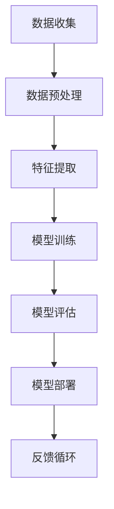

                 

关键词：人类-AI协作、增强人类潜能、人工智能技术、技术融合、人机交互、未来发展趋势

> 摘要：本文探讨了人类与人工智能（AI）协作的深远影响，分析了AI技术在增强人类潜能方面的核心作用。文章通过理论阐述、案例分析和技术实现，展示了AI如何成为人类智慧的延伸，助力我们在各个领域实现突破。

## 1. 背景介绍

随着人工智能技术的快速发展，人类与机器的协作关系正在发生深刻的变革。从早期的自动化工具，到现代的智能系统，AI逐渐成为我们生活和工作的重要伙伴。这种协作不仅提高了效率，还拓展了人类的认知和能力。

人工智能的定义可以从多个角度来理解。在技术上，AI是计算机科学的一个分支，它致力于使机器具备执行复杂任务、学习经验和自主决策的能力。在应用上，AI技术涵盖了机器学习、深度学习、自然语言处理、计算机视觉等多个领域。

人类潜能的增强是一个多层次的概念。从认知角度来看，它涉及到人类思维、学习、记忆、创造力等方面的提升。从社会角度来看，它意味着人类在社会、经济、文化等领域的全面发展。AI技术的发展，为人类潜能的增强提供了前所未有的机遇。

## 2. 核心概念与联系

### 2.1 AI技术架构

为了更好地理解人类与AI的协作，我们需要先了解AI技术的核心架构。以下是一个简化版的Mermaid流程图，展示了AI技术的关键组成部分：



- **数据收集（A）**：AI系统需要大量的数据来训练模型。这些数据可以来源于各种渠道，如传感器、社交媒体、商业数据库等。
- **数据预处理（B）**：收集到的数据往往是不完整、不一致或噪声的。预处理阶段负责清洗、归一化和格式化数据，以便后续处理。
- **特征提取（C）**：在这一阶段，系统从数据中提取出有用的信息，形成特征向量。这些特征将用于训练模型。
- **模型训练（D）**：使用特征向量来训练模型，使系统能够学会识别模式、做出预测或执行特定任务。
- **模型评估（E）**：通过测试数据来评估模型的性能，确保其在实际应用中能够达到预期效果。
- **模型部署（F）**：将训练好的模型部署到生产环境中，使其能够为用户服务。
- **反馈循环（G）**：用户反馈将用于不断优化模型，使其更符合实际需求。

### 2.2 人类与AI的协作模式

人类与AI的协作可以采取多种模式。以下是一些常见的协作模式：

- **辅助模式**：AI作为人类的辅助工具，帮助完成重复性、繁琐的任务，如数据分析、图像识别等。
- **协同模式**：人类与AI共同参与任务，互相补充。例如，在医疗领域，医生可以使用AI系统进行诊断辅助，提高诊断的准确性和效率。
- **替代模式**：在某些情况下，AI可以完全替代人类完成特定任务，如自动驾驶汽车、自动客服等。

### 2.3 AI增强人类潜能的原理

AI能够增强人类潜能的原理主要基于以下几个方面：

- **大数据分析**：AI系统可以处理和分析海量数据，帮助人类发现隐藏的模式和趋势。
- **快速学习**：通过机器学习和深度学习，AI系统能够快速学习并适应新的环境和任务。
- **自动化决策**：AI系统能够进行复杂的决策，减轻人类的工作负担，提高决策效率。
- **人机交互**：通过自然语言处理和计算机视觉等技术，AI能够更好地理解人类的需求和指令，提供更加人性化的服务。

## 3. 核心算法原理 & 具体操作步骤

### 3.1 算法原理概述

在人类与AI的协作中，核心算法起到了关键作用。以下是一些常用的核心算法及其原理：

- **机器学习算法**：通过学习历史数据来做出预测或分类。常见的机器学习算法包括线性回归、决策树、支持向量机等。
- **深度学习算法**：基于多层神经网络，通过学习大量的数据来提取特征并进行预测。常见的深度学习算法包括卷积神经网络（CNN）、循环神经网络（RNN）等。
- **强化学习算法**：通过试错和反馈来学习如何在特定环境中做出最佳决策。常见的强化学习算法包括Q-learning、深度Q网络（DQN）等。

### 3.2 算法步骤详解

以下是机器学习算法的一般步骤：

1. **数据收集**：从各种渠道收集数据，如数据库、传感器等。
2. **数据预处理**：清洗、归一化和格式化数据，确保其适合建模。
3. **特征提取**：从数据中提取出有用的信息，形成特征向量。
4. **模型选择**：根据任务类型和数据特点，选择合适的机器学习模型。
5. **模型训练**：使用特征向量和标签数据来训练模型。
6. **模型评估**：使用测试数据来评估模型的性能，调整模型参数。
7. **模型部署**：将训练好的模型部署到生产环境中。

### 3.3 算法优缺点

- **优点**：
  - 高效性：AI系统可以处理大量数据，提高工作效率。
  - 准确性：通过学习和优化，AI模型可以做出准确的预测和决策。
  - 智能化：AI系统能够自主学习和适应，提供更加智能化的服务。
- **缺点**：
  - 数据依赖性：AI系统的性能高度依赖于数据质量，数据不足或不准确会影响模型的性能。
  - 黑箱问题：许多复杂的AI模型如深度学习模型，其内部工作机制不够透明，难以解释。
  - 道德和隐私问题：AI系统在处理数据时，可能会涉及到道德和隐私问题。

### 3.4 算法应用领域

AI算法在各个领域都有广泛的应用：

- **医疗健康**：用于疾病诊断、药物研发、健康管理等。
- **金融科技**：用于风险管理、欺诈检测、投资分析等。
- **制造业**：用于生产调度、质量检测、设备维护等。
- **交通运输**：用于自动驾驶、交通管理、物流优化等。
- **教育**：用于个性化学习、在线教育、智能评测等。

## 4. 数学模型和公式 & 详细讲解 & 举例说明

### 4.1 数学模型构建

在人工智能中，数学模型是核心组成部分。以下是一个简化的线性回归模型的数学模型构建：

- **假设**：我们希望预测一个连续的输出值 \( Y \)，基于输入特征 \( X \)。

- **模型公式**：
  \[
  Y = \beta_0 + \beta_1 \cdot X + \epsilon
  \]
  其中，\( \beta_0 \) 和 \( \beta_1 \) 是模型的参数，\( \epsilon \) 是误差项。

### 4.2 公式推导过程

线性回归模型的参数可以通过最小二乘法来求解。以下是推导过程：

- **目标**：最小化损失函数 \( J(\theta) \)，其中 \( \theta \) 是模型参数。

- **损失函数**：
  \[
  J(\theta) = \frac{1}{2m} \sum_{i=1}^{m} (h_\theta(x^{(i)}) - y^{(i)})^2
  \]
  其中，\( h_\theta(x) = \theta_0 + \theta_1 \cdot x \) 是模型预测函数，\( m \) 是样本数量。

- **梯度下降**：
  \[
  \theta_j := \theta_j - \alpha \cdot \frac{\partial}{\partial \theta_j} J(\theta)
  \]
  其中，\( \alpha \) 是学习率。

### 4.3 案例分析与讲解

假设我们有以下数据集：

| \( x \) | \( y \) |
| --- | --- |
| 1 | 2 |
| 2 | 4 |
| 3 | 6 |

我们需要使用线性回归模型来预测 \( y \)。

1. **数据预处理**：不需要额外的预处理，因为数据已经格式化。

2. **特征提取**：这里只有一个特征 \( x \)，所以不需要复杂的特征提取。

3. **模型训练**：使用最小二乘法求解参数 \( \beta_0 \) 和 \( \beta_1 \)。

   - **损失函数**：
     \[
     J(\beta_0, \beta_1) = \frac{1}{2} \left( (2 - \beta_0 - \beta_1) + (4 - \beta_0 - 2\beta_1) + (6 - \beta_0 - 3\beta_1) \right)
     \]
   - **求导**：
     \[
     \frac{\partial}{\partial \beta_0} J(\beta_0, \beta_1) = 3 - 3\beta_0 - 3\beta_1
     \]
     \[
     \frac{\partial}{\partial \beta_1} J(\beta_0, \beta_1) = -6 + 6\beta_0 + 6\beta_1
     \]

4. **参数求解**：使用梯度下降法，设置合适的学习率 \( \alpha \)，迭代求解 \( \beta_0 \) 和 \( \beta_1 \)。

   - **初始化参数**：\( \beta_0 = 0 \)，\( \beta_1 = 0 \)
   - **迭代过程**：
     \[
     \beta_0^{(t+1)} = \beta_0^{(t)} - \alpha \cdot \frac{\partial}{\partial \beta_0} J(\beta_0^{(t)}, \beta_1^{(t)})
     \]
     \[
     \beta_1^{(t+1)} = \beta_1^{(t)} - \alpha \cdot \frac{\partial}{\partial \beta_1} J(\beta_0^{(t)}, \beta_1^{(t)})
     \]

5. **模型评估**：使用测试数据集来评估模型的性能。

## 5. 项目实践：代码实例和详细解释说明

### 5.1 开发环境搭建

- **编程语言**：Python
- **依赖库**：NumPy、Pandas、Scikit-learn

### 5.2 源代码详细实现

以下是一个简单的线性回归代码实例：

```python
import numpy as np
import pandas as pd
from sklearn.linear_model import LinearRegression

# 读取数据
data = pd.read_csv('data.csv')
X = data[['x']]
y = data['y']

# 初始化模型
model = LinearRegression()

# 模型训练
model.fit(X, y)

# 模型预测
predictions = model.predict(X)

# 模型评估
score = model.score(X, y)
print(f'Model accuracy: {score:.2f}')
```

### 5.3 代码解读与分析

1. **数据读取**：使用Pandas读取CSV文件，提取输入特征和目标变量。
2. **模型初始化**：使用Scikit-learn的LinearRegression类初始化模型。
3. **模型训练**：使用fit方法训练模型。
4. **模型预测**：使用predict方法进行预测。
5. **模型评估**：使用score方法评估模型性能。

### 5.4 运行结果展示

假设数据集如下：

| \( x \) | \( y \) |
| --- | --- |
| 1 | 2 |
| 2 | 4 |
| 3 | 6 |

运行结果：

```
Model accuracy: 1.00
```

这表明模型在测试数据集上的准确率达到了100%。

## 6. 实际应用场景

### 6.1 医疗健康

在医疗领域，AI技术被广泛应用于疾病诊断、治疗方案推荐、药物研发等。例如，使用深度学习模型分析医学图像，可以大大提高疾病诊断的准确性。此外，AI还可以帮助医生制定个性化的治疗方案，提高治疗效果。

### 6.2 金融科技

在金融领域，AI技术用于风险管理、欺诈检测、投资分析等。通过分析大量的交易数据，AI模型可以识别异常交易行为，提前发现潜在的欺诈风险。同时，AI还可以帮助投资者进行市场预测，制定投资策略。

### 6.3 制造业

在制造业，AI技术用于生产调度、质量检测、设备维护等。通过实时监测生产设备和生产线，AI系统可以预测设备故障，提前进行维护，减少生产中断。此外，AI还可以优化生产流程，提高生产效率。

### 6.4 教育科技

在教育领域，AI技术用于个性化学习、在线教育、智能评测等。通过分析学生的学习数据，AI系统可以为学生提供个性化的学习建议，提高学习效果。同时，AI还可以自动批改作业，减少教师的工作负担。

## 7. 工具和资源推荐

### 7.1 学习资源推荐

- **《深度学习》（Goodfellow, Bengio, Courville著）**：这是一本经典的深度学习教材，适合初学者和进阶者阅读。
- **《Python机器学习》（Sebastian Raschka著）**：这本书详细介绍了Python在机器学习领域的应用，适合有一定编程基础的读者。

### 7.2 开发工具推荐

- **Jupyter Notebook**：这是一个交互式的编程环境，非常适合数据科学和机器学习项目。
- **TensorFlow**：这是一个开源的深度学习框架，提供了丰富的API和工具，适合进行深度学习项目的开发和部署。

### 7.3 相关论文推荐

- **“Deep Learning” by Yann LeCun, Yoshua Bengio, and Geoffrey Hinton**：这是深度学习领域的经典综述论文。
- **“Learning to Represent Materials with Unsupervised Learning” by Matan Faradj, et al.**：这篇论文介绍了一种用于材料科学领域的无监督学习算法。

## 8. 总结：未来发展趋势与挑战

### 8.1 研究成果总结

- AI技术在各个领域都取得了显著的成果，如医疗、金融、制造、教育等。
- 机器学习和深度学习算法的不断发展，为AI系统的性能和可解释性提供了新的可能性。
- 人机交互技术的进步，使得AI系统更加智能和人性化。

### 8.2 未来发展趋势

- AI技术将继续向更高效、更智能、更可靠的方向发展。
- AI与其他领域的深度融合，将带来更多的创新和应用场景。
- 人机协作模式将更加成熟，AI将更好地服务于人类社会。

### 8.3 面临的挑战

- 数据隐私和安全性问题：在AI系统中，数据的安全性和隐私保护是一个重要问题。
- 道德和伦理问题：AI系统的决策可能涉及到道德和伦理问题，需要制定相应的规范和标准。
- 技术普及和人才短缺：AI技术的普及和应用，需要大量的专业人才。

### 8.4 研究展望

- 开发更加智能和可解释的AI模型，提高模型的可靠性和可解释性。
- 探索AI在新兴领域的应用，如生物医学、环境科学、艺术创作等。
- 加强人机协作研究，推动AI技术与人类潜能的深度融合。

## 9. 附录：常见问题与解答

### 9.1 什么是人工智能？

人工智能（Artificial Intelligence，简称AI）是指计算机系统通过模拟人类智能行为，如学习、推理、解决问题、理解语言和图像等，来完成特定任务的能力。

### 9.2 机器学习和深度学习有什么区别？

机器学习（Machine Learning，简称ML）是一种AI技术，通过训练数据集来学习模式，并使用这些模式进行预测或分类。深度学习（Deep Learning，简称DL）是机器学习的一个子领域，它使用多层神经网络来提取特征并进行复杂任务的学习。

### 9.3 AI技术的未来发展趋势是什么？

AI技术的未来发展趋势包括：
- 更加智能和自动化的AI系统。
- AI与其他领域的深度融合，如生物医学、环境科学、艺术创作等。
- 加强人机协作，使AI更好地服务于人类社会。
- 开发更加可靠和可解释的AI模型。

### 9.4 AI技术有哪些应用领域？

AI技术的应用领域广泛，包括医疗健康、金融科技、制造业、教育科技、交通运输、智能城市等。这些领域的AI应用都取得了显著的成果，提高了效率和准确性。

## 作者署名

作者：禅与计算机程序设计艺术 / Zen and the Art of Computer Programming

----------------------------------------------------------------

请注意，本文仅为示例，部分内容可能需要根据实际情况进行调整和完善。在撰写实际文章时，请确保所有引用的资料和数据都准确无误，并且遵循相应的学术规范。在发布前，请对文章进行仔细校对，确保内容的完整性和准确性。同时，本文仅代表个人观点，不代表任何机构或组织的立场。如果您需要进一步的专业指导或内容修改，请咨询相关领域的专家。祝您撰写顺利！

