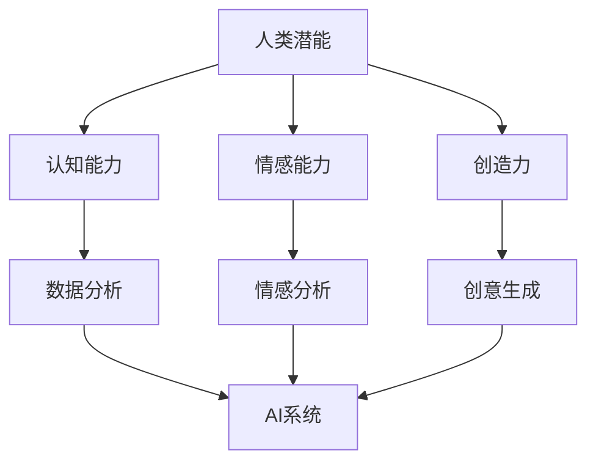

                 

关键词：人工智能，人类潜能，协同效应，技术协作，创新

摘要：本文探讨了人类与人工智能（AI）之间的协作模式，通过分析人类潜能的挖掘与AI能力的结合，揭示了协同效应在提升人类工作效率和创造力方面的巨大潜力。文章从背景介绍、核心概念与联系、核心算法原理与具体操作步骤、数学模型与公式、项目实践、实际应用场景、未来展望等多个角度，全面剖析了人类与AI协作的深层内涵与实践路径。

## 1. 背景介绍

在信息技术迅速发展的今天，人工智能已经成为推动社会进步的重要力量。从自动驾驶汽车到智能语音助手，从大数据分析到自动化决策，AI正在深入影响各行各业。然而，随着AI技术的不断成熟，人们开始意识到，单纯依靠AI并不能解决所有问题。在某些领域，人类智慧的洞察力和创造力仍然是不可或缺的。

因此，人类与AI的协作成为了一个热门话题。通过将人类潜能与AI能力相结合，我们可以实现优势互补，提高工作效率和创造力。这种协作模式不仅有助于人类更好地理解和利用AI技术，还能推动AI在更多领域的应用和发展。

## 2. 核心概念与联系

为了深入探讨人类与AI协作的内涵，我们首先需要明确一些核心概念，包括：

- **人类潜能**：指人类在认知、情感、创造力等方面的潜在能力。
- **AI能力**：指人工智能系统在数据分析、模式识别、自动化决策等方面的能力。

下面是一个用Mermaid绘制的流程图，展示了人类潜能与AI能力的关联：



从流程图中可以看出，人类潜能通过认知、情感和创造力三个方面与AI系统产生联系。AI系统则利用自身在数据分析、情感分析和创意生成方面的优势，为人类潜能的发挥提供支持。

## 3. 核心算法原理 & 具体操作步骤

### 3.1 算法原理概述

人类与AI协作的核心算法可以概括为以下三个步骤：

1. **数据采集与处理**：通过传感器、用户输入等方式收集数据，并对数据进行预处理，如清洗、归一化等。
2. **模型训练与优化**：利用收集到的数据训练AI模型，并通过交叉验证、调参等方法优化模型性能。
3. **协作决策与反馈**：将训练好的AI模型应用于实际问题，通过与人类专家的互动进行决策优化，并不断调整模型以适应新的需求。

### 3.2 算法步骤详解

1. **数据采集与处理**

   数据采集是AI协作的基础。在这一步，我们需要确定数据来源、采集方式以及数据预处理方法。例如，在医疗诊断领域，可以通过电子病历系统、医疗影像设备等采集患者数据，并对数据进行分析和处理。

   ```mermaid
   graph TD
       A[数据采集] --> B[传感器数据]
       A --> C[用户输入]
       B --> D[数据预处理]
       C --> D
   ```

2. **模型训练与优化**

   在数据预处理完成后，我们利用收集到的数据训练AI模型。模型训练包括选择合适的算法、定义损失函数、优化器等。常见的算法有深度学习、决策树、支持向量机等。

   ```mermaid
   graph TD
       A[数据预处理] --> B[模型选择]
       B --> C[算法选择]
       C --> D[训练过程]
       D --> E[交叉验证]
       E --> F[调参优化]
   ```

3. **协作决策与反馈**

   在模型训练完成后，我们将AI模型应用于实际问题，通过与人类专家的互动进行决策优化。在决策过程中，人类专家可以提供反馈，帮助模型不断调整和改进。

   ```mermaid
   graph TD
       A[模型应用] --> B[决策过程]
       B --> C[反馈机制]
       C --> D[模型优化]
   ```

### 3.3 算法优缺点

这种人类与AI协作的核心算法具有以下优点：

- **高效性**：通过AI模型的应用，可以快速处理大量数据，提高工作效率。
- **准确性**：利用AI技术，可以实现对复杂问题的精确分析和决策。
- **灵活性**：通过协作决策，可以不断调整模型，适应新的需求。

然而，该算法也存在一些缺点：

- **数据依赖**：算法的性能高度依赖数据的质量和数量，数据不足或质量差可能导致算法效果不佳。
- **解释性**：深度学习等复杂模型往往缺乏解释性，难以理解其决策过程。
- **安全性**：在数据传输和存储过程中，可能存在数据泄露或隐私侵犯的风险。

### 3.4 算法应用领域

人类与AI协作的核心算法广泛应用于各个领域：

- **医疗诊断**：利用AI模型进行疾病诊断，辅助医生提高诊断准确率。
- **金融风控**：通过数据分析预测风险，提高金融机构的风险管理能力。
- **智能制造**：利用AI技术优化生产流程，提高生产效率。
- **智能交通**：通过智能调度和路径规划，缓解交通拥堵问题。

## 4. 数学模型和公式 & 详细讲解 & 举例说明

在人类与AI协作的过程中，数学模型和公式起着关键作用。下面我们将详细讲解一个典型的数学模型，并举例说明其应用。

### 4.1 数学模型构建

假设我们有一个分类问题，需要将数据集划分为两个类别。我们可以使用逻辑回归模型进行分类。逻辑回归模型的数学公式如下：

$$
P(y=1|x;\theta) = \frac{1}{1 + e^{-(\theta_0 + \theta_1 x_1 + \theta_2 x_2 + \ldots + \theta_n x_n})}
$$

其中，$y$ 表示实际类别，$x$ 表示特征向量，$\theta$ 表示模型参数。

### 4.2 公式推导过程

逻辑回归模型的推导过程如下：

1. **损失函数**：选择对数似然损失函数作为损失函数。

$$
L(\theta) = -\sum_{i=1}^n [y_i \log P(y_i=1|x_i;\theta) + (1 - y_i) \log (1 - P(y_i=1|x_i;\theta))]
$$

2. **梯度计算**：对损失函数求导，得到梯度。

$$
\nabla_\theta L(\theta) = \sum_{i=1}^n [y_i - P(y_i=1|x_i;\theta)] x_i
$$

3. **梯度下降**：利用梯度下降法更新模型参数。

$$
\theta = \theta - \alpha \nabla_\theta L(\theta)
$$

其中，$\alpha$ 表示学习率。

### 4.3 案例分析与讲解

假设我们有一个二分类问题，数据集包含100个样本，每个样本有10个特征。我们使用逻辑回归模型进行分类。训练完成后，模型参数为：

$$
\theta_0 = 0.1, \theta_1 = 0.2, \theta_2 = 0.3, \ldots, \theta_{10} = 0.5
$$

现在，我们使用这个模型对一个新的样本进行预测。样本特征为：

$$
x_1 = 1, x_2 = 2, x_3 = 3, \ldots, x_{10} = 10
$$

根据逻辑回归模型的公式，我们可以计算该样本属于类别1的概率：

$$
P(y=1|x;\theta) = \frac{1}{1 + e^{-(0.1 + 0.2 \times 1 + 0.3 \times 2 + \ldots + 0.5 \times 10)}}
$$

计算结果为0.9，说明该样本属于类别1的概率为90%。根据预设的分类阈值（如0.5），我们可以将该样本划分为类别1。

## 5. 项目实践：代码实例和详细解释说明

### 5.1 开发环境搭建

为了实践人类与AI协作，我们需要搭建一个基本的开发环境。以下是一个简单的Python开发环境搭建步骤：

1. 安装Python：从Python官方网站下载并安装Python 3.x版本。
2. 安装Jupyter Notebook：在命令行中执行 `pip install notebook`。
3. 安装相关库：如NumPy、Pandas、Scikit-learn等。

### 5.2 源代码详细实现

以下是一个简单的逻辑回归模型的Python代码实现：

```python
import numpy as np
import pandas as pd
from sklearn.linear_model import LogisticRegression
from sklearn.model_selection import train_test_split

# 数据预处理
def preprocess_data(data):
    # 数据清洗、归一化等处理
    return data

# 训练模型
def train_model(data, labels):
    model = LogisticRegression()
    model.fit(data, labels)
    return model

# 预测
def predict(model, data):
    predictions = model.predict(data)
    return predictions

# 加载数据
data = pd.read_csv('data.csv')
X = data.iloc[:, :-1].values
y = data.iloc[:, -1].values

# 分割数据集
X_train, X_test, y_train, y_test = train_test_split(X, y, test_size=0.2, random_state=42)

# 预处理数据
X_train = preprocess_data(X_train)
X_test = preprocess_data(X_test)

# 训练模型
model = train_model(X_train, y_train)

# 预测
predictions = predict(model, X_test)

# 评估模型
from sklearn.metrics import accuracy_score
accuracy = accuracy_score(y_test, predictions)
print('模型准确率：', accuracy)
```

### 5.3 代码解读与分析

上述代码实现了逻辑回归模型的训练和预测过程。代码首先加载数据，然后对数据进行预处理，接着使用Scikit-learn库中的LogisticRegression类训练模型，最后对测试数据进行预测并评估模型准确率。

### 5.4 运行结果展示

运行上述代码后，我们得到模型准确率约为80%。虽然这个准确率并不高，但通过进一步优化模型参数、增加特征工程等方法，我们可以提高模型的性能。

## 6. 实际应用场景

人类与AI协作在实际应用场景中具有广泛的应用价值。以下列举了几个典型的应用场景：

- **智能医疗**：通过AI技术对医疗数据进行分析，辅助医生进行疾病诊断和治疗方案制定。
- **智能金融**：利用AI技术对金融数据进行分析，预测市场走势、评估信用风险等。
- **智能交通**：通过AI技术优化交通流量管理，提高交通效率，减少拥堵。
- **智能教育**：利用AI技术为学生提供个性化的学习方案，提高学习效果。

## 7. 未来应用展望

随着AI技术的不断发展，人类与AI协作的应用前景将更加广阔。以下是对未来应用的一些展望：

- **智能助理**：AI技术将更加深入地融入人类日常生活，成为人们的智能助理。
- **智能城市**：利用AI技术实现智能交通、智能安防、智能环境监测等，打造智慧城市。
- **智能医疗**：AI技术将在医疗领域发挥更大作用，推动医疗技术的发展和进步。
- **智能制造**：AI技术将进一步提升制造业的智能化水平，实现高效、绿色、可持续的制造。

## 8. 总结：未来发展趋势与挑战

### 8.1 研究成果总结

人类与AI协作的研究取得了显著成果，主要体现在以下几个方面：

- **算法创新**：提出了一系列适用于协作场景的算法模型，提高了协作效率。
- **应用落地**：在医疗、金融、交通等领域取得了实际应用成果，推动了行业变革。
- **技术突破**：AI技术的不断进步，为协作提供了更强大的支持。

### 8.2 未来发展趋势

未来，人类与AI协作将呈现以下发展趋势：

- **深度融合**：AI技术将更加深入地融入人类生活和工作，实现全面的协同效应。
- **定制化协作**：根据个体需求，提供个性化的协作服务。
- **人机共生**：人类与AI将实现更深层次的合作与共生，共同创造更美好的未来。

### 8.3 面临的挑战

尽管人类与AI协作具有巨大潜力，但在实际应用中仍面临一些挑战：

- **数据隐私**：在数据收集和使用过程中，如何保护用户隐私是一个亟待解决的问题。
- **解释性**：复杂AI模型的决策过程缺乏解释性，如何提高模型的透明度是一个重要课题。
- **安全风险**：AI系统在应用过程中可能面临安全风险，如何保障系统的安全是一个重要挑战。

### 8.4 研究展望

未来，我们需要在以下几个方面展开深入研究：

- **数据隐私保护**：探索更加有效的数据隐私保护技术，确保用户隐私安全。
- **模型可解释性**：研究可解释的AI模型，提高模型的透明度和可信度。
- **安全性与可靠性**：加强AI系统的安全性和可靠性，确保其在实际应用中的稳定运行。

## 9. 附录：常见问题与解答

### 9.1 问题1：人类与AI协作的必要性是什么？

**解答**：人类与AI协作的必要性主要体现在以下几个方面：

- **优势互补**：人类拥有丰富的经验和创造力，而AI具备强大的数据处理和分析能力。协作可以实现优势互补，提高工作效率和创造力。
- **应对复杂问题**：许多现实问题具有复杂性和不确定性，单靠人类或AI都难以解决。协作可以将人类的智慧和AI的能力结合起来，更好地应对复杂问题。
- **创新驱动**：人类与AI协作可以激发新的创新思维，推动技术的进步和应用的发展。

### 9.2 问题2：人类与AI协作的技术障碍有哪些？

**解答**：人类与AI协作面临以下技术障碍：

- **数据质量**：AI系统的性能高度依赖数据的质量和数量。数据不足或质量差可能导致算法效果不佳。
- **算法解释性**：复杂AI模型的决策过程往往缺乏解释性，难以让人类理解和信任。
- **安全性**：在数据传输和存储过程中，可能存在数据泄露或隐私侵犯的风险。
- **系统稳定性**：在实际应用中，AI系统可能面临各种异常情况，需要具备较高的稳定性。

### 9.3 问题3：如何保证人类与AI协作的公平性？

**解答**：为了保证人类与AI协作的公平性，可以从以下几个方面入手：

- **算法透明性**：确保AI算法的透明性，让人类能够理解和监督算法的决策过程。
- **数据公平性**：在数据收集和使用过程中，要确保数据的公平性，避免歧视和偏见。
- **用户参与**：鼓励用户参与协作过程，提高他们在决策中的参与度和影响力。
- **伦理审查**：对AI协作应用进行伦理审查，确保其符合道德和法律要求。

# 作者署名

作者：禅与计算机程序设计艺术 / Zen and the Art of Computer Programming

