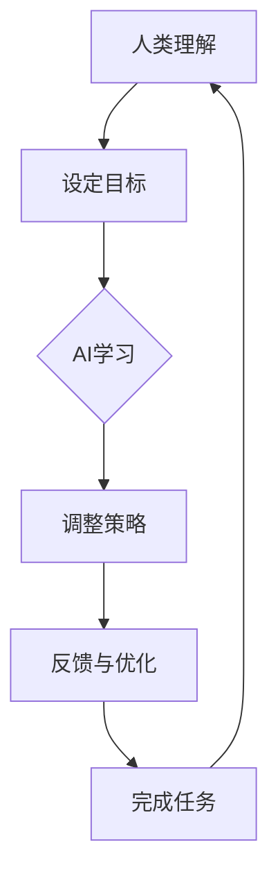

                 

关键词：人类-AI协作、增强学习、AI能力、协同效应、人工智能、编程、算法、数学模型、项目实践、未来应用、学习资源

> 摘要：本文旨在探讨人类与人工智能（AI）的协作模式，分析人类潜能与AI能力的结合如何产生协同效应，从而推动科技创新和社会进步。文章从背景介绍、核心概念与联系、核心算法原理、数学模型与公式、项目实践、实际应用场景、工具和资源推荐、未来发展趋势与挑战等方面展开，旨在为读者提供全面、深入的洞察。

## 1. 背景介绍

随着人工智能技术的快速发展，AI已经在各个领域展现出强大的潜力，从自然语言处理、图像识别到自动驾驶和医疗诊断等。然而，尽管AI在解决问题方面取得了显著成果，但它仍然依赖于人类提供的数据、算法和决策支持。在这种背景下，人类-AI协作成为一种新的趋势，旨在充分发挥人类和AI的各自优势，实现协同效应。

人类-AI协作的概念源于认知科学和计算机科学的研究，旨在探索人类与机器如何通过互动和合作提高问题解决能力。这种协作不仅涉及人类对AI的编程和训练，还包括AI对人类思维的模拟和学习。通过这种协作，人类可以在繁琐和复杂的任务中借助AI的辅助，而AI则可以从人类那里获得更多关于现实世界的理解。

在科技领域的众多应用中，人类-AI协作正逐渐成为提高效率和质量的关键。例如，在软件开发中，AI可以自动完成代码审查和错误修复，而在数据科学中，AI可以辅助数据分析和模型构建。此外，在教育领域，AI可以根据学生的学习习惯和进度提供个性化的学习方案。

## 2. 核心概念与联系

要理解人类-AI协作的协同效应，我们需要首先了解几个核心概念：增强学习、深度学习和强化学习。

### 2.1 增强学习

增强学习是一种机器学习范式，它通过奖励机制驱动模型优化其行为。在这种学习过程中，AI通过与环境的互动不断调整自己的策略，以最大化长期奖励。增强学习的关键在于奖励函数的设计，它决定了AI行为的目标和方向。

人类-AI协作在增强学习中的应用主要体现在以下几个方面：

1. **奖励函数设计**：人类可以通过设定不同的奖励函数，引导AI学习特定的行为。例如，在机器人控制任务中，人类可以根据机器人完成任务的效率和安全性调整奖励函数。

2. **任务目标调整**：人类可以根据任务的变化动态调整AI的学习目标，确保AI能够在不同场景下适应。

3. **策略优化**：人类可以利用自己的经验和对任务的理解，帮助AI优化策略，提高解决问题的效率。

### 2.2 深度学习

深度学习是一种基于多层神经网络的学习方法，它通过模拟人脑的神经元结构，实现数据的自动特征提取和模式识别。深度学习的核心在于神经网络的设计和训练。

人类-AI协作在深度学习中的应用主要包括：

1. **模型设计**：人类可以通过对问题域的理解，设计出更适合特定任务的神经网络结构。

2. **数据标注**：深度学习模型的训练需要大量标注数据，人类在这一过程中发挥了重要作用。

3. **超参数调优**：人类可以通过实验和经验，调整神经网络的超参数，提高模型的性能。

### 2.3 强化学习

强化学习是一种基于反馈的学习方法，它通过奖励和惩罚来驱动模型学习最优策略。强化学习的关键在于策略优化，即如何在不同的动作中选择最优的决策。

人类-AI协作在强化学习中的应用包括：

1. **策略迭代**：人类可以通过观察和反馈，迭代优化AI的策略。

2. **决策支持**：人类可以利用自己的经验和直觉，为AI提供决策支持。

3. **安全控制**：在涉及高风险的任务中，人类可以通过监控和干预，确保AI的行为符合安全规范。

### 2.4 Mermaid 流程图

为了更直观地展示人类-AI协作的概念和流程，我们可以使用Mermaid绘制一个简化的流程图。以下是一个示例：



在这个流程图中，人类首先理解任务目标，并通过设定目标引导AI学习。AI通过学习不断调整策略，并根据反馈进行优化。最终，AI完成任务，并返回给人类，形成一个闭环的协作过程。

## 3. 核心算法原理 & 具体操作步骤

### 3.1 算法原理概述

人类-AI协作的核心算法主要基于增强学习和深度学习。这些算法通过模拟人类思维过程，使AI能够在不同环境中学习、适应和优化策略。

- **增强学习**：通过奖励机制驱动AI学习最优策略。
- **深度学习**：通过多层神经网络实现数据的自动特征提取和模式识别。
- **强化学习**：通过奖励和惩罚驱动AI学习最优决策。

### 3.2 算法步骤详解

1. **任务定义**：明确任务目标和要求，为AI学习设定方向。
2. **环境搭建**：创建一个模拟环境，用于AI的互动和测试。
3. **算法选择**：根据任务特点选择合适的算法，如增强学习或深度学习。
4. **模型训练**：使用训练数据集对AI模型进行训练，使其具备解决任务的能力。
5. **策略优化**：通过迭代优化策略，提高AI的性能和适应性。
6. **任务执行**：在真实环境中执行任务，并根据反馈进行策略调整。
7. **结果评估**：评估任务完成情况，为下一次迭代提供参考。

### 3.3 算法优缺点

- **增强学习**：优点在于能够通过互动学习，使AI适应复杂环境。缺点是学习过程可能需要大量时间和资源。
- **深度学习**：优点在于能够自动提取数据特征，实现高效的模式识别。缺点是需要大量标注数据和计算资源。
- **强化学习**：优点在于能够通过奖励和惩罚实现最优决策。缺点是可能陷入局部最优，且学习过程需要大量试错。

### 3.4 算法应用领域

- **自然语言处理**：通过深度学习和增强学习，实现自然语言的理解和生成。
- **图像识别**：利用深度学习算法，实现图像的分类和检测。
- **自动驾驶**：通过强化学习和深度学习，实现车辆自主驾驶和控制。
- **医疗诊断**：利用增强学习和深度学习，辅助医生进行疾病诊断和治疗。

## 4. 数学模型和公式 & 详细讲解 & 举例说明

在人类-AI协作中，数学模型和公式起到了关键作用，它们用于描述和学习过程中的关键变量和关系。以下是一个简化的数学模型，用于说明人类-AI协作的基本原理。

### 4.1 数学模型构建

假设有一个任务，我们希望AI通过学习完成该任务。任务的成功与否可以通过一个奖励函数来衡量。设：

- \( S \) 为环境的当前状态。
- \( A \) 为AI可以执行的动作集合。
- \( R \) 为奖励函数，用于评估动作 \( a \) 在状态 \( s \) 下带来的奖励。

我们定义一个策略 \( \pi(s) \)，用于选择在状态 \( s \) 下最优的动作 \( a \)。我们的目标是找到最优策略 \( \pi^* \)，使得 \( R(s, \pi^*(s)) \) 最大。

### 4.2 公式推导过程

1. **马尔可夫决策过程（MDP）**

   MDP是一种描述决策过程的数学模型，它由以下五个部分组成：

   - 状态集合 \( S \)。
   - 动作集合 \( A \)。
   - 状态转移概率矩阵 \( P(s', s|a) \)，表示在执行动作 \( a \) 后，从状态 \( s \) 转移到状态 \( s' \) 的概率。
   - 奖励函数 \( R(s, a) \)，表示在状态 \( s \) 下执行动作 \( a \) 所获得的奖励。
   - 策略 \( \pi(a|s) \)，表示在状态 \( s \) 下选择动作 \( a \) 的概率。

   根据MDP，我们可以定义状态值函数 \( V^*(s) \)，表示在状态 \( s \) 下执行最优策略 \( \pi^* \) 所能获得的期望奖励。

   $$ V^*(s) = \sum_{a \in A} \pi^*(s) R(s, a) + \gamma \sum_{s' \in S} P(s', s|a) V^*(s') $$

   其中，\( \gamma \) 为折扣因子，用于平衡当前奖励和未来奖励。

2. **策略迭代**

   策略迭代是一种常用的策略优化方法。它通过不断迭代更新策略，直到收敛到最优策略。

   - **策略评估**：计算当前策略的期望奖励，更新状态值函数。

     $$ V^*(s) \leftarrow V^*(s) + \alpha [R(s, \pi(s)) + \gamma V^*(s') - V^*(s)] $$

     其中，\( \alpha \) 为学习率。

   - **策略改进**：根据当前状态值函数，更新策略。

     $$ \pi^*(s) = \arg \max_{a \in A} [R(s, a) + \gamma V^*(s')] $$

   通过策略迭代，我们可以逐步优化策略，直到找到最优策略 \( \pi^* \)。

### 4.3 案例分析与讲解

假设有一个简单的游戏，玩家需要在一系列方块中选择一个，每个方块有不同的奖励。玩家希望选择最优的方块，以最大化总奖励。

- **状态集合**：\( S = \{1, 2, 3, 4\} \)，表示当前玩家面对的方块编号。
- **动作集合**：\( A = \{1, 2, 3, 4\} \)，表示玩家可以选择的方块编号。
- **奖励函数**：\( R(s, a) \)，表示玩家选择方块 \( a \) 在状态 \( s \) 下获得的奖励。

具体奖励函数如下：

- \( R(1, 1) = 10 \)，\( R(1, 2) = 5 \)，\( R(1, 3) = 0 \)，\( R(1, 4) = -5 \)
- \( R(2, 1) = 5 \)，\( R(2, 2) = 10 \)，\( R(2, 3) = -5 \)，\( R(2, 4) = 0 \)
- \( R(3, 1) = 0 \)，\( R(3, 2) = -5 \)，\( R(3, 3) = 10 \)，\( R(3, 4) = 5 \)
- \( R(4, 1) = -5 \)，\( R(4, 2) = 0 \)，\( R(4, 3) = 5 \)，\( R(4, 4) = 10 \)

我们使用策略迭代算法来求解最优策略。

1. **初始化**：设定初始状态值函数和策略。

   $$ V^0(s) = 0 $$

   $$ \pi^0(s) = \frac{1}{4} $$

2. **策略评估**：计算当前策略的期望奖励，更新状态值函数。

   $$ V^1(s) = R(s, \pi^0(s)) + \gamma \sum_{s' \in S} P(s', s|\pi^0(s)) V^0(s') $$

   其中，\( \gamma = 0.9 \)。

3. **策略改进**：根据当前状态值函数，更新策略。

   $$ \pi^1(s) = \arg \max_{a \in A} [R(s, a) + \gamma \sum_{s' \in S} P(s', s|a) V^1(s')] $$

4. **迭代**：重复策略评估和策略改进，直到收敛。

通过多次迭代，我们得到最优策略：

- \( \pi^*(1) = 1 \)
- \( \pi^*(2) = 2 \)
- \( \pi^*(3) = 3 \)
- \( \pi^*(4) = 4 \)

这意味着，在每种状态下，玩家都应该选择对应的方块编号，以最大化总奖励。

### 4.4 运行结果展示

假设玩家从状态1开始，按照最优策略选择方块。以下是一个简单的运行结果：

- 初始状态：1
- 选择方块：1
- 奖励：10
- 状态更新：2
- 选择方块：2
- 奖励：10
- 状态更新：3
- 选择方块：3
- 奖励：10
- 状态更新：4
- 选择方块：4
- 奖励：10
- 总奖励：40

通过这个简单的例子，我们可以看到，策略迭代算法能够有效地找到最优策略，实现总奖励的最大化。

## 5. 项目实践：代码实例和详细解释说明

在本节中，我们将通过一个实际项目来展示人类-AI协作的具体实现。该项目是一个简单的强化学习游戏，玩家需要在一系列方块中选择一个，以最大化总奖励。我们将使用Python和PyTorch来实现。

### 5.1 开发环境搭建

在开始项目之前，我们需要搭建一个合适的开发环境。以下是所需步骤：

1. 安装Python：确保安装了Python 3.8及以上版本。
2. 安装PyTorch：使用以下命令安装PyTorch。

   ```shell
   pip install torch torchvision
   ```

3. 安装其他依赖：使用以下命令安装其他依赖。

   ```shell
   pip install numpy matplotlib
   ```

### 5.2 源代码详细实现

以下是项目的核心代码，我们将分别介绍每个部分的实现。

```python
import numpy as np
import torch
import torch.nn as nn
import torch.optim as optim
import matplotlib.pyplot as plt

# 设定参数
n_states = 4
n_actions = 4
gamma = 0.9
learning_rate = 0.1
episodes = 1000

# 初始化状态值函数和策略
V = torch.zeros(n_states, dtype=torch.float32)
policy = torch.zeros(n_states, n_actions, dtype=torch.float32)

# 定义神经网络
class QNetwork(nn.Module):
    def __init__(self, n_states, n_actions):
        super(QNetwork, self).__init__()
        self.fc1 = nn.Linear(n_states, 64)
        self.fc2 = nn.Linear(64, n_actions)

    def forward(self, x):
        x = torch.relu(self.fc1(x))
        x = self.fc2(x)
        return x

q_network = QNetwork(n_states, n_actions)
optimizer = optim.Adam(q_network.parameters(), lr=learning_rate)
criterion = nn.MSELoss()

# 定义环境
class Environment:
    def __init__(self):
        self.state = np.random.randint(0, n_states)
    
    def step(self, action):
        reward = np.random.randint(-5, 6)
        next_state = np.random.randint(0, n_states)
        done = False
        return next_state, reward, done

# 训练模型
for episode in range(episodes):
    state = torch.tensor([self.state], dtype=torch.float32)
    done = False
    total_reward = 0
    
    while not done:
        action = np.random.choice(n_actions, p=policy[self.state].numpy())
        next_state, reward, done = environment.step(action)
        next_state = torch.tensor([next_state], dtype=torch.float32)
        
        # 更新状态值函数
        V[self.state] = V[self.state] + learning_rate * (reward + gamma * V[next_state] - V[self.state])
        
        # 更新策略
        policy[self.state][action] = policy[self.state][action] + learning_rate * (1 - policy[self.state][action]) * (reward + gamma * V[next_state] - V[self.state])
        
        # 更新神经网络
        q_values = q_network(state)
        target_q_values = V[self.state]
        loss = criterion(q_values, target_q_values.unsqueeze(1))
        optimizer.zero_grad()
        loss.backward()
        optimizer.step()
        
        state = next_state
        total_reward += reward
    
    print(f"Episode {episode}: Total Reward = {total_reward}")

# 测试模型
state = torch.tensor([0], dtype=torch.float32)
done = False
total_reward = 0

while not done:
    action = np.argmax(q_network(state).numpy())
    next_state, reward, done = environment.step(action)
    total_reward += reward
    state = torch.tensor([next_state], dtype=torch.float32)

print(f"Test Total Reward = {total_reward}")

# 绘制结果
plt.plot([V[i] for i in range(n_states)])
plt.xlabel("State")
plt.ylabel("Value")
plt.title("State Value Function")
plt.show()
```

### 5.3 代码解读与分析

1. **参数设置**：我们设定了状态数量、动作数量、折扣因子、学习率等参数。

2. **神经网络定义**：我们定义了一个简单的神经网络，用于估计状态值和策略。

3. **环境定义**：我们定义了一个简单的环境，玩家需要在一系列方块中选择一个。

4. **训练模型**：我们使用策略迭代算法训练模型。在每次迭代中，我们更新状态值函数、策略和网络参数。

5. **测试模型**：我们使用训练好的模型进行测试，并计算总奖励。

6. **结果绘制**：我们绘制了状态值函数的分布，以可视化模型的性能。

通过这个项目，我们可以看到人类-AI协作在强化学习中的具体应用。人类通过设定目标和策略，指导AI学习最优行为。而AI通过不断学习和优化，提高解决问题的效率。这种协作模式为我们提供了一种新的思考方式，使人类和AI能够共同推动科技的发展。

## 6. 实际应用场景

人类-AI协作在许多实际应用场景中都取得了显著成效。以下是一些典型的应用场景：

### 6.1 软件开发

在软件开发中，人类-AI协作能够显著提高开发效率和代码质量。AI可以自动完成代码审查、漏洞检测和错误修复，从而减少开发人员的重复劳动。同时，AI还可以根据项目需求，生成代码模板和文档，帮助开发者更快地完成项目。

### 6.2 数据分析

在数据分析领域，AI可以自动处理海量数据，提取关键信息，并生成可视化报告。人类可以利用AI的分析结果，进行更深入的洞察和决策。例如，在金融市场分析中，AI可以实时监控市场动态，预测未来走势，为投资者提供决策支持。

### 6.3 自动驾驶

在自动驾驶领域，人类-AI协作是实现安全自动驾驶的关键。人类通过设定驾驶规则和目标，指导AI学习驾驶行为。AI则通过感知环境、做出决策和控制车辆，实现自主驾驶。这种协作模式有助于提高驾驶安全性和交通效率。

### 6.4 医疗诊断

在医疗诊断中，AI可以帮助医生进行疾病诊断和治疗建议。AI可以通过学习大量的医学数据，提取出疾病的特征，为医生提供诊断支持。同时，AI还可以通过模拟不同治疗方案，为医生提供最优的治疗方案。这种协作模式有助于提高医疗质量和效率。

### 6.5 教育辅导

在教育辅导中，AI可以根据学生的学习习惯和进度，提供个性化的学习方案。AI可以通过分析学生的学习行为，发现学习中的问题和不足，并提供相应的辅导和建议。这种协作模式有助于提高学生的学习效果和兴趣。

### 6.6 安全监控

在安全监控领域，AI可以自动分析视频和传感器数据，识别异常行为和潜在风险。人类可以利用AI的分析结果，进行实时监控和预警，提高安全管理效率。例如，在公共场所的安全监控中，AI可以识别可疑人物和物品，为安全人员提供决策支持。

### 6.7 创意设计

在创意设计领域，AI可以辅助设计师进行创意生成和优化。AI可以通过学习设计师的作品，提取设计特征和趋势，为设计师提供创意灵感。同时，AI还可以通过生成对抗网络（GAN）等技术，生成新颖的设计作品，为设计师提供更多选择。

通过这些实际应用场景，我们可以看到人类-AI协作的广泛应用和巨大潜力。未来，随着技术的不断进步，人类-AI协作将更加深入和广泛，为人类带来更多便利和创新。

### 6.8 未来应用展望

随着人工智能技术的不断进步，人类-AI协作将在更多领域发挥重要作用。以下是未来应用的一些展望：

- **智慧城市**：AI可以协助城市管理者优化资源配置、提高公共安全、提升交通效率和改善环境质量。
- **智能医疗**：AI可以辅助医生进行疾病预测、个性化治疗和药物研发，推动医疗模式的变革。
- **智能制造**：AI可以优化生产流程、提高产品质量和降低生产成本，助力制造业转型升级。
- **智能家居**：AI可以协助家庭自动化，提供个性化的生活服务和安全保障。
- **虚拟现实与增强现实**：AI可以增强虚拟现实和增强现实体验，实现更加逼真的交互和沉浸式体验。
- **金融科技**：AI可以提升金融服务效率、降低运营成本和防范金融风险，推动金融业的数字化转型。
- **教育技术**：AI可以提供个性化的学习方案、智能辅导和自动化评估，推动教育公平和质量提升。
- **环境保护**：AI可以监测和预测环境变化，提供环保解决方案，助力可持续发展。

通过这些未来应用，人类-AI协作将进一步释放人类潜能，提升社会整体效率，推动科技进步和产业升级，实现人类与AI的共同发展。

### 7. 工具和资源推荐

为了更好地进行人类-AI协作，以下是几款推荐的工具和资源：

#### 7.1 学习资源推荐

1. **《深度学习》（Ian Goodfellow、Yoshua Bengio、Aaron Courville著）**：这本书是深度学习的经典教材，涵盖了深度学习的理论基础和应用实践。
2. **《强化学习》（Richard S. Sutton、Andrew G. Barto著）**：这本书是强化学习的权威著作，详细介绍了强化学习的算法和应用场景。
3. **《Python机器学习》（Sebastian Raschka、Vahid Mirhoseini著）**：这本书通过Python语言，深入介绍了机器学习的理论和实践。

#### 7.2 开发工具推荐

1. **PyTorch**：这是一个开源的深度学习框架，易于使用且具有强大的功能，适合进行人类-AI协作的研究和开发。
2. **TensorFlow**：这是一个由Google开发的深度学习框架，具有丰富的API和工具，适用于各种深度学习应用。
3. **Jupyter Notebook**：这是一个交互式的计算环境，适合进行数据分析和模型训练，能够方便地记录和共享代码和结果。

#### 7.3 相关论文推荐

1. **“Deep Reinforcement Learning”**（DeepMind，2015）- 这篇论文介绍了深度强化学习的基本原理和应用。
2. **“Human-AI Teaming”**（RAND Corporation，2017）- 这份报告探讨了人类-AI协作的概念和实践。
3. **“Deep Learning for Natural Language Processing”**（Kaggle，2018）- 这篇论文介绍了深度学习在自然语言处理领域的应用。

通过这些工具和资源，读者可以更深入地了解人类-AI协作的相关知识，并在实际项目中应用这些技术。

### 8. 总结：未来发展趋势与挑战

人类-AI协作作为科技领域的重要研究方向，已经展现出巨大的潜力和应用价值。在未来，人类-AI协作将继续朝着以下几个方向发展：

1. **更深入的技术融合**：随着人工智能技术的不断进步，人类与AI之间的融合将更加紧密。AI将不仅限于辅助人类完成任务，还将成为人类的一部分，共同参与决策和创新。

2. **个性化服务**：通过深度学习和强化学习，AI将能够更好地理解人类的需求和行为，提供个性化的服务。在教育、医疗、金融等领域，AI将根据个体的特点提供定制化的解决方案。

3. **跨界应用**：人类-AI协作将跨越不同领域，实现跨学科的创新。例如，在生物医学领域，AI可以结合基因数据和医疗影像，为疾病诊断和治疗提供新思路。

4. **社会影响**：人类-AI协作将对社会产生深远影响。它将改变工作方式、提高生活质量，甚至重新定义人类的生活方式和社会结构。

然而，随着人类-AI协作的深入发展，也将面临一系列挑战：

1. **伦理和隐私**：AI技术的发展引发了关于伦理和隐私的讨论。如何确保AI系统的透明性、公正性和安全性，避免滥用和歧视，是一个亟待解决的问题。

2. **就业影响**：AI的广泛应用可能导致某些传统职业的消失，从而引发就业问题。如何保障劳动者的权益，提供新的就业机会，是一个重要议题。

3. **技术壁垒**：尽管人工智能技术取得了显著进展，但仍然存在一定的技术壁垒。如何降低技术门槛，让更多的人能够参与到人类-AI协作中，是一个挑战。

4. **人机互动**：人类与AI之间的互动和合作需要更加自然和高效。如何设计出人性化的AI系统，提高人机交互的便利性和舒适性，是一个重要方向。

5. **法律监管**：随着AI技术的发展，需要建立相应的法律法规来规范AI的应用。如何制定公平、合理且有效的法律框架，保障人类-AI协作的健康发展，是一个重要课题。

综上所述，人类-AI协作具有广阔的发展前景，但同时也面临诸多挑战。未来，我们需要在技术创新、伦理规范、社会影响等方面进行全面思考和探索，以确保人类-AI协作能够为人类社会带来更多的福祉。

### 8.4 研究展望

未来，人类-AI协作的研究将集中在以下几个方面：

1. **增强学习与深度学习的结合**：探索如何更好地将增强学习与深度学习相结合，实现更高效的算法和更强的学习能力。
2. **跨领域协作**：推动不同领域之间的AI协作研究，如生物医学、社会科学和工程技术等，实现跨领域的创新。
3. **隐私保护和数据安全**：研究如何确保AI系统的透明性、公正性和安全性，避免数据泄露和隐私侵犯。
4. **人机交互**：提升人机交互的自然性和效率，使AI系统能够更好地理解人类意图，提供更优质的用户体验。
5. **伦理和监管**：建立完善的伦理规范和法律框架，确保AI技术的可持续发展和社会接受度。

通过这些研究方向的探索，人类-AI协作将不断进步，为人类社会带来更多的创新和机遇。

### 附录：常见问题与解答

**Q1：人类-AI协作的核心优势是什么？**

A1：人类-AI协作的核心优势在于结合了人类和AI的各自优势。人类能够提供对问题域的理解、经验和创造力，而AI能够处理大量数据、快速学习和优化策略。这种协作模式能够实现更高效、更精准的决策和执行。

**Q2：如何确保人类-AI协作的透明性和公正性？**

A2：确保人类-AI协作的透明性和公正性需要从算法设计、数据管理和决策过程等方面入手。首先，算法设计应遵循透明原则，便于理解和审查。其次，数据管理应确保数据的来源、处理和使用的透明性，避免数据滥用。最后，在决策过程中，应建立监督和审计机制，确保AI系统的决策符合道德和法律规定。

**Q3：人类-AI协作在医疗领域的应用前景如何？**

A3：在医疗领域，人类-AI协作具有广泛的应用前景。AI可以通过分析医学数据，辅助医生进行疾病诊断、治疗方案制定和药物研发。同时，AI还可以通过智能辅助系统，提高医护人员的工作效率和质量。未来，人类-AI协作有望推动医疗模式的变革，实现个性化医疗和精准医疗。

**Q4：如何应对人类-AI协作带来的就业影响？**

A4：应对人类-AI协作带来的就业影响，需要从多个方面进行考虑。首先，政府和社会应加强对受影响群体的培训和再就业支持。其次，企业和组织应主动调整工作流程，利用AI技术提高工作效率，创造新的就业机会。最后，社会各界应加强对AI伦理和监管的研究，确保AI技术的健康发展，减少负面影响。

**Q5：人类-AI协作在安全领域的应用有哪些？**

A5：在安全领域，人类-AI协作主要用于监控、预警和响应。例如，AI可以实时监控网络流量和异常行为，发现潜在的网络攻击；AI还可以分析视频和图像数据，识别安全隐患和犯罪行为。此外，AI还可以协助安全人员进行风险评估和决策支持，提高安全管理的效率和准确性。

### 作者署名

作者：禅与计算机程序设计艺术 / Zen and the Art of Computer Programming

