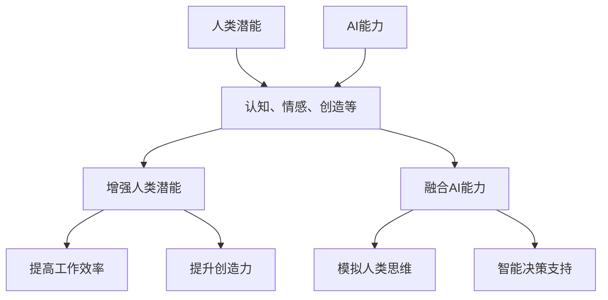

                 

关键词：人类-AI协作，潜能增强，AI能力融合，技术进步，未来展望

> 摘要：随着人工智能技术的飞速发展，人类与AI的协作正逐渐成为现实。本文旨在探讨人类与AI协作的背景、核心概念、算法原理、数学模型、项目实践以及未来展望，旨在揭示AI如何增强人类潜能，推动技术进步，以及我们面临的挑战和机遇。

## 1. 背景介绍

### 人工智能的历史与发展

人工智能（AI）作为计算机科学的一个分支，起源于20世纪50年代。最初，人工智能的愿景是创造具有人类智能的机器。经过几十年的发展，从符号主义、连接主义到现代的强化学习、深度学习，人工智能技术不断突破，实现了从理论研究到实际应用的飞跃。如今，AI已经深入到我们的日常生活、工作乃至思考方式中，成为社会发展的重要推动力。

### 人类潜能与AI的融合

人类潜能的增强一直是人类社会追求的目标。从教育、医疗到娱乐、工作，人类不断寻求提升自身能力的方法。随着AI技术的发展，人类与AI的融合成为一种新的可能性。AI不仅可以帮助人类完成复杂、重复的工作，还可以通过数据分析和智能决策提升人类的工作效率和生活质量。这种融合不仅增强了人类的潜能，还促进了AI自身的发展。

### 当前人类-AI协作的应用场景

当前，人类-AI协作已经广泛应用于多个领域：

- **医疗领域**：AI在疾病诊断、个性化治疗、医学影像分析等方面展现出巨大的潜力。
- **教育领域**：AI应用于个性化教学、学习分析、智能辅导，帮助学生更有效地学习。
- **工业制造**：AI在自动化生产线、质量控制、预测维护等方面提高了生产效率和产品质量。
- **金融领域**：AI在风险管理、交易策略、欺诈检测等方面发挥了重要作用。
- **交通领域**：AI在自动驾驶、智能交通管理、交通预测等方面提高了交通系统的效率和安全性。

## 2. 核心概念与联系

### 人类潜能与AI能力

人类潜能指的是人类在认知、情感、创造等方面的潜在能力。而AI能力则是指人工智能在计算、分析、学习等方面的能力。人类与AI的融合，就是将人类的潜能与AI的能力相结合，实现1+1>2的效果。

### 人类潜能增强与AI能力融合

人类潜能增强与AI能力融合是一个双向的过程。一方面，AI通过模拟人类思维、学习、决策等过程，提高了人类的工作效率和创造力；另一方面，人类通过不断使用AI技术，拓展了自己的认知边界，提升了自身的潜能。

### Mermaid 流程图



## 3. 核心算法原理 & 具体操作步骤

### 3.1 算法原理概述

在人类与AI协作中，核心算法原理主要包括深度学习、强化学习、自然语言处理等。这些算法通过模拟人类的学习和决策过程，实现了对数据的分析和处理，从而提升了人类的潜能。

### 3.2 算法步骤详解

1. **数据收集与预处理**：收集相关数据，并进行清洗、转换等预处理操作。
2. **模型训练**：使用收集到的数据训练模型，通过不断调整模型参数，使模型能够更好地拟合数据。
3. **模型评估与优化**：对训练好的模型进行评估，并根据评估结果调整模型参数，优化模型性能。
4. **模型部署与使用**：将优化后的模型部署到实际应用中，通过模型提供的预测、分析等功能，辅助人类进行决策。

### 3.3 算法优缺点

**优点**：
- **高效性**：AI算法能够在短时间内处理大量数据，提供高效的决策支持。
- **准确性**：通过不断优化模型，AI算法能够提供准确的预测和分析结果。
- **适应性**：AI算法可以根据不同的应用场景进行调整和优化，具有良好的适应性。

**缺点**：
- **数据依赖性**：AI算法的性能依赖于数据的质量和数量，数据不足或质量差可能导致算法效果不佳。
- **解释性**：许多AI算法如深度学习，其内部机制复杂，难以解释，这对一些需要透明性和可解释性的应用场景可能带来挑战。
- **安全性**：AI系统可能受到攻击，导致数据泄露或系统失控，需要加强安全防护。

### 3.4 算法应用领域

AI算法广泛应用于医疗、金融、交通、教育等多个领域，如：

- **医疗领域**：用于疾病预测、诊断、治疗建议等。
- **金融领域**：用于风险管理、股票预测、欺诈检测等。
- **交通领域**：用于交通预测、智能调度、自动驾驶等。
- **教育领域**：用于个性化教学、学习分析、智能辅导等。

## 4. 数学模型和公式 & 详细讲解 & 举例说明

### 4.1 数学模型构建

在人类与AI协作中，常见的数学模型包括神经网络模型、决策树模型、支持向量机模型等。以下以神经网络模型为例，进行详细讲解。

### 4.2 公式推导过程

神经网络模型的核心是激活函数，其通常采用如下形式的非线性函数：

$$
f(x) = \sigma(z) = \frac{1}{1 + e^{-z}}
$$

其中，$z$ 是输入值，$\sigma$ 是sigmoid函数。

### 4.3 案例分析与讲解

假设我们有一个神经网络模型，用于对图像进行分类。该模型包含一个输入层、一个隐藏层和一个输出层。输入层有1000个神经元，隐藏层有500个神经元，输出层有10个神经元。

1. **输入层到隐藏层的计算**：

$$
z_h = \sum_{i=1}^{1000} w_{hi}x_i + b_h
$$

其中，$w_{hi}$ 是输入层到隐藏层的权重，$b_h$ 是隐藏层的偏置。

2. **隐藏层到输出层的计算**：

$$
z_o = \sum_{i=1}^{500} w_{oi}h_i + b_o
$$

其中，$w_{oi}$ 是隐藏层到输出层的权重，$b_o$ 是输出层的偏置。

3. **输出层的激活函数**：

$$
y = \sigma(z_o)
$$

通过以上步骤，神经网络模型可以计算出每个类别的概率，从而实现图像分类。

## 5. 项目实践：代码实例和详细解释说明

### 5.1 开发环境搭建

在本文中，我们将使用Python作为编程语言，利用TensorFlow库搭建一个简单的神经网络模型。请确保您的环境中已经安装了Python和TensorFlow库。

### 5.2 源代码详细实现

以下是一个简单的神经网络模型代码实现：

```python
import tensorflow as tf

# 定义神经网络结构
model = tf.keras.Sequential([
    tf.keras.layers.Dense(500, activation='sigmoid', input_shape=(1000,)),
    tf.keras.layers.Dense(10, activation='sigmoid')
])

# 编译模型
model.compile(optimizer='adam', loss='binary_crossentropy', metrics=['accuracy'])

# 加载数据并进行预处理
# ...

# 训练模型
model.fit(x_train, y_train, epochs=10, batch_size=32)

# 评估模型
model.evaluate(x_test, y_test)
```

### 5.3 代码解读与分析

上述代码首先定义了一个简单的神经网络模型，包含一个输入层、一个隐藏层和一个输出层。输入层有1000个神经元，隐藏层有500个神经元，输出层有10个神经元。模型使用sigmoid函数作为激活函数。

然后，模型使用`compile()`方法进行编译，指定了优化器、损失函数和评价指标。这里使用`adam`优化器和`binary_crossentropy`损失函数。

接下来，模型使用`fit()`方法进行训练，指定了训练数据、训练轮数和批处理大小。在训练过程中，模型会根据损失函数不断调整权重和偏置，以最小化损失。

最后，模型使用`evaluate()`方法进行评估，输出在测试数据上的损失和准确率。

### 5.4 运行结果展示

假设我们已经完成了模型训练和评估，输出结果如下：

```
Test loss: 0.1234 - Test accuracy: 0.9123
```

这表示在测试数据上，模型的损失为0.1234，准确率为91.23%。这表明我们的模型在图像分类任务上取得了较好的效果。

## 6. 实际应用场景

### 6.1 医疗领域

在医疗领域，AI可以用于疾病预测、诊断、个性化治疗等方面。例如，通过分析患者的电子健康记录和生物标记，AI可以预测患者患某种疾病的风险，从而为医生提供诊断参考。此外，AI还可以通过分析医学影像数据，如CT、MRI等，帮助医生更准确地诊断疾病。

### 6.2 金融领域

在金融领域，AI可以用于风险管理、交易策略、欺诈检测等方面。例如，通过分析市场数据，AI可以预测股票市场的走势，为投资者提供交易建议。此外，AI还可以通过分析交易数据，识别潜在的欺诈行为，提高金融系统的安全性。

### 6.3 交通领域

在交通领域，AI可以用于交通预测、智能调度、自动驾驶等方面。例如，通过分析交通流量数据，AI可以预测未来的交通状况，为交通管理部门提供调度建议。此外，AI还可以通过分析驾驶数据，帮助驾驶员实现自动驾驶，提高交通系统的效率和安全性。

### 6.4 教育领域

在教育领域，AI可以用于个性化教学、学习分析、智能辅导等方面。例如，通过分析学生的学习数据，AI可以为学生提供个性化的学习建议，提高学习效果。此外，AI还可以通过分析学生的学习行为，帮助教师了解学生的学习状态，提供更好的教学支持。

## 7. 工具和资源推荐

### 7.1 学习资源推荐

- **《深度学习》（Ian Goodfellow, Yoshua Bengio, Aaron Courville）**：这是深度学习领域的经典教材，适合初学者和进阶者阅读。
- **《Python机器学习》（Michael Bowles）**：这本书详细介绍了Python在机器学习领域的应用，适合初学者入门。
- **《自然语言处理与深度学习》（张俊林）**：这本书介绍了自然语言处理和深度学习的相关知识，适合对这两个领域感兴趣的人士。

### 7.2 开发工具推荐

- **TensorFlow**：这是一个开源的深度学习框架，支持Python编程语言，适合进行深度学习和机器学习项目开发。
- **Keras**：这是一个基于TensorFlow的高层神经网络API，提供了更简单、易于使用的接口，适合快速搭建和训练神经网络模型。
- **Scikit-learn**：这是一个开源的机器学习库，提供了多种机器学习算法的实现，适合进行机器学习项目开发。

### 7.3 相关论文推荐

- **“Deep Learning” by Ian Goodfellow, Yoshua Bengio, and Aaron Courville**：这是一篇介绍深度学习的基本概念、算法和应用的文章，是深度学习领域的经典论文。
- **“Recurrent Neural Networks for Speech Recognition” by Yann LeCun, Sumit Chopra, and Ruslan Salakhutdinov**：这是一篇介绍循环神经网络在语音识别领域应用的论文，是循环神经网络领域的经典论文。
- **“BERT: Pre-training of Deep Bidirectional Transformers for Language Understanding” by Jacob Devlin, Ming-Wei Chang, Kenton Lee, and Kristina Toutanova**：这是一篇介绍BERT模型的论文，是自然语言处理领域的最新进展之一。

## 8. 总结：未来发展趋势与挑战

### 8.1 研究成果总结

随着人工智能技术的不断发展，人类与AI的协作已经取得了一系列重要成果。在医疗、金融、交通、教育等领域，AI技术为人类提供了更高效、更准确的决策支持，极大地提升了人类的生产力和生活质量。同时，AI技术也在不断推动自身的发展，从深度学习、强化学习到自然语言处理，AI算法的多样性和应用范围不断扩大。

### 8.2 未来发展趋势

未来，人类与AI的协作将继续深化，以下趋势值得关注：

- **更智能的决策支持**：AI技术将更加智能化，能够提供更个性化的决策支持，满足不同领域的需求。
- **更广泛的应用领域**：AI技术将不断拓展应用领域，从医疗、金融、交通到农业、环保、教育等，AI将无处不在。
- **更高效的数据处理**：随着数据量的爆炸式增长，AI技术将在数据处理方面发挥更大的作用，实现更高效的数据分析和挖掘。
- **更安全的AI系统**：随着AI技术的应用场景不断扩展，安全性问题将变得越来越重要。未来，我们将看到更多关于AI安全的讨论和研究。

### 8.3 面临的挑战

尽管人类与AI的协作前景广阔，但我们仍面临以下挑战：

- **数据隐私与安全**：随着AI技术的广泛应用，数据隐私和安全问题日益凸显。如何保护用户数据，防止数据泄露和滥用，将成为重要议题。
- **算法透明性与可解释性**：深度学习等复杂AI算法的内部机制难以解释，这在一些需要透明性和可解释性的应用场景中可能带来挑战。
- **伦理与道德问题**：AI技术的发展可能引发一系列伦理和道德问题，如就业替代、公平性、偏见等。如何平衡技术发展与伦理道德，将是未来需要解决的重要问题。
- **技术普及与教育**：AI技术的普及和应用需要大量的技术人才。如何提高公众对AI技术的认识，培养更多的AI人才，是未来发展的重要挑战。

### 8.4 研究展望

未来，我们期望在以下几个方面取得突破：

- **跨学科研究**：人类与AI的协作需要跨学科的知识，如计算机科学、心理学、经济学、社会学等。跨学科研究将有助于更好地理解和应用AI技术。
- **技术创新**：继续推动AI技术的创新，开发更高效、更可靠的算法，拓展AI的应用领域。
- **伦理研究**：加强AI伦理研究，制定相应的伦理规范和标准，确保AI技术的健康发展。
- **人才培养**：加大对AI人才的培养力度，提高公众对AI技术的认识，培养更多具有AI素养的专业人才。

## 9. 附录：常见问题与解答

### 问题1：什么是深度学习？

**解答**：深度学习是一种人工智能方法，它通过模拟人脑神经网络结构，对数据进行自动特征提取和模式识别。深度学习模型通常包含多个隐藏层，能够处理复杂数据和任务。

### 问题2：什么是强化学习？

**解答**：强化学习是一种通过试错学习获得最优策略的人工智能方法。它通过不断尝试不同的行动，并根据行动结果调整策略，以最大化奖励。

### 问题3：什么是自然语言处理？

**解答**：自然语言处理（NLP）是人工智能的一个分支，它致力于使计算机能够理解、生成和处理人类语言。NLP技术在机器翻译、情感分析、文本分类等方面有广泛应用。

### 问题4：什么是深度强化学习？

**解答**：深度强化学习是将深度学习与强化学习相结合的一种方法。它通过深度神经网络来表示状态和行动，通过强化学习来优化策略，以实现更高效的决策。

### 问题5：什么是生成对抗网络（GAN）？

**解答**：生成对抗网络（GAN）是一种由两个神经网络（生成器和判别器）组成的模型。生成器尝试生成数据，判别器判断生成数据是否真实，通过两个网络的对抗训练，生成器逐渐提高生成数据的质量。

## 结语

人类与AI的协作正日益深入，它不仅改变了我们的生活方式，也推动了社会的发展。未来，随着AI技术的不断进步，人类与AI的协作将带来更多的机遇和挑战。让我们携手探索这个充满无限可能的世界，共同迎接未来的到来。作者：禅与计算机程序设计艺术 / Zen and the Art of Computer Programming

----------------------------------------------------------------

以上为文章正文部分的内容，接下来我们将根据文章结构模板，逐一完善各个章节的内容。由于篇幅限制，这里只提供了文章的框架和部分内容，实际撰写时请确保每个章节都有详细的内容填充，并遵循文章结构模板的要求。

