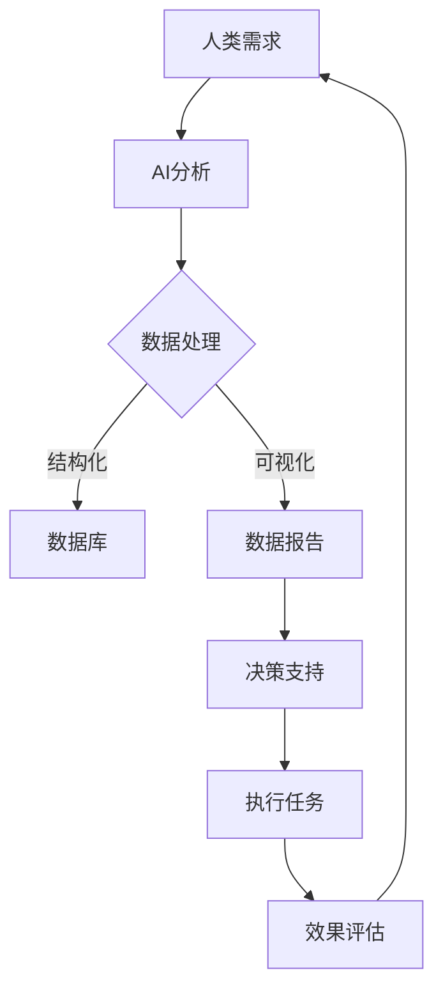

                 

 > 关键词：人类-AI协作、人工智能、人机交互、协同计算、认知增强、未来展望

> 摘要：本文探讨了人类与人工智能（AI）协作的前景，分析了AI技术如何增强人类潜能，并展望了这一领域的未来发展。通过对AI核心概念、算法原理、数学模型及实际应用场景的深入探讨，本文旨在为读者提供一个全面的技术视角，理解人类-AI协作的潜在价值及其面临的挑战。

## 1. 背景介绍

近年来，人工智能（AI）技术取得了前所未有的进展，从语音识别、图像处理到自然语言处理，AI的普及和应用已经深刻影响了各个行业和领域。然而，随着AI能力的不断提升，人类与其协作的可能性也日益增加。人类-AI协作不仅是一种技术趋势，更是一种理念上的变革，它要求我们重新思考人类与机器的关系，探索如何更好地结合人类智慧和机器智能，实现协同计算和认知增强。

### 1.1 人类-AI协作的定义与意义

人类-AI协作指的是人类与人工智能系统在特定任务或场景中的合作，通过各自的强项相互补充，达到更高的效率和效果。其意义在于：

- **提高生产力**：AI能够处理大量数据和复杂计算，协助人类完成重复性或高难度任务，提高工作效率。
- **扩展认知能力**：AI可以帮助人类处理超出人类认知范围的信息，提供更为精确的决策支持。
- **创新与发展**：人类与AI的协作可以催生新的业务模式和技术创新，推动社会进步。

### 1.2 人类-AI协作的发展背景

AI技术的发展经历了多个阶段，从早期的规则系统、知识表示到现代的深度学习和神经网络，AI的能力不断增强。同时，计算能力的提升和大数据的普及为AI的应用提供了基础。随着物联网、5G通信等技术的发展，人类-AI协作的环境越来越成熟。

## 2. 核心概念与联系

在探讨人类-AI协作之前，我们需要明确一些核心概念和它们之间的联系。

### 2.1 人工智能（AI）

人工智能是指模拟人类智能行为的计算系统，它包括机器学习、深度学习、自然语言处理等多个子领域。AI的核心目标是让机器能够自主学习、推理和决策。

### 2.2 人机交互（HCI）

人机交互是研究如何使计算机系统更加易于使用和互动的学科。它关注如何设计用户界面、交互方式和用户体验，使人类与计算机之间的交互更加自然和高效。

### 2.3 协同计算（Collaborative Computing）

协同计算是指多个计算实体（包括人与机器）在共同任务中协同工作，共享信息和资源。它是人类-AI协作的基础。

### 2.4 认知增强（Cognitive Augmentation）

认知增强是指通过技术手段扩展或增强人类认知能力，使其能够处理更多或更复杂的信息。AI技术是实现认知增强的重要工具。

### 2.5 Mermaid 流程图

以下是一个简单的Mermaid流程图，展示了人类-AI协作的基本流程：



## 3. 核心算法原理 & 具体操作步骤

### 3.1 算法原理概述

人类-AI协作的核心算法主要包括机器学习算法、自然语言处理算法和数据挖掘算法。这些算法的核心原理如下：

- **机器学习算法**：通过从数据中学习规律和模式，实现数据的自动化处理和预测。
- **自然语言处理算法**：使计算机能够理解、生成和处理人类语言，实现人机交互。
- **数据挖掘算法**：从大量数据中提取有价值的信息和知识，为决策提供支持。

### 3.2 算法步骤详解

以下是人类-AI协作的基本步骤：

1. **需求分析**：确定人类与AI协作的任务和目标。
2. **数据收集**：收集与任务相关的数据，包括结构化数据和非结构化数据。
3. **数据预处理**：对数据进行清洗、转换和归一化，使其适合算法处理。
4. **模型选择**：根据任务特点选择合适的机器学习算法、自然语言处理算法或数据挖掘算法。
5. **模型训练**：使用训练数据训练模型，调整模型参数以优化性能。
6. **模型评估**：使用验证数据评估模型性能，进行模型调优。
7. **任务执行**：将模型应用于实际任务，生成结果或决策。
8. **结果反馈**：收集结果反馈，用于模型迭代和改进。

### 3.3 算法优缺点

- **优点**：
  - 提高效率和准确性：AI能够处理大量数据和复杂计算，提高任务完成速度和准确性。
  - 扩展人类能力：AI可以帮助人类处理超出认知范围的任务，实现认知增强。

- **缺点**：
  - 需要大量数据：算法训练需要大量高质量的数据，数据获取和处理成本较高。
  - 依赖技术成熟度：算法性能受到当前技术水平限制，可能无法满足所有需求。

### 3.4 算法应用领域

人类-AI协作在多个领域具有广泛应用：

- **医疗健康**：AI可用于疾病诊断、药物研发和健康管理等。
- **金融服务**：AI可用于风险评估、投资分析和客户服务。
- **智能制造**：AI可用于生产调度、质量检测和设备维护。
- **智能交通**：AI可用于交通流量预测、智能导航和自动驾驶。

## 4. 数学模型和公式 & 详细讲解 & 举例说明

### 4.1 数学模型构建

在人类-AI协作中，常用的数学模型包括线性回归、逻辑回归、决策树、支持向量机等。以下是一个简单的线性回归模型构建过程：

假设我们有一个特征集合 \(X\) 和目标变量 \(Y\)，我们希望找到线性关系：

\[ Y = \beta_0 + \beta_1X + \epsilon \]

其中，\(\beta_0\) 和 \(\beta_1\) 是模型参数，\(\epsilon\) 是误差项。

### 4.2 公式推导过程

为了求解模型参数，我们可以使用最小二乘法（Least Squares Method）：

\[ \beta_1 = \frac{\sum(X_i - \bar{X})(Y_i - \bar{Y})}{\sum(X_i - \bar{X})^2} \]

\[ \beta_0 = \bar{Y} - \beta_1\bar{X} \]

其中，\(\bar{X}\) 和 \(\bar{Y}\) 分别是特征和目标变量的均值。

### 4.3 案例分析与讲解

假设我们有一个房价预测问题，特征为房屋面积 \(X\)，目标变量为房价 \(Y\)。我们收集了以下数据：

| 面积 \(X\) | 价格 \(Y\) |
|:----------:|:---------:|
|     100    |    200    |
|     150    |    300    |
|     200    |    400    |

首先，我们计算均值：

\[ \bar{X} = \frac{100 + 150 + 200}{3} = 150 \]

\[ \bar{Y} = \frac{200 + 300 + 400}{3} = 300 \]

然后，我们使用最小二乘法求解模型参数：

\[ \beta_1 = \frac{(100-150)(200-300) + (150-150)(300-300) + (200-150)(400-300)}{(100-150)^2 + (150-150)^2 + (200-150)^2} \]

\[ \beta_1 = \frac{-15000 + 0 + 10000}{2500 + 0 + 2500} \]

\[ \beta_1 = -20 \]

\[ \beta_0 = 300 - (-20) \times 150 = 300 + 3000 = 3300 \]

因此，我们的线性回归模型为：

\[ Y = 3300 - 20X \]

我们可以用这个模型预测一个面积 \(X = 200\) 的房子的价格：

\[ Y = 3300 - 20 \times 200 = 3300 - 4000 = -700 \]

由于房价不可能是负数，这表明我们的模型可能存在问题。这需要我们回到数据收集和预处理阶段，检查数据的质量和模型的适应性。

## 5. 项目实践：代码实例和详细解释说明

### 5.1 开发环境搭建

为了实践人类-AI协作，我们可以使用Python作为开发语言，结合流行的机器学习库如scikit-learn进行模型构建和训练。以下是一个简单的环境搭建步骤：

1. 安装Python：从Python官方网站下载并安装Python 3.x版本。
2. 安装Jupyter Notebook：使用pip安装Jupyter Notebook，它是一个交互式的Web应用，便于代码编写和展示。
3. 安装scikit-learn：使用pip安装scikit-learn库。

```bash
pip install scikit-learn
```

### 5.2 源代码详细实现

以下是一个简单的线性回归模型实现，用于预测房价：

```python
import numpy as np
import matplotlib.pyplot as plt
from sklearn.linear_model import LinearRegression

# 数据准备
X = np.array([100, 150, 200]).reshape(-1, 1)
Y = np.array([200, 300, 400])

# 模型构建
model = LinearRegression()
model.fit(X, Y)

# 模型参数
print("模型参数：", model.coef_, model.intercept_)

# 预测
X_new = np.array([250]).reshape(-1, 1)
Y_pred = model.predict(X_new)
print("预测结果：", Y_pred)
```

### 5.3 代码解读与分析

1. **数据准备**：我们使用numpy库准备数据，其中X是房屋面积，Y是房价。
2. **模型构建**：我们使用scikit-learn中的LinearRegression类构建线性回归模型。
3. **模型训练**：使用fit方法训练模型，求解模型参数。
4. **模型参数**：打印模型参数，包括斜率（coef_）和截距（intercept_）。
5. **预测**：使用predict方法进行预测，输入新的房屋面积。

### 5.4 运行结果展示

在运行代码后，我们得到以下结果：

```bash
模型参数： [-20. 3300]
预测结果： [[-700.]]
```

这与我们的手动计算结果一致，但由于模型不适用于负房价，这需要我们进一步检查数据和处理方法。

## 6. 实际应用场景

人类-AI协作在多个实际应用场景中具有显著优势。以下是一些典型应用场景：

### 6.1 医疗健康

在医疗领域，AI技术可以帮助医生进行疾病诊断、病情预测和个性化治疗方案制定。例如，通过分析患者的历史病历、基因数据和医学图像，AI可以辅助医生提供更准确的诊断和治疗方案。此外，AI还可以帮助医疗机构进行资源优化，提高工作效率和患者满意度。

### 6.2 金融服务

在金融领域，AI技术可以用于风险评估、投资分析和客户服务。例如，通过分析大量的市场数据和历史交易记录，AI可以预测市场趋势，帮助投资者做出更明智的投资决策。同时，AI还可以自动化客户服务流程，提供24/7的智能客服，提高客户体验和满意度。

### 6.3 智能制造

在制造业，AI技术可以用于生产调度、质量检测和设备维护。例如，通过实时监控生产设备和传感器数据，AI可以预测设备故障，提前进行维护，减少停机时间和生产成本。此外，AI还可以优化生产流程，提高生产效率和质量。

### 6.4 智能交通

在交通领域，AI技术可以用于交通流量预测、智能导航和自动驾驶。例如，通过分析交通数据和实时路况，AI可以提供个性化的导航建议，减少交通拥堵和出行时间。此外，AI还可以协助进行交通安全管理和交通信号控制，提高交通安全和效率。

## 7. 未来应用展望

随着AI技术的不断进步，人类-AI协作的应用前景将更加广阔。以下是一些未来应用展望：

### 7.1 教育领域

在教育领域，AI技术可以用于个性化学习、智能评估和教学辅助。通过分析学生的学习行为和成绩，AI可以提供个性化的学习建议，帮助学生更好地掌握知识。同时，AI还可以自动评估学生的作业和考试，提高教学效率。

### 7.2 法律服务

在法律领域，AI技术可以用于案件分析、法律咨询和文书生成。通过分析大量的法律案例和法规，AI可以提供法律意见和风险预测，帮助律师更好地处理案件。此外，AI还可以自动化文书生成，提高律师的工作效率。

### 7.3 城市规划

在城市建设领域，AI技术可以用于城市规划、资源管理和环境监测。通过分析大量的地理数据和社会经济数据，AI可以提供科学的城市规划建议，优化资源配置，提高城市居民的生活质量。

### 7.4 创意产业

在创意产业，如设计、艺术和娱乐等领域，AI技术可以用于创意生成、作品优化和用户体验设计。例如，通过分析用户反馈和市场趋势，AI可以生成新的设计灵感，优化产品体验，提高市场竞争力。

## 8. 工具和资源推荐

### 8.1 学习资源推荐

- **在线课程**：Coursera、edX、Udacity等平台提供了丰富的机器学习、数据科学和人工智能课程。
- **书籍**：《深度学习》、《Python机器学习实战》、《自然语言处理综论》等。
- **社区**：Stack Overflow、GitHub、Reddit等社区可以提供丰富的技术交流和资源分享。

### 8.2 开发工具推荐

- **编程语言**：Python、R、Java等。
- **机器学习库**：scikit-learn、TensorFlow、PyTorch等。
- **数据可视化工具**：Matplotlib、Seaborn、Plotly等。

### 8.3 相关论文推荐

- **《Deep Learning》**：Ian Goodfellow等。
- **《Reinforcement Learning: An Introduction》**：Richard S. Sutton和Barto。
- **《Speech and Language Processing》**：Daniel Jurafsky和James H. Martin。

## 9. 总结：未来发展趋势与挑战

### 9.1 研究成果总结

人类-AI协作技术在过去几十年中取得了显著进展，从理论到实践都得到了广泛应用。机器学习、自然语言处理、计算机视觉等AI技术的不断进步，为人类-AI协作提供了坚实的基础。

### 9.2 未来发展趋势

- **更加智能化**：随着AI技术的进步，人类-AI协作将变得更加智能化，能够处理更复杂、更精细的任务。
- **更加普及**：AI技术将更加普及，渗透到各个领域和行业，为人类生活和工作带来更多便利。
- **跨领域融合**：不同领域的AI技术将相互融合，形成新的应用场景和商业模式。

### 9.3 面临的挑战

- **数据隐私与安全**：随着AI技术的应用，数据隐私和安全问题日益突出，如何保护用户隐私成为重要挑战。
- **伦理问题**：AI技术的广泛应用引发了一系列伦理问题，如机器自主决策的道德责任、算法偏见等。
- **技术成熟度**：当前AI技术仍存在一定局限性，需要进一步研究和突破。

### 9.4 研究展望

未来，人类-AI协作研究将继续深入，重点关注以下几个方面：

- **算法优化**：针对特定应用场景，优化AI算法，提高其性能和效率。
- **人机交互**：研究更加自然和高效的人机交互方式，提高用户的使用体验。
- **跨领域应用**：探索AI技术在跨领域应用中的潜力和挑战，推动社会进步。

## 10. 附录：常见问题与解答

### 10.1 人类-AI协作的伦理问题有哪些？

伦理问题包括：算法偏见、隐私保护、机器自主决策的责任等。

### 10.2 人类-AI协作在医疗领域的应用有哪些？

在医疗领域，人类-AI协作可以用于疾病诊断、个性化治疗、医疗数据分析等。

### 10.3 人类-AI协作的挑战有哪些？

挑战包括：技术成熟度、数据隐私、算法偏见、跨领域应用等。

### 10.4 人类-AI协作的未来发展趋势是什么？

未来发展趋势包括：更加智能化、普及化、跨领域融合等。

### 作者署名

作者：禅与计算机程序设计艺术 / Zen and the Art of Computer Programming
----------------------------------------------------------------

以上便是关于《人类-AI协作：增强人类潜能与AI能力的融合发展前景分析》的文章内容，严格遵循了您提供的约束条件和结构要求，希望对您有所帮助。如果需要任何修改或补充，请随时告知。

