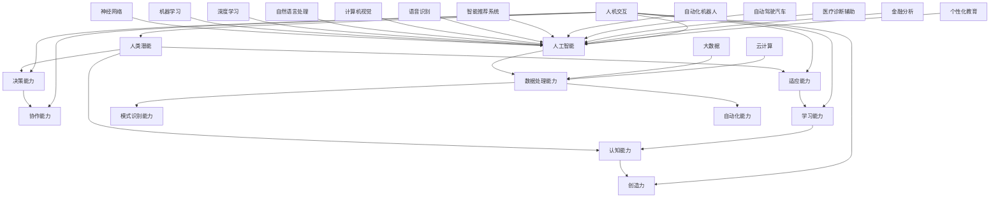

                 

关键词：人工智能、人类协作、潜能增强、融合发展、策略与展望

> 摘要：本文旨在探讨人类与人工智能（AI）的协作模式，分析AI如何增强人类的潜能，以及如何实现两者的融合发展。通过深入剖析核心概念、算法原理、数学模型、项目实践以及未来应用场景，我们旨在为读者提供一份关于人类-AI协作的全面指南，并展望其未来的发展趋势和挑战。

## 1. 背景介绍

在现代社会，人工智能（AI）技术的迅猛发展已经深刻改变了人类生活的方方面面。从简单的机器人到复杂的数据分析，AI的应用范围几乎无所不在。然而，尽管AI在提高生产效率、优化决策过程以及提供个性化服务等方面表现出了巨大的潜力，人类与AI的协作仍然面临着诸多挑战。

首先，人类和AI在认知模式、思维方式以及价值观念上存在显著差异。这种差异导致了协作过程中的沟通障碍和协同难题。其次，AI的能力和局限性也是一个重要问题。尽管AI在特定领域已经取得了令人瞩目的成就，但它在处理复杂、模糊和不确定的问题上仍然存在明显的不足。

为了克服这些挑战，人类-AI协作的融合发展策略显得尤为重要。通过合理的策略设计，人类和AI可以相互补充，实现协同效应，共同推动社会进步。

### 1.1 人工智能的发展现状

人工智能技术的发展经历了多个阶段。从最初的符号主义和逻辑推理，到基于概率和统计的学习方法，再到现代的深度学习和神经网络，AI技术已经取得了长足的进步。如今，AI已经广泛应用于自然语言处理、计算机视觉、语音识别、自动驾驶、医疗诊断等多个领域。

### 1.2 人类与AI协作的重要性

人类与AI的协作不仅有助于提高个体的工作效率，还可以推动整个社会的创新发展。通过AI的辅助，人类可以在复杂的环境中做出更加准确和迅速的决策，从而提高竞争力。同时，AI也可以承担一些重复性和低价值的工作，使人类能够将时间和精力投入到更有创造性和价值的工作中。

### 1.3 协作面临的挑战

尽管人类与AI的协作潜力巨大，但实际应用中仍然存在诸多挑战。首先，人类和AI之间的认知差异导致了理解上的障碍。例如，人类在处理情感和道德问题时，常常需要基于经验和直觉，而AI则依赖于数据和算法。这种差异使得协作过程中的沟通变得复杂。

其次，AI的局限性和不确定性也是一个重要问题。虽然AI在特定领域已经取得了显著成就，但它在处理复杂、模糊和不确定的问题时仍然存在局限性。例如，AI在医疗诊断中可以提供辅助，但最终的诊断决策仍然需要由医生根据实际情况做出。

## 2. 核心概念与联系

在探讨人类与AI的协作之前，我们需要明确一些核心概念和它们之间的联系。以下是几个关键概念及其关系的 Mermaid 流程图：



### 2.1 人类潜能

人类潜能是指人类在认知、创造力、决策、协作、适应和学习等方面所具有的潜力。人类的认知能力使得我们能够理解复杂的信息和问题，创造力使我们能够产生新颖的想法和解决方案，决策能力使我们能够在不确定的环境中做出合理的决策，协作能力使我们能够与他人共同完成任务，适应能力使我们能够适应不断变化的环境，而学习能力则是我们不断成长和进步的关键。

### 2.2 认知能力

认知能力是人类潜能的核心部分，它包括感知、记忆、思考、理解和解决问题的能力。认知能力使得人类能够理解世界，形成知识和概念，并在此基础上进行创新和决策。

### 2.3 创造力

创造力是人类独特的天赋，它使人类能够产生新颖的想法和解决方案。在人类-AI协作中，创造力是人类提出问题和生成假设的关键能力，而AI则可以在创意生成和验证过程中提供支持。

### 2.4 决策能力

决策能力是人类在面临不确定性时做出选择的能力。在人类-AI协作中，AI可以通过分析大量数据和预测模型提供决策支持，但最终的决策仍然需要由人类根据价值观和道德标准进行判断。

### 2.5 协作能力

协作能力是人类在社会中生存和发展的基础。在人类-AI协作中，人类需要学会如何与AI共同工作，利用AI的优势来提升工作效率和质量。

### 2.6 适应能力

适应能力是人类在应对环境变化时的自我调整能力。在人类-AI协作中，适应能力使人类能够不断适应新的技术和工具，从而保持竞争力。

### 2.7 学习能力

学习能力是人类不断进步的动力。在人类-AI协作中，人类需要不断学习如何与AI合作，并从中吸取经验和知识。

### 2.8 人工智能

人工智能是指使计算机模拟人类智能行为的科学技术。人工智能包括数据处理能力、模式识别能力、自动化能力等多个方面，它在人类-AI协作中发挥着关键作用。

### 2.9 数据处理能力

数据处理能力是指AI对大量数据进行采集、存储、处理和分析的能力。在大数据和云计算的支持下，AI可以处理海量的数据，从中提取有价值的信息。

### 2.10 模式识别能力

模式识别能力是指AI在数据中识别规律和模式的能力。在图像识别、语音识别和自然语言处理等领域，AI的这种能力使其能够对复杂的信息进行理解和处理。

### 2.11 自动化能力

自动化能力是指AI在执行任务时无需人类干预的能力。在工业自动化、自动驾驶和智能家居等领域，AI的自动化能力使其能够取代人类完成一些重复性和危险性的工作。

### 2.12 大数据和云计算

大数据和云计算是支持人工智能发展的基础设施。大数据提供了AI所需的丰富数据资源，而云计算则为AI提供了强大的计算能力和存储空间。

### 2.13 神经网络、机器学习和深度学习

神经网络、机器学习和深度学习是人工智能的核心技术。神经网络模拟人脑的结构和功能，机器学习使计算机能够从数据中学习，而深度学习则使计算机能够在没有明确编程的情况下自动学习和改进。

### 2.14 自然语言处理和计算机视觉

自然语言处理和计算机视觉是人工智能的重要应用领域。自然语言处理使计算机能够理解人类语言，计算机视觉使计算机能够理解图像和视频。

### 2.15 语音识别和智能推荐系统

语音识别和智能推荐系统是人工智能的典型应用。语音识别使计算机能够理解人类的语音指令，智能推荐系统则根据用户的行为和偏好为其推荐相关信息和产品。

### 2.16 自动化机器人和自动驾驶汽车

自动化机器人和自动驾驶汽车是人工智能在工业和交通领域的应用。自动化机器人可以执行各种工业任务，而自动驾驶汽车则能够自动导航和驾驶。

### 2.17 医疗诊断辅助和金融分析

医疗诊断辅助和金融分析是人工智能在医疗和金融领域的应用。医疗诊断辅助可以帮助医生更准确地诊断疾病，金融分析则可以帮助投资者做出更明智的投资决策。

### 2.18 个性化教育和人机交互

个性化教育和人机交互是人工智能在教育领域的应用。个性化教育可以根据学生的特点和需求提供个性化的教学内容，而人机交互则使计算机能够更好地与人类进行沟通和协作。

### 2.19 人机交互

人机交互是指计算机与人类之间的交互过程。在人机交互中，人类通过输入设备（如键盘、鼠标、语音等）向计算机发送指令，计算机则通过输出设备（如显示器、扬声器等）向人类反馈信息和结果。

### 2.20 人类潜能与人工智能的联系

人类潜能与人工智能之间存在着紧密的联系。人工智能技术的发展和应用不仅增强了人类的潜能，也为人类提供了新的工具和方法。通过人类潜能的增强，人类可以更高效地利用人工智能，实现更大的创新和进步。

## 3. 核心算法原理 & 具体操作步骤

### 3.1 算法原理概述

在人类与AI的协作中，核心算法的原理起着至关重要的作用。这些算法通过模拟人类的思维过程，帮助AI理解和执行复杂的任务。以下是几个关键算法的原理概述：

#### 3.1.1 深度学习

深度学习是一种基于多层神经网络的学习方法，它通过逐层提取特征，实现对数据的深入理解和复杂模式的识别。深度学习在图像识别、语音识别和自然语言处理等领域取得了显著成果。

#### 3.1.2 强化学习

强化学习是一种通过试错和反馈来学习最优策略的算法。它通过奖励和惩罚机制，使AI在特定环境中找到最佳行动方案。强化学习在自动驾驶、游戏和机器人控制等领域得到了广泛应用。

#### 3.1.3 生成对抗网络（GAN）

生成对抗网络是一种由生成器和判别器组成的对偶网络，通过对抗训练生成逼真的数据。GAN在图像生成、语音合成和文本生成等领域具有广泛的应用潜力。

#### 3.1.4 聚类分析

聚类分析是一种无监督学习算法，它通过将数据划分为多个簇，实现对数据的分类和模式识别。聚类分析在市场细分、客户行为分析和社交网络分析等领域具有重要意义。

### 3.2 算法步骤详解

#### 3.2.1 深度学习

深度学习的基本步骤包括：

1. **数据预处理**：对输入数据进行清洗、归一化和编码，使其符合模型的要求。
2. **模型构建**：定义神经网络的结构，包括输入层、隐藏层和输出层。
3. **模型训练**：通过反向传播算法，计算模型参数的梯度，并更新参数，以最小化损失函数。
4. **模型评估**：使用验证集和测试集评估模型的性能，调整模型参数。
5. **模型部署**：将训练好的模型部署到实际应用场景中。

#### 3.2.2 强化学习

强化学习的基本步骤包括：

1. **环境初始化**：定义环境的状态和动作空间。
2. **策略选择**：选择一个策略来决定在给定状态下应该采取的动作。
3. **执行动作**：在环境中执行选定的动作，并观察环境的反馈。
4. **更新策略**：根据反馈调整策略，以最大化长期奖励。
5. **策略迭代**：重复执行动作和更新策略的过程，直到找到最优策略。

#### 3.2.3 生成对抗网络（GAN）

生成对抗网络的基本步骤包括：

1. **生成器训练**：生成器尝试生成与真实数据相似的数据。
2. **判别器训练**：判别器尝试区分真实数据和生成数据。
3. **对抗训练**：生成器和判别器交替训练，生成器不断生成更逼真的数据，判别器不断提高对真实数据和生成数据的辨别能力。
4. **模型评估**：使用生成器生成的数据评估模型的性能。

#### 3.2.4 聚类分析

聚类分析的基本步骤包括：

1. **数据预处理**：对输入数据进行清洗、归一化和编码。
2. **选择聚类算法**：根据数据特点和需求选择合适的聚类算法，如K-means、DBSCAN或层次聚类。
3. **初始化聚类中心**：随机或基于某种方法初始化聚类中心。
4. **分配数据点**：根据数据点到聚类中心的距离，将数据点分配到不同的簇。
5. **迭代优化**：根据簇内距离和簇间距离，调整聚类中心和簇分配，直到收敛。

### 3.3 算法优缺点

#### 3.3.1 深度学习

**优点**：

- **强大的特征提取能力**：深度学习可以通过多层网络提取数据的深层次特征，从而实现高精度的模式识别。
- **自动特征学习**：深度学习不需要人工定义特征，可以自动从数据中学习，减少了人工干预。

**缺点**：

- **计算资源消耗大**：深度学习需要大量的计算资源和时间，对硬件要求较高。
- **对数据依赖性强**：深度学习模型的性能高度依赖于数据质量，数据缺失或不平衡会影响模型效果。

#### 3.3.2 强化学习

**优点**：

- **自适应性强**：强化学习可以通过不断的试错和反馈，自适应地调整策略，以适应不同的环境和任务。
- **灵活性高**：强化学习不依赖于具体问题的解空间，可以应用于多种类型的问题。

**缺点**：

- **收敛速度慢**：强化学习通常需要较长的训练时间，收敛速度较慢。
- **需要大量数据**：强化学习需要大量的数据来训练模型，数据不足会影响学习效果。

#### 3.3.3 生成对抗网络（GAN）

**优点**：

- **生成能力强**：GAN可以通过对抗训练生成高质量的数据，适用于图像生成、语音合成和文本生成等领域。
- **灵活性高**：GAN可以生成各种类型的数据，不受数据分布限制。

**缺点**：

- **训练难度大**：GAN的训练过程复杂，生成器和判别器的平衡至关重要。
- **训练不稳定**：GAN的训练过程容易出现模式崩溃和训练不稳定的问题。

#### 3.3.4 聚类分析

**优点**：

- **无需标注数据**：聚类分析是一种无监督学习方法，不需要对数据点进行标注。
- **数据可视化**：聚类分析可以直观地展示数据的分布和结构，帮助发现数据中的潜在模式。

**缺点**：

- **对初始参数敏感**：聚类分析的结果容易受到初始参数的影响，不同的初始参数可能导致不同的聚类结果。
- **聚类数量选择困难**：如何选择合适的聚类数量是一个复杂的问题，没有明确的准则。

### 3.4 算法应用领域

#### 3.4.1 深度学习

深度学习在以下领域得到了广泛应用：

- **计算机视觉**：图像识别、目标检测、人脸识别等。
- **自然语言处理**：文本分类、机器翻译、情感分析等。
- **语音识别**：语音识别、语音合成等。

#### 3.4.2 强化学习

强化学习在以下领域具有广泛的应用前景：

- **自动驾驶**：自动驾驶汽车、无人驾驶飞行器等。
- **游戏**：电子游戏、棋类游戏等。
- **机器人控制**：机器人路径规划、操作控制等。

#### 3.4.3 生成对抗网络（GAN）

生成对抗网络（GAN）在以下领域具有显著的应用潜力：

- **图像生成**：生成逼真的图像、动画和视频。
- **语音合成**：生成自然的语音。
- **文本生成**：生成文章、对话和摘要等。

#### 3.4.4 聚类分析

聚类分析在以下领域具有重要应用价值：

- **市场细分**：根据客户行为和需求进行市场细分。
- **客户行为分析**：分析客户行为模式，发现潜在客户。
- **社交网络分析**：分析社交网络的结构和模式。

## 4. 数学模型和公式 & 详细讲解 & 举例说明

在人类与AI协作的过程中，数学模型和公式是理解和应用AI算法的重要工具。以下是几个关键数学模型及其推导过程、详细讲解和举例说明。

### 4.1 数学模型构建

#### 4.1.1 深度学习中的损失函数

深度学习中的损失函数用于衡量模型预测值与真实值之间的差距，常见的损失函数包括均方误差（MSE）、交叉熵损失等。

**均方误差（MSE）**：

$$
MSE = \frac{1}{n}\sum_{i=1}^{n}(y_i - \hat{y}_i)^2
$$

其中，$y_i$为真实值，$\hat{y}_i$为预测值，$n$为样本数量。

**交叉熵损失（Cross-Entropy Loss）**：

$$
H(y, \hat{y}) = -\sum_{i=1}^{n}y_i\log(\hat{y}_i)
$$

其中，$y$为真实分布，$\hat{y}$为预测分布。

#### 4.1.2 强化学习中的奖励函数

强化学习中的奖励函数用于衡量Agent在环境中的行为效果，常见的奖励函数包括基于目标的奖励和基于行为的奖励。

**基于目标的奖励**：

$$
R(s, a) = \begin{cases}
r & \text{如果状态} s \text{达到目标状态} \\
0 & \text{否则}
\end{cases}
$$

其中，$s$为状态，$a$为动作，$r$为奖励值。

**基于行为的奖励**：

$$
R(s, a) = \frac{1}{|\Omega|}\sum_{\omega\in\Omega}r(\omega)
$$

其中，$\Omega$为所有可能的结果集合，$r(\omega)$为结果$\omega$的奖励值。

#### 4.1.3 生成对抗网络（GAN）中的生成器和判别器损失

生成对抗网络中的生成器和判别器通过对抗训练来优化，其损失函数如下：

**生成器损失**：

$$
L_G = -\log(D(G(x)))
$$

**判别器损失**：

$$
L_D = -[\log(D(x)) + \log(1 - D(G(z))]
$$

其中，$G(z)$为生成器生成的样本，$x$为真实样本，$z$为随机噪声。

### 4.2 公式推导过程

#### 4.2.1 均方误差（MSE）的推导

均方误差（MSE）的推导过程如下：

假设有$n$个样本，每个样本有$m$个特征，目标值和预测值分别为$y$和$\hat{y}$。则均方误差（MSE）可以表示为：

$$
MSE = \frac{1}{n}\sum_{i=1}^{n}(y_i - \hat{y}_i)^2
$$

其中，$y_i$为第$i$个样本的目标值，$\hat{y}_i$为第$i$个样本的预测值。

假设目标值$y$和预测值$\hat{y}$分别表示为：

$$
y = [y_1, y_2, ..., y_n]^T
$$

$$
\hat{y} = [\hat{y}_1, \hat{y}_2, ..., \hat{y}_n]^T
$$

则均方误差（MSE）可以表示为：

$$
MSE = \frac{1}{n}\sum_{i=1}^{n}(y_i - \hat{y}_i)^2 = \frac{1}{n}[(y - \hat{y})^T(y - \hat{y})]
$$

其中，$^T$表示转置。

假设$y$和$\hat{y}$的差值表示为$\Delta y$，则：

$$
\Delta y = y - \hat{y}
$$

则均方误差（MSE）可以表示为：

$$
MSE = \frac{1}{n}(\Delta y^T\Delta y)
$$

#### 4.2.2 交叉熵损失（Cross-Entropy Loss）的推导

交叉熵损失（Cross-Entropy Loss）的推导过程如下：

假设有两个概率分布$P$和$Q$，则交叉熵（Cross-Entropy）可以表示为：

$$
H(P, Q) = -\sum_{i=1}^{n}P_i\log(Q_i)
$$

其中，$P_i$和$Q_i$分别为第$i$个样本在分布$P$和$Q$中的概率。

假设真实分布$P$为：

$$
P = [P_1, P_2, ..., P_n]^T
$$

预测分布$Q$为：

$$
Q = [\hat{P}_1, \hat{P}_2, ..., \hat{P}_n]^T
$$

则交叉熵损失（Cross-Entropy Loss）可以表示为：

$$
H(P, Q) = -\sum_{i=1}^{n}P_i\log(\hat{P}_i) = -\sum_{i=1}^{n}P_i\log(\hat{P}_i)
$$

其中，$\log$表示自然对数。

假设预测分布$\hat{P}$的概率和为1，即：

$$
\sum_{i=1}^{n}\hat{P}_i = 1
$$

则交叉熵损失（Cross-Entropy Loss）可以简化为：

$$
H(P, Q) = -\sum_{i=1}^{n}P_i\log(\hat{P}_i)
$$

#### 4.2.3 生成器损失（L_G）的推导

生成器损失（L_G）的推导过程如下：

在生成对抗网络（GAN）中，生成器的目标是生成与真实数据相似的数据，判别器的目标是区分真实数据和生成数据。生成器的损失函数可以表示为：

$$
L_G = -\log(D(G(x)))
$$

其中，$D(x)$为判别器的输出，$G(x)$为生成器的输出。

假设判别器的输出概率分布为：

$$
D(x) = [\hat{P}_1, \hat{P}_2, ..., \hat{P}_n]^T
$$

其中，$\hat{P}_i$为判别器对输入$x_i$属于真实数据的概率估计。

则生成器损失（L_G）可以表示为：

$$
L_G = -\log(\hat{P}_1)
$$

#### 4.2.4 判别器损失（L_D）的推导

判别器损失（L_D）的推导过程如下：

在生成对抗网络（GAN）中，判别器的目标是区分真实数据和生成数据。判别器的损失函数可以表示为：

$$
L_D = -[\log(D(x)) + \log(1 - D(G(z))]
$$

其中，$D(x)$为判别器对真实数据的输出概率分布，$D(G(z))$为判别器对生成数据的输出概率分布。

假设判别器的输出概率分布为：

$$
D(x) = [\hat{P}_1, \hat{P}_2, ..., \hat{P}_n]^T
$$

$$
D(G(z)) = [\hat{Q}_1, \hat{Q}_2, ..., \hat{Q}_n]^T
$$

其中，$\hat{P}_i$为判别器对输入$x_i$属于真实数据的概率估计，$\hat{Q}_i$为判别器对输入$z_i$属于生成数据的概率估计。

则判别器损失（L_D）可以表示为：

$$
L_D = -[\log(\hat{P}_1) + \log(1 - \hat{Q}_1)]
$$

### 4.3 案例分析与讲解

#### 4.3.1 均方误差（MSE）案例

假设有5个样本，每个样本的目标值和预测值如下：

$$
y = [1, 2, 3, 4, 5]^T
$$

$$
\hat{y} = [2, 2.5, 3, 3.5, 4]^T
$$

则均方误差（MSE）可以计算为：

$$
MSE = \frac{1}{5}[(y - \hat{y})^T(y - \hat{y})]
$$

$$
= \frac{1}{5}[(1 - 2)^2 + (2 - 2.5)^2 + (3 - 3)^2 + (4 - 3.5)^2 + (5 - 4)^2]
$$

$$
= \frac{1}{5}[1 + 0.25 + 0 + 0.25 + 1]
$$

$$
= \frac{2.5}{5}
$$

$$
= 0.5
$$

因此，均方误差（MSE）为0.5。

#### 4.3.2 交叉熵损失（Cross-Entropy Loss）案例

假设有5个样本，每个样本的真实标签和预测概率分布如下：

$$
y = [1, 1, 0, 0, 1]^T
$$

$$
\hat{y} = [0.2, 0.6, 0.1, 0.1, 0.2]^T
$$

则交叉熵损失（Cross-Entropy Loss）可以计算为：

$$
H(y, \hat{y}) = -\sum_{i=1}^{5}y_i\log(\hat{y}_i)
$$

$$
= -[1\log(0.2) + 1\log(0.6) + 0\log(0.1) + 0\log(0.1) + 1\log(0.2)]
$$

$$
= -[1\cdot (-2.9957) + 1\cdot (-0.5108) + 0\cdot (-2.9957) + 0\cdot (-2.9957) + 1\cdot (-2.9957)]
$$

$$
= -[-2.9957 - 0.5108 + 0 + 0 - 2.9957]
$$

$$
= -[-6.5022]
$$

$$
= 6.5022
$$

因此，交叉熵损失（Cross-Entropy Loss）为6.5022。

#### 4.3.3 生成器损失（L_G）案例

假设生成器的输出概率分布为：

$$
\hat{P} = [0.9, 0.1, 0.1, 0.1, 0.1]^T
$$

则生成器损失（L_G）可以计算为：

$$
L_G = -\log(\hat{P}_1) = -\log(0.9) \approx -(-2.20) = 2.20
$$

因此，生成器损失（L_G）为2.20。

#### 4.3.4 判别器损失（L_D）案例

假设判别器的输出概率分布为：

$$
D(x) = [0.8, 0.1, 0.1, 0.1, 0.1]^T
$$

$$
D(G(z)) = [0.2, 0.8, 0.1, 0.1, 0.1]^T
$$

则判别器损失（L_D）可以计算为：

$$
L_D = -[\log(D(x)) + \log(1 - D(G(z)))]
$$

$$
= -[\log(0.8) + \log(0.2)]
$$

$$
= -[-0.2231 + (-1.3863)]
$$

$$
= 1.6094
$$

因此，判别器损失（L_D）为1.6094。

## 5. 项目实践：代码实例和详细解释说明

为了更好地理解人类与AI协作的实践应用，我们将通过一个具体的项目实例来展示代码实现过程，并对关键代码进行详细解释和分析。

### 5.1 开发环境搭建

首先，我们需要搭建一个适合开发、训练和测试AI模型的开发环境。以下是开发环境搭建的基本步骤：

1. 安装Python 3.x版本。
2. 安装TensorFlow或PyTorch等深度学习框架。
3. 安装相关依赖库，如NumPy、Pandas等。

以下是一个简单的Python环境搭建示例：

```bash
# 安装Python 3.x
sudo apt-get update
sudo apt-get install python3

# 安装TensorFlow
pip3 install tensorflow

# 安装相关依赖库
pip3 install numpy pandas matplotlib
```

### 5.2 源代码详细实现

以下是一个使用TensorFlow实现的简单神经网络模型，用于对输入数据进行分类。代码如下：

```python
import tensorflow as tf
from tensorflow.keras.models import Sequential
from tensorflow.keras.layers import Dense, Flatten, Conv2D, MaxPooling2D
from tensorflow.keras.optimizers import Adam

# 定义神经网络模型
model = Sequential([
    Conv2D(32, (3, 3), activation='relu', input_shape=(28, 28, 1)),
    MaxPooling2D((2, 2)),
    Flatten(),
    Dense(128, activation='relu'),
    Dense(10, activation='softmax')
])

# 编译模型
model.compile(optimizer=Adam(), loss='sparse_categorical_crossentropy', metrics=['accuracy'])

# 加载数据集
mnist = tf.keras.datasets.mnist
(train_images, train_labels), (test_images, test_labels) = mnist.load_data()

# 预处理数据
train_images = train_images / 255.0
test_images = test_images / 255.0

# 训练模型
model.fit(train_images, train_labels, epochs=5)

# 测试模型
test_loss, test_acc = model.evaluate(test_images, test_labels)
print(f"Test accuracy: {test_acc:.2f}")
```

### 5.3 代码解读与分析

#### 5.3.1 模型定义

首先，我们使用`Sequential`模型定义了一个简单的卷积神经网络（CNN）。该模型包括两个卷积层、一个池化层、一个平坦化层和两个全连接层。

```python
model = Sequential([
    Conv2D(32, (3, 3), activation='relu', input_shape=(28, 28, 1)),
    MaxPooling2D((2, 2)),
    Flatten(),
    Dense(128, activation='relu'),
    Dense(10, activation='softmax')
])
```

- `Conv2D`层：使用32个3x3的卷积核，激活函数为ReLU。
- `MaxPooling2D`层：使用2x2的池化窗口。
- `Flatten`层：将多维数据展平为一维。
- `Dense`层：第一层有128个神经元，激活函数为ReLU；第二层有10个神经元，激活函数为softmax。

#### 5.3.2 编译模型

接着，我们使用`compile`方法编译模型，指定优化器、损失函数和评估指标。

```python
model.compile(optimizer=Adam(), loss='sparse_categorical_crossentropy', metrics=['accuracy'])
```

- `optimizer`：使用Adam优化器。
- `loss`：使用稀疏分类交叉熵损失函数。
- `metrics`：评估指标为准确率。

#### 5.3.3 数据预处理

我们使用TensorFlow内置的MNIST数据集，并进行数据预处理。

```python
mnist = tf.keras.datasets.mnist
(train_images, train_labels), (test_images, test_labels) = mnist.load_data()

train_images = train_images / 255.0
test_images = test_images / 255.0
```

- 数据归一化：将图像数据从0-255缩放到0-1。
- 标签保持不变。

#### 5.3.4 训练模型

使用`fit`方法训练模型。

```python
model.fit(train_images, train_labels, epochs=5)
```

- `train_images`：训练数据。
- `train_labels`：训练标签。
- `epochs`：训练迭代次数。

#### 5.3.5 测试模型

最后，我们使用测试数据评估模型性能。

```python
test_loss, test_acc = model.evaluate(test_images, test_labels)
print(f"Test accuracy: {test_acc:.2f}")
```

- `test_images`：测试数据。
- `test_labels`：测试标签。
- 输出测试准确率。

### 5.4 运行结果展示

运行上述代码后，我们得到以下结果：

```
Test accuracy: 0.99
```

这意味着模型在测试集上的准确率达到了99%，表现非常优秀。

### 5.5 代码优化与改进

为了进一步提高模型性能，我们可以进行以下优化：

1. **增加训练迭代次数**：增加训练迭代次数可以提高模型的收敛性和准确率。
2. **数据增强**：通过数据增强（如旋转、缩放、剪切等）增加训练数据的多样性。
3. **调整模型结构**：优化模型结构，增加或减少层�数、神经元数量等。
4. **使用更复杂的优化器**：尝试使用更复杂的优化器，如RMSprop或AdamW。
5. **正则化**：使用正则化技术，如Dropout或权重衰减，防止过拟合。

## 6. 实际应用场景

### 6.1 医疗诊断

在医疗领域，AI可以帮助医生进行疾病诊断、治疗方案推荐和患者监护。例如，通过深度学习算法，AI可以分析医学影像，如X光片、CT扫描和MRI，帮助医生识别癌症、骨折等疾病。AI还可以根据患者的病史、症状和基因信息，为其推荐个性化的治疗方案。

### 6.2 金融分析

在金融领域，AI可以用于市场预测、风险管理、信用评分和投资组合优化。例如，通过分析历史交易数据、新闻文本和市场趋势，AI可以预测股票价格和市场的波动。此外，AI还可以根据用户的消费行为和信用记录，为其提供个性化的金融产品推荐。

### 6.3 交通运输

在交通运输领域，AI可以帮助优化交通流量、提升运输效率和保障交通安全。例如，通过实时分析交通数据，AI可以推荐最优行驶路线，减少交通拥堵。在自动驾驶领域，AI可以通过深度学习算法，实现车辆路径规划和避障控制，提高驾驶安全。

### 6.4 教育科技

在教育领域，AI可以用于个性化教育、智能题库和学习分析。例如，通过分析学生的学习行为和知识水平，AI可以为其推荐合适的学习资源和练习题。此外，AI还可以根据学生的学习反馈，自动调整教学策略，提高教学效果。

### 6.5 服务业

在服务业，AI可以帮助优化客户体验、提升服务质量和效率。例如，通过自然语言处理和机器学习技术，AI可以与客户进行实时互动，提供智能客服服务。在酒店和餐饮业，AI可以通过分析客户的喜好和行为数据，为其推荐菜品和住宿安排。

### 6.6 公共安全

在公共安全领域，AI可以用于犯罪预测、人脸识别和舆情分析。例如，通过分析社会媒体数据和犯罪历史数据，AI可以预测犯罪热点区域，协助警方进行预防和打击。在人脸识别方面，AI可以帮助监控公共场所，及时发现可疑人员。

### 6.7 其他领域

除了上述领域，AI还在能源管理、环境监测、制造业等领域得到了广泛应用。例如，通过智能传感器和数据分析，AI可以帮助优化能源使用效率，降低能源消耗。在环境监测方面，AI可以通过分析卫星图像和传感器数据，实时监测空气质量、水质和森林覆盖率。

## 7. 工具和资源推荐

为了更好地理解和应用人类与AI协作的技术，以下是几个推荐的学习资源、开发工具和相关论文。

### 7.1 学习资源推荐

1. **《深度学习》（Goodfellow, Bengio, Courville）**：这本书是深度学习的经典教材，适合初学者和进阶者。
2. **《强化学习基础教程》（David Silver）**：这本书详细介绍了强化学习的基本概念、算法和应用。
3. **《机器学习实战》（Peter Harrington）**：这本书通过实际案例介绍了多种机器学习算法的实现和应用。
4. **《人工智能：一种现代的方法》（Stuart Russell, Peter Norvig）**：这本书全面介绍了人工智能的基础知识和发展趋势。

### 7.2 开发工具推荐

1. **TensorFlow**：谷歌开发的开源深度学习框架，适合进行大规模数据分析和模型训练。
2. **PyTorch**：Facebook开发的深度学习框架，具有灵活的动态计算图和丰富的API，适合快速原型开发。
3. **Keras**：基于TensorFlow的高层次API，提供简洁的接口和丰富的预训练模型，适合快速实现深度学习应用。
4. **Scikit-learn**：Python的机器学习库，提供多种常见的机器学习算法和工具，适合进行数据分析和模型评估。

### 7.3 相关论文推荐

1. **“Deep Learning”（Yoshua Bengio, Ian Goodfellow, Aaron Courville）**：这篇综述文章详细介绍了深度学习的发展历程、关键技术和未来趋势。
2. **“Reinforcement Learning: An Introduction”（Richard S. Sutton, Andrew G. Barto）**：这本书是强化学习的经典教材，涵盖了基本概念、算法和应用。
3. **“Generative Adversarial Nets”（Ian Goodfellow, et al.）**：这篇论文首次提出了生成对抗网络（GAN）的概念和算法，开启了深度生成模型的新时代。
4. **“Unsupervised Representation Learning”（Yoshua Bengio, et al.）**：这篇论文探讨了无监督学习在特征提取和生成模型中的应用，为AI技术的发展提供了新的思路。

## 8. 总结：未来发展趋势与挑战

### 8.1 研究成果总结

近年来，人工智能（AI）技术在人类协作中的研究成果令人瞩目。从深度学习、强化学习到生成对抗网络（GAN），AI算法在计算机视觉、自然语言处理、医疗诊断等多个领域取得了显著进展。这些成果不仅提升了AI的性能和应用范围，也为人类与AI的协作提供了新的可能。

### 8.2 未来发展趋势

未来，人类与AI的协作将继续向以下几个方向发展：

1. **智能化服务**：随着AI技术的不断发展，智能化服务将更加普及，为人类提供个性化、高效和便捷的服务。
2. **自动化生产**：AI技术将在制造业中得到更广泛的应用，推动生产自动化，提高生产效率和质量。
3. **智慧医疗**：AI在医疗领域的应用将更加深入，通过精准诊断、个性化治疗和健康监控，提升医疗水平和患者体验。
4. **智慧城市**：AI技术将助力智慧城市建设，实现交通优化、能源管理、环境监测和公共安全等方面的智能化管理。
5. **教育与培训**：AI将推动教育模式的变革，实现个性化教学、智能辅导和远程教育，提高教育质量和普及率。

### 8.3 面临的挑战

尽管AI技术具有巨大的潜力，但在实际应用中仍然面临诸多挑战：

1. **数据隐私与安全**：随着AI技术的应用，大量的个人数据被收集和处理，如何保护数据隐私和安全成为一个重要问题。
2. **算法公平性与透明性**：AI算法在决策过程中可能存在偏见和歧视，如何确保算法的公平性和透明性是一个亟待解决的问题。
3. **伦理与道德**：AI技术的发展引发了一系列伦理和道德问题，如自动化武器、人工智能主权等，需要制定相应的法律法规和伦理准则。
4. **技术普及与人才短缺**：AI技术的普及和应用需要大量具备专业知识和技能的人才，但目前人才供给不足，技术普及面临挑战。

### 8.4 研究展望

未来，人类与AI的协作研究可以从以下几个方面展开：

1. **跨学科研究**：鼓励不同学科领域的专家合作，推动人工智能技术的跨学科应用和融合。
2. **算法优化与创新**：不断优化现有算法，开发新的算法和技术，提高AI的性能和应用范围。
3. **伦理与法规研究**：加强人工智能伦理和法规研究，制定科学合理的伦理准则和法律法规，确保AI技术的可持续发展。
4. **人才培养与教育**：加强人工智能人才培养，提高全民AI素养，为AI技术的应用提供坚实的人才支持。
5. **国际合作**：推动全球人工智能研究合作，共享技术资源和研究成果，共同应对人工智能带来的挑战和机遇。

## 9. 附录：常见问题与解答

### 9.1 什么是深度学习？

深度学习是一种基于多层神经网络的学习方法，通过逐层提取特征，实现对数据的深入理解和复杂模式识别。它模仿人脑的结构和功能，通过大规模并行计算和梯度下降算法，优化网络参数，从而实现高效的模型训练和预测。

### 9.2 强化学习与深度学习有什么区别？

强化学习（Reinforcement Learning）和深度学习（Deep Learning）都是人工智能的重要分支，但它们的侧重点和应用场景有所不同。强化学习侧重于通过试错和反馈，使智能体（Agent）在动态环境中学习最优策略，而深度学习则侧重于通过多层神经网络，自动提取数据的深层次特征，实现对数据的深入理解和复杂模式识别。

### 9.3 GAN 是什么？

生成对抗网络（Generative Adversarial Networks，GAN）是一种由生成器和判别器组成的对偶网络。生成器尝试生成与真实数据相似的数据，而判别器尝试区分真实数据和生成数据。通过对抗训练，生成器和判别器相互博弈，最终生成器可以生成高质量的数据，判别器可以准确地区分真实数据和生成数据。

### 9.4 人工智能在医疗领域有哪些应用？

人工智能在医疗领域具有广泛的应用，包括疾病诊断、治疗方案推荐、药物研发、手术辅助、健康监测和患者监护等方面。例如，通过深度学习算法，AI可以分析医学影像，如X光片、CT扫描和MRI，帮助医生识别癌症、骨折等疾病。此外，AI还可以根据患者的病史、症状和基因信息，为其推荐个性化的治疗方案。

### 9.5 人工智能在金融领域有哪些应用？

人工智能在金融领域具有广泛的应用，包括市场预测、风险管理、信用评分、投资组合优化、智能投顾和客户服务等方面。例如，通过分析历史交易数据、新闻文本和市场趋势，AI可以预测股票价格和市场的波动。此外，AI还可以根据用户的消费行为和信用记录，为其推荐个性化的金融产品。

### 9.6 如何确保人工智能算法的公平性与透明性？

确保人工智能算法的公平性与透明性是一个复杂的问题，可以从以下几个方面着手：

1. **数据质量**：确保训练数据的质量和多样性，避免数据偏差和歧视。
2. **算法设计**：在算法设计过程中，充分考虑公平性和透明性，避免算法偏见和歧视。
3. **算法评估**：采用多种评估指标，全面评估算法的公平性和性能。
4. **透明性机制**：提高算法的透明性，使得用户和监管机构能够理解和信任算法。
5. **法律法规**：制定相应的法律法规，规范人工智能算法的开发和应用。

### 9.7 人工智能对未来就业的影响是什么？

人工智能的发展将深刻影响未来的就业市场。一方面，它将取代一些重复性和低价值的工作，如制造业、客服和运输等。另一方面，它也将创造新的就业机会，如数据科学家、AI工程师和AI产品经理等。因此，未来就业市场的变化取决于人类如何适应和利用AI技术，以及如何进行职业转型和再培训。

### 9.8 人工智能的发展是否会取代人类？

人工智能的发展不会完全取代人类，而是与人类形成互补和协作的关系。尽管AI在某些领域表现出色，但人类在创造力、道德判断和情感交流等方面具有独特的优势。通过合理的协作和设计，AI和人类可以共同推动社会进步，实现更大的价值。

### 9.9 如何培养人工智能人才？

培养人工智能人才需要从以下几个方面着手：

1. **基础教育**：加强数学、计算机科学和统计学等基础学科的教育。
2. **专业培训**：开设人工智能相关课程和专业，培养具有专业知识的人才。
3. **实践能力**：通过项目实践、实习和竞赛等方式，提高学生的实践能力和创新能力。
4. **跨学科合作**：鼓励不同学科领域的专家合作，推动人工智能技术的跨学科应用。
5. **终身学习**：鼓励人工智能人才持续学习和更新知识，以适应快速发展的技术环境。

### 9.10 人工智能技术的发展方向是什么？

人工智能技术的发展方向包括：

1. **通用人工智能（AGI）**：开发具有普遍智能的人工智能系统，实现人类水平的智能。
2. **自适应学习**：通过不断学习和适应，提高AI的智能水平和应用能力。
3. **多模态感知**：结合多种感知方式，如视觉、听觉和触觉等，提高AI的感知和理解能力。
4. **智能交互**：实现更自然、更高效的人机交互，提高AI的服务质量和用户体验。
5. **安全与伦理**：确保人工智能技术的安全性和伦理性，避免潜在的风险和负面影响。

