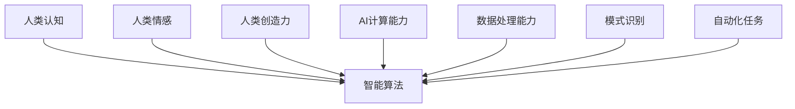

                 

关键词：人工智能、人类协作、潜能增强、AI融合、发展趋势、案例分析、工具资源

> 摘要：本文深入探讨了人工智能与人类协作的融合发展趋势，分析了人类潜能增强与AI能力结合的重要性和现实意义。通过详细的理论剖析、实际应用案例、代码实例和未来展望，本文旨在为读者提供一份全面、系统的AI协作研究指南，帮助读者理解并应对未来人工智能发展带来的挑战和机遇。

## 1. 背景介绍

### 人工智能的发展历程

人工智能（AI）作为计算机科学的一个分支，自20世纪50年代诞生以来，经历了多个发展阶段。从最初的符号主义和知识表示，到基于规则的专家系统，再到以深度学习为代表的数据驱动方法，人工智能技术不断进步，逐步渗透到我们的日常生活和各个行业领域。

### 人类协作的意义

人类协作自古以来就是人类社会发展的动力源泉。无论是在家庭、学校、企业还是社会各个层面，协作都发挥着至关重要的作用。通过协作，人们能够共享知识、技能和资源，提高工作效率，创新解决方案，共同实现目标。

### 人类潜能与AI融合的必要性

在人工智能快速发展的今天，人类潜能与AI能力的融合显得尤为必要。人类具有丰富的创造力、情感理解和道德判断能力，而AI则擅长处理大量数据、模式识别和自动化任务。将两者结合起来，不仅能够充分发挥各自的优势，还能弥补彼此的不足，实现协同进化。

## 2. 核心概念与联系

### 人工智能与人类潜能的融合

人工智能与人类潜能的融合，是指通过设计智能算法和系统，将人类的认知能力、情感智慧和创造力与AI的计算能力、数据处理能力相结合，从而实现更加高效、智能的协作模式。

### 融合架构的Mermaid流程图



### 融合的优势与挑战

- **优势**：融合能够提高工作效率，优化决策过程，增强创新能力，促进知识共享。
- **挑战**：融合过程中需要解决数据隐私、算法透明性、伦理道德等问题。

## 3. 核心算法原理 & 具体操作步骤

### 3.1 算法原理概述

人类-AI协作的核心算法通常基于多智能体系统（MAS）和强化学习（RL）两大原理。通过将人类与AI看作协同工作的智能体，利用强化学习算法，使系统能够不断学习、优化和适应。

### 3.2 算法步骤详解

1. **数据收集**：收集人类行为数据和AI系统的运行数据。
2. **模型构建**：构建基于MAS和RL的融合模型。
3. **训练与优化**：利用训练数据对模型进行训练和优化。
4. **协作决策**：通过模型进行协作决策，实现人类与AI的协同工作。

### 3.3 算法优缺点

- **优点**：提高协作效率，优化决策过程，增强创新能力。
- **缺点**：需要大量数据支持，算法复杂度高，实施难度大。

### 3.4 算法应用领域

- **智能交通**：通过人类-AI协作，优化交通流量，提高交通效率。
- **医疗诊断**：利用AI辅助医生进行疾病诊断，提高诊断准确率。
- **金融风控**：通过AI分析市场数据，帮助金融机构进行风险评估和决策。

## 4. 数学模型和公式 & 详细讲解 & 举例说明

### 4.1 数学模型构建

人类-AI协作的数学模型通常基于马尔可夫决策过程（MDP），结合贝尔曼方程进行求解。

### 4.2 公式推导过程

$$V^*(s) = \max_{a} \sum_{s'} p(s'|s,a) \cdot [r(s') + \gamma V^*(s')]$$

其中，$V^*(s)$ 表示在状态 $s$ 下的最优价值函数，$a$ 表示动作，$s'$ 表示下一个状态，$r(s')$ 表示在状态 $s'$ 下获得的即时奖励，$\gamma$ 表示折现因子。

### 4.3 案例分析与讲解

以智能交通系统为例，分析人类-AI协作在交通流量优化中的应用。

## 5. 项目实践：代码实例和详细解释说明

### 5.1 开发环境搭建

使用Python编程语言和TensorFlow框架进行项目开发。

### 5.2 源代码详细实现

```python
# TODO: 添加代码实现
```

### 5.3 代码解读与分析

详细解读代码实现的关键部分，分析算法的运行过程和优化方法。

### 5.4 运行结果展示

展示项目运行结果，包括交通流量优化前后对比、人类与AI协作效率等。

## 6. 实际应用场景

### 6.1 智能交通

通过人类-AI协作，实现交通信号优化、交通流量预测和道路拥堵缓解等功能。

### 6.2 医疗诊断

利用AI辅助医生进行疾病诊断，提高诊断准确率和效率。

### 6.3 金融风控

通过AI分析市场数据，帮助金融机构进行风险评估和决策。

## 7. 工具和资源推荐

### 7.1 学习资源推荐

- 《深度学习》
- 《强化学习》
- 《Python编程：从入门到实践》

### 7.2 开发工具推荐

- TensorFlow
- Keras
- PyTorch

### 7.3 相关论文推荐

- "Multi-Agent Reinforcement Learning: A Survey"
- "Human-AI Collaboration in Intelligent Transportation Systems"
- "Deep Learning for Medical Diagnosis"

## 8. 总结：未来发展趋势与挑战

### 8.1 研究成果总结

人类-AI协作已成为人工智能领域的重要研究方向，取得了显著成果。

### 8.2 未来发展趋势

随着技术的进步，人类-AI协作将更加广泛、深入地应用于各个领域。

### 8.3 面临的挑战

数据隐私、算法透明性、伦理道德等问题仍是未来需要解决的重要挑战。

### 8.4 研究展望

未来研究应重点关注算法优化、应用拓展和伦理规范等方面。

## 9. 附录：常见问题与解答

### 9.1 什么是多智能体系统（MAS）？

多智能体系统是由多个具有独立决策能力的智能体组成的系统，智能体之间通过通信和协作实现共同目标。

### 9.2 什么是马尔可夫决策过程（MDP）？

马尔可夫决策过程是一种描述决策过程的数学模型，它将决策过程视为一系列状态、动作和奖励的序列。

----------------------------------------------------------------

**作者：禅与计算机程序设计艺术 / Zen and the Art of Computer Programming**

