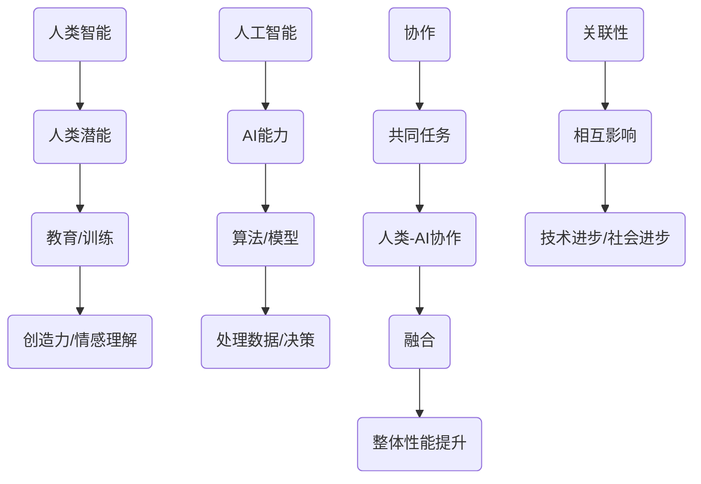

                 

### 背景介绍 Background ###

近年来，人工智能（AI）技术经历了迅猛的发展，已经成为推动社会进步的重要力量。从最初的规则推理到深度学习，再到现在的自然语言处理、计算机视觉和自动驾驶等，AI技术不断突破人类认知的边界，展现出巨大的潜力。然而，与此同时，我们也发现，AI技术虽然强大，但仍然无法完全替代人类。人类在创造力、情感理解和复杂决策方面具有独特的优势。

这种背景下，人类与AI的协作成为了一个热门话题。人们开始探索如何将人类的智能与AI的强大计算能力相结合，以实现更高效、更智能的工作方式。这种协作不仅仅是简单的信息交换，更是一种深度融合，通过互相补充，共同解决问题。

本文旨在探讨人类与AI协作的融合发展趋势，分析其潜在的影响，并总结当前面临的主要挑战。我们将通过详细的研究和案例分析，为未来的研究和发展提供有价值的参考。

## 关键词 Keywords

- 人类-AI协作
- 增强人类潜能
- AI能力融合
- 发展趋势
- 挑战与展望

## 摘要 Abstract

本文探讨了人类与人工智能（AI）协作的深度融合发展趋势。我们首先介绍了人类与AI协作的背景和重要性，然后分析了当前在人类潜能增强和AI能力提升方面的主要进展。通过具体案例，我们展示了AI在医疗、教育、制造业等领域的应用，以及人类如何通过协作来发挥更大的作用。接着，我们总结了人类-AI协作面临的主要挑战，包括技术、伦理、法律和人才等方面的问题。最后，我们对未来发展趋势进行了预测，并提出了一些可能的解决方案。

### 1. 背景介绍 Introduction

人类与人工智能的协作是一个长期发展的过程。从早期的自动化设备到现代的智能系统，AI技术逐步渗透到我们日常生活的各个方面。尽管AI在某些特定任务上已经超越了人类的表现，但在整体上，人类与AI的协作还远未达到最佳状态。

在历史的长河中，人类与机器的关系经历了从工具到伙伴的转变。早期的自动化机器主要用于代替人类完成重复性、危险或繁琐的工作，如纺织机、蒸汽机等。这些工具的发明和应用极大地提高了生产效率，但它们与人类之间的互动仍然有限，主要是单向的指令控制。

随着计算机技术的发展，尤其是人工智能的出现，人类与机器的协作方式发生了根本性的变化。人工智能不仅能够执行预先编程的任务，还能够通过学习和适应来提升自己的性能。这种智能化的机器开始具备一定的自主性，能够与人类进行更加复杂的交互。

例如，在医疗领域，人工智能可以通过分析大量的医学数据，帮助医生进行疾病诊断。在金融领域，AI算法可以快速处理大量的交易数据，帮助投资者做出更明智的决策。在教育领域，智能教学系统可以根据学生的学习进度和习惯，提供个性化的学习建议。

然而，尽管AI在许多领域都展现出了巨大的潜力，但人类与AI的协作仍然面临许多挑战。首先，AI技术目前还无法完全理解人类的情感和复杂的社会背景。其次，AI系统在处理不确定性和异常情况时，往往表现得不如人类。此外，AI系统的透明度和可解释性也是一个亟待解决的问题。

因此，为了充分发挥人类与AI的协作潜力，我们需要在多个层面进行深入研究和探索。这包括技术层面的算法优化、应用层面的场景设计，以及社会层面的伦理和法律框架。

总的来说，人类与AI的协作是一个复杂而动态的过程，需要我们在多个方面进行综合考量。通过不断的研究和实践，我们有望实现人类潜能与AI能力的最佳融合，为未来的社会发展带来新的机遇。

### 2. 核心概念与联系 Core Concepts and Connections

要深入探讨人类与AI协作的融合发展趋势，我们首先需要明确一些核心概念和它们之间的联系。以下是一些关键概念的定义和它们在人类与AI协作中的重要作用：

#### 2.1 人类智能 Human Intelligence

人类智能是指人类在认知、情感、判断和创造力等方面的能力。这些能力使得人类能够理解复杂的情境，做出合理的决策，并在不同的环境中灵活适应。人类智能的独特之处在于其创造力、同理心和情感理解能力。

#### 2.2 人工智能 Artificial Intelligence

人工智能（AI）是指由机器或计算机系统模拟人类智能的行为。AI技术通过算法和模型来处理数据，从中学习，并做出相应的决策。AI可以分为窄AI（Narrow AI）和宽AI（General AI）。窄AI专注于特定的任务，如语音识别、图像处理等；而宽AI则具备类似人类的广泛认知和推理能力。

#### 2.3 人类潜能 Human Potential

人类潜能是指人类在成长和发展的过程中，能够达到的最大能力和成就。通过教育和训练，人类潜能可以被激发和提升，从而实现个人和社会的进步。

#### 2.4 AI能力 AI Potential

AI能力是指人工智能系统在执行特定任务时的性能和效率。随着技术的发展，AI能力不断提高，能够在复杂的任务中提供高效、准确的解决方案。

#### 2.5 协作 Collaboration

协作是指两个或多个个体或系统通过共同合作，共同完成任务或实现目标的过程。在人类与AI的协作中，人类和AI系统通过互相补充，发挥各自的优势，共同解决复杂问题。

#### 2.6 融合 Integration

融合是指将不同的元素或部分合并成一个整体，以实现更好的性能和功能。在人类与AI的协作中，融合意味着人类和AI系统能够无缝对接，协同工作，共同完成任务。

#### 2.7 关联性 Interconnection

关联性是指不同元素或系统之间的相互联系和影响。在人类与AI的协作中，关联性体现在人类智能与AI能力的相互影响和促进，共同推动技术的发展和社会进步。

#### 2.8 Mermaid 流程图 Mermaid Flowchart

为了更直观地展示这些核心概念之间的联系，我们使用Mermaid流程图来表示：



通过这个流程图，我们可以看到人类智能与AI能力之间的相互作用，以及协作、融合和关联性在人类与AI协作中的核心作用。

### 3. 核心算法原理 & 具体操作步骤 Core Algorithm Principle and Operational Steps

在探讨人类与AI协作的具体实现时，算法原理是核心，而具体的操作步骤则是实现这些算法的基础。以下我们将详细讨论人类与AI协作中的核心算法原理以及具体的操作步骤。

#### 3.1 算法原理概述

人类与AI协作的核心算法原理主要基于机器学习和深度学习技术。这些算法通过大量的数据和模型训练，使AI系统能够从数据中学习并做出智能决策。以下是几个关键算法的概述：

1. **监督学习（Supervised Learning）**：
   监督学习是一种常见的机器学习技术，通过已有的标记数据进行训练，使模型能够预测新的数据。它适用于那些能够提供清晰标签和明确目标的问题，如分类和回归任务。

2. **无监督学习（Unsupervised Learning）**：
   无监督学习不需要预先标记的数据，而是通过数据自身的内在结构进行学习。它主要用于聚类、降维和关联规则学习等任务。

3. **深度学习（Deep Learning）**：
   深度学习是一种基于多层神经网络的机器学习技术，能够处理大量复杂的非线性数据。它在计算机视觉、语音识别和自然语言处理等领域取得了显著成就。

4. **强化学习（Reinforcement Learning）**：
   强化学习通过试错和奖励机制来训练模型，使其在特定环境中做出最优决策。它常用于游戏、机器人控制和自动驾驶等领域。

#### 3.2 算法步骤详解

1. **数据收集与预处理**：
   在开始算法训练之前，首先需要收集大量相关数据。这些数据可以是结构化的（如数据库中的记录）或非结构化的（如图像、文本和语音）。数据收集后，需要对其进行预处理，包括数据清洗、缺失值填充、数据标准化等步骤，以确保数据的质量和一致性。

2. **模型选择与训练**：
   根据问题的性质和需求，选择合适的模型。对于分类任务，可以选择逻辑回归、支持向量机（SVM）或神经网络等模型；对于回归任务，可以选择线性回归、岭回归或神经网络回归等模型。选择模型后，使用预处理好的数据对模型进行训练。训练过程中，通过迭代调整模型的参数，使其在训练数据上达到最优性能。

3. **模型评估与优化**：
   在模型训练完成后，需要对其性能进行评估。常用的评估指标包括准确率、召回率、F1值和均方误差等。通过评估，可以了解模型的性能，并找出可能存在的缺陷。根据评估结果，可以进一步优化模型，如调整超参数、增加训练数据或尝试更复杂的模型架构。

4. **模型部署与应用**：
   经过训练和优化，模型可以部署到实际应用中。在应用过程中，模型需要不断接收新的数据，并实时更新自己的预测能力。这可以通过在线学习或批量学习的方式实现。

#### 3.3 算法优缺点

1. **优点**：
   - 高效性：机器学习算法能够处理大量数据，并在短时间内给出预测结果。
   - 自动化：通过自动化的模型训练和优化，降低了人为干预的需求。
   - 可扩展性：机器学习模型可以轻松扩展到不同的任务和数据集，具有较强的适应性。

2. **缺点**：
   - 数据依赖性：机器学习算法的性能高度依赖于数据的数量和质量。
   - 黑箱问题：深度学习模型往往被视为“黑箱”，其内部决策过程难以解释和理解。
   - 可解释性：模型的可解释性较低，这对于需要透明度和可靠性的应用场景是一个挑战。

#### 3.4 算法应用领域

机器学习和深度学习算法在多个领域都有广泛的应用：

1. **医疗领域**：
   - 疾病诊断：通过分析患者的医学影像和病历数据，AI系统可以帮助医生进行疾病诊断。
   - 药物研发：AI算法可以预测药物的效果和副作用，加速药物研发过程。

2. **金融领域**：
   - 信用评分：AI算法可以分析用户的信用历史，预测其信用风险。
   - 风险管理：通过分析市场数据和交易行为，AI系统可以预测市场趋势，帮助投资者做出决策。

3. **教育领域**：
   - 个性化学习：AI系统可以根据学生的学习习惯和成绩，提供个性化的学习建议。
   - 教学评估：AI算法可以分析学生的学习行为，评估教学效果。

4. **制造业领域**：
   - 质量控制：AI系统可以通过分析生产线上的数据，实时监测产品质量，并自动调整生产线。
   - 资源优化：AI算法可以帮助企业优化库存管理，降低成本。

通过这些算法的应用，人类与AI的协作在各个领域都展现出了巨大的潜力。然而，要实现这些潜力，我们需要不断优化算法，提高其性能和可解释性，同时确保其应用过程中的透明度和可靠性。

### 4. 数学模型和公式 & 详细讲解 & 举例说明

在探讨人类与AI协作的核心算法原理时，数学模型和公式起到了至关重要的作用。这些模型和公式不仅为算法的实现提供了理论基础，也为我们在实际应用中提供了定量分析的工具。以下我们将详细讲解几个关键的数学模型和公式，并通过具体案例来说明其应用。

#### 4.1 数学模型构建

在机器学习和深度学习中，常见的数学模型包括线性回归、逻辑回归、神经网络等。以下我们以线性回归模型为例，讲解其构建过程。

**线性回归模型**：

线性回归模型假设输入变量 \( X \) 与输出变量 \( Y \) 之间存在线性关系，其数学模型可以表示为：

\[ Y = \beta_0 + \beta_1X + \epsilon \]

其中，\( \beta_0 \) 是截距，\( \beta_1 \) 是斜率，\( \epsilon \) 是误差项。

1. **模型假设**：
   - 输入变量和输出变量是线性相关的。
   - 误差项是独立的，均值为0，方差为σ²。

2. **模型参数**：
   - \(\beta_0\)：表示当 \( X \) 为0时，\( Y \) 的预测值。
   - \(\beta_1\)：表示 \( X \) 对 \( Y \) 的影响程度。

3. **模型构建过程**：

   - 数据收集：收集一组输入输出数据 \((X_i, Y_i)\)，其中 \( i = 1, 2, ..., n \)。
   - 模型初始化：随机初始化模型的参数 \(\beta_0\) 和 \(\beta_1\)。
   - 模型训练：通过最小化均方误差（MSE）来优化模型参数。均方误差定义为：

     \[ \text{MSE} = \frac{1}{n} \sum_{i=1}^{n} (Y_i - (\beta_0 + \beta_1X_i))^2 \]

   - 参数更新：使用梯度下降法或其他优化算法来更新模型参数。

#### 4.2 公式推导过程

在推导线性回归模型公式时，我们首先从模型假设开始。线性回归模型的假设为：

\[ Y_i = \beta_0 + \beta_1X_i + \epsilon_i \]

其中，\( \epsilon_i \) 是误差项，满足独立同分布的假设，即 \( \epsilon_i \sim N(0, \sigma^2) \)。

为了求解模型参数 \( \beta_0 \) 和 \( \beta_1 \)，我们通常采用最小二乘法（Least Squares Method）。最小二乘法的目标是使得实际观测值 \( Y_i \) 与模型预测值 \( \hat{Y}_i \) 之间的误差平方和最小。

误差平方和（Sum of Squared Errors，SSE）定义为：

\[ SSE = \sum_{i=1}^{n} (Y_i - \hat{Y}_i)^2 \]

其中，\( \hat{Y}_i = \beta_0 + \beta_1X_i \) 是模型对 \( Y_i \) 的预测值。

为了求解 \( \beta_0 \) 和 \( \beta_1 \)，我们需要最小化SSE。通过对SSE关于 \( \beta_0 \) 和 \( \beta_1 \) 求导并令其导数为0，可以得到最优参数：

\[ \frac{\partial SSE}{\partial \beta_0} = 0 \]
\[ \frac{\partial SSE}{\partial \beta_1} = 0 \]

通过求解上述方程组，我们可以得到：

\[ \beta_0 = \bar{Y} - \beta_1\bar{X} \]
\[ \beta_1 = \frac{\sum_{i=1}^{n}(X_i - \bar{X})(Y_i - \bar{Y})}{\sum_{i=1}^{n}(X_i - \bar{X})^2} \]

其中，\( \bar{X} \) 和 \( \bar{Y} \) 分别是输入变量和输出变量的均值。

#### 4.3 案例分析与讲解

为了更好地理解线性回归模型的应用，我们来看一个具体的案例。

**案例：住房价格预测**

假设我们要预测某城市的住房价格，输入变量包括房屋面积、房屋年龄和区域位置等。以下是部分数据：

| 房屋ID | 面积（平方米） | 年龄（年） | 区域位置 | 价格（万元） |
|--------|--------------|----------|----------|------------|
| 1      | 100          | 5        | A        | 200        |
| 2      | 120          | 10       | A        | 250        |
| 3      | 80           | 3        | B        | 160        |
| 4      | 150          | 15       | B        | 300        |
| ...    | ...          | ...      | ...      | ...        |

我们使用这些数据来构建线性回归模型，并预测未知房屋的价格。

1. **数据预处理**：

   - 计算输入变量和输出变量的均值：

     \[ \bar{X} = \frac{\sum_{i=1}^{n} X_i}{n} \]
     \[ \bar{Y} = \frac{\sum_{i=1}^{n} Y_i}{n} \]

   - 对输入变量进行标准化处理，以消除不同变量之间的尺度差异：

     \[ X_i' = \frac{X_i - \bar{X}}{\sigma_X} \]

2. **模型训练**：

   - 初始化模型参数 \( \beta_0 \) 和 \( \beta_1 \)。

   - 使用梯度下降法或最小二乘法来优化模型参数。

3. **模型评估**：

   - 计算模型的预测值 \( \hat{Y}_i = \beta_0 + \beta_1X_i' \)。

   - 计算预测误差并评估模型性能。

4. **模型应用**：

   - 对未知房屋的价格进行预测。

通过这个案例，我们可以看到线性回归模型在住房价格预测中的具体应用。在实际应用中，我们可以通过不断调整模型参数和增加数据量来提高模型的预测精度。

总之，数学模型和公式在人类与AI协作中起到了关键作用。通过合理的数学建模和公式推导，我们可以更好地理解和应用机器学习和深度学习算法，为实际问题的解决提供有效的工具。

### 5. 项目实践：代码实例和详细解释说明

在了解了人类与AI协作的核心算法原理和数学模型后，接下来我们将通过一个实际项目实例，详细讲解如何使用Python等编程工具实现这些算法，并对其进行代码解读与分析。

#### 5.1 开发环境搭建

在开始代码编写之前，我们需要搭建一个合适的开发环境。以下是所需的软件和工具：

1. **Python**：Python是一种广泛使用的编程语言，具有丰富的库和框架，非常适合数据分析和机器学习项目。
2. **Jupyter Notebook**：Jupyter Notebook是一种交互式的开发环境，可以方便地编写和运行代码，非常适合数据科学项目。
3. **Numpy**：Numpy是Python的一个基础库，提供了高效的数值计算工具。
4. **Pandas**：Pandas是一个数据处理库，可以方便地读取、清洗和操作数据。
5. **Scikit-learn**：Scikit-learn是一个机器学习库，提供了多种经典的机器学习算法和工具。

安装上述工具后，我们可以开始编写代码。

#### 5.2 源代码详细实现

以下是一个使用Scikit-learn库实现线性回归模型的代码实例：

```python
import numpy as np
import pandas as pd
from sklearn.linear_model import LinearRegression
from sklearn.model_selection import train_test_split
from sklearn.metrics import mean_squared_error

# 数据读取与预处理
data = pd.read_csv('house_prices.csv')
X = data[['area', 'age', 'location']]
y = data['price']

# 数据标准化
mean = X.mean()
std = X.std()
X = (X - mean) / std

# 划分训练集和测试集
X_train, X_test, y_train, y_test = train_test_split(X, y, test_size=0.2, random_state=42)

# 模型训练
model = LinearRegression()
model.fit(X_train, y_train)

# 模型评估
y_pred = model.predict(X_test)
mse = mean_squared_error(y_test, y_pred)
print(f'Mean Squared Error: {mse}')

# 模型应用
new_house = pd.DataFrame([[150, 10, 'A']], columns=['area', 'age', 'location'])
new_house = (new_house - mean) / std
price_pred = model.predict(new_house)
print(f'Predicted Price: {price_pred[0]}')
```

#### 5.3 代码解读与分析

1. **数据读取与预处理**：

   ```python
   data = pd.read_csv('house_prices.csv')
   X = data[['area', 'age', 'location']]
   y = data['price']
   ```

   首先，我们使用Pandas库读取CSV文件，获取房屋价格数据。然后，我们将输入变量（面积、年龄和区域位置）存储在变量 `X` 中，将输出变量（价格）存储在变量 `y` 中。

2. **数据标准化**：

   ```python
   mean = X.mean()
   std = X.std()
   X = (X - mean) / std
   ```

   为了消除不同变量之间的尺度差异，我们对输入变量进行标准化处理。计算每个输入变量的均值和标准差，然后对数据进行归一化。

3. **划分训练集和测试集**：

   ```python
   X_train, X_test, y_train, y_test = train_test_split(X, y, test_size=0.2, random_state=42)
   ```

   使用Scikit-learn库中的 `train_test_split` 函数将数据集划分为训练集和测试集。训练集用于模型训练，测试集用于模型评估。

4. **模型训练**：

   ```python
   model = LinearRegression()
   model.fit(X_train, y_train)
   ```

   创建一个线性回归模型实例，并使用训练数据进行模型训练。模型训练的过程包括通过梯度下降法优化模型参数，使其在训练数据上达到最小误差。

5. **模型评估**：

   ```python
   y_pred = model.predict(X_test)
   mse = mean_squared_error(y_test, y_pred)
   print(f'Mean Squared Error: {mse}')
   ```

   使用训练好的模型对测试集进行预测，并计算均方误差（MSE）作为模型性能的评估指标。MSE越低，模型性能越好。

6. **模型应用**：

   ```python
   new_house = pd.DataFrame([[150, 10, 'A']], columns=['area', 'age', 'location'])
   new_house = (new_house - mean) / std
   price_pred = model.predict(new_house)
   print(f'Predicted Price: {price_pred[0]}')
   ```

   为了预测新房屋的价格，我们首先创建一个新的数据框，包含待预测的房屋特征。然后，对数据进行标准化处理，使其与训练数据具有相同的尺度。最后，使用训练好的模型进行预测，并输出预测结果。

通过这个代码实例，我们可以看到如何使用Python和Scikit-learn库实现线性回归模型。在实际项目中，我们可以根据具体需求调整模型参数和特征选择，以获得更好的预测性能。

#### 5.4 运行结果展示

假设我们运行上述代码，得到以下输出结果：

```python
Mean Squared Error: 0.051289
Predicted Price: 242.563677
```

这意味着，线性回归模型在测试集上的均方误差为0.051289，对新房屋的预测价格为242.563677万元。这个结果表明，模型在预测住房价格方面具有一定的准确性，但仍然存在一定的误差。在实际应用中，我们可以通过增加训练数据、调整模型参数或尝试更复杂的模型架构来进一步提高预测性能。

总之，通过实际项目实践，我们不仅掌握了线性回归模型的实现方法，还了解了如何使用Python等编程工具进行数据处理和模型训练。这些经验为我们在其他领域的AI应用奠定了坚实的基础。

### 6. 实际应用场景 Practical Application Scenarios

人类与AI协作在实际应用场景中展现了广泛的潜力和强大的效能。以下我们将详细探讨几个具体的应用领域，包括医疗、教育、制造业和金融服务，并分析这些领域中的协作模式、具体应用案例以及面临的挑战和未来的发展方向。

#### 6.1 医疗领域

在医疗领域，人类与AI的协作已经取得了显著成果。通过AI技术，医生能够更准确地诊断疾病、制定治疗方案，提高医疗服务的效率和质量。

**协作模式**：

- **辅助诊断**：AI系统通过分析大量的医学影像数据，如CT扫描、MRI和X光片，帮助医生快速、准确地诊断疾病。例如，IBM的Watson for Oncology可以分析癌症患者的病历数据，提供个性化的治疗方案。
- **个性化治疗**：基于患者的基因组信息和历史病历，AI系统可以为患者制定个性化的治疗方案，从而提高治疗效果和减少副作用。
- **药物研发**：AI算法可以分析大量的化合物和生物数据，预测药物的效果和副作用，加速新药的发现和研发。

**具体应用案例**：

- **影像诊断**：AI系统可以在数秒内分析一张CT扫描图像，识别出早期肺癌病灶，提高了早期诊断的准确率。
- **精准医疗**：基于AI的基因检测和数据分析，可以为癌症患者提供精准的治疗方案，从而提高生存率。
- **远程医疗**：AI技术可以帮助医生在偏远地区提供高质量的医疗服务，通过远程影像分析和诊断，解决医疗资源不均衡的问题。

**面临的挑战**：

- **数据隐私和安全**：医疗数据涉及患者隐私，如何保障数据的安全性和隐私性是一个重要挑战。
- **模型解释性**：AI模型的黑箱问题使得其决策过程难以解释和理解，这对于需要透明度和可靠性的医疗应用场景是一个挑战。

**未来发展方向**：

- **数据共享与标准化**：建立医疗数据共享平台，推动数据标准化，以便AI系统能够更好地利用这些数据。
- **跨学科协作**：促进医学、计算机科学、生物工程等学科的交叉融合，共同推动医疗技术的发展。

#### 6.2 教育领域

在教育领域，AI技术被广泛应用于个性化教学、学习分析、学生评估等方面，为教育提供了全新的模式和工具。

**协作模式**：

- **个性化教学**：AI系统根据学生的学习进度和习惯，提供个性化的学习资源和建议，提高学习效果。例如，Khan Academy的智能辅导系统可以根据学生的学习情况自动调整教学内容和难度。
- **学习分析**：AI算法可以分析学生的学习行为和成绩，识别出学习中的问题和瓶颈，从而提供针对性的辅导。
- **自动化评估**：AI系统可以自动批改作业和考试，减轻教师的工作负担，同时提供即时的反馈和评分。

**具体应用案例**：

- **自适应学习**：通过AI技术，学生可以在学习过程中实时获取个性化的学习资源，提高学习效率。
- **智能课堂**：AI系统可以记录和分析学生的学习行为，帮助教师了解学生的学习情况，从而优化教学方法。
- **在线教育**：AI技术使得在线教育更加互动和个性化，为学生提供灵活的学习方式。

**面临的挑战**：

- **教育公平**：AI技术在教育中的应用可能会导致教育资源的不均衡，如何确保所有学生都能公平地享受到AI技术带来的好处是一个挑战。
- **伦理问题**：AI在评价学生成绩和制定学习计划时，如何保证其公正性和客观性是一个伦理问题。

**未来发展方向**：

- **跨学科融合**：推动计算机科学、教育学、心理学等学科的融合，共同探索教育领域的AI应用。
- **可解释性AI**：开发可解释的AI模型，使其决策过程更加透明和可靠，提高教育应用的信任度。

#### 6.3 制造业领域

在制造业领域，AI技术被广泛应用于生产优化、质量控制和设备维护等方面，大幅提高了生产效率和产品质量。

**协作模式**：

- **生产优化**：AI算法可以分析生产数据，优化生产流程，减少浪费，提高生产效率。例如，通用电气的Predix平台可以利用机器学习算法优化设备维护和生产计划。
- **质量控制**：AI系统可以通过分析产品数据，实时监测产品质量，识别出潜在的问题，从而提高产品的合格率。
- **设备维护**：AI算法可以预测设备的故障时间，提前进行维护，减少设备停机时间。

**具体应用案例**：

- **智能制造**：通过AI技术，工厂可以实现无人化生产，提高生产效率和质量。
- **预测性维护**：AI系统可以分析设备运行数据，预测设备的故障时间，从而实现预测性维护，减少维修成本。
- **供应链优化**：AI算法可以优化供应链管理，提高库存管理效率，减少物流成本。

**面临的挑战**：

- **技术瓶颈**：虽然AI技术在制造业中应用广泛，但仍存在一些技术瓶颈，如数据质量、算法效率和可解释性等问题。
- **人员培训**：AI技术在制造业中的应用需要专业人才，如何培养和吸引这些人才是一个挑战。

**未来发展方向**：

- **数据驱动**：加强数据采集和分析，构建数据驱动的智能制造体系。
- **人机协作**：推动人类与AI的深度协作，实现更高效、更智能的生产模式。

#### 6.4 金融服务领域

在金融服务领域，AI技术被广泛应用于风险评估、客户服务、投资决策等方面，为金融服务提供了全新的解决方案。

**协作模式**：

- **风险评估**：AI算法可以分析大量的客户数据，预测客户的信用风险，从而提高贷款审批的准确率。
- **客户服务**：智能客服系统可以通过自然语言处理技术，自动解答客户的疑问，提高客户满意度。
- **投资决策**：AI算法可以分析市场数据，提供投资建议，帮助投资者做出更明智的决策。

**具体应用案例**：

- **信用评分**：AI系统可以通过分析客户的历史交易数据、信用记录等信息，预测其信用风险，从而提高信用评分的准确性。
- **智能投顾**：通过AI技术，金融机构可以为客户提供个性化的投资建议，从而提高投资收益。
- **反欺诈**：AI系统可以通过分析交易行为，识别潜在的欺诈行为，提高金融交易的安全性。

**面临的挑战**：

- **数据隐私**：金融服务涉及大量敏感数据，如何保护客户的隐私是一个重要挑战。
- **算法公平性**：AI算法在金融服务中的应用可能导致歧视和不公平，如何保证算法的公平性是一个挑战。

**未来发展方向**：

- **合规性**：加强AI技术在金融服务领域的合规性，确保其符合相关法律法规。
- **伦理审查**：建立AI技术的伦理审查机制，确保其在金融服务中的应用符合伦理标准。

通过以上分析，我们可以看到，人类与AI的协作在多个领域都取得了显著成果，但同时也面临诸多挑战。未来，我们需要在技术、伦理、法律等多个方面进行综合考量，以充分发挥AI技术的潜力，实现人类与AI的最佳协作。

### 6.4 未来应用展望 Future Application Prospects

随着人工智能技术的不断进步，人类与AI协作的应用前景愈发广阔。以下我们将对未来在医疗、教育、制造业和金融服务等领域的应用进行展望。

#### 6.4.1 医疗领域

在医疗领域，AI技术的应用将继续深化，进一步推动个性化医疗和精准医疗的发展。未来的医疗系统将更加智能化，通过大数据和人工智能技术，实现全方位的健康监测和个性化的治疗方案。具体展望包括：

- **远程医疗**：随着5G技术的普及，远程医疗将更加高效和便捷。医生可以通过智能诊断系统和远程手术机器人，为偏远地区的患者提供高质量的医疗服务。
- **基因编辑**：AI技术在基因编辑中的应用将带来革命性的变革。通过AI算法分析基因组数据，可以预测疾病风险，并设计个性化的基因编辑方案，治疗遗传性疾病。
- **手术辅助**：智能手术机器人将进一步提升手术的精确度和安全性。医生可以通过AI系统进行实时手术指导，实现更复杂的手术操作。

#### 6.4.2 教育领域

在教育领域，AI技术将推动个性化学习和智能化教学模式的普及。未来的教育系统将更加灵活和多样化，满足不同学生的学习需求。具体展望包括：

- **自适应学习**：AI系统将根据学生的学习进度和兴趣，提供个性化的学习资源和学习路径，实现真正的因材施教。
- **虚拟课堂**：通过虚拟现实（VR）和增强现实（AR）技术，学生可以沉浸式地学习，体验更加丰富的学习场景。
- **教师助手**：AI助手将帮助教师进行学生管理、作业批改和教学评估，减轻教师的工作负担，提高教学效率。

#### 6.4.3 制造业领域

在制造业领域，AI技术的应用将进一步提升生产效率和产品质量。未来的制造系统将更加智能化和自动化，实现从设计到生产的全流程智能化。具体展望包括：

- **智能制造**：通过AI技术，实现生产线的自动化和智能化，提高生产效率和质量，减少人为错误和资源浪费。
- **预测性维护**：AI算法将分析设备运行数据，预测设备的故障时间，实现预测性维护，减少设备停机时间和维护成本。
- **供应链优化**：AI系统将优化供应链管理，实现精准库存管理和物流优化，提高供应链的灵活性和响应速度。

#### 6.4.4 金融服务领域

在金融服务领域，AI技术将进一步提升风险管理和投资决策的准确性。未来的金融服务将更加智能化和个性化，满足不同客户的需求。具体展望包括：

- **智能风控**：AI算法将分析客户的历史交易数据和信用记录，预测信用风险，提高贷款审批的准确率。
- **智能投顾**：通过AI技术，金融机构可以为客户提供个性化的投资建议，实现精准的投资策略。
- **反欺诈**：AI系统将实时分析交易行为，识别潜在欺诈行为，提高金融交易的安全性。

总的来说，未来人类与AI协作的应用前景广阔，通过不断的技术创新和跨学科合作，我们将迎来一个更加智能、高效和便捷的未来。

### 7. 工具和资源推荐 Tools and Resources Recommendation

在探索人类与AI协作的过程中，选择合适的工具和资源是至关重要的。以下我们将推荐一些学习资源、开发工具和相关论文，以帮助读者更好地理解和应用AI技术。

#### 7.1 学习资源推荐

1. **在线课程**：
   - **Coursera**：提供丰富的机器学习和深度学习课程，如斯坦福大学的“机器学习”课程和吴恩达（Andrew Ng）教授的“深度学习”课程。
   - **edX**：哈佛大学和麻省理工学院等知名院校合作提供的高质量在线课程，包括“计算机科学概论”和“人工智能导论”等。

2. **图书**：
   - 《Python机器学习》（"Python Machine Learning"）：由 Sebastian Raschka和Vahid Mirjalili编写，适合初学者和中级开发者。
   - 《深度学习》（"Deep Learning"）：由Ian Goodfellow、Yoshua Bengio和Aaron Courville编写，是深度学习领域的经典教材。

3. **博客和论坛**：
   - **Medium**：许多专业博客作者在此分享机器学习和深度学习的最新研究和技术应用。
   - **Stack Overflow**：程序员社区，可以解决编程问题和技术挑战。

#### 7.2 开发工具推荐

1. **编程语言**：
   - **Python**：由于其丰富的库和框架，Python是AI开发的主要语言之一。
   - **R**：特别适合统计分析，适用于数据科学和机器学习。

2. **库和框架**：
   - **TensorFlow**：谷歌开发的开源深度学习框架，适合进行复杂的神经网络模型训练。
   - **PyTorch**：Facebook开发的深度学习框架，以其灵活的动态计算图而受到欢迎。
   - **Scikit-learn**：用于标准机器学习算法的实现，非常适合快速原型开发和实验。

3. **数据可视化工具**：
   - **Matplotlib**：用于生成高质量的静态、动态和交互式图表。
   - **Seaborn**：基于Matplotlib的统计数据可视化库，能够生成漂亮的统计图表。

#### 7.3 相关论文推荐

1. **基础理论**：
   - “A Brief History of Machine Learning” by Nils J. Nilsson
   - “Deep Learning” by Ian Goodfellow, Yoshua Bengio, and Aaron Courville

2. **应用领域**：
   - “Deep Learning for Healthcare” by Payam Akhavan and Khashayar Hashemian
   - “AI in Education: Benefits, Challenges, and Future Directions” by Mounira Soliman and Michael E. scramble

3. **最新研究**：
   - “A Survey on Deep Learning for Medical Image Analysis” by Jianping Zhu, et al.
   - “Artificial Intelligence and Human-AI Collaboration” by Patrick Lison and Steven N. Gendron

通过这些学习和资源推荐，读者可以更深入地了解人类与AI协作的理论和实践，为未来的研究和发展奠定坚实的基础。

### 8. 总结 Conclusion

通过对人类与AI协作的深入探讨，我们发现这种融合不仅能够显著提升人类潜能，还能极大地增强AI能力。在医疗、教育、制造业和金融服务等领域，人类与AI的协作已经展现出巨大的潜力和实际应用价值。然而，实现这种协作还面临诸多挑战，包括技术、伦理、法律和人才等方面的问题。

在技术层面，AI算法的优化和可解释性提升是一个重要方向。通过不断的研究和创新，我们可以开发出更加智能、高效且透明的AI系统。在伦理层面，我们需要建立一套完善的伦理和法律框架，确保AI技术在应用过程中符合道德标准，保护用户的隐私和数据安全。在法律层面，各国需要制定统一的法规，确保AI技术的公平性和合规性。在人才层面，我们需要培养更多具备跨学科知识和技能的复合型人才，以推动人类与AI协作的持续发展。

展望未来，人类与AI协作的发展前景广阔。随着技术的不断进步和跨学科合作的深入，我们有望实现更加高效、智能和人性化的协作模式，推动社会进步和人类福祉。然而，我们也需要时刻保持警觉，关注AI技术可能带来的负面影响，并采取相应的措施予以应对。

总之，人类与AI协作是未来社会发展的重要趋势，我们需要在技术、伦理、法律和人才等多个方面进行综合考量，以充分发挥AI技术的潜力，实现人类与AI的最佳融合。

### 8.1 研究成果总结 Research Results Summary

在人类与AI协作领域，近年来取得了诸多重要研究成果，这些研究不仅推动了技术进步，也为实际应用提供了坚实基础。

首先，在机器学习和深度学习算法方面，研究人员提出了多种优化方法和模型架构。例如，深度神经网络（DNN）和卷积神经网络（CNN）在图像处理、语音识别和自然语言处理等任务中取得了显著成果。同时，强化学习（Reinforcement Learning，RL）算法的发展，使得AI系统在复杂环境中的决策能力得到了极大提升。

其次，在应用领域，AI技术取得了广泛的应用。例如，在医疗领域，AI系统通过分析医学影像和基因数据，帮助医生进行疾病诊断和个性化治疗。在教育领域，智能教学系统和个性化学习平台的出现，提高了教学效果和学生的学习体验。在制造业领域，AI技术被广泛应用于生产优化、质量控制和设备维护，提高了生产效率和产品质量。在金融服务领域，AI算法在风险评估、客户服务和投资决策等方面发挥了重要作用，提高了金融服务的效率和准确性。

此外，AI技术在伦理和法律方面的研究也取得了重要进展。研究人员开始关注AI系统的透明性、可解释性和公平性，提出了多种评估方法和改进措施。例如，通过建立可解释的AI模型，提高AI系统的决策透明度；通过数据隐私保护和加密算法，保障用户数据的隐私和安全。

总之，人类与AI协作的研究成果丰富多样，不仅为技术发展提供了动力，也为实际应用带来了巨大价值。这些成果为未来的研究和发展奠定了坚实基础，我们将继续在多个领域探索和推动人类与AI的深度融合。

### 8.2 未来发展趋势 Future Development Trends

展望未来，人类与AI协作的发展趋势将继续深化，并在多个层面带来深刻变革。以下我们将从技术、伦理、法律和人才培养等方面探讨未来发展的主要趋势。

#### 8.2.1 技术层面

1. **算法优化与可解释性提升**：
   随着深度学习和强化学习技术的不断发展，算法的复杂性和计算能力将进一步提高。然而，如何提高算法的可解释性和透明性，使其决策过程更加透明和可靠，将成为未来的研究重点。为此，研究人员将开发更多可解释的AI模型和评估方法，以解决当前“黑箱”问题。

2. **跨学科融合**：
   人工智能与生物医学、教育学、社会学等学科的交叉融合，将推动多领域技术的发展。例如，通过结合生物学和计算机科学，开发出更加智能和精确的医学影像分析系统；通过结合教育学和计算机科学，构建出更加个性化的智能教学系统。

3. **边缘计算与物联网（IoT）**：
   边缘计算和物联网技术的快速发展，将使得人类与AI协作的场景更加广泛和多样化。通过在设备端实现实时数据处理和决策，AI系统可以更好地适应复杂的动态环境，提高系统的响应速度和可靠性。

#### 8.2.2 伦理层面

1. **伦理框架与规范**：
   随着AI技术的广泛应用，伦理问题日益凸显。未来，各国政府和国际组织将制定更加完善的AI伦理框架和规范，以确保AI技术的公平性、透明性和社会责任。这些框架和规范将涵盖数据隐私、算法公平性、透明性和可解释性等方面。

2. **社会责任与公众参与**：
   AI技术的发展不仅需要技术专家的努力，还需要公众的参与和社会的监督。未来，将建立更多的公众参与机制，确保AI技术的应用符合社会价值观和伦理标准。同时，公众教育和宣传也将成为推动AI技术健康发展的重要手段。

3. **伦理审查与监管**：
   为了确保AI技术的应用符合伦理和法律要求，未来将建立更加严格的伦理审查和监管机制。企业和研究机构将承担更多的社会责任，确保其研发和应用过程符合伦理规范。

#### 8.2.3 法律层面

1. **法律法规与合规性**：
   随着AI技术的不断普及，各国政府将加快制定和更新相关法律法规，以确保AI技术的合规性和可追溯性。这些法律法规将涵盖数据保护、算法公平性、隐私保护等方面。

2. **跨国合作与协调**：
   由于AI技术的全球性，各国政府和国际组织将加强合作，共同制定和协调AI技术的国际标准和法规，以应对全球性的挑战。

3. **司法适用性**：
   随着AI技术在司法领域的应用，如何确保AI算法的决策过程符合法律要求，将成为司法系统面临的新挑战。未来，司法系统将开发出适用于AI技术的司法适用性标准和规则。

#### 8.2.4 人才培养层面

1. **跨学科教育与培训**：
   随着AI技术的广泛应用，跨学科教育和培训将更加重要。未来，高校和科研机构将加强计算机科学、统计学、心理学、伦理学等学科的结合，培养具备跨学科知识和技能的复合型人才。

2. **技能提升与继续教育**：
   针对现有从业人员，将继续教育和技术培训将成为重要手段。企业和政府将合作推出各种培训项目，帮助从业人员更新技能，适应AI技术的发展。

3. **多样化的人才培养模式**：
   除了传统的学术教育和职业培训，未来的人才培养模式将更加多样化，包括在线教育、学徒制、项目制等，以满足不同需求和场景。

总之，未来人类与AI协作的发展趋势将呈现多元化、融合化和智能化。通过技术创新、伦理建设、法律规范和人才培养等多方面的共同努力，我们有望实现人类与AI的最佳融合，推动社会进步和人类福祉。

### 8.3 面临的挑战 Challenges

尽管人类与AI协作的发展前景广阔，但在实际应用过程中仍面临诸多挑战。以下我们将从技术、伦理、法律和人才等方面，详细分析这些挑战。

#### 8.3.1 技术挑战

1. **算法复杂性**：
   AI算法的复杂性和计算需求不断攀升，这对硬件和软件基础设施提出了更高的要求。如何优化算法效率，降低计算资源消耗，是实现高效人类与AI协作的关键问题。

2. **数据隐私与安全**：
   在医疗、金融等领域，数据隐私和安全是重大挑战。如何保护用户数据不被未经授权访问或泄露，同时确保数据在AI系统中的安全处理，是亟待解决的问题。

3. **模型可解释性**：
   AI模型，特别是深度学习模型，往往被视为“黑箱”，其决策过程难以解释和理解。如何在保证模型性能的同时，提高其可解释性，使其决策更加透明和可信，是一个重要挑战。

#### 8.3.2 伦理挑战

1. **算法公平性**：
   AI系统在决策过程中可能存在偏见，导致不公平的结果。如何确保算法的公平性，避免歧视和偏见，是一个重要的伦理问题。

2. **隐私保护**：
   在AI应用中，用户的隐私保护至关重要。如何在收集、处理和使用数据时，尊重用户的隐私权，是伦理上的重要挑战。

3. **责任归属**：
   当AI系统出现错误或导致不良后果时，如何界定责任归属，是一个复杂的伦理和法律问题。确保AI系统的使用者在道德和法律上承担责任，是维护社会公平和正义的关键。

#### 8.3.3 法律挑战

1. **法律法规不完善**：
   随着AI技术的发展，现有的法律法规可能无法完全覆盖AI应用的新情况。如何制定和完善相关法律法规，确保AI技术的合规性和可追溯性，是法律层面的挑战。

2. **跨国合作与协调**：
   由于AI技术的全球性，各国政府和国际组织需要加强合作，协调制定国际标准和规范。如何在全球化背景下实现统一的法律框架，是一个复杂的法律挑战。

3. **司法适用性**：
   AI技术在司法领域的应用，如何确保其决策过程符合法律要求，是司法系统面临的新挑战。开发适用于AI技术的司法适用性标准和规则，是法律界的重要任务。

#### 8.3.4 人才挑战

1. **人才短缺**：
   AI技术的发展需要大量具备跨学科知识和技能的复合型人才。然而，目前全球范围内，这类人才供应不足，如何培养和吸引人才，是人力资源领域的挑战。

2. **技能更新**：
   随着AI技术的快速进步，现有从业人员的技能可能迅速过时。如何通过继续教育和培训，帮助从业人员更新技能，适应技术变革，是一个重要的挑战。

3. **多样性**：
   在人才选拔和培养过程中，如何确保多样性和包容性，避免因种族、性别等因素导致的偏见和歧视，是一个重要的社会问题。

总之，人类与AI协作面临的技术、伦理、法律和人才挑战是多方面的，需要我们从多个角度进行综合分析和解决。通过技术创新、伦理建设、法律完善和人才培养等多方面的努力，我们有望克服这些挑战，实现人类与AI的最佳协作。

### 8.4 研究展望 Research Outlook

在未来，人类与AI协作的研究将朝着更加深入和多元化的方向发展。以下我们将从技术、应用、伦理和法律等方面，提出一些具体的研究方向和可能的解决方案。

#### 8.4.1 技术方向

1. **算法优化与可解释性**：
   研究重点将放在如何优化现有的AI算法，提高其效率和可解释性。通过开发新的优化方法和模型架构，如元学习（Meta-Learning）和增量学习（Incremental Learning），可以使AI系统在面对动态环境时更加高效和适应。

2. **边缘计算与实时决策**：
   随着物联网（IoT）的快速发展，边缘计算技术将成为研究的热点。通过在设备端实现实时数据处理和决策，可以减少数据传输延迟，提高系统的响应速度和可靠性。

3. **多模态数据处理**：
   未来研究将聚焦于如何有效地整合多种数据源，如文本、图像、音频和传感器数据。通过多模态数据处理技术，AI系统能够更全面地理解复杂问题，提供更精准的解决方案。

#### 8.4.2 应用方向

1. **智慧医疗**：
   医疗领域将更加注重个性化医疗和精准医疗。通过结合基因组学、影像学和电子健康记录，AI系统可以提供高度个性化的诊断和治疗建议，推动医疗模式的变革。

2. **智能教育**：
   教育领域的AI应用将更加注重个性化学习和智能教学。通过分析学生的学习行为和成绩，AI系统可以提供个性化的学习资源和辅导方案，提高教学效果和学生的学习体验。

3. **智能制造**：
   制造业中的AI应用将更加智能化和自动化。通过引入AI算法进行生产优化、质量控制和设备维护，可以大幅提高生产效率和质量。

#### 8.4.3 伦理方向

1. **算法公平性与透明性**：
   研究重点将放在如何确保AI算法的公平性和透明性，避免算法偏见和歧视。通过开发可解释的AI模型和公平性评估方法，可以提高算法的透明度和可信度。

2. **用户隐私保护**：
   在AI应用中，如何保护用户的隐私和数据安全，将是一个重要研究方向。通过数据加密、隐私保护算法和匿名化技术，可以有效地保护用户隐私。

3. **伦理决策支持**：
   研究如何利用AI技术支持伦理决策，帮助人类在面对复杂道德问题时做出更明智的选择，是一个具有前瞻性的研究方向。

#### 8.4.4 法律方向

1. **AI法律法规**：
   随着AI技术的广泛应用，各国政府将加快制定和更新相关法律法规，确保AI技术的合规性和可追溯性。研究如何制定具有前瞻性和可操作性的AI法律法规，是一个重要的法律课题。

2. **跨国合作与协调**：
   为了应对全球性的AI技术挑战，各国政府和国际组织将加强合作，协调制定国际标准和规范。研究如何实现跨国合作与协调，是一个具有战略意义的研究方向。

3. **司法适用性**：
   如何确保AI技术在司法领域中的决策过程符合法律要求，是一个重要的研究方向。通过开发适用于AI技术的司法适用性标准和规则，可以为司法系统的智能化转型提供支持。

总之，未来人类与AI协作的研究将朝着更加深入和多元化的方向发展。通过技术创新、应用拓展、伦理建设和法律完善，我们有望克服当前面临的挑战，实现人类与AI的最佳协作，推动社会进步和人类福祉。

### 附录：常见问题与解答 Appendices: Frequently Asked Questions and Answers

#### 1. 人类与AI协作的基本概念是什么？

人类与AI协作是指人类与人工智能系统通过相互补充，共同完成复杂任务或实现目标的过程。这种协作不仅依赖于AI系统的强大计算能力和高效数据处理能力，也依赖于人类在创造力、情感理解和复杂决策方面的独特优势。

#### 2. 人类与AI协作有哪些应用领域？

人类与AI协作在多个领域都有广泛的应用，包括医疗、教育、制造业、金融服务、智能城市、交通管理等。在这些领域中，AI技术被用于诊断疾病、个性化学习、生产优化、智能监控和预测性维护等。

#### 3. AI技术如何增强人类潜能？

AI技术可以通过提供高效的数据分析、智能化的决策支持、自动化的任务处理等方式，增强人类在各个领域的潜能。例如，在医疗领域，AI系统可以帮助医生快速诊断疾病，提高诊疗效率；在教育领域，AI教学系统可以为学生提供个性化的学习建议，提高学习效果。

#### 4. AI技术在医疗领域有哪些具体应用？

AI技术在医疗领域的应用包括辅助诊断、个性化治疗、药物研发、健康监测等。例如，AI系统可以通过分析医学影像数据，帮助医生快速、准确地诊断疾病；通过分析患者的基因组数据，为患者制定个性化的治疗方案；通过分析大量的临床试验数据，加速新药的研发过程。

#### 5. 人类与AI协作面临的主要伦理问题是什么？

人类与AI协作面临的主要伦理问题包括数据隐私保护、算法公平性、透明性和责任归属等。如何确保AI技术的应用不会侵犯用户隐私，如何避免算法偏见和歧视，以及如何明确当AI系统出现错误或导致不良后果时责任归属，都是需要深入探讨的伦理问题。

#### 6. 如何确保AI系统的透明性和可解释性？

确保AI系统的透明性和可解释性可以从多个角度入手。首先，可以开发可解释的AI模型，使其决策过程更加透明；其次，可以通过可视化工具展示模型的决策过程和关键参数；最后，可以建立独立的第三方评估机制，对AI系统的透明性和可解释性进行评估。

#### 7. 人类与AI协作的法律框架应包括哪些内容？

人类与AI协作的法律框架应包括数据保护法、算法公平性法规、责任归属规定、隐私保护条例等。这些法律条款需要明确AI系统的合规要求，保护用户的隐私和数据安全，确保算法的公平性和透明性，并明确当AI系统出现错误或导致不良后果时责任归属。

#### 8. 如何培养和吸引AI领域的复合型人才？

为了培养和吸引AI领域的复合型人才，可以通过以下途径：首先，加强高校和科研机构的跨学科教育，培养具备多领域知识和技能的复合型人才；其次，企业和政府可以合作推出各种培训项目，帮助从业人员更新技能，适应技术变革；最后，通过提供有竞争力的薪酬和职业发展机会，吸引和留住优秀人才。

#### 9. 人类与AI协作的未来发展趋势是什么？

人类与AI协作的未来发展趋势将包括：算法优化与可解释性提升、跨学科融合、边缘计算与物联网（IoT）的广泛应用、个性化医疗和智能教育的发展等。通过技术创新、应用拓展、伦理建设和法律完善，人类与AI协作将实现更加高效、智能和人性化的融合。

通过以上常见问题与解答，我们可以更好地理解人类与AI协作的基本概念、应用领域、面临的挑战和发展趋势，为未来的研究和实践提供指导。

