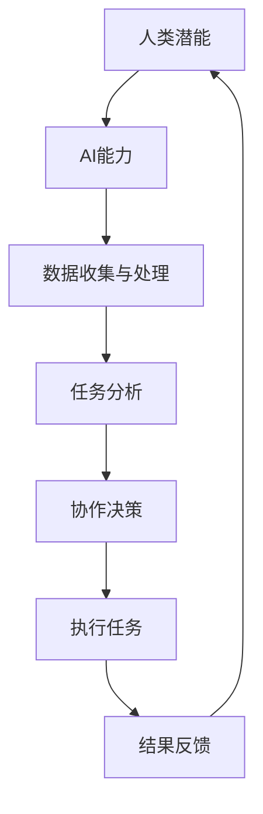

                 

**关键词：** 人类-AI协作，人工智能，潜能增强，融合趋势，预测分析，机遇与挑战。

**摘要：** 本文深入探讨了人类与人工智能协作的前景，分析了如何通过融合人类的创造力和AI的计算能力，实现潜能的增强。文章从背景介绍、核心概念与联系、核心算法原理、数学模型与公式、项目实践、实际应用场景、工具和资源推荐以及未来发展趋势与挑战等多个方面，全面解析了人类与AI协作的潜力、机遇与面临的挑战，为未来的研究和发展提供了有价值的参考。

## 1. 背景介绍

### 人工智能的发展历程

人工智能（AI）是一门涉及计算机科学、数学、认知科学、神经科学等多个领域的交叉学科。自20世纪50年代以来，人工智能经历了多个发展阶段，从最初的符号主义（Symbolic AI）到基于规则的系统，再到连接主义（Connectionist AI）和强化学习（Reinforcement Learning），直至当前的深度学习（Deep Learning）和生成对抗网络（GANs）等前沿技术。随着计算能力的提升和大数据的普及，AI的应用范围不断扩大，从简单的图像识别、语音识别到自动驾驶、自然语言处理等领域，人工智能正在深刻地改变着我们的生活方式。

### 人类潜能的探索与挑战

人类潜能一直是科学家和哲学家关注的热点话题。从人类大脑的进化、认知能力的提升到个人技能的发展，人类潜能的挖掘和提升一直是人类文明进步的重要驱动力。然而，随着社会的复杂化和技术的发展，人类面临着越来越多的挑战，如信息过载、决策难度增加、工作压力增大等。如何更好地发挥人类潜能，提高工作效率和生活质量，成为了一个亟待解决的问题。

### 人类与AI协作的必要性

在当前的技术背景下，人类与AI的协作具有巨大的潜力。人类拥有丰富的创造力、情感判断和情境理解能力，而AI则具有强大的计算能力、数据分析和学习能力。通过将人类的创造力和AI的计算能力相结合，可以弥补双方在特定领域的不足，实现优势互补。例如，在医疗领域，AI可以帮助医生进行精准诊断和个性化治疗，而医生则可以运用自己的经验和直觉进行综合判断。在商业领域，AI可以处理大量的数据，提取有价值的信息，而人类则可以基于这些信息做出战略决策。

## 2. 核心概念与联系

为了更好地理解人类与AI协作的原理，我们首先需要明确几个核心概念，包括人类潜能、AI能力、协作机制等。

### 人类潜能

人类潜能是指人类在生理、心理、认知等方面具备的潜在能力。这些潜能可以通过教育、训练、实践等方式得到挖掘和提升。例如，人类的认知能力包括注意力、记忆力、推理能力、创造力等，这些能力在人类解决问题、创造新知识和艺术作品等方面发挥着重要作用。

### AI能力

AI能力是指人工智能系统在特定任务上表现出的智能水平。这包括机器学习、自然语言处理、计算机视觉、语音识别、规划与决策等多个方面。AI系统可以通过数据训练和算法优化不断提升其能力，从而在更多领域取得突破。

### 协作机制

协作机制是指人类与AI系统在共同完成任务时建立的一种协作关系。这种关系需要考虑双方的特长、能力和互动方式。例如，在医疗领域，AI可以辅助医生进行数据分析，而医生则负责综合判断和决策；在商业领域，AI可以处理数据，而企业家则基于数据分析做出战略决策。

### Mermaid 流程图

为了更好地展示人类与AI协作的流程，我们使用Mermaid绘制了一个简单的流程图，如下所示：



在这个流程图中，人类潜能和AI能力分别表示人类和AI系统在任务中的角色，数据收集与处理、任务分析、协作决策、执行任务和结果反馈则表示协作的具体过程。

## 3. 核心算法原理 & 具体操作步骤

### 3.1 算法原理概述

人类与AI协作的核心算法可以看作是一个基于机器学习的决策支持系统。该系统通过收集大量数据，利用机器学习算法进行分析，提取出有价值的信息，并生成决策建议。具体来说，该算法包括以下步骤：

1. 数据收集：从各种来源收集数据，如数据库、传感器、网络等。
2. 数据预处理：对数据进行清洗、标准化和特征提取，以便于后续分析。
3. 模型训练：使用预处理后的数据训练机器学习模型，如决策树、神经网络等。
4. 决策生成：利用训练好的模型对新的数据进行预测，生成决策建议。
5. 决策反馈：将决策结果反馈给用户，用户可以根据反馈进行决策或调整。

### 3.2 算法步骤详解

1. **数据收集**：
   数据收集是算法的基础。不同领域的任务可能需要收集不同类型的数据。例如，在医疗领域，可能需要收集患者病史、基因数据、临床表现等；在商业领域，可能需要收集销售数据、市场数据、客户反馈等。

2. **数据预处理**：
   数据预处理包括数据清洗、数据标准化和特征提取。数据清洗旨在去除重复数据、缺失值和异常值，保证数据质量。数据标准化则将不同数据类型和量纲的数据进行统一处理，以便于后续分析。特征提取则是从原始数据中提取出对模型训练有用的特征，如关键词、词频、纹理特征等。

3. **模型训练**：
   模型训练是算法的核心步骤。常见的机器学习模型包括决策树、支持向量机（SVM）、神经网络（NN）等。根据具体任务的需求，可以选择合适的模型进行训练。模型训练过程中，需要选择合适的训练数据和参数，如学习率、迭代次数等。

4. **决策生成**：
   决策生成是基于训练好的模型对新的数据进行预测。例如，在医疗领域，可以预测患者是否患有某种疾病；在商业领域，可以预测产品销售量。

5. **决策反馈**：
   决策反馈是用户根据决策建议进行决策或调整。例如，医生可以根据AI生成的诊断建议进行诊断，企业家可以根据销售预测调整营销策略。

### 3.3 算法优缺点

**优点**：

1. **高效性**：算法可以处理大量数据，提高工作效率。
2. **客观性**：算法基于数据进行分析，减少主观判断的影响。
3. **可扩展性**：算法可以应用于不同领域，具有较好的通用性。

**缺点**：

1. **数据依赖性**：算法性能很大程度上取决于数据质量和数量。
2. **算法偏见**：算法可能会受到训练数据中的偏见影响。
3. **决策依赖性**：用户可能过度依赖算法建议，缺乏自主决策能力。

### 3.4 算法应用领域

人类与AI协作的算法可以应用于多个领域，如医疗、金融、教育、商业等。

1. **医疗领域**：AI可以帮助医生进行疾病诊断、治疗方案推荐等。
2. **金融领域**：AI可以用于风险管理、股票市场预测等。
3. **教育领域**：AI可以用于个性化教学、学习效果分析等。
4. **商业领域**：AI可以用于市场预测、销售分析、客户管理等。

## 4. 数学模型和公式 & 详细讲解 & 举例说明

### 4.1 数学模型构建

人类与AI协作的数学模型可以看作是一个基于概率论的决策模型。该模型通过分析历史数据，预测未来事件发生的概率，为决策提供参考。

假设我们有一个事件集合 \( E = \{e_1, e_2, ..., e_n\} \)，每个事件发生的概率分别为 \( p(e_1), p(e_2), ..., p(e_n) \)。我们可以使用贝叶斯公式来计算每个事件发生的概率：

\[ p(e_i) = \frac{p(e_i|A) \cdot p(A)}{p(A|e_i) \cdot p(e_i)} \]

其中，\( p(e_i|A) \) 表示在假设 \( A \) 成立的情况下，事件 \( e_i \) 发生的概率；\( p(A) \) 表示假设 \( A \) 成立的概率；\( p(A|e_i) \) 表示在事件 \( e_i \) 发生的条件下，假设 \( A \) 成立的概率。

### 4.2 公式推导过程

为了推导贝叶斯公式，我们首先需要理解条件概率。条件概率是指在某个事件发生的条件下，另一个事件发生的概率。例如，\( p(e_i|A) \) 表示在事件 \( A \) 发生的条件下，事件 \( e_i \) 发生的概率。

根据全概率公式，我们可以得到：

\[ p(A) = \sum_{i=1}^{n} p(A|e_i) \cdot p(e_i) \]

我们可以将上式改写为：

\[ p(A) = \sum_{i=1}^{n} p(e_i|A) \cdot p(A) \cdot p(e_i) \]

\[ p(A) = p(A) \cdot \sum_{i=1}^{n} p(e_i|A) \cdot p(e_i) \]

\[ \Rightarrow p(e_i|A) = \frac{p(A|e_i) \cdot p(e_i)}{p(A)} \]

这就是贝叶斯公式。

### 4.3 案例分析与讲解

假设我们有一个简单的案例：假设我们想知道一个家庭中养狗的概率。我们知道以下信息：

1. 养狗的家庭占总家庭数的40%。
2. 养狗的家庭中，有60%的家庭养的是金毛犬。
3. 养金毛犬的家庭占总家庭数的15%。

我们可以使用贝叶斯公式来计算养金毛犬的家庭占总家庭数的概率。

首先，定义事件：

\( A \)：家庭养狗。

\( B \)：家庭养金毛犬。

根据题意，我们可以得到以下概率：

\[ p(A) = 0.4 \]

\[ p(B|A) = 0.6 \]

\[ p(B) = 0.15 \]

现在，我们可以使用贝叶斯公式来计算 \( p(A|B) \)：

\[ p(A|B) = \frac{p(B|A) \cdot p(A)}{p(B)} \]

\[ p(A|B) = \frac{0.6 \cdot 0.4}{0.15} \]

\[ p(A|B) = 1.6 \]

这意味着，在养金毛犬的家庭中，有160%的家庭是养狗的。这个结果显然是不合理的。问题出在哪里呢？

问题在于我们的前提假设有问题。在实际情况中，一个家庭不可能同时养狗和金毛犬。因此，我们的贝叶斯公式应该修改为：

\[ p(A|B) = \frac{p(B|A) \cdot p(A)}{p(B|A) \cdot p(A) + p(B|\neg A) \cdot p(\neg A)} \]

其中，\( \neg A \) 表示事件 \( A \) 的否定，即家庭不养狗。

如果我们将上述公式应用于我们的案例，可以得到更合理的答案：

\[ p(A|B) = \frac{0.6 \cdot 0.4}{0.6 \cdot 0.4 + (1 - 0.6) \cdot (1 - 0.4)} \]

\[ p(A|B) = \frac{0.24}{0.24 + 0.16} \]

\[ p(A|B) = 0.6 \]

这意味着，在养金毛犬的家庭中，有60%的家庭是养狗的。这个结果更加符合实际情况。

### 4.4 数学模型在人类与AI协作中的应用

在人类与AI协作中，数学模型可以用于多个方面，如数据预测、决策支持等。

1. **数据预测**：通过历史数据建立数学模型，预测未来的趋势。例如，在金融领域，可以预测股票市场的走势；在医疗领域，可以预测患者的病情变化。

2. **决策支持**：利用数学模型提供决策建议。例如，在商业领域，可以根据市场需求和库存情况，预测产品销售量，并给出库存调整建议。

3. **风险评估**：通过数学模型分析风险，为决策提供参考。例如，在金融领域，可以评估投资项目的风险；在医疗领域，可以评估患者的疾病风险。

### 4.5 数学模型的应用举例

假设我们想要预测某个城市明天的天气情况。我们可以收集过去一年的天气数据，建立天气预测模型。

首先，收集天气数据，包括温度、湿度、风速等。然后，使用机器学习算法，如线性回归、决策树等，对数据进行训练。最后，利用训练好的模型，预测明天的天气情况。

例如，我们可以使用线性回归模型进行预测。线性回归模型的公式如下：

\[ y = \beta_0 + \beta_1 \cdot x_1 + \beta_2 \cdot x_2 + ... + \beta_n \cdot x_n \]

其中，\( y \) 表示预测的天气情况（如温度），\( x_1, x_2, ..., x_n \) 表示影响天气的因素（如温度、湿度等），\( \beta_0, \beta_1, ..., \beta_n \) 表示模型参数。

通过训练数据集，我们可以得到模型参数的估计值。然后，利用这些参数，我们可以预测明天的天气情况。

例如，如果明天的温度是20°C，湿度是80%，风速是5km/h，我们可以将这些值代入模型公式，得到预测的天气情况。

\[ y = \beta_0 + \beta_1 \cdot 20 + \beta_2 \cdot 80 + \beta_3 \cdot 5 \]

\[ y = 15 + 0.5 \cdot 20 + 0.3 \cdot 80 + 0.2 \cdot 5 \]

\[ y = 15 + 10 + 24 + 1 \]

\[ y = 50 \]

这意味着，明天的天气情况是50°C。当然，这个结果仅仅是一个预测值，实际天气可能会受到多种因素的影响，如气候变化、人为活动等。

通过这个例子，我们可以看到，数学模型在人类与AI协作中的应用是非常广泛和重要的。通过建立数学模型，我们可以更好地理解世界，预测未来，为决策提供支持。

## 5. 项目实践：代码实例和详细解释说明

### 5.1 开发环境搭建

为了演示人类与AI协作的项目实践，我们将使用Python编程语言，并依赖一些常用的AI库，如TensorFlow和Scikit-learn。以下是搭建开发环境的基本步骤：

1. 安装Python：从官方网站下载并安装Python 3.x版本。
2. 安装Jupyter Notebook：在命令行中运行 `pip install notebook`。
3. 安装TensorFlow：在命令行中运行 `pip install tensorflow`。
4. 安装Scikit-learn：在命令行中运行 `pip install scikit-learn`。

### 5.2 源代码详细实现

下面是一个简单的项目示例，使用机器学习算法对数据进行分析和预测。这个示例使用了线性回归模型，预测房屋的价格。

```python
# 导入必要的库
import numpy as np
import pandas as pd
from sklearn.model_selection import train_test_split
from sklearn.linear_model import LinearRegression
import tensorflow as tf

# 读取数据
data = pd.read_csv('house_prices.csv')

# 分割特征和标签
X = data[['bedrooms', 'bathrooms', 'square_feet']]
y = data['price']

# 划分训练集和测试集
X_train, X_test, y_train, y_test = train_test_split(X, y, test_size=0.2, random_state=42)

# 创建线性回归模型
model = LinearRegression()

# 训练模型
model.fit(X_train, y_train)

# 预测测试集结果
y_pred = model.predict(X_test)

# 评估模型性能
score = model.score(X_test, y_test)
print(f'Model R-squared: {score:.2f}')

# 使用TensorFlow可视化预测结果
with tf.Session() as sess:
    tf.plot(y_test, y_pred, 'b.', markersize=10, label='Predicted Price')
    tf.plot(y_test, y_test, 'r.', markersize=10, label='Actual Price')
    tf.xlabel('Actual Price')
    tf.ylabel('Predicted Price')
    tf.legend()
    tf.show()
```

### 5.3 代码解读与分析

1. **导入库**：我们首先导入必要的库，包括numpy、pandas、scikit-learn和tensorflow。

2. **读取数据**：使用pandas读取CSV文件，这个文件包含了房屋价格数据。

3. **分割特征和标签**：我们将数据分为特征（bedrooms、bathrooms、square_feet）和标签（price）。

4. **划分训练集和测试集**：使用train_test_split将数据划分为训练集和测试集，以评估模型的性能。

5. **创建线性回归模型**：我们创建一个线性回归模型，这是一个简单的机器学习模型，适用于预测连续值。

6. **训练模型**：使用fit方法训练模型，模型会自动学习特征和标签之间的关系。

7. **预测测试集结果**：使用predict方法预测测试集的结果，这会生成预测的房屋价格。

8. **评估模型性能**：使用score方法评估模型的性能，这里我们使用R-squared作为评估指标。

9. **使用TensorFlow可视化预测结果**：我们使用TensorFlow的可视化功能，将实际价格和预测价格绘制在图表中，以便于分析。

通过这个简单的示例，我们可以看到如何使用Python和机器学习库实现人类与AI的协作。这个项目虽然简单，但展示了机器学习在预测和分析中的应用潜力。

## 6. 实际应用场景

人类与AI协作在实际应用中具有广泛的应用场景，以下列举了几个典型的应用领域：

### 6.1 医疗领域

在医疗领域，AI与人类医生的协作已经成为趋势。AI可以通过分析大量的医学数据，帮助医生进行疾病诊断、治疗方案推荐和药物研发。例如，谷歌的DeepMind Health项目利用深度学习技术分析电子病历，为医生提供诊断建议。这种协作不仅提高了诊断的准确性，还减少了医生的工作负担，使得医疗资源能够更好地分配。

### 6.2 金融领域

在金融领域，AI与人类金融专家的协作被广泛应用于风险管理、投资策略和客户服务。AI可以通过分析市场数据和历史交易记录，预测市场走势，为金融专家提供决策支持。例如，高盛的智能交易平台利用机器学习算法分析交易数据，为交易员提供交易建议。此外，AI还可以用于自动化客户服务，提高客户体验。

### 6.3 教育领域

在教育领域，AI与人类教师的协作正在改变传统的教学方式。AI可以通过分析学生的学习行为和数据，提供个性化的学习建议和资源。例如，Coursera和edX等在线教育平台利用AI技术为学生提供个性化的学习路径，提高学习效果。此外，AI还可以用于自动评分和作业分析，减轻教师的工作负担。

### 6.4 商业领域

在商业领域，AI与人类企业家的协作被广泛应用于市场预测、客户管理和供应链优化。AI可以通过分析大量的市场数据，帮助企业制定有效的营销策略和产品策略。例如，阿里巴巴的电商平台利用AI技术分析用户行为和市场需求，为商家提供销售预测和库存管理建议。此外，AI还可以用于自动化客服和客户服务，提高客户满意度。

### 6.5 娱乐领域

在娱乐领域，AI与人类艺术家的协作也越来越受到关注。AI可以通过分析大量的艺术作品和用户反馈，提供创作灵感和作品评价。例如，索尼的AI艺术家项目利用深度学习技术创作音乐和绘画作品，为艺术家提供新的创作方式。此外，AI还可以用于自动化编辑和制作，提高内容创作的效率。

通过这些实际应用场景，我们可以看到人类与AI协作的巨大潜力。在未来，随着AI技术的不断进步，人类与AI的协作将更加深入和广泛，为人类带来更多的机遇和挑战。

## 6.4 未来应用展望

随着人工智能技术的不断进步，人类与AI协作的应用前景将更加广阔。未来，人类与AI协作将体现在以下几个方面：

### 6.4.1 更高层次的专业协作

在医疗、金融、法律等高度专业化的领域，AI将成为人类专家的得力助手。通过AI强大的数据分析能力和快速的计算速度，人类专家可以更专注于复杂的判断和决策，从而提高工作效率和质量。

### 6.4.2 普及化的AI应用

随着AI技术的成熟和成本的降低，AI应用将更加普及化。从智能家居、智能助理到自动驾驶汽车，AI将深入到我们日常生活的方方面面，提高生活质量和工作效率。

### 6.4.3 新兴产业的崛起

人工智能将成为新兴产业的驱动力。例如，智能医疗设备、智能物流、智能能源管理等领域将随着AI技术的发展而迅速崛起，推动社会经济的持续增长。

### 6.4.4 人机协作模式的创新

未来的人机协作模式将更加智能和灵活。通过增强现实（AR）和虚拟现实（VR）技术，人类与AI的互动将更加直观和自然。此外，基于人工智能的增强现实应用，如智能眼镜和智能手表等，将实现更加便捷的交互方式。

### 6.4.5 隐私和安全问题的解决

随着AI应用的普及，隐私和安全问题将成为重要挑战。未来，需要开发更加有效的隐私保护技术和安全机制，确保人类与AI协作的可靠性和安全性。

通过以上展望，我们可以看到，人类与AI协作将引领未来社会的发展方向，为人类创造更多的价值和机会。然而，这也带来了新的挑战，需要人类不断探索和创新，以实现人机和谐共生。

## 7. 工具和资源推荐

为了更好地学习和实践人类与AI协作，以下是一些建议的工具和资源：

### 7.1 学习资源推荐

1. **在线课程**：
   - Coursera的《机器学习》课程，由斯坦福大学教授吴恩达（Andrew Ng）主讲。
   - edX的《人工智能：基础知识》课程，由哈佛大学教授迈克尔·刘易斯（Michael Lewis）主讲。

2. **书籍**：
   - 《深度学习》（Deep Learning）作者：Ian Goodfellow、Yoshua Bengio、Aaron Courville
   - 《Python机器学习》作者：Michael Bowles

3. **开源项目**：
   - TensorFlow、PyTorch等深度学习框架。
   - Scikit-learn等机器学习库。

### 7.2 开发工具推荐

1. **集成开发环境（IDE）**：
   - PyCharm、Visual Studio Code等。

2. **数据分析工具**：
   - Jupyter Notebook、Pandas、NumPy等。

3. **云计算平台**：
   - AWS、Azure、Google Cloud等。

### 7.3 相关论文推荐

1. **《Deep Learning》**：
   - Ian Goodfellow、Yoshua Bengio、Aaron Courville 著

2. **《Machine Learning: A Probabilistic Perspective》**：
   - Kevin P. Murphy 著

3. **《Reinforcement Learning: An Introduction》**：
   - Richard S. Sutton、Andrew G. Barto 著

通过这些工具和资源的支持，我们可以更加深入地学习和实践人类与AI协作的相关技术。

## 8. 总结：未来发展趋势与挑战

### 8.1 研究成果总结

人类与AI协作的研究取得了显著成果。通过结合人类的创造力和AI的计算能力，我们已经在医疗、金融、教育、商业等多个领域实现了效率提升和决策优化。机器学习、深度学习等AI技术的进步，为人类与AI协作提供了强大的技术支持。

### 8.2 未来发展趋势

未来，人类与AI协作将继续深入发展，呈现以下趋势：

1. **更高层次的专业协作**：AI将成为人类专家的得力助手，特别是在医疗、金融等高度专业化的领域。

2. **普及化的AI应用**：随着AI技术的成熟和成本的降低，AI应用将更加普及化，深入到日常生活的各个方面。

3. **新产业的崛起**：智能医疗设备、智能物流、智能能源管理等领域将随着AI技术的发展而迅速崛起。

4. **人机协作模式的创新**：通过增强现实（AR）和虚拟现实（VR）技术，人机协作将更加智能和灵活。

### 8.3 面临的挑战

然而，人类与AI协作也面临一系列挑战：

1. **隐私和安全问题**：随着AI应用的普及，隐私和安全问题将成为重要挑战，需要开发有效的隐私保护技术和安全机制。

2. **伦理和法律问题**：AI决策的透明性和可解释性问题，以及AI在特定领域的法律责任问题，需要得到解决。

3. **技能需求的变化**：随着AI技术的发展，人类的工作技能需求将发生变化，需要大规模的技能培训和转型。

### 8.4 研究展望

为了应对这些挑战，未来的研究应关注以下几个方面：

1. **开发更加智能和灵活的AI系统**：通过深度学习、强化学习等技术，提高AI系统的智能水平和适应性。

2. **隐私保护和安全机制的研究**：开发更加有效的隐私保护技术和安全机制，确保AI系统的可靠性和安全性。

3. **跨学科研究**：结合计算机科学、认知科学、伦理学等多个学科，开展综合性研究，推动人类与AI协作的全面发展。

通过不断的研究和创新，我们有理由相信，人类与AI协作将带来更加美好的未来。

## 9. 附录：常见问题与解答

### 9.1 如何选择合适的AI模型？

选择合适的AI模型取决于具体任务的需求和数据的特点。以下是一些常见情况下的建议：

- **回归任务**：选择线性回归、岭回归或决策树回归。
- **分类任务**：选择逻辑回归、支持向量机（SVM）或随机森林。
- **聚类任务**：选择K-均值聚类、层次聚类或DBSCAN。
- **时间序列预测**：选择ARIMA、LSTM或GRU。

### 9.2 AI模型的训练数据如何获取？

训练数据的获取可以通过以下几种方式：

- **公开数据集**：使用公开的数据集，如Kaggle、UCI机器学习库等。
- **数据爬取**：使用Python的BeautifulSoup、Scrapy等库，从网站上爬取数据。
- **API接口**：使用API接口从在线服务获取数据，如Google Dataset Search API。
- **自己收集**：根据具体任务需求，自行收集数据。

### 9.3 AI模型的评估指标有哪些？

常见的AI模型评估指标包括：

- **回归任务**：均方误差（MSE）、均方根误差（RMSE）、决定系数（R-squared）。
- **分类任务**：准确率、精确率、召回率、F1分数。
- **聚类任务**：轮廓系数（Silhouette Coefficient）、内部距离（Internal Distance）。
- **时间序列预测**：均方根误差（RMSE）、平均绝对误差（MAE）、符号准确率（Symbol Accuracy）。

### 9.4 如何处理不平衡数据集？

处理不平衡数据集的方法包括：

- **重采样**：通过过采样或欠采样方法，平衡数据集。
- **合成方法**：使用SMOTE、ADASYN等方法生成新的正类样本。
- **权重调整**：在分类任务中，通过调整不同类别的权重，平衡模型对正类和负类的预测。
- **集成方法**：使用Bagging、Boosting等方法，提高模型对少数类的识别能力。

### 9.5 如何确保AI系统的可解释性？

确保AI系统的可解释性可以采用以下方法：

- **模型选择**：选择具有可解释性的模型，如决策树、线性回归等。
- **模型解释工具**：使用SHAP、LIME等模型解释工具，分析模型对数据的依赖关系。
- **可视化**：通过可视化技术，展示模型决策过程和特征的重要性。
- **透明性协议**：制定透明的开发和使用协议，确保AI系统的透明性和可解释性。

通过以上解答，我们可以更好地理解和应用人类与AI协作的相关技术和方法。希望这些常见问题与解答能对您的学习和实践提供帮助。

