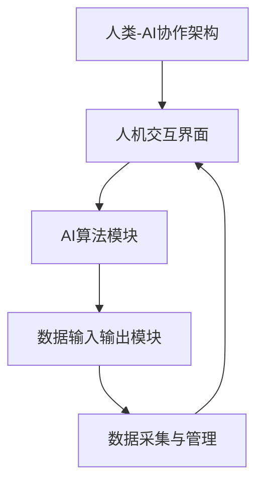

                 

关键词：人类-AI协作、AI能力、人类潜能、融合发展趋势、机遇、挑战

摘要：本文探讨了人类与人工智能（AI）协作的趋势及其对未来发展的潜在影响。通过分析AI在增强人类潜能方面的应用，本文揭示了人类-AI融合所带来的机遇与挑战，并对未来发展趋势进行了预测。

## 1. 背景介绍

### AI的发展历程

人工智能（AI）作为一个跨学科的领域，其历史可以追溯到20世纪50年代。从最初的符号逻辑和规则推理，到现在的深度学习和神经网络，AI经历了多个阶段的发展。随着计算能力的提升和数据量的爆炸式增长，AI技术逐渐从理论研究走向实际应用。

### 人类潜能的局限

尽管人类拥有独特的智慧和能力，但在信息处理、计算速度和持续工作能力等方面仍存在局限性。例如，人类的记忆有限，难以同时处理大量信息，且在长时间内保持高效率工作。这些局限限制了人类在复杂任务中的表现。

### 人类-AI协作的需求

为了克服人类的这些局限性，人类与AI的协作成为一种必然趋势。通过AI技术，人类可以扩展自己的认知能力、处理速度和持续工作能力，从而在各个领域实现更高效的工作和创造。

## 2. 核心概念与联系

### AI的核心概念

人工智能的核心概念包括机器学习、深度学习、自然语言处理等。这些技术使得计算机能够从数据中学习、推理和生成结果。

### 人类潜能的核心

人类潜能的核心在于创造力、判断力、情感和社交能力。这些能力使得人类能够在复杂环境中做出决策，并与他人有效沟通。

### 人类-AI融合的架构

为了实现人类-AI协作，需要构建一个融合的架构。这个架构包括人机交互界面、AI算法模块、数据输入输出模块等。人机交互界面用于人类与AI的交互，AI算法模块负责处理数据并生成结果，数据输入输出模块则负责数据的采集和管理。

## 2.1 Mermaid 流程图



## 3. 核心算法原理 & 具体操作步骤

### 3.1 算法原理概述

人类-AI协作的核心算法是基于机器学习和深度学习的技术。这些算法使得计算机能够从数据中学习模式，并利用这些模式进行预测和决策。

### 3.2 算法步骤详解

1. 数据采集：收集大量相关数据，例如文本、图像、声音等。
2. 数据预处理：清洗数据，去除噪声，进行特征提取。
3. 模型训练：使用训练数据训练模型，使其学会识别模式和生成结果。
4. 模型评估：使用测试数据评估模型的性能，并进行调整。
5. 应用部署：将模型部署到实际应用中，与人类进行协作。

### 3.3 算法优缺点

**优点：**
- 高效处理大量数据
- 持续学习与改进
- 扩展人类认知能力

**缺点：**
- 需要大量高质量的数据
- 模型的可解释性较低
- 对数据隐私和安全的挑战

### 3.4 算法应用领域

- 医疗诊断：使用AI辅助医生进行诊断和预测。
- 金融分析：使用AI进行股票市场预测和风险管理。
- 制造业：使用AI优化生产流程和产品质量。

## 4. 数学模型和公式 & 详细讲解 & 举例说明

### 4.1 数学模型构建

人类-AI协作的数学模型通常基于概率论和统计学。例如，一个简单的线性回归模型可以用来预测数据。

### 4.2 公式推导过程

$$
y = \beta_0 + \beta_1x + \epsilon
$$

其中，$y$ 是预测值，$x$ 是输入特征，$\beta_0$ 和 $\beta_1$ 是模型参数，$\epsilon$ 是误差。

### 4.3 案例分析与讲解

假设我们要预测股票价格，使用线性回归模型。我们可以收集过去一年的股票价格数据，训练模型。然后，使用模型预测未来几天的股票价格。

## 5. 项目实践：代码实例和详细解释说明

### 5.1 开发环境搭建

为了实现人类-AI协作，我们需要搭建一个合适的开发环境。例如，可以使用Python和TensorFlow作为主要工具。

### 5.2 源代码详细实现

以下是使用Python和TensorFlow实现的线性回归模型的代码：

```python
import tensorflow as tf

# 数据采集与预处理
# ...

# 模型构建
model = tf.keras.Sequential([
    tf.keras.layers.Dense(units=1, input_shape=[1])
])

# 模型编译
model.compile(optimizer='sgd', loss='mean_squared_error')

# 模型训练
model.fit(x_train, y_train, epochs=100)

# 模型评估
model.evaluate(x_test, y_test)

# 模型预测
predictions = model.predict(x_new)
```

### 5.3 代码解读与分析

这段代码首先导入了TensorFlow库，然后进行了数据采集与预处理。接下来，构建了一个简单的线性回归模型，并使用SGD优化器和均方误差损失函数进行编译。然后，使用训练数据训练模型，并使用测试数据评估模型性能。最后，使用新数据进行预测。

### 5.4 运行结果展示

运行这段代码后，我们可以得到模型对股票价格的预测结果。这些结果可以用来指导投资决策。

## 6. 实际应用场景

### 6.1 医疗诊断

在医疗诊断领域，AI可以辅助医生进行疾病预测和诊断。例如，通过分析患者的医疗记录和生物特征数据，AI可以帮助医生预测疾病的可能性，并提供诊断建议。

### 6.2 金融分析

在金融领域，AI可以用于股票市场预测、风险评估和投资策略制定。通过分析历史数据和市场趋势，AI可以帮助投资者做出更明智的决策。

### 6.3 制造业

在制造业，AI可以用于生产流程优化、质量控制和生产预测。通过分析生产数据和历史趋势，AI可以帮助企业提高生产效率，降低成本。

## 6.4 未来应用展望

未来，人类-AI协作将在更多领域得到应用。例如，在教育和科学研究领域，AI可以辅助教师和研究人员进行教学和研究。在公共服务领域，AI可以用于智能交通管理和公共安全监控。

## 7. 工具和资源推荐

### 7.1 学习资源推荐

- 《深度学习》（Goodfellow, Bengio, Courville 著）
- 《Python机器学习》（Sebastian Raschka 著）
- 《AI：一种现代方法》（Stuart Russell 和 Peter Norvig 著）

### 7.2 开发工具推荐

- TensorFlow
- PyTorch
- Keras

### 7.3 相关论文推荐

- "Deep Learning" by Ian Goodfellow, Yoshua Bengio, and Aaron Courville
- "Recurrent Neural Networks for Language Modeling" by Yoshua Bengio
- "A Theoretical Framework for Backpropagation" by David E. Rumelhart, Geoffrey E. Hinton, and Ronald J. Williams

## 8. 总结：未来发展趋势与挑战

### 8.1 研究成果总结

人类-AI协作在多个领域取得了显著成果。AI技术提高了人类的认知能力和工作效率，推动了社会进步。

### 8.2 未来发展趋势

未来，人类-AI协作将更加深入和广泛。随着技术的进步，AI将更好地理解人类需求，并提供更个性化的服务。

### 8.3 面临的挑战

然而，人类-AI协作也面临一些挑战。例如，数据隐私和安全、算法透明性和可解释性等。

### 8.4 研究展望

为了应对这些挑战，我们需要继续推进AI技术的发展，并加强人机协作的研究。

## 9. 附录：常见问题与解答

### 9.1 什么是人类-AI协作？

人类-AI协作是指人类与人工智能系统共同完成任务的过程。通过协作，人类可以扩展自己的能力和效率。

### 9.2 人类-AI协作有哪些应用领域？

人类-AI协作在医疗、金融、制造、教育等多个领域都有应用。它可以帮助人类在复杂任务中更好地工作。

### 9.3 如何保证AI系统的安全性和隐私性？

为了保证AI系统的安全性和隐私性，我们需要采取一系列措施，例如数据加密、权限管理和审计等。

---

作者：禅与计算机程序设计艺术 / Zen and the Art of Computer Programming
----------------------------------------------------------------

注意：以上内容仅为示例，实际撰写时需要详细扩展和深入研究相关领域的知识和数据。

