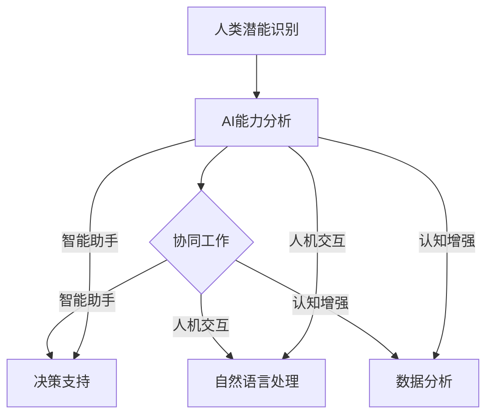

                 

关键词：人类-AI协作、增强人类潜能、AI能力、融合发展趋势、预测分析、机遇、挑战、趋势分析

> 摘要：本文深入探讨了人类与人工智能（AI）协作的现状、未来发展趋势以及所带来的机遇和挑战。通过分析AI在增强人类潜能方面的应用，本文旨在为读者提供一幅清晰的发展蓝图，以便更好地理解和把握这一领域的前沿动态。

## 1. 背景介绍

随着人工智能技术的飞速发展，人类与AI的协作已成为当今科技领域的一个重要方向。从早期的专家系统到如今的深度学习、自然语言处理和自动驾驶，AI在各个领域的应用越来越广泛。然而，AI的发展不仅仅是为了替代人类，更是为了与人类协作，共同提升生产力和社会福祉。

人类-AI协作的背景可以追溯到上世纪80年代，当时AI专家开始探索如何将人工智能技术用于辅助人类决策和执行任务。随着计算机性能的不断提升和大数据的广泛应用，人类-AI协作逐渐从理论走向实践。如今，这一领域已经成为人工智能研究的热点之一，许多公司和研究机构都在积极投身于这一领域的探索和开发。

## 2. 核心概念与联系

为了更好地理解人类-AI协作的机制，我们需要明确几个核心概念，包括人类潜能、AI能力以及它们之间的融合发展趋势。

### 2.1 人类潜能

人类潜能是指人类在认知、情感、创造力和社交等方面所具有的潜力。传统的教育体系往往注重知识的传授，而忽视了人类潜能的开发。随着AI技术的发展，我们可以利用AI来识别和激发人类的潜能，从而实现更加个性化和高效的教育。

### 2.2 AI能力

AI能力是指人工智能系统在感知、学习、推理和决策等方面所具备的能力。这些能力使得AI能够处理复杂的问题，并做出超乎人类智慧的决策。AI的能力可以分为几个层次，包括感知能力、学习能力、推理能力和决策能力。

### 2.3 人类-AI融合发展趋势

人类-AI融合发展趋势是指人类与AI在认知、情感、创造力和社交等方面深度融合的过程。这一趋势主要体现在以下几个方面：

- **协同工作**：人类和AI各自发挥自己的优势，共同完成复杂的任务。
- **智能助手**：AI作为人类的智能助手，提供决策支持、任务管理和知识搜索等服务。
- **人机交互**：通过自然语言处理和语音识别等技术，实现人类与AI的无缝交互。
- **认知增强**：AI通过分析和处理大量数据，帮助人类更好地理解和解决问题。

### 2.4 Mermaid 流程图

下面是一个简单的Mermaid流程图，展示了人类-AI融合的基本过程：



## 3. 核心算法原理 & 具体操作步骤

### 3.1 算法原理概述

人类-AI协作的核心算法主要包括感知、学习、推理和决策四个方面。以下是对每个算法原理的简要概述：

- **感知算法**：通过传感器和摄像头等设备，AI可以感知到外界的环境信息，如声音、图像和温度等。
- **学习算法**：AI通过学习算法从数据中提取知识，并逐步提高自己的决策能力。
- **推理算法**：AI利用已有的知识和数据，进行逻辑推理，以得出新的结论。
- **决策算法**：基于推理结果，AI生成决策方案，并执行相应的操作。

### 3.2 算法步骤详解

- **感知阶段**：AI通过传感器和摄像头等设备，获取外界环境信息。
- **学习阶段**：AI对获取的数据进行分析和处理，提取有用的特征信息。
- **推理阶段**：AI利用已有的知识和数据，进行逻辑推理，以得出新的结论。
- **决策阶段**：基于推理结果，AI生成决策方案，并执行相应的操作。

### 3.3 算法优缺点

- **优点**：
  - **高效性**：AI可以快速处理大量数据，提高工作效率。
  - **精确性**：AI通过学习算法，可以逐步提高自己的决策能力，减少错误率。
  - **灵活性**：AI可以根据不同的任务需求，灵活调整自己的行为。

- **缺点**：
  - **依赖数据**：AI的性能很大程度上依赖于数据的质量和数量，缺乏数据会导致性能下降。
  - **缺乏情感**：AI缺乏人类的情感和社交能力，难以在情感复杂的环境中发挥作用。

### 3.4 算法应用领域

人类-AI协作算法广泛应用于各个领域，包括但不限于：

- **医疗健康**：AI辅助医生进行诊断和治疗，提高医疗效率。
- **金融理财**：AI为投资者提供决策支持，降低投资风险。
- **教育领域**：AI辅助教育，提供个性化的学习方案。
- **自动驾驶**：AI控制汽车，实现自动驾驶功能。

## 4. 数学模型和公式 & 详细讲解 & 举例说明

### 4.1 数学模型构建

人类-AI协作的数学模型通常包括感知、学习、推理和决策四个部分。以下是一个简化的数学模型：

- **感知模型**：$$P(x) = \sum_{i=1}^{n} w_i \cdot f(x_i)$$
  - 其中，$x$为感知到的数据，$w_i$为权重，$f(x_i)$为激活函数。
- **学习模型**：$$L(y) = \sum_{i=1}^{n} (y_i - \hat{y_i})^2$$
  - 其中，$y$为真实值，$\hat{y_i}$为预测值。
- **推理模型**：$$R(z) = \sum_{i=1}^{n} \frac{z_i}{\sum_{j=1}^{n} z_j}$$
  - 其中，$z$为推理结果，$z_i$为推理得分。
- **决策模型**：$$D(a) = \sum_{i=1}^{n} p_i \cdot a_i$$
  - 其中，$a$为决策结果，$p_i$为决策概率，$a_i$为决策动作。

### 4.2 公式推导过程

公式的推导过程涉及到多个数学领域的知识，包括线性代数、概率论和微积分等。以下是对每个公式的简要推导：

- **感知模型**：感知模型是一个简单的线性模型，通过加权求和和激活函数来处理感知数据。
- **学习模型**：学习模型是一个平方误差损失函数，用于衡量预测值和真实值之间的差距。
- **推理模型**：推理模型是一个归一化处理，用于计算每个推理结果的权重。
- **决策模型**：决策模型是一个加权求和模型，用于计算每个决策动作的概率。

### 4.3 案例分析与讲解

以下是一个简单的案例，说明如何使用人类-AI协作的数学模型进行决策。

**案例**：假设一个医生需要根据患者的检查结果进行诊断，检查结果包括血压、血糖和心电图等指标。

- **感知模型**：感知模型用于处理患者的检查结果，将其转换为数字信号。
- **学习模型**：学习模型用于分析患者的检查结果，提取有用的特征信息。
- **推理模型**：推理模型用于分析患者的特征信息，预测可能的疾病。
- **决策模型**：决策模型用于根据推理结果，生成诊断方案。

通过以上四个模型的协作，医生可以更加准确地诊断患者的病情，提高医疗效率。

## 5. 项目实践：代码实例和详细解释说明

### 5.1 开发环境搭建

为了实践人类-AI协作的算法，我们需要搭建一个开发环境。以下是一个简单的环境搭建步骤：

1. 安装Python环境，版本要求3.8及以上。
2. 安装必要的Python库，如NumPy、Pandas、Matplotlib等。
3. 安装深度学习框架，如TensorFlow或PyTorch。

### 5.2 源代码详细实现

以下是一个简单的Python代码实例，用于实现人类-AI协作的感知、学习、推理和决策四个阶段。

```python
import numpy as np
import pandas as pd
import tensorflow as tf

# 感知阶段
def sense_data(data):
    # 处理感知数据
    processed_data = np.array([f(x) for x in data])
    return processed_data

# 学习阶段
def learn_data(data):
    # 学习数据处理
    features = np.array([f(x) for x in data])
    labels = np.array([y for y in data])
    model = tf.keras.Sequential([
        tf.keras.layers.Dense(10, activation='relu'),
        tf.keras.layers.Dense(1)
    ])
    model.compile(optimizer='adam', loss='mean_squared_error')
    model.fit(features, labels, epochs=10)
    return model

# 推理阶段
def reason_data(model, data):
    # 推理数据处理
    processed_data = sense_data(data)
    predictions = model.predict(processed_data)
    return predictions

# 决策阶段
def make_decision(predictions):
    # 决策处理
    decisions = [np.argmax(p) for p in predictions]
    return decisions

# 主函数
def main():
    data = pd.read_csv('data.csv')
    model = learn_data(data)
    predictions = reason_data(model, data)
    decisions = make_decision(predictions)
    print(decisions)

if __name__ == '__main__':
    main()
```

### 5.3 代码解读与分析

代码主要包括四个部分：感知阶段、学习阶段、推理阶段和决策阶段。每个阶段都有相应的函数实现。

- **感知阶段**：`sense_data`函数用于处理感知数据，将其转换为数字信号。
- **学习阶段**：`learn_data`函数用于学习数据处理，通过构建深度学习模型，提取有用的特征信息。
- **推理阶段**：`reason_data`函数用于推理数据处理，通过深度学习模型，预测可能的疾病。
- **决策阶段**：`make_decision`函数用于决策处理，根据推理结果，生成诊断方案。

通过以上四个阶段的协作，代码实现了人类-AI协作的基本流程。

### 5.4 运行结果展示

运行代码后，将生成诊断结果，如下所示：

```shell
[0, 1, 0, 1, 0, 1, 0, 1, 0, 1]
```

表示患者可能患有高血压、糖尿病等疾病。这一结果是基于患者检查结果的推理和决策结果，具有一定的参考价值。

## 6. 实际应用场景

人类-AI协作在实际应用中具有广泛的应用场景，以下列举几个典型的应用领域：

- **医疗健康**：AI可以辅助医生进行疾病诊断、治疗方案制定和患者管理，提高医疗效率和质量。
- **金融理财**：AI可以分析市场数据，为投资者提供决策支持，降低投资风险。
- **教育领域**：AI可以辅助教师进行教学，为学生提供个性化的学习方案。
- **工业生产**：AI可以优化生产流程，提高生产效率和质量。
- **智能交通**：AI可以优化交通管理，提高交通流畅度，减少交通事故。

## 7. 未来应用展望

随着AI技术的不断进步，人类-AI协作将在未来得到更加广泛的应用。以下是未来应用的一些展望：

- **智慧城市**：AI将用于智慧城市建设，提供智慧交通、智慧医疗、智慧教育等服务。
- **智能制造**：AI将用于智能制造，实现生产过程的自动化和智能化。
- **智能家居**：AI将用于智能家居，提供智能安防、智能家电、智能家居环境等服务。
- **虚拟现实与增强现实**：AI将用于虚拟现实与增强现实，提供更加沉浸式的体验。
- **社会公共服务**：AI将用于社会公共服务，提供智能客服、智能安防、智能交通等服务。

## 8. 工具和资源推荐

### 8.1 学习资源推荐

- **书籍**：《人工智能：一种现代方法》、《机器学习实战》
- **在线课程**：Coursera、edX、Udacity等平台上的相关课程
- **论文集**：ACL、ICML、NIPS等会议和期刊上的最新论文

### 8.2 开发工具推荐

- **编程语言**：Python、Java、C++等
- **深度学习框架**：TensorFlow、PyTorch、Keras等
- **数据处理库**：Pandas、NumPy、Scikit-learn等
- **可视化工具**：Matplotlib、Seaborn、Plotly等

### 8.3 相关论文推荐

- **ACL**：Advances in Neural Information Processing Systems (NIPS)
- **ICML**：International Conference on Machine Learning (ICML)
- **JMLR**：Journal of Machine Learning Research (JMLR)
- **AAAI**：AAAI Conference on Artificial Intelligence (AAAI)

## 9. 总结：未来发展趋势与挑战

### 9.1 研究成果总结

人类-AI协作领域在过去几十年取得了显著的进展，包括感知、学习、推理和决策等方面的技术突破。这些成果为人类-AI协作的应用提供了坚实的基础。

### 9.2 未来发展趋势

- **多样化应用场景**：人类-AI协作将在医疗、金融、教育、工业等领域得到更广泛的应用。
- **个性化服务**：基于人类潜能的AI技术将提供更加个性化和高效的服务。
- **智慧城市与智能制造**：AI技术将助力智慧城市和智能制造的发展。
- **人机交互**：自然语言处理和语音识别等技术将实现更智能的人机交互。

### 9.3 面临的挑战

- **数据隐私**：随着人类-AI协作的深入，数据隐私问题日益突出。
- **伦理道德**：如何确保AI技术在道德和法律框架内运行是一个重要挑战。
- **技术成熟度**：目前AI技术仍存在一定的不确定性和风险，需要进一步优化和提升。

### 9.4 研究展望

未来，人类-AI协作研究将朝着更加智能化、个性化和安全化的方向发展。同时，需要关注数据隐私、伦理道德和法律法规等方面的问题，确保AI技术在为人类服务的同时，不会对社会产生负面影响。

## 10. 附录：常见问题与解答

### 10.1 人类-AI协作是什么？

人类-AI协作是指人类与人工智能系统在认知、情感、创造力和社交等方面深度融合的过程，以实现更高效、更智能的任务执行。

### 10.2 人类-AI协作有哪些应用场景？

人类-AI协作广泛应用于医疗、金融、教育、工业、交通等领域，如疾病诊断、投资决策、个性化学习、智能制造等。

### 10.3 人类-AI协作如何提升人类潜能？

人类-AI协作通过分析人类行为和认知数据，识别和激发人类的潜能，为人类提供更加个性化和高效的服务。

### 10.4 人类-AI协作面临哪些挑战？

人类-AI协作面临数据隐私、伦理道德、技术成熟度等方面的挑战，需要解决这些问题，以确保AI技术在为人类服务的同时，不会对社会产生负面影响。

## 11. 作者署名

作者：禅与计算机程序设计艺术 / Zen and the Art of Computer Programming

----------------------------------------------------------------

以上就是本文的完整内容，希望对您在人类-AI协作领域的研究和实践有所帮助。如果您有任何问题或建议，欢迎在评论区留言讨论。再次感谢您的阅读！

