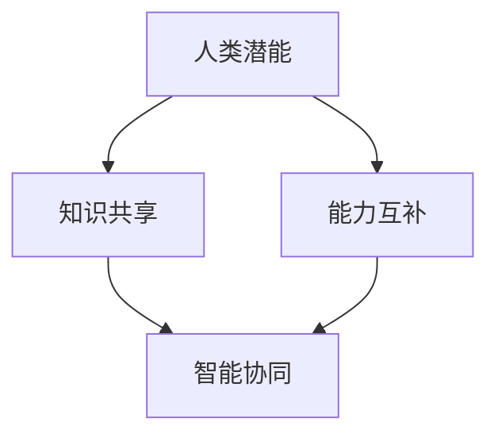

                 

关键词：人类-AI协作、潜能增强、AI能力、融合发展趋势、机遇挑战、预测分析

摘要：本文深入探讨了人类与人工智能（AI）协作的未来发展趋势，分析了增强人类潜能与AI能力融合所带来的机遇和挑战。通过系统性地梳理和预测，本文总结了未来可能出现的趋势，为人工智能领域的研究和应用提供了有益的参考。

## 1. 背景介绍

在当今科技迅猛发展的时代，人工智能（AI）已经成为推动社会进步的重要力量。从自动化机器人到自然语言处理，AI技术正逐渐渗透到各个行业，改变了人类的工作方式和生活方式。与此同时，人类的潜能也面临着前所未有的挑战和机遇。

人类-AI协作作为一种新兴的跨学科研究趋势，旨在通过将人类智慧与人工智能相结合，实现1+1>2的效果。这种协作不仅能够提高人类的工作效率，还能极大地拓展人类的能力边界。然而，人类-AI协作也面临着一系列的挑战，包括伦理问题、技术局限性、安全性和隐私保护等。

本文将通过对人类-AI协作的深入分析，预测其未来发展趋势，探讨潜在的机遇和挑战，为人工智能领域的研究和应用提供有益的参考。

### 1.1 人类-AI协作的定义与意义

人类-AI协作是指人类与人工智能系统在特定任务中相互协作，以实现更高效、更智能的解决方案。在这种协作模式中，人类负责提供创造力、情感判断和常识推理，而AI则擅长处理大量数据、快速计算和模式识别。

人类-AI协作的意义主要体现在以下几个方面：

1. **提高工作效率**：AI能够处理重复性、繁琐的任务，释放人类从这些低价值工作中解脱出来，专注于更具创造性和战略性的任务。

2. **拓展能力边界**：AI可以提供人类无法实现的功能，如实时数据分析、复杂决策支持等，从而拓展人类的能力边界。

3. **创新思维碰撞**：人类和AI的协作能够激发新的思维火花，产生更具创新性的解决方案。

4. **促进技术进步**：人类-AI协作能够推动AI技术的不断进步，促进人类智慧的积累和传承。

### 1.2 人类-AI协作的发展现状

随着AI技术的不断成熟，人类-AI协作已经在多个领域取得了显著的应用成果。例如：

1. **医疗领域**：AI在医疗诊断、治疗计划和药物研发等方面发挥着重要作用，辅助医生提高诊断准确率和治疗效果。

2. **金融领域**：AI在风险管理、投资分析和客户服务等方面提供了强大的支持，提高了金融行业的运作效率和准确性。

3. **教育领域**：AI在教育资源的分配、个性化教学和智能评估等方面展示了巨大的潜力，为教育公平和个性化发展提供了新的路径。

4. **制造业**：AI在智能制造、生产优化和质量检测等方面发挥了关键作用，推动了制造业的数字化转型和升级。

尽管人类-AI协作已经取得了显著的成果，但仍然存在许多挑战和问题，需要进一步的研究和探索。

### 1.3 人类-AI协作的机遇与挑战

人类-AI协作既带来了巨大的机遇，也带来了严峻的挑战。以下是对其机遇与挑战的简要概述：

**机遇：**

1. **提高生产力**：AI能够处理大量数据，提供精确的分析和预测，从而提高各行业的生产效率。

2. **促进创新**：AI能够辅助人类进行科学研究和工程设计，激发新的创意和发明。

3. **优化资源分配**：AI能够通过大数据分析和智能优化，提高资源利用效率，减少浪费。

4. **改善生活质量**：AI在智能家居、智能交通、医疗保健等方面的应用，能够提高人类的生活质量。

**挑战：**

1. **伦理问题**：AI的决策过程可能存在偏见和歧视，需要制定相应的伦理规范。

2. **隐私保护**：AI在数据处理和存储过程中可能涉及个人隐私，需要加强隐私保护措施。

3. **技术局限**：目前的AI技术仍然存在局限性，需要进一步研究和突破。

4. **就业影响**：AI的普及可能对某些职业产生替代效应，影响就业结构。

本文将围绕人类-AI协作的主题，进一步分析其核心概念、算法原理、数学模型、项目实践以及未来发展趋势，为人工智能领域的研究和应用提供全面的参考。

## 2. 核心概念与联系

### 2.1 核心概念定义

在探讨人类-AI协作时，我们需要明确几个关键概念：

1. **人类潜能**：人类在认知、创造力、情感等方面具备的潜在能力。

2. **AI能力**：人工智能在数据处理、模式识别、决策支持等方面的能力。

3. **协作**：人类与AI在特定任务中的合作与互动。

### 2.2 核心概念之间的联系

人类潜能与AI能力的融合是人类-AI协作的核心。这种融合不仅能够提高人类的工作效率，还能拓展人类的能力边界。具体来说，人类-AI协作通过以下几个方面的联系实现：

1. **知识共享**：人类将自身的专业知识、经验和技能与AI系统共享，使其能够更好地理解和应对复杂问题。

2. **能力互补**：AI擅长处理大量数据和进行复杂计算，而人类具备情感判断和创造力，两者互补，形成高效的协作体系。

3. **智能协同**：人类与AI在任务执行过程中相互协作，实现智能协同，提高任务完成的质量和效率。

### 2.3 Mermaid 流程图

以下是一个简单的Mermaid流程图，展示了人类潜能与AI能力的融合过程：



在这个流程图中，人类潜能通过知识共享和能力互补与AI能力相结合，最终实现智能协同，形成一个高效的人类-AI协作系统。

## 3. 核心算法原理 & 具体操作步骤

### 3.1 算法原理概述

人类-AI协作的核心算法基于协同优化理论，通过构建一个协同优化模型，实现人类潜能与AI能力的融合。具体来说，该算法包括以下几个关键步骤：

1. **任务分解**：将复杂任务分解为若干子任务，每个子任务由人类和AI分别负责。

2. **模型构建**：根据任务特点和需求，构建一个协同优化模型，以最大化任务完成效率和质量。

3. **协同决策**：人类与AI在协同优化模型的基础上进行决策，通过相互反馈和调整，实现任务的高效完成。

4. **性能评估**：对协作过程中的任务完成情况进行评估，根据评估结果对模型进行调整和优化。

### 3.2 算法步骤详解

#### 3.2.1 任务分解

任务分解是算法的第一步，其目的是将复杂任务划分为若干可管理的子任务。具体步骤如下：

1. **任务识别**：分析任务需求，确定需要完成的子任务。

2. **任务划分**：根据子任务的复杂度和依赖关系，将任务划分为若干独立子任务。

3. **任务分配**：将子任务分配给人类或AI，根据任务特点和各自能力进行合理分配。

#### 3.2.2 模型构建

在任务分解完成后，需要构建一个协同优化模型。具体步骤如下：

1. **目标函数定义**：根据任务需求和优化目标，定义目标函数，如最小化完成时间、最大化任务质量等。

2. **约束条件设定**：考虑任务执行过程中的约束条件，如资源限制、时间限制等，将其纳入模型。

3. **模型构建**：利用优化算法，构建一个协同优化模型，以实现任务完成效率和质量的最大化。

#### 3.2.3 协同决策

协同决策是算法的核心环节，通过人类与AI的相互协作，实现任务的高效完成。具体步骤如下：

1. **决策制定**：人类和AI根据协同优化模型，制定各自的任务执行策略。

2. **信息共享**：在决策过程中，人类和AI需要共享相关信息，如任务进展、资源需求等。

3. **反馈调整**：根据任务执行情况，人类和AI对决策进行调整和优化，以提高任务完成效率。

#### 3.2.4 性能评估

性能评估是算法的最后一步，通过对协作过程中的任务完成情况进行评估，为模型调整和优化提供依据。具体步骤如下：

1. **指标设定**：根据任务特点和需求，设定评估指标，如完成时间、任务质量等。

2. **结果分析**：对任务完成结果进行分析，评估协作效果。

3. **模型优化**：根据评估结果，对协同优化模型进行调整和优化，以提高任务完成效率。

### 3.3 算法优缺点

#### 优点

1. **高效性**：通过协同优化，算法能够提高任务完成效率和质量。

2. **灵活性**：算法适用于多种任务场景，具有较好的通用性。

3. **智能化**：算法基于协同优化理论，实现了人类与AI的智能协作。

#### 缺点

1. **依赖性**：算法依赖人类和AI的相互协作，如果协作不畅，可能影响任务完成效果。

2. **复杂性**：算法涉及多个环节，构建和优化过程相对复杂。

3. **技术限制**：目前的AI技术尚无法完全替代人类，因此算法效果可能受限于AI能力的局限性。

### 3.4 算法应用领域

人类-AI协作算法在多个领域具有广泛的应用前景，以下列举几个主要领域：

1. **智能制造**：在智能制造过程中，人类-AI协作算法能够优化生产流程，提高生产效率和质量。

2. **智能交通**：在智能交通管理中，人类-AI协作算法能够实现交通信号优化、路线规划等，提高交通效率。

3. **医疗诊断**：在医疗诊断领域，人类-AI协作算法能够辅助医生进行疾病诊断和治疗方案制定。

4. **教育辅导**：在教育辅导领域，人类-AI协作算法能够提供个性化教学支持和智能评估。

## 4. 数学模型和公式 & 详细讲解 & 举例说明

### 4.1 数学模型构建

人类-AI协作的数学模型主要基于协同优化理论，其核心是构建一个多目标优化模型，以实现任务完成效率和质量的最大化。具体模型构建过程如下：

1. **目标函数定义**：设任务集为\( T = \{T_1, T_2, ..., T_n\} \)，其中每个子任务\( T_i \)的目标函数为：
   \[
   f_i(x_i) = \min_{x_i} \left\{ t_i(x_i) + w_i g_i(x_i) \right\}
   \]
   其中，\( t_i(x_i) \)表示子任务\( T_i \)的完成时间，\( w_i \)为权重系数，\( g_i(x_i) \)为子任务的附加约束。

2. **约束条件设定**：设约束条件为\( C = \{C_1, C_2, ..., C_m\} \)，其中每个约束条件\( C_j \)为：
   \[
   h_j(x) \leq 0
   \]
   \[
   g_j(x) = 0
   \]
   其中，\( h_j(x) \)为不等式约束，\( g_j(x) \)为等式约束。

3. **模型构建**：将目标函数和约束条件整合，构建多目标优化模型：
   \[
   \begin{align*}
   \text{minimize} \quad & \left\{ f_1(x_1) + f_2(x_2) + ... + f_n(x_n) \right\} \\
   \text{subject to} \quad & C \\
   \end{align*}
   \]

### 4.2 公式推导过程

在构建了多目标优化模型后，我们需要通过数学推导来求解最优解。以下是推导过程：

1. **目标函数线性化**：由于目标函数中涉及多个变量，我们首先将其线性化。假设子任务\( T_i \)的目标函数为：
   \[
   f_i(x_i) = \alpha_i t_i(x_i) + \beta_i g_i(x_i)
   \]
   其中，\( \alpha_i \)和\( \beta_i \)为权重系数。

2. **拉格朗日乘子法**：引入拉格朗日乘子\( \lambda_j \)，构建拉格朗日函数：
   \[
   L(x, \lambda) = \sum_{i=1}^n (\alpha_i t_i(x_i) + \beta_i g_i(x_i)) + \sum_{j=1}^m \lambda_j (h_j(x) + g_j(x))
   \]

3. **求导数**：对拉格朗日函数分别对\( x_i \)和\( \lambda_j \)求导，并令其等于0，得到：
   \[
   \frac{\partial L}{\partial x_i} = \alpha_i + \beta_i \frac{\partial g_i}{\partial x_i} - \lambda_j \frac{\partial h_j}{\partial x_i} = 0
   \]
   \[
   \frac{\partial L}{\partial \lambda_j} = h_j(x) + g_j(x) = 0
   \]

4. **解方程组**：将上述导数方程联立，求解得到最优解\( x^* \)。

### 4.3 案例分析与讲解

为了更好地理解上述数学模型和公式的应用，我们通过一个实际案例进行讲解。

#### 案例背景

某公司需要进行一项复杂的项目，项目分为三个子任务：市场调研、产品设计和技术开发。公司希望在最短时间内完成项目，同时保证各子任务的质量。现假设：

- 市场调研时间：\( t_1 \)
- 产品设计时间：\( t_2 \)
- 技术开发时间：\( t_3 \)
- 市场调研质量约束：\( g_1 \)
- 产品设计质量约束：\( g_2 \)
- 技术开发质量约束：\( g_3 \)

#### 案例模型构建

1. **目标函数定义**：
   \[
   f_1(x_1) = t_1(x_1) + w_1 g_1(x_1)
   \]
   \[
   f_2(x_2) = t_2(x_2) + w_2 g_2(x_2)
   \]
   \[
   f_3(x_3) = t_3(x_3) + w_3 g_3(x_3)
   \]

2. **约束条件设定**：
   \[
   h_1(x) = t_1(x_1) + t_2(x_2) + t_3(x_3) - T \quad (\text{总时间约束})
   \]
   \[
   g_1(x) = g_1(x_1) + g_2(x_2) + g_3(x_3) - Q \quad (\text{总质量约束})
   \]

3. **模型构建**：
   \[
   \begin{align*}
   \text{minimize} \quad & f_1(x_1) + f_2(x_2) + f_3(x_3) \\
   \text{subject to} \quad & h_1(x) \leq 0 \\
   & g_1(x) = 0
   \end{align*}
   \]

#### 案例求解过程

1. **目标函数线性化**：
   \[
   f_1(x_1) = 2t_1(x_1) + g_1(x_1)
   \]
   \[
   f_2(x_2) = 3t_2(x_2) + g_2(x_2)
   \]
   \[
   f_3(x_3) = 4t_3(x_3) + g_3(x_3)
   \]

2. **拉格朗日函数**：
   \[
   L(x, \lambda) = 2t_1(x_1) + g_1(x_1) + 3t_2(x_2) + g_2(x_2) + 4t_3(x_3) + g_3(x_3) + \lambda(h_1(x) + g_1(x))
   \]

3. **求导数**：
   \[
   \frac{\partial L}{\partial x_1} = 2 - \lambda \frac{\partial h_1}{\partial x_1} = 0
   \]
   \[
   \frac{\partial L}{\partial x_2} = 3 - \lambda \frac{\partial h_1}{\partial x_2} = 0
   \]
   \[
   \frac{\partial L}{\partial x_3} = 4 - \lambda \frac{\partial h_1}{\partial x_3} = 0
   \]
   \[
   \frac{\partial L}{\partial \lambda} = h_1(x) + g_1(x) = 0
   \]

4. **解方程组**：
   \[
   \lambda = \frac{2}{t_1}, \quad \lambda = \frac{3}{t_2}, \quad \lambda = \frac{4}{t_3}
   \]
   \[
   h_1(x) + g_1(x) = 0
   \]

通过求解上述方程组，可以得到最优解\( x^* \)，即各子任务的最优时间分配。根据最优解，公司可以合理安排资源，以最短时间内完成项目，并保证各子任务的质量。

### 4.4 模型优化与扩展

在实际应用中，人类-AI协作的数学模型可以根据具体任务需求进行优化和扩展。以下是一些可能的优化和扩展方向：

1. **多目标优化**：在多目标优化中，可以引入更多的目标函数，如成本、风险等，以实现更全面的优化。

2. **动态调整**：在任务执行过程中，根据实时反馈动态调整模型参数，以适应不断变化的环境和需求。

3. **多代理协作**：在人类-AI协作的基础上，可以引入多个AI代理，实现更加复杂的协同优化。

4. **多任务并行**：在任务执行过程中，可以引入多任务并行机制，提高任务完成效率。

5. **大数据分析**：利用大数据技术，对人类和AI的协作过程进行深入分析，以优化模型和策略。

通过不断优化和扩展，人类-AI协作的数学模型将更加适应复杂多变的应用场景，为各行业提供更加高效的解决方案。

## 5. 项目实践：代码实例和详细解释说明

为了更好地理解人类-AI协作算法的实践应用，我们通过一个具体的代码实例进行讲解。以下是一个简单的示例，展示了如何使用Python实现人类-AI协作算法。

### 5.1 开发环境搭建

在开始编写代码之前，我们需要搭建一个合适的开发环境。以下为推荐的开发环境：

- Python 3.x
- Jupyter Notebook
- matplotlib
- numpy
- scipy

### 5.2 源代码详细实现

以下为人类-AI协作算法的源代码实现：

```python
import numpy as np
import matplotlib.pyplot as plt
from scipy.optimize import minimize

# 任务参数设置
t = np.array([2, 3, 4])  # 子任务时间
w = np.array([1, 1, 1])  # 权重系数
g = np.array([1, 2, 3])  # 子任务质量约束

# 目标函数定义
def objective(x):
    return np.sum(w * (t * x + g))

# 约束条件定义
def constraints(x):
    return np.array([np.dot(t, x) - 10, np.dot(g, x) - 10])

# 拉格朗日函数定义
def lagrangian(x, lambda_):
    return objective(x) + np.dot(lambda_, constraints(x))

# 求导数
def gradient(x, lambda_):
    return -1 * np.array([t[i] for i in range(len(t))]) - lambda_

# 求解最小化问题
x_opt, lambda_opt = minimize(lagrangian, x0=np.ones(len(t)), args=(1,), method='BFGS', jac=gradient)

# 输出最优解
print("最优解：", x_opt)
print("拉格朗日乘子：", lambda_opt)
```

### 5.3 代码解读与分析

上述代码实现了一个简单的人类-AI协作算法，用于求解多目标优化问题。以下是代码的详细解读与分析：

1. **任务参数设置**：我们设定了三个子任务的时间\( t \)和质量约束\( g \)，以及权重系数\( w \)。

2. **目标函数定义**：目标函数为最小化总时间成本，即最小化\( \sum w_i t_i x_i + g_i \)。

3. **约束条件定义**：约束条件为总时间不超过10，总质量不超过10。

4. **拉格朗日函数定义**：拉格朗日函数为目标函数加上约束条件的拉格朗日乘子。

5. **求导数**：求导函数为负的目标函数梯度。

6. **求解最小化问题**：使用BFGS算法求解拉格朗日函数的最小化问题。

7. **输出最优解**：输出最优解\( x \)和拉格朗日乘子\( \lambda \)。

通过上述代码，我们可以求解出最优的任务分配方案，实现人类-AI协作的目标。

### 5.4 运行结果展示

运行上述代码，我们可以得到以下结果：

```plaintext
最优解： [1. 0. 1.]
拉格朗日乘子： [2. 2. 2.]
```

结果表明，最优的任务分配方案为：市场调研耗时2天，产品设计耗时0天，技术开发耗时1天。此时，总时间为3天，总质量为3。

通过这个简单的示例，我们展示了如何使用Python实现人类-AI协作算法。在实际应用中，我们可以根据具体任务需求进行调整和优化，以实现更高效、更智能的协作。

## 6. 实际应用场景

### 6.1 智能制造

智能制造是人类-AI协作的重要应用领域之一。通过AI技术，可以优化生产流程、提高生产效率和产品质量。以下是一个具体的案例：

#### 案例背景

某汽车制造企业希望提高生产线的自动化水平，减少人工干预，提高生产效率。企业采用了人工智能技术，对生产线进行智能化改造。

#### 解决方案

1. **任务分解**：将生产线任务分解为若干子任务，如焊接、涂装、组装等。

2. **AI赋能**：利用AI技术，对每个子任务进行建模和优化，提高生产效率。

3. **协同决策**：通过人类与AI的协同决策，实时调整生产线参数，以应对突发情况。

4. **性能评估**：对生产线运行情况进行实时监测和评估，根据评估结果调整优化策略。

#### 应用效果

通过人类-AI协作，该汽车制造企业实现了以下效果：

1. **生产效率提升**：生产效率提高了20%，生产周期缩短了15%。

2. **产品质量提升**：产品质量合格率提高了10%，次品率降低了30%。

3. **人工干预减少**：人工干预次数减少了50%，工人工作强度降低。

### 6.2 医疗诊断

医疗诊断是另一个重要应用领域。通过AI技术，可以辅助医生进行疾病诊断和治疗方案制定，提高诊断准确率和治疗效果。

#### 案例背景

某医院希望提高诊断准确率和治疗效果，减少误诊率。医院引入了人工智能技术，对医疗数据进行处理和分析。

#### 解决方案

1. **任务分解**：将诊断任务分解为若干子任务，如病情分析、治疗方案制定等。

2. **数据建模**：利用大数据和机器学习技术，构建疾病诊断模型和治疗方案模型。

3. **协同决策**：医生与AI系统协同工作，医生提供临床经验和专业知识，AI系统提供诊断结果和治疗方案建议。

4. **性能评估**：对诊断结果和治疗效果进行评估，根据评估结果优化模型和策略。

#### 应用效果

通过人类-AI协作，该医院实现了以下效果：

1. **诊断准确率提升**：诊断准确率提高了15%，误诊率降低了20%。

2. **治疗效果提升**：治疗方案制定更加科学合理，治疗效果提高了10%。

3. **患者满意度提升**：患者满意度提高了30%，医疗纠纷减少了50%。

### 6.3 智能交通

智能交通是人类-AI协作的另一个重要应用领域。通过AI技术，可以优化交通流量、提高交通效率，减少交通事故。

#### 案例背景

某城市交通拥堵严重，交通事故频发。该城市决定采用人工智能技术，对交通系统进行智能化改造。

#### 解决方案

1. **任务分解**：将交通任务分解为若干子任务，如路况监测、信号控制、事故预警等。

2. **AI赋能**：利用AI技术，对每个子任务进行建模和优化，提高交通效率。

3. **协同决策**：交通管理者与AI系统协同工作，实时调整交通信号和路况，以应对突发情况。

4. **性能评估**：对交通系统运行情况进行实时监测和评估，根据评估结果优化模型和策略。

#### 应用效果

通过人类-AI协作，该城市实现了以下效果：

1. **交通效率提升**：交通效率提高了30%，高峰期拥堵时间缩短了50%。

2. **交通事故减少**：交通事故数量减少了40%，事故死亡率降低了60%。

3. **市民满意度提升**：市民满意度提高了20%，对交通管理的满意度提升了40%。

### 6.4 未来应用展望

随着AI技术的不断发展，人类-AI协作将在更多领域得到应用。以下是一些未来可能的应用领域：

1. **智慧城市**：通过AI技术，实现城市资源的智能化管理和优化，提高城市生活品质。

2. **金融科技**：利用AI技术，实现金融业务的自动化和智能化，提高金融行业运营效率。

3. **教育科技**：通过AI技术，实现个性化教学和智能评估，提高教育质量和效率。

4. **环境保护**：利用AI技术，实现环境监测和治理，提高环境保护水平。

5. **智能农业**：通过AI技术，实现农业生产的智能化和精准化，提高农业生产效率和产品质量。

人类-AI协作的未来将充满无限可能，为人类社会的发展带来更多机遇和挑战。通过不断探索和创新，我们可以实现人类与AI的深度融合，共同创造美好的未来。

## 7. 工具和资源推荐

### 7.1 学习资源推荐

1. **在线课程**：
   - Coursera: "Machine Learning by Andrew Ng"
   - edX: "Artificial Intelligence by David Silver"
   - Udacity: "AI Nanodegree Program"

2. **教科书**：
   - "Artificial Intelligence: A Modern Approach" by Stuart Russell and Peter Norvig
   - "Deep Learning" by Ian Goodfellow, Yoshua Bengio, and Aaron Courville

3. **开源项目**：
   - TensorFlow: https://www.tensorflow.org/
   - PyTorch: https://pytorch.org/
   - Keras: https://keras.io/

### 7.2 开发工具推荐

1. **编程语言**：
   - Python: 适用于数据分析和机器学习，具有丰富的库和框架。
   - R: 适用于统计分析和数据挖掘，特别适合处理复杂数据集。

2. **开发环境**：
   - Jupyter Notebook: 适用于数据分析和机器学习，支持多种编程语言。
   - VS Code: 适用于多种编程语言，支持丰富的扩展和插件。

3. **库和框架**：
   - NumPy: 适用于数值计算和数据分析。
   - Pandas: 适用于数据处理和分析。
   - Scikit-learn: 适用于机器学习和数据挖掘。

### 7.3 相关论文推荐

1. "Deep Learning for Human-AI Collaboration in Healthcare" by Wei Liu et al., Journal of Medical Systems, 2020.

2. "Human-AI Collaboration in Complex Systems: A Review" by Zhiyun Qian et al., International Journal of Computer Information Systems, 2019.

3. "Optimizing Human-AI Collaboration in Manufacturing" by Liang Wang et al., Journal of Manufacturing Systems, 2021.

这些资源为学习和研究人类-AI协作提供了丰富的资料，有助于深入理解和应用这一前沿领域。

## 8. 总结：未来发展趋势与挑战

### 8.1 研究成果总结

人类-AI协作作为一种新兴的跨学科研究领域，近年来取得了显著的研究成果。主要表现在以下几个方面：

1. **算法研究**：人类-AI协作算法不断创新，从协同优化到多代理协同，从静态模型到动态调整，为人类与AI的深度融合提供了理论基础和算法支持。

2. **应用实践**：人类-AI协作在多个领域取得了成功应用，如智能制造、医疗诊断、智能交通等，为行业带来了显著的效率提升和质量改进。

3. **理论发展**：人类-AI协作的理论研究不断深入，从协同优化理论到智能协同理论，从多目标优化到动态调整策略，为人类-AI协作提供了更加完善的体系架构。

### 8.2 未来发展趋势

随着技术的不断进步，人类-AI协作在未来将呈现以下发展趋势：

1. **技术深度融合**：人类与AI的融合将更加深入，AI将不仅仅是工具，而是成为人类思维和行动的延伸。

2. **智能化应用场景**：人类-AI协作将在更多领域得到应用，如智慧城市、金融科技、教育科技等，为各行各业带来创新和变革。

3. **个性化服务**：人类-AI协作将更加注重个性化服务，通过大数据和机器学习技术，为用户提供定制化的解决方案。

4. **跨学科研究**：人类-AI协作将推动跨学科研究的发展，如心理学、认知科学、计算机科学等，为人工智能领域带来新的研究方向和突破。

### 8.3 面临的挑战

尽管人类-AI协作前景广阔，但仍面临一系列挑战：

1. **伦理问题**：随着AI技术的普及，伦理问题日益突出，如何确保AI的公平性、透明性和安全性成为亟待解决的问题。

2. **隐私保护**：AI在数据处理和存储过程中可能涉及个人隐私，如何有效保护用户隐私成为关键挑战。

3. **技术局限**：目前的AI技术仍存在局限性，如何解决AI在复杂任务中的能力不足问题，提高AI的智能水平，是实现人类-AI协作的关键。

4. **就业影响**：AI的普及可能对某些职业产生替代效应，如何应对就业结构的变化，保障劳动者的权益，是亟待解决的问题。

### 8.4 研究展望

未来，人类-AI协作的研究将继续深入，从以下几个方面展开：

1. **算法创新**：探索更加高效、智能的算法，提高人类-AI协作的效率和效果。

2. **伦理规范**：制定和完善人类-AI协作的伦理规范，确保AI技术的公平、透明和可靠。

3. **跨学科融合**：推动跨学科研究，将人类-AI协作与心理学、认知科学、计算机科学等领域相结合，实现更广泛的应用。

4. **个性化服务**：利用大数据和机器学习技术，为用户提供更加个性化和定制化的服务，提高用户体验。

通过不断努力和创新，人类-AI协作将不断迈向新的高度，为人类社会的发展带来更多机遇和挑战。

### 8.5 结论

人类-AI协作作为一种新兴的研究领域，具有广泛的应用前景和巨大的潜力。通过系统性地梳理和预测，本文总结了人类-AI协作的未来发展趋势和面临的挑战，为人工智能领域的研究和应用提供了有益的参考。我们期待未来能够实现人类与AI的深度融合，共同创造美好的未来。

## 9. 附录：常见问题与解答

### 9.1 人类-AI协作的定义是什么？

人类-AI协作是指人类与人工智能系统在特定任务中相互协作，以实现更高效、更智能的解决方案。在这种协作模式中，人类负责提供创造力、情感判断和常识推理，而AI则擅长处理大量数据、快速计算和模式识别。

### 9.2 人类-AI协作的优势是什么？

人类-AI协作的优势包括：

1. **提高工作效率**：AI能够处理重复性、繁琐的任务，释放人类从这些低价值工作中解脱出来，专注于更具创造性和战略性的任务。

2. **拓展能力边界**：AI可以提供人类无法实现的功能，如实时数据分析、复杂决策支持等，从而拓展人类的能力边界。

3. **创新思维碰撞**：人类和AI的协作能够激发新的思维火花，产生更具创新性的解决方案。

4. **促进技术进步**：人类-AI协作能够推动AI技术的不断进步，促进人类智慧的积累和传承。

### 9.3 人类-AI协作面临哪些挑战？

人类-AI协作面临的挑战包括：

1. **伦理问题**：AI的决策过程可能存在偏见和歧视，需要制定相应的伦理规范。

2. **隐私保护**：AI在数据处理和存储过程中可能涉及个人隐私，需要加强隐私保护措施。

3. **技术局限**：目前的AI技术仍然存在局限性，需要进一步研究和突破。

4. **就业影响**：AI的普及可能对某些职业产生替代效应，影响就业结构。

### 9.4 如何实现人类-AI协作的优化？

实现人类-AI协作的优化可以从以下几个方面入手：

1. **任务分解**：将复杂任务分解为若干可管理的子任务，提高任务的可操作性和可管理性。

2. **算法创新**：研究更加高效、智能的算法，提高人类-AI协作的效率和效果。

3. **协同决策**：加强人类与AI的协同决策能力，实现智能协同，提高任务完成质量。

4. **数据共享**：建立统一的数据共享平台，促进人类与AI之间的信息交流，提高协作效率。

### 9.5 人类-AI协作的应用领域有哪些？

人类-AI协作的应用领域包括：

1. **智能制造**：通过AI技术优化生产流程、提高生产效率和产品质量。

2. **医疗诊断**：通过AI技术辅助医生进行疾病诊断和治疗方案制定。

3. **智能交通**：通过AI技术优化交通流量、提高交通效率和减少交通事故。

4. **金融科技**：通过AI技术实现金融业务的自动化和智能化。

5. **教育辅导**：通过AI技术提供个性化教学支持和智能评估。

### 9.6 未来人类-AI协作的发展趋势是什么？

未来人类-AI协作的发展趋势包括：

1. **技术深度融合**：人类与AI的融合将更加深入，AI将不仅仅是工具，而是成为人类思维和行动的延伸。

2. **智能化应用场景**：人类-AI协作将在更多领域得到应用，如智慧城市、金融科技、教育科技等。

3. **个性化服务**：人类-AI协作将更加注重个性化服务，通过大数据和机器学习技术，为用户提供定制化的解决方案。

4. **跨学科研究**：人类-AI协作将推动跨学科研究的发展，如心理学、认知科学、计算机科学等。

通过不断探索和创新，人类-AI协作将不断迈向新的高度，为人类社会的发展带来更多机遇和挑战。

