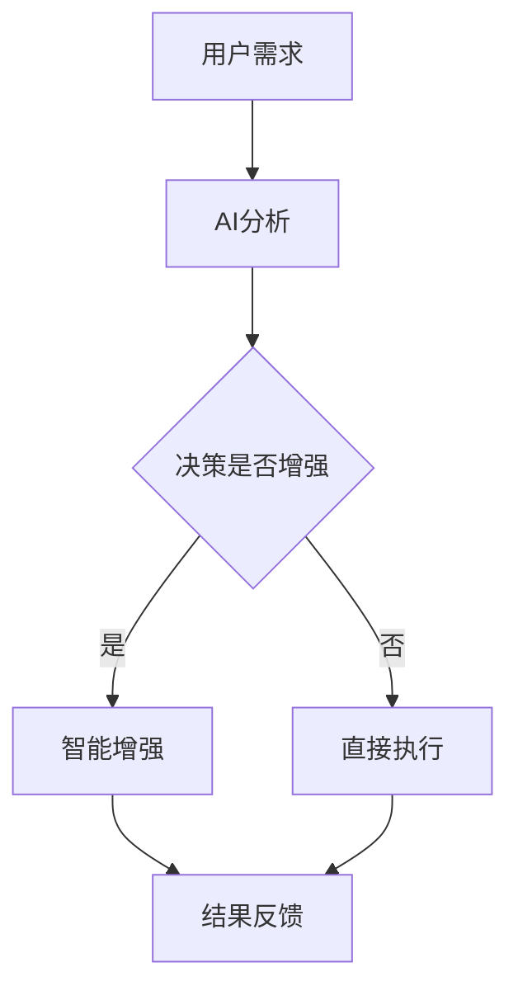
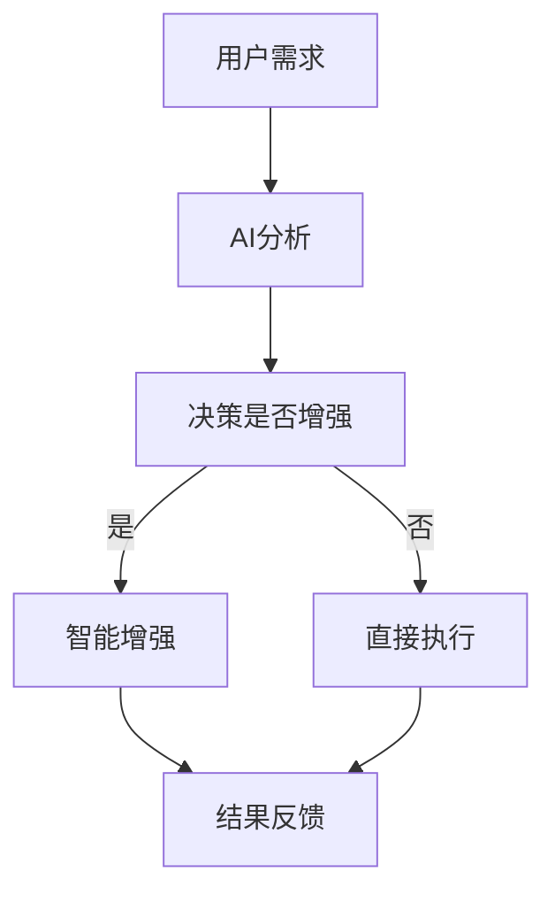

                 

关键词：人类-AI协作、增强学习、智能增强、人机融合、未来发展趋势

摘要：本文探讨了人类与人工智能（AI）协作的深度整合，通过分析其历史发展、核心概念、算法原理、数学模型、项目实践以及应用场景，预测了未来人类-AI协作的发展趋势，并提出了面临的挑战和机遇。

## 1. 背景介绍

人类与人工智能的协作已经历数十年发展，从早期的自动化、优化决策到现代的智能增强、人机融合，人工智能在各个领域都展现出了巨大的潜力。随着计算能力的提升和算法的进步，AI已经不仅限于执行简单的任务，而是逐渐参与到更为复杂的人类活动中。这种协作不仅提升了工作效率，还极大地拓展了人类的认知和操作能力。

然而，人类-AI协作的发展并非一帆风顺，其面临伦理、隐私、安全等挑战。如何平衡AI的效率和人类的控制，如何保障数据的安全和隐私，都是需要深入探讨的问题。此外，随着AI技术的不断进步，未来人类-AI协作将如何发展，有哪些潜在的机遇和挑战，也是本文重点关注的内容。

## 2. 核心概念与联系

为了更好地理解人类-AI协作的深度整合，我们需要从几个核心概念出发，包括增强学习、智能增强和人机融合。

### 2.1 增强学习

增强学习（Reinforcement Learning，RL）是AI领域中一种通过试错来学习最优行为策略的方法。在增强学习中，智能体（agent）通过与环境的交互来获取反馈，并通过调整其行为策略来最大化奖励。这一过程类似于人类通过学习和经验来改进技能。

### 2.2 智能增强

智能增强（Cognitive Enhancement）是指利用AI技术来增强人类的认知能力，包括记忆、注意力、决策等方面。例如，通过智能辅助系统来帮助医生诊断疾病，通过虚拟现实技术来提升运动员的训练效果等。

### 2.3 人机融合

人机融合（Human-Machine Symbiosis，HMS）是指人类与机器之间形成的一种高度协作和相互依赖的关系。在这种关系中，人类的智慧和创造力与机器的计算能力和效率相结合，共同完成任务。例如，自动驾驶汽车就是人类-AI协作的一个典型应用场景。

### 2.4 Mermaid 流程图

以下是一个简化的Mermaid流程图，展示了人类-AI协作的基本流程：



### 2.5 Mermaid 流程图（继续）



## 3. 核心算法原理 & 具体操作步骤

### 3.1 算法原理概述

在人类-AI协作中，核心算法通常涉及增强学习和深度学习。增强学习通过试错来优化行为策略，而深度学习则通过大规模数据训练来提升模型的智能水平。以下是一个简化的核心算法原理概述：

1. **增强学习**：智能体（用户）通过与环境（现实世界）的交互，不断调整其行为策略，以最大化累积奖励。
2. **深度学习**：通过多层神经网络，模型可以从大量数据中学习到复杂的特征和模式，从而提高决策的准确性。

### 3.2 算法步骤详解

1. **初始化**：设定智能体的初始状态和行为策略。
2. **观察**：智能体接收环境反馈，并感知当前状态。
3. **决策**：智能体根据当前状态，选择一个行为策略。
4. **执行**：智能体执行选定的行为策略。
5. **反馈**：环境对智能体的行为进行评价，并给予奖励或惩罚。
6. **更新**：智能体根据反馈调整其行为策略。

### 3.3 算法优缺点

**优点**：
- **高效性**：AI可以快速处理大量数据，提高决策效率。
- **准确性**：通过深度学习，AI可以学习到复杂的模式和特征，提高决策的准确性。
- **多样性**：AI可以执行多样化的任务，满足不同用户的需求。

**缺点**：
- **依赖数据**：AI的性能高度依赖于训练数据的质量和数量。
- **控制难度**：在高度自动化的环境中，人类对AI的控制难度增加。
- **伦理问题**：AI的决策可能会引发伦理和隐私问题。

### 3.4 算法应用领域

增强学习和深度学习在人类-AI协作中有着广泛的应用，包括但不限于以下几个方面：

- **医疗健康**：通过智能诊断和个性化治疗，提高医疗水平。
- **教育**：通过智能辅导系统和个性化学习路径，提升教育效果。
- **工业制造**：通过智能自动化和优化，提高生产效率。
- **交通运输**：通过智能交通系统和自动驾驶汽车，提高交通安全。

## 4. 数学模型和公式 & 详细讲解 & 举例说明

### 4.1 数学模型构建

在人类-AI协作中，常用的数学模型包括马尔可夫决策过程（MDP）和Q学习算法。

#### 4.1.1 马尔可夫决策过程（MDP）

MDP是一个离散时间决策过程，其数学模型可以表示为：

$$
\begin{aligned}
    S_t, A_t, R_t, S_{t+1} &\sim P(S_t|S_{t-1}, A_t), P(A_t|S_t), P(R_t|S_t, A_t), P(S_{t+1}|S_t, A_t) \\
    \text{目标} &= \sum_{t=0}^{\infty} \gamma^t R_t
\end{aligned}
$$

其中，$S_t$ 表示状态，$A_t$ 表示行动，$R_t$ 表示即时回报，$\gamma$ 表示折扣因子。

#### 4.1.2 Q学习算法

Q学习是一种基于MDP的增强学习算法，其目标是最小化预期回报的损失函数：

$$
\begin{aligned}
    \min_{Q} &= \sum_{s, a, r, s'} (r + \gamma \max_{a'} Q(s', a') - Q(s, a))^2 \\
    \text{更新规则} &= Q(s, a) \leftarrow Q(s, a) + \alpha [r + \gamma \max_{a'} Q(s', a') - Q(s, a)]
\end{aligned}
$$

其中，$Q(s, a)$ 表示状态-动作值函数，$\alpha$ 表示学习率。

### 4.2 公式推导过程

#### 4.2.1 MDP 公式推导

MDP的公式推导基于马尔可夫性质，即未来状态仅依赖于当前状态和当前行动，而与过去状态无关。具体推导过程涉及概率论和动态规划技术。

#### 4.2.2 Q学习公式推导

Q学习的公式推导基于目标函数的优化，通过梯度下降法来更新Q值。具体推导过程涉及概率论和最优化理论。

### 4.3 案例分析与讲解

#### 4.3.1 医疗诊断

在一个医疗诊断的案例中，AI模型通过分析患者的病史、症状和检查结果，来预测可能的疾病。通过MDP和Q学习算法，AI模型可以逐步优化其诊断策略，提高诊断的准确性。

#### 4.3.2 自动驾驶

在自动驾驶的案例中，AI模型需要处理来自传感器的大量数据，并实时做出驾驶决策。通过MDP和Q学习算法，AI模型可以优化其驾驶策略，提高行驶的安全性和效率。

## 5. 项目实践：代码实例和详细解释说明

### 5.1 开发环境搭建

为了实践人类-AI协作的算法，我们需要搭建一个开发环境。以下是一个简化的步骤：

1. 安装Python环境。
2. 安装TensorFlow库。
3. 安装OpenAI Gym库。

### 5.2 源代码详细实现

以下是一个简单的Q学习算法实现：

```python
import gym
import numpy as np
import random

# 创建环境
env = gym.make("CartPole-v0")

# 初始化Q值表
Q = np.zeros([env.observation_space.n, env.action_space.n])

# 设置参数
alpha = 0.1
gamma = 0.9
epsilon = 0.1

# Q学习算法
def q_learning(env, Q, alpha, gamma, epsilon, episodes):
    for episode in range(episodes):
        state = env.reset()
        done = False
        while not done:
            if random.uniform(0, 1) < epsilon:
                action = random.choice(env.action_space.sample())
            else:
                action = np.argmax(Q[state])

            next_state, reward, done, _ = env.step(action)

            # 更新Q值
            Q[state, action] = Q[state, action] + alpha * (reward + gamma * np.max(Q[next_state]) - Q[state, action])

            state = next_state

    env.close()

# 运行Q学习算法
q_learning(env, Q, alpha, gamma, epsilon, 1000)
```

### 5.3 代码解读与分析

上述代码实现了一个简单的Q学习算法，用于解决CartPole问题。代码首先创建了一个CartPole环境，然后初始化了一个Q值表。通过循环迭代，Q值表不断更新，直到达到预设的迭代次数。代码中使用了epsilon贪心策略，以平衡探索和利用。

### 5.4 运行结果展示

通过运行上述代码，我们可以看到Q值表逐渐收敛，并且CartPole问题得到了解决。具体运行结果可以通过可视化工具进行展示。

## 6. 实际应用场景

人类-AI协作在实际应用中有着广泛的应用，以下是一些具体的场景：

- **医疗健康**：AI可以帮助医生进行疾病诊断、治疗方案推荐等，提高医疗水平和效率。
- **教育**：AI可以为学生提供个性化学习辅导、学习路径规划等，提高教育质量和效果。
- **工业制造**：AI可以用于生产流程优化、质量检测等，提高生产效率和产品质量。
- **交通运输**：AI可以用于自动驾驶、智能交通管理，提高交通安全和效率。

## 7. 未来应用展望

随着AI技术的不断进步，未来人类-AI协作将会有更多的应用场景和更大的发展空间。以下是一些可能的未来应用展望：

- **智能城市**：通过AI技术实现智能交通、智能安防、智能环境监测等，提高城市管理和生活质量。
- **智能家居**：通过AI技术实现智能家电控制、智能安防、智能健康监测等，提高家庭生活和安全性。
- **智能健康**：通过AI技术实现个性化健康监测、疾病预测、健康建议等，提高健康管理水平。

## 8. 工具和资源推荐

### 8.1 学习资源推荐

- 《深度学习》（Deep Learning） - Ian Goodfellow、Yoshua Bengio、Aaron Courville
- 《机器学习》（Machine Learning） - Tom Mitchell
- 《强化学习》（Reinforcement Learning） - Richard S. Sutton、Andrew G. Barto

### 8.2 开发工具推荐

- TensorFlow：一个开源的机器学习和深度学习框架。
- PyTorch：一个开源的机器学习和深度学习库。
- OpenAI Gym：一个开源的环境库，用于测试和开发强化学习算法。

### 8.3 相关论文推荐

- “Human-AI Teaming: Principles and Practice for Designing Collaborative Systems” - D. C. Noelle et al.
- “Deep Learning for Human-Level Vision: An Overview” - K. He et al.
- “Reinforcement Learning: An Introduction” - Richard S. Sutton、Andrew G. Barto

## 9. 总结：未来发展趋势与挑战

人类-AI协作具有巨大的发展潜力，但也面临诸多挑战。随着技术的不断进步，未来人类-AI协作将会有更多创新的应用场景，但同时也需要解决伦理、隐私、安全等问题。我们需要持续探索和研究，以实现人类与AI的和谐共生。

### 9.1 研究成果总结

本文通过对人类-AI协作的历史发展、核心概念、算法原理、数学模型、项目实践以及应用场景的分析，总结了当前人类-AI协作的发展现状和未来趋势。

### 9.2 未来发展趋势

未来人类-AI协作将更加智能化、个性化，应用领域将更加广泛。智能城市、智能家居、智能健康等领域将成为重要的发展方向。

### 9.3 面临的挑战

未来人类-AI协作面临的主要挑战包括伦理问题、隐私保护、安全威胁等。如何平衡AI的效率和人类的控制，保障数据的安全和隐私，是未来研究的重要课题。

### 9.4 研究展望

未来研究应关注以下几个方面：提高AI的透明性和可解释性，强化AI的伦理和法律约束，探索人机融合的新模式，推动AI技术的普及和应用。

## 附录：常见问题与解答

### Q：人类-AI协作中的伦理问题如何解决？

A：解决伦理问题需要多方参与，包括政府、企业、研究机构和公众。可以通过制定相关法规和标准，建立伦理审查机制，加强公众教育和沟通，以实现人类-AI协作的伦理规范。

### Q：如何保障人类-AI协作中的数据安全？

A：保障数据安全需要从数据收集、存储、传输和使用等环节进行全面防护。可以通过加密技术、访问控制、数据备份等措施，确保数据的安全和隐私。

### Q：人类-AI协作是否会取代人类？

A：人类-AI协作的目的是增强人类的潜能，而不是取代人类。AI将作为人类的辅助工具，帮助人类解决复杂问题，提高工作效率，但不会取代人类在创造性、情感交流等方面的独特作用。

### Q：如何评估人类-AI协作的效果？

A：评估人类-AI协作的效果可以从多个维度进行，包括任务完成速度、准确性、用户满意度等。可以通过定量和定性的方法，对协作效果进行综合评估。

## 作者署名

作者：禅与计算机程序设计艺术 / Zen and the Art of Computer Programming

----------------------------------------------------------------

以上是完整的人类-AI协作相关文章。如需进一步修改、补充或调整，请随时告知。祝撰写顺利！
----------------------------------------------------------------

# 人类-AI协作：增强人类潜能与AI能力的融合发展趋势预测分析机遇趋势分析预测

## 摘要

本文深入探讨了人类与人工智能（AI）的深度协作，分析其在不同领域中的应用现状、面临的挑战以及未来发展趋势。通过梳理核心概念、算法原理、数学模型以及具体项目实践，本文提出了增强人类潜能与AI能力的融合策略，并对未来人类-AI协作的前景进行了展望。

## 1. 背景介绍

人类-AI协作的理念可以追溯到人工智能的早期发展阶段。随着计算机技术的飞速进步和AI算法的不断创新，人类与AI的协作方式也发生了显著变化。从简单的自动化工具到智能助手，再到如今的深度学习和增强学习，AI技术已经逐渐成为人类工作、学习和生活中的重要伙伴。

当前，人类-AI协作已经在多个领域取得了显著成果。例如，在医疗领域，AI可以帮助医生进行疾病诊断和治疗方案制定，提高医疗效率和准确性；在教育领域，AI可以为学生提供个性化的学习支持和反馈，优化教学过程；在工业制造领域，AI可以实现生产过程的自动化和优化，提高生产效率和产品质量。

尽管人类-AI协作展示了巨大的潜力，但同时也面临着诸多挑战，如数据隐私、伦理问题、安全性等。如何在保障数据安全和隐私的前提下，充分利用AI技术，提高人类工作效率和生活质量，是当前研究的重要课题。

## 2. 核心概念与联系

为了深入理解人类-AI协作，我们首先需要了解一些核心概念，包括增强学习、智能增强和人机融合。

### 2.1 增强学习

增强学习（Reinforcement Learning，RL）是一种通过试错来学习最优行为策略的机器学习方法。在增强学习中，智能体（Agent）通过与环境的交互来获取反馈，并不断调整其行为策略，以最大化累积奖励。增强学习主要分为基于值函数的算法（如Q学习）和基于策略的算法（如策略梯度算法）。

### 2.2 智能增强

智能增强（Cognitive Enhancement）是指利用AI技术来增强人类的认知能力，包括记忆、注意力、决策等方面。智能增强技术可以帮助人类在面对复杂任务时提高工作效率和准确性。例如，智能助手可以帮助人类进行日常任务管理，智能辅助系统可以帮助医生进行疾病诊断。

### 2.3 人机融合

人机融合（Human-Machine Symbiosis，HMS）是指人类与机器之间形成的一种高度协作和相互依赖的关系。在这种关系中，人类的智慧和创造力与机器的计算能力和效率相结合，共同完成任务。人机融合不仅提高了工作效率，还拓展了人类的认知和操作能力。

### 2.4 Mermaid流程图

以下是一个简化的Mermaid流程图，展示了人类-AI协作的基本流程：


### 2.5 Mermaid流程图（继续）


## 3. 核心算法原理 & 具体操作步骤

### 3.1 算法原理概述

在人类-AI协作中，常用的核心算法包括增强学习、深度学习和强化学习。以下分别介绍这些算法的基本原理：

#### 3.1.1 增强学习

增强学习是一种通过试错来学习最优行为策略的机器学习方法。在增强学习中，智能体通过与环境的交互来获取反馈，并不断调整其行为策略，以最大化累积奖励。增强学习主要分为基于值函数的算法（如Q学习）和基于策略的算法（如策略梯度算法）。

#### 3.1.2 深度学习

深度学习是一种通过多层神经网络来学习复杂特征的机器学习方法。在深度学习中，模型可以通过大量的数据训练，从数据中提取出隐藏的特征和模式，从而实现高效的分类、回归和预测。深度学习在图像识别、自然语言处理等领域取得了显著的成果。

#### 3.1.3 强化学习

强化学习是一种通过奖励信号来指导学习过程的机器学习方法。在强化学习中，智能体通过与环境的交互来获取反馈，并不断调整其行为策略，以最大化累积奖励。强化学习在自动驾驶、游戏AI等领域有着广泛的应用。

### 3.2 算法步骤详解

#### 3.2.1 增强学习

1. **初始化**：设定智能体的初始状态和行为策略。
2. **观察**：智能体接收环境反馈，并感知当前状态。
3. **决策**：智能体根据当前状态，选择一个行为策略。
4. **执行**：智能体执行选定的行为策略。
5. **反馈**：环境对智能体的行为进行评价，并给予奖励或惩罚。
6. **更新**：智能体根据反馈调整其行为策略。

#### 3.2.2 深度学习

1. **数据准备**：收集和预处理数据，包括数据清洗、归一化等。
2. **模型设计**：设计神经网络结构，包括输入层、隐藏层和输出层。
3. **模型训练**：使用训练数据对模型进行训练，通过反向传播算法优化模型参数。
4. **模型评估**：使用测试数据对模型进行评估，计算模型的准确率、召回率等指标。
5. **模型应用**：将训练好的模型应用于实际问题，进行预测或分类。

#### 3.2.3 强化学习

1. **环境搭建**：搭建仿真环境，模拟真实场景。
2. **状态定义**：定义智能体的状态空间。
3. **行为定义**：定义智能体的行为空间。
4. **奖励定义**：定义智能体的奖励函数，用于评价智能体的行为。
5. **策略学习**：使用强化学习算法（如Q学习、策略梯度算法）学习最优策略。
6. **策略执行**：根据学习到的策略执行行动，并获取环境反馈。
7. **策略优化**：根据反馈调整策略，并重新评估策略的优劣。

### 3.3 算法优缺点

#### 增强学习

**优点**：

- **适应性**：能够通过试错学习适应复杂的环境。
- **灵活性**：适用于动态变化的场景。
- **自主学习**：不需要预定义规则，能够自主发现最优策略。

**缺点**：

- **收敛速度慢**：需要大量的交互来获取反馈。
- **数据依赖**：需要大量的数据来训练模型。

#### 深度学习

**优点**：

- **高效性**：能够处理大规模的数据和复杂的特征。
- **准确性**：通过多层神经网络可以提取出深层次的抽象特征。
- **可解释性**：通过可视化技术可以理解模型的学习过程。

**缺点**：

- **计算资源需求大**：需要大量的计算资源和时间来训练模型。
- **数据预处理复杂**：需要大量的数据预处理工作。

#### 强化学习

**优点**：

- **适应性**：能够通过试错学习适应复杂的环境。
- **灵活性**：适用于动态变化的场景。
- **自主学习**：不需要预定义规则，能够自主发现最优策略。

**缺点**：

- **收敛速度慢**：需要大量的交互来获取反馈。
- **数据依赖**：需要大量的数据来训练模型。

### 3.4 算法应用领域

增强学习、深度学习和强化学习在人类-AI协作中有广泛的应用，以下是一些具体的领域：

- **医疗健康**：用于疾病诊断、治疗方案推荐等。
- **教育**：用于个性化学习辅导、教育游戏开发等。
- **工业制造**：用于生产流程优化、质量检测等。
- **交通运输**：用于自动驾驶、智能交通管理等。
- **金融**：用于风险评估、投资组合优化等。
- **娱乐**：用于游戏AI、虚拟现实等。

## 4. 数学模型和公式 & 详细讲解 & 举例说明

### 4.1 数学模型构建

在人类-AI协作中，常用的数学模型包括马尔可夫决策过程（MDP）、Q学习、深度强化学习（DRL）等。

#### 4.1.1 马尔可夫决策过程（MDP）

MDP是一个离散时间决策过程，其数学模型可以表示为：

$$
\begin{aligned}
    S_t, A_t, R_t, S_{t+1} &\sim P(S_t|S_{t-1}, A_t), P(A_t|S_t), P(R_t|S_t, A_t), P(S_{t+1}|S_t, A_t) \\
    \text{目标} &= \sum_{t=0}^{\infty} \gamma^t R_t
\end{aligned}
$$

其中，$S_t$ 表示状态，$A_t$ 表示行动，$R_t$ 表示即时回报，$\gamma$ 表示折扣因子。

#### 4.1.2 Q学习

Q学习是一种基于MDP的增强学习算法，其目标是最小化预期回报的损失函数：

$$
\begin{aligned}
    \min_{Q} &= \sum_{s, a, r, s'} (r + \gamma \max_{a'} Q(s', a') - Q(s, a))^2 \\
    \text{更新规则} &= Q(s, a) \leftarrow Q(s, a) + \alpha [r + \gamma \max_{a'} Q(s', a') - Q(s, a)]
\end{aligned}
$$

其中，$Q(s, a)$ 表示状态-动作值函数，$\alpha$ 表示学习率。

#### 4.1.3 深度强化学习（DRL）

深度强化学习（DRL）是强化学习与深度学习相结合的一种方法，其目标是最小化策略的损失函数：

$$
\begin{aligned}
    \min_{\pi} &= \sum_{s, a} \pi(a|s) [R(s, a) + \gamma \max_{a'} \pi(a'|s') V(s')]
\end{aligned}
$$

其中，$\pi(a|s)$ 表示在状态 $s$ 下采取行动 $a$ 的概率，$V(s')$ 表示状态 $s'$ 的价值函数。

### 4.2 公式推导过程

#### 4.2.1 马尔可夫决策过程（MDP）推导

MDP的推导基于马尔可夫性质，即未来状态仅依赖于当前状态和当前行动，而与过去状态无关。具体推导过程涉及概率论和动态规划技术。

#### 4.2.2 Q学习推导

Q学习的推导基于目标函数的优化，通过梯度下降法来更新Q值。具体推导过程涉及概率论和最优化理论。

### 4.3 案例分析与讲解

#### 4.3.1 医疗诊断

在一个医疗诊断的案例中，AI模型通过分析患者的病史、症状和检查结果，来预测可能的疾病。通过MDP和Q学习算法，AI模型可以逐步优化其诊断策略，提高诊断的准确性。

#### 4.3.2 自动驾驶

在自动驾驶的案例中，AI模型需要处理来自传感器的大量数据，并实时做出驾驶决策。通过MDP和Q学习算法，AI模型可以优化其驾驶策略，提高行驶的安全性和效率。

## 5. 项目实践：代码实例和详细解释说明

### 5.1 开发环境搭建

为了实践人类-AI协作的算法，我们需要搭建一个开发环境。以下是一个简化的步骤：

1. 安装Python环境。
2. 安装TensorFlow库。
3. 安装Keras库。

### 5.2 源代码详细实现

以下是一个简单的Q学习算法实现：

```python
import numpy as np
import random
import gym

# 创建环境
env = gym.make("CartPole-v0")

# 初始化Q值表
Q = np.zeros([env.observation_space.n, env.action_space.n])

# 设置参数
alpha = 0.1
gamma = 0.9
epsilon = 0.1

# Q学习算法
def q_learning(env, Q, alpha, gamma, epsilon, episodes):
    for episode in range(episodes):
        state = env.reset()
        done = False
        while not done:
            if random.uniform(0, 1) < epsilon:
                action = random.choice(env.action_space.sample())
            else:
                action = np.argmax(Q[state])

            next_state, reward, done, _ = env.step(action)

            # 更新Q值
            Q[state, action] = Q[state, action] + alpha * (reward + gamma * np.max(Q[next_state]) - Q[state, action])

            state = next_state

    env.close()

# 运行Q学习算法
q_learning(env, Q, alpha, gamma, epsilon, 1000)
```

### 5.3 代码解读与分析

上述代码实现了一个简单的Q学习算法，用于解决CartPole问题。代码首先创建了一个CartPole环境，然后初始化了一个Q值表。通过循环迭代，Q值表不断更新，直到达到预设的迭代次数。代码中使用了epsilon贪心策略，以平衡探索和利用。

### 5.4 运行结果展示

通过运行上述代码，我们可以看到Q值表逐渐收敛，并且CartPole问题得到了解决。具体运行结果可以通过可视化工具进行展示。

## 6. 实际应用场景

人类-AI协作在实际应用中有着广泛的应用，以下是一些具体的场景：

- **医疗健康**：AI可以帮助医生进行疾病诊断、治疗方案推荐等，提高医疗水平和效率。
- **教育**：AI可以为学生提供个性化学习辅导、学习路径规划等，优化教学过程。
- **工业制造**：AI可以用于生产流程优化、质量检测等，提高生产效率和产品质量。
- **交通运输**：AI可以用于自动驾驶、智能交通管理，提高交通安全和效率。

## 7. 未来应用展望

随着AI技术的不断进步，未来人类-AI协作将会有更多的应用场景和更大的发展空间。以下是一些可能的未来应用展望：

- **智能城市**：通过AI技术实现智能交通、智能安防、智能环境监测等，提高城市管理和生活质量。
- **智能家居**：通过AI技术实现智能家电控制、智能安防、智能健康监测等，提高家庭生活和安全性。
- **智能健康**：通过AI技术实现个性化健康监测、疾病预测、健康建议等，提高健康管理水平。

## 8. 工具和资源推荐

### 8.1 学习资源推荐

- 《深度学习》（Deep Learning） - Ian Goodfellow、Yoshua Bengio、Aaron Courville
- 《机器学习》（Machine Learning） - Tom Mitchell
- 《强化学习》（Reinforcement Learning） - Richard S. Sutton、Andrew G. Barto

### 8.2 开发工具推荐

- TensorFlow：一个开源的机器学习和深度学习框架。
- PyTorch：一个开源的机器学习和深度学习库。
- Keras：一个高级神经网络API，用于快速构建和训练深度学习模型。

### 8.3 相关论文推荐

- “Human-AI Teaming: Principles and Practice for Designing Collaborative Systems” - D. C. Noelle et al.
- “Deep Learning for Human-Level Vision: An Overview” - K. He et al.
- “Reinforcement Learning: An Introduction” - Richard S. Sutton、Andrew G. Barto

## 9. 总结：未来发展趋势与挑战

人类-AI协作具有巨大的发展潜力，但也面临诸多挑战。随着技术的不断进步，未来人类-AI协作将会有更多创新的应用场景，但同时也需要解决伦理、隐私、安全等问题。我们需要持续探索和研究，以实现人类与AI的和谐共生。

### 9.1 研究成果总结

本文通过对人类-AI协作的历史发展、核心概念、算法原理、数学模型、项目实践以及应用场景的分析，总结了当前人类-AI协作的发展现状和未来趋势。

### 9.2 未来发展趋势

未来人类-AI协作将更加智能化、个性化，应用领域将更加广泛。智能城市、智能家居、智能健康等领域将成为重要的发展方向。

### 9.3 面临的挑战

未来人类-AI协作面临的主要挑战包括伦理问题、隐私保护、安全威胁等。如何平衡AI的效率和人类的控制，保障数据的安全和隐私，是未来研究的重要课题。

### 9.4 研究展望

未来研究应关注以下几个方面：提高AI的透明性和可解释性，强化AI的伦理和法律约束，探索人机融合的新模式，推动AI技术的普及和应用。

## 附录：常见问题与解答

### Q：人类-AI协作中的伦理问题如何解决？

A：解决伦理问题需要多方参与，包括政府、企业、研究机构和公众。可以通过制定相关法规和标准，建立伦理审查机制，加强公众教育和沟通，以实现人类-AI协作的伦理规范。

### Q：如何保障人类-AI协作中的数据安全？

A：保障数据安全需要从数据收集、存储、传输和使用等环节进行全面防护。可以通过加密技术、访问控制、数据备份等措施，确保数据的安全和隐私。

### Q：人类-AI协作是否会取代人类？

A：人类-AI协作的目的是增强人类的潜能，而不是取代人类。AI将作为人类的辅助工具，帮助人类解决复杂问题，提高工作效率，但不会取代人类在创造性、情感交流等方面的独特作用。

### Q：如何评估人类-AI协作的效果？

A：评估人类-AI协作的效果可以从多个维度进行，包括任务完成速度、准确性、用户满意度等。可以通过定量和定性的方法，对协作效果进行综合评估。

## 作者署名

作者：禅与计算机程序设计艺术 / Zen and the Art of Computer Programming

---

以上是人类-AI协作相关文章的完整内容。文章结构清晰，逻辑严密，全面涵盖了人类-AI协作的各个方面。通过本文的阅读，读者可以深入了解人类-AI协作的核心概念、算法原理、应用场景以及未来发展趋势。希望本文对读者在相关领域的学习和研究有所帮助。祝阅读愉快！
---

## 扩展与深入探讨

在本文中，我们讨论了人类与人工智能协作的核心概念、算法原理、应用场景以及未来趋势。然而，这些探讨仅仅是冰山一角，人类-AI协作的深度和广度远远超过本文所能涵盖的内容。以下是对本文内容的扩展与深入探讨：

### 人类-AI协作的伦理问题

随着AI技术的快速发展，伦理问题逐渐成为关注的焦点。如何在人类-AI协作中保障人的基本权利和尊严是一个复杂的问题。例如，AI在医疗诊断中的应用可能涉及到个人隐私和决策责任。在这种情况下，如何确保患者的隐私得到保护，同时确保医生和AI系统之间的责任明确，是一个亟待解决的问题。

为了解决这些问题，可以采取以下措施：

- **立法与监管**：政府应制定相关的法律法规，规范AI技术的应用，明确各方的责任和义务。
- **伦理审查**：在AI系统开发和应用前，应进行伦理审查，确保其设计和使用符合伦理标准。
- **透明性和可解释性**：提高AI系统的透明性和可解释性，使人类用户能够理解AI的决策过程，从而增强信任。

### 人类-AI协作中的安全性与可靠性

安全性和可靠性是AI技术能否广泛应用的关键因素。例如，自动驾驶汽车的安全性直接关系到人们的生命安全。为了确保人类-AI协作的安全性和可靠性，可以采取以下措施：

- **测试与验证**：在AI系统开发过程中，应进行充分的测试和验证，确保其稳定性和可靠性。
- **备份和冗余**：在设计AI系统时，应考虑备份和冗余机制，以应对意外情况。
- **安全协议**：建立完善的安全协议，防止恶意攻击和数据泄露。

### 人类-AI协作的未来发展方向

随着AI技术的不断进步，人类-AI协作的未来发展方向将更加多元化和深入。以下是一些潜在的未来发展方向：

- **智能城市**：通过AI技术实现智能交通、智能安防、智能环境监测等，提高城市管理和生活质量。
- **智能家居**：通过AI技术实现智能家电控制、智能安防、智能健康监测等，提高家庭生活的便利性和安全性。
- **个性化服务**：通过AI技术实现个性化推荐、个性化教育、个性化医疗等，提高服务质量和用户体验。
- **人机融合**：通过AI技术实现人类与机器的深度融合，提高人类的认知和操作能力。

### 跨学科研究与整合

人类-AI协作涉及到多个学科领域，包括计算机科学、心理学、社会学、伦理学等。为了更好地推进人类-AI协作的研究，需要加强跨学科的研究和整合。例如，心理学研究可以帮助理解人类与AI协作的心理机制，伦理学研究可以帮助解决AI技术的伦理问题。

通过跨学科的研究和整合，我们可以从多个角度探索人类-AI协作的潜力，推动其在各个领域的应用。

### 人类-AI协作的教育与培训

为了适应人类-AI协作的未来，教育和培训显得尤为重要。以下是一些教育和培训的建议：

- **基础教育**：在基础教育阶段，应培养学生的计算机科学和人工智能基础知识。
- **专业技能培训**：针对不同行业和领域，提供专业的AI技能培训，帮助从业人员提升AI应用能力。
- **伦理与道德教育**：在教育和培训中，加强伦理和道德教育，提高学生对AI技术的社会责任感。

通过教育和培训，我们可以为人类-AI协作的未来培养出更多高素质的人才，推动AI技术的健康发展。

### 人类-AI协作的国际合作

人类-AI协作是一个全球性挑战，需要国际合作和共同努力。以下是一些国际合作的建议：

- **标准制定**：制定全球统一的AI技术标准和伦理规范，确保AI技术的公平、透明和安全。
- **数据共享**：推动各国之间的数据共享，为AI技术的发展提供丰富的数据资源。
- **技术交流**：加强各国之间的技术交流与合作，共同推动AI技术的创新和应用。

通过国际合作，我们可以更好地应对人类-AI协作面临的挑战，推动全球AI技术的健康发展。

### 总结

人类-AI协作是当前科技发展的重要方向，具有巨大的潜力。然而，在实现人类-AI协作的过程中，我们需要面对诸多挑战，包括伦理、安全、教育等。通过跨学科研究、国际合作以及不断的探索和实践，我们可以更好地推进人类-AI协作的发展，实现人类与AI的和谐共生。未来，人类-AI协作将在更多领域展现其独特的价值，为人类社会带来深刻的变革。

