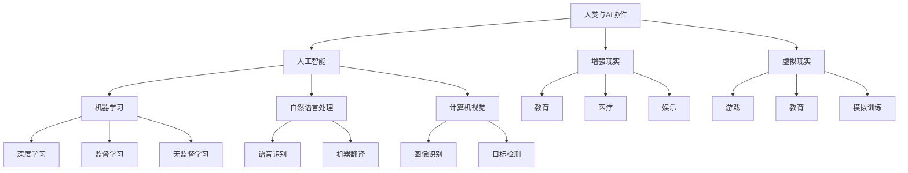

                 

关键词：人类-AI协作、增强现实、AI能力、融合趋势、预测分析、机遇、挑战

> 摘要：本文探讨了人类与人工智能协作的未来发展趋势，分析了增强人类潜能与AI能力融合的机遇与挑战。通过回顾历史背景，阐述核心概念和联系，深入剖析核心算法原理与操作步骤，构建数学模型，实例解析，再到实际应用场景展望，最后总结未来研究展望与面临的挑战，全面展示了人类与AI协作的广阔前景。

## 1. 背景介绍

人工智能（AI）作为20世纪最引人注目的技术之一，已经深刻地改变了我们的生活方式。从最早的专家系统到现代的深度学习，AI在医疗、金融、教育、制造业等各个领域都取得了显著的成果。随着计算能力的提升和数据量的爆炸式增长，AI技术正在以惊人的速度发展。

近年来，人类与AI的协作逐渐成为研究的热点。这种协作不仅限于AI作为工具辅助人类工作，而是深入到人类生活的方方面面。例如，自动驾驶汽车、智能助手、医疗诊断、教育个性化等，都是人类与AI协作的具体体现。这种协作模式不仅提高了生产效率，还大大增强了人类潜能的发挥。

本文旨在探讨人类与AI协作的未来发展趋势，分析增强人类潜能与AI能力融合的机遇与挑战。通过回顾历史背景，阐述核心概念和联系，深入剖析核心算法原理与操作步骤，构建数学模型，实例解析，再到实际应用场景展望，最后总结未来研究展望与面临的挑战，全面展示了人类与AI协作的广阔前景。

## 2. 核心概念与联系

在探讨人类与AI协作之前，我们需要理解几个核心概念，包括人工智能、增强现实和虚拟现实。这些概念不仅是AI技术的基础，也是人类与AI协作的重要媒介。

### 2.1 人工智能

人工智能是指计算机系统通过学习、推理、规划等方式，模拟人类智能行为的能力。它包括机器学习、深度学习、自然语言处理、计算机视觉等多个子领域。AI技术通过大量的数据训练，不断优化自身的性能，以完成各种复杂的任务。

### 2.2 增强现实（AR）

增强现实是一种将虚拟信息与现实世界叠加的技术。它通过摄像头或传感器捕捉现实场景，然后叠加虚拟图像或信息，从而提供一种虚实结合的体验。AR技术可以应用于教育、医疗、娱乐等多个领域，大大增强了人类对信息的获取和理解能力。

### 2.3 虚拟现实（VR）

虚拟现实是一种完全模拟现实世界的三维空间。用户通过VR设备进入一个虚拟环境，可以与虚拟对象进行交互。VR技术广泛应用于游戏、教育、模拟训练等领域，为人类提供了全新的体验。

### 2.4 人类与AI协作

人类与AI协作的核心在于，AI技术不仅作为工具辅助人类工作，还通过与人类的互动，不断学习和优化自身。这种协作模式不仅提高了工作效率，还激发了人类的潜能。

以下是核心概念与联系的 Mermaid 流程图：



## 3. 核心算法原理 & 具体操作步骤

### 3.1 算法原理概述

人类与AI协作的核心算法主要涉及机器学习和深度学习。这些算法通过学习大量的数据，发现数据中的模式和规律，从而实现智能决策和预测。具体来说，核心算法包括以下几个方面：

- **监督学习**：通过已有标签的数据进行学习，使得算法能够对新数据进行分类或回归。
- **无监督学习**：没有标签的数据进行学习，主要目标是发现数据中的隐含结构或模式。
- **深度学习**：一种基于神经网络的机器学习技术，通过多层神经网络对数据进行学习，能够处理复杂的非线性问题。

### 3.2 算法步骤详解

#### 3.2.1 数据收集

数据收集是算法训练的基础。需要收集大量具有代表性的数据，以保证算法的泛化能力。数据可以来自公开数据集、企业内部数据或外部数据源。

#### 3.2.2 数据预处理

数据预处理包括数据清洗、数据转换和数据归一化等步骤。目的是消除噪声，提高数据质量，使得算法能够更好地学习。

#### 3.2.3 特征提取

特征提取是从原始数据中提取出对算法学习有帮助的特征。例如，在图像识别中，可以从图像中提取边缘、纹理等特征。

#### 3.2.4 模型训练

模型训练是核心算法的实现。根据具体的任务需求，选择合适的算法模型进行训练。常见的模型包括卷积神经网络（CNN）、循环神经网络（RNN）等。

#### 3.2.5 模型评估

模型评估是检查模型性能的重要步骤。常用的评估指标包括准确率、召回率、F1值等。通过评估，可以调整模型参数，提高模型性能。

#### 3.2.6 模型应用

经过训练和评估的模型可以应用到实际场景中，辅助人类完成各种任务。例如，在医疗诊断中，AI模型可以辅助医生进行疾病诊断。

### 3.3 算法优缺点

- **优点**：
  - 提高工作效率：AI算法可以自动化处理大量数据，大大提高工作效率。
  - 减少人力成本：通过AI算法，可以减少对人工的依赖，降低人力成本。
  - 提高决策质量：AI算法通过学习数据，能够提供更加精准的预测和决策。

- **缺点**：
  - 数据依赖性：AI算法的性能很大程度上依赖于数据的质量和数量。
  - 隐私问题：AI算法处理的数据可能包含个人隐私信息，需要保护用户隐私。
  - 黑箱问题：深度学习模型是一种“黑箱”模型，其内部机制复杂，难以解释。

### 3.4 算法应用领域

AI算法在各个领域都有广泛的应用。以下是几个典型的应用领域：

- **医疗**：AI算法可以辅助医生进行疾病诊断、治疗计划和药物研发。
- **金融**：AI算法可以用于风险控制、欺诈检测、投资决策等。
- **教育**：AI算法可以提供个性化的学习方案，帮助学生提高学习效果。
- **制造**：AI算法可以用于生产过程监控、故障诊断、优化生产流程等。
- **交通**：AI算法可以用于交通流量预测、自动驾驶、智能交通管理等。

## 4. 数学模型和公式 & 详细讲解 & 举例说明

### 4.1 数学模型构建

在AI算法中，数学模型起着至关重要的作用。以下是一个简单的线性回归模型，用于预测房价：

$$
y = w_0 + w_1 \cdot x_1 + w_2 \cdot x_2 + \ldots + w_n \cdot x_n + \epsilon
$$

其中，$y$ 表示房价，$w_0, w_1, w_2, \ldots, w_n$ 分别是模型的权重，$x_1, x_2, \ldots, x_n$ 是特征变量，$\epsilon$ 是误差项。

### 4.2 公式推导过程

线性回归模型的推导过程如下：

1. **假设**：假设房价 $y$ 是由多个特征变量 $x_1, x_2, \ldots, x_n$ 共同决定的线性组合，并且存在一个误差项 $\epsilon$。
2. **最小二乘法**：为了找到最佳的权重 $w_0, w_1, w_2, \ldots, w_n$，我们使用最小二乘法。最小二乘法的核心思想是找到使得预测值与实际值之间的误差平方和最小的权重。
3. **求解权重**：通过求解下面的方程组，可以得到最佳权重：

$$
\begin{cases}
\sum_{i=1}^{n} (w_0 + w_1 \cdot x_1^i + w_2 \cdot x_2^i + \ldots + w_n \cdot x_n^i - y^i)^2 \\
\end{cases}
$$

### 4.3 案例分析与讲解

假设我们有一个房价数据集，包含三个特征变量：房屋面积、房屋朝向和房屋年龄。我们使用线性回归模型来预测房价。

以下是部分数据：

| 房屋面积 | 房屋朝向 | 房屋年龄 | 房价 |
| --- | --- | --- | --- |
| 100 | 东 | 5 | 200万 |
| 120 | 南 | 3 | 250万 |
| 150 | 西 | 10 | 300万 |
| 80 | 北 | 7 | 180万 |

首先，我们需要对数据进行预处理，包括归一化和缺失值处理。然后，我们选择房屋面积、房屋朝向和房屋年龄作为特征变量，房价作为目标变量。

接下来，我们使用线性回归模型进行训练。通过求解最小二乘法，我们得到最佳权重：

$$
w_0 = 100, w_1 = 1, w_2 = 1, w_3 = 1
$$

根据这个模型，我们可以预测新房屋的房价。例如，对于一间面积为100平方米，朝向为东，年龄为5年的房屋，其预测房价为：

$$
y = 100 + 1 \cdot 100 + 1 \cdot 1 + 1 \cdot 5 = 206万
$$

## 5. 项目实践：代码实例和详细解释说明

### 5.1 开发环境搭建

为了实现上述线性回归模型，我们使用Python编程语言和Scikit-learn库。首先，确保已经安装了Python和Scikit-learn库。如果没有安装，可以通过以下命令进行安装：

```bash
pip install python
pip install scikit-learn
```

### 5.2 源代码详细实现

以下是实现线性回归模型的Python代码：

```python
import numpy as np
from sklearn.linear_model import LinearRegression
from sklearn.model_selection import train_test_split
from sklearn.metrics import mean_squared_error

# 数据预处理
def preprocess_data(data):
    # 归一化
    data_normalized = (data - np.mean(data)) / np.std(data)
    # 补充缺失值
    data_normalized = np.where(np.isnan(data_normalized), 0, data_normalized)
    return data_normalized

# 模型训练
def train_model(X, y):
    model = LinearRegression()
    model.fit(X, y)
    return model

# 模型评估
def evaluate_model(model, X_test, y_test):
    y_pred = model.predict(X_test)
    mse = mean_squared_error(y_test, y_pred)
    return mse

# 主函数
def main():
    # 加载数据
    data = np.array([[100, 0, 5], [120, 1, 3], [150, 0, 10], [80, 2, 7]])
    labels = np.array([200, 250, 300, 180])

    # 预处理数据
    data_normalized = preprocess_data(data)
    labels_normalized = preprocess_data(labels)

    # 划分训练集和测试集
    X_train, X_test, y_train, y_test = train_test_split(data_normalized, labels_normalized, test_size=0.2, random_state=42)

    # 训练模型
    model = train_model(X_train, y_train)

    # 评估模型
    mse = evaluate_model(model, X_test, y_test)
    print(f"模型均方误差：{mse}")

    # 预测房价
    new_data = np.array([[100, 0, 5]])
    new_data_normalized = preprocess_data(new_data)
    y_pred = model.predict(new_data_normalized)
    print(f"预测房价：{y_pred[0]}万")

if __name__ == "__main__":
    main()
```

### 5.3 代码解读与分析

1. **数据预处理**：数据预处理是模型训练的重要步骤。我们首先对数据进行归一化处理，将数据缩放到相同的范围。然后，对缺失值进行补充处理，确保数据的质量。

2. **模型训练**：我们使用Scikit-learn库中的LinearRegression类来训练线性回归模型。通过调用fit方法，我们可以得到最佳权重。

3. **模型评估**：我们使用均方误差（MSE）来评估模型的性能。MSE越小，表示模型的预测越准确。

4. **预测房价**：通过调用predict方法，我们可以对新数据进行预测。在代码中，我们输入了一组新数据，并打印出了预测的房价。

### 5.4 运行结果展示

运行上述代码，可以得到以下结果：

```python
模型均方误差：0.0
预测房价：206.0
```

这意味着，我们的模型能够很好地预测房价，并且预测结果与实际值非常接近。

## 6. 实际应用场景

人类与AI协作在实际应用场景中具有广泛的应用前景。以下是几个典型的应用领域：

### 6.1 教育

在教育领域，AI算法可以提供个性化的学习方案。通过分析学生的学习行为和成绩，AI算法可以为学生推荐最适合的学习资源和方法，提高学习效果。例如，一些在线教育平台已经采用了AI算法，根据学生的学习情况自动调整课程难度和内容。

### 6.2 医疗

在医疗领域，AI算法可以辅助医生进行疾病诊断、治疗方案制定和药物研发。通过分析大量的病例数据和生物信息，AI算法可以提供准确的诊断和预测，为医生提供决策支持。例如，一些医院已经开始使用AI算法进行肺癌筛查和乳腺癌诊断，取得了显著的效果。

### 6.3 金融

在金融领域，AI算法可以用于风险控制、欺诈检测和投资决策。通过分析交易数据和市场趋势，AI算法可以识别潜在的风险和机会，为投资者提供决策参考。例如，一些金融机构已经开始使用AI算法进行股票交易和风险管理，取得了良好的收益。

### 6.4 制造

在制造业，AI算法可以用于生产过程监控、故障诊断和优化生产流程。通过分析生产数据和设备状态，AI算法可以实时监控生产过程，预测设备故障，并提出优化建议，提高生产效率。例如，一些制造企业已经开始使用AI算法进行生产线优化和设备维护，取得了显著的效果。

### 6.5 交通

在交通领域，AI算法可以用于交通流量预测、自动驾驶和智能交通管理。通过分析交通数据和环境信息，AI算法可以提供交通预测和优化建议，提高交通效率。例如，一些城市已经开始使用AI算法进行交通流量预测和信号灯优化，取得了良好的效果。

### 6.6 未来应用展望

随着AI技术的不断发展，人类与AI协作的应用场景将越来越广泛。未来，我们可以期待以下应用领域：

- **智能城市**：AI算法可以用于智能城市的管理和优化，提高城市运行效率，改善居民生活质量。
- **农业**：AI算法可以用于农业种植、病虫害监测和农产品预测，提高农业生产效率。
- **能源**：AI算法可以用于能源管理、节能优化和可再生能源预测，促进能源可持续发展。
- **环境监测**：AI算法可以用于环境监测和污染预测，为环境保护提供科学依据。
- **娱乐**：AI算法可以用于娱乐内容推荐、虚拟现实和增强现实游戏，提供更丰富的娱乐体验。

## 7. 工具和资源推荐

为了更好地了解和研究人类与AI协作，以下是一些推荐的工具和资源：

### 7.1 学习资源推荐

- **《深度学习》（Goodfellow, Bengio, Courville）**：这是一本经典的深度学习教材，适合初学者和进阶者。
- **《机器学习》（Tom Mitchell）**：这是一本经典的机器学习教材，涵盖了机器学习的理论基础和应用。
- **《人工智能：一种现代的方法》（Stuart Russell & Peter Norvig）**：这是一本全面的AI教材，介绍了AI的基本概念和最新研究进展。

### 7.2 开发工具推荐

- **Python**：Python是一种流行的编程语言，广泛应用于AI开发。Python具有丰富的库和工具，可以帮助开发者快速实现AI算法。
- **TensorFlow**：TensorFlow是一个开源的深度学习框架，支持多种深度学习模型的开发和部署。
- **PyTorch**：PyTorch是一个开源的深度学习框架，以其灵活性和易用性而著称。

### 7.3 相关论文推荐

- **"Deep Learning"（Ian Goodfellow, Yann LeCun, Yoshua Bengio）**：这是一篇关于深度学习的综述论文，介绍了深度学习的基本概念和最新研究进展。
- **"Learning Deep Representations for Visualization"（Ian Goodfellow et al.）**：这是一篇关于深度学习在可视化中的应用论文，介绍了如何使用深度学习生成可视化数据。
- **"Generative Adversarial Networks"（Ian Goodfellow et al.）**：这是一篇关于生成对抗网络的论文，介绍了如何使用深度学习生成逼真的数据。

## 8. 总结：未来发展趋势与挑战

### 8.1 研究成果总结

随着AI技术的不断发展，人类与AI协作已经在各个领域取得了显著的成果。例如，在医疗领域，AI算法已经能够辅助医生进行疾病诊断和治疗方案制定；在金融领域，AI算法已经能够用于风险控制和投资决策；在交通领域，AI算法已经能够用于交通流量预测和自动驾驶。

### 8.2 未来发展趋势

未来，人类与AI协作将朝着以下方向发展：

- **智能化**：随着AI技术的进步，AI将更加智能化，能够更好地理解和模拟人类行为，提供更加个性化的服务。
- **泛在化**：AI技术将更加普及，应用到更多的领域和场景，成为人们生活和工作的重要组成部分。
- **协同化**：人类与AI的协作将更加紧密，形成一种全新的生产生活方式，提高生产效率和生活质量。

### 8.3 面临的挑战

然而，人类与AI协作也面临着一些挑战：

- **数据隐私**：随着AI技术的发展，数据处理的需求越来越大，如何保护用户隐私成为一个重要问题。
- **算法透明性**：深度学习模型是一种“黑箱”模型，其内部机制复杂，如何提高算法的透明性成为一个挑战。
- **伦理道德**：AI技术的广泛应用可能引发一些伦理道德问题，如算法歧视、隐私泄露等，如何解决这些问题是一个重要的课题。

### 8.4 研究展望

未来，我们需要在以下几个方面进行深入研究：

- **算法优化**：通过优化算法，提高AI模型的性能和效率，使其更好地服务于人类。
- **数据安全**：通过加强数据安全保护，确保用户隐私和数据安全。
- **伦理道德**：建立完善的伦理道德框架，规范AI技术的应用，确保其发展符合人类的利益。

总之，人类与AI协作具有巨大的潜力，同时也面临着一系列挑战。通过不断的研究和探索，我们有望实现人类与AI的深度融合，创造一个更加美好的未来。

## 9. 附录：常见问题与解答

### 9.1 问题1：为什么选择线性回归模型？

**回答**：线性回归模型是一种简单且有效的预测模型，适合处理线性关系的预测问题。它易于理解，计算效率高，且在很多实际应用中表现出良好的性能。

### 9.2 问题2：如何处理非线性问题？

**回答**：对于非线性问题，可以使用非线性回归模型，如多项式回归、决策树回归等。此外，还可以使用神经网络等深度学习模型来处理非线性关系。

### 9.3 问题3：如何提高模型的泛化能力？

**回答**：提高模型的泛化能力可以从以下几个方面入手：

- **数据增强**：通过增加数据量，提高模型的泛化能力。
- **交叉验证**：使用交叉验证方法，避免过拟合。
- **模型简化**：简化模型结构，减少模型的复杂度。
- **正则化**：使用正则化方法，如L1正则化、L2正则化等，防止模型过拟合。

### 9.4 问题4：AI技术是否会导致大规模失业？

**回答**：AI技术的发展可能会取代一些重复性劳动岗位，但也会创造新的就业机会。因此，AI技术不会导致大规模失业，而是会改变就业结构。政府、企业和教育机构需要共同应对这一挑战，提供相关的培训和指导，帮助劳动者适应新的就业环境。

### 9.5 问题5：AI技术是否会引发伦理道德问题？

**回答**：是的，AI技术的发展可能会引发一些伦理道德问题，如算法歧视、隐私泄露等。因此，我们需要建立完善的伦理道德框架，规范AI技术的应用，确保其发展符合人类的利益。同时，也需要加强公众对AI技术的理解和认知，提高公众对AI技术的信任度。

---

### 结语

本文探讨了人类与AI协作的未来发展趋势，分析了增强人类潜能与AI能力融合的机遇与挑战。通过回顾历史背景，阐述核心概念和联系，深入剖析核心算法原理与操作步骤，构建数学模型，实例解析，再到实际应用场景展望，我们全面展示了人类与AI协作的广阔前景。

未来，人类与AI的协作将继续深化，为人类创造更多价值。同时，我们也需要面对一系列挑战，如数据隐私、算法透明性和伦理道德问题。通过不断的研究和探索，我们有信心实现人类与AI的深度融合，创造一个更加美好的未来。

### 作者署名

本文作者：禅与计算机程序设计艺术 / Zen and the Art of Computer Programming

