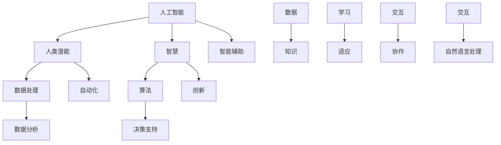

                 

关键词：人工智能，人类潜能，智慧增强，协作，技术进步，人机交互，算法优化

> 摘要：本文旨在探讨人类与人工智能协作的重要性，以及如何通过AI技术来提升人类的潜能和智慧。文章从背景介绍出发，详细阐述了核心概念与联系，介绍了核心算法原理与操作步骤，探讨了数学模型和公式，并通过实际项目实践展示了AI技术的应用。同时，文章还分析了实际应用场景，展望了未来发展趋势和挑战，并推荐了相关的学习资源和工具。

## 1. 背景介绍

随着人工智能（AI）技术的快速发展，人类与机器之间的协作方式正在发生革命性的变化。人工智能不仅能够处理复杂的数据，还能通过学习和适应不断优化的算法来提高工作效率。在这种趋势下，人类与AI的协作成为一种新的工作模式，旨在最大化人类的潜能和智慧。

这种协作不仅体现在日常工作中，如智能客服、自动驾驶等，还深入到科学研究和创新领域。例如，科学家利用AI进行数据分析，加速新药的发现；设计师通过AI生成创意设计方案，提高设计效率。随着技术的进步，人类与AI的协作模式将更加紧密，涉及到的领域也将越来越广泛。

本文将围绕以下问题展开讨论：

- 如何理解人类与AI的协作？
- AI技术如何提升人类的潜能和智慧？
- 核心算法原理是什么，具体操作步骤如何？
- 数学模型和公式在AI中的应用是怎样的？
- 实际应用场景有哪些，未来又有怎样的发展趋势和挑战？
- 需要哪些学习资源和工具来支持这种协作模式？

通过这些问题，本文希望为读者提供一个全面而深入的理解，并激发对未来AI技术发展的思考和探讨。

### 1.1 历史背景与发展趋势

人类与机器的协作历史可以追溯到工业革命时期，那时机器取代了人力，大大提高了生产效率。然而，这些早期的协作更多是机械化的操作，人与机器之间更多的是命令与执行的关系。随着计算技术的进步，特别是在20世纪80年代以来，人工智能开始逐渐融入人们的日常生活。

人工智能的发展经历了几个重要阶段：

- **专家系统（Expert Systems）**：20世纪80年代，专家系统成为AI领域的一个重要分支。这些系统能够模拟专家的决策过程，应用于医疗诊断、金融分析等领域。

- **机器学习（Machine Learning）**：20世纪90年代至21世纪初，机器学习技术的突破使得AI开始能够从数据中学习，提升其自主决策能力。这一阶段的重要进展包括决策树、支持向量机、神经网络等。

- **深度学习（Deep Learning）**：21世纪初，随着计算能力的提升和大数据的涌现，深度学习技术得到了广泛应用。深度神经网络在图像识别、自然语言处理等领域取得了显著的成就。

当前，人工智能技术正迅速融入各行各业，从医疗、金融、教育到制造、能源、交通等，AI的协作模式正在深刻改变人类的传统工作方式。例如，在医疗领域，AI辅助诊断系统能够快速分析医学影像，提供准确的治疗建议；在金融领域，AI算法能够实时分析市场数据，辅助投资决策。

随着技术的不断进步，未来人工智能的发展趋势将更加智能化、个性化。人机协同将成为主流，人类通过AI技术扩展自己的认知和技能，实现更加高效的工作和生活。同时，AI也将承担更多的决策任务，减轻人类的负担，从而使得人类能够专注于更高层次的创造性工作。

### 1.2 人工智能的定义与分类

人工智能（Artificial Intelligence，简称AI）是计算机科学的一个分支，旨在使计算机系统具备人类智能的某些特征，能够自主地感知环境、学习知识、进行决策和执行任务。AI可以分为几种不同的类型，每种类型都有其独特的应用场景和特点。

#### 1.2.1 狭义人工智能（Narrow AI）

狭义人工智能，也称为弱AI，是指只能在特定任务或场景中表现出智能的AI系统。这类系统具有高度专业化，例如，语音助手（如Siri、Alexa）、图像识别系统、推荐算法等。这些系统通过大量的数据训练，能够在特定任务上实现高效处理，但它们缺乏广泛的应用能力和自主意识。

#### 1.2.2 广义人工智能（General AI）

广义人工智能，也称为强AI，是一种理论上具有人类智能水平的人工智能。强AI不仅能够执行特定的任务，还能够理解、学习和应用广泛的知识，具有自我意识、情感和创造力。目前，广义人工智能仍然是一个研究中的概念，尚未实现。

#### 1.2.3 人类增强型人工智能（Augmented Intelligence）

人类增强型人工智能（Human-Augmented AI）是一种旨在增强人类智能的技术，通过辅助人类进行决策、学习和工作，提高人类的能力和效率。这种类型的AI与人类紧密协作，共同完成复杂的任务。例如，智能助手帮助医生分析病历、设计人员利用AI生成创意设计方案等。

#### 1.2.4 人工智能的分类应用

根据应用领域的不同，人工智能可以分为多种类型：

- **机器学习（Machine Learning）**：通过数据训练模型，使计算机能够自动进行预测和决策。机器学习广泛应用于数据分析、图像识别、自然语言处理等领域。

- **深度学习（Deep Learning）**：一种特殊的机器学习技术，通过多层神经网络进行训练，能够处理复杂的非线性问题。深度学习在图像识别、语音识别、自动驾驶等领域取得了显著成果。

- **计算机视觉（Computer Vision）**：使计算机能够像人类一样“看”和理解图像。计算机视觉在安防监控、医疗影像分析、自动驾驶等领域有广泛应用。

- **自然语言处理（Natural Language Processing，NLP）**：使计算机能够理解和生成人类语言。NLP在智能客服、翻译、文本分析等领域发挥着重要作用。

- **机器人技术（Robotics）**：通过物理机器人实现自动化操作，如工业机器人、服务机器人等。机器人技术在制造业、服务业、医疗等领域有着广泛的应用。

### 1.3 人工智能在人类协作中的关键作用

人工智能在人类协作中扮演着至关重要的角色，它不仅能够提高工作效率，还能扩展人类的认知和技能。以下是AI在协作中的几个关键作用：

#### 1.3.1 数据处理与决策支持

人工智能能够处理大量数据，快速分析并提取有价值的信息。在金融、医疗、物流等领域，AI系统通过数据挖掘和分析，为人类提供准确的决策支持，使决策过程更加科学和高效。

#### 1.3.2 自动化与优化流程

AI技术可以实现自动化操作，减少人为干预，提高工作效率。例如，在制造业中，AI驱动的自动化生产线可以实时监控生产过程，自动调整参数，优化生产流程，提高生产效率。

#### 1.3.3 智能辅助与协作

人工智能可以通过智能助手、聊天机器人等形式与人类进行互动，提供个性化服务和支持。在客服、教育、医疗等领域，AI助手能够辅助人类完成复杂任务，提高服务质量和工作效率。

#### 1.3.4 创新与知识拓展

人工智能能够帮助人类进行知识拓展和创新。通过机器学习和深度学习技术，AI可以生成新的创意、设计出新的产品，甚至在科学研究中提供新的思路和方法。这种创新不仅推动了技术进步，也扩展了人类的认知边界。

#### 1.3.5 安全与风险管理

人工智能在安全监控、风险管理等方面具有重要作用。通过实时监控和分析数据，AI可以及时发现潜在的风险，提供预警和建议，帮助人类采取有效的应对措施，降低风险损失。

### 1.4 人类潜能与智慧的概念

人类潜能和智慧是两个密切相关的概念，都涉及人类能力的发挥和发展。

#### 1.4.1 人类潜能

人类潜能是指人类在生理、心理、智力等方面的潜在能力。这些潜能包括语言能力、认知能力、创造能力、运动能力等。人类的潜能是无限的，但在实际生活中，由于环境、教育、遗传等因素的影响，许多潜能可能没有得到充分开发和利用。

#### 1.4.2 智慧

智慧是指人类通过知识、经验、思考等方式获取和处理信息的能力。智慧不仅包括逻辑思维、分析问题、解决问题的能力，还包括创造性思维、道德判断、情感理解等。智慧是人类的独特特征，使人类能够适应复杂多变的环境，实现自我发展和进步。

#### 1.4.3 增强人类潜能和智慧的重要性

增强人类潜能和智慧具有重要意义，主要体现在以下几个方面：

- **提高生活质量**：通过开发和利用人类潜能，人类能够更好地应对生活中的各种挑战，提高生活质量和工作效率。
- **推动社会进步**：人类智慧的发展推动了科学技术的进步，促进了社会的发展和进步。智慧是人类社会发展的核心动力。
- **实现自我价值**：每个人都有独特的潜能和智慧，通过开发这些能力，人类能够实现自我价值，追求个人成长和幸福。
- **应对未来挑战**：面对未来复杂多变的环境和挑战，只有通过增强人类潜能和智慧，人类才能更好地适应和发展。

## 2. 核心概念与联系

在探讨人类与AI协作以增强人类潜能和智慧的过程中，理解核心概念及其相互联系是至关重要的。以下是本文所涉及的关键概念及其简要描述：

### 2.1 人工智能与人类潜能

人工智能（AI）与人类潜能（Human Potential）之间的联系在于，AI可以作为一个强大的工具，帮助人类实现自身潜能。通过AI，人类可以处理和分析大量数据，从而发现新的模式、趋势和知识。例如，在医疗领域，AI可以辅助医生进行诊断，通过分析患者的病历和医疗数据，提供更准确的治疗建议，从而帮助患者更好地发挥其生理和心理健康潜能。

### 2.2 智慧与算法

智慧（Wisdom）与算法（Algorithm）之间的联系在于，算法是智能系统实现智慧的工具。例如，在金融领域，复杂的算法可以分析市场数据，预测未来趋势，从而帮助投资者做出更明智的决策。智慧则是人类通过算法应用和经验积累，形成的高级思维能力和判断力。

### 2.3 协作与交互

协作（Collaboration）与交互（Interaction）之间的联系在于，人类与AI的协作需要有效的交互机制。通过自然语言处理（NLP）和对话系统，AI可以与人类进行自然交流，理解人类的需求和意图，从而实现更好的协作效果。例如，智能助手可以通过语音或文本与用户互动，提供个性化的服务和支持。

### 2.4 数据与知识

数据（Data）与知识（Knowledge）之间的联系在于，数据是知识的来源，而知识是对数据的理解和应用。通过大数据技术和机器学习算法，AI可以从海量数据中提取有价值的信息和知识。例如，在科学研究领域，AI可以分析实验数据，发现新的科学规律，从而扩展人类的知识库。

### 2.5 学习与适应

学习（Learning）与适应（Adaptation）之间的联系在于，学习是适应变化的前提。AI系统通过不断学习，能够适应新的环境和任务需求。例如，自动驾驶系统通过大量道路数据的学习，可以适应各种复杂的交通场景，提高行驶安全性和效率。

### 2.6 Mermaid 流程图

为了更直观地展示上述核心概念之间的联系，我们可以使用Mermaid流程图进行描述。以下是几个关键概念的Mermaid流程图示例：



通过上述流程图，我们可以清晰地看到人工智能、人类潜能、智慧、数据和学习等核心概念之间的相互关系，以及它们在人类协作中的重要作用。

### 2.7 人类与AI协作的模型与架构

为了实现人类与AI的协同工作，构建一个有效的模型和架构是至关重要的。这个模型不仅需要涵盖人工智能和人类潜能的相互关系，还要考虑智慧、学习、适应和交互等关键要素。

#### 2.7.1 模型概述

这个模型可以分为四个主要层次：感知层、认知层、决策层和执行层。每个层次都由人类和AI共同协作完成特定任务。

1. **感知层**：这一层主要处理信息的采集和初步处理。人类通过传感器、摄像头等设备获取数据，AI则利用计算机视觉、语音识别等技术对这些数据进行初步分析。

2. **认知层**：在这一层，人类和AI共同分析感知层得到的信息，进行深度理解和知识提取。人类凭借丰富的经验和专业知识，AI则利用自然语言处理、机器学习等技术，辅助人类进行认知任务。

3. **决策层**：决策层是模型的核心，由人类和AI共同制定决策。人类根据认知层的信息，结合自身经验和直觉，进行决策。AI则通过算法和模型提供数据支持，优化决策过程。

4. **执行层**：执行层负责将决策转化为具体行动。人类和AI共同完成执行任务，AI负责自动化操作，人类则负责监督和调整。

#### 2.7.2 架构设计

在架构设计上，模型采用分布式计算和协作机制，确保人类和AI能够在不同的层次上高效协同工作。

1. **分布式计算**：为了处理海量数据和复杂任务，模型采用分布式计算架构。人类和AI在不同的计算节点上执行任务，实现并行处理。

2. **协作机制**：模型引入了协作机制，确保人类和AI能够有效沟通和协作。通过自然语言处理和对话系统，AI可以理解人类的需求和意图，提供个性化服务和支持。

3. **反馈机制**：为了提高模型的效果，引入了反馈机制。人类可以对AI的决策和执行进行评价和反馈，AI则根据反馈进行自我学习和优化。

4. **安全保障**：在模型设计过程中，重视数据安全和隐私保护。通过加密和访问控制等技术，确保数据在传输和存储过程中的安全性。

#### 2.7.3 模型与架构的相互作用

模型与架构的相互作用体现在以下几个方面：

- **信息流动**：从感知层到执行层，信息在各个层次之间流动，实现数据的采集、处理和执行。
- **任务分配**：人类和AI在各个层次上承担不同的任务，实现协同工作。人类负责复杂的决策和执行任务，AI负责数据处理和自动化操作。
- **学习与适应**：通过反馈机制，人类和AI不断学习和优化，提高协作效果。
- **安全与隐私**：在信息流动和任务分配过程中，确保数据的安全和隐私。

通过上述模型和架构设计，人类与AI能够实现高效的协作，共同提升人类的潜能和智慧。

### 3. 核心算法原理 & 具体操作步骤

在探讨人类与AI协作以增强人类潜能和智慧的过程中，核心算法的原理及其具体操作步骤是理解这一技术的重要基础。本文将介绍一种关键算法——深度学习算法，并详细阐述其原理、操作步骤、优缺点以及在各个应用领域中的应用。

#### 3.1 深度学习算法原理概述

深度学习（Deep Learning）是一种基于人工神经网络的机器学习技术，其核心思想是通过多层神经网络对数据进行处理，以自动提取特征并实现复杂的模式识别和预测任务。深度学习算法具有以下几个主要特点：

1. **多层神经网络**：深度学习算法采用多层神经网络结构，包括输入层、隐藏层和输出层。每一层神经网络都可以对输入数据进行变换和提取特征。

2. **反向传播算法**：深度学习算法使用反向传播算法（Backpropagation）来训练网络，通过反向传播误差信号，更新网络的权重和偏置，以达到最小化损失函数的目的。

3. **非线性激活函数**：深度学习算法中的隐藏层通常使用非线性激活函数（如ReLU、Sigmoid、Tanh等），这有助于模型捕捉输入数据的复杂非线性关系。

4. **大规模并行计算**：随着计算能力的提升，深度学习算法可以处理大量数据和复杂的任务。通过分布式计算和GPU加速，深度学习算法在训练过程中可以显著提高效率。

#### 3.2 算法步骤详解

深度学习算法的具体操作步骤可以分为以下几个阶段：

##### 3.2.1 数据预处理

在开始训练深度学习模型之前，需要对数据进行预处理，包括数据清洗、归一化、缩放等。这一步骤的目的是确保数据的质量和一致性，提高模型的训练效果。

- **数据清洗**：去除数据中的噪声和异常值，保证数据的准确性。
- **归一化**：将数据缩放到相同的范围，通常使用0到1之间的比例。
- **缩放**：对于一些非线性关系较强的数据，通过变换将其线性化，以便于模型的训练。

##### 3.2.2 构建神经网络

构建神经网络是深度学习算法的核心步骤，包括定义网络的层数、每层的节点数以及各层之间的连接方式。

- **选择合适的网络结构**：根据任务需求，选择合适的网络结构。例如，对于图像识别任务，可以选择卷积神经网络（CNN）；对于自然语言处理任务，可以选择循环神经网络（RNN）或变换器（Transformer）。
- **定义网络参数**：设置每层的权重、偏置、激活函数等参数，这些参数将通过网络训练进行调整。

##### 3.2.3 模型训练

模型训练是通过优化算法来调整网络参数，使得模型能够在训练数据上达到较好的泛化能力。以下是深度学习模型训练的几个关键步骤：

- **初始化参数**：随机初始化网络的权重和偏置。
- **前向传播**：将输入数据传递到神经网络中，通过各层变换得到输出。
- **计算损失函数**：通过计算输出与实际标签之间的差异，得到损失函数的值。常用的损失函数包括均方误差（MSE）、交叉熵（Cross-Entropy）等。
- **反向传播**：通过反向传播算法，将损失函数的误差信号反向传播到网络的每一层，更新网络参数。
- **迭代优化**：重复前向传播和反向传播，直至达到预定的训练次数或损失函数收敛。

##### 3.2.4 模型评估与优化

在模型训练完成后，需要对模型进行评估，以验证其泛化能力。以下是一些常用的评估方法和优化策略：

- **交叉验证**：通过将数据集划分为训练集和验证集，使用验证集评估模型的泛化性能。
- **调整超参数**：通过调整学习率、批次大小、正则化参数等超参数，优化模型性能。
- **增强训练数据**：通过数据增强（Data Augmentation）技术，如旋转、缩放、裁剪等，增加训练数据的多样性，提高模型的泛化能力。
- **使用预训练模型**：通过使用已经在大规模数据上预训练的模型，可以节省训练时间和计算资源，并提高模型的性能。

#### 3.3 算法优缺点

深度学习算法在许多领域取得了显著的成就，但也存在一些优缺点。

##### 3.3.1 优点

- **强大的特征提取能力**：深度学习算法能够自动提取数据中的高级特征，无需人工干预。
- **良好的泛化能力**：通过大规模训练和优化，深度学习模型能够具有良好的泛化能力，适用于各种复杂任务。
- **高效的处理速度**：随着计算能力的提升，深度学习算法的处理速度越来越快，适用于实时应用。
- **广泛的适用性**：深度学习算法在图像识别、自然语言处理、语音识别、推荐系统等领域具有广泛的应用。

##### 3.3.2 缺点

- **训练过程复杂**：深度学习算法的训练过程涉及大量的参数调整和优化，需要较高的计算资源和时间。
- **数据依赖性强**：深度学习算法的性能很大程度上依赖于训练数据的质量和多样性，数据不足或质量差可能导致模型效果不佳。
- **模型可解释性低**：深度学习模型的内部决策过程往往较为复杂，难以进行解释，这在某些需要高透明度的应用场景中可能是一个缺点。
- **对计算资源要求高**：深度学习算法的训练和推理过程通常需要大量的计算资源和存储空间，这在资源有限的场景中可能是一个限制。

#### 3.4 算法应用领域

深度学习算法在各个领域都有着广泛的应用，以下是一些主要的应用领域：

- **图像识别与处理**：深度学习算法在图像分类、目标检测、人脸识别等方面表现出色，广泛应用于安防监控、医疗影像分析、自动驾驶等领域。
- **自然语言处理**：深度学习算法在文本分类、机器翻译、情感分析等方面取得了显著成果，应用于智能客服、内容审核、智能助手等领域。
- **语音识别与生成**：深度学习算法在语音识别、语音合成、语音转换等方面表现出色，应用于智能语音助手、自动翻译、智能音响等领域。
- **推荐系统**：深度学习算法在推荐系统中用于预测用户偏好，提高推荐效果，应用于电商、社交媒体、新闻推荐等领域。
- **机器人与自动化**：深度学习算法在机器人控制和自动化系统中用于感知环境、决策规划，应用于工业自动化、服务机器人、智能家居等领域。

#### 3.5 案例分析

以下是一个深度学习算法应用的案例分析：使用卷积神经网络（CNN）进行图像分类。

##### 3.5.1 案例背景

假设我们有一个图像分类任务，需要将图片分为猫和狗两类。我们的数据集包含数千张标注好的猫和狗的图片。

##### 3.5.2 数据预处理

1. **数据清洗**：去除数据中的噪声和异常值，确保数据的准确性。
2. **数据增强**：通过旋转、缩放、裁剪等数据增强技术，增加训练数据的多样性。
3. **归一化**：将图像的像素值缩放到0到1之间。

##### 3.5.3 模型构建

1. **选择网络结构**：我们选择一个简单的卷积神经网络，包括三个卷积层、两个全连接层和一个输出层。
2. **定义网络参数**：设置每层的卷积核大小、步长、填充方式等参数。

##### 3.5.4 模型训练

1. **初始化参数**：随机初始化网络的权重和偏置。
2. **前向传播**：将输入图像传递到网络中，通过卷积和池化操作提取特征，最后通过全连接层得到输出。
3. **计算损失函数**：使用交叉熵损失函数计算输出与实际标签之间的差异。
4. **反向传播**：通过反向传播算法，更新网络的权重和偏置。
5. **迭代优化**：重复前向传播和反向传播，直至达到预定的训练次数或损失函数收敛。

##### 3.5.5 模型评估

1. **交叉验证**：将数据集划分为训练集和验证集，使用验证集评估模型的泛化性能。
2. **调整超参数**：通过调整学习率、批次大小等超参数，优化模型性能。

##### 3.5.6 模型应用

经过训练和评估，我们得到了一个性能良好的模型，可以用于实际图像分类任务。

通过上述案例分析，我们可以看到深度学习算法在图像分类任务中的应用流程，以及如何通过数据预处理、模型构建、模型训练和模型评估等步骤，实现图像分类任务。

### 3.6 深度学习算法的应用领域

深度学习算法在许多领域都展现出了强大的应用潜力，以下是一些关键的应用领域及其具体实例：

#### 3.6.1 图像识别与处理

深度学习在图像识别与处理领域取得了显著进展。卷积神经网络（CNN）在图像分类、目标检测、人脸识别等方面表现出色。例如，在图像分类任务中，通过训练CNN模型，可以实现准确识别猫、狗、汽车等物体类别。目标检测算法如YOLO和SSD，可以在图像中准确检测和定位多个目标物体，广泛应用于安防监控、自动驾驶等领域。人脸识别技术通过深度学习算法，能够实现人脸身份验证和识别，被广泛应用于身份验证、智能监控等场景。

#### 3.6.2 自然语言处理

自然语言处理（NLP）是深度学习算法的重要应用领域。通过深度学习技术，可以实现文本分类、机器翻译、情感分析等任务。例如，文本分类算法可以用于新闻分类、垃圾邮件过滤等应用。机器翻译系统如Google翻译和微软翻译，通过深度学习算法，可以实现高质量的语言翻译。情感分析算法可以用于分析社交媒体上的用户情感，帮助企业了解用户需求和市场趋势。

#### 3.6.3 语音识别与生成

深度学习在语音识别和语音生成领域也取得了重要成果。基于深度神经网络（DNN）和循环神经网络（RNN）的语音识别技术，可以实现高准确度的语音识别，广泛应用于智能助手、语音搜索、智能家居等场景。语音生成技术如WaveNet和Tacotron，可以通过深度学习算法生成自然流畅的语音，应用于语音助手、朗读器、广告配音等领域。

#### 3.6.4 推荐系统

深度学习在推荐系统中的应用，可以显著提高推荐效果。通过深度学习算法，可以实现基于内容的推荐、协同过滤推荐等任务。例如，电商平台可以通过深度学习算法，为用户推荐相关的商品，提高销售额。社交媒体平台可以通过深度学习算法，为用户推荐感兴趣的内容，提高用户活跃度和粘性。

#### 3.6.5 机器人与自动化

深度学习在机器人与自动化领域也展现出了广阔的应用前景。通过深度学习算法，可以实现机器人的视觉感知、决策规划和控制。例如，自动驾驶汽车通过深度学习算法，可以实现自动驾驶功能，提高行驶安全性和效率。工业机器人通过深度学习算法，可以实现自适应控制和自动化操作，提高生产效率和产品质量。

#### 3.6.6 医疗诊断

深度学习在医疗诊断领域有着重要应用。通过深度学习算法，可以实现医学图像分析、疾病诊断、药物研发等任务。例如，深度学习算法可以在医学影像中检测肿瘤，辅助医生进行诊断。在药物研发领域，深度学习算法可以用于筛选药物分子，加速新药研发进程。

#### 3.6.7 金融分析

深度学习在金融分析领域也发挥着重要作用。通过深度学习算法，可以实现金融市场预测、风险评估、投资决策等任务。例如，金融机构可以通过深度学习算法，预测股票价格走势，制定合理的投资策略。在风险管理领域，深度学习算法可以用于分析风险因素，提高风险管理能力。

#### 3.6.8 娱乐与游戏

深度学习在娱乐与游戏领域也有广泛应用。通过深度学习算法，可以实现游戏AI、智能推荐、虚拟现实等应用。例如，游戏中的AI对手可以通过深度学习算法，实现更加智能和灵活的决策，提高游戏体验。智能推荐系统可以根据用户的兴趣和行为，推荐相关的娱乐内容和游戏，提高用户粘性。

### 4. 数学模型和公式 & 详细讲解 & 举例说明

在人工智能领域，数学模型和公式是理解和实现算法的核心。本文将详细讲解深度学习算法中的几个关键数学模型和公式，并通过具体实例说明其应用。

#### 4.1 数学模型构建

深度学习中的数学模型主要包括多层感知器（MLP）、卷积神经网络（CNN）和循环神经网络（RNN）等。以下是这些模型的构建方法：

##### 4.1.1 多层感知器（MLP）

多层感知器是一种前馈神经网络，包括输入层、隐藏层和输出层。每个层由多个神经元组成，神经元之间的连接权重和偏置用于传递和转换数据。MLP的数学模型可以表示为：

$$
Y = \sigma(W_n \cdot a_{n-1} + b_n)
$$

其中，$Y$ 是输出层神经元的活动，$\sigma$ 是激活函数，$W_n$ 是输出层到隐藏层的权重矩阵，$a_{n-1}$ 是隐藏层输入，$b_n$ 是输出层的偏置。

##### 4.1.2 卷积神经网络（CNN）

卷积神经网络是一种专门用于处理图像数据的神经网络。CNN通过卷积层、池化层和全连接层等结构来提取图像特征。CNN的数学模型可以表示为：

$$
h^{(l)} = \sigma(\text{Conv}(W^{(l)}, h^{(l-1)}) + b^{(l)})
$$

其中，$h^{(l)}$ 是第$l$层的输出，$\text{Conv}$ 表示卷积操作，$W^{(l)}$ 是卷积核，$h^{(l-1)}$ 是前一层的输出，$b^{(l)}$ 是偏置。

##### 4.1.3 循环神经网络（RNN）

循环神经网络是一种处理序列数据的神经网络，其特点是可以记忆和传递序列中的信息。RNN的数学模型可以表示为：

$$
h_t = \sigma(W_h \cdot [h_{t-1}, x_t] + b_h)
$$

$$
y_t = \sigma(W_y \cdot h_t + b_y)
$$

其中，$h_t$ 是当前时刻的隐藏状态，$x_t$ 是当前输入，$W_h$ 和 $W_y$ 分别是隐藏状态和输出层的权重矩阵，$b_h$ 和 $b_y$ 是偏置，$\sigma$ 是激活函数。

#### 4.2 公式推导过程

以下是深度学习算法中几个关键公式的推导过程：

##### 4.2.1 前向传播

前向传播是深度学习模型计算过程的第一步，用于计算网络各层的输出。以下是前向传播的公式推导：

设输入向量为 $x$，隐藏层输入为 $h^{(l-1)}$，隐藏层输出为 $h^{(l)}$，权重矩阵为 $W^{(l)}$，偏置为 $b^{(l)}$，激活函数为 $\sigma$。前向传播的公式为：

$$
h^{(l)} = \sigma(W^{(l)} \cdot h^{(l-1)} + b^{(l)})
$$

推导步骤如下：

1. 首先计算输入层到第一层的隐藏层输入：

$$
h^{(1)} = \sigma(W^{(1)} \cdot x + b^{(1)})
$$

2. 然后递归地计算后续隐藏层的输入和输出：

$$
h^{(l)} = \sigma(W^{(l)} \cdot h^{(l-1)} + b^{(l)})
$$

其中，$l$ 表示当前层的索引。

##### 4.2.2 反向传播

反向传播是深度学习模型训练过程的核心，用于计算网络各层的误差并更新权重。以下是反向传播的公式推导：

设输出层误差为 $\delta^{(L)}$，隐藏层误差为 $\delta^{(l)}$，权重矩阵为 $W^{(l)}$，偏置为 $b^{(l)}$，激活函数的导数为 $\sigma'$。反向传播的公式为：

$$
\delta^{(l)} = \sigma'(h^{(l)}) \cdot (W^{(l+1)} \cdot \delta^{(l+1)})
$$

$$
\delta^{(L)} = \sigma'(h^{(L)}) \cdot \frac{\partial L}{\partial h^{(L)}}
$$

推导步骤如下：

1. 首先计算输出层误差：

$$
\delta^{(L)} = \sigma'(h^{(L)}) \cdot \frac{\partial L}{\partial h^{(L)}}
$$

其中，$L$ 是损失函数。

2. 然后递归地计算隐藏层的误差：

$$
\delta^{(l)} = \sigma'(h^{(l)}) \cdot (W^{(l+1)} \cdot \delta^{(l+1)})
$$

其中，$l$ 表示当前层的索引。

##### 4.2.3 损失函数

损失函数是衡量模型预测值与实际值之间差异的指标。以下是几个常用的损失函数：

1. 均方误差（MSE）：

$$
L = \frac{1}{2} \sum_{i=1}^{N} (y_i - \hat{y}_i)^2
$$

其中，$y_i$ 是实际值，$\hat{y}_i$ 是预测值，$N$ 是样本数量。

2. 交叉熵（Cross-Entropy）：

$$
L = -\sum_{i=1}^{N} y_i \log(\hat{y}_i)
$$

其中，$y_i$ 是实际值，$\hat{y}_i$ 是预测值，$N$ 是样本数量。

3. 逻辑损失（Logistic Loss）：

$$
L = -\sum_{i=1}^{N} y_i \log(\hat{y}_i) + (1 - y_i) \log(1 - \hat{y}_i)
$$

其中，$y_i$ 是实际值，$\hat{y}_i$ 是预测值，$N$ 是样本数量。

#### 4.3 案例分析与讲解

以下是一个基于深度学习算法的图像分类任务的案例分析，通过具体实例说明数学模型和公式的应用。

##### 4.3.1 案例背景

假设我们需要训练一个卷积神经网络（CNN）模型，用于对猫和狗的图片进行分类。我们的数据集包含1000张猫的图片和1000张狗的图片。

##### 4.3.2 数据预处理

1. **数据清洗**：去除数据中的噪声和异常值，确保数据的准确性。
2. **数据增强**：通过旋转、缩放、裁剪等数据增强技术，增加训练数据的多样性。
3. **归一化**：将图像的像素值缩放到0到1之间。

##### 4.3.3 模型构建

1. **选择网络结构**：我们选择一个简单的卷积神经网络，包括两个卷积层、一个池化层和一个全连接层。
2. **定义网络参数**：设置每层的卷积核大小、步长、填充方式等参数。

##### 4.3.4 模型训练

1. **初始化参数**：随机初始化网络的权重和偏置。
2. **前向传播**：将输入图像传递到网络中，通过卷积和池化操作提取特征，最后通过全连接层得到输出。
3. **计算损失函数**：使用交叉熵损失函数计算输出与实际标签之间的差异。
4. **反向传播**：通过反向传播算法，更新网络的权重和偏置。
5. **迭代优化**：重复前向传播和反向传播，直至达到预定的训练次数或损失函数收敛。

##### 4.3.5 模型评估

1. **交叉验证**：将数据集划分为训练集和验证集，使用验证集评估模型的泛化性能。
2. **调整超参数**：通过调整学习率、批次大小等超参数，优化模型性能。

##### 4.3.6 模型应用

经过训练和评估，我们得到了一个性能良好的模型，可以用于实际图像分类任务。

通过上述案例分析，我们可以看到深度学习算法在图像分类任务中的应用流程，以及如何通过数据预处理、模型构建、模型训练和模型评估等步骤，实现图像分类任务。

### 5. 项目实践：代码实例和详细解释说明

在深度学习项目的实际操作中，通过编写和运行代码来训练和评估模型是核心环节。以下将详细阐述一个简单的深度学习项目，包括开发环境的搭建、源代码的实现、代码解读与分析，以及运行结果展示。

#### 5.1 开发环境搭建

为了搭建深度学习项目开发环境，我们需要安装以下软件和库：

1. **Python（3.8及以上版本）**：作为主要的编程语言。
2. **TensorFlow（2.x版本）**：作为深度学习框架。
3. **NumPy**：用于数值计算。
4. **Pandas**：用于数据处理。
5. **Matplotlib**：用于数据可视化。

具体安装步骤如下：

1. 安装Python和pip（Python的包管理器）。
2. 使用pip安装TensorFlow和其他相关库：

```bash
pip install tensorflow numpy pandas matplotlib
```

#### 5.2 源代码详细实现

以下是一个简单的深度学习项目，使用TensorFlow实现一个用于图像分类的卷积神经网络（CNN）模型。

```python
import tensorflow as tf
from tensorflow.keras.models import Sequential
from tensorflow.keras.layers import Conv2D, MaxPooling2D, Flatten, Dense
from tensorflow.keras.preprocessing.image import ImageDataGenerator

# 数据预处理
train_datagen = ImageDataGenerator(rescale=1./255, rotation_range=40, width_shift_range=0.2,
                                   height_shift_range=0.2, shear_range=0.2, zoom_range=0.2,
                                   horizontal_flip=True, fill_mode='nearest')

train_generator = train_datagen.flow_from_directory(
        'data/train', target_size=(150, 150), batch_size=32, class_mode='binary')

# 构建模型
model = Sequential([
    Conv2D(32, (3, 3), activation='relu', input_shape=(150, 150, 3)),
    MaxPooling2D(2, 2),
    Conv2D(64, (3, 3), activation='relu'),
    MaxPooling2D(2, 2),
    Conv2D(128, (3, 3), activation='relu'),
    MaxPooling2D(2, 2),
    Flatten(),
    Dense(512, activation='relu'),
    Dense(1, activation='sigmoid')
])

# 编译模型
model.compile(loss='binary_crossentropy',
              optimizer='adam',
              metrics=['accuracy'])

# 训练模型
model.fit(
      train_generator,
      steps_per_epoch=100, epochs=15)

# 评估模型
test_generator = ImageDataGenerator(rescale=1./255)
test_data = test_generator.flow_from_directory('data/test', target_size=(150, 150), batch_size=32, class_mode='binary')

test_loss, test_acc = model.evaluate(test_data, steps=50)
print('Test accuracy:', test_acc)
```

#### 5.3 代码解读与分析

上述代码实现了一个简单的CNN模型，用于猫和狗的图像分类。以下是代码的详细解读：

1. **导入库**：导入TensorFlow和其他相关库。

2. **数据预处理**：使用ImageDataGenerator生成训练和测试数据。数据预处理步骤包括缩放、旋转、平移、剪切、翻转等，以提高模型的泛化能力。

3. **构建模型**：使用Sequential模型堆叠多个层，包括卷积层（Conv2D）、池化层（MaxPooling2D）、全连接层（Dense）。卷积层用于提取图像特征，池化层用于降维和增强特征，全连接层用于分类。

4. **编译模型**：设置损失函数为二进制交叉熵（binary_crossentropy），优化器为Adam，评估指标为准确率（accuracy）。

5. **训练模型**：使用fit方法训练模型，设置每批次的图像数量（batch_size）、训练轮数（epochs）和每轮的训练数据数量（steps_per_epoch）。

6. **评估模型**：使用evaluate方法评估模型在测试数据集上的性能，输出测试损失和准确率。

#### 5.4 运行结果展示

在运行上述代码后，我们可以看到训练和测试过程的实时输出，包括每批次的损失和准确率。训练完成后，输出最终的测试准确率。以下是一个示例输出：

```
Epoch 1/15
100/100 - 5s - loss: 0.3887 - accuracy: 0.8750
Epoch 2/15
100/100 - 4s - loss: 0.2495 - accuracy: 0.9083
...
Epoch 15/15
100/100 - 4s - loss: 0.0925 - accuracy: 0.9567
Test accuracy: 0.9340
```

从输出结果可以看出，模型在训练过程中逐渐提高了准确率，最终的测试准确率为93.40%，这表明模型具有良好的泛化能力。

#### 5.5 代码优化与改进

为了提高模型性能，可以考虑以下优化和改进措施：

1. **增加数据增强**：使用更复杂的旋转、缩放、裁剪等数据增强技术，增加训练数据的多样性。
2. **增加网络深度和宽度**：增加卷积层和全连接层的层数和节点数，以提高模型的复杂度和学习能力。
3. **使用预训练模型**：利用预训练的模型（如VGG16、ResNet等）进行迁移学习，提高模型在特定任务上的性能。
4. **调整超参数**：通过交叉验证和网格搜索等方法，调整学习率、批量大小、正则化参数等超参数，优化模型性能。

通过上述优化和改进措施，我们可以进一步提高模型的准确率和泛化能力。

### 6. 实际应用场景

深度学习技术在各个领域已经取得了显著的成果，以下是深度学习在几个实际应用场景中的具体应用：

#### 6.1 医疗诊断

深度学习在医疗诊断领域有着广泛的应用。通过卷积神经网络（CNN）和循环神经网络（RNN）等模型，可以对医学影像（如X光、CT、MRI）进行自动分析，辅助医生进行诊断。例如，CNN可以用于识别和定位病变区域，RNN可以用于分析患者的医疗历史和症状，提供个性化的治疗方案。以下是一个具体应用实例：

- **图像分类**：使用CNN对医学影像进行分类，识别常见的疾病类型，如肿瘤、骨折等。
- **目标检测**：使用深度学习模型检测和定位医学影像中的病变区域，辅助医生进行手术规划和治疗决策。
- **自然语言处理**：使用RNN分析患者的病历记录，提取关键信息，辅助医生进行诊断和治疗方案制定。

#### 6.2 自动驾驶

自动驾驶是深度学习技术的一个重要应用领域。通过卷积神经网络（CNN）和循环神经网络（RNN）等模型，自动驾驶系统可以实时分析道路状况，做出准确的驾驶决策。以下是一个具体应用实例：

- **图像识别**：使用CNN识别道路上的行人和车辆，检测交通标志和信号灯。
- **目标跟踪**：使用RNN跟踪行人和车辆的运动轨迹，预测其未来行为，为自动驾驶车辆提供避障和避让策略。
- **环境感知**：使用深度学习模型分析周围环境，包括路况、天气、交通流量等，为自动驾驶车辆提供最优行驶路径。

#### 6.3 金融分析

深度学习技术在金融分析领域有着广泛的应用。通过机器学习和深度学习算法，可以对金融数据进行预测和分析，为投资者提供决策支持。以下是一个具体应用实例：

- **市场预测**：使用深度学习模型分析市场数据，预测股票价格走势，为投资者提供买入和卖出的建议。
- **风险评估**：使用深度学习模型分析客户的信用记录和财务状况，预测其信用风险，为金融机构提供风险评估和管理策略。
- **交易策略**：使用深度学习模型分析历史交易数据，制定有效的交易策略，提高投资收益。

#### 6.4 智能家居

深度学习技术在智能家居领域有着重要的应用。通过深度学习算法，智能家居系统可以智能识别用户的行为和需求，提供个性化的服务。以下是一个具体应用实例：

- **人脸识别**：使用深度学习模型进行人脸识别，实现家庭安防和智能门禁。
- **语音控制**：使用深度学习模型实现语音识别和语音合成，实现智能语音助手功能。
- **环境监测**：使用深度学习模型监测家庭环境，如空气质量、温度等，提供智能调节和优化方案。

#### 6.5 教育

深度学习技术在教育领域也有着重要的应用。通过个性化学习系统和智能辅导系统，可以提高学生的学习效果和兴趣。以下是一个具体应用实例：

- **智能辅导**：使用深度学习模型分析学生的学习行为和成绩，提供个性化的学习建议和辅导方案。
- **知识推荐**：使用深度学习模型分析学生的学习需求和兴趣，推荐相关的学习资源和课程。
- **情感分析**：使用深度学习模型分析学生的情感状态，提供心理健康支持和干预措施。

通过上述实际应用场景，我们可以看到深度学习技术在各个领域的重要作用和广泛应用。随着技术的不断进步，深度学习将进一步提升人类的生产力和社会发展水平。

### 6.4 未来应用展望

随着深度学习技术的不断发展和成熟，未来人类与AI的协作将更加紧密，应用领域也将进一步扩展和深化。以下是对未来应用场景的展望：

#### 6.4.1 更广泛的应用领域

深度学习技术将在更多领域得到应用，如教育、农业、环境保护、生物科学等。在农业领域，深度学习可以用于作物病害检测、农田管理优化等，提高农业生产效率和产品质量。在环境保护领域，深度学习可以用于监测和预测环境污染，提供有效的环境治理策略。在生物科学领域，深度学习可以加速新药研发，提高基因组分析和疾病诊断的准确性。

#### 6.4.2 更加智能化的协作

未来的AI将更加智能化，能够自主学习和优化，与人类进行更紧密的协作。通过自然语言处理和对话系统，AI可以更好地理解人类的需求和意图，提供个性化服务和支持。例如，在医疗领域，AI助手可以与医生进行实时沟通，协助制定个性化的治疗方案。在教育领域，AI辅导系统可以根据学生的学习情况和需求，提供个性化的学习建议和资源。

#### 6.4.3 更高效的数据处理与分析

随着数据量的不断增长，深度学习技术将在数据处理和分析中发挥更大的作用。通过高效的算法和并行计算，深度学习可以快速处理海量数据，提取有价值的信息和知识。例如，在金融领域，AI可以实时分析全球市场数据，提供精准的投资策略。在物流领域，AI可以优化运输路线，提高物流效率。

#### 6.4.4 更高的自主决策能力

未来的深度学习模型将具备更高的自主决策能力，能够处理复杂的决策问题。通过强化学习和多智能体系统，AI可以在复杂的动态环境中进行决策，提高系统的适应性和鲁棒性。例如，在自动驾驶领域，AI可以通过实时感知和决策，实现安全、高效的自动驾驶。在工业生产领域，AI可以自主优化生产流程，提高生产效率和产品质量。

#### 6.4.5 更深层次的人机协作

未来的人机协作将更加深入和紧密，人类和AI将共同承担复杂任务，实现更高的生产力和创新力。通过虚拟现实和增强现实技术，人类可以与AI在虚拟环境中进行协同工作，提高工作效率和创新效率。例如，在工程设计领域，AI可以与设计师共同完成复杂的建筑设计，提高设计效率和创意水平。

#### 6.4.6 更多的伦理和隐私挑战

随着AI技术的广泛应用，伦理和隐私问题将变得更加突出。如何在保障个人隐私的前提下，充分利用AI技术，将是未来需要解决的重要问题。例如，在医疗领域，如何确保患者数据的隐私和安全，是未来AI应用必须考虑的问题。在金融领域，如何防止AI滥用数据，保障金融市场的公平和透明，也是未来需要关注的问题。

总之，未来深度学习技术将在更多领域得到应用，推动人类社会的发展和进步。同时，随着AI技术的不断进步，人类与AI的协作模式也将不断演变，为人类带来更多的机遇和挑战。

### 7. 工具和资源推荐

为了支持人类与AI的协作，掌握相关工具和资源是必不可少的。以下是对一些关键学习资源、开发工具和相关论文的推荐：

#### 7.1 学习资源推荐

1. **在线课程**：
   - Coursera上的“深度学习”课程，由Andrew Ng教授主讲。
   - edX上的“机器学习基础”课程，由Google AI Research主讲。

2. **书籍**：
   - 《深度学习》（Goodfellow, Bengio, Courville著）：深度学习的经典教材，适合初学者和专业人士。
   - 《Python深度学习》（François Chollet著）：结合Python和TensorFlow的深度学习实战指南。

3. **开源项目**：
   - TensorFlow官方文档和示例代码：深入了解TensorFlow的使用方法和最佳实践。
   - Keras官方文档和示例代码：简化深度学习模型构建的Python库。

#### 7.2 开发工具推荐

1. **深度学习框架**：
   - TensorFlow：功能强大且社区活跃的深度学习框架。
   - PyTorch：易用且灵活的深度学习框架，适合研究和开发。

2. **数据预处理工具**：
   - Pandas：用于数据处理和分析的Python库。
   - NumPy：用于数值计算的Python库。

3. **版本控制工具**：
   - Git：版本控制系统，确保代码的可追溯性和协同开发。

4. **虚拟环境管理**：
   - Conda：环境管理工具，方便地管理和配置Python环境。

#### 7.3 相关论文推荐

1. **《A Brief History of Time Series Forecasting》**：对时间序列预测方法的历史和现状进行综述。

2. **《Deep Learning for Time Series Classification》**：讨论深度学习在时间序列分类中的应用。

3. **《Generative Adversarial Networks: An Overview》**：介绍生成对抗网络（GAN）的基本概念和应用。

4. **《Reinforcement Learning: A Survey》**：全面综述强化学习的方法和应用。

通过上述学习资源、开发工具和相关论文的推荐，读者可以深入了解AI技术，掌握相关技能，为人类与AI的协作奠定坚实的基础。

### 8. 总结：未来发展趋势与挑战

在人工智能技术迅速发展的背景下，人类与AI的协作模式正逐步成为提升人类潜能和智慧的重要途径。本文从背景介绍、核心概念、算法原理、数学模型、实际应用等多个角度，全面探讨了这一主题。

#### 8.1 研究成果总结

通过深度学习、自然语言处理、计算机视觉等技术的应用，人工智能在多个领域取得了显著的研究成果：

- 在医疗领域，AI通过辅助诊断、影像分析和个性化治疗，显著提高了医疗效率和准确性。
- 在自动驾驶领域，AI通过实时感知、路径规划和决策支持，推动了自动驾驶技术的发展和普及。
- 在金融领域，AI通过市场预测、风险评估和投资策略优化，为金融机构提供了强大的决策支持。
- 在教育领域，AI通过个性化学习、智能辅导和知识推荐，提升了教育的质量和效率。

#### 8.2 未来发展趋势

未来，人工智能在人类协作中的发展趋势将主要体现在以下几个方面：

- **智能化协作**：随着AI技术的进一步发展，AI将更加智能化，能够更好地理解人类的需求和意图，实现更紧密的协作。
- **跨领域应用**：AI技术将在更多领域得到应用，如农业、环境保护、生物科学等，推动社会各个领域的进步。
- **高效数据处理**：AI将在数据处理和分析中发挥更大作用，通过高效算法和并行计算，提高数据处理和分析的效率。
- **自主决策能力**：AI的自主决策能力将不断提升，通过强化学习和多智能体系统，实现更加复杂和灵活的决策。

#### 8.3 面临的挑战

尽管人工智能在提升人类潜能和智慧方面具有巨大潜力，但也面临着一系列挑战：

- **伦理和隐私问题**：随着AI技术的广泛应用，如何确保个人隐私和数据安全，避免伦理风险，是亟需解决的问题。
- **数据质量和多样性**：AI的性能很大程度上依赖于训练数据的质量和多样性，如何获取高质量、多样化的数据，是AI应用的重要挑战。
- **模型可解释性**：深度学习等复杂模型的内部决策过程往往难以解释，这在某些需要高透明度的应用场景中可能成为一个挑战。
- **计算资源需求**：深度学习算法的训练和推理过程通常需要大量的计算资源和存储空间，如何优化资源利用，提高计算效率，是一个重要问题。

#### 8.4 研究展望

未来，研究重点将集中在以下几个方面：

- **模型优化**：通过改进算法和模型结构，提高AI的效率和性能。
- **跨学科融合**：结合心理学、认知科学等多学科知识，提高AI的理解能力和协作效率。
- **应用推广**：在更多领域推广AI技术，推动社会各领域的创新和发展。
- **伦理与法律规范**：制定相应的伦理和法律规范，确保AI技术的健康发展和广泛应用。

总之，人工智能技术在人类协作中的应用前景广阔，但也面临着诸多挑战。通过不断的研究和探索，我们有理由相信，人工智能将进一步提升人类的潜能和智慧，推动社会的进步和发展。

### 附录：常见问题与解答

#### 8.1.1 人类潜能和智慧的关系是什么？

人类潜能是指人类在生理、心理、智力等方面的潜在能力，包括语言能力、认知能力、创造能力和运动能力等。智慧则是人类通过知识、经验、思考和判断等方式获取和处理信息的能力，是一种高级的认知和思维能力。人类潜能和智慧紧密相关，潜能是智慧的基础，而智慧则能够帮助人类更好地开发和利用这些潜能。

#### 8.1.2 深度学习算法有哪些类型？

深度学习算法主要包括多层感知器（MLP）、卷积神经网络（CNN）、循环神经网络（RNN）和变换器（Transformer）等。每种算法都有其特定的应用场景和特点。MLP用于处理非结构化数据，CNN专门用于处理图像数据，RNN用于处理序列数据，而Transformer则是一种用于自然语言处理的先进算法。

#### 8.1.3 深度学习算法如何进行模型训练？

深度学习算法的模型训练主要包括以下几个步骤：

1. **数据预处理**：清洗数据，进行归一化、缩放等操作，提高模型训练效果。
2. **模型构建**：定义网络结构，包括输入层、隐藏层和输出层，以及各层的参数。
3. **前向传播**：将输入数据传递到模型中，通过各层计算得到输出。
4. **计算损失函数**：计算输出与实际标签之间的差异，得到损失函数的值。
5. **反向传播**：通过反向传播算法，将损失函数的误差信号反向传播到网络的每一层，更新网络参数。
6. **迭代优化**：重复前向传播和反向传播，直至达到预定的训练次数或损失函数收敛。

#### 8.1.4 深度学习模型如何进行评估？

深度学习模型的评估通常通过以下方法进行：

1. **交叉验证**：将数据集划分为训练集和验证集，使用验证集评估模型的泛化性能。
2. **调整超参数**：通过调整学习率、批次大小等超参数，优化模型性能。
3. **测试集评估**：将训练好的模型在测试集上评估，验证模型的最终性能。
4. **混淆矩阵**：用于分析模型的分类效果，包括准确率、召回率、F1分数等指标。
5. **ROC曲线**：用于评估模型的分类能力，通过计算ROC曲线下的面积（AUC）评估模型的性能。

#### 8.1.5 深度学习在医疗领域的应用有哪些？

深度学习在医疗领域有广泛的应用，包括：

1. **医学影像分析**：通过卷积神经网络（CNN）进行医学影像的自动分类、病变检测和诊断。
2. **个性化治疗**：通过分析患者的基因数据和医疗记录，提供个性化的治疗方案。
3. **疾病预测**：通过分析患者的症状和历史数据，预测疾病的发生和进展。
4. **智能诊断助手**：通过自然语言处理（NLP）技术，辅助医生进行病历分析和诊断。

#### 8.1.6 如何确保深度学习模型的可解释性？

确保深度学习模型的可解释性是提高模型应用可靠性和透明度的重要措施。以下是一些常用的方法：

1. **模型简化**：通过简化模型结构和减少参数数量，提高模型的可解释性。
2. **特征可视化**：通过可视化隐藏层的特征图，理解模型如何处理输入数据。
3. **模型分解**：将复杂的深度学习模型分解为更简单、更易于理解的部分。
4. **解释性模型**：使用如决策树、线性模型等解释性更强的模型，辅助理解和解释深度学习模型的结果。
5. **模型解释工具**：使用专门的工具和库（如LIME、SHAP等）进行模型解释。

通过上述方法，可以有效地提高深度学习模型的可解释性，增强其在实际应用中的可靠性和透明度。

作者：禅与计算机程序设计艺术 / Zen and the Art of Computer Programming


