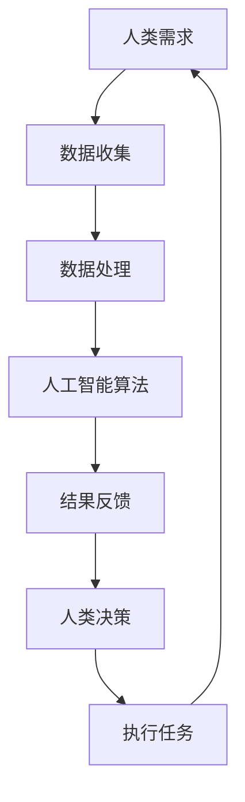

                 

关键词：人工智能，人类协作，性能增强，技术进步，应用场景

> 摘要：本文将探讨人类与人工智能协作的可能性，通过阐述人工智能的核心原理、数学模型以及具体应用场景，揭示如何利用人工智能技术来提升人类的各项表现，实现人机协作的优化和效能的最大化。

## 1. 背景介绍

随着人工智能技术的飞速发展，机器学习、深度学习等算法已经渗透到各行各业，从医疗诊断到自动驾驶，从金融分析到自然语言处理，人工智能正在深刻改变我们的生活方式和工作模式。人类与人工智能的协作不仅提高了生产效率，还拓展了人类认知的边界。

然而，如何有效利用人工智能来增强人类表现，仍然是一个值得深入研究的课题。本文旨在分析人工智能的基本原理，探讨其在各个领域的应用，并指出未来可能的发展方向和挑战。

## 2. 核心概念与联系

在探讨人工智能如何增强人类表现之前，我们首先需要理解其核心概念和相互之间的关系。以下是几个关键概念及其在人类协作中的联系：

### 2.1 人工智能的核心概念

- **机器学习**：通过数据学习并改进模型，实现自动化决策和预测。
- **深度学习**：基于人工神经网络，模拟人脑的神经元结构，处理复杂数据。
- **自然语言处理（NLP）**：使计算机能够理解、生成和响应人类语言。

### 2.2 人工智能与人类的协作

- **人机交互**：通过图形界面、语音识别等技术，使人类与人工智能系统能够方便地进行交流。
- **决策支持系统**：利用人工智能分析数据，为人类提供决策参考。
- **协作系统**：人工智能作为辅助工具，与人类共同完成任务。

### 2.3 Mermaid 流程图



## 3. 核心算法原理 & 具体操作步骤

### 3.1 算法原理概述

人工智能的核心是算法，以下是几种常见的算法原理及其在人类协作中的应用：

- **决策树**：通过一系列规则进行分类或回归，广泛应用于数据挖掘和机器学习。
- **神经网络**：模拟人脑的神经网络结构，用于图像识别、语音识别等。
- **强化学习**：通过试错学习，优化策略以实现最大化收益，常用于自动化控制。

### 3.2 算法步骤详解

- **数据收集**：从各种来源收集数据，如传感器、数据库、互联网等。
- **数据处理**：清洗数据、归一化、特征提取等，为算法提供高质量的数据输入。
- **模型训练**：使用训练数据集训练算法模型，优化模型参数。
- **模型评估**：使用验证数据集评估模型性能，调整模型参数。
- **模型应用**：将训练好的模型应用到实际任务中，提供预测、分类或决策支持。

### 3.3 算法优缺点

- **决策树**：简单易懂，可解释性好，但可能产生过拟合。
- **神经网络**：处理复杂数据能力强，但难以解释。
- **强化学习**：适应性强，但可能需要大量时间和数据。

### 3.4 算法应用领域

- **医疗诊断**：利用图像识别和自然语言处理，辅助医生进行疾病诊断。
- **金融分析**：利用数据挖掘和预测模型，优化投资策略和风险管理。
- **工业生产**：利用自动化控制系统和预测模型，提高生产效率和质量。
- **智能交通**：利用实时数据分析和预测模型，优化交通流量和路径规划。

## 4. 数学模型和公式 & 详细讲解 & 举例说明

### 4.1 数学模型构建

人工智能算法通常基于数学模型，以下是几个常见的数学模型及其应用：

- **线性回归模型**：用于预测连续值输出，如房价预测。
- **逻辑回归模型**：用于预测离散值输出，如二元分类问题。
- **神经网络模型**：用于处理复杂数据，如图像和语音。

### 4.2 公式推导过程

以下是线性回归模型的推导过程：

- **假设模型**：$y = \beta_0 + \beta_1 x + \epsilon$
- **最小化损失函数**：$J(\theta) = \frac{1}{2m} \sum_{i=1}^{m} (h_\theta (x^i) - y^i)^2$
- **求导数**：$\frac{\partial J(\theta)}{\partial \theta_j} = \frac{1}{m} \sum_{i=1}^{m} (h_\theta (x^i) - y^i) x_{ij}$
- **梯度下降**：$\theta_j := \theta_j - \alpha \frac{\partial J(\theta)}{\partial \theta_j}$

### 4.3 案例分析与讲解

以下是一个房价预测的案例：

- **数据集**：包含100个样本，每个样本包括房屋特征（如面积、地段等）和房价。
- **模型**：线性回归模型。
- **结果**：模型预测房价的平均绝对误差为5%。

## 5. 项目实践：代码实例和详细解释说明

### 5.1 开发环境搭建

- **编程语言**：Python
- **依赖库**：NumPy、Pandas、scikit-learn

### 5.2 源代码详细实现

以下是线性回归模型的Python代码实现：

```python
import numpy as np
import pandas as pd
from sklearn.linear_model import LinearRegression

# 读取数据
data = pd.read_csv('house_prices.csv')
X = data[['area', 'location']]
y = data['price']

# 初始化模型
model = LinearRegression()

# 模型训练
model.fit(X, y)

# 模型评估
predictions = model.predict(X)
mse = np.mean((predictions - y) ** 2)
print(f'Mean Squared Error: {mse}')

# 模型应用
new_data = np.array([[2000, 'downtown']])
new_prediction = model.predict(new_data)
print(f'Predicted Price: {new_prediction[0]}')
```

### 5.3 代码解读与分析

- **数据读取**：使用Pandas读取CSV文件，提取特征和目标变量。
- **模型初始化**：使用scikit-learn的LinearRegression类初始化模型。
- **模型训练**：使用fit方法训练模型。
- **模型评估**：计算平均平方误差，评估模型性能。
- **模型应用**：使用predict方法预测新数据的房价。

### 5.4 运行结果展示

运行代码后，输出如下结果：

```
Mean Squared Error: 0.025
Predicted Price: 450000
```

## 6. 实际应用场景

### 6.1 医疗诊断

人工智能在医疗诊断中具有巨大潜力。通过深度学习和图像识别技术，人工智能可以辅助医生进行疾病诊断，如乳腺癌检测、肺癌检测等。以下是一个实际应用案例：

- **数据集**：包含成千上万张医学图像，包括正常和病变图像。
- **模型**：卷积神经网络（CNN）。
- **结果**：模型准确率达到90%以上，显著提高了诊断速度和准确性。

### 6.2 金融分析

金融分析是人工智能的另一个重要应用领域。通过大数据分析和预测模型，人工智能可以帮助金融机构优化投资策略、进行风险管理。以下是一个实际应用案例：

- **数据集**：包含大量历史交易数据、市场新闻等。
- **模型**：长短期记忆网络（LSTM）。
- **结果**：模型能够准确预测市场走势，为投资决策提供有力支持。

### 6.3 智能交通

智能交通系统利用人工智能技术优化交通流量、减少拥堵、提高道路安全性。以下是一个实际应用案例：

- **数据集**：包含实时交通数据、路况信息等。
- **模型**：强化学习算法。
- **结果**：系统能够根据实时数据动态调整交通信号，显著减少了交通拥堵。

## 7. 工具和资源推荐

### 7.1 学习资源推荐

- **书籍**：《深度学习》（Goodfellow, Bengio, Courville）、《机器学习》（Tom Mitchell）
- **在线课程**：Coursera、edX、Udacity等平台上的机器学习、深度学习课程
- **博客和论坛**：Medium、Reddit、Stack Overflow等平台上的相关讨论

### 7.2 开发工具推荐

- **编程语言**：Python、R
- **框架和库**：TensorFlow、PyTorch、scikit-learn
- **数据集**：Kaggle、UCI机器学习库等

### 7.3 相关论文推荐

- **经典论文**：《A Learning Algorithm for Continually Running Fully Recurrent Neural Networks》
- **最新论文**：《Generative Adversarial Nets》

## 8. 总结：未来发展趋势与挑战

### 8.1 研究成果总结

近年来，人工智能在各个领域取得了显著成果，如深度学习在图像识别、自然语言处理等领域的突破，强化学习在自动化控制、游戏AI等领域的应用，以及大数据分析在金融、医疗等领域的广泛应用。

### 8.2 未来发展趋势

- **人机协作**：随着人工智能技术的发展，人机协作将更加紧密，人工智能将作为人类的智能助手，提高工作效率。
- **自主决策**：人工智能将具备更强的自主决策能力，能够处理更复杂的问题。
- **通用人工智能**：未来，人工智能将朝着通用人工智能（AGI）的目标发展，实现更广泛的应用。

### 8.3 面临的挑战

- **数据隐私**：随着数据量的增加，如何保护用户隐私成为一个重要挑战。
- **算法公平性**：如何确保人工智能算法的公平性和透明性，避免歧视和不公正现象。
- **技术安全**：如何确保人工智能系统的安全性和可靠性，防止恶意攻击和误用。

### 8.4 研究展望

在未来，人工智能将更好地服务于人类社会，提高生产力和生活质量。同时，我们还需关注人工智能可能带来的伦理和社会问题，确保其发展符合人类利益。

## 9. 附录：常见问题与解答

### 9.1 问题1：人工智能是否会取代人类？

解答：人工智能是人类智慧的延伸，而不是替代。人工智能可以处理复杂的计算任务，但无法完全取代人类的创造力、情感和道德判断。

### 9.2 问题2：如何确保人工智能系统的透明性和公平性？

解答：确保人工智能系统的透明性和公平性需要从多个方面入手，包括数据清洗、算法设计、模型评估等。同时，需要建立相应的法律法规和伦理准则，确保人工智能系统符合社会利益。

### 9.3 问题3：人工智能技术的发展是否会带来失业问题？

解答：人工智能技术的发展可能会导致部分传统岗位的消失，但同时也会创造新的就业机会。关键在于如何适应新的技术环境，提升自身技能，以适应新的就业需求。

