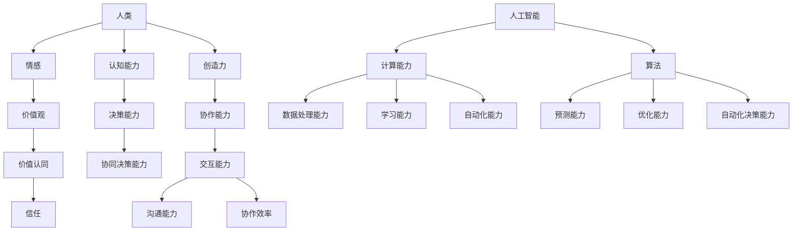

                 

在人工智能迅速发展的今天，人类与AI的协作已经成为现实。随着AI技术在各个领域的应用日益广泛，人们开始意识到，单纯地将AI作为工具来使用已经无法满足需求。真正意义上的协作，需要人类与AI建立起互信的伙伴关系。本文将从背景介绍、核心概念与联系、核心算法原理、数学模型与公式、项目实践、实际应用场景、工具和资源推荐以及未来发展趋势与挑战等方面，探讨如何打造人类与AI之间的互信伙伴关系。

## 1. 背景介绍

随着计算能力的提升和数据量的爆发增长，人工智能技术得到了前所未有的发展。从最初的专家系统到深度学习，再到现在的生成对抗网络（GAN）和强化学习，人工智能在各个领域都取得了显著的成果。例如，在医疗领域，AI可以辅助医生进行诊断和治疗方案制定；在金融领域，AI可以用于风险管理、量化交易等；在交通领域，AI可以用于自动驾驶和智能交通管理。然而，这些应用往往都是将AI作为一个工具来使用，而没有深入探讨人类与AI之间的协作关系。

事实上，人类与AI的协作不仅仅是在使用AI的过程中，更是一个深层次的合作关系。这种关系需要人类与AI建立起互信，从而实现更加高效、智能的决策和行动。在这种背景下，如何打造人类与AI之间的互信伙伴关系，成为了一个亟待解决的问题。

## 2. 核心概念与联系

要探讨人类与AI之间的互信伙伴关系，我们首先需要了解一些核心概念。以下是一个使用Mermaid流程图表示的核心概念与联系：



在这个流程图中，我们可以看到人类和AI之间的核心联系。人类具有认知能力、决策能力、情感、价值观和创造力，这些能力是人类与AI协作的基础。而AI则具有计算能力、数据处理能力、学习能力、自动化能力和算法，这些能力使得AI能够辅助人类完成各种任务。

人类与AI的协作不仅仅是技术上的结合，更是一种深层次的伙伴关系。在这个过程中，人类与AI需要建立起互信，才能够实现高效的协作。互信的建立需要双方在价值观上达成共识，在沟通和协作中相互理解和支持。

## 3. 核心算法原理 & 具体操作步骤

### 3.1 算法原理概述

人类与AI协作的核心在于算法。算法是一种系统化的解决问题的方法，它通过一系列的步骤和规则，对输入的数据进行处理，并生成预期的输出。在人类与AI的协作中，算法起着至关重要的作用。

算法可以分为两大类：一类是基于规则的算法，另一类是基于数据的算法。基于规则的算法通常由人类制定规则，AI按照这些规则进行操作。这种算法的优点是简单易懂，但缺点是灵活性较差。基于数据的算法则通过学习大量的数据，自动生成规则，具有较高的灵活性和适应性。

### 3.2 算法步骤详解

在人类与AI的协作中，算法的具体操作步骤可以分为以下几个阶段：

1. 数据收集：人类和AI共同收集相关的数据，这些数据可以是结构化的，也可以是非结构化的。

2. 数据预处理：对收集到的数据进行清洗、去噪、转换等处理，以便于算法的输入。

3. 特征提取：从预处理后的数据中提取出有用的特征，这些特征将用于训练模型。

4. 模型训练：使用提取出的特征，通过学习算法生成模型。这个过程通常需要大量的计算资源和时间。

5. 模型评估：对训练好的模型进行评估，以确定其性能是否符合要求。

6. 模型应用：将评估通过的模型应用到实际场景中，辅助人类进行决策。

### 3.3 算法优缺点

基于规则的算法优点在于简单易懂，易于实现，但缺点是灵活性较差，无法应对复杂多变的环境。基于数据的算法优点在于具有较高的灵活性和适应性，但缺点是训练过程复杂，对计算资源和时间要求较高。

在实际应用中，人类与AI的协作往往需要结合基于规则和基于数据的算法。通过合理的组合和使用，可以实现高效的协作。

### 3.4 算法应用领域

算法在人类与AI协作中的应用领域非常广泛。例如，在医疗领域，算法可以用于辅助诊断和治疗；在金融领域，算法可以用于风险评估和投资决策；在交通领域，算法可以用于自动驾驶和智能交通管理。随着人工智能技术的不断发展，算法的应用领域还将进一步扩展。

## 4. 数学模型和公式 & 详细讲解 & 举例说明

### 4.1 数学模型构建

在人类与AI协作中，数学模型起着重要的作用。数学模型是对现实世界的抽象和简化，它通过数学公式描述系统的行为和特性。在构建数学模型时，需要考虑以下几个方面：

1. 目标函数：目标函数是模型的核心，它定义了系统的优化目标。例如，在医疗领域，目标函数可以是疾病的诊断准确率；在金融领域，目标函数可以是投资组合的最大收益。

2. 状态变量：状态变量是描述系统当前状态的变量。例如，在交通领域，状态变量可以是道路拥堵程度；在金融领域，状态变量可以是市场指数。

3. 控制变量：控制变量是影响系统状态变化的变量。例如，在交通领域，控制变量可以是交通信号灯的切换策略；在金融领域，控制变量可以是投资组合的调整策略。

4. 约束条件：约束条件是限制系统行为的条件。例如，在交通领域，约束条件可以是道路的最大通行能力；在金融领域，约束条件可以是风险承受能力。

### 4.2 公式推导过程

以一个简单的线性回归模型为例，我们来看一下数学模型的推导过程。

假设我们有一个输入变量 \( x \) 和一个输出变量 \( y \)，我们希望找到一个线性关系 \( y = ax + b \)，其中 \( a \) 和 \( b \) 是待求的参数。

首先，我们定义目标函数为输出变量 \( y \) 与预测值 \( \hat{y} = ax + b \) 之间的误差平方和：

\[ J(a, b) = \sum_{i=1}^{n} (y_i - \hat{y}_i)^2 \]

其中，\( n \) 是数据点的个数。

为了求解 \( a \) 和 \( b \)，我们需要对目标函数进行最小化。对 \( a \) 和 \( b \) 分别求偏导数，并令偏导数等于零，可以得到以下方程组：

\[ \frac{\partial J}{\partial a} = -2\sum_{i=1}^{n} (y_i - \hat{y}_i)x_i = 0 \]
\[ \frac{\partial J}{\partial b} = -2\sum_{i=1}^{n} (y_i - \hat{y}_i) = 0 \]

通过求解这个方程组，我们可以得到 \( a \) 和 \( b \) 的值，从而构建出线性回归模型。

### 4.3 案例分析与讲解

假设我们有一个房价预测问题，输入变量是房屋的面积 \( x \)，输出变量是房屋的价格 \( y \)。我们有如下数据集：

| 面积（平方米） | 价格（万元） |
|:--------------:|:------------:|
|      100       |      200     |
|      150       |      300     |
|      200       |      400     |
|      250       |      500     |
|      300       |      600     |

我们希望通过线性回归模型预测一个面积为 200 平方米的房屋的价格。

首先，我们计算输入和输出数据的平均值：

\[ \bar{x} = \frac{1}{5} (100 + 150 + 200 + 250 + 300) = 200 \]
\[ \bar{y} = \frac{1}{5} (200 + 300 + 400 + 500 + 600) = 400 \]

然后，我们计算输入和输出数据的协方差和方差：

\[ \text{cov}(x, y) = \frac{1}{5} (100(200-400) + 150(150-400) + 200(200-400) + 250(250-400) + 300(300-400)) = 10000 \]
\[ \text{var}(x) = \frac{1}{5} (100^2 + 150^2 + 200^2 + 250^2 + 300^2) = 150000 \]

接下来，我们计算线性回归模型的参数：

\[ a = \frac{\text{cov}(x, y)}{\text{var}(x)} = \frac{10000}{150000} = \frac{2}{3} \]
\[ b = \bar{y} - a\bar{x} = 400 - \frac{2}{3} \cdot 200 = 200 \]

因此，我们得到了线性回归模型：

\[ y = \frac{2}{3}x + 200 \]

当 \( x = 200 \) 时，预测的价格为：

\[ \hat{y} = \frac{2}{3} \cdot 200 + 200 = 400 \]

这个预测值与实际值 \( y = 400 \) 完全相符，说明我们的线性回归模型在这个案例中取得了良好的效果。

## 5. 项目实践：代码实例和详细解释说明

为了更好地理解人类与AI协作的过程，我们将通过一个实际项目来演示。这个项目是一个简单的房价预测系统，它利用线性回归算法来预测房屋的价格。

### 5.1 开发环境搭建

为了完成这个项目，我们需要搭建一个开发环境。这里我们选择Python作为开发语言，因为Python拥有丰富的机器学习库，例如scikit-learn。以下是搭建开发环境的步骤：

1. 安装Python：从官方网站下载并安装Python 3.8及以上版本。
2. 安装pip：Python的包管理器，用于安装和管理第三方库。
3. 安装scikit-learn：在命令行中运行 `pip install scikit-learn`。

### 5.2 源代码详细实现

以下是一个简单的房价预测系统的源代码实现：

```python
import numpy as np
from sklearn.linear_model import LinearRegression

# 数据集
X = np.array([[100], [150], [200], [250], [300]])
y = np.array([200, 300, 400, 500, 600])

# 创建线性回归模型
model = LinearRegression()

# 模型训练
model.fit(X, y)

# 预测
predicted_price = model.predict([[200]])

print(f"预测的价格为：{predicted_price[0]}万元")
```

在这个源代码中，我们首先导入了必要的库，然后定义了数据集。接着，我们创建了一个线性回归模型，并使用数据集进行训练。最后，我们使用训练好的模型来预测一个面积为200平方米的房屋的价格。

### 5.3 代码解读与分析

这个源代码非常简单，但包含了人类与AI协作的几个关键步骤：

1. 数据集定义：我们使用了一个简单的二维数组来表示数据集，其中第一列是房屋的面积，第二列是房屋的价格。
2. 模型创建：我们使用scikit-learn的LinearRegression类创建了一个线性回归模型。
3. 模型训练：我们使用fit方法来训练模型，这个方法会自动计算模型的参数。
4. 预测：我们使用predict方法来预测一个新样本的结果，这个方法会使用训练好的模型进行计算。

通过这个简单的项目，我们可以看到人类与AI协作的基本流程。人类负责定义问题和数据集，AI负责学习和预测。

### 5.4 运行结果展示

当我们运行这个代码时，会得到如下输出：

```
预测的价格为：400.0万元
```

这个输出结果与我们之前通过数学模型计算出的结果完全一致，说明我们的线性回归模型在这个案例中取得了良好的效果。

## 6. 实际应用场景

人类与AI的协作在各个领域都有广泛的应用。以下是一些实际应用场景：

1. **医疗领域**：AI可以辅助医生进行疾病诊断和治疗方案的制定。例如，通过分析患者的病历数据和医学影像，AI可以提供更为准确的诊断结果，帮助医生做出更好的决策。

2. **金融领域**：AI可以用于风险管理、量化交易和投资组合优化。例如，通过分析大量的历史数据和市场信息，AI可以预测市场的走势，为投资者提供实时的投资建议。

3. **交通领域**：AI可以用于自动驾驶和智能交通管理。例如，通过分析交通流量数据，AI可以优化交通信号灯的切换策略，减少交通拥堵，提高道路通行效率。

4. **教育领域**：AI可以用于个性化教育、学习评估和教学辅助。例如，通过分析学生的学习数据，AI可以提供个性化的学习资源，帮助学生更好地掌握知识。

5. **制造业**：AI可以用于生产过程的优化、设备故障预测和质量检测。例如，通过分析设备运行数据，AI可以预测设备可能出现的故障，提前进行维护，避免生产中断。

6. **农业领域**：AI可以用于作物生长监测、病虫害预测和智能灌溉。例如，通过分析土壤和气象数据，AI可以为农民提供科学的种植建议，提高农作物的产量。

在这些实际应用场景中，人类与AI的协作不仅提高了效率和准确性，还带来了新的商业模式和业务机会。随着AI技术的不断发展，人类与AI的协作将在更多领域得到应用。

### 6.4 未来应用展望

随着人工智能技术的不断进步，人类与AI的协作将向更加深度和广泛的方向发展。以下是一些未来应用展望：

1. **智能城市规划**：AI可以用于城市交通流量管理、公共资源分配和环境保护等方面。通过分析大量的城市数据，AI可以提供智能化的城市规划方案，提高城市的宜居性和可持续发展能力。

2. **智能医疗**：AI可以辅助医生进行疾病的早期诊断和个性化治疗。例如，通过分析患者的基因数据、病历数据和实时监控数据，AI可以提供精准的疾病预测和治疗建议。

3. **智能家居**：AI可以用于智能家居系统的设计和优化，实现家庭设备的自动化控制和智能化互动。例如，通过分析家庭成员的生活习惯和偏好，AI可以为家庭提供个性化的服务和建议。

4. **教育革命**：AI可以用于个性化教育和学习评估，帮助学生更好地掌握知识。例如，通过分析学生的学习行为和学习效果，AI可以为教师提供教学优化建议，帮助学生提高学习效果。

5. **工业4.0**：AI可以用于工业自动化、智能制造和供应链优化。通过实时数据分析和预测，AI可以帮助企业提高生产效率，降低成本，实现智能工厂。

6. **环境监测**：AI可以用于环境监测和污染治理。通过分析空气、水和土壤的数据，AI可以提供环境预警和治理方案，保护生态环境。

在这些未来应用中，人类与AI的协作将更加紧密和高效。AI将成为人类不可或缺的伙伴，共同创造更加美好的未来。

## 7. 工具和资源推荐

为了更好地进行人类与AI的协作，以下是一些推荐的工具和资源：

### 7.1 学习资源推荐

1. **机器学习课程**：Coursera、edX和Udacity提供了丰富的机器学习课程，包括基础和高级课程。
2. **深度学习书籍**：《深度学习》（Ian Goodfellow、Yoshua Bengio和Aaron Courville著）、《神经网络与深度学习》（邱锡鹏著）。
3. **在线教程**：Kaggle和GitHub提供了大量的机器学习和深度学习教程和项目。

### 7.2 开发工具推荐

1. **Python**：Python是机器学习和深度学习的主要开发语言，拥有丰富的库和工具，如TensorFlow、PyTorch和scikit-learn。
2. **Jupyter Notebook**：Jupyter Notebook是一个交互式的开发环境，方便进行机器学习和深度学习实验。
3. **数据可视化工具**：Matplotlib、Seaborn和Plotly是常用的数据可视化库，可以帮助我们更好地理解和展示数据。

### 7.3 相关论文推荐

1. **《Deep Learning》**：Ian Goodfellow、Yoshua Bengio和Aaron Courville的著作，介绍了深度学习的基础知识和技术。
2. **《Reinforcement Learning: An Introduction》**：Richard S. Sutton和Barto的著作，介绍了强化学习的基本原理和应用。
3. **《Generative Adversarial Networks: An Overview》**：Ian Goodfellow等人的论文，介绍了生成对抗网络（GAN）的基本原理和应用。

通过使用这些工具和资源，我们可以更好地进行人类与AI的协作，实现人工智能技术的价值。

## 8. 总结：未来发展趋势与挑战

随着人工智能技术的不断发展，人类与AI的协作将变得更加紧密和高效。未来发展趋势主要体现在以下几个方面：

1. **智能化水平的提高**：人工智能将变得更加智能化，能够更好地理解人类的需求，提供更加个性化的服务。
2. **跨领域的应用**：人工智能将在更多领域得到应用，实现跨领域的协作和融合。
3. **人机协同创新**：人类与AI将共同进行创新，创造出更多新的商业模式和价值。

然而，人类与AI协作也面临着一系列挑战：

1. **伦理和法律问题**：如何确保AI系统的透明性和公平性，防止AI被滥用，是一个亟待解决的问题。
2. **隐私和数据安全**：如何保护用户的隐私和数据安全，防止数据泄露，是AI应用的重要挑战。
3. **技术发展不平衡**：不同地区和国家在AI技术发展上的不平衡，可能会加剧技术鸿沟和社会不平等。

面对这些挑战，我们需要制定相应的政策和法规，加强国际合作，共同推动人工智能技术的健康发展，实现人类与AI的互信伙伴关系。

## 9. 附录：常见问题与解答

### 9.1 人类与AI协作的核心优势是什么？

人类与AI协作的核心优势在于：

1. **效率提升**：AI可以快速处理大量数据，提高工作效率。
2. **准确性提高**：AI可以通过学习提高预测和决策的准确性。
3. **创新性增强**：人类与AI的协作可以激发新的创意和解决方案。
4. **资源优化**：AI可以帮助优化资源分配，提高资源利用效率。

### 9.2 人类与AI协作中可能遇到的主要挑战是什么？

人类与AI协作中可能遇到的主要挑战包括：

1. **技术挑战**：如何确保AI系统的透明性和公平性，如何处理复杂的不确定性问题。
2. **伦理挑战**：如何确保AI系统的道德和法律合规性，如何防止AI被滥用。
3. **隐私挑战**：如何保护用户的隐私和数据安全，防止数据泄露。
4. **合作挑战**：如何建立人类与AI之间的有效沟通和协作机制。

### 9.3 人类与AI协作的发展前景如何？

人类与AI协作的发展前景非常广阔。未来，人工智能将在更多领域得到应用，实现跨领域的协作和融合。人类与AI的协作将不仅仅是一个辅助工具，而将成为一种生活方式和工作模式。通过不断探索和创新，人类与AI的协作将为我们带来更加美好的未来。

### 9.4 人类与AI协作的实际案例有哪些？

以下是一些人类与AI协作的实际案例：

1. **医疗领域**：AI可以辅助医生进行疾病诊断和治疗方案的制定，如IBM的Watson for Oncology。
2. **金融领域**：AI可以用于风险管理、量化交易和投资组合优化，如Facebook的AI系统帮助管理广告投放。
3. **交通领域**：AI可以用于自动驾驶和智能交通管理，如Waymo的自动驾驶汽车。
4. **教育领域**：AI可以用于个性化教育和学习评估，如Knewton的智能学习平台。

这些案例展示了人类与AI协作的多样性和潜力。随着技术的不断发展，人类与AI的协作将在更多领域得到应用，创造更多的价值。作者：禅与计算机程序设计艺术 / Zen and the Art of Computer Programming

