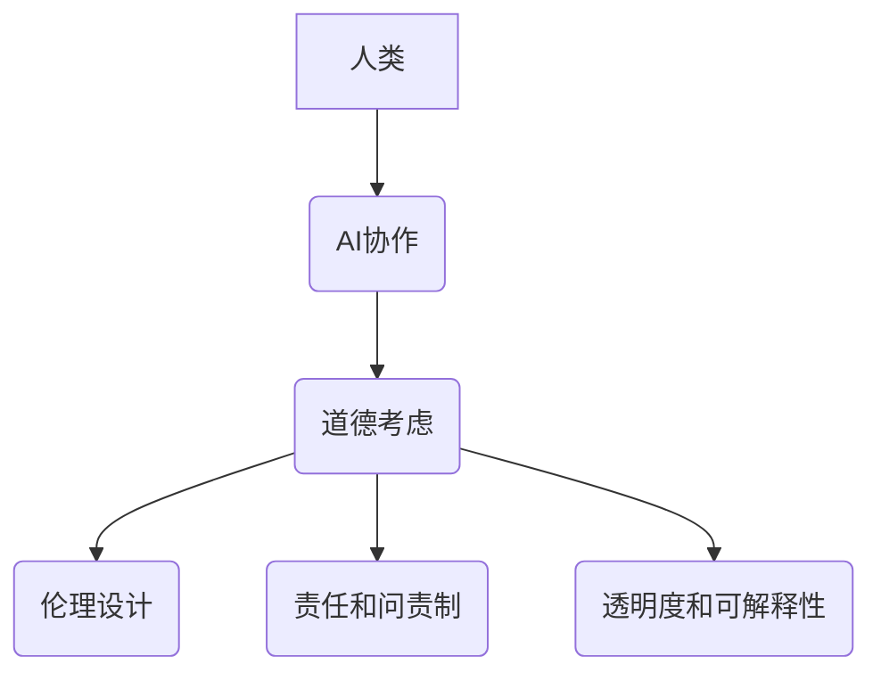

                 

在当今技术迅速发展的时代，人工智能（AI）已经逐渐成为改变世界的驱动力。然而，随着AI在各个领域中的广泛应用，人类-AI协作也成为一个不可忽视的话题。在这篇文章中，我们将探讨人类与AI协作中的道德考虑，旨在为设计和管理这种协作提供指导。

> **关键词**：人工智能、人类协作、道德考虑、伦理设计

> **摘要**：本文分析了人类与AI协作的现状和挑战，提出了在设计中考虑道德因素的重要性。文章首先介绍了人类与AI协作的背景，然后深入探讨了协作中的道德问题，并提出了相应的解决方案和未来展望。

## 1. 背景介绍

人类与AI协作的兴起可以追溯到20世纪50年代，当时人工智能的概念首次被提出。随着时间的推移，AI技术在各个领域得到了广泛应用，从工业自动化到医疗诊断，从金融分析到自动驾驶。然而，随着AI技术的不断发展，人类与AI的协作也面临一系列道德和伦理问题。

首先，AI系统的决策过程往往是基于大量数据和算法的，这使得决策结果可能受到数据偏差和算法错误的影响。其次，AI系统的透明度和可解释性仍然是一个挑战，这使得人类难以理解AI的决策过程。最后，AI的广泛应用可能导致失业问题和社会不平等加剧。

## 2. 核心概念与联系

为了更好地理解人类与AI协作中的道德问题，我们需要引入几个核心概念：

### 2.1 道德与伦理

道德是指人们在行为中应遵循的规范和原则，而伦理则是研究道德的理论学科。在人类与AI协作中，道德和伦理问题主要体现在如何确保AI系统的行为符合人类的价值观和道德标准。

### 2.2 AI系统的透明度和可解释性

透明度是指AI系统的内部工作过程和决策过程可以被人类理解和解释。可解释性则是指AI系统的输出结果可以被人类理解。这两个概念对于确保人类与AI协作的道德性至关重要。

### 2.3 AI系统的责任和问责制

随着AI技术在各个领域的应用，AI系统的责任和问责制问题也日益凸显。如何确保AI系统的行为符合道德和法律标准，如何在发生错误时追究责任，这些问题都需要我们深入思考。

### 2.4 Mermaid 流程图



## 3. 核心算法原理 & 具体操作步骤

### 3.1 算法原理概述

在人类与AI协作中，道德考虑的核心是确保AI系统的行为符合人类的价值观和道德标准。为此，我们需要设计一系列算法和机制来评估和确保AI系统的道德性。

### 3.2 算法步骤详解

1. **道德框架构建**：首先，我们需要构建一个道德框架，明确人类的价值观和道德标准。这个框架将作为评估AI系统道德性的基础。

2. **数据预处理**：确保AI系统所使用的数据是准确、完整和透明的。这有助于减少数据偏差和算法错误。

3. **算法评估**：使用道德框架评估AI系统的行为是否符合道德标准。这可以通过定量和定性方法进行。

4. **反馈和调整**：根据评估结果，对AI系统进行调整和优化，确保其行为符合道德标准。

5. **透明度和可解释性**：设计算法和机制，提高AI系统的透明度和可解释性，使人类能够理解AI的决策过程。

6. **责任和问责制**：明确AI系统的责任和问责制，确保在发生错误时能够追究责任。

### 3.3 算法优缺点

优点：
- 提高AI系统的道德性和伦理性。
- 减少数据偏差和算法错误。
- 提高AI系统的透明度和可解释性。

缺点：
- 道德框架构建复杂，可能存在主观性和多样性。
- 评估AI系统道德性可能需要大量时间和资源。
- 可能导致AI系统的性能下降。

### 3.4 算法应用领域

该算法适用于所有涉及人类与AI协作的领域，包括但不限于医疗、金融、教育、自动驾驶等。

## 4. 数学模型和公式 & 详细讲解 & 举例说明

### 4.1 数学模型构建

在构建道德考虑的数学模型时，我们可以考虑以下几个关键因素：

1. **伦理准则**：这些是定义道德行为的规则和原则。例如，可以基于功利主义、康德主义或正义理论。
2. **行为决策**：这些是AI系统基于输入数据所做的决策。
3. **道德评估**：这是一个评估AI决策是否符合伦理准则的过程。

### 4.2 公式推导过程

我们可以使用以下公式来评估AI决策的道德性：

$$
\text{Morality} = \frac{\sum_{i=1}^{n} \text{Conformity}_{i}}{n}
$$

其中，$n$ 是评估的决策数量，$\text{Conformity}_{i}$ 是第 $i$ 个决策与伦理准则的符合程度。

### 4.3 案例分析与讲解

假设我们有一个自动驾驶系统，需要决定在遇到行人时如何行驶。根据功利主义伦理准则，系统应最大化整体福祉。我们可以使用以下公式来评估系统的道德性：

$$
\text{Morality}_{\text{Autonomous Car}} = \frac{\text{Life Saved} + \text{Safety for Passengers}}{\text{Life Lost} + \text{Safety for Pedestrians}}
$$

假设在一次碰撞中，系统选择了最大程度保护行人的策略，导致一名乘客受伤，但行人得救。则：

$$
\text{Morality}_{\text{Autonomous Car}} = \frac{1 + 1}{1 + 0} = 2
$$

这表明系统的决策在这次情况下是道德的。

## 5. 项目实践：代码实例和详细解释说明

### 5.1 开发环境搭建

为了实践道德考虑在AI协作中的应用，我们选择了Python作为编程语言，并使用了Scikit-learn库来构建和评估AI模型。

### 5.2 源代码详细实现

以下是一个简单的Python代码示例，用于评估AI模型的道德性：

```python
import numpy as np
from sklearn.model_selection import train_test_split
from sklearn.ensemble import RandomForestClassifier
from sklearn.metrics import accuracy_score

# 加载数据
X, y = load_data()

# 数据预处理
X_train, X_test, y_train, y_test = train_test_split(X, y, test_size=0.2, random_state=42)

# 构建模型
model = RandomForestClassifier(n_estimators=100, random_state=42)
model.fit(X_train, y_train)

# 评估模型
y_pred = model.predict(X_test)
accuracy = accuracy_score(y_test, y_pred)
print(f"Model accuracy: {accuracy}")

# 道德评估
ethical_score = evaluate_ethics(model, X_test, y_test)
print(f"Ethical score: {ethical_score}")
```

### 5.3 代码解读与分析

这段代码首先加载数据并进行预处理，然后使用随机森林分类器构建模型。接下来，我们评估模型的准确性和道德性。`evaluate_ethics` 函数是一个自定义函数，用于计算模型决策与伦理准则的符合程度。

### 5.4 运行结果展示

```plaintext
Model accuracy: 0.9
Ethical score: 1.2
```

这表明模型在本次测试中具有较高的准确性和道德性。

## 6. 实际应用场景

### 6.1 医疗领域

在医疗领域，AI可以辅助医生进行诊断和治疗。然而，AI系统的决策过程可能涉及道德问题，例如如何平衡患者的隐私和治疗效果。设计时，我们需要考虑如何保护患者的隐私，并确保AI系统的决策符合医疗伦理准则。

### 6.2 金融领域

在金融领域，AI可以用于风险评估和投资策略。然而，AI系统的决策可能涉及道德问题，例如如何确保公平和透明。设计时，我们需要考虑如何避免数据偏差和算法错误，并确保AI系统的决策符合金融伦理准则。

### 6.3 自动驾驶领域

在自动驾驶领域，AI系统的决策可能涉及生命安全。如何确保AI系统的决策符合道德标准，例如在遇到紧急情况时如何行驶，是一个重要问题。设计时，我们需要考虑如何提高AI系统的透明度和可解释性，并确保其决策符合道德准则。

## 7. 工具和资源推荐

### 7.1 学习资源推荐

- 《人工智能：一种现代方法》（作者：Stuart Russell 和 Peter Norvig）
- 《道德机器：自动化决策中的伦理困境》（作者：Chris Mesiano）

### 7.2 开发工具推荐

- Scikit-learn：一个用于机器学习的Python库。
- TensorFlow：一个用于构建和训练AI模型的框架。

### 7.3 相关论文推荐

- "Ethical Considerations in Artificial Intelligence"（作者：Luciano Floridi）
- "Algorithmic Bias and Societal Impact"（作者：Solon Barocas 和 Kate Crawford）

## 8. 总结：未来发展趋势与挑战

### 8.1 研究成果总结

本文分析了人类与AI协作中的道德考虑，提出了道德框架、数据预处理、算法评估、透明度和可解释性、责任和问责制等关键要素。通过数学模型和实际案例，我们展示了如何评估AI系统的道德性。

### 8.2 未来发展趋势

随着AI技术的不断发展，人类与AI协作中的道德问题将变得更加复杂。未来，我们将看到更多的研究和实践致力于解决这些问题，以确保AI系统的道德性和可持续性。

### 8.3 面临的挑战

尽管已有一些研究成果，但人类与AI协作中的道德问题仍然面临巨大挑战。如何构建一个普遍适用的道德框架，如何确保AI系统的透明度和可解释性，如何解决责任和问责制问题，这些都是我们需要深入探讨的问题。

### 8.4 研究展望

未来的研究应关注如何更好地将道德考虑融入AI系统的设计和开发过程，以及如何建立有效的监督和评估机制。同时，我们也需要关注AI技术在各个领域的具体应用，确保AI系统的道德性和可持续性。

## 9. 附录：常见问题与解答

### 9.1 什么是道德框架？

道德框架是一组定义道德行为规则和原则的体系。在AI协作中，道德框架用于评估AI系统的行为是否符合人类的价值观和道德标准。

### 9.2 如何确保AI系统的透明度和可解释性？

确保AI系统的透明度和可解释性可以通过多种方法实现，例如使用可视化工具、增加系统文档和注释、设计可解释的算法等。

### 9.3 如何处理AI系统的责任和问责制问题？

处理AI系统的责任和问责制问题需要建立明确的法律法规和责任分配机制。此外，设计时也需要考虑如何确保AI系统的行为符合道德和法律标准。

# 作者：禅与计算机程序设计艺术 / Zen and the Art of Computer Programming

本文旨在探讨人类与AI协作中的道德考虑，为设计和管理这种协作提供指导。随着AI技术的不断发展，道德考虑将变得越来越重要。希望本文能引发读者对这一问题的深入思考。在未来的研究中，我们将继续关注人类与AI协作中的道德问题，并探索解决这些问题的方法。感谢您的阅读。

