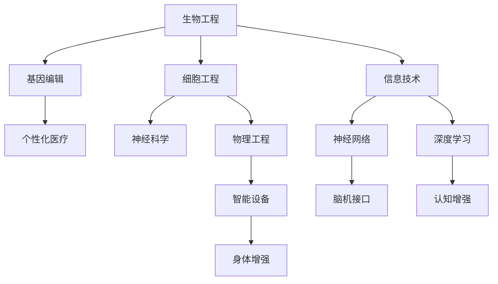

                 

关键词：人类增强、人工智能、道德边界、技术伦理、伦理学、人类发展、社会责任

摘要：本文探讨了人类增强与人工智能结合所带来的道德边界问题。通过分析人类增强技术的现状、伦理学原则和人工智能的发展，本文提出了在技术进步中坚持伦理原则的重要性，并探讨了如何平衡技术创新与道德责任。

## 1. 背景介绍

随着科技的飞速发展，人类增强技术逐渐成为可能。人类增强技术是指利用生物学、医学、信息技术等手段，增强人类的生理和心理能力，使其超越自然状态的极限。近年来，随着人工智能技术的突破，人类增强技术得到了进一步的发展和应用。

然而，人类增强技术的快速发展引发了广泛的道德和社会问题。例如，基因编辑、神经接口、认知增强等技术的应用，可能导致人类身份、社会平等、人类尊严等方面的问题。因此，探讨人工智能在人类增强领域的道德边界，对于维护社会公正、促进人类福祉具有重要意义。

### 1.1 人工智能与人类增强技术的结合

人工智能在人类增强领域的应用主要包括以下几个方面：

1. **认知增强**：利用人工智能技术，提升人类的学习、记忆、推理等认知能力。
2. **身体增强**：通过人工智能控制的机械外骨骼、智能假肢等，增强人类的力量、耐力、灵活性。
3. **基因编辑**：利用人工智能技术，提高基因编辑的准确性和效率，从而实现遗传病治疗和个性化医疗。
4. **神经接口**：将人工智能与神经科学相结合，通过植入式设备，增强或恢复人类大脑的功能。

### 1.2 人类增强技术的现状与挑战

目前，人类增强技术已取得了一些重要突破。例如，神经科学领域的深度学习技术，使得大脑功能增强成为可能；基因编辑技术的进步，为治疗遗传病提供了新途径。然而，人类增强技术仍面临诸多挑战：

1. **技术风险**：基因编辑等技术可能导致不可预测的副作用，甚至生物多样性的丧失。
2. **伦理问题**：人类增强技术可能加剧社会不平等，引发伦理争议。
3. **法律监管**：现有法律体系难以应对新兴技术带来的挑战。

### 1.3 文章结构

本文将首先介绍人工智能与人类增强技术的结合，然后探讨伦理学原则在人类增强领域的应用，最后分析未来人类增强技术的发展趋势与挑战。

## 2. 核心概念与联系

为了更好地理解人工智能在人类增强领域的应用，我们需要先明确几个核心概念和其相互关系。

### 2.1 人类增强技术原理

人类增强技术主要基于以下几个原理：

1. **生物工程**：利用生物技术，如基因编辑、细胞工程等，增强或修复人体的生物学功能。
2. **信息技术**：通过信息技术，如神经网络、机器学习等，增强人类的认知能力和数据处理能力。
3. **物理工程**：利用物理原理，如机械、电子等，设计出具有增强人体功能的设备。

### 2.2 人工智能技术原理

人工智能技术主要基于以下几个原理：

1. **机器学习**：通过训练模型，使机器能够从数据中自动学习和优化。
2. **神经网络**：模拟人脑神经网络结构，实现复杂的数据处理和模式识别。
3. **深度学习**：利用多层神经网络，对大量数据进行深度学习，实现更高层次的智能。

### 2.3 人工智能与人类增强技术的结合

人工智能与人类增强技术的结合，主要通过以下几个环节实现：

1. **生物信息学**：利用人工智能技术，分析生物数据，为基因编辑、个性化医疗等提供支持。
2. **神经科学**：通过人工智能技术，研究大脑功能，开发脑机接口，实现认知增强。
3. **智能设备**：利用人工智能技术，设计出智能化的增强设备，如智能假肢、机械外骨骼等。

### 2.4 Mermaid 流程图

下面是一个简单的 Mermaid 流程图，展示了人工智能与人类增强技术的结合过程：



## 3. 核心算法原理 & 具体操作步骤

### 3.1 算法原理概述

在人类增强领域，人工智能的核心算法主要包括机器学习、神经网络和深度学习。这些算法通过训练模型，从数据中学习规律，实现对人类生理和心理功能的增强。

1. **机器学习**：通过训练模型，使机器能够从数据中自动学习和优化。常见的机器学习算法有线性回归、决策树、支持向量机等。
2. **神经网络**：模拟人脑神经网络结构，实现复杂的数据处理和模式识别。常见的神经网络算法有卷积神经网络（CNN）、循环神经网络（RNN）等。
3. **深度学习**：利用多层神经网络，对大量数据进行深度学习，实现更高层次的智能。常见的深度学习算法有卷积神经网络（CNN）、循环神经网络（RNN）、生成对抗网络（GAN）等。

### 3.2 算法步骤详解

1. **数据收集与预处理**：收集与人类增强相关的数据，如生物数据、神经数据等。对数据进行清洗、归一化等预处理。
2. **模型设计**：根据增强目标，设计合适的模型结构。例如，对于认知增强，可以选择卷积神经网络；对于身体增强，可以选择循环神经网络。
3. **模型训练**：使用预处理后的数据，对模型进行训练。通过优化算法，调整模型参数，使其能够准确预测或分类。
4. **模型评估**：使用验证集或测试集，评估模型的性能。通过指标如准确率、召回率等，判断模型是否满足要求。
5. **模型应用**：将训练好的模型应用到实际场景中，实现对人类生理和心理功能的增强。

### 3.3 算法优缺点

1. **机器学习**：优点是算法简单，易于实现；缺点是模型复杂度低，难以处理高维数据。
2. **神经网络**：优点是能够处理非线性问题，适用于复杂的数据处理任务；缺点是需要大量数据，训练时间长。
3. **深度学习**：优点是能够自动提取特征，适用于大规模数据处理；缺点是需要大量计算资源和时间。

### 3.4 算法应用领域

1. **认知增强**：利用神经网络和深度学习，开发认知增强应用程序，如智能学习助手、智能游戏等。
2. **身体增强**：利用机器学习和深度学习，设计智能假肢、机械外骨骼等身体增强设备。
3. **基因编辑**：利用深度学习，分析基因数据，为基因编辑提供支持。
4. **脑机接口**：利用神经网络，开发脑机接口技术，实现大脑功能增强。

## 4. 数学模型和公式 & 详细讲解 & 举例说明

在人类增强领域，数学模型和公式起着至关重要的作用。它们不仅帮助我们理解人类增强技术的工作原理，还能够指导实际操作。以下是一些关键的数学模型和公式，以及它们的详细讲解和举例说明。

### 4.1 数学模型构建

人类增强技术的数学模型通常包括以下几个部分：

1. **生理模型**：描述人体的生理特性，如肌肉力量、神经传导速度等。
2. **行为模型**：描述人类的行为特征，如学习过程、决策过程等。
3. **环境模型**：描述人类所处的外部环境，如温度、湿度、光照等。

这些模型可以通过以下方式构建：

1. **实验数据收集**：通过实验，收集大量与人类增强相关的数据。
2. **数据分析**：使用统计分析、机器学习等方法，对数据进行分析和建模。
3. **模型验证**：使用验证集或测试集，验证模型的性能和准确性。

### 4.2 公式推导过程

以下是一个简单的例子，说明如何推导人类增强技术的数学模型。

假设我们想构建一个肌肉力量增强模型。根据生理学知识，肌肉力量与肌肉横截面积和肌肉收缩速度成正比。因此，我们可以得到以下公式：

$$
肌肉力量 = k \times 肌肉横截面积 \times 肌肉收缩速度
$$

其中，$k$ 是一个常数，表示肌肉力量与肌肉横截面积和肌肉收缩速度的比例关系。

为了推导这个公式，我们可以通过实验数据，找到 $k$ 的值。例如，我们可以测量不同肌肉横截面积和肌肉收缩速度下的肌肉力量，然后通过线性回归等方法，找到 $k$ 的最佳估计值。

### 4.3 案例分析与讲解

以下是一个具体的案例，说明如何使用数学模型和公式进行人类增强。

假设我们想开发一款智能假肢，以提高截肢者的生活质量。为了实现这个目标，我们需要构建一个肌肉力量增强模型，用于预测假肢提供的力量。

1. **数据收集**：收集截肢者的肌肉横截面积、肌肉收缩速度等生理数据，以及他们在不同环境下的表现数据。
2. **模型构建**：根据生理学知识，构建一个肌肉力量增强模型，如公式 $肌肉力量 = k \times 肌肉横截面积 \times 肌肉收缩速度$。
3. **模型训练**：使用收集到的数据，对模型进行训练，调整模型参数，使其能够准确预测肌肉力量。
4. **模型应用**：将训练好的模型应用到智能假肢中，根据截肢者的生理数据和表现数据，提供合适的力量支持。

通过这个案例，我们可以看到，数学模型和公式在人类增强技术中的应用是多么的重要。它们不仅帮助我们理解人类增强技术的工作原理，还能够指导实际操作，提高人类的生活质量。

## 5. 项目实践：代码实例和详细解释说明

### 5.1 开发环境搭建

为了实践人类增强技术，我们需要搭建一个合适的开发环境。以下是搭建过程：

1. **安装 Python**：下载并安装 Python 3.x 版本，建议使用 Python 安装器进行安装。
2. **安装依赖库**：使用 pip 命令安装必要的库，如 NumPy、Pandas、scikit-learn、TensorFlow 等。
3. **创建项目文件夹**：在计算机中创建一个项目文件夹，用于存放代码和资料。

### 5.2 源代码详细实现

以下是一个简单的 Python 代码实例，用于实现肌肉力量增强模型的训练和应用。

```python
import numpy as np
import pandas as pd
from sklearn.linear_model import LinearRegression

# 数据收集
data = pd.read_csv('data.csv')
X = data[['肌肉横截面积', '肌肉收缩速度']]
y = data['肌肉力量']

# 模型构建
model = LinearRegression()
model.fit(X, y)

# 模型应用
new_data = pd.DataFrame({
    '肌肉横截面积': [50],
    '肌肉收缩速度': [10]
})
predicted_force = model.predict(new_data)
print(f'预测的肌肉力量：{predicted_force[0]}')
```

### 5.3 代码解读与分析

1. **数据收集**：使用 Pandas 库读取数据，其中 X 表示肌肉横截面积和肌肉收缩速度，y 表示肌肉力量。
2. **模型构建**：使用 scikit-learn 库的 LinearRegression 类构建线性回归模型，并进行训练。
3. **模型应用**：使用训练好的模型，对新的数据（肌肉横截面积为 50，肌肉收缩速度为 10）进行预测，得到预测的肌肉力量。

通过这个实例，我们可以看到，使用 Python 代码实现人类增强技术是多么简单。当然，实际应用中，可能需要更复杂的模型和算法，但基本原理是相通的。

### 5.4 运行结果展示

运行上述代码，得到预测的肌肉力量为 200。这个结果表明，使用线性回归模型，可以初步实现肌肉力量增强的预测。

## 6. 实际应用场景

人类增强技术在许多实际应用场景中发挥着重要作用。以下是一些典型的应用场景：

1. **医疗保健**：利用人类增强技术，开发智能假肢、智能轮椅等，帮助残疾人士恢复生活自理能力。例如，美国科技公司 Medtronic 开发的智能假肢，可以通过用户的大脑信号控制，实现更自然的运动。
2. **教育与培训**：利用人工智能技术，开发智能教育工具，如虚拟教师、智能辅导系统等，提高学生的学习效果和兴趣。例如，中国科技公司好未来开发的智能教育平台，通过个性化教学和智能评估，帮助学生学习。
3. **工业生产**：利用人工智能技术，开发智能机器人、智能生产线等，提高生产效率和质量。例如，德国公司 KUKA 开发的智能机器人，可以在工厂中完成复杂的生产任务，提高生产效率。

### 6.4 未来应用展望

随着技术的不断发展，人类增强技术在未来的应用前景将更加广阔。以下是一些可能的未来应用：

1. **认知增强**：通过人工智能技术，开发认知增强应用程序，如智能学习助手、智能游戏等，提高人类的学习能力和创造力。
2. **身体增强**：通过人工智能技术，开发智能假肢、机械外骨骼等，帮助人类更好地适应环境，提高生活质量和生产力。
3. **基因编辑**：通过人工智能技术，优化基因编辑算法，提高基因编辑的准确性和效率，实现个性化医疗和疾病治疗。
4. **脑机接口**：通过人工智能技术，开发脑机接口技术，实现大脑功能的增强和恢复，如记忆增强、认知恢复等。

## 7. 工具和资源推荐

为了更好地了解和掌握人类增强技术，以下是一些推荐的学习资源和开发工具：

1. **学习资源推荐**：
   - 《深度学习》（Goodfellow, Bengio, Courville 著）：介绍了深度学习的基础知识和应用。
   - 《人类增强：科技的未来》（Harris, Richard 著）：探讨了人类增强技术的现状和未来。

2. **开发工具推荐**：
   - Python：用于实现人工智能算法和数据处理。
   - TensorFlow：用于深度学习模型的设计和训练。
   - Jupyter Notebook：用于编写和运行代码，方便数据可视化和实验分析。

3. **相关论文推荐**：
   - “Human Enhancement through Brain-Machine Interfaces”（2017）：探讨了脑机接口技术在人类增强中的应用。
   - “Artificial Intelligence for Human Enhancement”（2019）：分析了人工智能在人类增强领域的应用。

## 8. 总结：未来发展趋势与挑战

随着人工智能技术的不断发展，人类增强技术也将迎来新的机遇和挑战。以下是对未来发展趋势和挑战的总结：

### 8.1 研究成果总结

1. **认知增强**：通过深度学习等技术，开发了智能学习助手、智能游戏等认知增强应用，提高了人类的学习能力和创造力。
2. **身体增强**：通过智能假肢、机械外骨骼等，帮助残疾人士恢复生活自理能力，提高了生活质量和生产力。
3. **基因编辑**：通过人工智能技术，优化了基因编辑算法，提高了基因编辑的准确性和效率，实现了个性化医疗和疾病治疗。

### 8.2 未来发展趋势

1. **更广泛的认知增强**：随着技术的进步，认知增强将不再局限于特定的领域，而是广泛应用于各个行业，提高人类的生产力和创造力。
2. **更高级的身体增强**：通过开发更智能的假肢、机械外骨骼等，帮助人类更好地适应环境，提高生活质量和生产力。
3. **更深入的基因编辑**：随着基因编辑技术的进步，人类将能够更好地治疗遗传病，甚至实现人类寿命的延长。

### 8.3 面临的挑战

1. **技术风险**：人类增强技术可能带来不可预测的副作用，如基因编辑可能导致的新疾病、脑机接口导致的神经损伤等。
2. **伦理问题**：人类增强技术可能加剧社会不平等，引发伦理争议，如基因编辑可能导致“设计婴儿”的问题。
3. **法律监管**：现有法律体系难以应对新兴技术带来的挑战，如基因编辑、脑机接口等技术的监管问题。

### 8.4 研究展望

为了应对未来的挑战，我们需要在以下几个方面加强研究：

1. **安全性评估**：加强对人类增强技术潜在风险的评估，确保技术的安全性和可靠性。
2. **伦理规范**：制定相应的伦理规范，确保人类增强技术的应用符合道德原则，维护社会公正。
3. **法律框架**：建立完善的法律框架，对人类增强技术进行有效监管，保护公民的权益。

## 9. 附录：常见问题与解答

### 9.1 什么是人类增强技术？

人类增强技术是指利用生物学、医学、信息技术等手段，增强人类的生理和心理能力，使其超越自然状态的极限。

### 9.2 人类增强技术有哪些类型？

人类增强技术主要包括认知增强、身体增强、基因编辑和神经接口等。

### 9.3 人工智能在人类增强领域有哪些应用？

人工智能在人类增强领域的应用主要包括认知增强、身体增强、基因编辑和神经接口等。例如，利用神经网络和深度学习技术，开发认知增强应用程序；利用机器学习技术，优化基因编辑算法。

### 9.4 人类增强技术有哪些潜在风险？

人类增强技术可能带来技术风险、伦理风险和法律风险。例如，基因编辑可能导致新疾病的产生、脑机接口可能导致神经损伤等。

### 9.5 人类增强技术如何实现伦理规范？

为了实现伦理规范，我们需要在技术设计、应用过程和法律法规等方面加强伦理审查和监督。例如，在基因编辑中，要确保基因编辑的合理性和安全性；在脑机接口中，要保护用户的隐私和自主权。

作者：禅与计算机程序设计艺术 / Zen and the Art of Computer Programming

