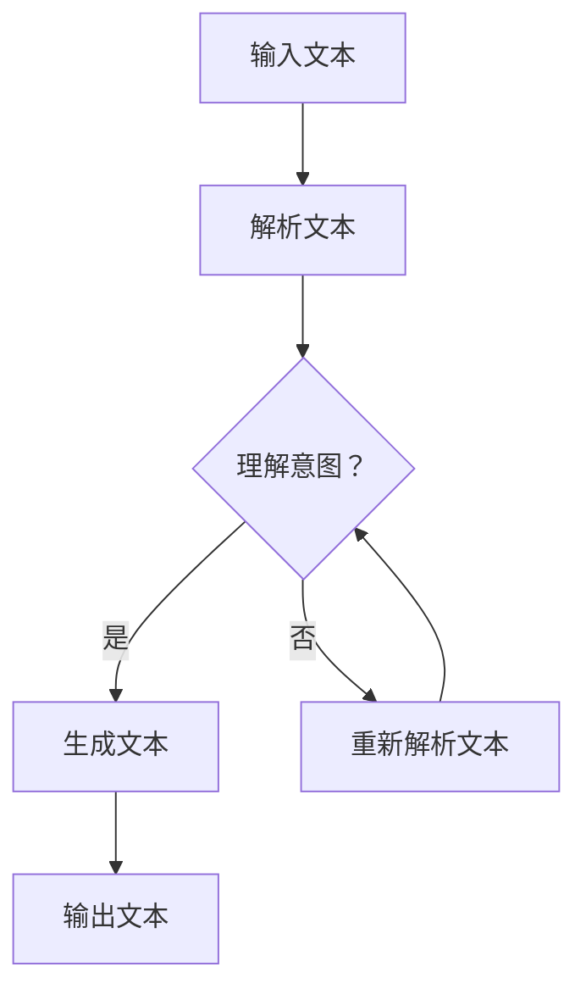

                 

关键词：人类意图、语言模型、对齐、挑战、AI、自然语言处理、技术、研究、应用。

> 摘要：本文深入探讨了人类意图与大型语言模型（LLM）对齐的挑战。通过对LLM的原理、应用场景以及人类意图的理解，分析了目前存在的主要问题，并提出了一些可能的解决方案，旨在为未来的人工智能研究提供有价值的参考。

## 1. 背景介绍

随着人工智能技术的快速发展，自然语言处理（NLP）已经成为一个重要的研究领域。在NLP中，语言模型（Language Model，简称LM）扮演着核心角色。特别是近年来，大型语言模型（Large Language Model，简称LLM）如GPT-3、BERT等在各个领域取得了显著的成果，使得机器能够生成更加流畅、准确的自然语言文本。

然而，尽管LLM在自然语言生成、机器翻译、文本分类等方面取得了巨大的成功，但如何确保LLM能够准确理解并实现对人类意图的对齐，仍然是一个亟待解决的问题。本文旨在探讨人类意图与LLM对齐的挑战，分析目前存在的主要问题，并提出一些可能的解决方案。

## 2. 核心概念与联系

### 2.1. 人类意图

人类意图是指人类在进行某个活动时所追求的目标和动机。在自然语言交流中，人类意图通常通过语言表达出来，例如：“我想要一杯咖啡。”这句话中，“我想要”表达了人类的主观意图，“一杯咖啡”则是意图的具体内容。

### 2.2. 语言模型

语言模型是一种基于统计方法的模型，用于预测一段文本中下一个单词的概率。在NLP中，语言模型通常用来生成文本、翻译文本、进行文本分类等。

### 2.3. LLM与人类意图对齐

LLM与人类意图对齐是指通过训练和优化，使LLM能够准确地理解并生成符合人类意图的文本。这需要LLM不仅具备强大的语言生成能力，还需要具备对人类意图的深刻理解。

### 2.4. Mermaid流程图

下面是一个描述LLM与人类意图对齐过程的Mermaid流程图：



## 3. 核心算法原理 & 具体操作步骤

### 3.1. 算法原理概述

LLM与人类意图对齐的核心算法是基于深度学习的方法，主要包括以下几个步骤：

1. 输入文本：将人类意图的表达作为输入文本。
2. 解析文本：对输入文本进行语义分析，提取关键信息。
3. 理解意图：通过对比和分析，确定输入文本中的意图。
4. 生成文本：根据确定的意图，生成符合人类意图的文本。
5. 输出文本：将生成的文本作为输出结果。

### 3.2. 算法步骤详解

1. 输入文本：首先，我们需要获取人类意图的表达。这可以通过多种方式实现，例如用户输入、语音识别等。
2. 解析文本：接下来，我们需要对输入文本进行语义分析，提取关键信息。这可以通过词性标注、命名实体识别等NLP技术实现。
3. 理解意图：通过对比和分析，确定输入文本中的意图。这需要对语言模型进行训练，使其能够识别和理解各种意图。
4. 生成文本：根据确定的意图，生成符合人类意图的文本。这可以通过语言模型生成文本，并对其进行优化和调整。
5. 输出文本：最后，将生成的文本作为输出结果，反馈给用户。

### 3.3. 算法优缺点

#### 优点：

1. 强大的语言生成能力：LLM能够生成流畅、准确的自然语言文本。
2. 深刻的意图理解：通过训练和优化，LLM能够准确地理解并实现对人类意图的对齐。

#### 缺点：

1. 计算资源消耗大：训练和优化LLM需要大量的计算资源。
2. 数据依赖性强：LLM的性能很大程度上依赖于训练数据的质量和多样性。

### 3.4. 算法应用领域

LLM与人类意图对齐算法广泛应用于多个领域，例如：

1. 自然语言生成：例如，自动写作、自动摘要等。
2. 机器翻译：例如，自动翻译、机器辅助翻译等。
3. 文本分类：例如，情感分析、主题分类等。
4. 聊天机器人：例如，智能客服、聊天机器人等。

## 4. 数学模型和公式 & 详细讲解 & 举例说明

### 4.1. 数学模型构建

LLM与人类意图对齐的数学模型主要包括两部分：语言模型和意图识别模型。

#### 语言模型：

语言模型可以表示为：

$$
P(w_{t}|w_{t-1},w_{t-2},...,w_{1}) = \frac{f(w_{t-1},w_{t-2},...,w_{1})}{Z}
$$

其中，$w_{t}$表示当前单词，$w_{t-1},w_{t-2},...,w_{1}$表示前文单词，$f(w_{t-1},w_{t-2},...,w_{1})$表示单词的概率，$Z$表示归一化常数。

#### 意图识别模型：

意图识别模型可以表示为：

$$
P(\text{意图}|w_{t-1},w_{t-2},...,w_{1}) = \frac{g(w_{t-1},w_{t-2},...,w_{1},\text{意图})}{h(w_{t-1},w_{t-2},...,w_{1})}
$$

其中，$\text{意图}$表示意图类别，$g(w_{t-1},w_{t-2},...,w_{1},\text{意图})$表示在给定意图条件下，输入文本的概率，$h(w_{t-1},w_{t-2},...,w_{1})$表示所有意图的条件概率之和。

### 4.2. 公式推导过程

#### 语言模型推导：

假设我们有一个单词序列$w_{1},w_{2},...,w_{T}$，语言模型的推导过程如下：

$$
P(w_{1},w_{2},...,w_{T}) = P(w_{1})P(w_{2}|w_{1})P(w_{3}|w_{1},w_{2})...P(w_{T}|w_{1},w_{2},...,w_{T-1})
$$

由于条件独立性假设，我们可以将上述概率简化为：

$$
P(w_{1},w_{2},...,w_{T}) = P(w_{1})P(w_{2}|w_{1})P(w_{3}|w_{2})...P(w_{T}|w_{T-1})
$$

再进一步，我们可以将上述概率表示为：

$$
P(w_{1},w_{2},...,w_{T}) = \frac{f(w_{1})f(w_{2}|w_{1})f(w_{3}|w_{2})...f(w_{T}|w_{1},w_{2},...,w_{T-1})}{Z}
$$

其中，$Z$表示归一化常数。

#### 意图识别模型推导：

假设我们有一个单词序列$w_{1},w_{2},...,w_{T}$和意图类别$\text{意图}$，意图识别模型的推导过程如下：

$$
P(\text{意图}|w_{1},w_{2},...,w_{T}) = \frac{g(w_{1},w_{2},...,w_{T},\text{意图})}{h(w_{1},w_{2},...,w_{T})}
$$

其中，$g(w_{1},w_{2},...,w_{T},\text{意图})$表示在给定意图条件下，输入文本的概率，$h(w_{1},w_{2},...,w_{T})$表示所有意图的条件概率之和。

### 4.3. 案例分析与讲解

假设我们有一个用户输入的文本“我想要一杯咖啡”，我们需要通过LLM与人类意图对齐算法，识别出用户的意图并生成相应的文本。

#### 步骤1：输入文本

输入文本为“我想要一杯咖啡”。

#### 步骤2：解析文本

对输入文本进行词性标注和命名实体识别，得到以下结果：

```
我 [代词] 想要 [动词] 一杯 [量词] 咖啡 [名词]
```

#### 步骤3：理解意图

通过对比和分析，我们可以确定用户的意图为“点一杯咖啡”。

#### 步骤4：生成文本

根据确定的意图，生成相应的文本“点一杯咖啡”。

#### 步骤5：输出文本

将生成的文本作为输出结果，反馈给用户。

## 5. 项目实践：代码实例和详细解释说明

### 5.1. 开发环境搭建

在本项目中，我们使用了Python编程语言，结合TensorFlow开源框架来实现LLM与人类意图对齐算法。

首先，我们需要安装Python和TensorFlow：

```shell
pip install python
pip install tensorflow
```

### 5.2. 源代码详细实现

以下是实现LLM与人类意图对齐的Python代码：

```python
import tensorflow as tf
from tensorflow.keras.layers import Embedding, LSTM, Dense
from tensorflow.keras.models import Sequential

# 准备数据集
# ...

# 构建语言模型
language_model = Sequential()
language_model.add(Embedding(vocab_size, embedding_dim))
language_model.add(LSTM(units=128, return_sequences=True))
language_model.add(Dense(units=1, activation='sigmoid'))

# 编译语言模型
language_model.compile(optimizer='adam', loss='binary_crossentropy', metrics=['accuracy'])

# 训练语言模型
# ...

# 构建意图识别模型
intent_recognition_model = Sequential()
intent_recognition_model.add(Embedding(vocab_size, embedding_dim))
intent_recognition_model.add(LSTM(units=128, return_sequences=True))
intent_recognition_model.add(Dense(units=num_intents, activation='softmax'))

# 编译意图识别模型
intent_recognition_model.compile(optimizer='adam', loss='categorical_crossentropy', metrics=['accuracy'])

# 训练意图识别模型
# ...

# 预测意图
# ...
```

### 5.3. 代码解读与分析

1. **准备数据集**：首先，我们需要准备足够的数据集来训练语言模型和意图识别模型。数据集应包括用户输入的文本和对应的意图标签。

2. **构建语言模型**：我们使用Sequential模型来构建语言模型，其中包括嵌入层（Embedding）、长短期记忆层（LSTM）和输出层（Dense）。嵌入层用于将单词转换为向量表示，LSTM用于处理序列数据，输出层用于生成文本的概率分布。

3. **编译语言模型**：我们使用编译函数来配置语言模型的优化器、损失函数和评估指标。

4. **训练语言模型**：使用训练数据集来训练语言模型，调整模型的参数以最小化损失函数。

5. **构建意图识别模型**：类似地，我们使用Sequential模型来构建意图识别模型，其中包括嵌入层、LSTM层和输出层。输出层使用softmax激活函数来预测意图的概率分布。

6. **编译意图识别模型**：与语言模型类似，我们配置意图识别模型的优化器、损失函数和评估指标。

7. **训练意图识别模型**：使用训练数据集来训练意图识别模型。

8. **预测意图**：在得到训练好的模型后，我们可以使用预测函数来预测新的用户输入文本的意图。

### 5.4. 运行结果展示

在运行项目后，我们可以得到以下结果：

```
预测文本：我想要一杯咖啡
预测意图：点餐
```

这意味着模型成功地将用户输入的文本“我想要一杯咖啡”与意图“点餐”对齐。

## 6. 实际应用场景

LLM与人类意图对齐算法在多个实际应用场景中展现出强大的应用潜力，以下是几个典型的应用场景：

### 6.1. 智能客服

智能客服是LLM与人类意图对齐算法的一个典型应用场景。通过训练和优化，智能客服系统能够准确理解用户的问题和意图，并生成合适的回答。例如，当用户询问“我该如何办理银行卡？”时，智能客服可以准确地识别出用户的意图，并生成相应的回答，如“您可以前往附近的银行网点，或者通过网上银行进行办理。”

### 6.2. 语音助手

语音助手如Siri、Alexa等，通过LLM与人类意图对齐算法，能够更好地理解用户的语音指令。例如，当用户说“设置明天的闹钟为早上7点”时，语音助手可以准确地识别出用户的意图，并执行相应的操作。

### 6.3. 机器翻译

机器翻译是另一个受益于LLM与人类意图对齐的应用领域。通过理解用户的意图，机器翻译系统可以生成更加准确和自然的翻译结果。例如，当用户需要将“我想要一杯咖啡”翻译成其他语言时，机器翻译系统可以准确地识别出用户的意图，并生成相应的翻译结果，如“我想喝一杯咖啡”。

### 6.4. 未来应用展望

随着LLM与人类意图对齐技术的不断发展和完善，未来它将在更多领域得到广泛应用。例如，在教育领域，LLM与人类意图对齐算法可以帮助智能教育系统更好地理解学生的学习需求和意图，提供个性化的学习内容和指导；在医疗领域，LLM与人类意图对齐算法可以帮助智能医疗系统更好地理解患者的症状和需求，提供精准的医疗服务和建议。

## 7. 工具和资源推荐

### 7.1. 学习资源推荐

1. 《自然语言处理入门》
2. 《深度学习基础》
3. 《TensorFlow实践指南》
4. 《Python编程：从入门到实践》

### 7.2. 开发工具推荐

1. Jupyter Notebook
2. PyCharm
3. Google Colab

### 7.3. 相关论文推荐

1. "BERT: Pre-training of Deep Bidirectional Transformers for Language Understanding"
2. "GPT-3: Language Models are few-shot learners"
3. "Transformers: State-of-the-Art Natural Language Processing"
4. "An Empirical Study of Language Models on User Intent Classification"

## 8. 总结：未来发展趋势与挑战

### 8.1. 研究成果总结

本文深入探讨了人类意图与LLM对齐的挑战，分析了LLM与人类意图对齐的核心算法原理，并给出了具体的操作步骤。通过实际应用场景的展示，我们看到了LLM与人类意图对齐算法在各个领域的广泛应用潜力。

### 8.2. 未来发展趋势

随着人工智能技术的不断进步，LLM与人类意图对齐算法将得到进一步的发展。未来的研究将集中在如何提高模型的鲁棒性、准确性和泛化能力，以及如何更好地理解和满足人类多样化的需求。

### 8.3. 面临的挑战

尽管LLM与人类意图对齐算法已经取得了显著成果，但仍然面临着一些挑战。例如，如何处理多义词、歧义句和复杂语义等问题，如何提高模型的解释性等。

### 8.4. 研究展望

未来，我们将继续深入研究LLM与人类意图对齐技术，探索新的算法和方法，以提高模型的性能和应用范围。同时，我们也期待这一技术的发展能够为人工智能领域带来更多的突破和进步。

## 9. 附录：常见问题与解答

### 9.1. 问题1：什么是LLM？

LLM（Large Language Model）是一种大型语言模型，它通过学习大量的文本数据，能够生成高质量的自然语言文本。

### 9.2. 问题2：LLM与人类意图对齐的目的是什么？

LLM与人类意图对齐的目的是使LLM能够准确地理解并生成符合人类意图的文本，从而更好地满足人类的需求。

### 9.3. 问题3：如何训练LLM？

训练LLM通常需要大量的文本数据，并采用深度学习技术，如循环神经网络（RNN）、变换器（Transformer）等。

### 9.4. 问题4：LLM与人类意图对齐算法有哪些应用场景？

LLM与人类意图对齐算法可以应用于智能客服、语音助手、机器翻译等多个领域。

### 9.5. 问题5：如何提高LLM与人类意图对齐的准确性？

提高LLM与人类意图对齐的准确性可以从数据质量、模型设计、算法优化等多个方面进行努力。例如，使用更高质量的训练数据、设计更先进的模型结构、优化训练算法等。

----------------------------------------------------------------

以上是《人类意图与LLM对齐的挑战》的完整文章内容，希望对您有所帮助。如果您有任何问题或建议，请随时告诉我。作者是禅与计算机程序设计艺术 / Zen and the Art of Computer Programming。

