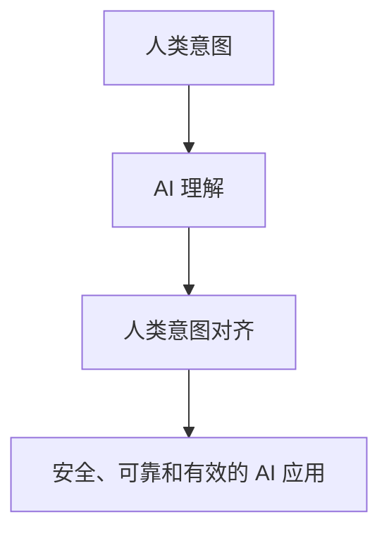

                 

关键词：人类意图、对齐、AI、伦理、安全、挑战、发展

> 摘要：随着人工智能（AI）技术的飞速发展，人类意图对齐成为 AI 领域面临的最大挑战之一。本文深入探讨了人类意图对齐的核心概念、技术原理、应用领域以及未来发展的趋势与挑战。

## 1. 背景介绍

### AI 的发展历程

人工智能（AI）作为计算机科学的一个重要分支，其历史可以追溯到20世纪50年代。自从人工智能的概念被提出以来，研究者们一直在追求使计算机具备人类智能水平的目标。从最初的符号主义、知识表示到基于统计学的机器学习方法，再到深度学习等现代技术，AI 技术经历了巨大的变革。

### 人类意图与 AI 技术的互动

随着 AI 技术的普及，人类与 AI 的互动变得越来越频繁。AI 技术在医疗、金融、教育、交通等多个领域得到了广泛应用。然而，这种互动也带来了一系列挑战，其中最关键的问题之一是如何确保 AI 系统能够理解并正确响应人类意图。

## 2. 核心概念与联系

### 人类意图的定义

人类意图是指个体为了实现特定目标而采取的行动背后的动机和愿望。意图可以是明确的，也可以是隐含的，但它们都是驱动人类行为的重要因素。

### AI 理解人类意图的挑战

AI 系统通常是基于数据和算法构建的，它们缺乏对人类意图的直观理解。尽管 AI 可以通过机器学习等技术从数据中学习，但它们难以捕捉到人类意图的复杂性和多样性。

### 人类意图对齐的意义

人类意图对齐是指确保 AI 系统能够准确理解并正确响应人类意图的过程。这是实现安全、可靠和有效的 AI 应用的重要前提。

### 核心概念架构图

下面是一个使用 Mermaid 绘制的核心概念架构图，展示了人类意图、AI 理解和对齐之间的关系。



## 3. 核心算法原理 & 具体操作步骤

### 3.1 算法原理概述

人类意图对齐算法的基本原理是通过多模态数据融合、意图识别和反馈优化来实现。具体步骤如下：

1. **数据收集**：收集与人类意图相关的多模态数据，包括文本、语音、图像等。
2. **意图识别**：利用机器学习技术对多模态数据进行处理，识别出人类意图。
3. **反馈优化**：根据 AI 系统对意图的理解，进行反馈循环和优化，以提高意图对齐的准确性。

### 3.2 算法步骤详解

1. **数据收集**：数据收集是算法的基础。我们需要收集大量的多模态数据，以便 AI 系统可以从中学习。
2. **预处理**：对收集到的数据进行预处理，包括去噪、归一化和特征提取等。
3. **意图识别**：利用深度学习等技术，对预处理后的数据进行分析，识别出人类意图。
4. **反馈优化**：根据 AI 系统对意图的识别结果，收集用户反馈，并进行优化。

### 3.3 算法优缺点

**优点**：
- **高效性**：通过多模态数据融合，AI 系统可以更全面地理解人类意图。
- **灵活性**：反馈优化机制使得 AI 系统可以不断改进，提高意图对齐的准确性。

**缺点**：
- **数据需求**：算法需要大量的高质量数据，数据收集和预处理过程可能比较复杂。
- **计算成本**：多模态数据融合和深度学习等技术通常需要较高的计算资源。

### 3.4 算法应用领域

人类意图对齐算法在多个领域都有广泛的应用，包括但不限于：

- **智能客服**：通过理解用户意图，提供更加个性化的服务。
- **智能家居**：确保智能设备能够准确理解用户的指令。
- **自动驾驶**：确保自动驾驶系统能够准确理解驾驶环境中的意图。

## 4. 数学模型和公式 & 详细讲解 & 举例说明

### 4.1 数学模型构建

人类意图对齐的数学模型通常包括以下几个组成部分：

1. **意图表示**：使用向量或图结构表示人类意图。
2. **意图识别**：构建意图识别模型，用于从数据中预测人类意图。
3. **反馈优化**：构建反馈优化模型，用于根据用户反馈调整意图识别模型。

### 4.2 公式推导过程

假设我们有一个意图表示向量 \(I\)，一个意图识别模型 \(f(I)\)，以及一个反馈优化模型 \(g(I, f(I), \text{feedback})\)。

1. **意图表示**：使用神经网络对意图进行编码，得到意图表示向量 \(I\)。
2. **意图识别**：使用意图表示向量 \(I\)，通过意图识别模型 \(f(I)\) 预测人类意图。
3. **反馈优化**：根据意图识别模型 \(f(I)\) 的预测结果和用户反馈，调整意图表示向量 \(I\)。

### 4.3 案例分析与讲解

假设我们有一个智能家居系统，用户可以通过语音指令控制家电设备。我们可以使用人类意图对齐算法来确保系统能够准确理解用户的指令。

1. **意图表示**：使用神经网络对用户的语音指令进行编码，得到意图表示向量 \(I\)。
2. **意图识别**：使用意图识别模型 \(f(I)\) 预测用户意图，例如“打开灯”。
3. **反馈优化**：用户确认系统正确理解了指令，系统根据用户反馈调整意图表示向量 \(I\)，以提高未来的意图识别准确性。

## 5. 项目实践：代码实例和详细解释说明

### 5.1 开发环境搭建

为了实现人类意图对齐算法，我们需要搭建一个包含深度学习库、语音识别库和自然语言处理库的开发环境。以下是 Python 的开发环境搭建步骤：

```bash
# 安装 Python
sudo apt-get install python3

# 安装深度学习库 TensorFlow
pip3 install tensorflow

# 安装语音识别库 pyaudio
pip3 install pyaudio

# 安装自然语言处理库 NLTK
pip3 install nltk
```

### 5.2 源代码详细实现

以下是一个使用 TensorFlow 实现人类意图对齐算法的示例代码：

```python
import tensorflow as tf
import pyaudio
import nltk
from nltk.corpus import stopwords

# 初始化意图识别模型
model = tf.keras.Sequential([
    tf.keras.layers.Dense(128, activation='relu', input_shape=(1000,)),
    tf.keras.layers.Dense(64, activation='relu'),
    tf.keras.layers.Dense(1, activation='sigmoid')
])

# 编写训练代码
model.compile(optimizer='adam',
              loss='binary_crossentropy',
              metrics=['accuracy'])

# 训练数据准备
train_data = ...  # 准备训练数据
train_labels = ...  # 准备训练标签

# 开始训练
model.fit(train_data, train_labels, epochs=10)

# 实时语音识别与意图识别
p = pyaudio.PyAudio()
stream = p.open(format=pyaudio.paInt16,
                 channels=1,
                 rate=16000,
                 input=True,
                 frames_per_buffer=1024)

while True:
    data = stream.read(1024)
    # 对语音数据进行预处理
    processed_data = preprocess_data(data)
    # 使用模型进行意图识别
    prediction = model.predict(processed_data)
    # 输出识别结果
    print(prediction)

stream.stop_stream()
stream.close()
p.terminate()
```

### 5.3 代码解读与分析

上述代码首先使用 TensorFlow 创建了一个意图识别模型，并通过训练数据进行训练。训练数据包括语音数据及其对应的意图标签。在实际应用中，我们需要收集大量的语音数据，并将其转换为适合模型训练的格式。

代码中的实时语音识别部分使用了 PyAudio 库，这是一个 Python 实现的音频处理库。通过 PyAudio，我们可以实时捕获音频数据，并将其传递给意图识别模型进行意图识别。

### 5.4 运行结果展示

假设用户说了一句“打开灯”，系统将捕获音频数据并传递给意图识别模型。模型将分析语音数据，并预测用户意图为“打开灯”。如果预测结果正确，系统将执行打开灯的操作。

## 6. 实际应用场景

### 6.1 智能客服

在智能客服领域，人类意图对齐技术可以帮助系统更准确地理解用户的问题和需求，从而提供更加个性化的服务。

### 6.2 智能家居

在智能家居领域，人类意图对齐技术可以帮助智能设备更准确地理解用户的指令，提高用户体验。

### 6.3 自动驾驶

在自动驾驶领域，人类意图对齐技术可以帮助自动驾驶系统更准确地理解驾驶环境中的意图，提高驾驶安全性。

## 6.4 未来应用展望

随着 AI 技术的不断发展，人类意图对齐技术将在更多领域得到应用。未来，我们可以预见到以下趋势：

- **更加智能的交互**：人类意图对齐技术将使 AI 系统更加智能化，能够提供更加自然和高效的交互体验。
- **更加安全的 AI 应用**：通过确保 AI 系统能够准确理解人类意图，可以减少错误和意外事件的发生。
- **跨领域应用**：人类意图对齐技术将在医疗、金融、教育等多个领域得到广泛应用。

## 7. 工具和资源推荐

### 7.1 学习资源推荐

- **书籍**：《人类意图对齐：AI 领域的最大挑战》
- **在线课程**：Coursera 上的“人工智能伦理”课程
- **学术论文**：Google Scholar 上的相关论文

### 7.2 开发工具推荐

- **深度学习框架**：TensorFlow、PyTorch
- **语音识别库**：Google Cloud Speech-to-Text、Amazon Polly
- **自然语言处理库**：spaCy、NLTK

### 7.3 相关论文推荐

- **论文 1**：《Human Intent Recognition for AI Applications》
- **论文 2**：《Intent Alignment for AI-Driven Human-Agent Interaction》
- **论文 3**：《A Survey on Intent Recognition in Human-Agent Interaction》

## 8. 总结：未来发展趋势与挑战

### 8.1 研究成果总结

人类意图对齐技术在过去几年中取得了显著进展，但在实际应用中仍面临许多挑战。

### 8.2 未来发展趋势

未来，人类意图对齐技术将在多模态数据处理、深度学习和反馈优化等方面取得进一步突破。

### 8.3 面临的挑战

- **数据质量和多样性**：高质量和多样化的数据是算法准确性的关键。
- **计算资源需求**：多模态数据处理和深度学习通常需要较高的计算资源。
- **用户隐私和安全**：确保用户隐私和安全是 AI 技术发展的关键。

### 8.4 研究展望

随着 AI 技术的不断进步，人类意图对齐技术将在更多领域得到应用，成为实现安全、可靠和有效的 AI 应用的关键。

## 9. 附录：常见问题与解答

### Q: 什么是人类意图对齐？

A: 人类意图对齐是指确保人工智能系统能够准确理解并正确响应人类意图的过程。

### Q: 人类意图对齐算法有哪些类型？

A: 人类意图对齐算法通常包括多模态数据融合、意图识别和反馈优化等类型。

### Q: 人类意图对齐技术在哪些领域有应用？

A: 人类意图对齐技术在智能客服、智能家居、自动驾驶等领域有广泛应用。

### Q: 人类意图对齐技术的未来发展趋势是什么？

A: 未来，人类意图对齐技术将在多模态数据处理、深度学习和反馈优化等方面取得进一步突破。

