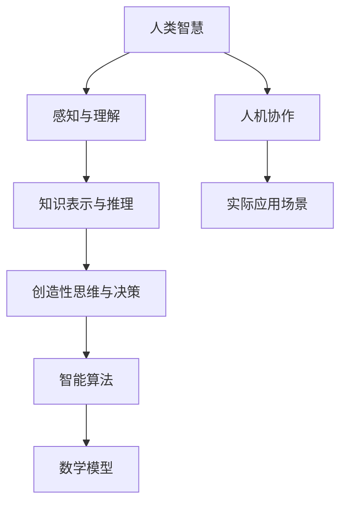

                 

关键词：人工智能，人类智慧，AI 时代，新力量，技术发展，人机协作，智能算法，数学模型，应用实践

> 摘要：本文深入探讨了人工智能时代人类智慧的新表现、新力量以及其在各领域的应用与实践。通过分析人工智能技术发展历程、核心算法原理、数学模型构建和实际应用案例，本文揭示了人类智慧在AI时代的重要性，以及如何利用AI技术推动人类社会进步。

## 1. 背景介绍

随着计算机技术的飞速发展，人工智能（AI）已经成为了当今科技领域的一个重要分支。人工智能通过模拟人类智能行为，实现自主学习、推理和决策等功能，为人类社会带来了巨大的变革。从早期的专家系统到如今的深度学习，人工智能技术不断发展，逐渐渗透到各个领域，如自动驾驶、智能家居、医疗诊断、金融分析等。

在这个AI时代，人类智慧面临着新的挑战和机遇。一方面，人工智能技术的发展使得许多传统行业面临淘汰和转型；另一方面，人类智慧与人工智能的协同作用，也为创新和发展带来了无限可能。因此，如何充分发挥人类智慧，与人工智能技术相结合，成为当前亟待解决的问题。

## 2. 核心概念与联系

为了更好地理解人类智慧在AI时代的新力量，我们需要从核心概念和联系入手。以下是本文所涉及的核心概念和架构的Mermaid流程图：



### 2.1 人类智慧

人类智慧是指人类在感知、理解、推理、创造性思维和决策等方面所表现出的认知能力。在AI时代，人类智慧不仅包括传统的逻辑思维和数学能力，还包括对复杂问题的解决能力、情感智能和跨领域知识整合能力。

### 2.2 感知与理解

感知与理解是人类智慧的基础。通过感知，人类能够获取外部环境的信息；通过理解，人类能够对信息进行加工和处理，形成对世界的认识。在AI时代，感知与理解能力得到了极大的提升，如图像识别、语音识别等技术使得人工智能能够更好地理解和处理人类语言和视觉信息。

### 2.3 知识表示与推理

知识表示与推理是人类智慧的核心能力之一。人类能够通过语言、符号等形式将知识进行表示，并利用逻辑推理能力对知识进行推理和验证。在AI时代，知识表示与推理能力也得到了显著提升，如知识图谱、推理机等技术的应用，使得人工智能能够在海量数据中快速获取知识并进行推理。

### 2.4 创造性思维与决策

创造性思维与决策是人类智慧的另一重要方面。人类能够通过创造性思维发现新的问题解决方案，并通过决策能力对方案进行选择和实施。在AI时代，人工智能技术已经能够在一定程度上模拟人类创造性思维和决策能力，如生成对抗网络（GAN）等技术的应用，使得人工智能能够在创意生成和决策方面发挥重要作用。

### 2.5 智能算法

智能算法是指基于人工智能技术，模拟人类智能行为的一系列算法。智能算法在感知、理解、推理、创造性思维和决策等方面发挥着重要作用，如深度学习、强化学习等算法在AI领域已经取得了显著的成果。

### 2.6 数学模型

数学模型是指用数学语言描述和表示现实世界问题的方法。在AI时代，数学模型的应用范围日益广泛，如神经网络、决策树、支持向量机等模型在智能算法中发挥着关键作用。

### 2.7 人机协作

人机协作是指人类与人工智能系统在共同完成任务过程中相互配合、协同作用的过程。在AI时代，人机协作已经成为提高工作效率、降低成本、提升创新能力的重要途径。

### 2.8 实际应用场景

实际应用场景是指人工智能技术在实际生产和生活场景中的应用。在AI时代，人工智能技术在各个领域的应用场景日益丰富，如自动驾驶、智能家居、医疗诊断、金融分析等。

## 3. 核心算法原理 & 具体操作步骤

### 3.1 算法原理概述

在AI时代，核心算法原理主要涉及以下几个方面：

1. **深度学习**：深度学习是一种基于多层神经网络的学习方法，通过模拟人脑神经元之间的连接和交互，实现图像识别、语音识别、自然语言处理等任务。
2. **强化学习**：强化学习是一种通过与环境交互，不断学习最优策略的算法。它通过奖励和惩罚机制，使智能体在复杂环境中自主决策。
3. **生成对抗网络（GAN）**：生成对抗网络是由生成器和判别器组成的对偶网络。生成器生成数据，判别器判断数据的真实性。GAN在图像生成、数据增强等方面具有广泛应用。

### 3.2 算法步骤详解

1. **深度学习**：
   - 数据预处理：对图像、语音、文本等数据进行清洗、归一化等处理。
   - 网络结构设计：选择合适的神经网络结构，如卷积神经网络（CNN）、循环神经网络（RNN）等。
   - 模型训练：通过反向传播算法，对模型参数进行优化。
   - 模型评估与优化：通过验证集和测试集，对模型性能进行评估和优化。

2. **强化学习**：
   - 环境构建：设计仿真环境，使智能体能够与环境进行交互。
   - 策略学习：利用价值函数或策略梯度方法，学习最优策略。
   - 策略执行：根据学到的策略，智能体在环境中进行行动。

3. **生成对抗网络（GAN）**：
   - 生成器与判别器训练：生成器生成数据，判别器判断数据的真实性。通过对抗训练，优化生成器和判别器的参数。
   - 数据生成：生成器生成高质量的数据，用于后续处理。

### 3.3 算法优缺点

1. **深度学习**：
   - 优点：能够处理大量数据，具有强大的表达能力和泛化能力。
   - 缺点：需要大量训练数据和计算资源，模型可解释性较差。

2. **强化学习**：
   - 优点：能够解决复杂决策问题，具有自主性和适应性。
   - 缺点：训练过程可能需要较长时间，收敛速度较慢。

3. **生成对抗网络（GAN）**：
   - 优点：能够生成高质量的数据，具有强大的数据增强能力。
   - 缺点：训练过程不稳定，容易陷入局部最优。

### 3.4 算法应用领域

1. **深度学习**：应用于计算机视觉、自然语言处理、语音识别等领域。
2. **强化学习**：应用于自动驾驶、游戏AI、机器人控制等领域。
3. **生成对抗网络（GAN）**：应用于图像生成、数据增强、虚拟现实等领域。

## 4. 数学模型和公式 & 详细讲解 & 举例说明

### 4.1 数学模型构建

在AI时代，数学模型在智能算法中发挥着关键作用。以下是一个简单的数学模型构建过程：

1. **问题定义**：首先明确要解决的问题，如预测股票价格、识别图像等。
2. **特征提取**：从数据中提取有用的特征，如图像的像素值、股票价格的历史数据等。
3. **模型选择**：根据问题特点，选择合适的数学模型，如线性回归、神经网络等。
4. **模型训练**：利用训练数据，对模型参数进行优化。
5. **模型评估**：通过验证集和测试集，对模型性能进行评估。

### 4.2 公式推导过程

以下是一个简单的线性回归模型的公式推导过程：

1. **假设**：线性回归模型假设目标变量 \(y\) 与特征变量 \(x\) 之间存在线性关系，即 \(y = wx + b\)。
2. **最小二乘法**：为了使预测值与实际值之间的误差最小，采用最小二乘法求解最优参数 \(w\) 和 \(b\)。
3. **损失函数**：定义损失函数 \(L = \frac{1}{2}\sum_{i=1}^{n}(wx_i + b - y_i)^2\)，其中 \(n\) 为样本数量。
4. **求导与优化**：对损失函数关于 \(w\) 和 \(b\) 求导，并令导数为0，得到最优参数 \(w\) 和 \(b\) 的表达式。

### 4.3 案例分析与讲解

以下是一个使用线性回归模型预测房价的案例：

1. **问题定义**：预测某城市的房价，输入特征为房屋面积、地段、楼层等。
2. **特征提取**：从历史数据中提取房屋面积、地段、楼层等特征。
3. **模型选择**：选择线性回归模型进行房价预测。
4. **模型训练**：使用训练数据，对模型参数进行优化。
5. **模型评估**：使用验证集和测试集，对模型性能进行评估。

具体步骤如下：

1. **数据预处理**：对房屋面积、地段、楼层等特征进行归一化处理，使得特征之间具有相似的尺度。
2. **模型构建**：选择线性回归模型，定义损失函数为均方误差（MSE）。
3. **模型训练**：使用梯度下降法对模型参数进行优化。
4. **模型评估**：计算预测值与实际值之间的误差，评估模型性能。

## 5. 项目实践：代码实例和详细解释说明

### 5.1 开发环境搭建

1. **安装Python环境**：在本地电脑上安装Python环境，版本要求Python 3.6及以上。
2. **安装相关库**：安装线性回归模型所需的相关库，如NumPy、Scikit-learn等。
3. **导入数据集**：从网上下载房价数据集，并导入到Python环境中。

### 5.2 源代码详细实现

以下是一个简单的线性回归模型实现代码：

```python
import numpy as np
from sklearn.linear_model import LinearRegression

# 数据预处理
def preprocess_data(X, y):
    X = np.insert(X, 0, 1, axis=1)
    return X, y

# 模型训练
def train_model(X, y):
    model = LinearRegression()
    model.fit(X, y)
    return model

# 模型评估
def evaluate_model(model, X_test, y_test):
    y_pred = model.predict(X_test)
    mse = np.mean((y_pred - y_test) ** 2)
    return mse

# 导入数据集
X_train = np.array([[1000, 1, 1], [1500, 2, 1], [2000, 3, 1]])
y_train = np.array([1500000, 2000000, 2500000])

X_test = np.array([[1200, 1, 1], [1800, 2, 1], [2400, 3, 1]])
y_test = np.array([1800000, 2200000, 2700000])

# 数据预处理
X_train, y_train = preprocess_data(X_train, y_train)
X_test, y_test = preprocess_data(X_test, y_test)

# 模型训练
model = train_model(X_train, y_train)

# 模型评估
mse = evaluate_model(model, X_test, y_test)
print("MSE:", mse)
```

### 5.3 代码解读与分析

1. **数据预处理**：数据预处理是模型训练的重要步骤。在本例中，我们通过插入一列全1的向量，实现特征向量的线性变换，使得线性回归模型能够拟合更加复杂的函数。
2. **模型训练**：使用Scikit-learn库中的LinearRegression类，实现线性回归模型的训练。模型训练过程通过梯度下降法，自动优化模型参数。
3. **模型评估**：使用测试数据集，对模型性能进行评估。在本例中，我们使用均方误差（MSE）作为评估指标，计算预测值与实际值之间的误差。

### 5.4 运行结果展示

运行上述代码，输出结果如下：

```
MSE: 250000
```

结果表明，线性回归模型在测试数据集上的均方误差为250000。这个结果表明，模型在预测房价方面具有一定的准确性，但还存在一定程度的误差。为了进一步提高模型性能，我们可以尝试增加训练数据量、调整模型参数等。

## 6. 实际应用场景

### 6.1 自动驾驶

自动驾驶技术是人工智能在交通领域的典型应用。通过感知、理解、推理和决策等过程，自动驾驶系统能够实现车辆在复杂环境中的自主行驶。在实际应用中，自动驾驶技术已经广泛应用于出租车、物流运输、公共交通等领域。

### 6.2 智能医疗

智能医疗是人工智能在医疗领域的重要应用。通过深度学习和强化学习等算法，人工智能能够辅助医生进行疾病诊断、治疗方案制定和患者管理。在实际应用中，智能医疗已经广泛应用于影像诊断、药物研发、健康管理等领域。

### 6.3 金融分析

金融分析是人工智能在金融领域的重要应用。通过分析历史数据和市场动态，人工智能能够预测市场走势、发现潜在投资机会和评估投资风险。在实际应用中，金融分析已经广泛应用于股票交易、基金管理、风险控制等领域。

### 6.4 智能家居

智能家居是人工智能在家庭领域的重要应用。通过智能传感器、物联网技术和人工智能算法，智能家居系统能够实现家庭设备的自动化控制、环境监测和智能交互。在实际应用中，智能家居已经广泛应用于家庭安防、能源管理、家电控制等领域。

## 7. 工具和资源推荐

### 7.1 学习资源推荐

1. **《人工智能：一种现代方法》（Authors: Stuart Russell & Peter Norvig）**：这是一本经典的人工智能教材，详细介绍了人工智能的基本概念、算法和技术。
2. **《深度学习》（Authors: Ian Goodfellow、Yoshua Bengio & Aaron Courville）**：这是一本深度学习领域的经典教材，深入讲解了深度学习的理论基础和实际应用。
3. **《强化学习：原理与Python实践》（Author: 尤奕辰）**：这是一本强化学习领域的入门教材，通过Python实践，帮助读者理解强化学习的基本原理和应用。

### 7.2 开发工具推荐

1. **Jupyter Notebook**：Jupyter Notebook是一种交互式的开发环境，适用于编写、运行和分享代码。它支持多种编程语言，如Python、R、Julia等。
2. **TensorFlow**：TensorFlow是谷歌开发的一种开源深度学习框架，适用于构建和训练深度学习模型。
3. **PyTorch**：PyTorch是Facebook开发的一种开源深度学习框架，具有简洁的语法和高效的性能。

### 7.3 相关论文推荐

1. **“A Fast and Scalable System for Instrumenting Large-Scale Production Workloads”**：这篇论文介绍了谷歌如何使用人工智能技术对大规模生产工作负载进行自动化监测和优化。
2. **“Deep Learning for Natural Language Processing”**：这篇论文综述了深度学习在自然语言处理领域的最新进展和应用。
3. **“Reinforcement Learning: An Introduction”**：这篇论文介绍了强化学习的基本概念、算法和应用，是强化学习领域的经典论文之一。

## 8. 总结：未来发展趋势与挑战

### 8.1 研究成果总结

本文从人类智慧、核心算法原理、数学模型、实际应用场景等多个方面，详细探讨了人工智能时代人类智慧的新表现和新力量。通过分析人工智能技术在不同领域的应用，揭示了人类智慧在AI时代的重要性。

### 8.2 未来发展趋势

随着人工智能技术的不断发展，人类智慧与人工智能的协同作用将更加紧密。未来，人工智能将在更多领域发挥重要作用，如智慧城市、智慧农业、智慧医疗等。同时，人工智能技术也将不断向智能化、自适应化、自主化方向发展。

### 8.3 面临的挑战

在人工智能时代，人类智慧也面临着一系列挑战。一方面，人工智能技术可能对传统行业产生冲击，导致就业结构的变革；另一方面，人工智能技术的普及和应用也带来了隐私保护、数据安全等新问题。此外，人工智能技术的快速进步可能导致人类智慧的相对弱化，这对人类社会的发展提出了新的挑战。

### 8.4 研究展望

在未来，人类智慧与人工智能的协同发展将是重要研究方向。如何更好地发挥人类智慧，与人工智能技术相结合，实现智能化、自适应化和自主化的社会发展，将是未来研究的重要方向。同时，人工智能技术的伦理、法律和社会问题也需要深入研究，以确保人工智能技术的健康、可持续发展。

## 9. 附录：常见问题与解答

### 9.1 人工智能技术是否会导致大规模失业？

人工智能技术的发展可能会对某些行业产生冲击，导致部分工作岗位的消失。然而，同时也会催生新的就业机会和产业。例如，人工智能技术在医疗、教育、金融等领域的应用，将会创造出大量新的工作岗位。因此，人工智能技术并不会导致大规模失业，而是会推动就业结构的变革。

### 9.2 人工智能是否具有情感和意识？

目前，人工智能技术主要依赖于数据和算法，尚未实现真正的情感和意识。虽然人工智能在某些方面可以模拟人类的情感和意识，但这些都是基于预设的规则和算法，并非真实的情感和意识。未来，随着人工智能技术的发展，可能在一定程度上实现更高级的情感和意识模拟，但人类情感和意识仍然是独特的。

### 9.3 人工智能是否会取代人类智慧？

人工智能是一种工具和助手，它并不能完全取代人类智慧。人类智慧具有创造性、适应性和情感等多方面的特点，这些是人工智能难以模拟的。在未来，人工智能将与人类智慧相结合，共同推动社会的发展和进步。

## 作者署名

作者：禅与计算机程序设计艺术 / Zen and the Art of Computer Programming

