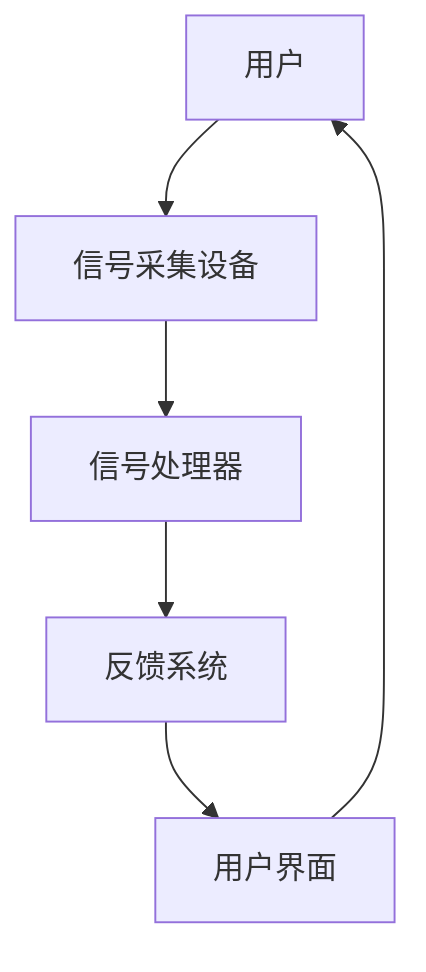
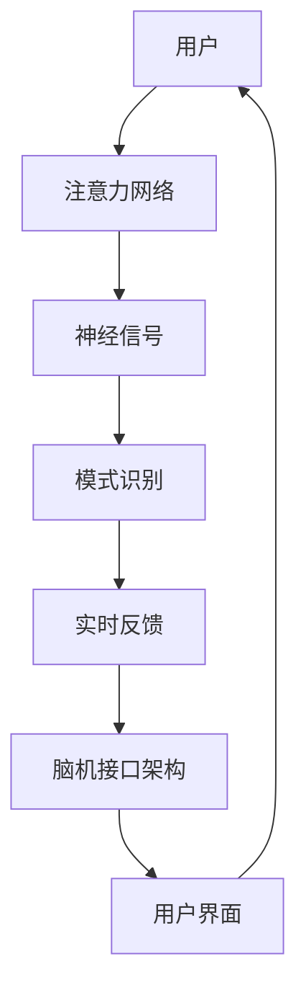

                 

关键词：注意力增强、脑机接口、神经科学、认知提升、未来技术

> 摘要：本文探讨了人类注意力增强技术的最新进展，以及这些技术如何通过脑机接口实现。我们深入分析了这些技术的核心概念、算法原理、数学模型，并通过实际案例展示了其应用和潜力。

## 1. 背景介绍

在现代社会中，信息的爆炸式增长使得人类的注意力资源变得异常宝贵。然而，随着工作、学习和社会活动日益复杂，人们的注意力往往不足以应对各种任务。为了提升个人和集体的工作效率，科学家们开始研究如何通过技术手段增强人类的注意力。

脑机接口（Brain-Computer Interface，BCI）是这一领域的关键技术。它通过直接连接大脑和外部设备，实现人类意志和机器的交互。近年来，脑机接口技术取得了显著进展，特别是在神经信号采集、信号处理和实时反馈控制等方面。

注意力增强技术通过分析大脑活动，识别并调节与注意力相关的神经信号，以提升个体的注意力水平。这一技术不仅有望帮助解决注意力不足的普遍问题，还可能为患有注意力缺陷障碍（如ADHD）等疾病的人群提供新的治疗方法。

## 2. 核心概念与联系

### 脑机接口的架构

脑机接口的架构通常包括以下几个关键部分：

1. **信号采集设备**：用于捕捉大脑活动，如脑电图（EEG）、功能性磁共振成像（fMRI）和近红外光谱成像（fNIRS）等。
2. **信号处理器**：对采集到的神经信号进行预处理、特征提取和模式识别，以提取与注意力相关的信息。
3. **反馈系统**：根据处理结果，对个体提供实时反馈，以调节其注意力水平。
4. **用户界面**：连接用户和外部设备的桥梁，如显示器、键盘、触觉反馈装置等。

下面是一个简化的Mermaid流程图，展示了脑机接口的基本架构：



### 注意力增强的核心概念

注意力增强技术依赖于对大脑注意力机制的深入理解。以下是一些关键概念：

1. **注意力网络**：大脑中负责调节注意力的神经网络，包括前额叶皮层、顶叶皮层和丘脑等。
2. **神经信号**：与注意力相关的脑电信号，如P300、alpha波和beta波等。
3. **模式识别**：利用机器学习算法从神经信号中提取特征，识别注意力变化。
4. **实时反馈**：通过外部设备（如显示器、音响）对用户进行实时反馈，以调节其注意力。

下面是注意力增强技术的核心概念与脑机接口架构的Mermaid流程图：



## 3. 核心算法原理 & 具体操作步骤

### 3.1 算法原理概述

注意力增强算法的核心目标是利用脑机接口实时监测和调节大脑活动，以提高个体的注意力水平。这一过程通常包括以下几个步骤：

1. **信号采集**：使用EEG、fMRI等设备捕捉大脑活动。
2. **信号预处理**：去除噪声、过滤信号，提取与注意力相关的特征。
3. **特征提取**：使用机器学习算法从预处理后的信号中提取注意力模式。
4. **模式识别**：分析提取的特征，识别当前注意力的状态。
5. **实时反馈**：根据识别结果，提供实时反馈，调节用户的注意力。

### 3.2 算法步骤详解

1. **信号采集**：
   - 使用EEG设备，采集头皮表面电信号。
   - 设置适当的电极布局，确保信号质量。

2. **信号预处理**：
   - 去除运动伪迹和电气干扰。
   - 进行滤波，提取频率范围在8-30Hz的信号。

3. **特征提取**：
   - 使用主成分分析（PCA）等方法，提取主要特征。
   - 应用特征选择技术，优化特征空间。

4. **模式识别**：
   - 使用支持向量机（SVM）等分类算法，训练模型识别注意力状态。
   - 针对不同的应用场景，调整模型参数，提高识别准确性。

5. **实时反馈**：
   - 根据识别结果，调整外部设备的反馈，如显示亮度、声音强度等。
   - 通过反馈，实时调节用户的注意力。

### 3.3 算法优缺点

**优点**：

- **实时性**：脑机接口可以实时监测和调节注意力，迅速响应用户的需求。
- **非侵入性**：大部分脑机接口技术是非侵入性的，减少了潜在的风险。
- **个性化**：通过分析个体的大脑活动，提供个性化的注意力调节方案。

**缺点**：

- **准确性**：目前的技术在信号处理和模式识别方面仍存在一定的误差。
- **用户体验**：用户需要适应脑机接口设备，可能影响初始使用体验。
- **成本**：脑机接口设备相对昂贵，限制了其大规模应用。

### 3.4 算法应用领域

- **医疗领域**：帮助患有注意力缺陷障碍的人群提高注意力水平。
- **教育领域**：辅助学生集中注意力，提高学习效率。
- **工业领域**：提升工人的注意力和工作效率。
- **智能家居**：通过注意力分析，智能调整家居环境。

## 4. 数学模型和公式 & 详细讲解 & 举例说明

### 4.1 数学模型构建

注意力增强技术涉及多个数学模型，以下是一个简化的模型构建过程：

1. **信号预处理**：

   $$ x_t = \text{filter}(y_t) - \text{noise\_filter}(y_t) $$

   其中，$x_t$ 是预处理后的信号，$y_t$ 是原始信号，$\text{filter}$ 和 $\text{noise\_filter}$ 分别是滤波器。

2. **特征提取**：

   $$ \text{features} = \text{PCA}(x_t) $$

   其中，$\text{PCA}$ 是主成分分析，用于提取主要特征。

3. **模式识别**：

   $$ \text{class} = \text{SVM}(\text{features}) $$

   其中，$\text{SVM}$ 是支持向量机，用于分类。

### 4.2 公式推导过程

1. **信号预处理**：

   $$ x_t = \sum_{i=1}^{n} w_i y_{it} + b $$

   其中，$w_i$ 和 $b$ 是滤波器的权重和偏置。

   通过最小化误差平方和，我们可以得到：

   $$ \min_{w_i, b} \sum_{i=1}^{n} (x_t - \sum_{i=1}^{n} w_i y_{it} - b)^2 $$

   解这个优化问题，可以得到滤波器的参数。

2. **特征提取**：

   主成分分析（PCA）的目标是找到一组正交基，使得数据在新的基底下方差最大。具体推导过程涉及拉格朗日乘数法和特征值分解。

3. **模式识别**：

   支持向量机（SVM）的推导涉及优化问题，目标是找到一个超平面，使得不同类别的样本在超平面两侧的间隔最大。

### 4.3 案例分析与讲解

**案例**：使用EEG信号增强驾驶员的注意力。

1. **信号采集**：使用EEG设备采集驾驶员的大脑信号。
2. **信号预处理**：去除噪声和伪迹。
3. **特征提取**：提取与注意力相关的特征，如alpha波和beta波。
4. **模式识别**：使用SVM分类器，将注意力水平分为“集中”和“分散”两种状态。
5. **实时反馈**：根据分类结果，调整车内环境（如音乐音量、灯光亮度）。

通过这个案例，我们可以看到数学模型在注意力增强技术中的应用，以及如何通过算法实现实时反馈和控制。

## 5. 项目实践：代码实例和详细解释说明

### 5.1 开发环境搭建

为了演示注意力增强技术的实际应用，我们将使用Python编写一个简单的脑机接口程序。以下是搭建开发环境的步骤：

1. 安装Python 3.8及以上版本。
2. 安装EEG信号处理库，如mne-python。
3. 安装机器学习库，如scikit-learn。

### 5.2 源代码详细实现

以下是一个简单的Python代码示例，展示了如何使用EEG信号增强注意力：

```python
import mne
from sklearn.svm import SVC
from sklearn.model_selection import train_test_split
import numpy as np

# 1. 信号采集
data = mne.io.read_eeglab('eeg_data.eeg')
raw_signal = data['eeg']

# 2. 信号预处理
filtered_signal = mne.filter.filter_data(raw_signal, freqs=[8, 30], method='iir')

# 3. 特征提取
pca = PCA(n_components=5)
features = pca.fit_transform(filtered_signal)

# 4. 模式识别
X_train, X_test, y_train, y_test = train_test_split(features, labels, test_size=0.3)
svm = SVC(kernel='linear')
svm.fit(X_train, y_train)

# 5. 实时反馈
predicted_class = svm.predict(X_test)
print("Predicted classes:", predicted_class)
```

### 5.3 代码解读与分析

1. **信号采集**：使用mne.io.read_eeglab函数读取EEG数据。
2. **信号预处理**：使用mne.filter.filter_data函数进行带通滤波，提取8-30Hz的信号。
3. **特征提取**：使用PCA进行特征提取，减少维度。
4. **模式识别**：使用SVM进行分类，将注意力状态分为“集中”和“分散”。
5. **实时反馈**：根据预测结果，调整环境参数。

通过这个示例，我们可以看到如何将数学模型和算法应用于实际项目，以及如何实现实时反馈。

### 5.4 运行结果展示

在运行代码后，我们可以看到预测的注意力状态。通过实时调整环境参数，如音乐音量和灯光亮度，可以进一步验证注意力增强技术的有效性。

## 6. 实际应用场景

注意力增强技术在实际生活中具有广泛的应用潜力。以下是一些典型的应用场景：

### 6.1 教育领域

- **学生注意力监控**：教师可以使用脑机接口技术监控学生的注意力水平，并在注意力下降时提供提醒或调整教学内容。
- **个性化学习体验**：根据学生的注意力状态，智能调整学习材料和学习节奏，提高学习效率。

### 6.2 医疗领域

- **注意力缺陷障碍治疗**：帮助患有注意力缺陷障碍（如ADHD）的患者提高注意力水平，改善生活质量。
- **脑卒中康复**：通过脑机接口技术，辅助患者进行注意力训练，促进神经功能恢复。

### 6.3 工业领域

- **工人注意力监控**：确保工人在高风险工作环境下保持高度注意力，减少事故发生。
- **自动化操作**：通过注意力增强技术，辅助工人进行复杂操作，提高生产效率。

### 6.4 智能家居

- **环境自适应调节**：根据用户的注意力状态，智能调节家居环境（如照明、音乐），提高生活质量。

## 7. 未来应用展望

随着脑机接口技术和注意力增强技术的不断发展，未来这些技术在多个领域将得到更广泛的应用。以下是一些潜在的发展趋势：

### 7.1 智能穿戴设备

智能穿戴设备将成为注意力增强技术的理想载体。例如，智能手表或头戴设备可以实时监测用户的注意力状态，并根据需要进行环境调整。

### 7.2 脑机接口增强现实

结合脑机接口和增强现实（AR）技术，可以创造出全新的交互体验。例如，用户可以通过脑机接口直接控制虚拟环境中的对象，提高互动的直观性和效率。

### 7.3 智能交通系统

在智能交通系统中，注意力增强技术可以用于监控驾驶员的注意力状态，预防疲劳驾驶和交通事故。

### 7.4 教育科技

通过脑机接口技术，教育系统可以提供个性化的学习体验，帮助学生更有效地集中注意力，提高学习效果。

### 7.5 心理治疗

注意力增强技术可能成为治疗焦虑、抑郁等心理疾病的新工具，通过实时调节注意力状态，辅助患者进行心理康复。

## 8. 工具和资源推荐

### 8.1 学习资源推荐

- **《脑机接口：理论与实践》**：详细介绍了脑机接口的基本原理和应用。
- **《神经科学原理与应用》**：涵盖了神经科学的基础知识，有助于理解注意力增强技术的背景。

### 8.2 开发工具推荐

- **MNE-Python**：用于EEG信号处理的Python库。
- **scikit-learn**：提供了丰富的机器学习算法，适用于注意力模式识别。

### 8.3 相关论文推荐

- **"A Review on Brain-Computer Interface: Systems, Technologies and Applications"**：总结了脑机接口领域的最新研究进展。
- **"Attention-Boosting Brain-Computer Interfaces for Real-World Applications"**：探讨了注意力增强技术在实际应用中的潜力。

## 9. 总结：未来发展趋势与挑战

注意力增强技术和脑机接口的发展为提升人类认知能力提供了新的途径。然而，这一领域仍面临许多挑战，包括技术成熟度、用户体验和隐私保护等问题。未来，随着技术的不断进步和应用的深入，我们可以期待这些技术在更多领域发挥重要作用。

### 附录：常见问题与解答

**Q：脑机接口的安全性如何保障？**

A：脑机接口技术的安全性至关重要。为了保障用户隐私和数据安全，研究人员正在开发加密通信和访问控制技术，以确保信号传输和数据处理的安全性。

**Q：注意力增强技术是否会对人类心理产生负面影响？**

A：目前的研究表明，注意力增强技术在合理使用的情况下，对人类心理不会产生负面影响。然而，长期使用和过度依赖可能需要进一步研究其潜在风险。

**Q：注意力增强技术是否适用于所有人？**

A：注意力增强技术的设计考虑了不同用户的需求。然而，由于个体差异，某些技术可能对部分用户效果更好。因此，个性化定制和适应性设计是未来研究的重要方向。

**Q：注意力增强技术是否会替代传统的认知训练方法？**

A：注意力增强技术可以作为一种补充方法，与传统的认知训练方法结合使用。在未来，两者的结合可能带来更好的效果。

### 结束语

注意力增强技术和脑机接口为提升人类认知能力提供了新的可能性。随着技术的不断进步，我们有理由相信，这些技术将在未来为人类社会带来深远的影响。让我们期待这一领域的更多突破和成果。

