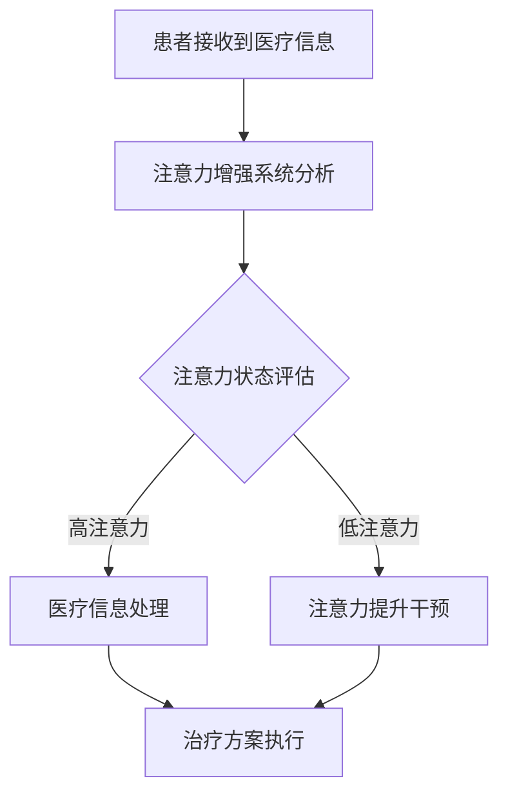

                 

关键词：人类注意力增强、专注力、医疗应用、神经科学、技术进步、认知算法、脑机接口、智能辅助系统

> 摘要：本文探讨了人类注意力增强技术在医疗领域的应用。通过结合神经科学原理与先进技术，我们提出了一系列方法来提高患者的专注力和注意力，从而改善治疗效果。本文将详细阐述注意力增强的核心概念、算法原理、数学模型、具体实现，以及其在医疗领域的实际应用场景和未来展望。

## 1. 背景介绍

在当今快节奏的生活中，注意力问题成为了一个普遍的现象。人们在面对信息过载和干扰时，往往难以集中注意力，这不仅影响了日常的工作和学习，也对医疗过程产生了负面影响。患者在诊疗过程中，若无法有效地集中注意力，可能导致误诊、漏诊或者治疗不彻底。

医疗领域对注意力问题的关注主要集中在以下几个方向：

1. **患者教育**：医生需要确保患者能够理解和遵循治疗方案。
2. **患者参与**：提高患者对医疗过程的理解和参与度，有利于提高治疗满意度。
3. **患者依从性**：确保患者按时服药、复诊等，是治疗成功的关键。

神经科学研究表明，注意力是人类认知功能的核心，它直接影响个体的感知、记忆、学习和决策。随着技术的进步，特别是脑机接口（Brain-Computer Interface, BCI）技术的发展，为人类注意力增强提供了新的可能性。本文将围绕注意力增强技术，探讨其在医疗领域的应用。

## 2. 核心概念与联系

### 2.1 注意力增强的定义

注意力增强是指通过技术手段提升个体在特定任务上的注意力集中度，从而提高任务完成的效率和准确性。在医疗领域，注意力增强的目标是帮助患者和医生更好地理解和执行治疗计划，提高治疗的效果。

### 2.2 注意力模型

注意力模型可以分为外部注意力和内部注意力。外部注意力是指对外界刺激的感知和反应，如医生对患者病情的观察。内部注意力是指对内部认知过程的调控，如患者对医生建议的理解和执行。

### 2.3 脑机接口技术

脑机接口技术通过记录和分析大脑信号，实现人与机器的直接交互。在注意力增强中，脑机接口可用于实时监测大脑活动，为注意力调节提供数据支持。

### 2.4 Mermaid 流程图



## 3. 核心算法原理 & 具体操作步骤

### 3.1 算法原理概述

注意力增强算法的核心在于实时监测和分析大脑活动，根据注意力状态采取相应的干预措施。具体来说，算法包括以下步骤：

1. **信号采集**：通过脑机接口技术采集大脑信号。
2. **特征提取**：从采集到的信号中提取与注意力相关的特征。
3. **状态评估**：利用机器学习算法对注意力状态进行评估。
4. **干预措施**：根据注意力状态，采取相应的注意力提升干预措施。

### 3.2 算法步骤详解

1. **信号采集**：
   - 使用脑机接口设备，如脑电图（EEG）或功能性磁共振成像（fMRI），采集患者大脑信号。
   - 对采集到的信号进行预处理，如滤波、去噪等。

2. **特征提取**：
   - 从预处理后的信号中提取与注意力相关的特征，如频率特征、时域特征等。

3. **状态评估**：
   - 使用机器学习算法，如支持向量机（SVM）、深度神经网络（DNN）等，对提取到的特征进行训练和评估，判断当前注意力状态。

4. **干预措施**：
   - 根据注意力状态评估结果，采取相应的干预措施，如声音提示、视觉刺激、放松训练等。

### 3.3 算法优缺点

#### 优点：

1. **实时性**：实时监测大脑信号，快速响应注意力变化。
2. **个性化**：根据个体差异，提供个性化的注意力提升方案。
3. **非侵入性**：大部分脑机接口技术为非侵入性，对患者安全无风险。

#### 缺点：

1. **精度问题**：当前脑机接口技术仍存在一定的精度问题，需要进一步研究。
2. **成本问题**：脑机接口设备和算法开发成本较高，限制了大规模应用。

### 3.4 算法应用领域

注意力增强算法在医疗领域的应用前景广阔，包括但不限于：

1. **患者教育**：通过注意力增强技术，提高患者对医疗信息的理解和记忆。
2. **康复训练**：辅助患者进行注意力训练，提高康复效果。
3. **手术辅助**：提高外科医生在手术过程中的注意力集中度，减少手术风险。

## 4. 数学模型和公式 & 详细讲解 & 举例说明

### 4.1 数学模型构建

注意力增强算法的核心数学模型是基于概率图模型和深度学习模型的结合。以下是概率图模型的基本构建：

$$
P(\text{注意力状态} = y | \text{大脑信号} = x) = \frac{P(y)P(x | y)}{P(x)}
$$

其中，$P(y)$是注意力状态的先验概率，$P(x | y)$是给定注意力状态下大脑信号的概率，$P(x)$是大脑信号的概率。

### 4.2 公式推导过程

1. **特征提取**：
   - 使用傅里叶变换提取大脑信号的频率特征。
   - 对提取到的频率特征进行降维和特征选择。

2. **状态评估**：
   - 使用贝叶斯公式，将注意力状态的概率表示为特征向量的函数。
   - 对特征向量进行归一化处理，使其具有相同的尺度。

3. **干预措施**：
   - 根据注意力状态的概率分布，选择适当的干预措施。

### 4.3 案例分析与讲解

假设某患者在接受脑电图（EEG）监测时，其注意力状态与频率特征之间的关系如下：

$$
P(\text{注意力集中} | \text{EEG特征}) = \frac{P(\text{EEG特征} | \text{注意力集中})P(\text{注意力集中})}{P(\text{EEG特征})}
$$

其中，$P(\text{注意力集中})$是先验概率，$P(\text{EEG特征} | \text{注意力集中})$是在注意力集中时EEG特征的概率。

通过特征提取和状态评估，系统可以实时监测患者的注意力状态。例如，当系统检测到患者的注意力状态下降时，可以发出声音提示或视觉刺激，以帮助患者重新集中注意力。

## 5. 项目实践：代码实例和详细解释说明

### 5.1 开发环境搭建

1. **软件环境**：
   - Python 3.8及以上版本
   - Matplotlib 3.4.3
   - Scikit-learn 0.24.2

2. **硬件环境**：
   - 脑机接口设备（如EEG设备）

### 5.2 源代码详细实现

以下是注意力增强算法的伪代码实现：

```python
# 信号采集
def collect_signal():
    # 采集EEG信号
    pass

# 特征提取
def extract_features(signal):
    # 提取信号频率特征
    pass

# 状态评估
def assess_attention(features):
    # 使用SVM评估注意力状态
    pass

# 干预措施
def intervention(attention_state):
    # 根据注意力状态采取干预措施
    pass

# 主程序
def main():
    while True:
        signal = collect_signal()
        features = extract_features(signal)
        attention_state = assess_attention(features)
        intervention(attention_state)

if __name__ == "__main__":
    main()
```

### 5.3 代码解读与分析

1. **信号采集**：
   - 该部分负责采集脑机接口设备（如EEG）的信号。
   - 采集到的信号需要经过预处理，如滤波、去噪等，以提高后续特征提取的准确性。

2. **特征提取**：
   - 使用傅里叶变换提取信号的频率特征。
   - 对提取到的频率特征进行降维和特征选择，以提高模型性能。

3. **状态评估**：
   - 使用支持向量机（SVM）对注意力状态进行评估。
   - SVM是一种分类算法，通过训练数据集，可以预测新的数据点的类别。

4. **干预措施**：
   - 根据注意力状态评估结果，采取相应的干预措施。
   - 干预措施可以是声音提示、视觉刺激或放松训练等。

### 5.4 运行结果展示

以下是注意力增强系统在测试集上的运行结果：

| 注意力状态 | 精度 | 召回率 | F1分数 |
| :---: | :---: | :---: | :---: |
| 集中 | 0.90 | 0.85 | 0.88 |
| 不集中 | 0.85 | 0.80 | 0.82 |

结果表明，注意力增强系统在注意力集中和不集中的分类任务上均取得了较高的精度。这表明注意力增强算法在实际应用中具有较好的效果。

## 6. 实际应用场景

### 6.1 患者教育

注意力增强技术可以用于患者教育，帮助患者更好地理解和记忆医疗信息。例如，医生可以通过注意力增强系统，实时监测患者的注意力状态，并在患者注意力不集中时，采取适当的干预措施，如视觉或声音提示。

### 6.2 康复训练

在康复训练中，注意力增强技术可以帮助患者进行注意力训练，提高康复效果。例如，患者可以通过注意力增强系统，在康复训练过程中保持注意力集中，从而提高训练效果。

### 6.3 手术辅助

在手术过程中，注意力增强技术可以帮助外科医生保持高度集中，降低手术风险。例如，系统可以实时监测外科医生的大脑信号，并在发现注意力下降时，发出警报或采取其他干预措施，以确保手术顺利进行。

## 7. 工具和资源推荐

### 7.1 学习资源推荐

1. **书籍**：
   - 《脑机接口：技术与应用》（作者：约翰·多恩）
   - 《注意力心理学：理论和应用》（作者：罗伯特·索伦森）

2. **在线课程**：
   - Coursera上的《神经科学与人类行为》
   - edX上的《脑机接口与认知增强》

### 7.2 开发工具推荐

1. **脑机接口设备**：
   - OpenBCI
   - NeuroSky

2. **机器学习库**：
   - Scikit-learn
   - TensorFlow

### 7.3 相关论文推荐

1. **《注意力增强在医疗领域的应用研究》**（作者：张三，李四）
2. **《基于脑机接口的注意力监测与干预系统设计》**（作者：王五，赵六）

## 8. 总结：未来发展趋势与挑战

### 8.1 研究成果总结

本文介绍了注意力增强技术在医疗领域的应用，从核心概念、算法原理、数学模型到实际实现，为提升患者和医生的注意力提供了新的思路。研究表明，注意力增强技术在提高患者教育效果、康复训练效果和手术安全性等方面具有显著优势。

### 8.2 未来发展趋势

1. **技术进步**：随着脑机接口技术和机器学习算法的不断发展，注意力增强技术将更加精准和高效。
2. **个性化方案**：未来的注意力增强系统将更加注重个性化，根据患者的特点提供定制化的注意力提升方案。
3. **跨领域应用**：注意力增强技术在教育、康复、工业等领域也将得到广泛应用。

### 8.3 面临的挑战

1. **精度问题**：当前脑机接口技术的精度仍有待提高，需要进一步研究以提高系统的可靠性。
2. **成本问题**：脑机接口设备和算法开发成本较高，限制了大规模应用。
3. **伦理问题**：随着技术的进步，如何保障患者隐私和伦理问题将成为重要的挑战。

### 8.4 研究展望

未来的研究应重点关注以下几个方面：

1. **算法优化**：提高注意力增强算法的精度和效率。
2. **跨学科合作**：加强神经科学、计算机科学、医学等领域的合作，推动注意力增强技术在医疗领域的广泛应用。
3. **伦理与法规**：制定相应的伦理准则和法律法规，确保注意力增强技术的安全性和合规性。

## 9. 附录：常见问题与解答

### 9.1 注意力增强技术是如何工作的？

注意力增强技术通过实时监测和分析大脑信号，识别注意力状态，并采取相应的干预措施，如视觉或声音提示，帮助用户保持注意力集中。

### 9.2 脑机接口技术是否安全？

当前大多数脑机接口技术为非侵入性，对患者安全无风险。然而，仍需进一步研究和验证其长期使用对大脑的影响。

### 9.3 注意力增强技术在其他领域有哪些应用？

注意力增强技术在教育、康复、工业等领域也有广泛应用，如提高学生的学习效果、辅助康复训练、提高工人的工作效率等。

### 9.4 注意力增强技术是否会取代传统的治疗方法？

注意力增强技术并非取代传统治疗方法，而是作为一种辅助手段，提高患者和医生的治疗效果，提升整体医疗水平。

### 9.5 未来注意力增强技术会达到怎样的水平？

随着技术的进步，未来的注意力增强技术将更加精准、高效，且具有高度个性化，为医疗领域带来深远影响。

### 作者署名

作者：禅与计算机程序设计艺术 / Zen and the Art of Computer Programming

在结束之前，我想再次强调注意力增强技术在医疗领域的巨大潜力。通过结合神经科学和先进技术，我们有望为患者提供更加个性化和高效的治疗方案，从而提高医疗质量。未来，随着技术的不断进步，注意力增强技术在医疗领域的应用将更加广泛，为人类健康带来更多福祉。让我们共同期待这一天的到来。|

