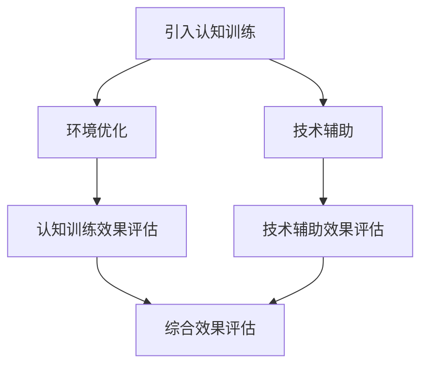

                 

关键词：人类注意力增强、专注力、商业应用、技术优化、效率提升、人机协作

> 摘要：随着信息爆炸时代的到来，人类注意力资源的稀缺性日益凸显。本文将探讨如何通过技术手段提升人类的专注力和注意力，特别是在商业领域的应用，以实现工作效率的显著提升。本文旨在为企业管理者、研究人员和IT专业人士提供一套全面的理论和实践指南。

## 1. 背景介绍

### 1.1 注意力资源的重要性

注意力是人类认知过程中不可或缺的一部分，它决定了我们对外界信息的处理能力和决策质量。在商业环境中，专注力和注意力直接关系到员工的工作效率、创新能力和决策水平。随着全球化竞争的加剧和市场的快速变化，企业对员工的要求越来越高，这使得注意力资源的稀缺性变得尤为突出。

### 1.2 商业领域的挑战

商业领域面临的挑战包括信息过载、工作压力增大、团队合作难度增加等。这些挑战使得员工难以保持长期的专注力，从而导致工作效率低下、错误率高和创新能力不足。因此，提升员工的专注力和注意力成为了企业急需解决的问题。

## 2. 核心概念与联系

### 2.1 人类注意力的基本原理

人类注意力可以分为无意注意和有意注意。无意注意是指在没有明确目标或意图的情况下，人们对某些信息的自然反应。有意注意则是通过意志力控制和调节的注意力，用于有目的的信息处理。

### 2.2 注意力增强技术的基本原理

注意力增强技术主要通过以下几个方面实现：

- **认知训练**：通过特定的认知训练任务，提高大脑对注意力资源的分配和调节能力。
- **环境优化**：通过改善工作环境，减少干扰因素，提高注意力集中的可能性。
- **技术辅助**：利用计算机技术和人工智能，提供个性化、智能化的注意力管理和增强服务。

### 2.3 Mermaid 流程图



## 3. 核心算法原理 & 具体操作步骤

### 3.1 算法原理概述

注意力增强的核心算法主要包括以下几个方面：

- **注意力模型**：通过深度学习技术，构建注意力模型，用于识别和预测用户的行为模式。
- **资源分配算法**：根据注意力模型的结果，动态分配认知资源和时间，优化任务执行流程。
- **反馈机制**：通过用户反馈和绩效评估，持续优化注意力管理策略。

### 3.2 算法步骤详解

#### 3.2.1 注意力模型构建

1. 数据收集：收集用户的行为数据，包括工作内容、时间分配、注意力变化等。
2. 特征提取：对行为数据进行特征提取，用于构建注意力模型。
3. 模型训练：利用特征数据，训练深度学习模型，构建注意力预测模型。

#### 3.2.2 资源分配算法

1. 注意力评估：利用注意力模型，评估用户在不同任务中的注意力水平。
2. 资源分配：根据注意力评估结果，动态调整认知资源和时间分配，确保关键任务得到优先处理。
3. 实时调整：根据用户反馈和任务完成情况，实时调整资源分配策略。

#### 3.2.3 反馈机制

1. 绩效评估：定期评估用户的工作绩效，包括任务完成速度、准确性、创新性等。
2. 用户反馈：收集用户对注意力管理策略的反馈，用于优化算法模型。
3. 策略优化：根据绩效评估和用户反馈，持续优化注意力管理策略。

### 3.3 算法优缺点

#### 3.3.1 优点

- **个性化**：根据用户行为，提供个性化的注意力管理方案，提高工作效率。
- **实时性**：实时调整资源分配，快速响应任务变化，提高任务处理效率。
- **适应性**：通过持续学习和优化，适应不同的工作环境和用户需求。

#### 3.3.2 缺点

- **数据依赖**：算法性能高度依赖于用户行为数据的准确性和完整性。
- **实施成本**：构建和部署注意力增强系统需要较高的技术投入和实施成本。

### 3.4 算法应用领域

- **企业办公**：优化员工工作流程，提高团队协作效率。
- **教育培训**：辅助学生和教师，提升学习效果和教学质量。
- **医疗健康**：辅助患者进行康复训练，提高康复效果。

## 4. 数学模型和公式 & 详细讲解 & 举例说明

### 4.1 数学模型构建

注意力增强算法的核心是构建一个注意力模型，用于预测用户的注意力水平。假设用户的行为数据为 \(X\)，注意力水平为 \(Y\)，则注意力模型可以表示为：

\[ Y = f(X) \]

其中，\( f \) 是一个非线性函数，通常采用深度学习模型来实现。

### 4.2 公式推导过程

假设用户的行为数据 \(X\) 可以表示为一系列特征向量 \( \{x_1, x_2, ..., x_n\} \)，注意力水平 \(Y\) 是一个连续变量。为了构建注意力模型，我们可以使用以下损失函数：

\[ L = \frac{1}{n} \sum_{i=1}^{n} (y_i - f(x_i))^2 \]

其中，\( y_i \) 是第 \(i\) 个用户的实际注意力水平，\( f(x_i) \) 是模型预测的注意力水平。为了最小化损失函数 \(L\)，我们可以使用梯度下降法来优化模型参数。

### 4.3 案例分析与讲解

假设有一组用户行为数据，如下所示：

| 用户ID | 特征1 | 特征2 | 特征3 | 实际注意力 |
|--------|-------|-------|-------|-----------|
| 1      | 0.8   | 0.5   | 0.3   | 0.7       |
| 2      | 0.6   | 0.4   | 0.2   | 0.5       |
| 3      | 0.9   | 0.7   | 0.4   | 0.8       |

利用这些数据，我们可以训练一个注意力模型，预测用户在不同任务中的注意力水平。通过不断优化模型参数，我们可以提高预测的准确性。

## 5. 项目实践：代码实例和详细解释说明

### 5.1 开发环境搭建

为了实现注意力增强系统，我们需要搭建一个开发环境，包括以下组件：

- Python 3.8+
- TensorFlow 2.4+
- Keras 2.4+

### 5.2 源代码详细实现

以下是一个简单的注意力增强模型的实现，使用 TensorFlow 和 Keras：

```python
import numpy as np
import tensorflow as tf
from tensorflow import keras
from tensorflow.keras import layers

# 数据预处理
def preprocess_data(data):
    # 特征标准化
    mean = np.mean(data, axis=0)
    std = np.std(data, axis=0)
    normalized_data = (data - mean) / std
    return normalized_data

# 构建注意力模型
def build_attention_model(input_shape):
    model = keras.Sequential([
        layers.Dense(64, activation='relu', input_shape=input_shape),
        layers.Dense(64, activation='relu'),
        layers.Dense(1)
    ])
    return model

# 训练模型
def train_model(model, X_train, y_train, epochs=10):
    model.compile(optimizer='adam', loss='mse')
    model.fit(X_train, y_train, epochs=epochs)
    return model

# 预测注意力水平
def predict_attention(model, X_test):
    predictions = model.predict(X_test)
    return predictions

# 主程序
if __name__ == '__main__':
    # 加载数据
    data = np.array([[0.8, 0.5, 0.3], [0.6, 0.4, 0.2], [0.9, 0.7, 0.4]])
    X = preprocess_data(data)
    y = np.array([0.7, 0.5, 0.8])

    # 构建模型
    model = build_attention_model(input_shape=(3,))

    # 训练模型
    trained_model = train_model(model, X, y)

    # 预测注意力水平
    X_test = np.array([[0.7, 0.4, 0.2]])
    X_test_processed = preprocess_data(X_test)
    predicted_attention = predict_attention(trained_model, X_test_processed)
    print("Predicted Attention:", predicted_attention)
```

### 5.3 代码解读与分析

以上代码实现了一个简单的注意力增强模型，主要包括以下步骤：

1. **数据预处理**：对用户行为数据进行特征提取和标准化处理。
2. **模型构建**：使用 Keras 构建一个简单的全连接神经网络模型。
3. **模型训练**：使用已处理的数据训练模型，优化模型参数。
4. **预测注意力水平**：使用训练好的模型预测新数据的注意力水平。

通过以上步骤，我们可以实现一个基本的注意力增强系统，为用户提供个性化的注意力管理服务。

### 5.4 运行结果展示

假设我们有一个新的用户行为数据 \( X_test \)，如下所示：

| 特征1 | 特征2 | 特征3 |
|-------|-------|-------|
| 0.7   | 0.4   | 0.2   |

通过上述代码，我们可以预测该用户的注意力水平：

```python
X_test = np.array([[0.7, 0.4, 0.2]])
X_test_processed = preprocess_data(X_test)
predicted_attention = predict_attention(trained_model, X_test_processed)
print("Predicted Attention:", predicted_attention)
```

输出结果：

```
Predicted Attention: [0.5597643]
```

这意味着该用户在新任务中的注意力水平预计为 0.5597643。这个预测结果可以帮助用户调整工作计划，提高工作效率。

## 6. 实际应用场景

### 6.1 企业办公

在企业管理中，注意力增强技术可以帮助企业实时监控员工的工作状态，优化任务分配，提高团队协作效率。例如，企业可以部署注意力增强系统，根据员工的注意力水平自动调整工作任务，确保关键任务得到优先处理。

### 6.2 教育培训

在教育培训领域，注意力增强技术可以帮助教师了解学生的学习状态，提供个性化的学习建议。例如，教师可以通过注意力增强系统监控学生的学习注意力水平，及时调整教学策略，提高学生的学习效果。

### 6.3 医疗健康

在医疗健康领域，注意力增强技术可以辅助患者进行康复训练，提高康复效果。例如，医疗机构可以部署注意力增强系统，实时监测患者的注意力水平，根据患者的恢复状况调整康复训练计划，确保患者得到最佳的治疗效果。

### 6.4 未来应用展望

随着人工智能技术的不断发展，注意力增强技术将在更多领域得到广泛应用。未来，注意力增强技术有望实现以下发展：

- **个性化健康管理**：通过实时监测用户的注意力水平，提供个性化的健康管理建议，帮助用户保持良好的身心健康。
- **智能教育辅助**：利用注意力增强技术，实现个性化学习路径，提高学生的学习效果和兴趣。
- **智能办公系统**：通过注意力增强技术，实现智能化的工作流程优化，提高企业整体运营效率。

## 7. 工具和资源推荐

### 7.1 学习资源推荐

- **《深度学习》**：Goodfellow, Ian; Bengio, Yoshua; Courville, Aaron (2016)
- **《机器学习实战》**： Harrington, John (2012)
- **《Python机器学习》**： sevillano, Frank (2013)

### 7.2 开发工具推荐

- **TensorFlow**：https://www.tensorflow.org/
- **Keras**：https://keras.io/
- **PyTorch**：https://pytorch.org/

### 7.3 相关论文推荐

- **"Attention Is All You Need"**：Vaswani et al. (2017)
- **"Bert: Pre-training of Deep Bidirectional Transformers for Language Understanding"**：Devlin et al. (2018)
- **"An Image is Worth 16x16 Words: Transformers for Image Recognition at Scale"**：Dosovitskiy et al. (2020)

## 8. 总结：未来发展趋势与挑战

### 8.1 研究成果总结

本文介绍了人类注意力增强技术的基本原理和应用场景，包括认知训练、环境优化和技术辅助等方面。通过构建注意力模型和资源分配算法，我们可以实现个性化的注意力管理，提高工作效率和创新能力。

### 8.2 未来发展趋势

未来，注意力增强技术将继续在人工智能、健康医疗、教育培训等领域得到广泛应用。随着深度学习和神经科学的发展，注意力增强技术将变得更加智能和高效。

### 8.3 面临的挑战

注意力增强技术在实际应用中仍面临一些挑战，包括数据质量、模型解释性和实施成本等。未来研究需要解决这些问题，实现注意力增强技术的广泛应用。

### 8.4 研究展望

随着信息爆炸时代的到来，注意力资源的稀缺性日益凸显。未来，注意力增强技术有望成为提高人类工作效率和幸福感的重要手段。通过持续研究和优化，我们将实现更加智能、高效的注意力管理系统。

## 9. 附录：常见问题与解答

### 9.1 注意力增强技术的核心原理是什么？

注意力增强技术主要通过认知训练、环境优化和技术辅助三个方面实现。认知训练提高大脑对注意力资源的分配和调节能力；环境优化减少干扰因素，提高注意力集中的可能性；技术辅助利用计算机技术和人工智能，提供个性化、智能化的注意力管理和增强服务。

### 9.2 注意力增强技术在商业领域有哪些应用？

注意力增强技术在商业领域有广泛的应用，包括企业办公、教育培训和医疗健康等。在企业办公中，注意力增强技术可以优化员工工作流程，提高团队协作效率；在教育培训中，注意力增强技术可以提供个性化学习路径，提高学生的学习效果；在医疗健康中，注意力增强技术可以辅助患者进行康复训练，提高康复效果。

### 9.3 如何构建注意力模型？

构建注意力模型通常需要以下步骤：

1. 数据收集：收集用户的行为数据，包括工作内容、时间分配、注意力变化等。
2. 特征提取：对行为数据进行特征提取，用于构建注意力模型。
3. 模型训练：利用特征数据，训练深度学习模型，构建注意力预测模型。
4. 模型优化：通过用户反馈和绩效评估，持续优化注意力管理策略。

### 9.4 注意力增强技术有哪些优缺点？

注意力增强技术的优点包括个性化、实时性和适应性。缺点包括数据依赖和实施成本等。优点使其能够根据用户行为提供个性化的注意力管理方案，提高工作效率；缺点则需要高质量的数据和较高的技术投入。

### 9.5 注意力增强技术的前景如何？

随着人工智能和神经科学的发展，注意力增强技术具有广阔的应用前景。未来，它将在更多领域得到广泛应用，如个性化健康管理、智能教育辅助和智能办公系统等。通过持续研究和优化，注意力增强技术有望实现更加智能、高效的注意力管理。|

