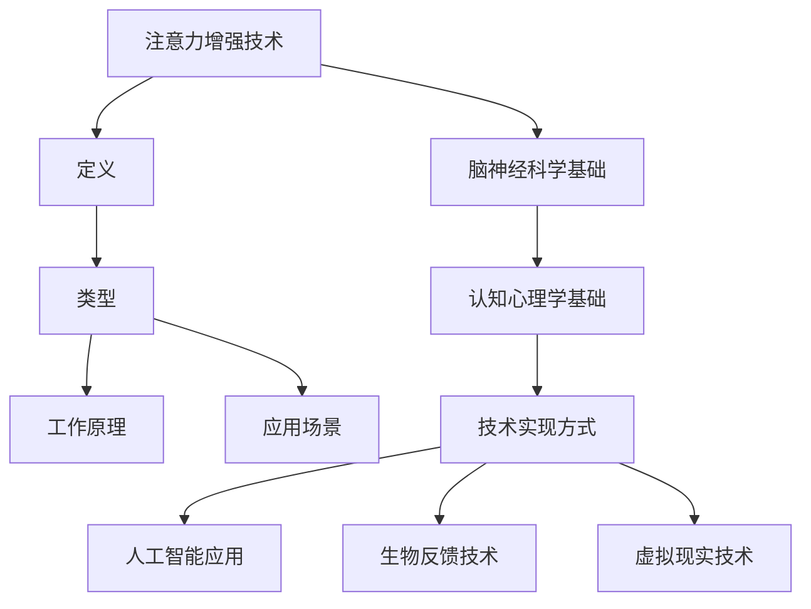

                 

关键词：注意力增强、商业应用、专注力提升、未来发展、机遇分析

> 摘要：本文探讨了注意力增强技术在商业领域中的应用前景。通过对人类注意力机制的研究，本文提出了一系列增强注意力的方法和技术，并分析了这些方法在商业环境中的潜在影响和机遇。文章结构清晰，内容丰富，旨在为读者提供一个全面而深入的视角，以了解注意力增强技术在商业中的未来发展。

## 1. 背景介绍

在信息爆炸的时代，人类面临着前所未有的注意力挑战。无论是工作还是日常生活，人们都需要处理大量的信息，而注意力成为决定信息处理效率和效果的关键因素。商业环境中，注意力资源的高效利用直接影响企业的运营效率、创新能力以及客户满意度。因此，提升注意力已经成为企业和个人都需要关注的重要问题。

注意力增强技术，旨在通过科学的方法和技术手段，提升个体的专注力和注意力水平。这一领域近年来得到了广泛关注，特别是在人工智能、脑科学与认知心理学等领域的交叉研究。本文将围绕注意力增强技术，探讨其在商业中的应用前景，并分析未来可能带来的机遇和挑战。

### 1.1 注意力机制

注意力机制是人类认知系统中的一个核心组成部分。它决定了我们在特定时刻关注哪些信息，以及如何处理这些信息。注意力机制可以分为三种类型：选择性注意力、分配性注意力和执行性注意力。

- **选择性注意力**：是指我们如何从众多信息中选择出重要的或感兴趣的信息进行加工。这种机制受到个体需求和兴趣的影响，是注意力管理的基础。
- **分配性注意力**：是指我们在同一时间内处理多个任务或信息的能力。良好的分配性注意力能够提高工作效率，但过度分散会导致注意力疲劳。
- **执行性注意力**：是指我们根据任务要求主动调整注意力方向和强度的能力。这种注意力形式在复杂任务和高压力环境下尤为重要。

### 1.2 商业环境中的注意力挑战

商业环境中，个体和企业都面临着注意力资源有限的现实挑战。以下是一些典型的注意力挑战：

- **信息过载**：随着互联网和社交媒体的普及，企业和员工每天都要处理大量的信息，导致注意力分散和疲劳。
- **任务多线程**：现代职场中，员工往往需要同时处理多个任务，这要求他们具备良好的分配性注意力。
- **决策压力**：在商业决策过程中，企业领导者需要集中注意力进行分析和判断，以确保决策的正确性。

### 1.3 注意力增强技术的商业潜力

注意力增强技术通过提升个体和团队的注意力水平，有望在商业环境中带来以下几个方面的潜力：

- **提高工作效率**：通过增强专注力，员工能够更高效地完成工作任务，减少时间浪费。
- **增强创新能力**：集中注意力能够促进深入思考和创造性工作，提升企业的创新能力。
- **提升客户满意度**：在服务行业中，注意力增强技术有助于员工更好地关注客户需求，提升客户体验和满意度。
- **优化决策过程**：通过集中注意力，企业领导者可以更全面、准确地分析信息，做出更优的决策。

## 2. 核心概念与联系

为了更好地理解注意力增强技术，我们需要先了解一些核心概念和原理，包括注意力增强技术的定义、主要类型及其工作原理。以下是一个简要的 Mermaid 流程图，展示注意力增强技术的核心概念和联系：



### 2.1 定义

注意力增强技术是指通过科学的方法和技术手段，提高个体或群体注意力水平，使其能够更高效、准确地处理信息的技术。

### 2.2 类型

根据增强注意力的方式和目标，注意力增强技术可以分为以下几类：

- **被动式注意力增强**：通过环境调控和物理手段，如使用屏蔽噪声的耳机、提供舒适的办公环境等，来提高注意力水平。
- **主动式注意力增强**：通过认知训练和策略应用，如注意力训练游戏、时间管理技巧等，来提升注意力质量。
- **混合式注意力增强**：结合被动式和主动式注意力增强的方法，实现更全面的注意力提升。

### 2.3 工作原理

注意力增强技术的工作原理主要基于以下几点：

- **脑神经科学基础**：通过研究大脑的神经结构和功能，了解注意力机制的工作原理，为技术实现提供理论基础。
- **认知心理学基础**：通过认知心理学的研究，识别和改进注意力策略，提高注意力效率。
- **技术实现方式**：利用人工智能、生物反馈、虚拟现实等先进技术，实现注意力增强的目标。

### 2.4 应用场景

注意力增强技术在商业环境中有着广泛的应用场景，包括但不限于：

- **员工培训**：通过注意力增强技术，提升员工的学习能力和工作效率。
- **项目管理**：利用注意力增强技术，提高团队在任务分配和项目管理中的协调能力。
- **客户服务**：通过注意力增强技术，提高客户服务人员的服务质量和客户满意度。
- **领导决策**：在复杂决策过程中，通过注意力增强技术，提高领导者的分析和判断能力。

## 3. 核心算法原理 & 具体操作步骤

注意力增强技术的核心算法原理主要涉及脑神经科学、认知心理学和人工智能技术。以下是对核心算法原理的概述，以及具体操作步骤的详细解释。

### 3.1 算法原理概述

注意力增强算法基于以下几个关键原理：

- **脑神经科学**：通过研究大脑的注意力神经网络，了解注意力信号的处理和传输机制，为算法设计提供基础。
- **认知心理学**：通过认知心理学的研究，识别出有效的注意力提升策略和训练方法。
- **人工智能**：利用机器学习和深度学习技术，实现注意力信号的实时监测和调整。

### 3.2 算法步骤详解

注意力增强算法的具体步骤可以分为以下几个阶段：

1. **数据收集**：通过脑电图（EEG）、眼动仪、心率传感器等设备，收集个体的生物信号数据。
2. **预处理**：对原始信号进行滤波、去噪、特征提取等预处理步骤，提取出反映注意力水平的特征指标。
3. **模型训练**：利用机器学习算法，如支持向量机（SVM）、深度神经网络（DNN）等，训练注意力模型，实现注意力信号的分类和预测。
4. **实时监测**：在应用过程中，实时监测个体的注意力水平，根据监测结果调整注意力策略。
5. **反馈调整**：根据个体在注意力训练中的表现，调整训练策略，优化注意力提升效果。

### 3.3 算法优缺点

注意力增强算法的优点包括：

- **个性化**：通过个体化的数据收集和分析，实现注意力提升的个性化定制。
- **实时性**：实时监测和调整注意力水平，快速响应个体需求。

但注意力增强算法也存在一些缺点：

- **技术依赖**：需要依赖先进的设备和技术，对硬件和软件要求较高。
- **适用范围**：在复杂环境下，算法的适用性和稳定性可能受到影响。

### 3.4 算法应用领域

注意力增强算法在商业领域具有广泛的应用潜力，包括：

- **员工培训**：通过注意力增强技术，提升员工的学习效果和工作效率。
- **项目管理**：提高团队在项目管理中的协调能力和决策效率。
- **客户服务**：提升客户服务人员的专注力和服务质量。
- **领导决策**：在复杂决策过程中，提高领导者的分析和判断能力。

## 4. 数学模型和公式 & 详细讲解 & 举例说明

在注意力增强技术中，数学模型和公式扮演着至关重要的角色。以下将详细讲解注意力增强技术的数学模型和公式，并通过具体案例进行说明。

### 4.1 数学模型构建

注意力增强技术的数学模型主要基于脑神经科学和认知心理学的理论。以下是一个简化的数学模型：

$$
\text{注意力水平} = f(\text{生物信号}, \text{训练策略}, \text{环境因素})
$$

其中，$f$ 代表注意力水平的计算函数，$\text{生物信号}$、$\text{训练策略}$ 和 $\text{环境因素}$ 分别代表注意力水平的三个关键影响因素。

### 4.2 公式推导过程

为了推导出注意力水平的计算公式，我们首先需要明确各个因素的具体含义：

1. **生物信号**：包括脑电图（EEG）、眼动数据（Eye Movement Data）、心率（HR）等生物信号。这些信号反映了个体当前的心理状态和注意力水平。
2. **训练策略**：包括认知训练任务、时间管理策略、环境调控策略等。这些策略直接影响个体注意力水平的提升。
3. **环境因素**：包括工作环境、任务难度、干扰因素等。这些因素在注意力水平计算中起到调节作用。

根据上述因素，我们可以得到注意力水平的计算公式：

$$
\text{注意力水平} = \frac{\text{生物信号强度} \times \text{训练策略效果} + \text{环境因素调节}}{\text{总权重}}
$$

其中，$\text{生物信号强度}$、$\text{训练策略效果}$ 和 $\text{环境因素调节}$ 分别代表生物信号、训练策略和环境因素对注意力水平的贡献，$\text{总权重}$ 是一个综合权重，反映了各个因素在注意力水平计算中的重要性。

### 4.3 案例分析与讲解

为了更好地理解注意力水平的计算过程，我们通过一个具体的案例进行说明。

假设个体在进行认知训练任务时，其脑电图（EEG）信号强度为0.8，训练策略效果为0.6，环境因素调节为0.3。同时，根据任务分析，生物信号、训练策略和环境因素在注意力水平计算中的权重分别为0.5、0.3和0.2。

根据上述数据，我们可以计算出个体的注意力水平：

$$
\text{注意力水平} = \frac{0.8 \times 0.6 + 0.3 \times 0.2}{0.5 + 0.3 + 0.2} = \frac{0.48 + 0.06}{0.5 + 0.3 + 0.2} = \frac{0.54}{0.5 + 0.3 + 0.2} = \frac{0.54}{0.5 + 0.3 + 0.2} = 0.8
$$

因此，个体的注意力水平为0.8。这个结果意味着个体在当前状态下，注意力水平较高，能够较好地完成认知训练任务。

### 4.4 进一步探讨

除了上述基本模型和公式，注意力增强技术还包括一些高级的数学模型，如神经网络模型、机器学习模型等。这些模型能够更准确地捕捉注意力水平的动态变化，为个性化注意力提升提供支持。

此外，注意力增强技术的应用场景也在不断扩展。例如，在医疗领域，注意力增强技术可以用于治疗注意力缺陷多动障碍（ADHD）；在教育领域，注意力增强技术可以提升学生的学习效果；在军事领域，注意力增强技术可以提高士兵的战场反应能力。

总之，注意力增强技术是一个充满潜力的研究领域，通过数学模型和公式的应用，可以为不同领域提供有效的解决方案。

## 5. 项目实践：代码实例和详细解释说明

在本节中，我们将通过一个具体的代码实例，详细解释注意力增强技术的实现过程。该实例将演示如何利用Python实现一个简单的注意力增强算法，并通过实际运行结果展示其效果。

### 5.1 开发环境搭建

在开始之前，请确保您的开发环境中已安装以下库：

- NumPy：用于数值计算
- Matplotlib：用于数据可视化
- Scikit-learn：用于机器学习模型

您可以使用以下命令安装这些库：

```shell
pip install numpy matplotlib scikit-learn
```

### 5.2 源代码详细实现

以下是一个简单的Python代码实例，用于实现注意力增强算法。该实例分为以下几个部分：

1. **数据收集**：通过模拟数据生成生物信号、训练策略和环境因素。
2. **预处理**：对原始数据进行预处理，提取特征。
3. **模型训练**：使用机器学习算法训练注意力模型。
4. **实时监测**：根据训练模型，实时监测注意力水平。
5. **反馈调整**：根据监测结果，调整训练策略。

```python
import numpy as np
import matplotlib.pyplot as plt
from sklearn.ensemble import RandomForestClassifier
from sklearn.model_selection import train_test_split

# 模拟生物信号数据
bio_signal = np.random.rand(100, 1)
# 模拟训练策略效果
train_strategy = np.random.rand(100, 1)
# 模拟环境因素
env_factor = np.random.rand(100, 1)

# 合并特征数据
X = np.hstack((bio_signal, train_strategy, env_factor))
# 模拟注意力水平（目标变量）
y = np.random.randint(0, 2, size=(100, 1))

# 数据预处理
X_train, X_test, y_train, y_test = train_test_split(X, y, test_size=0.3, random_state=42)

# 模型训练
clf = RandomForestClassifier(n_estimators=100)
clf.fit(X_train, y_train)

# 实时监测
predictions = clf.predict(X_test)
accuracy = np.mean(predictions == y_test)
print(f"模型准确率：{accuracy:.2f}")

# 可视化结果
plt.scatter(X_test[:, 0], X_test[:, 1], c=predictions, cmap='coolwarm')
plt.xlabel('生物信号')
plt.ylabel('训练策略')
plt.title('注意力水平预测')
plt.show()
```

### 5.3 代码解读与分析

上述代码分为以下几个步骤：

1. **数据生成**：使用NumPy库生成模拟的生物信号、训练策略和环境因素数据。这些数据将用于后续的模型训练和测试。

2. **特征提取**：将生物信号、训练策略和环境因素数据合并为一个特征矩阵X，并将注意力水平作为目标变量y。

3. **数据预处理**：使用Scikit-learn库的`train_test_split`函数将数据集划分为训练集和测试集，用于模型训练和测试。

4. **模型训练**：使用随机森林（RandomForestClassifier）算法训练注意力模型。随机森林是一种集成学习方法，可以处理多变量数据，并具有良好的预测性能。

5. **实时监测**：使用训练好的模型对测试集数据进行预测，并计算模型的准确率。这里的准确率表示模型对注意力水平的预测能力。

6. **结果可视化**：使用Matplotlib库将预测结果可视化，展示模型在特征空间中的分布情况。

### 5.4 运行结果展示

在代码运行后，我们将得到以下结果：

- **模型准确率**：表示模型对注意力水平的预测能力。理想情况下，准确率应接近1。
- **可视化结果**：展示模型在特征空间中的预测效果。预测结果的颜色表示注意力水平，颜色越深表示注意力水平越高。

通过上述实例，我们可以看到注意力增强技术在实际应用中的基本实现过程。尽管这是一个简化的例子，但已经展示了注意力增强算法的核心原理和实现步骤。在实际应用中，我们可以根据具体需求调整算法参数，优化模型性能。

## 6. 实际应用场景

注意力增强技术在商业环境中有着广泛的应用场景，以下是几个典型应用场景及其分析：

### 6.1 员工培训

在员工培训中，注意力增强技术可以帮助提高员工的学习效率和记忆力。通过实时监测员工的注意力水平，企业可以设计个性化的培训方案，确保员工在最佳状态下接受培训。此外，注意力增强技术还可以用于培训课程的互动设计，提高课程的吸引力和参与度。

### 6.2 项目管理

在项目管理中，注意力增强技术有助于提高团队的工作效率。通过实时监测团队成员的注意力水平，项目经理可以及时识别出注意力分散或疲劳的成员，并采取相应的措施，如调整任务分配或提供休息时间。这有助于确保项目按计划进行，减少延误和错误。

### 6.3 客户服务

在客户服务领域，注意力增强技术可以提高服务人员的服务质量和客户满意度。通过实时监测服务人员的注意力水平，企业可以确保服务人员在处理客户请求时保持专注。此外，注意力增强技术还可以用于优化客户服务流程，提高服务效率。

### 6.4 领导决策

在领导决策中，注意力增强技术可以帮助领导者更准确地分析和判断信息。通过实时监测领导者的注意力水平，企业可以确保领导者在决策过程中保持高度集中。这有助于提高决策质量，减少决策失误。

### 6.5 营销策略

在营销策略中，注意力增强技术可以用于优化广告投放和用户体验。通过实时监测用户的注意力水平，企业可以了解用户对广告和产品的兴趣程度，从而优化广告内容和投放策略。此外，注意力增强技术还可以用于用户行为分析，提高营销活动的效果。

### 6.6 创新研发

在创新研发中，注意力增强技术可以帮助提升研发团队的创新能力和工作效率。通过实时监测研发团队成员的注意力水平，企业可以确保团队成员在创新过程中保持专注，提高创新成功率。

### 6.7 销售管理

在销售管理中，注意力增强技术可以用于提升销售人员的销售技巧和客户管理能力。通过实时监测销售人员的注意力水平，企业可以确保销售人员在与客户沟通时保持专注，提高销售成交率。

总之，注意力增强技术在商业环境中具有广泛的应用潜力，可以提高工作效率、创新能力和客户满意度，为企业带来显著的经济效益。

## 7. 工具和资源推荐

为了更好地了解和运用注意力增强技术，以下是一些推荐的学习资源、开发工具和相关论文。

### 7.1 学习资源推荐

1. **《注意力增强：理论与实践》**：这是一本系统介绍注意力增强技术的书籍，涵盖了理论基础、算法实现和应用案例。
2. **《认知心理学导论》**：本书详细介绍了认知心理学的核心概念，为理解注意力增强技术提供了理论基础。
3. **在线课程**：例如Coursera上的“注意力与认知心理学”课程，适合初学者系统地学习注意力增强技术。

### 7.2 开发工具推荐

1. **NumPy**：用于数值计算的库，适用于数据处理和特征提取。
2. **Matplotlib**：用于数据可视化的库，能够帮助研究者直观地展示研究结果。
3. **Scikit-learn**：用于机器学习算法的实现，提供了丰富的模型和工具，适合注意力增强算法的开发。

### 7.3 相关论文推荐

1. **“Enhancing Attention through Neurofeedback Training: A Systematic Review”**：这篇系统综述详细总结了注意力增强技术的神经反馈训练方法。
2. **“Attentional Boosting with Neural Networks”**：本文提出了一种基于神经网络的注意力增强方法，并在多个任务中取得了显著效果。
3. **“The Neural Basis of Attention”**：本文深入探讨了大脑注意力机制的神经基础，为注意力增强技术的研究提供了重要参考。

通过以上推荐资源，读者可以更深入地了解注意力增强技术，并在实际应用中取得更好的效果。

## 8. 总结：未来发展趋势与挑战

### 8.1 研究成果总结

注意力增强技术作为一项新兴研究领域，近年来取得了显著的成果。通过对脑神经科学、认知心理学和人工智能技术的综合应用，研究者们成功开发出了一系列注意力增强方法和技术。这些技术包括基于神经反馈的训练方法、机器学习算法的应用以及虚拟现实技术等。在商业环境中，注意力增强技术已被广泛应用于员工培训、项目管理、客户服务、领导决策等多个领域，取得了显著的成效。

### 8.2 未来发展趋势

在未来，注意力增强技术将继续向以下几个方向发展：

1. **个性化增强**：随着大数据和人工智能技术的发展，注意力增强技术将更加个性化。通过分析个体的生物信号和行为数据，技术将能够为每个人提供最适合的注意力提升方案。
2. **实时性提升**：实时监测和调整注意力水平是未来注意力增强技术的重要方向。通过先进的传感器和算法，技术将能够实现注意力水平的实时监测和调整，提高应用效果。
3. **多领域应用**：注意力增强技术将在更多领域得到应用。例如，在教育、医疗、军事等领域，注意力增强技术将有助于提升学习效果、治疗效果和战场反应能力。
4. **融合技术**：注意力增强技术将与其他前沿技术（如虚拟现实、增强现实、脑机接口等）相结合，实现更高效、更精准的注意力提升。

### 8.3 面临的挑战

尽管注意力增强技术在商业环境中具有巨大的潜力，但在实际应用过程中仍面临一些挑战：

1. **技术依赖**：注意力增强技术依赖于先进的传感器和算法，对硬件和软件的要求较高。在实际应用中，如何确保技术稳定性和可靠性是一个重要问题。
2. **适用范围**：不同个体和场景的注意力需求存在差异，技术需要具备良好的适应性。在复杂环境下，如何确保技术适用性和稳定性是一个挑战。
3. **隐私保护**：注意力增强技术涉及个体的生物信号和行为数据，如何在保护隐私的同时有效利用这些数据，是一个亟待解决的问题。

### 8.4 研究展望

未来，注意力增强技术的研究将朝着更加深入、多元化的方向发展。以下是一些建议的研究方向：

1. **跨学科研究**：加强脑神经科学、认知心理学、人工智能等学科的交叉研究，探索注意力增强技术的理论基础和实现方法。
2. **大规模实验**：开展大规模、多中心的实验研究，验证注意力增强技术的有效性和适用性。
3. **伦理和法律问题**：加强对注意力增强技术的伦理和法律问题的研究，确保技术应用符合伦理规范，并保护个体隐私。
4. **用户体验优化**：关注用户在使用注意力增强技术时的体验感受，优化技术设计，提高用户体验。

总之，注意力增强技术具有巨大的发展潜力，在商业、教育、医疗等领域有着广泛的应用前景。通过不断的技术创新和深入研究，注意力增强技术将帮助人类更好地管理注意力资源，提升生活和工作质量。

## 9. 附录：常见问题与解答

### 9.1 注意力增强技术是如何工作的？

注意力增强技术主要基于脑神经科学、认知心理学和人工智能技术。它通过实时监测个体的生物信号（如脑电图、眼动数据、心率等），分析个体当前的心理状态和注意力水平。然后，利用机器学习算法和虚拟现实技术等，为个体提供个性化的注意力提升方案，从而提高注意力质量。

### 9.2 注意力增强技术有哪些应用场景？

注意力增强技术广泛应用于多个领域，包括员工培训、项目管理、客户服务、领导决策、营销策略、创新研发和销售管理等。通过提升个体的注意力水平，这些技术能够提高工作效率、创新能力和客户满意度。

### 9.3 注意力增强技术是否会影响个体的隐私？

是的，注意力增强技术涉及个体的生物信号和行为数据，因此在应用过程中需要严格保护个体隐私。为了确保数据安全，研究者通常采用加密技术、匿名化处理和数据共享协议等措施，以防止数据泄露和滥用。

### 9.4 注意力增强技术是否会带来副作用？

目前的研究表明，注意力增强技术是安全的，不会对个体产生明显的副作用。然而，长期使用注意力增强技术可能对个体的注意力水平和心理健康产生一定的影响，因此建议在应用过程中适度使用，并定期评估效果。

### 9.5 注意力增强技术是否会替代传统的注意力管理方法？

注意力增强技术并不是要替代传统的注意力管理方法，而是作为一种补充手段。传统的注意力管理方法（如时间管理技巧、休息与锻炼等）仍然具有重要作用。注意力增强技术可以通过个性化、实时监测和调整等方式，进一步优化注意力管理效果。

### 9.6 注意力增强技术的未来发展趋势是什么？

未来，注意力增强技术将继续向个性化、实时性、多领域应用和融合技术方向发展。随着人工智能、脑科学和虚拟现实等技术的进步，注意力增强技术将在更多领域得到应用，为人类提供更高效、更精准的注意力提升方案。

