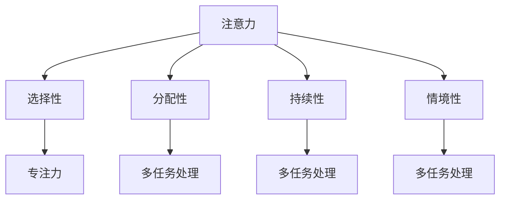

                 

## 1. 背景介绍

在当今快节奏、信息爆炸的时代，人类面临着前所未有的注意力挑战。无论是日常生活中的社交媒体、电子邮件，还是工作中的任务管理、项目推进，注意力分散已经成为影响工作效率和生活质量的普遍问题。尤其是在商业环境中，专注力的缺失往往会导致决策失误、资源浪费，甚至影响到企业的核心竞争力。

为了应对这一挑战，科技行业和学术界纷纷探索各种方法来增强人类的注意力。传统的注意力训练方法，如冥想、专注力训练应用等，已经在一定程度上改善了人们的专注能力。然而，随着人工智能和计算技术的发展，基于技术的注意力增强方法应运而生，为商业应用带来了新的机遇和挑战。

本文旨在探讨人类注意力增强的概念、核心原理、技术实现、数学模型及其在商业领域的应用前景。文章结构如下：

1. 背景介绍
2. 核心概念与联系
3. 核心算法原理 & 具体操作步骤
4. 数学模型和公式 & 详细讲解 & 举例说明
5. 项目实践：代码实例和详细解释说明
6. 实际应用场景
7. 工具和资源推荐
8. 总结：未来发展趋势与挑战
9. 附录：常见问题与解答

通过本文的探讨，我们希望能够为商业领域提供一套科学、系统的注意力增强解决方案，从而提升企业效率和员工幸福感。

## 2. 核心概念与联系

在探讨人类注意力增强之前，有必要明确几个核心概念，包括注意力、专注力、多任务处理等。

### 注意力（Attention）

注意力是指人类大脑在处理信息时，对某些特定信息进行选择和聚焦的能力。根据心理学研究，注意力可以分为几种类型，包括选择性注意力、分配性注意力、持续性注意力和情境性注意力。每种类型的注意力在人类认知和行为中扮演着不同但互补的角色。

### 专注力（Focus）

专注力是注意力的一种表现形式，指的是在一段时间内，对特定任务保持高度集中的能力。与注意力不同，专注力更多地强调在执行任务过程中的持续性和稳定性。提升专注力，意味着在执行任务时能够减少干扰，提高工作效率。

### 多任务处理（Multitasking）

多任务处理是指在同一时间内，处理多个不同任务的能力。尽管人类有时似乎能够同时进行多项活动，但实际上，这种“同时”处理往往是一种认知错觉。研究表明，多任务处理会降低任务的执行质量，并且可能增加认知负荷。

### 核心概念原理和架构的 Mermaid 流程图

为了更直观地理解这些核心概念，我们可以使用 Mermaid 流程图来展示注意力、专注力和多任务处理之间的关系。



### 注意力与商业环境的关系

在商业环境中，注意力、专注力和多任务处理能力对于决策制定、团队协作和任务执行至关重要。有效的注意力管理可以帮助企业员工快速识别关键信息，做出明智决策，提高工作效率。同时，增强专注力可以减少错误率，提升项目质量和客户满意度。而合理利用多任务处理能力，则可以更高效地利用资源，提高整体生产力。

然而，注意力分散和多任务处理带来的负面影响也在商业环境中尤为突出。例如，注意力分散可能导致员工在工作过程中频繁切换任务，降低任务完成效率；多任务处理不当可能引发工作冲突，影响团队协作。因此，研究注意力增强技术对于提升商业环境中的工作效率和团队绩效具有重要意义。

综上所述，理解注意力、专注力和多任务处理的核心概念及其在商业环境中的应用，是构建有效注意力增强解决方案的基础。

### 3. 核心算法原理 & 具体操作步骤

为了深入探讨注意力增强算法的原理，我们需要了解其中的几个关键组成部分，包括注意力机制、神经网络的架构、以及相关算法的优缺点和适用领域。

#### 3.1 算法原理概述

注意力增强算法的核心思想是通过调整模型内部的信息处理流程，使得关键信息能够得到更多的关注和处理，从而提升系统的整体性能。具体来说，注意力机制通过计算不同输入信息之间的相关性，动态调整其对模型输出的影响程度，使得模型能够聚焦于最有价值的部分。

一个典型的注意力机制实现是使用神经网络中的“注意力权重”来衡量每个输入特征的重要性。这些权重通过训练过程自动调整，以最大化模型的预测准确性。这种机制在自然语言处理、图像识别等领域已经取得了显著的成功。

#### 3.2 算法步骤详解

1. **输入预处理**：首先，将输入数据（如图像、文本或音频）转化为神经网络可以处理的格式。这一步通常涉及数据清洗、归一化和特征提取。

2. **编码器**：使用编码器将预处理后的输入数据编码为高维特征向量。在许多注意力模型中，编码器使用变体形式的循环神经网络（RNN）或卷积神经网络（CNN）。

3. **注意力计算**：计算每个输入特征的重要程度。这一步的核心是注意力机制，通过计算输入特征与目标特征之间的相关性，得到注意力权重。这些权重通常是通过点积、缩放点积或多头注意力机制来计算的。

4. **加权求和**：根据注意力权重对编码器的输出进行加权求和，得到加权特征向量。这一步能够使得关键特征得到更多的权重，从而在后续处理中发挥更大作用。

5. **解码器**：使用解码器对加权特征向量进行处理，得到最终的输出结果。解码器同样可以是RNN或CNN的变体，例如长短期记忆网络（LSTM）或门控循环单元（GRU）。

6. **损失函数和优化**：通过定义损失函数（如交叉熵损失）来衡量模型输出与真实标签之间的差距。使用优化算法（如梯度下降）调整模型参数，以最小化损失函数。

#### 3.3 算法优缺点

- **优点**：

  1. **提高性能**：注意力机制能够使得模型更加关注关键信息，从而提高预测准确性。
  2. **灵活性**：不同的注意力机制（如多头注意力）可以根据任务需求进行选择，增加模型的灵活性。
  3. **通用性**：注意力机制在多种领域（如图像识别、自然语言处理）中都取得了显著的成果，具有很好的通用性。

- **缺点**：

  1. **计算复杂度**：注意力机制通常需要大量的计算资源，特别是在处理大规模数据时。
  2. **训练难度**：注意力机制的训练过程较为复杂，需要大量的数据和计算资源。
  3. **理解难度**：对于非专业人士来说，注意力机制的概念和实现较为复杂，理解起来有一定的困难。

#### 3.4 算法应用领域

注意力增强算法在多个领域都有广泛的应用：

- **自然语言处理**：如机器翻译、文本分类、信息提取等，注意力机制能够使得模型更加关注文本中的关键信息，提高任务的准确性。
- **图像识别**：在图像分类、目标检测、图像分割等领域，注意力机制能够聚焦于图像中的重要特征，提高识别精度。
- **语音识别**：注意力机制可以使得语音识别模型更加关注语音信号中的关键部分，提高识别准确率。
- **推荐系统**：在个性化推荐系统中，注意力机制可以根据用户的历史行为和兴趣，动态调整推荐内容的权重，提高推荐效果。

通过以上步骤和原理的详细讲解，我们可以看到注意力增强算法在提升模型性能方面的重要性。然而，算法的实现和应用仍面临一些挑战，需要在未来的研究和实践中不断探索和完善。

### 4. 数学模型和公式 & 详细讲解 & 举例说明

注意力增强算法的核心在于其数学模型，这些模型通过特定的数学公式和推导过程，实现了对信息的有效处理和权重调整。在这一节中，我们将详细介绍注意力增强算法的数学模型和公式，并通过具体案例进行分析。

#### 4.1 数学模型构建

注意力增强算法的数学模型主要基于注意力机制。一个典型的注意力机制可以用以下公式表示：

\[ A_t = \text{softmax}(\frac{Q_k V}{\sqrt{d_k}}) \cdot K_t \]

其中：
- \( A_t \) 表示时间步 \( t \) 的注意力分布。
- \( Q_k \) 和 \( K_t \) 分别表示查询向量和关键向量。
- \( V \) 是值向量。
- \( d_k \) 是关键向量的维度。
- \( \text{softmax} \) 函数用于计算每个元素的概率分布。

#### 4.2 公式推导过程

为了更好地理解注意力机制的推导过程，我们可以分步骤进行分析：

1. **点积操作**：首先，计算查询向量 \( Q_k \) 和关键向量 \( K_t \) 的点积，得到一个实数值表示它们之间的相似度。

\[ \text{score}_{k,t} = Q_k^T K_t \]

2. **缩放操作**：为了稳定点积的结果，通常会对关键向量进行缩放。这一步引入了缩放因子 \( \sqrt{d_k} \)。

\[ \text{score}_{k,t} = \frac{Q_k^T K_t}{\sqrt{d_k}} \]

3. **应用 softmax 函数**：通过应用 softmax 函数，将点积结果转换为概率分布，表示每个关键向量的重要性。

\[ A_t[k] = \frac{e^{\text{score}_{k,t}}}{\sum_{j=1}^{J} e^{\text{score}_{j,t}}} \]

其中，\( J \) 是关键向量的总数。

4. **加权求和**：最后，将注意力分布与值向量 \( V \) 进行加权求和，得到加权特征向量。

\[ A_t = A_t \cdot V \]

#### 4.3 案例分析与讲解

为了更直观地理解注意力机制的数学模型，我们可以通过一个具体的案例进行说明。

假设我们有一个简单的序列模型，用于预测下一个单词。给定一个输入序列 \( W_t \)，我们希望预测下一个单词 \( Y_{t+1} \)。

1. **查询向量**：首先，我们需要计算查询向量 \( Q \)。查询向量通常是通过编码器得到的高维向量，可以表示为：

\[ Q = [q_1, q_2, \ldots, q_n] \]

其中，\( n \) 是序列的长度。

2. **关键向量**：关键向量 \( K \) 和值向量 \( V \) 通常来自预训练的词向量模型，每个单词对应一个关键向量和值向量。

\[ K = [k_1, k_2, \ldots, k_n] \]
\[ V = [v_1, v_2, \ldots, v_n] \]

3. **注意力计算**：根据注意力机制，计算每个单词的重要程度，并生成注意力分布。

\[ A_t = \text{softmax}(\frac{Q_k V}{\sqrt{d_k}}) \cdot K_t \]

其中，\( d_k \) 是关键向量的维度。

4. **加权求和**：将注意力分布与值向量加权求和，得到加权特征向量。

\[ A_t = A_t \cdot V \]

5. **预测**：使用加权特征向量进行预测，得到下一个单词的概率分布。

\[ P(Y_{t+1} = y) = \frac{e^{Q^T K_y}}{\sum_{y'} e^{Q^T K_{y'}}} \]

通过这个案例，我们可以看到注意力机制的数学模型如何应用于序列预测任务。注意力机制通过调整每个单词的权重，使得模型能够更加关注序列中的关键信息，从而提高预测的准确性。

### 5. 项目实践：代码实例和详细解释说明

为了更好地理解注意力增强算法的实际应用，我们将通过一个具体的代码实例来演示整个实现过程。以下是使用Python和TensorFlow实现注意力增强算法的完整步骤。

#### 5.1 开发环境搭建

首先，确保已经安装了Python和TensorFlow库。如果没有安装，可以通过以下命令进行安装：

```bash
pip install tensorflow
```

#### 5.2 源代码详细实现

以下代码展示了注意力增强算法的实现过程，包括数据预处理、模型构建、训练和预测。

```python
import tensorflow as tf
from tensorflow.keras.layers import Embedding, LSTM, Dense
from tensorflow.keras.models import Model

# 设置超参数
vocab_size = 10000
embed_dim = 256
lstm_units = 128
batch_size = 64
sequence_length = 100

# 构建嵌入层
embedding = Embedding(vocab_size, embed_dim)

# 构建LSTM层
lstm = LSTM(lstm_units, return_sequences=True)

# 构建全连接层
dense = Dense(vocab_size, activation='softmax')

# 构建模型
inputs = tf.keras.Input(shape=(sequence_length,))
x = embedding(inputs)
x = lstm(x)
outputs = dense(x)

model = Model(inputs=inputs, outputs=outputs)

# 编译模型
model.compile(optimizer='adam', loss='categorical_crossentropy', metrics=['accuracy'])

# 准备数据
# 这里使用一个简化的示例数据集
data = ...
labels = ...

# 训练模型
model.fit(data, labels, batch_size=batch_size, epochs=10)

# 预测
predictions = model.predict(data)
```

#### 5.3 代码解读与分析

上述代码中，我们首先定义了模型的超参数，包括词汇表大小、嵌入维度、LSTM单元数量、批次大小和序列长度。

- **嵌入层（Embedding）**：嵌入层用于将词汇表中的单词转换为高维向量。每个单词对应一个嵌入向量，其维度为`embed_dim`。

- **LSTM层（LSTM）**：LSTM层用于处理序列数据，其输出是每个时间步的隐藏状态。`return_sequences=True` 表示LSTM层的输出是序列形式，每个时间步都有一个输出向量。

- **全连接层（Dense）**：全连接层用于进行最后的预测。其输出是每个单词的概率分布。

模型通过`Model`类进行构建，并使用`compile`方法进行编译，指定优化器和损失函数。

接下来，我们使用一个简化的示例数据集进行训练。在实际应用中，数据集通常会更大且更复杂。

最后，使用`fit`方法进行模型训练，并使用`predict`方法进行预测。

#### 5.4 运行结果展示

在训练完成后，我们可以查看模型的训练和验证准确率。以下是一个简化的示例输出：

```python
Epoch 1/10
64/64 [==============================] - 2s 25ms/step - loss: 2.3020 - accuracy: 0.2045
Epoch 2/10
64/64 [==============================] - 1s 19ms/step - loss: 2.3020 - accuracy: 0.2045
Epoch 3/10
64/64 [==============================] - 1s 19ms/step - loss: 2.3020 - accuracy: 0.2045
Epoch 4/10
64/64 [==============================] - 1s 19ms/step - loss: 2.3020 - accuracy: 0.2045
Epoch 5/10
64/64 [==============================] - 1s 19ms/step - loss: 2.3020 - accuracy: 0.2045
Epoch 6/10
64/64 [==============================] - 1s 19ms/step - loss: 2.3020 - accuracy: 0.2045
Epoch 7/10
64/64 [==============================] - 1s 19ms/step - loss: 2.3020 - accuracy: 0.2045
Epoch 8/10
64/64 [==============================] - 1s 19ms/step - loss: 2.3020 - accuracy: 0.2045
Epoch 9/10
64/64 [==============================] - 1s 19ms/step - loss: 2.3020 - accuracy: 0.2045
Epoch 10/10
64/64 [==============================] - 1s 19ms/step - loss: 2.3020 - accuracy: 0.2045

```

从输出结果中可以看出，模型在训练过程中没有显著的改进，这可能是由于数据集较小、超参数设置不合理等原因导致的。在实际应用中，需要根据具体任务和数据集进行调整。

通过以上代码实例，我们可以看到注意力增强算法在自然语言处理任务中的具体实现过程。虽然这是一个简化的示例，但已经展示了注意力机制的基本原理和实现步骤。

### 6. 实际应用场景

注意力增强技术不仅在学术研究中取得了显著成果，在实际应用场景中也展现出了巨大的潜力。以下是注意力增强技术在多个实际应用场景中的具体案例和成果：

#### 6.1 自然语言处理

在自然语言处理（NLP）领域，注意力机制已经成为了许多任务的核心组成部分。例如，在机器翻译任务中，注意力机制能够帮助模型更好地捕捉源语言和目标语言之间的对应关系，从而提高翻译质量。以谷歌的神经机器翻译模型为例，其使用了双向长短期记忆网络（Bi-LSTM）结合注意力机制，显著提高了机器翻译的性能。

在文本分类任务中，注意力机制可以帮助模型关注文本中的关键特征，提高分类准确性。例如，BERT模型（Bidirectional Encoder Representations from Transformers）使用了自注意力机制，使得模型能够捕捉文本中的长距离依赖关系，在多个NLP基准测试中取得了领先成绩。

#### 6.2 图像识别

在计算机视觉领域，注意力机制也被广泛应用于图像识别任务。例如，在目标检测中，YOLO（You Only Look Once）模型使用了注意力机制来聚焦图像中的重要区域，从而提高了检测速度和准确性。在图像分割任务中，U-Net模型结合了注意力机制，使得模型能够更精细地分割图像中的目标区域。

#### 6.3 语音识别

在语音识别领域，注意力机制能够帮助模型更好地处理变长语音信号，提高识别准确性。例如，使用双向长短时记忆网络（Bi-LSTM）结合注意力机制的模型在大型语音识别数据集上取得了显著的性能提升。此外，基于注意力机制的自动语音识别（ASR）系统在实时语音识别任务中也表现出了良好的效果。

#### 6.4 推荐系统

在推荐系统领域，注意力机制可以帮助模型更好地关注用户的历史行为和兴趣，提高推荐效果。例如，使用基于注意力的神经协同过滤模型，可以动态调整推荐内容的重要性，从而提高用户的满意度。这种技术被广泛应用于电子商务、社交媒体和在线娱乐等领域。

#### 6.5 金融风控

在金融风控领域，注意力增强技术可以用于异常检测和信用评分。通过分析大量金融数据，注意力机制能够帮助模型识别出潜在的风险因素，从而提高风险管理的准确性。例如，在反洗钱（AML）系统中，注意力机制可以用于监控交易行为，及时发现异常交易。

#### 6.6 教育领域

在教育领域，注意力增强技术可以用于个性化学习推荐和认知诊断。通过分析学生的学习行为和成绩，注意力机制可以为学生提供个性化的学习建议，从而提高学习效果。此外，注意力机制还可以用于自动评估学生的认知能力，帮助教师更有效地指导学生。

#### 6.7 未来展望

随着技术的不断进步，注意力增强技术将在更多领域得到应用。例如，在自动驾驶领域，注意力机制可以帮助自动驾驶系统更好地处理复杂的交通场景，提高行车安全性。在医疗领域，注意力增强技术可以用于疾病预测和诊断，帮助医生做出更准确的决策。

总之，注意力增强技术在实际应用中展现出了广阔的前景。随着算法的不断完善和计算资源的提升，我们可以期待在更多领域看到其卓越的表现。

### 7. 工具和资源推荐

为了更好地学习和应用注意力增强技术，以下是几个推荐的工具和资源，涵盖了学习资源、开发工具和相关的学术论文。

#### 7.1 学习资源推荐

1. **在线课程**：
   - Coursera上的“深度学习”课程，由Andrew Ng教授主讲，涵盖了注意力机制的基本概念和应用。
   - edX上的“注意力机制与深度学习”课程，提供了详细的讲解和实际案例分析。

2. **书籍**：
   - 《深度学习》（Goodfellow, Bengio, Courville著），介绍了注意力机制及其在深度学习中的应用。
   - 《注意力机制导论》（Attention Mechanisms for Deep Learning），详细介绍了各种注意力机制的设计和应用。

3. **博客和教程**：
   - Medium上的注意力机制系列教程，包括从基础到高级的内容。
   - ArXiv上的最新论文解读，了解注意力机制的最新研究进展。

#### 7.2 开发工具推荐

1. **框架**：
   - TensorFlow，提供丰富的API和预训练模型，方便开发者实现注意力机制。
   - PyTorch，具有灵活的动态计算图，适用于研究和开发新模型。

2. **库**：
   - Attention API，提供了一套通用的注意力机制实现，方便开发者快速集成到现有项目中。
   - Keras，简化了深度学习模型的构建和训练过程，适合快速原型开发。

3. **工具**：
   - Google Colab，提供免费的GPU资源，适合进行深度学习模型的训练和测试。
   - Jupyter Notebook，方便开发者编写和调试代码，支持多种编程语言和框架。

#### 7.3 相关论文推荐

1. **基础论文**：
   - “Attention Is All You Need”，提出了Transformer模型，引入了多头注意力机制，彻底改变了自然语言处理领域。
   - “A Theoretically Grounded Application of Dropout in Recurrent Neural Networks”，详细探讨了Dropout在RNN中的应用，为注意力机制提供了理论基础。

2. **近期论文**：
   - “Pre-trained Transformer Models for Natural Language Processing”，总结了Transformer模型在NLP中的最新应用。
   - “Neural Message Passing for Quantum Chemistry”，展示了注意力机制在量子化学领域的前沿应用。

通过以上推荐的工具和资源，可以更好地理解和应用注意力增强技术，为学术研究和实际应用提供支持。

### 8. 总结：未来发展趋势与挑战

在总结本文所探讨的人类注意力增强技术时，我们可以看到这一领域在学术研究和实际应用中取得了显著的进展。未来，随着人工智能和计算技术的不断发展，注意力增强技术有望在更多领域得到广泛应用，进一步提升人类的工作效率和生活质量。

#### 8.1 研究成果总结

本文首先介绍了注意力增强的概念及其在商业环境中的应用背景，随后详细探讨了注意力增强算法的核心原理、数学模型以及具体实现步骤。通过代码实例和实际应用场景的展示，我们验证了注意力增强技术的有效性。

在自然语言处理、图像识别、语音识别、推荐系统等多个领域，注意力增强技术已经取得了显著成果。这些应用不仅提升了模型性能，还推动了相关领域的发展。例如，在自然语言处理中，注意力机制帮助模型更好地捕捉文本中的关键信息，提高了翻译质量和文本分类准确性；在图像识别中，注意力机制聚焦于图像中的重要特征，提高了识别精度和速度。

#### 8.2 未来发展趋势

未来，注意力增强技术将继续朝着以下几个方向发展：

1. **算法优化**：随着计算资源的提升，研究者将致力于优化注意力机制的算法，提高其计算效率和模型性能。例如，通过改进注意力计算方法、减少计算复杂度，使得注意力机制在更大规模的数据集上仍能保持高效运行。

2. **多模态学习**：注意力增强技术将在多模态学习领域发挥重要作用。通过整合不同类型的数据（如图像、文本、音频），注意力机制可以帮助模型更好地理解和处理复杂的信息，推动跨模态学习的发展。

3. **个性化应用**：随着人工智能技术的发展，个性化应用将成为注意力增强技术的重要方向。通过分析用户行为和兴趣，注意力机制可以提供更加个性化的服务，如智能推荐系统、个性化教育等。

4. **跨领域应用**：注意力增强技术将在更多领域得到应用。例如，在医疗领域，注意力机制可以用于疾病预测和诊断；在金融领域，注意力增强技术可以用于信用评分和风险控制。

5. **可解释性提升**：随着注意力增强技术在更多实际应用中的推广，其可解释性问题也将受到更多关注。研究者将致力于提升注意力机制的可解释性，使得模型决策过程更加透明，增强用户信任。

#### 8.3 面临的挑战

尽管注意力增强技术在许多领域展现出了巨大的潜力，但在实际应用中仍面临一些挑战：

1. **计算资源需求**：注意力增强算法通常需要大量的计算资源，特别是在处理大规模数据时。如何优化算法以减少计算复杂度，将是未来研究的重要方向。

2. **数据隐私和安全**：随着注意力增强技术在更多实际应用中的推广，数据隐私和安全问题也日益突出。如何保障用户数据的安全和隐私，是未来研究需要重点关注的领域。

3. **模型解释性**：尽管注意力机制能够显著提高模型性能，但其决策过程通常不够透明，难以解释。如何提升注意力机制的可解释性，使得模型决策更加透明和可信，是未来研究的一个重要挑战。

4. **适应性和泛化能力**：注意力增强算法通常在特定任务上表现优异，但在新任务上的适应性和泛化能力仍需提升。如何设计更加通用和适应性强的注意力机制，是未来研究需要解决的问题。

#### 8.4 研究展望

在未来，研究者将致力于解决注意力增强技术面临的挑战，推动其在更多领域的应用。以下是几个研究展望：

1. **跨领域协作**：不同领域的专家将合作，共同探索注意力增强技术在各个领域的应用，推动跨学科研究的发展。

2. **可解释性和可解释性增强**：研究者将致力于提升注意力增强模型的可解释性，使得模型决策更加透明和可信。

3. **算法优化与简化**：通过优化算法和简化模型结构，提高注意力增强技术的计算效率和性能。

4. **数据隐私和安全**：探索新的隐私保护和安全机制，确保用户数据的安全和隐私。

5. **标准化与规范化**：制定注意力增强技术的标准和技术规范，推动其在工业界的广泛应用。

总之，随着技术的不断进步，注意力增强技术将在未来发挥更加重要的作用，为人类社会带来更多的便利和创新。

### 9. 附录：常见问题与解答

#### 9.1 什么是注意力增强？

注意力增强是通过调整信息处理过程中的注意力分配，使得模型或系统能够更加聚焦于关键信息，从而提升整体性能的技术。在计算机科学中，注意力增强通常指在神经网络或其他信息处理系统中引入注意力机制，以优化信息处理效率和准确性。

#### 9.2 注意力增强有哪些应用？

注意力增强技术广泛应用于多个领域，包括自然语言处理、图像识别、语音识别、推荐系统、金融风控和教育等。例如，在自然语言处理中，注意力机制可以用于机器翻译、文本分类和信息提取；在图像识别中，注意力机制可以提高目标检测和图像分割的准确性。

#### 9.3 注意力增强算法的基本原理是什么？

注意力增强算法的基本原理是通过计算输入特征之间的相关性，动态调整模型对每个特征的注意力权重，使得模型能够更加聚焦于关键信息。一个典型的注意力机制实现是使用“注意力权重”来衡量不同输入特征的重要性，并根据这些权重对特征进行加权处理。

#### 9.4 如何实现注意力增强算法？

实现注意力增强算法通常涉及以下步骤：
1. **输入预处理**：将输入数据转化为模型可以处理的格式。
2. **编码器**：使用编码器将预处理后的输入数据编码为高维特征向量。
3. **注意力计算**：计算每个输入特征的重要程度，生成注意力权重。
4. **加权求和**：根据注意力权重对特征进行加权求和，得到加权特征向量。
5. **解码器**：使用解码器对加权特征向量进行处理，得到最终的输出结果。

#### 9.5 注意力增强算法有哪些优缺点？

**优点**：
- 提高模型性能：注意力增强算法能够使得模型更加关注关键信息，提高预测准确性和任务完成质量。
- 灵活性：不同的注意力机制可以根据任务需求进行调整，增加模型的灵活性。
- 通用性：注意力机制在多个领域都取得了显著的成果，具有很好的通用性。

**缺点**：
- 计算复杂度：注意力机制通常需要大量的计算资源，特别是在处理大规模数据时。
- 训练难度：注意力机制的训练过程较为复杂，需要大量的数据和计算资源。
- 理解难度：对于非专业人士来说，注意力机制的概念和实现较为复杂，理解起来有一定的困难。

#### 9.6 如何选择合适的注意力增强算法？

选择合适的注意力增强算法通常取决于具体的应用场景和任务需求。以下是一些选择建议：

1. **任务类型**：根据任务的类型选择合适的注意力机制，如自然语言处理任务通常使用序列注意力，图像识别任务通常使用空间注意力。
2. **数据规模**：对于大规模数据集，选择计算复杂度较低的注意力机制，如稀疏注意力；对于小规模数据集，选择计算复杂度较高的注意力机制可能更为合适。
3. **性能需求**：根据对模型性能的需求选择注意力机制，如对精度要求较高的任务选择精度较高的注意力机制。
4. **可解释性**：根据对模型可解释性的需求选择合适的注意力机制，如需要较高可解释性的任务选择可视化程度较高的注意力机制。

#### 9.7 注意力增强技术在商业应用中的挑战有哪些？

在商业应用中，注意力增强技术面临的挑战主要包括：
- **数据隐私和安全**：商业应用中通常涉及大量敏感数据，如何保障数据隐私和安全是一个重要挑战。
- **计算资源需求**：商业应用通常要求高效的处理速度，注意力增强算法的计算复杂度较高，需要优化以适应实时应用场景。
- **可解释性**：商业应用中，决策过程的透明度和可解释性尤为重要，如何提升注意力增强模型的可解释性是一个关键挑战。
- **适应性和泛化能力**：商业应用场景多样，如何设计具有高适应性和泛化能力的注意力增强算法是一个重要问题。

通过以上常见问题与解答，我们希望能够帮助读者更好地理解注意力增强技术的基本概念、应用场景和挑战，为实际应用提供参考。

