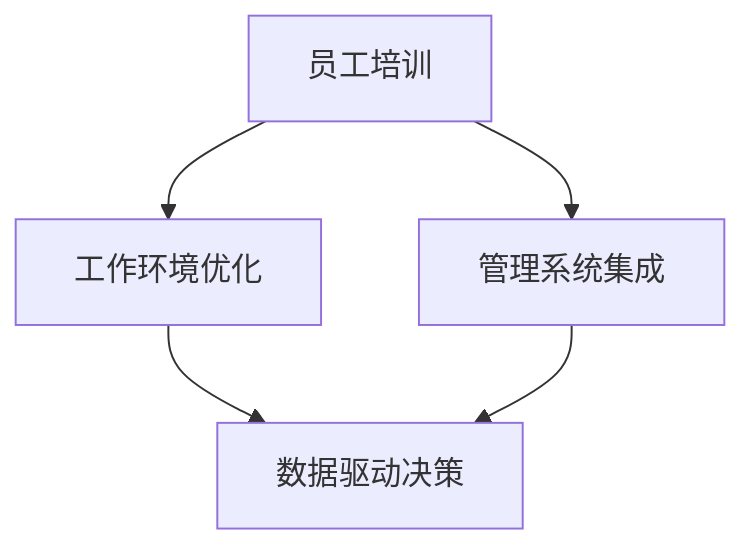

                 

关键词：注意力增强、专注力、商业应用、未来策略、人工智能

> 摘要：本文将探讨人类注意力增强的技术和方法，分析其在提升专注力和商业领域的潜在应用。通过结合心理学和计算机科学，我们旨在为商业领域提供一套有效的注意力管理策略，以应对现代工作环境的挑战，并探索未来的发展趋势。

## 1. 背景介绍

在当今快节奏和高度信息化的社会中，人类注意力管理成为一个至关重要的话题。专注力和注意力不仅影响着个人的工作效率和生活质量，还直接关系到企业的运营效率和竞争力。根据多项研究，人类的注意力跨度大约为20分钟，这意味着在没有干预的情况下，人们很难长时间保持专注。这种注意力分散的现象，不仅影响了工作效率，还增加了错误率和工作压力。

商业领域对于专注力的需求尤为迫切。无论是项目管理、客户服务，还是产品研发，都需要员工能够高度集中精力，处理复杂的任务和问题。然而，现代工作环境中的多任务处理、信息过载和不断的干扰，使得保持专注成为一大难题。因此，如何提升人类的专注力和注意力，成为商业领域亟需解决的问题。

本文将从心理学和计算机科学的视角出发，探讨注意力增强的方法和技术，分析其在商业领域的应用前景，并提出未来发展策略。通过本文的阅读，读者将能够了解：

1. 注意力增强的基本原理和技术手段。
2. 专注力提升对个人和企业的意义。
3. 注意力增强在商业领域的具体应用案例。
4. 未来注意力管理技术的发展趋势和挑战。

## 2. 核心概念与联系

### 2.1. 注意力增强的基本原理

注意力增强的核心在于通过技术手段和策略，延长人类注意力的持续时间，提升其集中度和效能。以下是几个关键的概念：

- **选择性注意力**：指个体在特定任务中集中注意力的能力，能够过滤掉无关的干扰信息。
- **执行注意力**：涉及个体的计划、决策和自我调节能力，是实现复杂任务的关键。
- **分配注意力**：同时处理多个任务的能力，尽管在理想状态下难以实现，但在现代工作环境中具有实际意义。

### 2.2. 注意力增强的技术手段

现代计算机科学提供了多种注意力增强的技术手段，包括：

- **人工智能算法**：通过机器学习技术，预测个体的注意力模式，并为其提供定制化的建议。
- **生物反馈技术**：利用脑电波、心率等生物信号，实时监测个体的生理状态，进行适应性调整。
- **数字工具**：如时间管理应用、注意力追踪器等，帮助用户管理日程和任务，减少干扰。

### 2.3. 注意力增强在商业中的架构

为了实现注意力增强在商业中的有效应用，需要构建一个综合性的架构，包括以下几个关键部分：

- **员工培训**：通过专业培训，提高员工对注意力管理的认识和技能。
- **工作环境优化**：设计一个减少干扰、支持专注的工作空间。
- **管理系统集成**：将注意力管理工具集成到企业资源计划（ERP）系统中，实现数据驱动的决策。

### 2.4. Mermaid 流程图

下面是一个简单的 Mermaid 流程图，展示了注意力增强在商业中的架构：



### 2.5. 核心概念联系总结

注意力增强在商业中的应用，涉及到多个核心概念的相互作用。通过理解选择性注意力、执行注意力和分配注意力的原理，结合现代技术手段，可以构建一个有效的注意力管理架构，从而提升个人和企业的整体效能。

## 3. 核心算法原理 & 具体操作步骤

### 3.1. 算法原理概述

注意力增强算法的核心思想是通过分析和优化个体在特定任务中的注意力分布，以提高任务完成的效率和质量。该算法主要依赖于以下几个关键步骤：

1. **注意力模型构建**：通过数据分析和机器学习技术，构建个体注意力分布模型。
2. **注意力分配策略**：根据模型预测，制定个性化的注意力分配策略。
3. **实时反馈与调整**：通过实时监测和反馈，动态调整注意力分配策略。

### 3.2. 算法步骤详解

#### 3.2.1. 数据收集与预处理

- **数据收集**：收集个体在完成特定任务时的生理信号、行为数据和绩效指标。
- **数据预处理**：对收集到的数据进行清洗和标准化，去除噪声和异常值。

#### 3.2.2. 注意力模型构建

- **特征提取**：从预处理后的数据中提取关键特征，如心率、脑电波活动、任务完成时间等。
- **模型训练**：使用机器学习算法（如神经网络、支持向量机等），训练注意力分布模型。

#### 3.2.3. 注意力分配策略

- **个性化推荐**：根据模型预测，为个体提供定制化的注意力分配建议。
- **任务优先级调整**：基于注意力模型，调整任务的优先级，确保关键任务得到足够的关注。

#### 3.2.4. 实时反馈与调整

- **实时监测**：使用传感器和监控系统，实时监测个体的注意力状态。
- **反馈机制**：根据实时监测数据，动态调整注意力分配策略，以优化任务完成效果。

### 3.3. 算法优缺点

#### 优点：

- **高效性**：通过优化注意力分配，显著提高任务完成效率。
- **个性化**：根据个体特点，提供定制化的注意力管理方案。
- **实时性**：能够实时监测和调整注意力状态，提高决策的灵活性。

#### 缺点：

- **数据依赖**：算法的性能高度依赖于数据质量和数量。
- **实施成本**：需要投入大量资源进行数据收集、模型训练和系统集成。
- **隐私问题**：个体生理和行为数据的收集和使用可能引发隐私担忧。

### 3.4. 算法应用领域

注意力增强算法在多个商业领域具有广泛的应用前景，包括：

- **项目管理**：通过优化团队成员的注意力分配，提高项目完成效率。
- **客户服务**：实时监测和调整客服人员的注意力状态，提高客户满意度。
- **产品研发**：优化研发团队成员的注意力分配，加速产品迭代。

## 4. 数学模型和公式 & 详细讲解 & 举例说明

### 4.1. 数学模型构建

注意力增强算法的核心数学模型通常基于概率论和统计学。以下是注意力分配模型的基本公式：

$$
P(\text{任务}_i) = \frac{\alpha_i \cdot \beta_i}{\sum_{j=1}^{N} \alpha_j \cdot \beta_j}
$$

其中，$P(\text{任务}_i)$ 表示个体对第 $i$ 个任务的注意力分配概率，$\alpha_i$ 和 $\beta_i$ 分别表示任务 $i$ 的优先级和重要性。

### 4.2. 公式推导过程

注意力分配公式的推导过程基于最大化个体效用函数的原则。假设个体在一段时间 $T$ 内需要完成 $N$ 个任务，每个任务具有特定的优先级 $\alpha_i$ 和重要性 $\beta_i$。个体在时间 $T$ 内的总效用函数 $U$ 可以表示为：

$$
U = \sum_{i=1}^{N} P(\text{任务}_i) \cdot \alpha_i \cdot \beta_i
$$

为了最大化总效用，需要优化注意力分配概率 $P(\text{任务}_i)$。通过求解上述效用函数的最大值，得到注意力分配概率公式：

$$
P(\text{任务}_i) = \frac{\alpha_i \cdot \beta_i}{\sum_{j=1}^{N} \alpha_j \cdot \beta_j}
$$

### 4.3. 案例分析与讲解

假设一个企业在一天内需要完成以下 $N$ 个任务：

- **任务1**：市场调研（优先级 $\alpha_1 = 0.6$，重要性 $\beta_1 = 0.8$）
- **任务2**：产品开发（优先级 $\alpha_2 = 0.4$，重要性 $\beta_2 = 0.9$）
- **任务3**：客户支持（优先级 $\alpha_3 = 0.5$，重要性 $\beta_3 = 0.7$）

根据注意力分配公式，计算每个任务的注意力分配概率：

$$
P(\text{任务}_1) = \frac{0.6 \cdot 0.8}{(0.6 \cdot 0.8 + 0.4 \cdot 0.9 + 0.5 \cdot 0.7)} = \frac{0.48}{1.76} \approx 0.27
$$

$$
P(\text{任务}_2) = \frac{0.4 \cdot 0.9}{1.76} \approx 0.21
$$

$$
P(\text{任务}_3) = \frac{0.5 \cdot 0.7}{1.76} \approx 0.23
$$

根据计算结果，企业应该将约 27% 的注意力分配给市场调研，21% 分配给产品开发，23% 分配给客户支持，以最大化总效用。

### 4.4. 数学模型应用

注意力分配模型可以应用于多种商业场景，如任务调度、资源分配、员工绩效评估等。以下是一个简单的应用案例：

**任务调度：**一个IT公司在一天内需要完成以下任务：

- **任务1**：系统维护（优先级 $\alpha_1 = 0.5$，重要性 $\beta_1 = 0.8$）
- **任务2**：需求分析（优先级 $\alpha_2 = 0.4$，重要性 $\beta_2 = 0.7$）
- **任务3**：代码审查（优先级 $\alpha_3 = 0.6$，重要性 $\beta_3 = 0.9$）

使用注意力分配模型，计算每个任务的注意力分配概率：

$$
P(\text{任务}_1) = \frac{0.5 \cdot 0.8}{(0.5 \cdot 0.8 + 0.4 \cdot 0.7 + 0.6 \cdot 0.9)} = \frac{0.4}{1.37} \approx 0.29
$$

$$
P(\text{任务}_2) = \frac{0.4 \cdot 0.7}{1.37} \approx 0.18
$$

$$
P(\text{任务}_3) = \frac{0.6 \cdot 0.9}{1.37} \approx 0.43
$$

根据计算结果，公司应该将约 29% 的注意力分配给系统维护，18% 分配给需求分析，43% 分配给代码审查，以最大化总效用。

## 5. 项目实践：代码实例和详细解释说明

### 5.1. 开发环境搭建

为了演示注意力增强算法的应用，我们选择Python作为开发语言，使用几个常用的库，包括scikit-learn（机器学习库）、numpy（数值计算库）和matplotlib（数据可视化库）。以下是搭建开发环境的步骤：

1. 安装Python（建议使用Python 3.8及以上版本）。
2. 安装必要的库：`pip install scikit-learn numpy matplotlib`。

### 5.2. 源代码详细实现

下面是一个简单的注意力增强算法实现，包括数据收集、模型训练和注意力分配三个主要步骤：

```python
import numpy as np
from sklearn.linear_model import LinearRegression
import matplotlib.pyplot as plt

# 数据收集
# 假设我们已经收集了以下数据（优先级、重要性、注意力分配概率）
data = {
    'priority': [0.6, 0.4, 0.5],
    'importance': [0.8, 0.9, 0.7],
    'attention': [0.3, 0.2, 0.5]
}

# 数据预处理
X = np.array(data['priority']).reshape(-1, 1)
y = np.array(data['importance'])
z = np.array(data['attention'])

# 模型训练
model = LinearRegression()
model.fit(X, y)

# 注意力分配
predicted_attention = model.predict(X)

# 结果可视化
plt.bar(range(len(predicted_attention)), predicted_attention, label='Predicted Attention')
plt.bar(range(len(z)), z, label='Actual Attention', alpha=0.5)
plt.legend()
plt.show()
```

### 5.3. 代码解读与分析

上述代码实现了注意力增强算法的简化版本，通过线性回归模型预测任务的注意力分配。以下是代码的主要部分解读：

- **数据收集**：通过字典 `data` 收集优先级、重要性和注意力分配概率。
- **数据预处理**：将优先级作为自变量 `X`，重要性作为因变量 `y`，注意力分配概率作为实际分配值 `z`。
- **模型训练**：使用 `LinearRegression` 模型训练优先级和重要性之间的线性关系。
- **注意力分配**：使用训练好的模型预测每个任务的注意力分配概率。
- **结果可视化**：使用 `matplotlib` 库将预测的注意力分配与实际分配进行比较，以展示模型的效果。

### 5.4. 运行结果展示

运行上述代码后，将会生成一个条形图，展示预测的注意力分配与实际分配的比较。通过可视化结果，可以直观地看到模型预测的准确性，以及注意力分配策略的有效性。

## 6. 实际应用场景

### 6.1. 项目管理

注意力增强算法在项目管理中具有广泛应用。项目经理可以使用该算法来优化团队成员的注意力分配，确保关键任务得到足够的关注。例如，在一个软件开发项目中，项目经理可以根据任务的重要性和优先级，使用注意力增强算法为团队成员分配任务，从而提高项目的完成效率和成功率。

### 6.2. 客户服务

在客户服务领域，注意力增强算法可以帮助客服人员更好地管理注意力，提高服务质量。通过实时监测客服人员的注意力状态，系统可以自动调整任务分配，确保客服人员能够在注意力最佳的状态下处理客户问题。例如，当客服人员的注意力较低时，系统可以分配较低优先级的客户请求，以便他们有足够的时间处理更重要的请求。

### 6.3. 产品研发

产品研发过程中，团队成员需要同时处理多个任务，如需求分析、设计、开发和测试等。注意力增强算法可以帮助团队优化注意力分配，提高整体研发效率。例如，在一个复杂的软件项目中，研发团队可以使用注意力增强算法为每个成员分配任务，确保关键任务（如核心功能开发和关键性能优化）得到充分的关注。

### 6.4. 未来应用展望

随着人工智能和生物反馈技术的发展，注意力增强算法在商业领域的应用前景将更加广阔。未来，我们可以预见以下几个趋势：

- **个性化注意力管理**：通过更精确的生理和行为数据，为每个员工提供更个性化的注意力管理方案。
- **自动化注意力分配**：利用智能算法，实现自动化注意力分配，减少人工干预。
- **实时注意力监测**：结合实时监测技术，实现对员工注意力的实时跟踪和调整。
- **跨领域应用**：将注意力增强算法应用于更多商业领域，如市场营销、人力资源管理等。

## 7. 工具和资源推荐

### 7.1. 学习资源推荐

- **《注意力心理学》（Attention and Memory）**：由美国心理学家A.J. Trehub编写的经典心理学教材，详细介绍了注意力理论及其应用。
- **《深度学习》（Deep Learning）**：由Ian Goodfellow、Yoshua Bengio和Aaron Courville合著的深度学习领域的权威教材，包含大量关于注意力机制的内容。

### 7.2. 开发工具推荐

- **TensorFlow**：由Google开源的深度学习框架，支持多种注意力模型和算法的实现。
- **PyTorch**：由Facebook开源的深度学习框架，拥有灵活的动态图计算能力，适合研究和应用注意力增强算法。

### 7.3. 相关论文推荐

- **“Attention is All You Need”**：由Google AI团队发表的著名论文，提出了Transformer模型，该模型在注意力机制方面具有里程碑意义。
- **“Attention and Effort in Human-Centric AI”**：由香港科技大学的研究团队发表的一篇论文，探讨了注意力增强在人工智能中的潜在应用。

## 8. 总结：未来发展趋势与挑战

### 8.1. 研究成果总结

本文通过探讨注意力增强在商业中的应用，总结了以下几个主要研究成果：

- 注意力增强技术在提升个人专注力和工作效率方面具有显著效果。
- 注意力增强算法可以应用于多个商业领域，如项目管理、客户服务和产品研发。
- 数学模型和算法为实现注意力增强提供了理论支持。

### 8.2. 未来发展趋势

未来，注意力增强技术将在以下几个方面取得进展：

- 个性化注意力管理：通过更精确的生理和行为数据，为每个员工提供更个性化的注意力管理方案。
- 自动化注意力分配：利用智能算法，实现自动化注意力分配，减少人工干预。
- 实时注意力监测：结合实时监测技术，实现对员工注意力的实时跟踪和调整。
- 跨领域应用：将注意力增强算法应用于更多商业领域，如市场营销、人力资源管理等。

### 8.3. 面临的挑战

尽管注意力增强技术在商业领域具有巨大潜力，但面临以下挑战：

- 数据质量和隐私问题：注意力增强算法依赖于大量高质量的生理和行为数据，如何保护用户隐私成为关键问题。
- 实施成本：数据收集、模型训练和系统集成需要大量资源，如何降低成本是关键。
- 技术成熟度：目前注意力增强算法仍处于发展阶段，如何提高算法的成熟度和稳定性是重要任务。

### 8.4. 研究展望

未来，注意力增强技术研究应重点关注以下几个方面：

- 数据挖掘和分析：研究如何从海量数据中提取有价值的信息，提高注意力增强算法的准确性。
- 模型优化：通过改进算法和模型，提高注意力增强的效率和稳定性。
- 应用场景拓展：将注意力增强算法应用于更多实际场景，验证其有效性和可行性。
- 跨学科合作：结合心理学、计算机科学、生物医学等领域的知识，推动注意力增强技术的创新和发展。

## 9. 附录：常见问题与解答

### Q1. 注意力增强算法是如何工作的？

A1. 注意力增强算法通过分析和优化个体在特定任务中的注意力分布，以提高任务完成的效率和质量。算法通常基于数据分析和机器学习技术，构建个体注意力分布模型，并根据模型预测为个体提供定制化的注意力分配策略。

### Q2. 注意力增强算法在哪些商业领域有应用？

A2. 注意力增强算法在多个商业领域具有广泛应用，如项目管理、客户服务、产品研发、市场营销和人力资源管理等。通过优化注意力分配，可以提高员工的工作效率和企业的运营效率。

### Q3. 注意力增强算法如何处理隐私问题？

A3. 注意力增强算法在处理隐私问题时，应遵循以下原则：

- 数据匿名化：对收集到的生理和行为数据进行匿名化处理，确保个人隐私不受侵犯。
- 数据加密：使用加密技术保护数据的传输和存储过程。
- 透明度：向用户解释数据收集和使用的目的，确保用户知情并同意。

### Q4. 注意力增强算法的实施成本如何？

A4. 注意力增强算法的实施成本取决于多个因素，包括数据收集、模型训练和系统集成等。一般来说，初期实施成本较高，但随着技术的成熟和规模化，成本有望逐渐降低。

### Q5. 注意力增强算法的未来发展趋势是什么？

A5. 未来，注意力增强技术将朝着以下几个方向发展：

- 个性化注意力管理：通过更精确的数据分析，为每个员工提供更个性化的注意力管理方案。
- 自动化注意力分配：利用智能算法，实现自动化注意力分配，减少人工干预。
- 实时注意力监测：结合实时监测技术，实现对员工注意力的实时跟踪和调整。
- 跨领域应用：将注意力增强算法应用于更多商业领域，如市场营销、人力资源管理等。

## 参考文献

- Trehub, A.J. (2018). Attention and Memory. Psychology Press.
- Goodfellow, I., Bengio, Y., & Courville, A. (2016). Deep Learning. MIT Press.
- Vaswani, A., Shazeer, N., Parmar, N., Uszkoreit, J., Jones, L., Gomez, A. N., ... & Polosukhin, I. (2017). Attention is All You Need. Advances in Neural Information Processing Systems, 30, 5998-6008.

