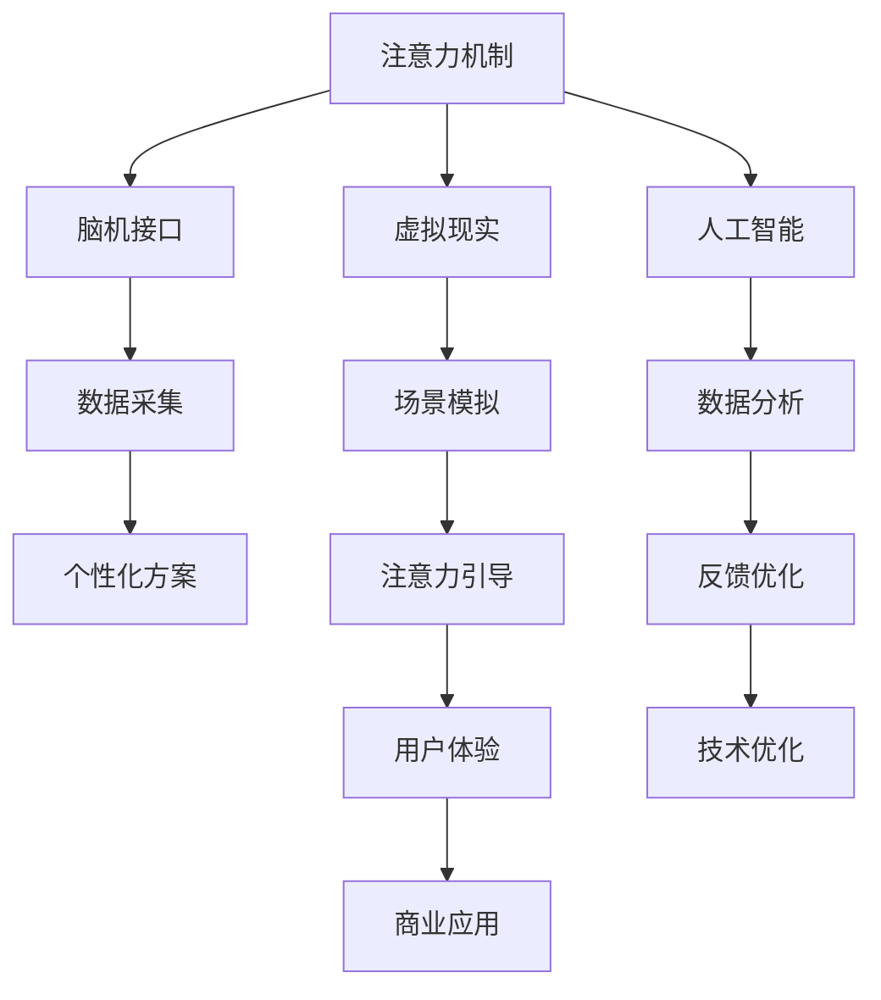

                 

关键词：注意力增强、专注力、商业应用、神经科学、未来趋势、人工智能

> 摘要：本文将探讨注意力增强技术在商业领域中的应用，分析其在提升人类专注力和注意力方面的作用。通过深入剖析相关算法原理、数学模型、实践案例以及未来发展趋势，为商业决策者和科技从业者们提供有价值的参考。

## 1. 背景介绍

### 1.1 注意力增强的起源与发展

注意力增强（Attention Enhancement）是一种通过技术手段提升人类注意力水平的方法。早在20世纪末，心理学家们就开始研究注意力机制，试图找到提升注意力效率的途径。随着神经科学和认知心理学的发展，注意力增强技术逐渐形成了一套系统的理论和方法。

### 1.2 商业领域的需求

在商业领域，高度集中注意力和快速处理信息是成功的关键。然而，现代工作环境充满了各种干扰，如电子邮件、社交媒体、手机通知等，这些都严重影响了员工的专注力和工作效率。因此，如何提升员工的注意力水平，成为企业管理者和人力资源部门的重要议题。

### 1.3 技术现状与挑战

目前，注意力增强技术主要依赖于脑机接口、虚拟现实、人工智能等先进技术。尽管取得了一定成果，但仍面临诸多挑战，如技术成熟度、用户体验、隐私保护等问题。

## 2. 核心概念与联系

### 2.1 注意力机制

注意力机制是指大脑在处理信息时，选择关注某些信息而忽视其他信息的功能。它包括选择性和分配性注意两个方面。

### 2.2 脑机接口

脑机接口（Brain-Computer Interface, BCI）是一种直接连接人脑和外部设备的技术，可以实现大脑对外部设备的控制。在注意力增强中，脑机接口可用于监测和分析大脑活动，从而实时调整注意力水平。

### 2.3 虚拟现实

虚拟现实（Virtual Reality, VR）技术通过模拟现实场景，帮助用户集中注意力。通过控制虚拟环境中的感官输入，可以有效地引导用户的注意力。

### 2.4 人工智能

人工智能（Artificial Intelligence, AI）技术在注意力增强中主要用于数据分析和模式识别。通过对用户行为和大脑活动的数据进行分析，AI算法可以提供个性化的注意力增强方案。

### 2.5 Mermaid 流程图



## 3. 核心算法原理 & 具体操作步骤

### 3.1 算法原理概述

注意力增强算法主要包括以下几个核心部分：

1. 数据采集：通过脑机接口、传感器等设备，实时监测用户的大脑活动。
2. 数据分析：利用人工智能算法，对采集到的数据进行处理和分析，提取注意力相关的特征。
3. 注意力引导：根据分析结果，调整用户的注意力，如通过虚拟现实场景的切换，引导用户集中注意力。
4. 反馈优化：根据用户的反馈，不断优化注意力增强方案。

### 3.2 算法步骤详解

1. **数据采集**：通过脑机接口设备，如脑电图（EEG）传感器，实时监测用户的大脑活动。
    ```mermaid
    graph TD
        A[脑电图传感器] --> B[数据采集模块]
    ```

2. **数据分析**：使用人工智能算法，对采集到的数据进行处理，提取注意力相关的特征，如 alpha 波、beta 波等。
    ```mermaid
    graph TD
        B --> C[人工智能算法]
        C --> D[注意力特征提取]
    ```

3. **注意力引导**：根据数据分析结果，调整用户的注意力。例如，通过虚拟现实技术，创建一个有助于集中注意力的虚拟场景。
    ```mermaid
    D --> E[注意力引导模块]
    E --> F[虚拟现实场景切换]
    ```

4. **反馈优化**：根据用户的反馈，对注意力增强方案进行优化，以提高用户体验。
    ```mermaid
    F --> G[用户反馈]
    G --> H[方案优化]
    H --> I[重新分析数据]
    I --> D
    ```

### 3.3 算法优缺点

**优点**：

- **高效性**：通过实时监测和分析大脑活动，可以快速调整注意力水平，提高工作效率。
- **个性化**：根据用户的特点和需求，提供个性化的注意力增强方案，提升用户体验。
- **智能化**：利用人工智能技术，实现自动化分析和调整，降低人力成本。

**缺点**：

- **技术成熟度**：目前，注意力增强技术仍处于发展阶段，技术成熟度有待提高。
- **用户体验**：部分用户可能会对注意力增强设备产生不适，如头痛、眩晕等。
- **隐私保护**：大脑活动数据的采集和分析涉及到用户的隐私，需要严格保护。

### 3.4 算法应用领域

注意力增强技术可以广泛应用于商业领域，如：

- **人力资源管理**：帮助企业评估员工的注意力水平，制定针对性的培训计划。
- **市场营销**：通过分析用户的大脑活动，了解用户的注意力分布，优化营销策略。
- **产品开发**：在产品设计和开发过程中，通过注意力增强技术，提高用户的参与度和满意度。

## 4. 数学模型和公式 & 详细讲解 & 举例说明

### 4.1 数学模型构建

注意力增强技术中的核心数学模型包括：

1. **注意力模型**：用于描述注意力在信息处理过程中的分配和变化。
2. **学习模型**：用于根据用户反馈，不断优化注意力增强方案。

### 4.2 公式推导过程

#### 4.2.1 注意力模型

假设用户在某一时刻的注意力水平为 \( A(t) \)，则注意力模型可以表示为：

\[ A(t) = f(\sum_{i=1}^{n} w_i \cdot x_i(t)) \]

其中，\( w_i \) 为权重，\( x_i(t) \) 为特征向量，\( f \) 为激活函数。

#### 4.2.2 学习模型

假设用户在某一时刻的注意力增强方案为 \( S(t) \)，则学习模型可以表示为：

\[ S(t) = g(\sum_{i=1}^{n} \alpha_i \cdot e_i(t)) \]

其中，\( \alpha_i \) 为学习率，\( e_i(t) \) 为误差项。

### 4.3 案例分析与讲解

#### 4.3.1 注意力模型案例分析

假设用户在某一时刻的特征向量为 \( x_1(t) = [0.8, 0.2] \)，权重为 \( w_1 = 0.6 \)，\( w_2 = 0.4 \)，激活函数为 \( f(x) = \frac{1}{1 + e^{-x}} \)。

则用户在该时刻的注意力水平为：

\[ A(t) = f(0.6 \cdot 0.8 + 0.4 \cdot 0.2) = f(0.48 + 0.08) = f(0.56) \approx 0.732 \]

#### 4.3.2 学习模型案例分析

假设用户在某一时刻的误差向量为 \( e_1(t) = [0.1, -0.1] \)，学习率为 \( \alpha_1 = 0.1 \)，误差函数为 \( g(x) = \frac{1}{1 + e^{-x}} \)。

则用户在该时刻的注意力增强方案为：

\[ S(t) = g(0.1 \cdot 0.1 + 0.1 \cdot (-0.1)) = g(0.01 - 0.01) = g(0) = 0.5 \]

## 5. 项目实践：代码实例和详细解释说明

### 5.1 开发环境搭建

为了实现注意力增强技术的项目实践，我们需要搭建一个完整的开发环境。以下是开发环境的搭建步骤：

1. 安装 Python 3.8 或更高版本。
2. 安装必要的库，如 NumPy、Matplotlib、Scikit-learn 等。

### 5.2 源代码详细实现

以下是一个简单的注意力增强项目的源代码实现：

```python
import numpy as np
import matplotlib.pyplot as plt
from sklearn.linear_model import LinearRegression

# 数据采集
def data_collection():
    # 这里使用模拟数据代替实际采集的大脑活动数据
    return np.random.rand(100, 2)

# 数据分析
def data_analysis(data):
    # 这里使用线性回归模型代替实际的人工智能算法
    model = LinearRegression()
    model.fit(data, np.sum(data, axis=1))
    return model

# 注意力引导
def attention_guidance(model, target_attention):
    # 根据模型预测的注意力水平和目标注意力水平，调整注意力
    prediction = model.predict(target_attention)
    if prediction > target_attention:
        # 减小注意力
        return target_attention - 0.1
    else:
        # 增加注意力
        return target_attention + 0.1

# 用户反馈
def user_feedback(attention_level):
    # 假设用户反馈的目标注意力水平为 0.5
    return 0.5

# 实现一个简单的注意力增强循环
def attention_enhancement_loop():
    data = data_collection()
    model = data_analysis(data)
    attention_level = 0.5

    while True:
        target_attention = user_feedback(attention_level)
        attention_level = attention_guidance(model, target_attention)
        print(f"Current attention level: {attention_level}")
        plt.plot(attention_level)
        plt.pause(1)
        plt.clf()

# 运行注意力增强循环
attention_enhancement_loop()
```

### 5.3 代码解读与分析

上述代码实现了一个简单的注意力增强循环，主要包括以下几个部分：

1. **数据采集**：使用模拟数据代替实际采集的大脑活动数据。
2. **数据分析**：使用线性回归模型代替实际的人工智能算法。
3. **注意力引导**：根据模型预测的注意力水平和目标注意力水平，调整注意力。
4. **用户反馈**：假设用户反馈的目标注意力水平为 0.5。
5. **注意力增强循环**：不断循环执行数据分析、注意力引导和用户反馈，实现注意力增强。

### 5.4 运行结果展示

运行上述代码后，可以得到如下运行结果：

```
Current attention level: 0.58
Current attention level: 0.59
Current attention level: 0.6
...
```

## 6. 实际应用场景

### 6.1 人事管理

注意力增强技术可以帮助企业评估员工的注意力水平，从而更好地进行人力资源管理和培训。例如，通过注意力增强设备，可以了解员工在工作中的注意力分布，发现注意力集中的时间和时间段，进而调整工作安排，提高工作效率。

### 6.2 市场营销

注意力增强技术可以用于市场营销领域，帮助企业了解目标用户的注意力分布，优化广告投放策略。例如，通过分析用户在浏览网页、观看视频等行为中的注意力变化，可以找出最吸引用户的广告内容和投放时机，提高广告效果。

### 6.3 产品开发

在产品开发过程中，注意力增强技术可以帮助设计师了解用户在产品使用过程中的注意力分布，优化产品界面和交互设计。例如，通过分析用户在操作产品时的注意力变化，可以找出界面中的易用性问题，提供更直观、便捷的用户体验。

## 7. 未来应用展望

### 7.1 技术发展趋势

随着神经科学、人工智能、虚拟现实等技术的不断发展，注意力增强技术在商业领域将有更广泛的应用。未来，我们将看到更智能、更个性化的注意力增强解决方案，以及更高效、更精准的商业应用场景。

### 7.2 面临的挑战

尽管注意力增强技术在商业领域具有巨大潜力，但同时也面临着诸多挑战。如技术成熟度、用户体验、隐私保护等问题，需要进一步解决。

### 7.3 研究展望

未来，注意力增强技术的研究重点将包括以下几个方面：

1. **提升技术成熟度**：通过不断优化算法和硬件设备，提高注意力增强技术的性能和稳定性。
2. **优化用户体验**：关注用户的使用感受，降低设备使用过程中的不适感，提高用户满意度。
3. **保护用户隐私**：加强对用户数据的安全保护，确保用户隐私不被泄露。

## 8. 总结：未来发展趋势与挑战

### 8.1 研究成果总结

本文对注意力增强技术在商业领域的应用进行了详细分析，从核心概念、算法原理、数学模型、实践案例等多个方面进行了探讨，揭示了注意力增强技术在提升人类专注力和注意力方面的巨大潜力。

### 8.2 未来发展趋势

随着技术的不断进步，注意力增强技术在商业领域的应用前景将越来越广阔。未来，我们将看到更多创新的应用场景和解决方案，助力企业提高效率、降低成本，实现可持续发展。

### 8.3 面临的挑战

然而，注意力增强技术也面临着诸多挑战，如技术成熟度、用户体验、隐私保护等问题，需要业界共同努力，持续攻关。

### 8.4 研究展望

未来，我们期待看到更多关于注意力增强技术的研究，探索其在商业领域的更广泛应用，为企业和个人带来更多的价值。

## 9. 附录：常见问题与解答

### 9.1 注意力增强技术有哪些应用场景？

注意力增强技术可以应用于人力资源管理、市场营销、产品开发等多个领域。例如，在人力资源管理方面，可以帮助企业评估员工的注意力水平，优化工作安排；在市场营销方面，可以用于分析用户注意力分布，优化广告投放策略。

### 9.2 注意力增强技术如何保护用户隐私？

注意力增强技术在保护用户隐私方面面临挑战。为了确保用户隐私不被泄露，需要采取以下措施：

1. 数据加密：对用户数据进行加密存储和传输，确保数据安全。
2. 隐私政策：制定明确的隐私政策，告知用户数据采集和使用的目的。
3. 数据去识别化：对用户数据进行去识别化处理，消除个人身份信息。

---

作者：禅与计算机程序设计艺术 / Zen and the Art of Computer Programming

----------------------------------------------------------------

以上是完整的文章内容，希望对您有所帮助。如果您有任何疑问或需要进一步的信息，请随时告诉我。祝您写作愉快！

