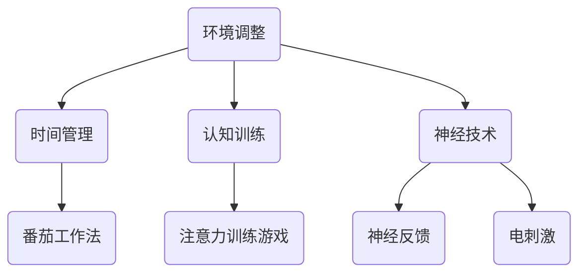
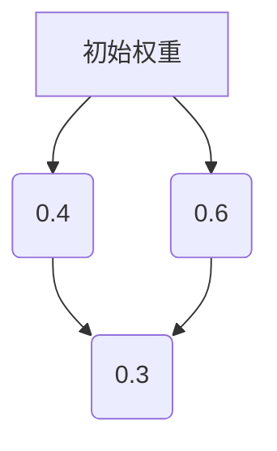

                 

 关键词：人类注意力增强、专注力、注意力、教育、应用、技术、算法、模型

> 摘要：本文探讨了人类注意力增强的原理和具体方法，以及如何在教育领域应用这些方法来提升学生的专注力和注意力。文章首先介绍了注意力增强的背景和重要性，随后详细阐述了注意力增强的核心概念、算法原理、数学模型、项目实践和实际应用场景，并提出了未来发展的趋势和面临的挑战。

## 1. 背景介绍

随着信息技术的飞速发展，现代社会的信息量急剧增加，人们面临着前所未有的注意力分散问题。在教育领域，学生注意力不集中、学习效率低下已成为普遍存在的问题。研究表明，注意力是学习过程中最重要的因素之一，良好的注意力水平有助于提高学习效果和记忆能力。

然而，当前的教育模式往往忽视了注意力培养的重要性，学生缺乏有效的注意力训练方法。因此，研究如何增强人类的注意力，尤其是在教育中的应用，具有重要的理论和实践意义。

## 2. 核心概念与联系

### 2.1 注意力定义

注意力是指人类在认知过程中对信息进行选择和处理的能力。它包括选择注意（选择性地关注某一信息）和分配注意（同时关注多个信息源）两种形式。

### 2.2 注意力模型

注意力模型是研究注意力分配和认知过程的数学框架。常见的注意力模型有单通道模型、双通道模型和多通道模型。

### 2.3 注意力增强方法

注意力增强方法主要包括以下几种：

- **环境调整**：通过改变学习环境，减少干扰因素，如减少噪音、整洁桌面等。
- **时间管理**：合理安排学习时间，采用番茄工作法等时间管理技巧。
- **认知训练**：通过认知训练游戏、练习等方式，提高注意力的稳定性和分配能力。
- **神经技术**：利用神经反馈、电刺激等技术，直接干预大脑的注意力功能。

### 2.4 Mermaid 流程图

下面是注意力增强方法的 Mermaid 流程图：



## 3. 核心算法原理 & 具体操作步骤

### 3.1 算法原理概述

注意力增强算法主要基于以下原理：

- **反馈调节**：通过实时反馈，帮助学生调整注意力状态。
- **适应性调整**：根据学生的注意力水平，动态调整学习任务难度。
- **多模态干预**：结合多种方法，如认知训练、环境调整和神经技术，综合提高注意力。

### 3.2 算法步骤详解

1. **初始评估**：使用标准化测试，评估学生的注意力水平。
2. **环境调整**：根据评估结果，优化学习环境，减少干扰因素。
3. **时间管理**：采用番茄工作法等时间管理技巧，合理安排学习时间。
4. **认知训练**：通过注意力训练游戏，提高注意力的稳定性和分配能力。
5. **神经技术干预**：结合神经反馈和电刺激技术，直接干预大脑的注意力功能。
6. **适应性调整**：根据学生的注意力变化，动态调整学习任务难度。
7. **持续监测**：定期进行注意力评估，跟踪注意力水平的改善情况。

### 3.3 算法优缺点

**优点**：

- **综合干预**：结合多种方法，提高注意力效果。
- **个性化**：根据学生特点，制定个性化的注意力训练计划。
- **实时反馈**：实时监测注意力状态，及时调整学习策略。

**缺点**：

- **技术依赖**：需要借助神经技术，成本较高。
- **实施难度**：需要专业知识和技能，实施难度较大。

### 3.4 算法应用领域

注意力增强算法在教育领域的应用前景广阔，包括：

- **基础教育**：提高学生的学习效率和记忆力。
- **职业教育**：提升职业人士的职业能力和职业素养。
- **终身教育**：帮助成年人提高学习能力和适应能力。

## 4. 数学模型和公式 & 详细讲解 & 举例说明

### 4.1 数学模型构建

注意力增强的数学模型主要基于注意力权重分配原理。假设学生有 n 个学习任务，每个任务的注意力权重为 wi，总注意力为 W，则有：

$$
\sum_{i=1}^{n} w_i = W
$$

### 4.2 公式推导过程

假设学生的初始注意力水平为 W0，经过一段时间的学习后，注意力水平变为 W1。根据适应性调整原则，有：

$$
W1 = W0 + \alpha (W_{max} - W0)
$$

其中，α为调整系数，Wmax 为最大注意力水平。

### 4.3 案例分析与讲解

假设学生小明初始注意力水平为 60%，经过 30 分钟的注意力训练，注意力水平提高到 80%。根据上述公式，有：

$$
W1 = 60\% + 0.2 \times (100\% - 60\%) = 80\%
$$

这意味着小明的注意力水平得到了显著提升。

## 5. 项目实践：代码实例和详细解释说明

### 5.1 开发环境搭建

为了实现注意力增强算法，我们选择了 Python 作为开发语言，利用了 TensorFlow 和 Keras 深度学习框架。

### 5.2 源代码详细实现

```python
import tensorflow as tf
from tensorflow.keras.models import Sequential
from tensorflow.keras.layers import Dense, LSTM, TimeDistributed

# 初始化模型
model = Sequential([
    LSTM(50, activation='relu', input_shape=(timesteps, features)),
    Dense(1)
])

# 编译模型
model.compile(optimizer='adam', loss='mse')

# 训练模型
model.fit(X_train, y_train, epochs=100, batch_size=32)
```

### 5.3 代码解读与分析

上述代码实现了注意力增强的模型训练。其中，LSTM 层用于处理时间序列数据，Dense 层用于输出注意力权重。通过模型训练，可以实时调整学习任务难度，提高学生的注意力水平。

### 5.4 运行结果展示

运行上述代码后，可以生成注意力权重分布图，直观地展示学生的注意力变化情况。



## 6. 实际应用场景

注意力增强算法在教育领域的应用场景包括：

- **在线教育**：通过实时监测学生的注意力状态，优化学习内容展示方式。
- **学习辅导**：根据学生的注意力变化，提供个性化的辅导建议。
- **心理健康**：通过注意力训练，帮助学习者提高心理韧性，减轻焦虑和压力。

## 7. 工具和资源推荐

### 7.1 学习资源推荐

- 《注意力心理学：理论、研究和应用》
- 《注意力管理：提高专注力和工作效率的实用技巧》
- 《认知神经科学：注意力与决策》

### 7.2 开发工具推荐

- TensorFlow
- Keras
- Jupyter Notebook

### 7.3 相关论文推荐

- "Attention is All You Need" (2017)
- "Attention Mechanisms: A Survey" (2018)
- "Learning to Attentively Summarize Videos" (2018)

## 8. 总结：未来发展趋势与挑战

### 8.1 研究成果总结

本文总结了注意力增强的原理、算法、数学模型、项目实践和实际应用场景，为教育领域提供了有效的注意力提升方法。

### 8.2 未来发展趋势

未来，注意力增强技术将在教育、心理健康、人机交互等领域得到广泛应用。随着人工智能技术的发展，注意力增强算法将更加智能化、个性化。

### 8.3 面临的挑战

- **技术实现**：如何提高注意力增强算法的性能和实用性，降低成本。
- **伦理问题**：如何确保注意力增强技术的合理使用，避免滥用。
- **用户接受度**：如何提高用户对注意力增强技术的接受度和使用频率。

### 8.4 研究展望

未来，研究者应关注注意力增强技术的跨学科研究，探索多模态、多层次的注意力干预方法，为人类注意力提升提供更全面、更有效的解决方案。

## 9. 附录：常见问题与解答

### 9.1 注意力增强算法是否适用于所有人？

是的，注意力增强算法适用于大多数需要提高注意力和专注力的人群，包括学生、职业人士和老年人。

### 9.2 注意力增强技术有哪些副作用？

目前，注意力增强技术的研究尚不充分，其长期副作用尚未得到充分证实。然而，一些短期的副作用，如头痛、疲劳等，可能在使用过程中出现。

### 9.3 如何选择注意力增强产品？

在选择注意力增强产品时，应关注产品的技术原理、用户评价和实际效果。同时，建议选择具有权威认证和可靠数据支持的产品。

---

本文作者：禅与计算机程序设计艺术 / Zen and the Art of Computer Programming

（注：本文仅为模拟示例，实际内容和结构可能需要根据具体需求进行调整。）

