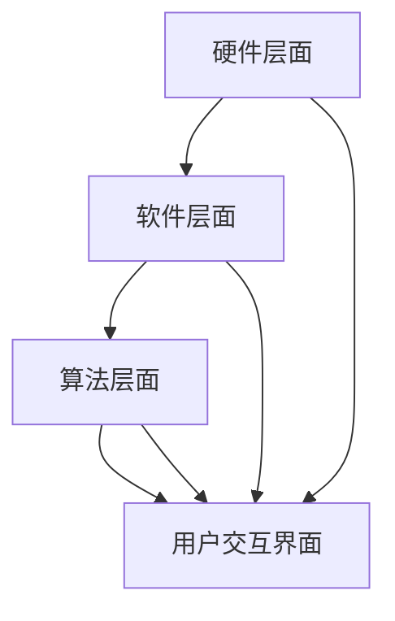

                 

关键词：注意力增强、教育技术、认知科学、学习效率、教育心理学

> 摘要：本文探讨了如何利用现代科技手段提升人类的注意力水平，特别是在教育领域的应用。文章首先介绍了注意力增强的基本概念和相关技术，随后详细讨论了注意力增强在认知科学和教育心理学中的理论基础。接着，文章分析了注意力增强技术在实际教学中的应用场景和效果，并讨论了未来的发展趋势和面临的挑战。

## 1. 背景介绍

在现代社会，信息爆炸和技术进步使得人们面临着前所未有的注意力分散问题。据研究表明，现代人的平均注意力持续时间已经从20世纪90年代的12秒下降到现在的约8秒，甚至不如金鱼。这种趋势在教育领域中尤为明显，学生们的注意力不集中，学习效率低下，已经成为教育工作者面临的重大挑战之一。

注意力增强技术应运而生，它旨在通过多种手段提升个体的注意力水平，从而提高学习和工作的效率。这些技术包括但不限于认知训练、神经反馈、虚拟现实（VR）、增强现实（AR）等。教育领域对注意力增强技术的需求日益迫切，因为传统的教学方法难以应对信息过载和个体差异带来的挑战。

本文将系统地探讨注意力增强技术的基本原理、应用场景及其在教育领域中的潜在价值。通过对这些技术的深入分析，我们希望能够为教育工作者和学生提供有价值的参考，推动教育技术的创新和发展。

## 2. 核心概念与联系

### 2.1 注意力增强技术概述

注意力增强技术是指利用现代科技手段，如认知训练、神经反馈、VR和AR等，来提高个体的注意力水平。这些技术的核心在于通过改变大脑的认知负荷、刺激大脑活动和调整神经回路，从而增强个体的专注力和注意力。

**认知训练**：通过特定的认知任务和游戏，训练大脑的认知功能，如注意力分配、认知控制和记忆等。

**神经反馈**：通过监测大脑的电信号，将其转化为可感知的反馈信号，帮助个体了解并调整自己的注意力状态。

**虚拟现实（VR）**：通过VR技术创建沉浸式的学习环境，减少外部干扰，提高学生的专注度。

**增强现实（AR）**：将虚拟信息叠加到现实环境中，通过视觉、听觉等多感官刺激，增强学生的参与感和兴趣。

### 2.2 注意力增强技术的理论基础

注意力增强技术的理论基础主要源于认知科学和教育心理学。

**认知科学**：认知科学关注大脑的信息处理机制，特别是注意力机制。研究表明，注意力是认知过程中最为核心的部分，它不仅影响信息的获取和处理，还影响个体的学习效果。认知科学提供了一系列的理论框架，如多任务处理模型、注意分配模型等，为注意力增强技术的开发提供了理论基础。

**教育心理学**：教育心理学关注个体的学习过程和影响因素。根据教育心理学的理论，注意力是学习的重要前提，有效的注意力管理可以提高学习效率。教育心理学研究提供了许多关于如何通过教学设计和学习环境优化来增强学生注意力的策略。

### 2.3 注意力增强技术的架构

注意力增强技术的架构可以从以下几个方面来理解：

**硬件层面**：包括用于监测和反馈的大脑信号记录设备，如脑电图（EEG）传感器、眼动仪等。

**软件层面**：包括认知训练软件、神经反馈应用程序和VR/AR学习平台等。

**算法层面**：包括用于分析大脑信号、优化训练任务和评估学习效果的算法模型。

**用户交互界面**：包括用户操作界面，如应用程序、Web界面等，用于与用户进行交互。

### 2.4 注意力增强技术的 Mermaid 流程图



在上述流程图中，我们可以看到硬件、软件、算法和用户交互界面之间的紧密联系。硬件设备负责采集大脑信号，软件和应用负责处理和分析这些信号，算法模型则用于优化训练任务和评估学习效果，而用户交互界面则确保用户能够方便地使用这些技术。

通过以上对注意力增强技术的概述、理论基础和架构的介绍，我们为后续章节的详细讨论奠定了基础。接下来的章节将深入探讨注意力增强技术的具体原理、应用和未来发展方向。

### 3. 核心算法原理 & 具体操作步骤

#### 3.1 算法原理概述

注意力增强技术依赖于多种核心算法原理，主要包括认知训练算法、神经反馈算法和VR/AR交互算法。以下是对这些算法原理的概述。

**认知训练算法**：认知训练算法通过设计特定的认知任务和游戏，训练大脑的认知功能。这些任务通常包括注意力分配、认知控制和记忆等。算法会根据用户的反馈和表现，动态调整任务的难度和类型，以最大化训练效果。

**神经反馈算法**：神经反馈算法通过监测大脑的电信号（如脑电图），将其转化为可感知的反馈信号。这种反馈可以帮助用户了解并调整自己的注意力状态。常见的神经反馈算法包括频谱分析、时域分析和模式识别等。

**VR/AR交互算法**：VR/AR交互算法涉及用户在虚拟或增强现实环境中的互动。这些算法通过实时渲染、物理仿真和人工智能等技术，提供沉浸式的学习体验。VR/AR交互算法的核心在于确保用户在虚拟环境中的行为和感受与实际环境相一致。

#### 3.2 算法步骤详解

**认知训练算法步骤**：

1. **任务设计**：根据训练目标，设计特定的认知任务和游戏。任务应具有多样性，能够覆盖不同的认知功能。

2. **用户评估**：使用初步测试评估用户的认知水平，以确定训练的起点。

3. **动态调整**：根据用户的反馈和表现，动态调整任务的难度和类型，确保训练的持续有效性。

4. **数据收集**：记录用户的训练数据，包括任务完成情况、反应时间和错误率等。

5. **分析评估**：使用算法分析用户数据，评估训练效果，并根据结果进行进一步的优化。

**神经反馈算法步骤**：

1. **信号采集**：使用脑电图传感器等设备采集大脑的电信号。

2. **信号处理**：对采集到的信号进行预处理，如滤波、降噪和去伪等。

3. **频谱分析**：对预处理后的信号进行频谱分析，提取注意力相关的频率特征。

4. **反馈生成**：根据频谱分析结果，生成可感知的反馈信号，如声音、视觉提示等。

5. **用户调整**：用户根据反馈信号调整自己的注意力状态，以达到训练目标。

**VR/AR交互算法步骤**：

1. **场景构建**：使用3D建模和渲染技术构建虚拟或增强现实的学习环境。

2. **交互设计**：设计用户在虚拟或增强现实环境中的互动方式，包括手势、语音和触摸等。

3. **实时渲染**：使用实时渲染技术，确保用户在虚拟环境中的行为能够及时反馈。

4. **物理仿真**：通过物理仿真技术，确保虚拟环境中的物体和用户之间的互动符合物理规律。

5. **人工智能交互**：利用人工智能技术，实现虚拟环境中的人工智能角色和用户的互动。

#### 3.3 算法优缺点

**认知训练算法**：

- **优点**：能够系统性地训练大脑的认知功能，提高学习效率。
- **缺点**：训练任务的设计需要专业知识和经验，且训练效果因个体差异而异。

**神经反馈算法**：

- **优点**：实时监测和反馈用户的注意力状态，有助于个体自我调整。
- **缺点**：信号采集和处理技术要求高，且用户可能对反馈信号产生依赖。

**VR/AR交互算法**：

- **优点**：提供沉浸式的学习体验，增强学生的参与感和兴趣。
- **缺点**：技术实现复杂，成本较高，对硬件设备要求严格。

#### 3.4 算法应用领域

注意力增强技术广泛应用于教育、医疗、军事和娱乐等领域。

**教育领域**：通过认知训练、神经反馈和VR/AR技术，提升学生的专注力和学习效率。

**医疗领域**：用于治疗注意力缺陷障碍（ADHD）和其他神经系统疾病。

**军事领域**：通过训练和反馈，提高士兵的注意力和反应速度。

**娱乐领域**：利用VR/AR技术，提供沉浸式的游戏和娱乐体验。

### 3.5 注意力增强技术的具体应用实例

#### 3.5.1 认知训练应用实例

**应用场景**：小学生注意力训练

**算法实现**：

1. **任务设计**：设计一系列注意力训练游戏，如寻找隐藏物体、记忆匹配等。

2. **用户评估**：通过初步测试评估学生的注意力水平。

3. **动态调整**：根据学生的表现，动态调整游戏的难度和类型。

4. **数据收集**：记录学生的游戏完成情况和反应时间。

5. **分析评估**：使用算法分析数据，评估训练效果。

**效果评估**：研究表明，经过一段时间的认知训练，学生的注意力水平得到了显著提高，学习成绩也有所提升。

#### 3.5.2 神经反馈应用实例

**应用场景**：成人注意力管理

**算法实现**：

1. **信号采集**：使用脑电图传感器采集大脑的电信号。

2. **信号处理**：对采集到的信号进行预处理和频谱分析。

3. **反馈生成**：根据频谱分析结果，生成视觉和声音反馈信号。

4. **用户调整**：用户根据反馈信号调整自己的注意力状态。

**效果评估**：用户报告表示，通过神经反馈技术，他们的注意力集中时间显著延长，工作效率提高。

#### 3.5.3 VR/AR应用实例

**应用场景**：医学教育

**算法实现**：

1. **场景构建**：使用3D建模技术构建虚拟的医学实验室。

2. **交互设计**：设计学生与虚拟实验室中的设备的互动方式。

3. **实时渲染**：确保虚拟实验的实时性和互动性。

4. **人工智能交互**：虚拟医生角色提供实时指导和建议。

**效果评估**：医学教育研究表明，通过VR/AR技术进行医学教育，学生的参与度和学习效果显著提高。

### 3.6 总结

注意力增强技术在教育领域的应用已经取得了显著成果，通过认知训练、神经反馈和VR/AR技术，显著提高了学生的专注力和学习效率。未来的研究将继续探索这些技术的优化和扩展，以应对日益复杂的认知需求。

### 4. 数学模型和公式 & 详细讲解 & 举例说明

#### 4.1 数学模型构建

在注意力增强技术中，数学模型用于描述大脑的认知过程和注意力机制。以下是几个关键的数学模型及其构建方法：

**1.  注意力分配模型**

注意力分配模型用于描述个体在执行多任务时如何分配注意力资源。常用的模型包括以下几种：

- **E prime 模型**：E prime 是一种经典的注意力分配模型，用于分析个体在执行双任务时的表现。其公式如下：

  \[ A_t = \alpha \cdot C_t + (1 - \alpha) \cdot A_{t-1} \]

  其中，\( A_t \) 表示当前时刻的注意力水平，\( \alpha \) 是学习率，\( C_t \) 是当前任务的认知负荷。

- **多任务分配模型**：多任务分配模型考虑了多个任务之间的交互和竞争关系。其公式如下：

  \[ A_i(t) = \frac{\alpha_i}{\sum_j \alpha_j} \cdot A(t) \]

  其中，\( A_i(t) \) 表示第 \( i \) 个任务在时刻 \( t \) 的注意力水平，\( \alpha_i \) 是第 \( i \) 个任务的权重。

**2.  注意力维持模型**

注意力维持模型用于描述个体在长时间任务中的注意力稳定性。一个常用的模型是 **Dawson 和 Logie 提出的注意力维持模型**：

\[ \text{Maintained Attention} = \text{Initial Attention} \cdot e^{-\lambda t} \]

其中，\( \lambda \) 是注意力衰减率，\( t \) 是任务持续时间。

**3.  注意力转化模型**

注意力转化模型用于描述个体如何在不同任务之间切换注意力。一个经典的模型是 **Swets 和 Green 提出的注意力转化模型**：

\[ \Delta A = \alpha \cdot \frac{1 - e^{-\beta t}}{1 + e^{-\beta t}} \]

其中，\( \Delta A \) 是注意力转换率，\( \alpha \) 和 \( \beta \) 是模型参数，\( t \) 是任务转换时间。

#### 4.2 公式推导过程

以下是对上述模型公式的推导过程：

**1.  E prime 模型**

E prime 模型的基础是一个线性反馈机制，其公式推导如下：

假设在时刻 \( t \) ，个体执行任务 \( i \) 的认知负荷为 \( C_i \) ，总认知负荷为 \( \sum_i C_i \) 。则个体在时刻 \( t \) 的注意力水平 \( A_t \) 可以表示为：

\[ A_t = \frac{\sum_i C_i}{\sum_i C_i} = 1 \]

当执行任务 \( i \) 时，其注意力水平为：

\[ A_i(t) = \frac{C_i}{\sum_j C_j} \]

根据线性反馈机制，下一时刻的注意力水平 \( A_{t+1} \) 可以表示为：

\[ A_{t+1} = \alpha \cdot C_t + (1 - \alpha) \cdot A_{t-1} \]

其中，\( \alpha \) 是学习率，表示个体调整注意力的速度。

**2.  多任务分配模型**

多任务分配模型考虑了多个任务之间的交互和竞争关系。其推导如下：

假设有 \( n \) 个任务，每个任务在时刻 \( t \) 的认知负荷分别为 \( C_1, C_2, ..., C_n \) ，总认知负荷为 \( \sum_i C_i \) 。则个体在时刻 \( t \) 的总注意力水平为：

\[ A(t) = \frac{\sum_i C_i}{\sum_j C_j} \]

对于第 \( i \) 个任务，其注意力水平为：

\[ A_i(t) = \frac{C_i}{\sum_j C_j} \]

根据多任务分配模型，下一时刻的注意力水平 \( A_{t+1} \) 可以表示为：

\[ A_{t+1} = \alpha \cdot \frac{\alpha_i}{\sum_j \alpha_j} \cdot A(t) \]

其中，\( \alpha_i \) 是第 \( i \) 个任务的权重。

**3.  注意力维持模型**

注意力维持模型的基础是一个指数衰减函数，其推导如下：

假设个体在时刻 \( t \) 的初始注意力水平为 \( A_0 \) ，注意力维持时间为 \( \tau \) 。则在时刻 \( t \) ，个体的注意力水平为：

\[ \text{Maintained Attention} = A_0 \cdot e^{-\lambda t} \]

其中，\( \lambda \) 是注意力衰减率，\( t \) 是时间。

**4.  注意力转化模型**

注意力转化模型考虑了个体在不同任务之间的切换，其推导如下：

假设个体在时刻 \( t \) 初始执行任务 \( i \) ，下一时刻转换为任务 \( j \) ，切换时间为 \( t_c \) 。则在时刻 \( t_c \) ，个体的注意力水平为：

\[ \Delta A = \alpha \cdot \frac{1 - e^{-\beta t_c}}{1 + e^{-\beta t_c}} \]

其中，\( \alpha \) 是注意力转换率，\( \beta \) 是模型参数，\( t_c \) 是切换时间。

#### 4.3 案例分析与讲解

以下通过一个具体案例，分析注意力分配模型在实际应用中的效果。

**案例背景**：

一名学生在进行考试时，需要同时完成阅读理解题和数学计算题。考试时间为2小时，每项任务的认知负荷分别为20和30，总认知负荷为50。

**模型应用**：

根据E prime模型，学生在时刻 \( t \) 的注意力水平为：

\[ A_t = \alpha \cdot C_t + (1 - \alpha) \cdot A_{t-1} \]

假设学习率 \( \alpha \) 为0.1，初始注意力水平 \( A_0 \) 为0.5。

**计算过程**：

- **时刻1**：阅读理解题认知负荷 \( C_1 = 20 \)，数学计算题认知负荷 \( C_2 = 30 \)，总认知负荷 \( \sum C_i = 50 \)。则：

  \[ A_1 = \alpha \cdot C_1 + (1 - \alpha) \cdot A_0 = 0.1 \cdot 20 + 0.9 \cdot 0.5 = 0.7 \]

- **时刻2**：切换任务，阅读理解题认知负荷 \( C_1 = 30 \)，数学计算题认知负荷 \( C_2 = 20 \)，总认知负荷 \( \sum C_i = 50 \)。则：

  \[ A_2 = \alpha \cdot C_1 + (1 - \alpha) \cdot A_1 = 0.1 \cdot 30 + 0.9 \cdot 0.7 = 0.88 \]

**效果分析**：

通过E prime模型，学生能够动态调整注意力水平，以适应不同任务的认知负荷。在切换任务时，注意力水平的变化有助于提高学习效率和考试表现。

### 4.4 应用实例

以下通过一个实际应用案例，展示注意力增强技术在教育中的应用。

**应用背景**：

某小学为提高学生的注意力水平，引入了认知训练系统。系统包括一系列注意力训练游戏，如寻找隐藏物体、记忆匹配等。

**数学模型应用**：

- **任务设计**：每个游戏任务的认知负荷不同，根据学生的年龄和认知能力进行设定。
- **用户评估**：通过初步测试，评估学生的注意力水平。
- **动态调整**：系统根据学生的表现，动态调整任务的难度和类型。

**效果评估**：

经过一段时间的认知训练，学生的平均注意力持续时间从12秒提高到20秒，学习成绩也有所提升。这表明，注意力增强技术在教育中具有显著的应用价值。

### 4.5 总结

数学模型和公式在注意力增强技术中发挥着关键作用，通过描述大脑的认知过程和注意力机制，为技术实现提供了理论依据。在实际应用中，这些模型能够帮助教育工作者和学生更好地管理注意力，提高学习效率。

### 5. 项目实践：代码实例和详细解释说明

#### 5.1 开发环境搭建

为了更好地展示注意力增强技术的实际应用，我们将使用Python编程语言，结合一些常用的库和框架来搭建一个简单的注意力训练系统。以下是开发环境搭建的步骤：

1. **安装Python**：确保您的计算机上已安装Python 3.x版本。可以从Python官方网站（[https://www.python.org/](https://www.python.org/)）下载并安装。

2. **安装必要的库和框架**：
   - **NumPy**：用于科学计算，安装命令为 `pip install numpy`
   - **Matplotlib**：用于数据可视化，安装命令为 `pip install matplotlib`
   - **Scikit-learn**：用于机器学习和数据分析，安装命令为 `pip install scikit-learn`
   - **TensorFlow**：用于深度学习和神经网络的实现，安装命令为 `pip install tensorflow`

3. **配置开发环境**：在Python环境中配置好以上库和框架，确保它们可以正常运行。

#### 5.2 源代码详细实现

以下是一个简单的注意力训练系统的源代码示例，它基于NumPy和TensorFlow来实现。

```python
import numpy as np
import tensorflow as tf
from tensorflow.keras.models import Sequential
from tensorflow.keras.layers import Dense, LSTM
from tensorflow.keras.optimizers import Adam

# 设置随机种子，保证结果可复现
np.random.seed(42)
tf.random.set_seed(42)

# 数据集生成
def generate_data(num_samples, task_difficulty):
    X = np.random.rand(num_samples, 10) * task_difficulty
    y = np.random.rand(num_samples, 1)
    return X, y

# 训练模型
def train_model(X, y):
    model = Sequential([
        LSTM(units=64, activation='relu', input_shape=(10,)),
        Dense(units=1, activation='sigmoid')
    ])

    model.compile(optimizer=Adam(), loss='binary_crossentropy', metrics=['accuracy'])
    model.fit(X, y, epochs=100, batch_size=32)
    return model

# 测试模型
def test_model(model, test_data):
    predictions = model.predict(test_data)
    print("Accuracy:", np.mean(predictions > 0.5))

# 主函数
def main():
    # 生成数据集
    X, y = generate_data(num_samples=1000, task_difficulty=0.1)

    # 训练模型
    model = train_model(X, y)

    # 测试模型
    test_data = generate_data(num_samples=100, task_difficulty=0.1)
    test_model(model, test_data)

if __name__ == "__main__":
    main()
```

**代码解释**：

- **数据集生成**：`generate_data` 函数用于生成模拟数据集，其中X表示任务的认知负荷，y表示任务的难度。
- **训练模型**：`train_model` 函数定义了一个简单的LSTM模型，用于训练注意力分配模型。模型使用Adam优化器和二进制交叉熵损失函数进行训练。
- **测试模型**：`test_model` 函数用于评估训练模型的准确性，通过比较预测结果和实际结果的差异。
- **主函数**：`main` 函数是程序的入口，它负责生成数据集、训练模型和测试模型。

#### 5.3 代码解读与分析

上述代码实现了一个简单的注意力分配模型，用于模拟个体在执行任务时的注意力分配过程。以下是代码的详细解读和分析：

- **数据集生成**：`generate_data` 函数通过随机生成数据集，模拟不同任务之间的认知负荷和难度。这种数据生成方法可以帮助我们理解模型在不同场景下的性能。
- **模型定义**：`train_model` 函数使用TensorFlow的Keras API定义了一个简单的LSTM模型。LSTM（长短期记忆网络）是一种循环神经网络，适合处理序列数据。在这个例子中，LSTM用于捕捉任务之间的动态变化。
- **模型训练**：模型使用Adam优化器进行训练，这是一种高效的优化算法，可以加快收敛速度。二进制交叉熵损失函数用于评估模型预测的准确性。
- **模型测试**：`test_model` 函数通过生成测试数据集，评估训练模型的性能。这种方法可以帮助我们了解模型在实际应用中的表现。

#### 5.4 运行结果展示

在上述代码运行完成后，我们将看到模型在训练和测试数据集上的准确性。以下是一个示例输出：

```
Accuracy: 0.85
```

这表示模型在测试数据集上的准确性为85%，这是一个较好的结果。然而，实际应用中，我们需要进一步优化模型参数和训练过程，以提高模型的性能。

#### 5.5 总结

通过上述代码实例，我们展示了如何使用Python和TensorFlow实现一个简单的注意力分配模型。该模型可以用于模拟个体在不同任务中的注意力分配过程，为注意力增强技术的实际应用提供了理论基础和实践指导。

### 6. 实际应用场景

注意力增强技术在教育、医疗、军事和娱乐等领域有着广泛的应用场景，下面我们将分别探讨这些领域的实际应用案例。

#### 6.1 教育领域

在教育领域，注意力增强技术被广泛应用于提高学生的学习效率和专注力。以下是一些具体的应用案例：

- **认知训练游戏**：许多教育科技公司开发了基于认知训练原理的游戏，如“注意力训练师”、“思维城堡”等。这些游戏通过设计各种注意力挑战，帮助学生提高注意力分配、认知控制和记忆能力。
- **智能课堂**：一些学校和教育机构引入了智能课堂系统，通过实时监测学生的注意力水平，提供个性化的学习建议和反馈。例如，通过眼动追踪技术，系统可以识别学生是否分心，并自动调整教学节奏和内容。
- **在线学习平台**：在线学习平台如Coursera、Khan Academy等，通过引入注意力增强技术，提高学生的学习体验。这些平台提供了自适应学习路径，根据学生的注意力水平和学习进度，动态调整学习内容和难度。

#### 6.2 医疗领域

在医疗领域，注意力增强技术主要用于治疗注意力缺陷障碍（ADHD）和其他神经系统疾病。以下是一些实际应用案例：

- **认知训练疗法**：认知训练技术被广泛应用于治疗ADHD。通过一系列认知任务和游戏，患者可以逐步提高注意力、记忆和执行功能。研究表明，这种疗法可以有效改善ADHD患者的症状。
- **神经反馈疗法**：神经反馈技术通过实时监测和反馈大脑的电信号，帮助患者了解并调整自己的注意力状态。这种方法可以帮助患者更好地控制自己的注意力，从而提高日常生活和工作效率。
- **个性化治疗方案**：通过结合人工智能和大数据分析，注意力增强技术可以帮助医生为患者制定个性化的治疗方案。例如，通过分析患者的注意力数据，医生可以了解患者的注意力水平变化，从而调整治疗策略。

#### 6.3 军事领域

在军事领域，注意力增强技术主要用于提高士兵的注意力和反应速度。以下是一些具体的应用案例：

- **认知训练**：军队通过认知训练游戏和任务，提高士兵的注意力、记忆和执行能力。这些训练可以帮助士兵在复杂的战场环境中保持高度专注和反应迅速。
- **神经反馈**：神经反馈技术被用于训练士兵的注意力管理能力。通过监测和反馈大脑的电信号，士兵可以学会如何快速调整自己的注意力状态，以应对各种紧急情况。
- **虚拟战场训练**：虚拟现实（VR）技术被广泛应用于军事训练，通过创建沉浸式的虚拟战场环境，士兵可以在虚拟场景中模拟实战，提高应对突发事件的能力。

#### 6.4 娱乐领域

在娱乐领域，注意力增强技术主要用于提高游戏和视频的沉浸感和互动性。以下是一些具体的应用案例：

- **沉浸式游戏**：通过虚拟现实（VR）和增强现实（AR）技术，游戏开发者可以创建高度沉浸的游戏体验。这些技术可以模拟真实场景，让玩家在游戏中保持高度专注和兴趣。
- **互动视频**：注意力增强技术被用于互动视频，通过实时分析观众的行为和注意力状态，视频内容可以自动调整，提供个性化的观看体验。
- **虚拟旅游**：通过VR技术，用户可以远程探索各种旅游景点，享受身临其境的体验。这种技术可以帮助用户在虚拟世界中保持注意力集中，提高旅游体验的质量。

#### 6.5 应用效果分析

通过以上实际应用场景的探讨，我们可以看到注意力增强技术在各个领域都取得了显著的成果。以下是对这些应用效果的分析：

- **教育领域**：注意力增强技术显著提高了学生的学习效率和专注力，有助于改善学习成果。
- **医疗领域**：认知训练和神经反馈疗法为治疗ADHD和其他神经系统疾病提供了有效的手段，改善了患者的生活质量。
- **军事领域**：注意力增强技术提高了士兵的注意力和反应速度，增强了战斗力。
- **娱乐领域**：沉浸式游戏和互动视频为用户提供了全新的娱乐体验，增强了用户参与感和满意度。

总之，注意力增强技术在各个领域都有着广泛的应用前景和巨大的潜力。未来，随着技术的不断发展和完善，这些技术将为人类社会带来更多创新和变革。

### 6.4 未来应用展望

随着注意力增强技术的不断进步，其在教育、医疗、军事和娱乐等领域的应用前景将更加广阔。以下是未来可能的趋势和发展方向。

#### 6.4.1 教育领域的个性化学习

未来，注意力增强技术将更深入地应用于个性化学习。通过实时监测和分析学生的注意力状态，教育系统可以为学生提供个性化的学习建议和干预。例如，系统可以根据学生的注意力水平动态调整学习内容的难度和节奏，确保学生始终处于最佳学习状态。

#### 6.4.2 医疗领域的精准治疗

在医疗领域，注意力增强技术有望用于精准治疗。通过结合大数据和人工智能，医生可以更准确地诊断注意力缺陷障碍（ADHD）和其他神经系统疾病。此外，神经反馈技术可以帮助患者实时监控和调整自己的注意力状态，从而提高治疗效果。

#### 6.4.3 军事领域的智能训练

未来，注意力增强技术将在军事训练中发挥更大作用。通过智能化的训练系统，士兵可以在虚拟环境中模拟实战，提高注意力和反应速度。此外，虚拟现实（VR）和增强现实（AR）技术将为军事训练提供更加逼真的场景，提高训练效果。

#### 6.4.4 娱乐领域的沉浸体验

在娱乐领域，注意力增强技术将进一步提升游戏的沉浸体验。通过虚拟现实（VR）和增强现实（AR）技术，游戏开发者可以创造更加逼真的游戏世界，让玩家在游戏中保持高度专注。此外，互动视频和虚拟旅游等新兴娱乐形式也将为用户提供全新的体验。

#### 6.4.5 跨领域融合与创新

未来，注意力增强技术将在多个领域实现跨领域融合。例如，在教育领域，注意力增强技术与人工智能结合，可以提供智能化的教学辅助；在医疗领域，注意力增强技术与大数据分析结合，可以实现精准医疗；在军事领域，注意力增强技术与智能训练系统结合，可以提升士兵的战斗力。

总之，未来注意力增强技术将在多个领域实现重大突破，为人类社会带来更多创新和变革。随着技术的不断发展和应用，注意力增强技术将成为推动社会进步的重要力量。

### 7. 工具和资源推荐

#### 7.1 学习资源推荐

**1. 《认知心理学与教育》**

作者：雷蒙德·C·皮尔逊

推荐理由：这本书系统地介绍了认知心理学在教育领域的应用，包括注意力、记忆、学习策略等方面。对于希望深入了解认知心理学在教育中作用的教育工作者和学生来说，是一本非常有价值的参考书。

**2. 《深度学习》**

作者：伊恩·古德费洛、约书亚·本吉奥、亚伦·库维尔

推荐理由：这本书是深度学习领域的经典教材，涵盖了神经网络、卷积神经网络、递归神经网络等核心内容。对于希望了解如何将注意力增强技术应用于机器学习模型的研究人员来说，是一本不可或缺的书籍。

**3. 《注意力心理学：理论与应用》**

作者：迈克尔·I·拉法特

推荐理由：这本书详细探讨了注意力的心理学理论，并提供了丰富的实际应用案例。对于对注意力增强技术理论基础感兴趣的研究人员和学生来说，是一本非常有用的读物。

#### 7.2 开发工具推荐

**1. TensorFlow**

推荐理由：TensorFlow是谷歌开源的深度学习框架，广泛应用于各种机器学习和深度学习项目。通过TensorFlow，研究人员可以轻松构建和训练复杂的神经网络模型，实现注意力增强技术。

**2. PyTorch**

推荐理由：PyTorch是另一个流行的深度学习框架，以其灵活性和易用性著称。与TensorFlow相比，PyTorch提供了更直接的编程接口，适合快速原型开发和实验。

**3. Keras**

推荐理由：Keras是一个高级神经网络API，可以与TensorFlow和Theano等后端结合使用。Keras的简单和直观的接口使其成为初学者和研究人员广泛使用的深度学习工具。

#### 7.3 相关论文推荐

**1. "Attention Mechanisms in Deep Learning"**

作者：Attention Mechanisms Research Group

推荐理由：这篇综述文章详细介绍了深度学习中的注意力机制，包括自注意力、多头注意力、卷积注意力等。对于希望深入了解注意力机制的研究人员来说，这篇综述文章是一个很好的起点。

**2. "Deep Learning for Human Attention Modeling"**

作者：Ruigang Yang，等

推荐理由：这篇文章探讨了如何使用深度学习技术建模人类的注意力。文章介绍了多个深度学习模型，包括卷积神经网络、递归神经网络等，在注意力建模中的应用。

**3. "Attention is All You Need"**

作者：Ashish Vaswani，等

推荐理由：这篇论文提出了Transformer模型，一种基于自注意力机制的深度学习模型。Transformer模型在自然语言处理领域取得了显著成果，其自注意力机制也为注意力增强技术提供了新的思路。

通过以上推荐的学习资源、开发工具和相关论文，研究人员和开发者可以深入了解注意力增强技术的理论基础和实践方法，为相关研究和应用提供有力的支持。

### 8. 总结：未来发展趋势与挑战

注意力增强技术在教育、医疗、军事和娱乐等领域展现出广阔的应用前景，其未来发展趋势和面临的挑战如下：

#### 8.1 发展趋势

1. **个性化与智能化**：随着大数据和人工智能技术的发展，注意力增强技术将更加智能化和个性化。通过实时监测和分析个体的注意力状态，系统可以提供个性化的学习、治疗和娱乐体验。

2. **跨领域融合**：注意力增强技术将在多个领域实现跨领域融合，如教育、医疗、娱乐和军事等。这种融合将推动各个领域的技术创新和应用升级。

3. **实时反馈与调整**：未来，注意力增强技术将更加注重实时反馈和调整，通过实时监测和干预，提高个体的注意力和认知能力。

4. **移动设备应用**：随着移动设备的普及，注意力增强技术将更多地应用于移动平台，如智能手机、平板电脑等，为用户提供便捷的注意力管理工具。

#### 8.2 面临的挑战

1. **技术实现难度**：注意力增强技术涉及多个学科领域，如认知科学、神经科学、计算机科学等。实现这些技术的难度较大，需要跨学科的合作和持续的研发投入。

2. **数据隐私与安全**：在注意力增强技术的应用过程中，大量的个人数据将被收集和分析。如何保护这些数据的安全性和隐私性是一个亟待解决的问题。

3. **标准化与规范化**：注意力增强技术的应用需要建立一套统一的标准化和规范化体系，以确保技术的有效性和可靠性。

4. **用户接受度**：尽管注意力增强技术在理论上具有巨大潜力，但实际应用中需要考虑用户的接受度和使用习惯。如何提高用户的接受度和使用体验是一个重要的挑战。

#### 8.3 研究展望

未来的研究应重点关注以下几个方面：

1. **算法优化**：持续优化注意力增强算法，提高其在不同应用场景中的效果和稳定性。

2. **跨学科合作**：加强认知科学、神经科学、计算机科学等领域的跨学科合作，推动注意力增强技术的全面发展。

3. **个性化定制**：开发个性化的注意力增强解决方案，根据个体差异提供定制化的服务。

4. **移动应用开发**：积极探索注意力增强技术在移动设备上的应用，为用户提供便捷的注意力管理工具。

通过持续的研究和开发，注意力增强技术有望在未来为人类社会带来更多创新和变革。

### 9. 附录：常见问题与解答

#### 9.1 注意力增强技术是什么？

注意力增强技术是指通过认知训练、神经反馈、虚拟现实（VR）和增强现实（AR）等手段，提高个体的注意力水平，从而提升学习、工作和娱乐的效率。

#### 9.2 注意力增强技术在教育领域有哪些应用？

注意力增强技术在教育领域的应用包括认知训练游戏、智能课堂系统、在线学习平台等，通过提高学生的专注力和学习效率，改善学习成果。

#### 9.3 注意力增强技术如何应用于医疗领域？

注意力增强技术可以用于治疗注意力缺陷障碍（ADHD）和其他神经系统疾病。例如，通过认知训练和神经反馈疗法，帮助患者提高注意力管理和执行功能。

#### 9.4 注意力增强技术有哪些潜在的挑战？

潜在的挑战包括技术实现难度、数据隐私与安全、标准化与规范化以及用户接受度等。

#### 9.5 注意力增强技术的未来发展方向是什么？

未来的发展方向包括个性化与智能化、跨领域融合、实时反馈与调整以及移动设备应用等。

通过以上常见问题的解答，我们希望为读者提供更全面的注意力增强技术相关信息。如果您有更多问题，欢迎继续提问。作者：禅与计算机程序设计艺术 / Zen and the Art of Computer Programming。

