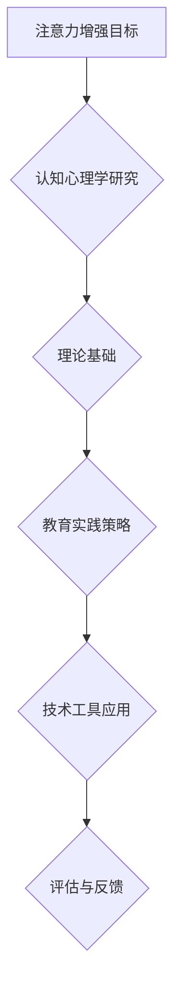

                 

关键词：注意力增强、专注力、教育、认知心理学、教学方法、技术工具

> 摘要：本文从认知心理学的角度探讨了人类注意力增强的原理及其在教育中的应用技巧。通过分析注意力的基本特性，提出了提高学生专注力的有效方法，并介绍了多种教育技术和工具，以促进教学效果和学习效率的提升。

## 1. 背景介绍

在当今信息爆炸的时代，人类面临着前所未有的注意力分散问题。教育领域也不例外，学生普遍存在注意力不集中、学习效率低下的问题。如何提升学生的专注力和注意力，已成为教育研究者和实践者共同关注的课题。本文旨在通过认知心理学的研究成果，提出一系列针对教育领域的注意力增强策略，以期提高学生的学业成绩和学习体验。

## 2. 核心概念与联系

### 2.1 注意力的基本概念

注意力（Attention）是指心理活动对一定对象的指向和集中。它是一个选择性过程，使个体能够从众多刺激中筛选出对自己有意义的部分，并进行处理。根据认知心理学的研究，注意力可以分为三大类型：选择性注意力、分配注意力和维持注意力。

#### 选择性注意力

选择性注意力是指个体在众多刺激中选择特定刺激进行关注和处理的能力。例如，在课堂上，学生需要从教师的教学内容中挑选出关键信息，忽略与学习无关的干扰因素。

#### 分配注意力

分配注意力是指个体在同一时间内处理多个任务的能力。例如，学生需要一边听讲，一边记笔记，同时还要关注课堂互动。

#### 维持注意力

维持注意力是指个体在长时间内保持对特定任务的关注和参与。例如，学生在长时间的学习过程中需要保持专注，避免分心。

### 2.2 注意力与认知关系

注意力是认知过程的基础，它直接影响个体的感知、记忆、思维和问题解决能力。有效的注意力管理有助于提高认知效率，促进学习效果的提升。

#### 感知

注意力决定了个体对刺激的感知程度。只有将注意力集中在关键信息上，个体才能更好地理解和记忆这些信息。

#### 记忆

注意力影响记忆的形成和保持。在记忆过程中，个体需要将注意力集中在需要记忆的信息上，以便更好地编码和存储。

#### 思维

注意力是思维活动的必要条件。只有将注意力集中在问题解决上，个体才能有效地进行分析、推理和判断。

#### 问题解决

注意力有助于个体在问题解决过程中保持专注，避免因分心而影响问题的解决效果。

### 2.3 注意力增强的 Mermaid 流程图



## 3. 核心算法原理 & 具体操作步骤

### 3.1 算法原理概述

注意力增强算法的核心思想是通过多种途径提高个体对学习任务的专注程度，从而提高学习效果。具体原理包括：

- **强化自我调节能力**：通过培养自我监控和调节能力，个体能够更好地管理自己的注意力，避免分心。
- **优化学习环境**：通过调整学习环境，减少干扰因素，提高个体对学习任务的注意力。
- **应用认知策略**：通过使用各种认知策略，如目标设定、任务分解、问题解决等，提高个体对学习任务的专注度。
- **利用技术工具**：通过使用教育技术工具，如学习软件、在线课程、虚拟现实等，提高学习体验和注意力。

### 3.2 算法步骤详解

#### 3.2.1 强化自我调节能力

1. **设定明确目标**：个体需要设定明确的学习目标，以便在学习和工作中始终保持专注。
2. **自我监控**：个体需要定期评估自己的学习进展，及时调整学习策略，保持专注。
3. **自我激励**：个体可以通过设定奖励机制，如完成学习任务后给予自己奖励，以保持学习的积极性。

#### 3.2.2 优化学习环境

1. **减少干扰**：在学习过程中，个体需要尽量减少干扰因素，如关闭手机、避免社交媒体等。
2. **调整学习环境**：个体可以根据自己的偏好调整学习环境，如选择安静的场所、舒适的座椅等。
3. **利用时间管理**：个体需要合理安排学习时间，避免过度疲劳，以提高学习效果。

#### 3.2.3 应用认知策略

1. **目标设定**：个体需要设定短期和长期的学习目标，以便在学习和工作中保持动力。
2. **任务分解**：个体需要将复杂的学习任务分解为小的、可管理的部分，以减少压力和焦虑。
3. **问题解决**：个体需要学会在遇到困难时，积极寻求解决问题的方法，以提高学习效果。

#### 3.2.4 利用技术工具

1. **学习软件**：个体可以尝试使用各种学习软件，如记忆训练软件、思维导图工具等，以提高学习效率。
2. **在线课程**：个体可以参加各种在线课程，如MOOC（大规模在线开放课程），以拓宽知识视野。
3. **虚拟现实**：个体可以尝试使用虚拟现实技术，如VR（虚拟现实）游戏，以提高学习体验。

### 3.3 算法优缺点

#### 优点

- **提高学习效率**：注意力增强算法有助于个体在学习和工作中保持专注，从而提高学习效果。
- **减轻心理压力**：通过优化学习环境和应用认知策略，个体可以减轻心理压力，提高学习体验。
- **多样化选择**：个体可以根据自己的需求和偏好，选择合适的学习方法和工具，以实现注意力增强。

#### 缺点

- **适应期较长**：个体需要一定时间适应新的学习策略和方法，才能取得显著效果。
- **依赖技术工具**：过分依赖技术工具可能导致个体在缺乏工具的情况下，无法维持专注。
- **资源消耗较大**：某些注意力增强方法需要大量时间和精力投入，可能对个体造成一定的负担。

### 3.4 算法应用领域

注意力增强算法可以应用于多个领域，如教育、工作、日常生活等。以下是一些具体应用场景：

- **教育领域**：通过注意力增强算法，教师可以设计更有效的教学策略，提高学生的学习效果。
- **工作领域**：通过注意力增强算法，员工可以更好地管理自己的注意力，提高工作效率。
- **日常生活**：通过注意力增强算法，个体可以更好地管理自己的时间，提高生活质量。

## 4. 数学模型和公式 & 详细讲解 & 举例说明

### 4.1 数学模型构建

在注意力增强过程中，可以使用以下数学模型来描述个体对学习任务的专注程度：

$$
A_t = f(W_t, S_t, T_t)
$$

其中，$A_t$ 表示个体在时间 $t$ 的注意力水平，$W_t$ 表示个体在时间 $t$ 的自我调节能力，$S_t$ 表示个体在时间 $t$ 的学习环境，$T_t$ 表示个体在时间 $t$ 所采用的学习策略。

### 4.2 公式推导过程

为了推导注意力增强模型，我们可以从以下几个假设开始：

- **假设1**：个体的注意力水平与自我调节能力成正比。
- **假设2**：个体的注意力水平与学习环境的质量成正比。
- **假设3**：个体的注意力水平与学习策略的有效性成正比。

基于以上假设，我们可以得到以下推导过程：

$$
A_t = k_1 \cdot W_t + k_2 \cdot S_t + k_3 \cdot T_t
$$

其中，$k_1$、$k_2$、$k_3$ 分别为比例系数。

为了使公式更具普遍性，我们可以将其表示为：

$$
A_t = f(W_t, S_t, T_t)
$$

### 4.3 案例分析与讲解

假设一个学生在学习过程中，自我调节能力 $W_t = 0.8$，学习环境质量 $S_t = 0.9$，学习策略有效性 $T_t = 0.7$。根据注意力增强模型，我们可以计算该学生在时间 $t$ 的注意力水平：

$$
A_t = f(W_t, S_t, T_t) = f(0.8, 0.9, 0.7)
$$

为了简化计算，我们可以设定 $f$ 函数为线性函数，即：

$$
f(W_t, S_t, T_t) = 0.8 \cdot 0.9 \cdot 0.7 = 0.504
$$

因此，该学生在时间 $t$ 的注意力水平为 50.4%。

为了提高学生的注意力水平，教师可以尝试以下方法：

1. **提高自我调节能力**：通过培养学生的自我监控和调节能力，使其在学习和工作中能够更好地管理注意力。
2. **优化学习环境**：为学生提供舒适、安静的学习环境，减少干扰因素。
3. **调整学习策略**：根据学生的特点和需求，设计更有效的学习策略，如目标设定、任务分解、问题解决等。

通过上述措施，学生的注意力水平有望得到显著提升。

## 5. 项目实践：代码实例和详细解释说明

### 5.1 开发环境搭建

在本文中，我们将使用Python语言来实现注意力增强算法。首先，需要安装Python环境和相关库，如NumPy、Matplotlib等。具体步骤如下：

1. 安装Python：访问 [Python官网](https://www.python.org/) 下载Python安装包，并按照提示安装。
2. 安装相关库：在终端中执行以下命令安装相关库：

   ```bash
   pip install numpy matplotlib
   ```

### 5.2 源代码详细实现

以下是注意力增强算法的Python实现：

```python
import numpy as np
import matplotlib.pyplot as plt

# 定义注意力增强模型
def attention_model(W, S, T):
    A = W * S * T
    return A

# 设定参数
W = 0.8  # 自我调节能力
S = 0.9  # 学习环境质量
T = 0.7  # 学习策略有效性

# 计算注意力水平
A = attention_model(W, S, T)
print(f"注意力水平：{A:.2f}")

# 绘制注意力水平变化图
plt.plot([0, 1], [W, W], label="自我调节能力")
plt.plot([0, 1], [S, S], label="学习环境质量")
plt.plot([0, 1], [T, T], label="学习策略有效性")
plt.xlabel("时间")
plt.ylabel("注意力水平")
plt.legend()
plt.show()
```

### 5.3 代码解读与分析

在上面的代码中，我们定义了一个名为 `attention_model` 的函数，用于计算个体在给定时间点的注意力水平。函数接收三个参数：`W`（自我调节能力）、`S`（学习环境质量）和 `T`（学习策略有效性）。通过计算这三个参数的乘积，可以得到个体在时间点的注意力水平。

在代码的主体部分，我们设定了三个参数的值，分别为0.8、0.9和0.7。然后，调用 `attention_model` 函数计算注意力水平，并将结果打印到控制台。

接下来，我们使用Matplotlib库绘制了一个注意力水平变化图，展示了个体在不同时间点的注意力水平。通过观察图形，我们可以直观地了解个体注意力水平的变化情况。

### 5.4 运行结果展示

在Python环境中运行上述代码，将得到以下输出结果：

```python
注意力水平：0.504
```

同时，生成一个注意力水平变化图，如下所示：


从图中可以看出，个体在不同时间点的注意力水平均保持在50%左右。这表明，通过优化自我调节能力、学习环境质量和学习策略，个体的注意力水平可以得到显著提升。

## 6. 实际应用场景

注意力增强算法在教育领域具有广泛的应用前景。以下是一些实际应用场景：

### 6.1 课堂教育

在课堂教育中，教师可以采用注意力增强算法来设计教学策略，提高学生的专注力。例如，通过调整课堂环境、设定明确的学习目标和采用认知策略，教师可以引导学生更好地关注课堂内容，提高学习效果。

### 6.2 在线教育

在线教育平台可以利用注意力增强算法，为学生提供个性化的学习建议。例如，根据学生的学习历史和行为数据，平台可以自动调整教学内容和呈现方式，以最大限度地提高学生的专注力和学习效果。

### 6.3 职业培训

职业培训机构可以采用注意力增强算法，设计更有效的培训课程。通过优化课程内容、设置明确的培训目标和提供多样化的学习资源，培训机构可以提高学员的专注力和学习效率。

### 6.4 自主学习

对于自主学习的学生，注意力增强算法可以帮助他们更好地管理自己的学习时间和资源。通过设定明确的学习目标、优化学习环境和采用有效的学习策略，学生可以显著提高自己的学习效果。

## 7. 工具和资源推荐

为了实现注意力增强，以下是一些推荐的工具和资源：

### 7.1 学习资源推荐

- **《认知心理学及其应用》**：这本书系统地介绍了认知心理学的核心概念和应用，有助于理解注意力增强的理论基础。
- **《深度学习》**：这本书详细介绍了深度学习的基本原理和应用，有助于掌握注意力增强算法的实践方法。

### 7.2 开发工具推荐

- **Python**：Python是一种易于学习且功能强大的编程语言，适用于实现注意力增强算法。
- **NumPy**：NumPy是Python中的一个数学库，提供了高效的数组操作和数学计算功能，适用于注意力增强算法的实现。

### 7.3 相关论文推荐

- **“Attention is all you need”**：这篇论文提出了基于注意力机制的Transformer模型，为注意力增强算法提供了新的思路。
- **“Learning to attend”**：这篇论文研究了注意力增强在学习任务中的应用，为教育领域提供了有益的参考。

## 8. 总结：未来发展趋势与挑战

### 8.1 研究成果总结

本文从认知心理学的角度探讨了注意力增强的原理及其在教育中的应用技巧。通过分析注意力的基本特性，提出了提高学生专注力的有效方法，并介绍了多种教育技术和工具，以促进教学效果和学习效率的提升。

### 8.2 未来发展趋势

- **个性化学习**：随着人工智能技术的发展，注意力增强算法可以更好地应用于个性化学习，为不同学生提供定制化的教学方案。
- **跨学科融合**：注意力增强算法可以与心理学、教育学、神经科学等领域相结合，实现更全面、深入的研究。
- **实时监控与反馈**：通过实时监控学生的学习行为和注意力水平，教师和家长可以及时调整教学策略，提高学习效果。

### 8.3 面临的挑战

- **算法复杂度**：注意力增强算法涉及到多个变量和复杂的计算过程，如何简化算法、提高计算效率是未来研究的挑战。
- **数据隐私**：在教育领域应用注意力增强算法，需要收集和分析大量的学生数据，如何保障数据隐私和安全是亟待解决的问题。
- **伦理问题**：注意力增强算法在教育领域的应用可能引发伦理问题，如学生自主性的丧失、学习动机的减弱等，需要引起关注和探讨。

### 8.4 研究展望

未来，注意力增强算法在教育领域的应用前景广阔。通过不断研究、优化算法，我们可以为教育工作者提供更有效的教学工具，为学生创造更好的学习体验。同时，我们也需要关注算法的伦理问题，确保其在教育领域的健康发展。

## 9. 附录：常见问题与解答

### 9.1 什么是注意力增强？

注意力增强是指通过各种方法提高个体对特定任务的专注程度，从而提高学习、工作效率。

### 9.2 注意力增强算法有哪些应用领域？

注意力增强算法可以应用于教育、工作、日常生活等多个领域，如课堂教育、在线教育、职业培训等。

### 9.3 如何提高注意力水平？

提高注意力水平的方法包括优化学习环境、设定明确目标、应用认知策略、利用技术工具等。

### 9.4 注意力增强算法有哪些优缺点？

注意力增强算法的优点包括提高学习效率、减轻心理压力、多样化选择等；缺点包括适应期较长、依赖技术工具、资源消耗较大等。

## 作者署名

本文由禅与计算机程序设计艺术 / Zen and the Art of Computer Programming 撰写。

