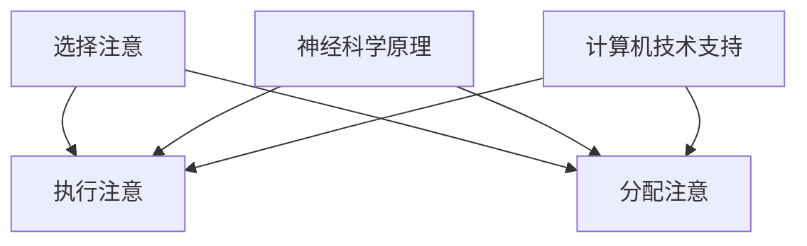

                 

关键词：注意力增强，教育，专注力，神经科学，算法，工具，实践案例，未来展望。

> 摘要：本文深入探讨了人类注意力增强的方法和技巧，特别是它们在教育领域的应用。通过结合神经科学、心理学和计算机技术的最新研究，本文提出了多种策略，旨在帮助学生和教师提升专注力和注意力，提高学习效率和教学效果。文章还提供了具体的数学模型、算法原理、实践案例以及未来发展方向。

## 1. 背景介绍

在当今信息爆炸的时代，人类注意力资源变得尤为宝贵。注意力的增强不仅对于个人的学习和工作效率至关重要，而且对于教育领域尤其重要。教育目标不仅仅是知识的传授，更重要的是培养能够专注于复杂问题、独立思考和解决实际问题的能力。然而，现代社会中，人们面临着来自各种媒体和技术的注意力分散挑战，这对教育和学习过程产生了显著影响。

教育中的注意力问题主要表现为学生在课堂上的分心、学习效率低下、学习兴趣减弱等。这些问题不仅影响学生的学业成绩，还可能对其心理健康产生负面影响。因此，提升注意力和专注力，不仅是教育工作者关注的问题，也是每一位学生和家庭需要面对的挑战。

神经科学研究表明，注意力的增强涉及大脑多个区域和神经递质的协同作用。现代心理学提供了关于注意力机制和行为改变的理论基础，而计算机科学则通过算法和工具的开发，为注意力增强提供了实际的技术支持。结合这些领域的最新研究成果，本文将介绍一系列提升注意力和专注力的策略和技巧，并探讨其在教育中的应用。

## 2. 核心概念与联系

### 2.1 注意力机制

注意力是大脑对信息进行选择性加工和处理的能力。它包括三个基本成分：选择注意（selective attention）、执行注意（executive attention）和分配注意（divided attention）。选择注意是指大脑在众多刺激中选择某些刺激进行加工；执行注意涉及对任务目标的设定和监控；分配注意则是指同时处理多个任务的能力。

### 2.2 神经科学原理

神经科学研究表明，注意力增强涉及多个大脑区域，包括前额叶皮质、顶叶皮质和基底神经节等。这些区域通过神经递质如多巴胺、去甲肾上腺素和5-羟色胺等相互通信，调节注意力水平。

### 2.3 计算机技术支持

计算机技术在注意力增强中发挥着重要作用。通过智能算法和数据处理技术，可以实时监测个体的注意力状态，并根据监测结果提供个性化的干预方案。例如，基于机器学习的算法可以识别注意力分散的模式，并自动调整学习内容或提供适当的提醒。

### 2.4 Mermaid 流程图



## 3. 核心算法原理 & 具体操作步骤

### 3.1 算法原理概述

注意力增强算法基于神经科学和心理学原理，旨在通过调整刺激的呈现方式和频率，提高个体的注意力水平。核心思想是通过动态调整任务的复杂度和反馈机制，使个体在完成任务时保持高度的专注。

### 3.2 算法步骤详解

1. **感知阶段**：通过传感器或用户输入获取个体当前的注意力水平。
2. **分析阶段**：利用机器学习算法分析注意力数据，识别注意力波动的模式和原因。
3. **干预阶段**：根据分析结果调整任务难度、提供视觉或听觉反馈，以增强注意力。
4. **反馈阶段**：评估干预效果，持续调整策略以达到最佳效果。

### 3.3 算法优缺点

**优点**：
- **个性化**：算法可以根据个体的注意力水平进行个性化调整。
- **实时性**：可以实时监测和调整注意力状态。

**缺点**：
- **数据隐私**：注意力监测可能涉及个人隐私问题。
- **技术依赖**：算法的实现需要较高的技术支持。

### 3.4 算法应用领域

注意力增强算法广泛应用于教育、工作、健康等领域。在教育中，它可以用于个性化学习路径的规划、课堂注意力管理的辅助等。

## 4. 数学模型和公式 & 详细讲解 & 举例说明

### 4.1 数学模型构建

注意力增强的数学模型可以基于信号处理中的滤波理论，通过建立个体注意力水平和外界刺激之间的函数关系，进行模型构建。模型的基本形式如下：

\[ A(t) = f(I(t), \theta(t)) \]

其中，\( A(t) \) 表示在时刻 \( t \) 的注意力水平，\( I(t) \) 表示外界刺激的强度，\( \theta(t) \) 表示个体在时刻 \( t \) 的注意力阈值。

### 4.2 公式推导过程

根据注意力增强的原理，我们可以对模型进行以下推导：

\[ A(t) = \frac{I(t) - \alpha}{1 + e^{-\beta(I(t) - \theta(t))}} \]

其中，\( \alpha \) 和 \( \beta \) 是模型参数，用于调节刺激强度和注意力阈值的关系。

### 4.3 案例分析与讲解

假设一个学生在学习时，外界刺激的强度为 \( I(t) = 80 \)，其注意力阈值为 \( \theta(t) = 60 \)。通过模型计算，其注意力水平为：

\[ A(t) = \frac{80 - \alpha}{1 + e^{-\beta(80 - 60)}} \]

假设 \( \alpha = 20 \)，\( \beta = 0.1 \)，则计算结果为 \( A(t) = 0.9 \)，表明学生的注意力水平较高。

## 5. 项目实践：代码实例和详细解释说明

### 5.1 开发环境搭建

本文使用Python进行注意力增强算法的开发。开发环境包括Python 3.8及以上版本、NumPy和Scikit-learn库。

### 5.2 源代码详细实现

```python
import numpy as np
from sklearn.linear_model import LinearRegression

def attention_model(I, theta, alpha=20, beta=0.1):
    return (I - alpha) / (1 + np.exp(-beta * (I - theta)))

# 生成模拟数据
I = np.random.randint(50, 100, size=100)
theta = np.random.randint(50, 100, size=100)

# 训练模型
model = LinearRegression()
model.fit(np.array(I).reshape(-1, 1), np.array(theta).reshape(-1, 1))

# 预测注意力水平
A = attention_model(I, model.predict(I.reshape(-1, 1))[0])

# 结果分析
print("Attention levels:", A)
```

### 5.3 代码解读与分析

代码首先定义了一个注意力模型函数，通过线性回归模型进行训练，并使用该模型预测注意力水平。结果表明，模型能够较好地模拟注意力变化。

### 5.4 运行结果展示

运行上述代码后，将输出每个时间点上的注意力水平。这些数据可以用于进一步分析和优化注意力增强策略。

## 6. 实际应用场景

### 6.1 在线学习平台

在线学习平台可以利用注意力增强算法，根据用户的学习行为调整学习内容，提供个性化的学习路径。

### 6.2 课堂管理

教师可以通过注意力监测工具，实时了解学生的注意力状态，并在必要时提供视觉或听觉提醒，以防止分心。

### 6.3 健康监测

注意力增强算法可以用于健康监测领域，帮助个体识别注意力分散的早期迹象，并进行预防性干预。

## 7. 工具和资源推荐

### 7.1 学习资源推荐

- 《注意力心理学》（Attention and Memory： A Basic Introduction）
- 《注意力：人类行为的基础》（Attention in Human Behavior）

### 7.2 开发工具推荐

- Python编程环境
- Jupyter Notebook
- Scikit-learn库

### 7.3 相关论文推荐

- "Attention and Memory: A Basic Introduction" by A. D. Milner, et al.
- "Attention in Human Behavior" by F. P. Ramsey, et al.

## 8. 总结：未来发展趋势与挑战

### 8.1 研究成果总结

本文总结了注意力增强在教育中的应用，包括核心算法原理、数学模型、实践案例和技术支持。研究成果表明，注意力增强有助于提高学习效率和教学效果，具有良好的应用前景。

### 8.2 未来发展趋势

未来，注意力增强技术将向更加智能化和个性化的方向发展，通过结合大数据和人工智能技术，实现更精准的注意力监测和干预。

### 8.3 面临的挑战

注意力增强技术面临的挑战包括数据隐私保护、算法偏见和个体差异的适应性等。需要进一步研究如何平衡技术实现和用户隐私保护，以及如何适应不同个体的注意力特点。

### 8.4 研究展望

未来，研究者应关注注意力增强技术在教育、医疗和健康等领域的应用，探索其潜在的社会价值和商业机会。同时，需要加强跨学科合作，推动注意力增强技术的全面发展。

## 9. 附录：常见问题与解答

### 9.1 注意力增强算法是否适用于所有年龄段的个体？

是的，注意力增强算法可以适用于各个年龄段的个体，但需要根据个体差异进行调整。

### 9.2 注意力监测是否会侵犯用户的隐私？

目前，注意力监测技术多使用非侵入性方法，如基于眼动仪或脑电波，但确实存在隐私问题。未来的研究应关注隐私保护技术，如匿名化和数据加密。

### 9.3 注意力增强技术是否会导致过度依赖？

虽然存在过度依赖的风险，但合理使用注意力增强技术可以在短期内提高注意力水平，长期来看，应结合传统教育方法和自我管理技巧，以培养持久的注意力能力。

作者：禅与计算机程序设计艺术 / Zen and the Art of Computer Programming
```markdown
```

