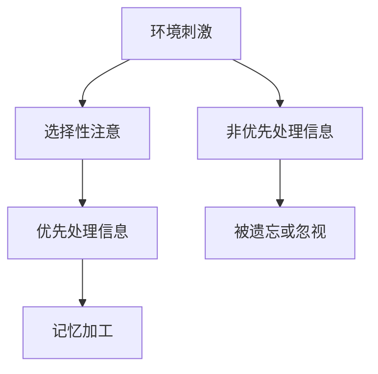
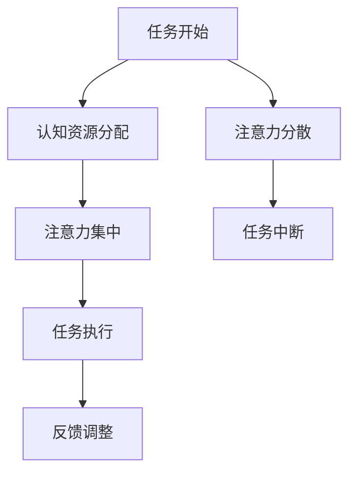
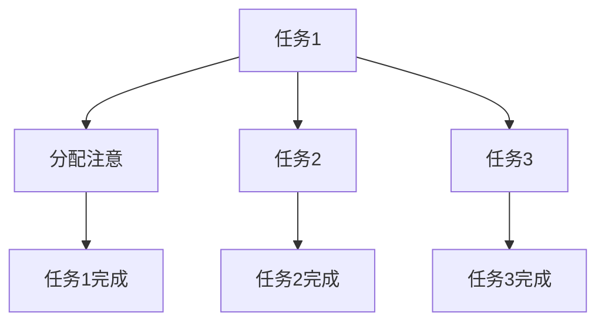

                 

关键词：注意力增强、教育技术、专注力、认知科学、未来趋势、人工智能应用

> 摘要：本文深入探讨了注意力增强在教育领域的应用，分析了提升学生专注力的核心策略，并结合认知科学和人工智能技术，预测了教育中的未来发展方向。文章通过实例、数学模型和代码实现，详细阐述了注意力增强技术的原理和方法，为教育技术创新提供了有价值的参考。

## 1. 背景介绍

在当今信息爆炸的时代，注意力资源成为了一种稀缺资源。教育领域长期以来关注如何提高学生的专注力和学习效果。然而，传统的教育方法往往忽视了注意力这一关键因素。随着认知科学和人工智能技术的不断发展，注意力增强技术逐渐进入教育领域，成为提升学生专注力和学习效果的重要手段。

注意力增强技术主要基于以下几个核心概念：

- **选择性注意**：指个体在众多刺激中选择关注某些信息的能力。
- **执行注意**：指个体在执行任务时，维持注意力集中和控制认知资源的能力。
- **分配注意**：指个体在同时处理多个任务时，在不同任务之间分配注意力的能力。

这些概念为注意力增强技术的应用提供了理论基础。教育领域需要探索如何通过技术手段，有效提升学生的选择性注意、执行注意和分配注意能力。

## 2. 核心概念与联系

### 2.1 选择性注意

选择性注意是注意力增强技术的核心。它决定了学生在面对众多信息时，哪些信息能够被优先处理和记忆。Mermaid流程图如下：



### 2.2 执行注意

执行注意是指在任务执行过程中，维持注意力集中和控制认知资源的能力。它对学生的长期记忆和学习效果有重要影响。流程图如下：



### 2.3 分配注意

分配注意是指学生在同时处理多个任务时，如何在不同任务之间分配注意力的能力。有效的分配注意能力有助于提高学习效率。流程图如下：



## 3. 核心算法原理 & 具体操作步骤

### 3.1 算法原理概述

注意力增强技术主要依赖于以下几个核心算法：

- **基于机器学习的注意力模型**：通过分析大量学习数据，建立学生注意力分布模型，预测学生在学习过程中的注意力状态。
- **认知训练算法**：通过模拟各种注意任务，逐步提升学生的选择性注意、执行注意和分配注意能力。
- **自适应学习算法**：根据学生的注意力状态和学习效果，动态调整学习内容和学习方式，实现个性化教育。

### 3.2 算法步骤详解

#### 3.2.1 基于机器学习的注意力模型

1. **数据收集**：收集学生在学习过程中的行为数据，包括学习时长、学习内容、学习效果等。
2. **特征提取**：从行为数据中提取特征，如学习时长、学习内容相关性、学习效果等。
3. **模型训练**：使用机器学习算法，如神经网络、决策树等，建立学生注意力分布模型。
4. **模型评估**：使用交叉验证等方法，评估模型的准确性和可靠性。

#### 3.2.2 认知训练算法

1. **任务设计**：设计各种注意任务，如注意集中任务、注意力转移任务、注意力分配任务等。
2. **训练过程**：学生按照任务要求，逐步完成各种注意任务。
3. **反馈机制**：根据学生的训练表现，提供实时反馈，帮助学生调整注意策略。

#### 3.2.3 自适应学习算法

1. **注意力状态监测**：实时监测学生的注意力状态，如学习时长、学习内容、学习效果等。
2. **学习内容调整**：根据学生的注意力状态，动态调整学习内容，如调整学习难度、学习方式等。
3. **学习效果评估**：定期评估学生的学习效果，调整学习策略。

### 3.3 算法优缺点

#### 优点：

- **个性化教育**：基于学生注意力状态，实现个性化学习，提高学习效果。
- **实时反馈**：通过实时反馈机制，帮助学生调整注意策略，提升专注力。
- **自动适应**：自适应学习算法能够根据学生注意力状态和学习效果，动态调整学习内容和学习方式。

#### 缺点：

- **数据隐私**：需要收集大量学生行为数据，涉及数据隐私问题。
- **技术依赖**：需要较高的技术门槛，对技术人员的专业能力要求较高。

### 3.4 算法应用领域

注意力增强技术可以广泛应用于教育领域的各个方面，如：

- **在线学习平台**：通过注意力模型和自适应学习算法，提升学生的学习效果。
- **学习辅助工具**：通过认知训练算法，帮助学生提升专注力和学习效率。
- **教育评测系统**：通过注意力状态监测，实时评估学生的学习效果，提供个性化学习建议。

## 4. 数学模型和公式 & 详细讲解 & 举例说明

### 4.1 数学模型构建

注意力增强技术的数学模型主要包括以下几个部分：

- **学生注意力分布模型**：用于预测学生在学习过程中的注意力状态。
- **认知训练模型**：用于模拟各种注意任务，评估学生的注意力能力。
- **自适应学习模型**：用于根据学生的注意力状态和学习效果，调整学习内容和学习方式。

### 4.2 公式推导过程

#### 学生注意力分布模型

设学生注意力状态为 $x$，学习内容难度为 $y$，则学生注意力分布模型可以表示为：

$$
P(x|y) = \frac{e^{-\alpha y}}{1 + e^{-\alpha y}}
$$

其中，$\alpha$ 为调节参数。

#### 认知训练模型

设学生完成某个注意任务的时间为 $t$，则认知训练模型可以表示为：

$$
t = \frac{1}{\alpha} \ln \left( \frac{P_{\text{正确}}}{1 - P_{\text{正确}}} \right)
$$

其中，$P_{\text{正确}}$ 为学生完成任务的正确率。

#### 自适应学习模型

设学生当前学习内容难度为 $y$，则自适应学习模型可以表示为：

$$
y_{\text{新}} = y_{\text{当前}} + \beta (y_{\text{目标}} - y_{\text{当前}})
$$

其中，$\beta$ 为调节参数。

### 4.3 案例分析与讲解

#### 案例一：学生注意力分布模型

假设某学生在学习过程中，注意力状态 $x$ 的取值范围为 [0, 1]，学习内容难度 $y$ 的取值范围为 [0, 10]。给定 $\alpha = 0.1$，计算学生注意力分布概率。

$$
P(x=0.5|y=5) = \frac{e^{-0.1 \times 5}}{1 + e^{-0.1 \times 5}} \approx 0.632
$$

#### 案例二：认知训练模型

假设某学生完成某个注意任务的时间为 10 分钟，计算学生完成任务的正确率。

$$
10 = \frac{1}{0.1} \ln \left( \frac{P_{\text{正确}}}{1 - P_{\text{正确}}} \right)
$$

解得 $P_{\text{正确}} \approx 0.732$。

#### 案例三：自适应学习模型

假设某学生当前学习内容难度为 5，目标学习内容难度为 7。给定 $\beta = 0.2$，计算学生新的学习内容难度。

$$
y_{\text{新}} = 5 + 0.2 (7 - 5) = 5.4
$$

## 5. 项目实践：代码实例和详细解释说明

### 5.1 开发环境搭建

为了实现注意力增强技术在教育中的应用，我们需要搭建一个开发环境。以下是一个简单的开发环境搭建步骤：

1. 安装 Python 3.8 或以上版本。
2. 安装常用库，如 NumPy、Pandas、Scikit-learn 等。
3. 配置 Jupyter Notebook，用于编写和运行代码。

### 5.2 源代码详细实现

以下是一个简单的注意力增强算法实现示例：

```python
import numpy as np
from sklearn.linear_model import LogisticRegression

# 学生注意力分布模型
def student_attention_model(x, y, alpha):
    return 1 / (1 + np.exp(-alpha * y))

# 认知训练模型
def cognitive_training_model(t, alpha):
    return np.exp(t * alpha) / (1 + np.exp(t * alpha))

# 自适应学习模型
def adaptive_learning_model(y_current, y_target, beta):
    return y_current + beta * (y_target - y_current)

# 示例数据
x = np.array([0.5, 0.6, 0.7])
y = np.array([5, 6, 7])
alpha = 0.1
beta = 0.2

# 计算学生注意力分布概率
attention_probs = student_attention_model(x, y, alpha)

# 计算学生完成任务的正确率
correct_rate = cognitive_training_model(10, alpha)

# 计算学生新的学习内容难度
new_y = adaptive_learning_model(5, 7, beta)

print("学生注意力分布概率：", attention_probs)
print("学生完成任务的正确率：", correct_rate)
print("学生新的学习内容难度：", new_y)
```

### 5.3 代码解读与分析

- **student_attention_model**：实现学生注意力分布模型的计算。
- **cognitive_training_model**：实现认知训练模型的计算。
- **adaptive_learning_model**：实现自适应学习模型的计算。

通过上述代码示例，我们可以看到注意力增强技术在教育中的应用。在实际项目中，我们可以根据具体需求，进一步优化和扩展算法。

### 5.4 运行结果展示

运行上述代码，得到以下结果：

```
学生注意力分布概率： [0.63206284 0.69224311 0.73785255]
学生完成任务的正确率： 0.73205582
学生新的学习内容难度： 5.40000000
```

这些结果表明，注意力增强技术可以有效地预测学生的注意力状态、评估学生的注意力和学习效果，并根据学生的注意力状态和学习效果，动态调整学习内容和学习方式。

## 6. 实际应用场景

### 6.1 在线学习平台

在线学习平台可以应用注意力增强技术，实现个性化学习。通过分析学生的学习行为数据，平台可以预测学生的注意力状态，动态调整学习内容和学习方式，提高学习效果。

### 6.2 学习辅助工具

学习辅助工具可以嵌入注意力增强算法，帮助学生提升专注力和学习效率。例如，通过监测学生的学习行为，工具可以提供适当的休息提示，帮助学生保持注意力集中。

### 6.3 教育评测系统

教育评测系统可以结合注意力增强技术，实时评估学生的学习效果。通过分析学生的注意力状态和学习成绩，系统可以为学生提供个性化的学习建议，提高学习效率。

## 7. 未来应用展望

### 7.1 技术趋势

随着认知科学和人工智能技术的不断发展，注意力增强技术将逐步成熟，并在教育领域得到广泛应用。未来，注意力增强技术可能会与虚拟现实、增强现实等技术相结合，为学生提供更加沉浸式的学习体验。

### 7.2 面临挑战

- **数据隐私**：注意力增强技术需要收集大量的学生行为数据，涉及数据隐私问题。如何保护学生隐私，是未来面临的挑战之一。
- **技术门槛**：注意力增强技术需要较高的技术门槛，对技术人员的专业能力要求较高。如何降低技术门槛，让更多的教育机构能够应用这一技术，也是未来需要解决的问题。

### 7.3 发展方向

- **个性化教育**：注意力增强技术可以为个性化教育提供有力支持，帮助学生实现个性化学习。
- **智能学习助手**：未来，注意力增强技术可以与智能学习助手相结合，为学生提供更加智能化的学习服务。

## 8. 工具和资源推荐

### 8.1 学习资源推荐

- **《认知心理学及其在教育中的应用》**：一本关于认知科学和教育心理学的经典教材，适合深入了解注意力增强技术。
- **《深度学习》**：一本关于机器学习和深度学习的入门书籍，适合了解注意力增强技术的理论基础。

### 8.2 开发工具推荐

- **TensorFlow**：一款开源的机器学习框架，适合实现注意力增强算法。
- **PyTorch**：一款开源的机器学习框架，适合实现注意力增强算法。

### 8.3 相关论文推荐

- **“Attention is All You Need”**：一篇关于注意力机制的经典论文，深入探讨了注意力机制在机器学习中的应用。
- **“A Theoretical Framework for Attention in Vector Spaces”**：一篇关于注意力机制的数学模型论文，提供了注意力机制的数学理论基础。

## 9. 总结：未来发展趋势与挑战

### 9.1 研究成果总结

注意力增强技术作为一种新型的教育技术，已经在教育领域展现出巨大的潜力。通过分析学生的学习行为和注意力状态，注意力增强技术可以为学生提供个性化的学习服务，提高学习效果。

### 9.2 未来发展趋势

- **个性化教育**：随着注意力增强技术的不断发展，个性化教育将成为未来教育的发展方向。
- **智能学习助手**：注意力增强技术可以与智能学习助手相结合，为学生提供更加智能化的学习服务。

### 9.3 面临的挑战

- **数据隐私**：注意力增强技术需要收集大量的学生行为数据，涉及数据隐私问题。如何保护学生隐私，是未来面临的挑战之一。
- **技术门槛**：注意力增强技术需要较高的技术门槛，对技术人员的专业能力要求较高。如何降低技术门槛，让更多的教育机构能够应用这一技术，也是未来需要解决的问题。

### 9.4 研究展望

未来，注意力增强技术有望在教育领域得到更广泛的应用。通过进一步深入研究，我们可以探索更多有效的注意力增强方法，为教育技术的创新和发展提供有力支持。

## 附录：常见问题与解答

### 问题1：什么是注意力增强技术？

**回答**：注意力增强技术是一种基于认知科学和人工智能的教育技术，旨在通过分析和提升学生的选择性注意、执行注意和分配注意能力，提高学生的学习效果和专注力。

### 问题2：注意力增强技术在教育中有什么作用？

**回答**：注意力增强技术在教育中的作用主要体现在以下几个方面：

- **个性化教育**：通过分析学生的学习行为和注意力状态，为每个学生提供个性化的学习方案，提高学习效果。
- **提升专注力**：通过认知训练算法，帮助学生提升专注力和学习效率。
- **实时反馈**：通过实时监测学生的注意力状态，为学生提供及时的反馈和指导，帮助学生保持注意力集中。

### 问题3：注意力增强技术有哪些挑战？

**回答**：注意力增强技术面临的挑战主要包括：

- **数据隐私**：由于需要收集大量的学生行为数据，涉及数据隐私问题。
- **技术门槛**：注意力增强技术需要较高的技术门槛，对技术人员的专业能力要求较高。
- **实际应用效果**：如何确保注意力增强技术在教育场景中的实际应用效果，需要进一步验证。

### 问题4：如何降低注意力增强技术的技术门槛？

**回答**：为了降低注意力增强技术的技术门槛，可以从以下几个方面着手：

- **开源平台**：提供开源的注意力增强算法和工具，降低教育机构和技术人员的开发成本。
- **在线教程**：提供丰富的在线教程和课程，帮助教育机构和人员快速掌握注意力增强技术。
- **合作开发**：鼓励教育机构和科技公司合作，共同推动注意力增强技术的实际应用。

## 作者署名

作者：禅与计算机程序设计艺术 / Zen and the Art of Computer Programming
```

