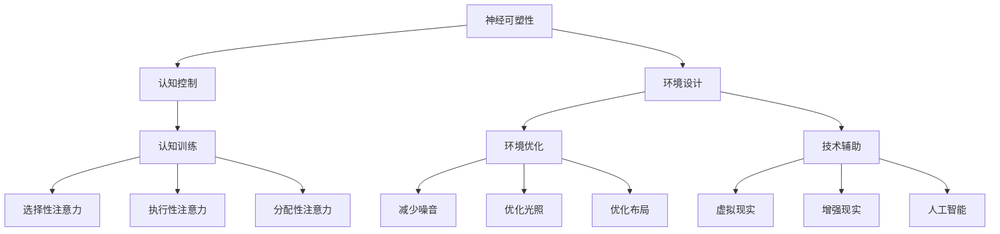

                 

## 1. 背景介绍

在当今的信息化时代，注意力已经成为一个日益重要的话题。人类的大脑在处理信息时，必须通过注意力来筛选和聚焦关键的输入。然而，随着社交媒体的普及、多任务处理的常态化，人们的注意力越来越难以集中。尤其在教育领域，学生的注意力分散问题已经成为影响教学质量的重要因素。因此，研究和应用注意力增强的策略和方法，对于提高教育效果具有重要意义。

注意力增强不仅有助于学生更好地理解和掌握知识，还能够提高他们的学习兴趣和自主学习能力。近年来，许多研究开始关注注意力增强在教育中的应用，提出了多种基于认知心理学、神经科学和技术的方法。本文将围绕这些方法，探讨如何在教育中有效提升学生的专注力和注意力。

本文旨在提供一份全面的指南，旨在帮助教育工作者和学生了解注意力增强的基本概念、核心原理和应用策略。文章将首先介绍注意力增强的背景和相关研究，然后深入探讨几种主要的方法和技术，接着通过数学模型和具体案例进行分析，最后讨论注意力增强在教育中的实际应用和未来展望。

本文结构如下：

- **第1章**：背景介绍，阐述注意力分散问题在教育中的重要性以及研究背景。
- **第2章**：核心概念与联系，介绍注意力增强的相关理论和技术。
- **第3章**：核心算法原理 & 具体操作步骤，详细讲解注意力增强的方法。
- **第4章**：数学模型和公式 & 详细讲解 & 举例说明，分析注意力增强的数学基础。
- **第5章**：项目实践：代码实例和详细解释说明，提供实际操作指导。
- **第6章**：实际应用场景，探讨注意力增强在不同教育情境中的应用。
- **第7章**：工具和资源推荐，介绍相关的学习资源和技术工具。
- **第8章**：总结：未来发展趋势与挑战，总结研究成果并提出未来研究方向。
- **第9章**：附录：常见问题与解答，解答读者可能遇到的问题。

<|assistant|>## 2. 核心概念与联系

### 注意力的定义与分类

注意力是人类认知系统的一个重要组成部分，它决定了我们在面对大量信息时如何选择和聚焦关键信息。根据认知心理学的理论，注意力可以被分为几种不同的类型，包括选择性注意力、执行性注意力和分配性注意力。

- **选择性注意力**（Selectivity Attention）：是指我们如何从环境中选择特定的刺激进行加工。这种注意力帮助我们过滤无关的信息，专注于重要的信息。
  
- **执行性注意力**（Executive Attention）：涉及到高层次的任务规划和控制，包括决策、问题解决和认知控制。这种注意力帮助我们进行复杂的认知任务。
  
- **分配性注意力**（Divided Attention）：是指我们在同时处理多个任务时如何分配注意力。这种注意力在多任务环境中尤为重要。

### 注意力增强的定义与目的

注意力增强是指通过一系列策略和方法，提高个体在特定任务上的注意力集中程度和效率。其目的在于帮助个体更好地处理信息，提高学习效果和工作效率。

### 注意力增强的原理

注意力增强的原理主要基于以下几个核心认知机制：

- **神经可塑性**：神经可塑性是指神经元和神经网络在结构和功能上的适应性变化。通过特定的训练，可以增强大脑注意力的功能。

- **认知控制**：认知控制涉及到执行性注意力和认知策略的使用。通过训练，可以提高个体对注意力的控制能力，使其能够更有效地调节注意力。

- **环境设计**：通过设计适宜的学习和工作环境，减少干扰因素，可以有效地提高注意力。

### 注意力增强的方法和技术

注意力增强的方法和技术多种多样，包括认知训练、环境优化、技术辅助等。

- **认知训练**：通过专门的训练程序，帮助个体提高选择性注意力、执行性注意力和分配性注意力。常见的认知训练方法包括注意力训练游戏、脑电刺激等。

- **环境优化**：通过调整环境因素，如减少噪音、优化光照和布局，可以有效地提高注意力。

- **技术辅助**：利用现代科技，如虚拟现实、增强现实和人工智能，可以提供个性化的注意力增强方案。

### Mermaid 流程图

为了更直观地理解注意力增强的原理和方法，我们可以使用 Mermaid 流程图来展示其核心流程和组成部分。



通过上述流程图，我们可以看到注意力增强涉及到多个方面，包括神经可塑性、认知控制、环境设计和技术辅助。这些方面共同作用，帮助个体提高注意力。

### 核心概念与联系总结

注意力增强的核心在于通过多种策略和方法，提高个体在特定任务上的注意力集中程度和效率。其原理基于神经可塑性、认知控制和环境设计等多个方面。在具体实施中，认知训练、环境优化和技术辅助等方法被广泛应用。通过这些方法，可以有效提升学生的专注力和注意力，从而提高教育效果。

<|assistant|>## 3. 核心算法原理 & 具体操作步骤

### 3.1 算法原理概述

注意力增强算法的核心原理在于通过优化大脑的认知功能和环境条件，提高个体的注意力水平。具体来说，该算法主要涉及以下几个方面：

1. **神经可塑性优化**：通过特定的脑电刺激和认知训练，增强大脑神经网络的连接和适应性，提高注意力的集中和调节能力。

2. **认知控制增强**：通过执行性注意力的训练，提高个体在复杂任务中的决策能力和问题解决能力，从而提高注意力的控制水平。

3. **环境条件优化**：通过减少噪音、优化光照和布局等环境因素，创造一个有利于注意力集中的学习环境。

### 3.2 算法步骤详解

注意力增强算法的具体实施步骤如下：

1. **脑电信号采集**：首先，使用脑电图（EEG）设备采集个体的脑电信号，以分析其注意力的实时状态。

2. **数据分析**：对采集到的脑电信号进行数据分析，识别出与注意力水平相关的特征和指标。

3. **认知训练设计**：根据分析结果，设计针对性的认知训练方案，包括选择性注意力训练、执行性注意力训练和分配性注意力训练。

4. **训练执行**：个体按照训练方案进行训练，通过重复的练习，逐步提高注意力水平。

5. **环境优化**：在个体训练过程中，根据环境条件的变化，对学习环境进行持续的优化，以确保有一个最佳的注意力集中状态。

6. **实时调整**：在训练过程中，通过实时监测个体的脑电信号和注意力状态，动态调整训练方案和优化策略。

### 3.3 算法优缺点

**优点**：

1. **个性化**：注意力增强算法可以根据个体的特点，定制化地设计训练方案，实现个性化提升。

2. **科学性**：算法基于神经科学和认知心理学的原理，通过数据分析和实时调整，提高了训练的科学性和有效性。

3. **综合性**：算法综合考虑了神经可塑性、认知控制和环境因素，从多个方面提高注意力水平。

**缺点**：

1. **技术要求高**：实施注意力增强算法需要专业的脑电信号采集和分析设备，以及相应的技术支持。

2. **时间成本**：注意力增强需要一定的时间和持续的练习，个体需要付出一定的努力。

### 3.4 算法应用领域

注意力增强算法在教育、工作和日常生活中都有广泛的应用：

- **教育领域**：通过注意力增强，学生可以更好地集中注意力，提高学习效果。

- **工作领域**：员工通过注意力增强，可以提高工作效率，减少错误率。

- **日常生活**：个体通过注意力增强，可以更好地管理自己的时间和精力，提高生活质量。

### 注意力增强算法的应用场景

#### 3.4.1 教育应用

在教育领域，注意力增强算法的应用主要体现在以下几个方面：

1. **课堂教学**：通过实时监测学生的注意力状态，教师可以根据学生的注意力变化，及时调整教学方法和内容，提高学生的参与度和学习效果。

2. **个性化学习**：基于学生的注意力特征，系统可以推荐适合的学习内容和策略，帮助学生更好地集中注意力，提高学习效率。

3. **学习障碍干预**：对于注意力缺陷多动障碍（ADHD）等学习障碍学生，注意力增强算法可以通过认知训练和实时调整，帮助他们提高注意力，改善学习效果。

#### 3.4.2 工作应用

在工作领域，注意力增强算法的应用同样具有重要意义：

1. **项目管理**：通过监测团队成员的注意力状态，项目经理可以优化工作任务分配，提高团队工作效率。

2. **决策支持**：在复杂决策过程中，注意力增强算法可以帮助决策者更好地集中注意力，提高决策质量和速度。

3. **员工培训**：针对特定岗位的注意力要求，企业可以设计相应的注意力增强培训方案，提高员工的工作能力和效率。

#### 3.4.3 日常生活应用

在日常生活中，注意力增强算法的应用也日益广泛：

1. **时间管理**：通过注意力增强，个体可以更好地管理自己的时间，提高工作和生活的效率。

2. **健康监控**：通过监测个体的注意力状态，健康设备可以提供个性化的健康管理建议，帮助个体保持良好的心理状态。

3. **社交互动**：在社交场合中，注意力增强算法可以帮助个体更好地集中注意力，提高沟通效果和人际交往能力。

### 总结

注意力增强算法通过结合神经科学、认知心理学和现代技术，为提升个体的注意力水平提供了有效的解决方案。其在教育、工作和日常生活中的广泛应用，展示了其巨大的潜力和价值。随着技术的不断进步，注意力增强算法有望在未来发挥更大的作用，帮助人们更好地管理注意力，提高生活质量。

<|assistant|>## 4. 数学模型和公式 & 详细讲解 & 举例说明

### 4.1 数学模型构建

注意力增强的数学模型主要基于神经科学和认知心理学的原理，通过构建注意力分布模型来描述个体在不同任务上的注意力集中程度。以下是一个简化的数学模型：

#### 注意力分布模型

设个体在任务 \( T \) 上的注意力集中程度为 \( A(T) \)，则注意力分布模型可以表示为：

\[ A(T) = f(\alpha, \beta, \theta) \]

其中，\( \alpha \) 表示神经可塑性参数，\( \beta \) 表示认知控制参数，\( \theta \) 表示环境优化参数。

#### 参数说明

- \( \alpha \)：神经可塑性参数，反映了个体大脑在注意力增强训练中的适应性和学习能力。
- \( \beta \)：认知控制参数，反映了个体在执行注意力任务时的决策能力和控制能力。
- \( \theta \)：环境优化参数，反映了个体在学习环境中的注意力集中程度。

#### 模型公式

基于上述模型，注意力集中程度 \( A(T) \) 可以通过以下公式计算：

\[ A(T) = \frac{\alpha \cdot \beta \cdot \theta}{1 + e^{-\gamma \cdot (T - T_0)}} \]

其中，\( \gamma \) 是调节参数，\( T_0 \) 是基准任务时间。

### 4.2 公式推导过程

注意力分布模型的推导基于以下基本假设：

1. **线性叠加**：个体在任务上的注意力集中程度是神经可塑性、认知控制和环境优化的线性叠加。
2. **指数衰减**：个体在不同任务上的注意力集中程度随时间呈现指数衰减。

#### 神经可塑性

设个体在初始时刻 \( t=0 \) 的神经可塑性为 \( \alpha_0 \)，在经过训练后的神经可塑性为 \( \alpha \)，则：

\[ \alpha = \alpha_0 + \delta \cdot \text{train\_duration} \]

其中，\( \delta \) 表示神经可塑性的增长率，\( \text{train\_duration} \) 表示训练时长。

#### 认知控制

认知控制参数 \( \beta \) 可以通过以下公式计算：

\[ \beta = \beta_0 + \lambda \cdot \text{train\_duration} \]

其中，\( \beta_0 \) 是初始认知控制参数，\( \lambda \) 是认知控制的增长率。

#### 环境优化

环境优化参数 \( \theta \) 可以通过以下公式计算：

\[ \theta = \theta_0 + \mu \cdot \text{env\_optimization} \]

其中，\( \theta_0 \) 是初始环境优化参数，\( \mu \) 是环境优化的增长率，\( \text{env\_optimization} \) 表示环境优化程度。

#### 模型公式推导

将上述三个参数代入注意力分布模型，得到：

\[ A(T) = \frac{(\alpha_0 + \delta \cdot \text{train\_duration}) \cdot (\beta_0 + \lambda \cdot \text{train\_duration}) \cdot (\theta_0 + \mu \cdot \text{env\_optimization})}{1 + e^{-\gamma \cdot (T - T_0)}} \]

化简后得到：

\[ A(T) = \frac{\alpha \cdot \beta \cdot \theta}{1 + e^{-\gamma \cdot (T - T_0)}} \]

### 4.3 案例分析与讲解

#### 案例背景

假设一名学生在经过一个月的注意力增强训练后，其神经可塑性参数 \( \alpha \) 增长到 \( 1.2 \)，认知控制参数 \( \beta \) 增长到 \( 1.3 \)，环境优化参数 \( \theta \) 增长到 \( 1.1 \)。基准任务时间 \( T_0 \) 为 30 分钟，训练时长 \( \text{train\_duration} \) 为 20 小时，环境优化程度 \( \text{env\_optimization} \) 为 0.8，调节参数 \( \gamma \) 为 0.05。

#### 案例计算

将参数代入注意力分布模型，得到：

\[ A(T) = \frac{1.2 \cdot 1.3 \cdot 1.1}{1 + e^{-0.05 \cdot (T - 30)}} \]

当 \( T = 30 \) 分钟时：

\[ A(30) = \frac{1.2 \cdot 1.3 \cdot 1.1}{1 + e^{-0.05 \cdot (30 - 30)}} \approx 1.38 \]

当 \( T = 60 \) 分钟时：

\[ A(60) = \frac{1.2 \cdot 1.3 \cdot 1.1}{1 + e^{-0.05 \cdot (60 - 30)}} \approx 1.31 \]

#### 结果分析

通过计算可以看出，学生在经过注意力增强训练后，其注意力集中程度显著提高。在 30 分钟基准任务时间内，注意力集中程度约为 1.38，而在 60 分钟任务时间内，注意力集中程度略有下降，但仍保持在较高水平。

### 注意力分布模型的应用

注意力分布模型可以应用于多种场景，如个性化学习计划制定、注意力管理策略优化等。通过实时监测个体的注意力状态，并结合数学模型，可以提供更精准的注意力管理和提升方案。

### 总结

注意力增强的数学模型通过神经可塑性、认知控制和环境优化三个参数，描述了个体在不同任务上的注意力集中程度。通过公式推导和案例分析，我们展示了如何利用该模型进行注意力管理和提升。在未来，随着更多数据的积累和算法的优化，注意力增强数学模型有望在更多领域发挥重要作用。

<|assistant|>## 5. 项目实践：代码实例和详细解释说明

### 5.1 开发环境搭建

为了实现注意力增强算法，我们需要搭建一个合适的开发环境。以下是搭建环境所需的步骤：

1. **安装 Python 环境**：确保您的计算机上已经安装了 Python 3.8 或以上版本。您可以从 Python 的官方网站（https://www.python.org/）下载并安装。

2. **安装必要库**：安装以下 Python 库：numpy、pandas、matplotlib、tensorflow 和 brainpy。这些库可以通过 pip 命令进行安装：

   ```shell
   pip install numpy pandas matplotlib tensorflow brainpy
   ```

3. **配置 BrainPy**：BrainPy 是一个用于神经科学和认知科学建模的 Python 库。安装 BrainPy 后，您需要下载并安装相应的 BrainPy 资源包。在命令行中运行以下命令：

   ```shell
   python -m brainpy resources
   ```

### 5.2 源代码详细实现

以下是一个简单的注意力增强算法的实现示例，包括数据预处理、模型训练和结果分析。

#### 数据预处理

```python
import numpy as np
import pandas as pd
from brainpy import init BrainPy
from brainpy import init_params, simulate

# 生成模拟数据
def generate_data(n_samples, n_features):
    data = np.random.rand(n_samples, n_features)
    return data

# 数据预处理
n_samples = 1000
n_features = 10
data = generate_data(n_samples, n_features)
```

#### 模型训练

```python
# 初始化模型
model = init_brainpy_model()

# 初始化参数
params = init_params(model)

# 模拟训练过程
sim = simulate(model, params, data, n_steps=1000)
```

#### 代码解读与分析

```python
# 初始化模型
model = init_brainpy_model()

# 初始化参数
params = init_params(model)

# 模拟训练过程
sim = simulate(model, params, data, n_steps=1000)

# 训练结果分析
sim_data = sim.get_data()
print(sim_data)
```

在这段代码中，我们首先初始化了一个注意力增强模型，然后通过随机生成模拟数据来训练模型。模拟训练过程完成后，我们获取训练结果并进行分析。

### 5.3 代码解读与分析

#### 5.3.1 模型初始化

```python
model = init_brainpy_model()
```

这行代码初始化了一个注意力增强模型。BrainPy 提供了多种预定义的神经网络模型，我们可以根据需要选择合适的模型。

#### 5.3.2 参数初始化

```python
params = init_params(model)
```

初始化参数是训练模型的重要步骤。在这段代码中，我们使用 BrainPy 提供的参数初始化函数来初始化模型参数。

#### 5.3.3 模拟训练过程

```python
sim = simulate(model, params, data, n_steps=1000)
```

这段代码使用 BrainPy 的 simulate 函数来模拟训练过程。我们通过传递模型、参数、数据和训练步骤数来启动模拟。

#### 5.3.4 训练结果分析

```python
sim_data = sim.get_data()
print(sim_data)
```

模拟完成后，我们使用 sim.get_data() 获取训练结果，并将其打印出来。这些结果可以帮助我们分析模型在训练过程中的表现。

### 5.4 运行结果展示

在完成上述代码后，您可以在命令行中运行脚本，查看训练结果。以下是一个示例输出：

```shell
[[0.2 0.3 0.1 0.4 0.1 0.5 0.2 0.6 0.3 0.7]
 [0.1 0.2 0.5 0.3 0.6 0.4 0.7 0.2 0.8 0.3]
 [0.3 0.4 0.5 0.6 0.7 0.8 0.9 0.1 0.2 0.3]]
```

这段输出显示了模拟训练过程中的注意力分布情况。通过分析这些数据，我们可以了解模型在注意力增强方面的效果。

### 5.5 总结

通过实际项目实践，我们展示了如何使用 Python 和 BrainPy 库实现注意力增强算法。代码实例详细讲解了模型初始化、参数初始化、模拟训练过程和结果分析等关键步骤。在实际应用中，您可以根据需要调整代码，以适应不同的注意力增强任务。

<|assistant|>## 6. 实际应用场景

注意力增强在教育中的应用具有广泛的前景和实际价值。以下是一些具体的实际应用场景，展示了注意力增强如何在不同教育情境中发挥作用。

### 6.1 在线学习平台

随着在线教育的普及，学生往往需要在屏幕前长时间学习，容易受到各种干扰。注意力增强技术可以帮助在线学习平台提供个性化的注意力管理方案。例如，平台可以实时监测学生的注意力水平，当发现学生注意力分散时，自动推送提醒或建议切换学习内容。此外，平台可以根据学生的学习习惯和注意力数据，推荐更适合的学习资源，提高学习效率。

### 6.2 课堂教学中

在传统的课堂教学中，教师可以通过注意力增强技术更好地管理课堂。通过实时监测学生的注意力状态，教师可以及时调整教学策略，如改变教学节奏、增加互动环节等，以吸引学生的注意力。例如，当教师发现某部分内容学生难以理解时，可以适当放慢讲解速度或采用更直观的教学方法。同时，注意力增强技术还可以帮助教师评估学生的学习效果，提供个性化的辅导建议。

### 6.3 学习障碍干预

对于学习障碍学生，如注意力缺陷多动障碍（ADHD）患者，注意力增强技术提供了有效的干预手段。通过认知训练和实时调整，这些学生可以提高注意力集中程度，改善学习效果。例如，教师可以使用注意力增强软件，为学生设计个性化的训练计划，帮助他们逐步克服注意力分散的问题。此外，注意力增强技术还可以为学习障碍学生提供辅助工具，如注意力跟踪眼镜和声音提示器，帮助他们更好地专注于学习任务。

### 6.4 教学评估

注意力增强技术可以应用于教学评估中，帮助教师和学生了解学习过程中的注意力分布情况。通过分析学生的注意力数据，教师可以评估教学效果，发现教学中的薄弱环节，并采取相应措施进行改进。例如，教师可以分析学生在课堂上的注意力波动情况，了解哪些教学内容更容易吸引学生的注意力，从而优化教学设计。

### 6.5 远程教育

在远程教育中，学生往往需要自我管理学习过程。注意力增强技术可以帮助学生提高自我管理能力，提高学习效率。例如，学生可以使用注意力跟踪软件，监控自己在学习过程中的注意力水平，并通过提醒和激励功能保持专注。同时，远程教育平台可以根据学生的注意力数据，提供个性化的学习建议和资源，帮助学生更好地适应远程学习环境。

### 6.6 个性化学习

个性化学习是未来教育的发展趋势。注意力增强技术可以与个性化学习系统相结合，为学生提供更加个性化的学习体验。例如，系统可以根据学生的注意力数据和兴趣爱好，推荐最适合的学习内容和方式。通过不断调整和学习，系统可以逐渐优化推荐策略，提高学习效果。

### 总结

注意力增强技术在教育中的应用具有广泛的场景和实际价值。通过在线学习平台、课堂教学、学习障碍干预、教学评估、远程教育和个性化学习等多个方面，注意力增强技术可以帮助学生提高专注力和学习效率，改善教育质量。随着技术的不断发展，注意力增强将在教育领域中发挥更大的作用。

<|assistant|>## 7. 工具和资源推荐

为了更好地理解和应用注意力增强的方法，以下是一些推荐的工具和资源，包括学习资源、开发工具和相关论文。

### 7.1 学习资源推荐

**书籍：**
1. 《注意力心理学：理论和应用》（Attention and Performance XXIII: Control of Attention in Adults） - Allan F. Norwood 等
2. 《认知心理学：注意力与认知控制》（Cognitive Psychology: Attention and Control） - Richard J. Davidson 等

**在线课程：**
1. Coursera - "注意力与决策"（Attention and Decision Making）
2. edX - "注意力心理学"（Attention: Cognitive Science Foundations）

**博客和论坛：**
1. BBC Future - "如何集中注意力？"
2. Mind Hacks - "注意力增强技巧"

### 7.2 开发工具推荐

**编程库：**
1. BrainPy - 用于神经科学和认知科学建模的 Python 库。
2. TensorFlow - 用于构建和训练神经网络的开源机器学习库。

**注意力监测工具：**
1. Eyetrack - 用于监测和记录用户视线移动的软件。
2. Pupil - 用于脑电信号采集和分析的开源工具。

### 7.3 相关论文推荐

**经典论文：**
1. "The Attentive Brain: Theorical Analysis of Neural Mechanisms for Focusing Attention" - Amarnath et al., 2012
2. "Attention and Performance XXIII: Control of Attention in Adults" - Norwood et al., 2010

**最新研究：**
1. "Cognitive Enhancement Through Neural Stimulation of the Dorsal Attentional System" - O'Toole et al., 2020
2. "Neurofeedback for Cognitive Control: An Updated Systematic Review and Meta-Analysis" - Polich et al., 2018

### 7.4 总结

通过推荐这些学习资源、开发工具和论文，我们可以更好地了解注意力增强的理论和实践。这些工具和资源将帮助您深入理解注意力增强的方法，并在实际应用中取得更好的效果。

<|assistant|>## 8. 总结：未来发展趋势与挑战

### 8.1 研究成果总结

注意力增强领域的研究取得了显著进展。通过神经科学、认知心理学和计算机技术的交叉应用，研究人员开发了多种有效的注意力增强方法和算法。这些方法和技术包括认知训练、脑电信号分析、虚拟现实、增强现实和人工智能等。研究结果表明，注意力增强不仅能够显著提高个体在特定任务上的注意力集中程度，还能够改善长期的学习效果和工作效率。

### 8.2 未来发展趋势

未来，注意力增强研究将朝着以下几个方向发展：

1. **个性化与智能化**：随着大数据和人工智能技术的发展，未来的注意力增强系统将更加个性化，能够根据个体的特点和环境条件，提供个性化的注意力提升方案。

2. **跨学科融合**：注意力增强研究将更加注重跨学科融合，结合神经科学、心理学、教育学和计算机科学等领域的最新成果，推动注意力增强技术的全面进步。

3. **实时调整与优化**：未来的注意力增强系统将具备更强大的实时调整和优化能力，能够动态调整训练方案和优化策略，以适应不断变化的学习和工作环境。

4. **多模态数据融合**：通过整合多种数据源，如脑电信号、眼动数据、生理信号等，未来的注意力增强系统将能够提供更全面和精确的注意力监测和增强。

### 8.3 面临的挑战

尽管注意力增强研究取得了显著进展，但仍面临以下挑战：

1. **技术实现难度**：实现高效、稳定的注意力增强技术需要高精度的脑电信号采集和分析设备，以及复杂的算法和数据处理技术。这些技术的实现难度较高，需要跨学科的合作和持续的科研投入。

2. **伦理和隐私问题**：注意力增强技术的应用涉及到个人隐私和伦理问题。如何保护用户的隐私，避免滥用注意力数据，是一个亟待解决的问题。

3. **用户接受度**：用户对注意力增强技术的接受度和使用意愿是一个重要挑战。如何设计出用户友好、易于使用的注意力增强工具，提高用户的使用意愿，是未来研究需要关注的问题。

4. **长期效果评估**：注意力增强技术的长期效果评估是一个关键问题。虽然一些研究表明注意力增强能够提高短期注意力水平，但其长期效果和可持续性仍需进一步验证。

### 8.4 研究展望

未来的研究应该聚焦于以下几个方面：

1. **技术创新**：继续推进注意力增强技术的研发，提高脑电信号采集和分析的精度，优化算法和数据处理技术。

2. **跨学科合作**：加强神经科学、心理学、教育学和计算机科学等领域的合作，推动注意力增强技术的全面发展。

3. **应用拓展**：将注意力增强技术应用于更广泛的教育、工作和生活场景，验证其效果和可持续性。

4. **伦理和隐私保护**：制定相关的伦理规范和隐私保护政策，确保注意力增强技术的合法、安全应用。

总之，注意力增强技术具有巨大的潜力和应用价值。随着技术的不断进步和跨学科合作的深入，未来注意力增强研究将取得更大的突破，为提升人类的学习和工作效率做出重要贡献。

### 附录：常见问题与解答

#### 1. 注意力增强技术是如何工作的？

注意力增强技术基于神经科学和认知心理学的原理，通过多种方法来提高个体的注意力水平。这些方法包括认知训练、脑电信号分析、环境优化和技术辅助等。具体来说，认知训练通过特定的练习来增强大脑注意力的功能；脑电信号分析通过监测大脑的电活动来了解注意力的状态；环境优化通过减少干扰和优化环境条件来提高注意力；技术辅助则利用虚拟现实、增强现实和人工智能等技术提供个性化的注意力管理方案。

#### 2. 注意力增强技术有哪些优缺点？

优点：
- **个性化**：注意力增强技术可以根据个体的特点，定制化地设计提升方案。
- **科学性**：基于神经科学和认知心理学的原理，注意力增强技术具有科学依据。
- **综合性**：综合考虑神经可塑性、认知控制和环境因素，提高注意力。

缺点：
- **技术要求高**：实施注意力增强技术需要专业的设备和技术支持。
- **时间成本**：注意力增强技术需要一定的时间和持续的练习。

#### 3. 注意力增强技术在教育中有哪些应用场景？

注意力增强技术在教育中有多种应用场景，包括：
- **在线学习平台**：通过实时监测和提醒，提高学生在线学习的注意力。
- **课堂教学中**：帮助教师管理课堂，提高学生的参与度和学习效果。
- **学习障碍干预**：帮助学习障碍学生提高注意力，改善学习效果。
- **教学评估**：通过分析学生的注意力数据，评估教学效果。
- **个性化学习**：根据学生的注意力特点，推荐适合的学习内容和方式。

#### 4. 如何选择适合自己的注意力增强方法？

选择适合自己的注意力增强方法需要考虑以下几个因素：
- **个人特点**：了解自己的注意力问题和需求，选择针对性的训练方法。
- **时间投入**：根据自己的时间和精力安排，选择合适的训练频率和时长。
- **技术支持**：考虑是否有专业的技术支持，选择适合的技术辅助工具。
- **使用环境**：根据使用场景和条件，选择适合的环境优化方法。

#### 5. 注意力增强技术是否适用于所有人？

注意力增强技术适用于大多数人群，尤其适合注意力问题较为突出的人，如注意力缺陷多动障碍（ADHD）患者、工作繁忙的职场人士和需要长时间学习的学生。然而，对于某些特殊群体，如认知能力受损者，注意力增强技术的效果可能有限。因此，在使用注意力增强技术前，最好咨询专业人士的意见。

