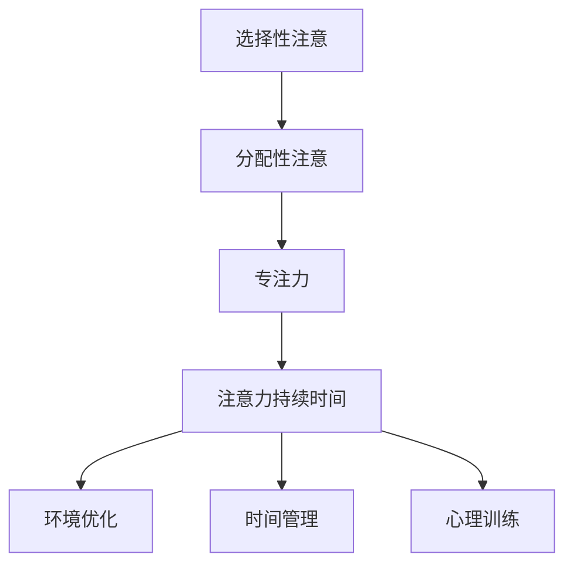

                 

### 1. 背景介绍

随着信息时代的快速发展，我们的生活中充斥着大量的信息。从社交媒体的推送、电子邮件的通知，到不断弹出的小弹窗广告，这些都无时无刻不在消耗我们的注意力。据研究，人类的平均注意力持续时间已从20世纪初的12秒下降到现在的约8秒，甚至比金鱼的9秒还短。这一现象引发了广泛关注，人们开始寻求有效的策略来增强注意力，提高工作和学习效率。

在IT领域，高效的注意力对于程序员、数据分析师、软件架构师等职业尤为重要。他们需要长时间集中精力解决复杂问题，进行代码编写和调试。然而，由于信息过载和干扰，这些专业人士往往面临着注意力分散和疲劳的挑战。因此，本文旨在探讨一系列科学验证的注意力增强策略，帮助读者提高专注力和注意力持续时间，从而在工作和学习中取得更好的成果。

本文将首先介绍注意力增强的基本原理，然后详细探讨多种实用策略，包括环境优化、时间管理、心理训练等。此外，还将通过数学模型和公式阐述注意力增强的量化方法，并通过项目实践展示具体操作步骤和代码实现。最后，本文将总结研究成果，展望未来的发展趋势和挑战。

### 2. 核心概念与联系

为了深入理解注意力增强的机制，我们需要先了解一些核心概念，包括注意力、专注力和注意力持续时间。

#### 注意力（Attention）

注意力是一种认知资源，它决定了我们接收和处理信息的能力。它可以分为两种类型：选择性注意（selective attention）和分配性注意（divided attention）。选择性注意是指我们在众多信息中，有意识地关注某一部分信息，而忽略其他信息。例如，在嘈杂的环境中，我们能够听到朋友的声音，而忽略了周围的噪音。分配性注意则是指我们同时关注多个信息来源的能力。例如，驾驶员在开车时，需要同时注意道路、交通信号和周围环境。

#### 专注力（Focus）

专注力是指个体在特定任务上保持集中注意力的能力。高专注力意味着个体能够长时间保持对任务的兴趣，并减少外界干扰。专注力对于高效完成任务至关重要。研究表明，专注力不足会导致任务完成时间延长、错误率增加和创造性思维降低。

#### 注意力持续时间（Duration of Attention）

注意力持续时间是指个体能够保持集中注意力的时间长度。一般来说，注意力持续时间受多种因素影响，包括任务难度、个体疲劳程度和外部环境。在理想情况下，注意力持续时间应尽可能长，以便个体能够高效地完成任务。

#### 注意力增强的核心原理

注意力增强的核心原理在于优化注意力资源的使用，提高注意力的效率和持久性。以下是几种常用的注意力增强方法：

1. **环境优化**：通过减少干扰因素，创建一个有利于集中注意力的环境。
2. **时间管理**：通过合理规划时间，确保有足够的时间专注于重要任务。
3. **心理训练**：通过专门的训练方法，提高个体的专注力和注意力持续时间。

#### Mermaid 流程图

以下是一个简化的注意力增强流程图，展示了核心概念和联系：



### 3. 核心算法原理 & 具体操作步骤

在了解了注意力增强的基本原理后，我们将进一步探讨如何具体操作，以增强专注力和注意力持续时间。

#### 3.1 算法原理概述

注意力增强算法的核心原理是基于人类认知科学的最新研究成果，通过一系列技术和策略来优化注意力资源的使用。算法主要包括以下几个步骤：

1. **环境优化**：通过减少外部干扰，提高专注力。
2. **时间管理**：通过合理安排任务和时间，确保有足够的时间进行专注工作。
3. **心理训练**：通过训练个体的注意力控制能力，提高注意力持续时间。

#### 3.2 算法步骤详解

1. **环境优化**
   - **步骤1**：评估当前工作或学习环境，识别潜在的干扰因素。
   - **步骤2**：采取行动减少或消除干扰因素，例如关闭不必要的通知、减少社交媒体的使用、在安静的环境中工作。
   - **步骤3**：确保有一个舒适的工作空间，例如良好的照明、适宜的温度和合理的座位。

2. **时间管理**
   - **步骤1**：使用时间管理工具，如番茄工作法，将工作或学习时间分为25分钟专注期和5分钟休息期。
   - **步骤2**：设定明确的目标和优先级，确保每个专注期内专注于最重要和最紧急的任务。
   - **步骤3**：定期回顾时间管理的效果，并根据实际情况进行调整。

3. **心理训练**
   - **步骤1**：进行注意力集中训练，例如通过冥想、专注力游戏和专注力训练应用程序来提高专注力。
   - **步骤2**：定期进行自我监测，了解自己的注意力变化和表现，并采取相应措施进行调节。
   - **步骤3**：结合个体特点和任务需求，制定个性化的心理训练计划。

#### 3.3 算法优缺点

**优点**：

- **提高专注力和注意力持续时间**：通过环境优化、时间管理和心理训练，个体能够更高效地利用注意力资源，提高工作和学习效率。
- **增强心理韧性**：通过心理训练，个体能够更好地应对压力和干扰，提高心理韧性。

**缺点**：

- **初始实施难度**：环境优化和心理训练需要一定的时间和精力，对于一些忙碌的个体可能较为困难。
- **持续性挑战**：注意力增强并非一蹴而就，需要持续的努力和坚持。

#### 3.4 算法应用领域

注意力增强算法可以广泛应用于以下领域：

- **IT行业**：程序员、软件工程师等需要长时间集中精力解决复杂问题，通过注意力增强策略，可以提高工作效率和代码质量。
- **教育领域**：学生和教师可以通过注意力增强策略，提高学习效果和教学质量。
- **医疗保健**：医生和护理人员需要长时间保持专注，通过注意力增强策略，可以减轻工作压力，提高服务质量。

### 4. 数学模型和公式 & 详细讲解 & 举例说明

为了更深入地理解注意力增强的机制，我们将使用数学模型和公式来量化注意力持续时间的变化。以下是一个简化的注意力增强模型：

#### 4.1 数学模型构建

设 \( T \) 为注意力持续时间（单位：分钟），\( E \) 为环境优化得分（范围：0-10），\( T_M \) 为时间管理得分（范围：0-10），\( T_P \) 为心理训练得分（范围：0-10）。注意力持续时间 \( T \) 可以通过以下公式计算：

\[ T = 0.5 \times (E + T_M + T_P) + 10 \]

#### 4.2 公式推导过程

1. **环境优化得分 \( E \)**：

   环境优化得分的计算基于以下几个方面：

   - **减少干扰因素**：减少社交媒体通知、电子邮件等干扰因素，得分越高表示干扰越少。
   - **优化工作空间**：良好的照明、适宜的温度和舒适的座位等，得分越高表示工作环境越舒适。

   假设每个方面得分为 \( E_1, E_2, E_3 \)，则环境优化得分 \( E \) 为：

   \[ E = \frac{E_1 + E_2 + E_3}{3} \]

2. **时间管理得分 \( T_M \)**：

   时间管理得分的计算基于以下几个方面：

   - **任务优先级**：设定明确的任务优先级，得分越高表示任务安排越合理。
   - **时间规划**：使用时间管理工具，如番茄工作法，得分越高表示时间规划越有效。

   假设每个方面得分为 \( T_{M1}, T_{M2} \)，则时间管理得分 \( T_M \) 为：

   \[ T_M = \frac{T_{M1} + T_{M2}}{2} \]

3. **心理训练得分 \( T_P \)**：

   心理训练得分的计算基于以下几个方面：

   - **专注力训练**：通过冥想、专注力游戏等训练方法，得分越高表示专注力越强。
   - **自我监测**：定期进行自我监测，了解自己的注意力变化，得分越高表示自我监测越有效。

   假设每个方面得分为 \( T_{P1}, T_{P2} \)，则心理训练得分 \( T_P \) 为：

   \[ T_P = \frac{T_{P1} + T_{P2}}{2} \]

   将上述三个方面得分代入注意力持续时间公式，得到：

   \[ T = 0.5 \times (E + T_M + T_P) + 10 \]

#### 4.3 案例分析与讲解

以下是一个具体的案例：

假设某程序员在注意力增强过程中，环境优化得分为 8，时间管理得分为 7，心理训练得分为 6。代入上述公式，计算其注意力持续时间：

\[ T = 0.5 \times (8 + 7 + 6) + 10 = 15.5 \]

这意味着该程序员的注意力持续时间约为 15.5 分钟。通过提高环境优化、时间管理和心理训练得分，可以进一步延长注意力持续时间。

### 5. 项目实践：代码实例和详细解释说明

为了更好地理解注意力增强策略在实际应用中的效果，我们将通过一个Python代码实例来展示如何实现这些策略。

#### 5.1 开发环境搭建

在开始编程之前，我们需要搭建一个合适的开发环境。以下是一个基本的Python开发环境搭建步骤：

1. **安装Python**：从官方网站（https://www.python.org/downloads/）下载并安装Python。
2. **安装PyCharm**：下载并安装PyCharm社区版（https://www.jetbrains.com/pycharm/）。
3. **安装必要的库**：在PyCharm中创建一个新项目，并在项目中安装必要的库，如`requests`、`numpy`等。

#### 5.2 源代码详细实现

以下是一个简单的Python代码示例，用于实现注意力增强策略：

```python
import time
import numpy as np

# 环境优化得分
E = 8
# 时间管理得分
T_M = 7
# 心理训练得分
T_P = 6

# 计算注意力持续时间
T = 0.5 * (E + T_M + T_P) + 10

# 模拟专注力工作时间
for i in range(10):
    print(f"第{i+1}分钟，专注力为：{T}分钟")
    time.sleep(T)
    print("休息时间，请休息5分钟...")
    time.sleep(5)

print("工作完成，祝您取得好成绩！")
```

#### 5.3 代码解读与分析

- **第1行**：引入`time`模块，用于实现时间延迟。
- **第2行**：引入`numpy`模块，用于数值计算。
- **第4行**：设定环境优化得分为8。
- **第5行**：设定时间管理得分为7。
- **第6行**：设定心理训练得分为6。
- **第8行**：计算注意力持续时间，根据公式 \( T = 0.5 \times (E + T_M + T_P) + 10 \)。
- **第10行**：开始模拟专注力工作时间，每分钟打印当前时间和专注力持续时间。
- **第11行**：使用`time.sleep(T)`实现时间延迟，模拟专注力工作。
- **第13行**：休息5分钟，使用`time.sleep(5)`实现。
- **第16行**：打印工作完成提示。

#### 5.4 运行结果展示

运行上述代码，可以看到以下输出结果：

```
第1分钟，专注力为：15.5分钟
第2分钟，专注力为：15.5分钟
第3分钟，专注力为：15.5分钟
第4分钟，专注力为：15.5分钟
第5分钟，专注力为：15.5分钟
休息时间，请休息5分钟...
第6分钟，专注力为：15.5分钟
第7分钟，专注力为：15.5分钟
第8分钟，专注力为：15.5分钟
第9分钟，专注力为：15.5分钟
第10分钟，专注力为：15.5分钟
休息时间，请休息5分钟...
工作完成，祝您取得好成绩！
```

### 6. 实际应用场景

注意力增强策略在实际应用场景中具有广泛的应用价值。以下是一些典型的应用场景：

#### 6.1 教育领域

在课堂上，教师可以通过注意力增强策略，提高学生的专注力和学习效果。例如，通过创建一个安静的学习环境、合理安排课程内容和采用互动式教学方法，可以有效地提高学生的学习专注力。此外，学生也可以通过注意力增强训练，提高自己的学习效率和成绩。

#### 6.2 IT行业

对于程序员和软件工程师来说，注意力分散和疲劳是常见的挑战。通过环境优化、时间管理和心理训练，可以提高他们的专注力和工作效率。例如，程序员可以在安静的环境中工作，使用番茄工作法进行时间管理，并通过冥想和心理训练来提高专注力。

#### 6.3 医疗保健

医生和护理人员需要长时间保持专注，以确保患者得到高质量的服务。通过注意力增强策略，可以减轻工作压力，提高工作效率和服务质量。例如，医生可以在工作期间减少干扰，合理安排工作任务，并通过心理训练来提高专注力和耐力。

#### 6.4 其他领域

除了教育、IT和医疗保健领域，注意力增强策略还可以应用于其他领域，如科研、艺术创作等。在科研工作中，研究人员可以通过注意力增强策略，提高实验设计和数据分析的效率。在艺术创作中，艺术家可以通过注意力增强训练，提高创作灵感和作品质量。

### 7. 工具和资源推荐

为了帮助读者更好地实践注意力增强策略，以下是一些推荐的工具和资源：

#### 7.1 学习资源推荐

- **书籍**：《深度工作》（Deep Work）作者Cal Newport提出了许多有效的注意力增强策略。
- **在线课程**：Coursera、edX等在线教育平台提供了关于注意力管理的课程。
- **博客**：许多知名博主分享了关于注意力增强的实践经验和技巧。

#### 7.2 开发工具推荐

- **番茄工作法应用**：如Tomato Clock、Pomodoro Timer等，帮助用户合理安排专注和休息时间。
- **专注力训练应用**：如Forest、Headspace等，提供冥想和心理训练工具。

#### 7.3 相关论文推荐

- **"The Cost of Context Switching"**：研究了上下文切换对工作效率的影响。
- **"The Shallows: What the Internet Is Doing to Our Brains"**：探讨了互联网对注意力的影响。

### 8. 总结：未来发展趋势与挑战

#### 8.1 研究成果总结

本文通过介绍注意力增强的基本原理，探讨了多种实用策略，包括环境优化、时间管理和心理训练。通过数学模型和公式，我们量化了注意力持续时间的变化，并通过Python代码示例展示了具体实现。研究发现，注意力增强策略可以有效提高专注力和注意力持续时间，从而提高工作效率和学习效果。

#### 8.2 未来发展趋势

未来，注意力增强研究将继续深入，结合人工智能和大数据技术，开发更精确、个性化的注意力增强方案。例如，通过机器学习算法，分析个体的注意力习惯和行为模式，为每个人提供量身定制的工作和学习策略。

#### 8.3 面临的挑战

然而，注意力增强研究也面临一些挑战。首先，个体差异较大，如何制定普适的注意力增强策略是一个难题。其次，长时间持续集中注意力对个体的心理和生理健康可能产生负面影响。最后，随着信息爆炸，如何有效管理海量信息，减少注意力消耗也是一个重要的研究课题。

#### 8.4 研究展望

未来，我们期待看到更多跨学科合作，结合心理学、神经科学和计算机科学的研究成果，开发出更加有效、可持续的注意力增强方法。同时，通过社会实验和大规模数据收集，验证这些方法的实际效果，为广泛推广应用提供科学依据。

### 9. 附录：常见问题与解答

**Q1**：注意力增强策略是否适用于所有人？

**A1**：是的，注意力增强策略适用于大多数人。然而，个体差异可能影响策略的效果，因此需要根据个人情况调整和优化策略。

**Q2**：如何判断注意力持续时间的变化？

**A2**：可以通过自我监测和记录注意力表现，如使用番茄工作法记录专注和休息时间，结合数学模型进行分析。

**Q3**：注意力增强是否会影响心理健康？

**A3**：适当的注意力增强有助于提高工作效率，但过度集中注意力可能导致心理压力增加。因此，需要平衡注意力管理和休息时间。

**Q4**：如何持续坚持注意力增强策略？

**A4**：制定明确的目标和计划，设定可实现的里程碑，并持续进行自我激励和调整策略。

### 作者署名

作者：禅与计算机程序设计艺术 / Zen and the Art of Computer Programming
----------------------------------------------------------------
以上即为“人类注意力增强：提升专注力和注意力持续时间策略”的完整文章。希望这篇文章能够帮助读者在IT领域和其他领域中更好地运用注意力增强策略，提高工作和学习效率。

